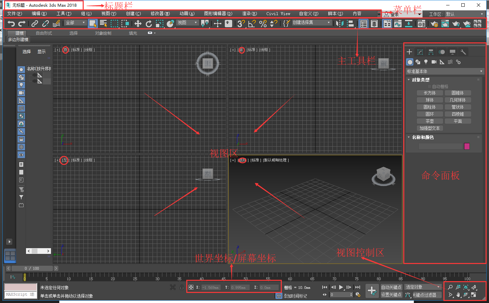

> 参考：我要自学网《3D2018室内设计教程》

# 3D-MAX 基础

## 环境搭建

### 硬件配置要求

- 操作系统要求：Win7(64位)、Win8(64位) 、Win10(64位)操作系统
- CPU（处理器）要求：CPU与渲染输出的速度有关，最低要求64位intelI5、I7、双核主机。
- 内存要求：渲染输出速度也与内存有关，最低要求4GB内存以上（推荐使用8GB）
- 硬盘要求：500GB
- 显卡要求：显卡和实时操作的流畅度有关，最低要求独立显卡

### 安装

1. 下载正版Auto 3D MAX 2018以及注册机
2. 断开网络
3. 安装 Auto 3D MAX 2018 ，运行
4. 弹出界面点击“Enter a Serial Number”
5. 使用序列号 066-66666666 秘钥128J1，点NEXT
6. 复制REQUEST CODE请求码
7. 管理员身份运行注册机
8. 点击PATCH获得补丁
9. 复制请求代码到注册机的REQUEST框，点击GENERATE破解，获得激活码
10. 回到3D MAX界面，点击“I have an activation…….”将生成的激活码复制到入内，点击NEXT，完成激活
11. 桌面3ds Max 2018默认为英文版本，我们需要在开始菜单Autodesk》Autodesk 3ds Max 2018》运行一次“3ds Max 2018 - Simplified Chinese”即可为简体中文，其他语言同理。

## 工作界面

- **工作界面**

    
  
- **界面优化**

  - 关闭欢迎界面
  - `自定义` - `自定义UI与默认设置切换器` - `工具选项的初始设置` - `MAX`
  - `自定义` - `单位设置` - `公制` - `毫米`
  - `自定义` - `单位设置` - `系统单位设置` - `1单位=1.0毫米`
  - `自定义` - `首选项` - `文件` - `保存时压缩`
  - `自定义` - `首选项` - `文件` - `自动保存时间`
  - `工具栏` - 关闭 `层资源管理器` `场景资源管理器` `功能区`
  - 拖动视口布局选项卡，关闭
  - `自定义` - `锁定UI布局`
  - 视图控制区右键 - `布局` - 选择 `相应视图组合`
  - 视图控制区右键 - `ViwCube` - 取消显示 `ViwCube`
  - G关闭栅格

# 3D 快捷键

- **鼠标中键**

    - `按住中键不放` 移动视图
    - `滚动中键` 放大和缩小视图
    - `Alt + 鼠标中键` 自由旋转

Z：选择视图最大化显示。

Shift+Ctrl+Z：所有视图最大化显示。

Alt+W：最大化显示所选窗口。

F3：物体切换线框或实体。

F4：物体外围是否显示线框。

G：栅格

T：顶视图

F：前视图

L：左视图

P：透视图
