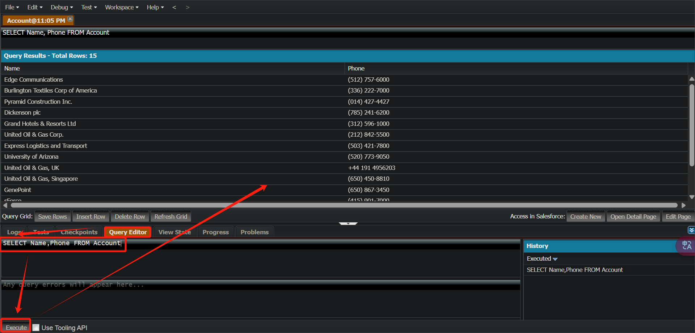

Apex is a **strongly-typed**, **object-oriented** programming language developed by Salesforce for building applications on the Salesforce platform. It is similar to Java and C# in syntax.

The key features of Apex:

- **Hosted**: Apex is saved, compiled, and executed on the server—the Lightning Platform.
- **Object oriented**: Apex supports classes, interfaces, and inheritance.
- **Strongly typed**: Apex validates references to objects at compile time.

Apex 是 Salesforce 提供的一种**强类型**、**面向对象**编程语言，专门用于在 Salesforce 平台 上进行后端逻辑开发，它的语法类似于 Java。

# Apex 基础

## 运行环境

- **Developer Console**: **Quick access menu ()** | **Developer Console**
- **IDE**

## 代码规范

- 同编程语言通用规范

## 标识符

- 同编程语言通用规范

## 注释

- **单行注释**：Ctrl + /    **多行注释**：Ctrl + Shift + /

    ```java
    public class HelloWorld {
        // 这是一个单行注释
        public static void main(String[] args) {
            /*
             * 多行注释第一行
             * 多行注释第二行
             * 多行注释第三行
             */
            System.debug('Hello World'); 
        }
    }
    ```

- **文档注释**

    文档注释以 **/\**** 开始，以 ***/** 结束，通常出现在类、方法、字段等的声明前面，通常包含一些特定的标签，如 **@param** 用于描述方法参数，**@return** 用于描述返回值，**@throws** 用于描述可能抛出的异常等等。文档注释的格式这些标签有助于生成清晰的API文档，以便其他开发者能够更好地理解和使用你的代码。

    ```java
    /**
     * 这是一个文档注释示例
     * 它通常包含有关类、方法或字段的详细信息
     */
    public class MyClass {
        // 类的成员和方法
    }
    ```

## 声明变量

- **声明基本类型变量**

    ```java
    数据类型 变量名 = 初始值;
    ```

    ```java
    Integer myInteger = 10;  // 声明一个整数并赋初值
    ```

- **声明数组类型变量**

    ```java
    String[] colors = new List<String>();
    ```

- **声明集合类型变量**

    ```java
    集合类型<数据类型> 变量名 = new 集合类型<数据类型>();
    ```

    ```java
    List<String> myList = new List<String>();   // 声明一个 String 类型的列表
    Set<Integer> mySet = new Set<Integer>();    // 声明一个 Integer 类型的集合
    Map<String, Integer> myMap = new Map<String, Integer>(); // 声明一个 Map，键为 String，值Integer
    ```

- **声明自定义对象类型变量**

    ```java
    对象类型 变量名 = new 对象类型(字段 = 字段的值);
    ```

    ```java
    Account myAccount = new Account(Name = 'Acme Corp');  // 声明一个 Account 对象并初始化
    ```

## 输入与输出

- **输出**

    ```java
    System.debug('这是要输出的信息');
    ```

# 数据类型

在 Apex 中，数据类型可以分为两大类：

- **原始数据类型**（Primitive Data Types）
- **引用数据类型**（Reference Data Types）

## 原始数据类型

Apex 中有10种原始数据类型。

### 整数类型

- **`Integer`**：32 位有符号整数，取值范围：-2^31 到 2^31 - 1（大约 -21 亿 到 21 亿）。

- **`Long`**：64 位有符号整数，适用于大数字。

- **`Decimal`**：用于高精度计算，常用于处理货币和财务数据。

### 浮点数类型

- **`Double`**：64 位双精度浮点数，适用于存储较大的浮动数值。

### 字符类型

- **`Char`**：用于存储单个字符，只有一个字符的 Unicode 编码。
- 使用单引号 `'` 标记字符。

### 字符串类型

- **`String`**：用于存储一串字符，类似于 Java 中的 `String` 类型。
- Apex 中使用单引号 `'` 标记字符串。

### 布尔类型

- **`Boolean`**：用于表示逻辑值，可以是 `true` 或 `false`。

### 日期和时间类型

- **`Date`**：只包含日期（年月日）。

- **`Datetime`**：包含日期和时间（年月日 时分秒）。

### ID 类型

- **`ID`**：用于存储 Salesforce 中的记录的唯一标识符，例如 `Account`、`Contact`、`Opportunity` 等对象的记录 ID。

## 引用数据类型

引用数据类型是指存储对象的引用而不是数据本身。Apex 的引用数据类型包括类、接口、数组、集合以及 Salesforce 特有的 SObject 类型。

### SObject 类型

`sObject` 是一种通用对象类型，它可以是标准对象（如 `Account`, `Contact`, `Opportunity`）或自定义对象（通过 Salesforce 的自定义对象功能创建）。在 Apex 中，所有的对象（无论是标准对象还是自定义对象）都是从 `sObject` 类派生出来的。

- 创建 sObject

    ```java
    Account acct = new Account(Name='Acme');
    ```

- 添加 field

    ```java
    Account acct = new Account(Name='Acme', Phone='(415)555-1212', NumberOfEmployees=100);
    ```

    ```java
    Account acct = new Account();
    acct.Name = 'Acme';
    acct.Phone = '(415)555-1212';
    acct.NumberOfEmployees = 100;
    ```


### 数组类型

数组用于存储一组不同类型的元素。Apex 中的数组可以存储对象、基本数据类型等。

### 集合类型

Apex 中的集合类型包括 **`List`**、**`Set`** 和 **`Map`**。这些集合类型用于存储多个数据项。

- **`List`**：有序集合，允许存储重复元素。
- **`Set`**：无序集合，不允许重复元素。
- **`Map`**：键值对集合，通过键来快速查找值。

### 类和对象

Apex 支持面向对象编程，可以创建类并实例化对象。

### 接口类型

Apex 支持接口（`interface`），可以定义一些方法，然后让类去实现这些方法。

### 枚举类型

Apex 支持枚举（`enum`），枚举用于表示一组常量。

# 选择结构

Apex 中有 `if`、`switch` 和 `三元表达式` 三种选择结构。

## if 语句

- Apex 中 `if` 语句的语法格式与 Java 相同。

## switch 语句

- Apex 的 `switch` 语句类似于 Java，但语法稍有不同。
    - Apex 使用 `switch on` 进行变量匹配.
    - Apex 使用 `when` 关键字代替 Java 的 `case`。
    - Apex 的 `switch` 不会发生 Java 中的 Fall-through（贯穿），每个 `when` 代码块都是独立的，不需要 `break`。
    - Apex 使用 `when else` 关键字代替 Java 的 `default`。

- **语法**

    ```java
    switch on 条件值 {
        when 值1 {
            // 执行代码
        }
        when 值2 {
            // 执行代码
        }
        when else {
            // 处理默认情况（类似 Java 的 default）
        }
    }
    ```

    ```java
    String status = 'Processing';
    
    switch on status {
        when 'New' {
            System.debug('订单是新的');
        }
        when 'Processing' {
            System.debug('订单正在处理中');
        }
        when 'Completed' {
            System.debug('订单已完成');
        }
        when else {
            System.debug('未知订单状态');
        }
    }
    ```

- **多值匹配**

    ```java
    Integer day = 6;
    
    switch on day {
        when 1, 2, 3, 4, 5 {
            System.debug('工作日');
        }
        when 6, 7 {
            System.debug('周末');
        }
        when else {
            System.debug('未知');
        }
    }
    ```

## 三元表达式

- Apex 的三元表达式语法和 Java 相同，但 **适用范围** 和 **类型推导** 上有一些不同。

# 循环结构

- Apex 中有 `for` 、`for-each`、`while`  和 `do-while` 四种循环结构，用法同 Java。
- Apex 中支持**无限循环**和**循环嵌套**，用法同 Java。

# 跳转结构

- Apex 中有 `continue`、`break`、`return`、`throw`、`throws` 五种跳转结构，用法同 Java。

# [Contact](https://developer.salesforce.com/docs/atlas.en-us.object_reference.meta/object_reference/sforce_api_objects_contact.htm?_ga=2.145375476.1561775477.1741324952-529724583.1741324952)

Contact sObject 的 Name 字段是一个[复合字段](https://developer.salesforce.com/docs/atlas.en-us.object_reference.meta/object_reference/compound_fields.htm)。它是 Contact 的 FirstName、LastName、MiddleName 和 Suffix 字段的串联。

# [DML](https://trailhead.salesforce.com/content/learn/modules/apex_database/apex_database_dml?trail_id=force_com_dev_beginner)

在 Salesforce 中，**DML**（数据操作语言，Data Manipulation Language）用于操作 Salesforce 数据库中的记录。

- 插入数据

    ```java
    Account newAccount = new Account(Name = 'New Account');
    insert newAccount;
    ```


- `insert`：插入新记录
- `update`：更新已有记录
- `upsert`：有记录则更新，无记录则创建
- `delete`：删除
- `undelete`：还原
- `merge`：合并至多三个记录到其中一个记录

## [Insert](https://trailhead.salesforce.com/content/learn/modules/apex_database/apex_database_dml)

- **语法**

    ```java
    // Create the account sObject
    Account acct = new Account(Name='Acme', Phone='(415)555-1212', NumberOfEmployees=100);
    // Insert the account by using DML
    insert acct;
    ```

## [Upsert](https://trailhead.salesforce.com/content/learn/modules/apex_database/apex_database_dml)

- **语法**

    ```java
    upsert $SOBJECT Account.Fields.$FIELD_NAME;
    ```
    
    ```java
    Contact jane = new Contact(FirstName='Jane',
                             LastName='Smith',
                             Email='jane.smith@example.com',
                             Description='Contact of the day');
    insert jane;
    
    Contact jane2 = new Contact(FirstName='Jane',
                             LastName='Smith',
                             Email='jane.smith@example.com',
                             Description='Prefers to be contacted by email.');
    
    upsert jane2 Contact.fields.Email;
    // Verify that the contact has been updated
    System.assertEquals('Prefers to be contacted by email.',
                       [SELECT Description FROM Contact WHERE Id=:jane.Id].Description);
    ```

## [Delete](https://trailhead.salesforce.com/content/learn/modules/apex_database/apex_database_dml)

- **语法**

    ```java
    Contact[] contactsDel = [SELECT Id FROM Contact WHERE LastName='Smith'];
    delete contactsDel;
    ```

## [获取 ID](https://trailhead.salesforce.com/content/learn/modules/apex_database/apex_database_dml)

插入记录时，系统会为每条记录分配一个 ID。除了在数据库中保留 ID 值外，ID 值还会自动填充到您在 DML 调用中用作参数的 sObject 变量上。

- **语法**

    ```java
    Account acct = new Account(Name='Acme', Phone='(415)555-1212', NumberOfEmployees=100);
    insert acct;
    
    // Get the new ID on the inserted sObject argument
    ID acctID = acct.Id;
    // Display this ID in the debug log
    System.debug('ID = ' + acctID);
    // Debug log result (the ID will be different in your case)
    // DEBUG|ID = 001D000000JmKkeIAF
    ```

## [批量处理](https://trailhead.salesforce.com/content/learn/modules/apex_database/apex_database_dml)

- 批量处理有助于节约资源。

- **语法**

    ```java
    List<Contact> conList = new List<Contact> {
        new Contact(FirstName='Joe',LastName='Smith',Department='Finance'),
            new Contact(FirstName='Kathy',LastName='Smith',Department='Technology'),
            new Contact(FirstName='Caroline',LastName='Roth',Department='Finance'),
            new Contact(FirstName='Kim',LastName='Shain',Department='Education')};
    // Bulk insert all contacts with one DML call
    insert conList;
    // List to hold the new contacts to update
    List<Contact> listToUpdate = new List<Contact>();
    // Iterate through the list and add a title only
    //   if the department is Finance
    for(Contact con : conList) {
        if (con.Department == 'Finance') {
            con.Title = 'Financial analyst';
            // Add updated contact sObject to the list.
            listToUpdate.add(con);
        }
    }
    // Bulk update all contacts with one DML call
    update listToUpdate;
    ```

## [异常处理](https://trailhead.salesforce.com/content/learn/modules/apex_database/apex_database_dml)

- **语法**

    ```java
    try {
        // This causes an exception because
        //   the required Name field is not provided.
        Account acct = new Account();
        // Insert the account
        insert acct;
    } catch (DmlException e) {
        System.debug('A DML exception has occurred: ' +
                    e.getMessage());
    }
    ```

## [Database Methods](https://trailhead.salesforce.com/content/learn/modules/apex_database/apex_database_dml)

- Apex 包含内置的 Database 类，该类提供的方法可代替对应的 DML 语句。

    - `Database.insert()`

    - `Database.update()`

    - `Database.upsert()`

    - `Database.delete()`

    - `Database.undelete()`

    - `Database.merge()`

    - 例如，以下方法等效于 `insert recordList;` 语句。

        ```java
        Database.insert(recordList);
        ```

- **allOrNone**

    - Database 方法具有可选的 allOrNone 参数，该参数允许您指定操作是否可以部分成功。
    - 该参数默认为 `true`，即**不提交**成功的记录，并且任何记录发生错误时，立即返回失败记录的错误；等同于正常流程的 DML 语句。
    - 当该参数设置为 `false` 时，**提交**成功的记录，并且如果部分记录发生错误，则返回失败记录的错误；这是 Database 方法和 DML 语句的区别。
    - 此外，partial success 选项不会引发异常。
    - 以下是调用 `insert` 方法，并将 allOrNone 设置为 `false`。

        ```java
        Database.insert(recordList, false);
        ```

- database 的返回值

    - Database 方法会返回一个对象，这个对象包含每条记录的成功或失败的信息。
    - Insert 返回 `Database.SaveResult` 对象；
    - Upsert 返回 `Database.UpsertResult` 对象；
    - Delete 返回 `Database.DeleteResult` 对象。
    - 例如，insert 返回 `Database.SaveResult` 对象的数组。

        ```java
        Database.SaveResult[] results = Database.insert(recordList, false);
        ```

- **综合示例**：使用 Database 方法，并且有一条记录会返回错误信息。

    ```java
    // Create a list of contacts
    List<Contact> conList = new List<Contact> {
            new Contact(FirstName='Joe',LastName='Smith',Department='Finance'),
            new Contact(FirstName='Kathy',LastName='Smith',Department='Technology'),
            new Contact(FirstName='Caroline',LastName='Roth',Department='Finance'),
            new Contact()};
    
    // Bulk insert all contacts with one DML call
    Database.SaveResult[] srList = Database.insert(conList, false);
    
    // Debug logs: Iterate through each returned result
    for (Database.SaveResult sr : srList) {
        if (sr.isSuccess()) {
            // Operation was successful, so get the ID of the record that was processed
            System.debug('Successfully inserted contact. Contact ID: ' + sr.getId());
        } else {
            // Operation failed, so get all errors
            for(Database.Error err : sr.getErrors()) {
                System.debug('The following error has occurred.');
                System.debug(err.getStatusCode() + ': ' + err.getMessage());
                System.debug('Contact fields that affected this error: ' + err.getFields());
    	 }
        }
    }
    ```

## [使用相关记录](https://trailhead.salesforce.com/content/learn/modules/apex_database/apex_database_dml)

### Insert Related Records

- **示例**

    ```java
    Account acct = new Account(Name='SFDC Account');
    insert acct;
    // Once the account is inserted, the sObject will be populated with an ID.
    // Get this ID.
    ID acctID = acct.ID;
    // Add a contact to this account.
    Contact mario = new Contact(
        FirstName='Mario',
        LastName='Ruiz',
        Phone='415.555.1212',
        AccountId=acctID);
    insert mario;
    ```

### Update Related Records

- **示例**

    ```java
    // Query for the contact, which has been associated with an account.
    Contact queriedContact = [SELECT Account.Name
                              FROM Contact
                              WHERE FirstName = 'Mario' AND LastName='Ruiz'
                              LIMIT 1];
    // Update the contact's phone number
    queriedContact.Phone = '(415)555-1213';
    // Update the related account industry
    queriedContact.Account.Industry = 'Technology';
    // Make two separate calls
    // 1. This call is to update the contact's phone.
    update queriedContact;
    // 2. This call is to update the related account's Industry field.
    update queriedContact.Account;
    ```

### Delete Related Records

- 该操作会串联删除父记录以下的所有子记录。

- **示例**：此示例会删除该 Account 和其相关的 Contact。

    ```java
    Account[] queriedAccounts = [SELECT Id FROM Account WHERE Name='SFDC Account'];
    delete queriedAccounts;
    ```

    

# [SOQL](https://trailhead.salesforce.com/content/learn/modules/apex_database/apex_database_soql?trail_id=force_com_dev_beginner)

**SOQL** (**S**alesforce **O**bject **Q**uery **L**anguage) 是 Salesforce 专有的查询语言，用于从 Salesforce 数据库中检索数据。它类似于 SQL，但专门用于 Salesforce 平台的数据结构。SOQL 可以内嵌在 Apex 代码中，即**内联 SOQL**。

## 注释

- SOQL 不支持 SQL 中的注释。

- SOQL **本身不支持注释**，在 Apex 代码中用 `//` 或 `/* ... */` 记录注释。

    ```sql
    // 这是一个 Apex 代码中的 SOQL 查询
    List<Account> accounts = [ 
        SELECT Id, Name FROM Account
        // WHERE Name = 'Acme'  -- 这里不能直接使用 SOQL 注释
    ];
    ```

## 运行环境

- **Setup Menu** > **Developer Console** > **Query Editor**

    

## SOQL 基础

- SOQL 绝大部分语法与 SQL 相同。
    - WHERE
    - ORDER
    - LIMIT
- **不同点**
    - SOQL 不能为所有字段指定 `*`。

- **基本内联 SOQL 示例**：即将 SOQL 语句内嵌在 Apex 语法中。将 SOQL 语句括在方括号中，并使用 sObject 数组接收返回值。

    ```java
    Account[] accts = [SELECT Name,Phone FROM Account];
    ```

## 引用变量

- Apex 中的 SOQL 语句可以引用 Apex 代码变量和表达式；

- **语法**：在变量前加冒号 `:`

    ```java
    String targetDepartment = 'Wingo';
    Contact[] techContacts = [SELECT FirstName,LastName
                              FROM Contact WHERE Department=:targetDepartment];
    ```


## 查询相关记录

### 根据 Account Name 查询 Contact 姓名

- **示例**

    ```java
    Account[] acctsWithContacts = [SELECT Name, (SELECT FirstName,LastName FROM Contacts)
                                   FROM Account
                                   WHERE Name = 'SFDC Computing'];
    // Get child records
    Contact[] cts = acctsWithContacts[0].Contacts;
    System.debug('Name of first associated contact: '
                 + cts[0].FirstName + ', ' + cts[0].LastName);
    ```

- **查询目的**：从 `Account` 对象中筛选出 `Name` 为 **SFDC Computing** 的 Account 对象，同时获取与这些 Account 关联的 `Contact` 的 `FirstName` 和 `LastName`。

- `(SELECT FirstName,LastName FROM Contacts)`

    - 括号里的 SELECT 是一个内部子查询，子查询在父查询的结果基础上运行。
    - 内部子查询的 `FROM Contacts` 子句针对关系名称运行，而不是针对 Salesforce 对象名称运行。
    - 也就是说，内部子查询的 Contacts 只是 Name 为 **SFDC Computing** 的 Account 关联的所有 Contact 对象，而不是整个 Salesforce 的 Contact 对象。

- **结果存储**：查询结果存储在 `acctsWithContacts` 数组中，数组中的每个元素都是一个 `Account` 对象，每个 `Account` 对象包含一个 `Contacts` 集合，该集合包含了与该账户关联的所有联系人记录。

### 根据 Contact 姓名查询 Account Name

- **示例**

    ```java
    Contact[] cts = [SELECT Account.Name FROM Contact
                     WHERE FirstName = 'Carol' AND LastName='Ruiz'];
    Contact carol = cts[0];
    String acctName = carol.Account.Name;
    System.debug('Carol\'s account name is ' + acctName);
    ```

- **查询目的**：从 `Contact` 对象中筛选出 `FirstName` 为 **Carol** 且 `LastName` 为 **Ruiz** 的 Contact 对象，同时获取这些 Contact  对象关联的 `Account` 对象的 `Name` 字段值。

- `SELECT Account.Name`，这里的 Account 是 Contact 的一个字段，这个字段会关联到 Contact 对应的 Account。

- 整个第一条语句返回的是一个包含多个 Contact 对象的数组，每个对象里包含了 Account 字段，Account 字段又有 Name 字段。

    ```
    [
        {
            "Id": "003000000123456",
            "Account": {
                "Name": "ABC 公司"
            }
        },
        {
            "Id": "003000000789012",
            "Account": {
                "Name": "XYZ 企业"
            }
        }
    ]
    ```

# [SOSL](https://trailhead.salesforce.com/content/learn/modules/apex_database/apex_database_sosl?trail_id=force_com_dev_beginner)

**SOSL**（**S**alesforce **O**bject **S**earch **L**anguage）是 Salesforce 平台提供的一种强大的搜索语言，用于在多个对象中进行跨对象的全文搜索。SOSL 类似于 Apache Lucene。

- SOSL 则用于在**多个**对象和字段中快速搜索特定的文本字符串，而SOQL 主要用于查询**单个**对象或对象之间的关系。
- SOSL 默认是一种**模糊**搜索，而 SOQL 默认是一种精准搜索。比如搜索 Digital：
    - SOSL：Digital | The Digital Company
    - SOQL：Digital

## 运行环境

- 同 SOQL：**Setup Menu** > **Developer Console** > **Query Editor**

## 语法结构

SOSL 的基本语法结构如下：在 Query Editor 和 API 中，语法略有不同

```sql
// 在 Query Editor 中
FIND {SearchQuery} [IN SearchGroup] [RETURNING ObjectsAndFields]
```

```sql
// 在 API 中
FIND 'SearchQuery' [IN SearchGroup] [RETURNING ObjectsAndFields]
```

SOSL 内嵌在 Apex 的示例如下：

```java
List<List<SObject>> searchList = [FIND 'SFDC' IN ALL FIELDS
                                      RETURNING Account(Name), Contact(FirstName,LastName)];
```

## SearchQue

- 如果搜索的是两个单词，字段中包含这两个单词即可。
    - 例如搜索 `The Query`，可以搜索到 `Account: The SFDC Query Man`
- 可以使用逻辑运算符（AND、OR）和括号进行分组。
- 文本搜索不区分大小写。
- 通配符
    - `*`：匹配搜索词中间或末尾的**任意个**字符
    - `?`：匹配搜索词中间或末尾的**一个**字符

## SearchGroup

- SearchGroup 是要搜索的字段的范围。
- 它是可选的，如果未指定，则默认搜索范围为 all fields。
- 可以采用以下值之一
    - `ALL FIELDS` `所有字段`
    - `NAME FIELDS` `名称字段`
    - `EMAIL FIELDS` `电子邮件字段`
    - `PHONE FIELDS` `电话字段`
    - `SIDEBAR FIELDS` `侧边栏字段`

## ObjectsAndFields

- ObjectsAndFields 是要在搜索结果中返回的信息，一个或多个 sObject 的列表，以及每个 sObject 中一个或多个字段的列表，其中包含要筛选的可选值。
- 它是可选的，如果未指定，则搜索结果包含找到的所有对象的 ID。

## 其它

- SOSL 同样具有 SQL 的如下功能。
    - WHERE
    - ORDER
    - LIMIT
    - 引用变量（详见 SOQL）
