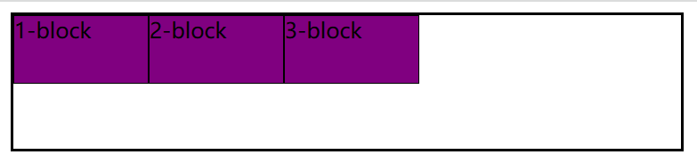
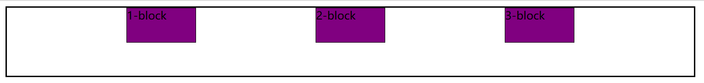
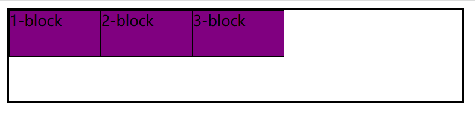
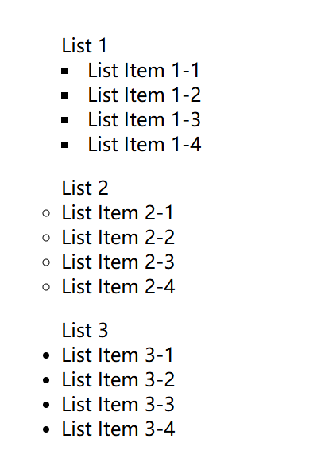
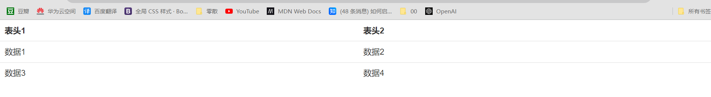

# [CSS](https://developer.mozilla.org/zh-CN/docs/Glossary/CSS)

**CSS**（**C**ascading **S**tyle **S**heets，层叠样式表），是一种用来为结构化文档（如 HTML 文档或 XML 应用）添加样式（字体、间距和颜色等）的**样式表语言**；CSS 文件的扩展名为 `.css`。

## CSS 资源

> [W3C 官方文档](https://www.w3.org/Style/CSS/current-work "W3C")
>
> [MDN 参考](https://developer.mozilla.org/zh-CN/docs/Web/CSS/Reference)
>
> <details>
>   <summary>
>     <a
>       href="https://developer.mozilla.org/zh-CN/docs/Web/CSS"
>       alt="MDN CSS"
>       title="MDN CSS"
>       >MDN CSS</a
>     >：MDN 关于 CSS 的主页面
>   </summary>
>   <ul>
>     <li>
>       <a
>         href="https://developer.mozilla.org/zh-CN/docs/Learn/Getting_started_with_the_web/CSS_basics"
>         alt="CSS 基础"
>         >CSS 基础</a
>       >：了解 CSS 的含义和最基本用法
>     </li>
>     <li>
>       <a
>         href="https://developer.mozilla.org/zh-CN/docs/Learn/CSS"
>         alt="CSS 学习区"
>         >CSS 学习区</a
>       >：学习 CSS 基础知识
>     </li>
>     <li>
>       <a href="https://developer.mozilla.org/zh-CN/docs/Web/CSS/Reference"
>         >CSS 参考</a
>       >
>     </li>
>   </ul>
> </details>

## CSS 注释

- 单行注释：Ctrl + /    多行注释：Ctrl + Shift + /

    ``` css
    .demo{
      /* 这是一个单行注释 */
    
      /*多行注释第一行
      多行注释第二行
      多行注释第三行*/
    }
    ```

## [CSS 规则集](https://developer.mozilla.org/zh-CN/docs/Learn/Getting_started_with_the_web/CSS_basics#“css_规则集”详解)

- CSS 由一系列规则集组成。
- **规则集结构**

    

    **规则集主要部分有**：

    1. [**选择器**（Selector）](https://developer.mozilla.org/zh-CN/docs/Learn/Getting_started_with_the_web/CSS_basics#选择器（selector）)：用于指定为哪种元素添加样式，多个选择器使用 `,` 分隔。
    2. [**声明**（Declaration）](https://developer.mozilla.org/zh-CN/docs/Learn/Getting_started_with_the_web/CSS_basics#声明（declaration）)：即属性名值对，用大括号 `{}` 包含声明，属性与属性值用冒号 `:` 分隔，声明用 `;` 结尾。
    3. [**属性**（Properties）](https://developer.mozilla.org/zh-CN/docs/Learn/Getting_started_with_the_web/CSS_basics#属性（properties）)：用于指定改变元素的哪种样式
    4. [**属性值**（Property value）](https://developer.mozilla.org/zh-CN/docs/Learn/Getting_started_with_the_web/CSS_basics#属性的值（property_value）)：用于指定元素样式的值，一个声明里含多个属性值用 `空格` 分隔。

## 引入方式

- **语法**：实际上 CSS 就是 HTML 元素的 **`style` 属性**，对于 HTML 而言，CSS 可以有不同的引入方式。
- **内联样式**：元素内部直接使用 `style` 属性定义样式。

    ```html
    <p style="color: red; font-size: 24px;">这是一段红色的文本。</p>
    ```

- **内部样式表**：将 CSS 规则集放到 HTML 文档 `<head>` 中的 `<style>` 元素中。

    ```html
    <head>
    <style>
      p {
        color: red;
        font-size: 24px;
      }
    </style>
    </head>

    <body>
    <p>这是一段红色的文本。</p>
    <style>
      p {
        color: red;
        font-size: 24px;
      }
    </style>
    </body>
    ```

- **外部样式表**：在 HTML 文档的 `<head>` 中使用 `<link>` 元素引入外部 **CSS 文档**。

    ```html
    <head>
      <link rel="stylesheet" href="styles.css">
    </head>
    <body>
      <p>这是一段红色的文本。</p>
    </body>
    ```

    ```css
    p {
      color: red;
      font-size: 24px;
    }
    ```

- **[导入](https://developer.mozilla.org/zh-CN/docs/Web/CSS/@import)**：在 CSS 文档中使用 `@import` 导入另一个 **CSS 文档**

    ```css
    @import 'github-night.css';
    ```

# [数据类型](https://developer.mozilla.org/zh-CN/docs/Web/CSS/CSS_Types)

## [数字 `<number>`](https://developer.mozilla.org/zh-CN/docs/Web/CSS/number)

- **语法**：数据类型 `<number>` 表示一个数字。

- **数字示例**

    ```
    12          原始的 <integer> 也是 <number>。
    4.01        正分数
    -456.8      负分数
    0           零
    0.0         零
    +0.0        带 + 号的零
    -0.0        带 - 号的零
    .60         不带零的小数
    10e3        科学计数法
    -3.4e-2     复杂的科学记数法
    ```

## [长度值 `<length>`](https://developer.mozilla.org/zh-CN/docs/Web/CSS/length)

### [长度值 `<length>`](https://developer.mozilla.org/zh-CN/docs/Web/CSS/length)

- **语法**：数据类型 `<length>` 由一个 [`<number>`](#[数字 `<number>`](https://developer.mozilla.org/zh-CN/docs/Web/CSS/number)) 和一个长度单位构成。数字为 `0` 时，长度单位是可选的。
    - 数字与单位之间不能出现空格。
    - 数字为 `0` 时，长度单位是可选的。
    - 对于某些 CSS 属性，长度可以是负数。

- **单位**

    - 绝对长度单位
    - 相对长度单位

### [绝对长度单位](https://developer.mozilla.org/zh-CN/docs/Web/CSS/length#%E7%BB%9D%E5%AF%B9%E9%95%BF%E5%BA%A6%E5%8D%95%E4%BD%8D)

- **绝对长度的区别**

    - 低分辨率设备（如屏幕）与高分辨率设备（如打印机）的锚定方式不同。
    - 对于低分辨率设备，单位 `px` 代表物理*参考像素*；其他单位是相对于它定义的。在这些设备上，以英寸（`in`）、厘米（`cm`）或毫米（`mm`）描述的尺寸不一定与同名物理单位的尺寸一致。
    - 对于高分辨率设备，英寸（`in`）、厘米（`cm`）和毫米（`mm`）与物理单位相同。因此，`px` 单位是相对于它们定义的（`1in` 的 1/96）。

- <span id="explanation-of-absolute-length-units">**绝对长度单位说明**</span>

    - 绝对长度是固定值，无法根据用户的设置进行缩放，因此会降低页面友好性。例如，在设置字体大小 `font-size` 相关的长度值时，最好优先选择使用相对长度单位，比如 `em` 或 `rem`。

- **像素 `px`**：对于普通的屏幕，通常是一个设备像素（点）。对于*打印机*和*高分辨率屏幕*，一个 CSS 像素往往占多个设备像素。一般来说，每英寸的像素的数量保持在 96 左右，`1px` = `1in / 96`。
- **厘米 `cm`**：`1cm` = `96px / 2.54`。
- **毫米 `mm`**：`1mm` = `1cm / 10`。
- **四分之一毫米 `Q`**：`1Q` = `1cm / 40`。
- **英寸 `in`**：`1in` = `2.54cm` = `96px`。
- **派卡 `pc`**：`1pc` = `12pt` = `1in / 6`。
- **磅 `pt`**：`1pt` = `1in / 72`。

### [相对长度单位](https://developer.mozilla.org/zh-CN/docs/Web/CSS/length#%E7%9B%B8%E5%AF%B9%E9%95%BF%E5%BA%A6%E5%8D%95%E4%BD%8D)

#### [基于字体](https://developer.mozilla.org/zh-CN/docs/Web/CSS/length#%E5%9F%BA%E4%BA%8E%E5%AD%97%E4%BD%93%E7%9A%84%E7%9B%B8%E5%AF%B9%E9%95%BF%E5%BA%A6%E5%8D%95%E4%BD%8D)

- **语法**：字体长度根据元素或其父元素当前使用的字体中特定字符或字体属性的大小定义 `<length>` 值。
- [**`em`**](https://developer.mozilla.org/zh-CN/docs/Web/CSS/length#em)：相对长度单位，基于继承元素的 `font-size` 值。
- **其它**：[`cap`](https://developer.mozilla.org/zh-CN/docs/Web/CSS/length#cap)、[`ch`](https://developer.mozilla.org/zh-CN/docs/Web/CSS/length#ch)、[`ex`](https://developer.mozilla.org/zh-CN/docs/Web/CSS/length#ex)、[`ic`](https://developer.mozilla.org/zh-CN/docs/Web/CSS/length#ic)、[`lh`](https://developer.mozilla.org/zh-CN/docs/Web/CSS/length#lh)

#### [基于根元素字体](https://developer.mozilla.org/zh-CN/docs/Web/CSS/length#%E5%9F%BA%E4%BA%8E%E6%A0%B9%E5%85%83%E7%B4%A0%E5%AD%97%E4%BD%93%E7%9A%84%E7%9B%B8%E5%AF%B9%E9%95%BF%E5%BA%A6%E5%8D%95%E4%BD%8D)

- **语法**：根元素字体相对长度单位以根元素的特定字符或字体属性的大小来定义 `<length>` 值。
- [**`rem`**](https://developer.mozilla.org/zh-CN/docs/Web/CSS/length#rem)：相对长度单位，这个单位表示根元素的（通常是 [`html`](https://developer.mozilla.org/zh-CN/docs/Web/HTML/Element/html)）`font-size` 的计算值。在根元素 `font-size` 中使用时，它代表初始值。常见的浏览器默认值为 `16px`，但用户自定义的偏好设置可能会对此进行修改。
- **其它**：[`rcap`](https://developer.mozilla.org/zh-CN/docs/Web/CSS/length#rcap)、[`rch`](https://developer.mozilla.org/zh-CN/docs/Web/CSS/length#rch)、[`rex`](https://developer.mozilla.org/zh-CN/docs/Web/CSS/length#rex)、[`ric`](https://developer.mozilla.org/zh-CN/docs/Web/CSS/length#ric)、[`rlh`](https://developer.mozilla.org/zh-CN/docs/Web/CSS/length#rlh)

#### [基于视口](https://developer.mozilla.org/zh-CN/docs/Web/CSS/length#%E5%9F%BA%E4%BA%8E%E8%A7%86%E5%8F%A3%E7%9A%84%E7%9B%B8%E5%AF%B9%E9%95%BF%E5%BA%A6%E5%8D%95%E4%BD%8D)

- **语法**：视口百分比长度单位基于四种不同的视口尺寸：小（small）、大（large）、动态（dynamic）和默认（default）。允许不同的视口尺寸是为了应对浏览器界面的动态扩展和收缩，以及隐藏和显示下方的内容。
- [**`vw`**](https://developer.mozilla.org/zh-CN/docs/Web/CSS/length#vw)：代表视口初始包含块**宽度**的百分比。

    - `1vw` 是视口宽度的 1%。例如，如果视口宽度为 `800px`，那么属性上的 `50vw` 值就是 `400px`。
    - 对于小、大和动态视口尺寸，视口百分比单位分别是 `svw`、`lvw` 和 `dvw`。`vw` 表示基于浏览器默认视口尺寸的视口百分比长度单位。
- [**`vh`**](https://developer.mozilla.org/zh-CN/docs/Web/CSS/length#vh)：代表视口初始包含块**高度**的百分比。
    - `1vh` 是视口高度的 1%。例如，如果视口高度为 `300px`，那么属性上的 `70vh` 值就是 `210px`。
    - 对于小、大和动态视口尺寸，视口百分比单位分别是 `svh`、`lvh` 和 `dvh`。`vh` 表示基于浏览器默认视口尺寸的视口百分比长度单位。

- **其它**：[`vmax`](https://developer.mozilla.org/zh-CN/docs/Web/CSS/length#vmax)、[`vmin`](https://developer.mozilla.org/zh-CN/docs/Web/CSS/length#vmin)、[`vb`](https://developer.mozilla.org/zh-CN/docs/Web/CSS/length#vb)、[`vi`](https://developer.mozilla.org/zh-CN/docs/Web/CSS/length#vi)

#### [容器查询](https://developer.mozilla.org/zh-CN/docs/Web/CSS/length#%E5%AE%B9%E5%99%A8%E6%9F%A5%E8%AF%A2%E9%95%BF%E5%BA%A6%E5%8D%95%E4%BD%8D)

- **语法**：使用容器查询对容器应用样式时，可以使用容器查询长度单位。这些单位指定了相对于查询容器尺寸的长度。使用相对于其容器的长度单位的组件在不同容器中使用更灵活，而无需重新计算具体的长度值。更多信息，请参见[容器查询](https://developer.mozilla.org/zh-CN/docs/Web/CSS/CSS_containment/Container_queries)。
- [`cqw`](https://developer.mozilla.org/zh-CN/docs/Web/CSS/length#cqw)、[`cqh`](https://developer.mozilla.org/zh-CN/docs/Web/CSS/length#cqh)、[`cqi`](https://developer.mozilla.org/zh-CN/docs/Web/CSS/length#cqi)、[`cqb`](https://developer.mozilla.org/zh-CN/docs/Web/CSS/length#cqb)、[`cqmin`](https://developer.mozilla.org/zh-CN/docs/Web/CSS/length#cqmin)、[`cqmax`](https://developer.mozilla.org/zh-CN/docs/Web/CSS/length#cqmax)

### [插值](https://developer.mozilla.org/zh-CN/docs/Web/CSS/length#%E6%8F%92%E5%80%BC)

当包含动画效果时，动画中 `<length>` 的值是由计算出的值应用[插值](https://developer.mozilla.org/zh-CN/docs/Glossary/Interpolation)后得出的浮点实数。插值的速度由动画的[缓动函数](https://developer.mozilla.org/zh-CN/docs/Web/CSS/easing-function)决定。

## [百分比 `<percentage>`](https://developer.mozilla.org/zh-CN/docs/Web/CSS/percentage)

- **语法**：数据类型 `<percentage>` 由一个 [`<number>`](#[数字 `<number>`](https://developer.mozilla.org/zh-CN/docs/Web/CSS/number)) 具体数值后跟着 `%` 构成。

    - 数字与 `%` 之间不能出现空格。
    - 对所有属性来说 `<percentage>` 负值都是无效的。

- **关于插值动画的说明**：使用 `<percentage>` 的值可以插值为动画。在这种情况下，它们被内插为实数或浮点数。插值的速度取决于与动画相关联的 [timing function](https://developer.mozilla.org/en-US/docs/Web/CSS/easing-function)。

## [自定义标识符 `<custom-indent>`](https://developer.mozilla.org/zh-CN/docs/Web/CSS/custom-ident)

- **语法**：数据类型 `<custom-ident>` 指用户自定义字符串标识符。可以由以下字符组成：

    - 字母 (`A` - `Z`, `a` - `z`)
    - 十进制数 (`0` - `9`)
    - 连字符 (`-`)
    - 下划线 (`_`)
    - 转义字符 ( `\`)
    - [Unicode](http://en.wikipedia.org/wiki/Unicode) 编码（格式：转义字符（`\`）后跟 1 到 6 位十六进制数）

- **注意**

    - 第一个字符不能为数字，字符串开头不能是连字符 (`-`) 后跟数字或连字符。
    - 其它...

## [图像 `<image>`](https://developer.mozilla.org/zh-CN/docs/Web/CSS/image)

- **语法**： **`<image>`** 数据类型描述的是 2D 图形。
- 一个 `<image>` 数据类型可能表示成如下几种类型：

    - 一个图像被引用为 CSS [`<url>`](#[指针 `<url>`](https://developer.mozilla.org/zh-CN/docs/Web/CSS/url_value)) 数据类型使用 `url()` 方法；
    - 一个 CSS [`<gradient>`](https://developer.mozilla.org/zh-CN/docs/Web/CSS/gradient);
    - 页面的一个部分，定义在 [`element()`](https://developer.mozilla.org/zh-CN/docs/Web/CSS/element) 方法中；

## [指针 `<url>`](https://developer.mozilla.org/zh-CN/docs/Web/CSS/url_value)

- **语法**：**`<url>`** CSS 数据类型是指向资源的指针。资源可以是图像、视频、CSS 文件、字体文件、SVG 特性等。
- **属性值**

    - [`<url()>`](https://developer.mozilla.org/zh-CN/docs/Web/CSS/url_function)
    - [`<src()>`](https://developer.mozilla.org/zh-CN/docs/Web/CSS/url_value#src)

## [位置 `<position>`](https://developer.mozilla.org/zh-CN/docs/Web/CSS/position_value)

- **语法**：`<position>`（或 **`<bg-position>`**）数据类型表示用于设置相对于元素盒子的位置的 2 维空间中的坐标。它被用于 `background-position` 和 `offset-anchor` 属性。
- **属性值**

    - **`center`**：中
    - **`top`**：上
    - **`right`**：右
    - **`bottom`**：下
    - **`left`**：左

# [值和单位](https://developer.mozilla.org/zh-CN/docs/Learn_web_development/Core/Styling_basics/Values_and_units)

待整理

# [层叠、优先级与继承](https://developer.mozilla.org/zh-CN/docs/Learn_web_development/Core/Styling_basics/Handling_conflicts)

创建了多个应用于同一个元素的规则时，层叠、优先级与继承共同决定了系统会使用哪条规则。

## [层叠](https://developer.mozilla.org/zh-CN/docs/Web/CSS/CSS_cascade/Cascade)

- **层叠**：当两条同级别的规则应用到同一个元素的时候，写在后面的就是实际使用的规则。
- 规则覆盖：不会覆盖所有规则，只覆盖相同的属性。
- 有三个因素需要考虑，根据重要性排序如下，后面的更重要：

    - **层叠顺序**
    - **优先级**
    - **重要程度**
- 假如层叠顺序相等，则使用哪个值取决于优先级。

## [优先级](https://developer.mozilla.org/zh-CN/docs/Web/CSS/CSS_cascade/Specificity)

浏览器是根据**优先级**来决定当多个规则有不同选择器对应相同的元素的时候需要使用哪个规则。

- **引入方式优先级**
    - `!important` > 内联样式 > 内部样式表 > 外部样式表 > 浏览器默认样式

- **同一样式表内优先级**

    - ID选择器 > 类选择器、属性选择器、伪类 > 标签选择器、伪元素 > 通用选择器、继承
    - 同一样式表中同一种样式写法，后声明的样式比先声明的优先级高

- **选择器优先级**：一个选择器的优先级可以说是由三个不同的值（或分量）相加，可以认为是百（ID）十（类）个（元素）——三位数的三个位数：

    - **ID**：选择器中包含 ID 选择器则百位得一分。

    - **类**：选择器中包含类选择器、属性选择器或者伪类则十位得一分。

    - **元素**：选择器中包含元素、伪元素选择器则个位得一分。

        > **备注：**通用选择器（[`*`](https://developer.mozilla.org/zh-CN/docs/Web/CSS/Universal_selectors)）、组合符（`+`、`>`、`~`、' '）和调整优先级的选择器（[`:where()`](https://developer.mozilla.org/zh-CN/docs/Web/CSS/:where)）不会影响优先级。

        > 否定（[`:not()`](https://developer.mozilla.org/zh-CN/docs/Web/CSS/:not)）和任意匹配（[`:is()`](https://developer.mozilla.org/zh-CN/docs/Web/CSS/:is)）伪类本身对优先级没有影响，但它们的参数则会带来影响。参数中，对优先级算法有贡献的参数的优先级的最大值将作为该伪类选择器的优先级。

## [继承](https://developer.mozilla.org/zh-CN/docs/Web/CSS/Inheritance)

- **继承**：一些设置在父元素上的 CSS 属性是可以被子元素继承的，有些则不能。
- CSS 为控制继承提供了五个特殊的通用属性值。每个 CSS 属性都接收这些值。

    - [`inherit`](https://developer.mozilla.org/zh-CN/docs/Web/CSS/inherit)：开启继承
    - [`initial`](https://developer.mozilla.org/zh-CN/docs/Web/CSS/initial)：将继承属性值设置为该属性的默认值
    - [`revert`](https://developer.mozilla.org/en-US/docs/Web/CSS/revert)：将继承属性值设置为该属性的用户代理样式（即浏览器默认样式）
    - [`unset`](https://developer.mozilla.org/zh-CN/docs/Web/CSS/unset)：将继承属性重置为自然值，也就是如果属性是自然继承那么就是 `inherit`，否则和 `initial` 一样
    - `all`：重设所有继承属性

- **示例**

    ```html
    <div style="color: red;">
    
      <!-- 将 <p> 元素的 color 属性设置为默认值，否则应继承父元素 -->
      <p style="color: initial;">颜色变化</p>
    
      <!-- 将 <p> 元素的所有属性设置为默认值，否则应继承父元素 -->
      <p style="all: initial;">颜色变化</p>
    </div>
    ```

## [层叠层 `cascade_layers`](https://developer.mozilla.org/zh-CN/docs/Learn/CSS/Building_blocks/Cascade_layers)

> [层叠层](https://developer.mozilla.org/zh-CN/docs/Learn/CSS/Building_blocks/Cascade_layers)
>
> [@layer](https://developer.mozilla.org/zh-CN/docs/Web/CSS/@layer)

## [级联层 `@layer`](https://developer.mozilla.org/zh-CN/docs/Web/CSS/@layer)

# [选择器](https://developer.mozilla.org/zh-CN/docs/Web/CSS/CSS_selectors)

## [选择器基础](https://developer.mozilla.org/zh-CN/docs/Learn/CSS/Building_blocks/Selectors)

- **选择器**用来指定网页上我们想要样式化的 HTML 元素。
- **选择器的对象**：选择器所选择的元素
- **选择器种类**

    - 通用选择器、类型选择器、类选择器、属性选择器、ID选择器、伪类、伪元素

- <span id="常用选择器">**常用选择器**</span>

    | [选择器](https://developer.mozilla.org/zh-CN/docs/Web/CSS/CSS_selectors) | 示例 | 示例说明 | css |
    | :---: | :---: | :---: | :---: |
    | 通用选择器 | `*` | 选择所有元素 | 2 |
    | 元素选择器 | `p` | 选择所有 `<p>`元素 | 1 |
    | 类选择器 | `.class` | 选择所有 `class="class"` 的元素 | 1 |
    | ID选择器 | `#my-id` | 选择所有 `id="my-id"` 的元素 | 1 |
    | 属性选择器 | `img[src]` | 选择所有带有 `src` 属性的 `img` 元素 | 2 |
    | 伪类选择器 | `a:hover` | 选择仅在鼠标指针悬停在链接上时的 `<a>` 元素 |  |
    | ==关系选择器== | | | |
    | 选择器列表 | `div,p` | 选择所有 `<div>` 元素和 `<p>` 元素 | 1 |
    | 组合选择器 | `p.class#id` | 选择同时具有 `class="class"`、`id="id"` 属性的所有 `<p>` 元素 | 1 |
    | 后代选择器（所有后代） | `div p` | 选择 `<div>` 元素内的所有 `<p>` 元素 | 1 |
    | 子代选择器（直系后代） | `div > p` | 选择 `<div>` 元素内的直系 `<p>` 元素 | 2 |
    | 相邻兄弟选择器 | `div + p` | 选择 `<div>` 元素之后的第一个 `<p>` 元素 | 2 |
    | 通用兄弟选择器 | `div ~ p` | 选择 `<div>` 元素之后的所有 `<p>` 元素 | |

## [元素选择器](https://developer.mozilla.org/zh-CN/docs/Web/CSS/Type_selectors)

**元素选择器**：通过**元素名**选择元素；也称*类型选择器*、*标签选择器*。

**语法**：`元素名 {样式声明}`

```html
<p>这是一个段落</p>
```

```css
p {
  color: red;
}
```

## [类选择器](https://developer.mozilla.org/zh-CN/docs/Web/CSS/Class_selectors)

**语法**：`.类名 {样式声明}`

```html
<p class="test">这是一个段落</p>
```

```css
.test {
  background-color: red;
  color: green;
}
```

## [属性选择器](https://developer.mozilla.org/zh-CN/docs/Learn/CSS/Building_blocks/Selectors/Attribute_selectors)

**属性选择器**：通过**元素名**和**元素属性**选择元素。

**语法**：`元素名[元素属性/属性名值对] {样式声明}`

```html
<a href="https://baidu.com" alt="baidu">baidu</a>

<a href="https://example.com">example</a>
```

```css
/* 存在 title 属性的 <a> 元素 */
a[title] {
  color: purple;
}

/* 存在 href 属性并且属性值匹配"https://example.org"的 <a> 元素 */
a[href="https://example.org"]
{
  color: green;
}
```

## [ID 选择器](https://developer.mozilla.org/zh-CN/docs/Web/CSS/ID_selectors)

ID **选择器**：通过**元素 ID**选择元素。

**语法**：`#id值 {样式声明}`

```html
<h1 id="test">
  这是一个标题
</h1>
```

```css
#test {
  color: red
}
```

## [关系选择器](https://developer.mozilla.org/zh-CN/docs/Learn/CSS/Building_blocks/Selectors/Combinators)

**关系选择器**：通过具有逻辑关系的一个元素，选择另一个元素；又称*组合器*；详见 [`常用选择器`](#常用选择器)。

## [选择器列表](https://developer.mozilla.org/zh-CN/docs/Web/CSS/Selector_list)

**选择器列表**：选择满足条件之一的所有元素，即 `或`。

**语法**：多个选择器用 `,` 分隔，`选择器1,选择器2...选择器n {样式声明}`

```html
<p>第一部分</p>
<div>第二部分</div>
```

```css
p,
div {
  color: red;
}
```

> 

- **注意**：如果选择器列表中任何一个选择器无效 (存在语法错误)，那么整条规则都会被忽略。

## 组合选择器

**组合选择器**：选择同时满足所有条件的元素，即 `与`。

**语法**：多个选择器之间没有空格，`选择器1选择器2...选择器n {样式声明}`

```html
<p class="test" id="one">第一部分</p>
<p class="test" id="two">第一部分</p>
```

```css
.test#one {
  color: red;
}
```

> 

## [伪类](https://developer.mozilla.org/zh-CN/docs/Web/CSS/Pseudo-classes)

### 伪类语法

**伪类**：用来样式化一个元素的特定状态。例如 `:hover` 伪类会在鼠标悬停到一个元素上时选择这个元素。

**语法**：`选择器:伪类名`

```html
<a href="https://example.com" alt="test">test</a>
```

```css
a:hover {
  color: red;
}
```

### `:after`

**`:after` 伪类**自动为元素里的文字末尾添加内容

```html
<span>中国联通</span>
```

```css
span {
  font-size: 100px;
  background-color: green;
}
span:after {
  content: "公司";
}
```

- 添加之后页面将展示“中国联通公司”
- 注意 `content` 的属性值要加引号
- 可以加内容，也可加其它 style，详见清除浮动。

## [伪元素](https://developer.mozilla.org/zh-CN/docs/Web/CSS/Pseudo-elements)

**伪元素**：用来修改一个*元素的特定部分*的样式。例如 `::first-line` 伪元素会选择这个元素的第一行。

**语法**：`选择器::伪元素名`

**注意**：一个选择器中只能使用一个伪元素。

```html
<p>这是第一行<br>这是第二行</p>
```

```css
p::first-line {
  color: red;
}
```

**[伪元素索引](https://developer.mozilla.org/zh-CN/docs/Web/CSS/Pseudo-elements#字母索引)**：

- [**`::placeholder`**](https://developer.mozilla.org/zh-CN/docs/Web/CSS/::placeholder)：占位文本
- [**`::first-line`**](https://developer.mozilla.org/zh-CN/docs/Web/CSS/::first-line)：第一行
- 更多...

# 属性

## [属性值定义语法](https://developer.mozilla.org/zh-CN/docs/Web/CSS/Value_definition_syntax)

## [简写属性](https://developer.mozilla.org/zh-CN/docs/Web/CSS/Shorthand_properties)

**简写属性**是可以让你同时设置好几个 CSS 属性值的 CSS 属性。

## 四值语法

- **语法**：四值语法是某个属性的**属性值**可以是 `1-4` 个值；此部分是自己总结。
- **四值语法**

    - **一个值**：该值将应用于**四条边**。
    - **两个值**：第一个值应用于 `top` 和 `bottom`，第二个值应用于 `left` 和 `right`。
    - **三个值**：第一个值应用于 `top`，第二个值应用于 `left` 和 `right`，第三个值应用于 `bottom`.
    - **四个值**：这些值按照 `top`、`right`、`bottom`、`left` 的顺序（顺时针）进行应用。

## [所有属性 `all`](https://developer.mozilla.org/zh-CN/docs/Web/CSS/all)

- CSS **`all`** 简写属性将除了 [`unicode-bidi`](https://developer.mozilla.org/zh-CN/docs/Web/CSS/unicode-bidi) 与 [`direction`](https://developer.mozilla.org/zh-CN/docs/Web/CSS/direction) 之外的所有属性重设至其初始值，或继承值。

## [颜色 `color`](https://developer.mozilla.org/zh-CN/docs/Web/CSS/color)

- **语法**：**`color`** 属性设置元素的文本以及文本装饰的前景色颜色值，并设置 `currentcolor` 值。
- **属性值**：[`<color>`](https://developer.mozilla.org/zh-CN/docs/Web/CSS/color_value)
- 一个 `<color>` 值可以以如下方式定义：

    - 通过关键字：[`<named-color>`](https://developer.mozilla.org/zh-CN/docs/Web/CSS/named-color)（例如 `blue` 和 `pink`）、[`<system-color>`](https://developer.mozilla.org/zh-CN/docs/Web/CSS/system-color) 和 [`currentcolor`](https://developer.mozilla.org/zh-CN/docs/Web/CSS/color_value#currentcolor_关键字).
    - 通过十六进制标记：[`<hex-color>`](https://developer.mozilla.org/zh-CN/docs/Web/CSS/hex-color)（例如 `#ff0000`）。
    - 通过使用函数标记的颜色空间的参数：

        - [sRGB](https://zh.wikipedia.org/wiki/SRGB色彩空间) 颜色空间：[`hsl()`](https://developer.mozilla.org/zh-CN/docs/Web/CSS/color_value/hsl)、[`hwb()`](https://developer.mozilla.org/en-US/docs/Web/CSS/color_value/hwb)、[`rgb()`](https://developer.mozilla.org/zh-CN/docs/Web/CSS/color_value/rgb)；
        - [CIELAB](https://zh.wikipedia.org/wiki/CIELAB色彩空间) 颜色空间：[`lab()`](https://developer.mozilla.org/zh-CN/docs/Web/CSS/color_value/lab)、[`lch()`](https://developer.mozilla.org/zh-CN/docs/Web/CSS/color_value/lch)；
        - [Oklab](https://bottosson.github.io/posts/oklab/) 颜色空间：[`oklab()`](https://developer.mozilla.org/zh-CN/docs/Web/CSS/color_value/oklab)、[`oklch()`](https://developer.mozilla.org/zh-CN/docs/Web/CSS/color_value/oklch)；
        - 其他颜色空间：[`color()`](https://developer.mozilla.org/en-US/docs/Web/CSS/color_value/color)。

    - 通过混合两个颜色：[`color-mix()`](https://developer.mozilla.org/zh-CN/docs/Web/CSS/color_value/color-mix)。

- **颜色值示例**

    ```css
    /* <named-color> */
    red
    blue
    
    /* RGB 十六进制 */
    #f09
    #ff0099
    
    /* RGB（红、绿、蓝） */
    rgb(255 0 153)
    rgb(255 0 153 / 80%)
    
    /* HSL（色相、饱和度、明度） */
    hsl(150 30% 60%)
    hsl(150 30% 60% / 0.8)
    
    /* HWB（色相、白度、黑度）*/
    hwb(12 50% 0%)
    hwb(194 0% 0% / 0.5)
    
    /* LAB（亮度、A 轴、B 轴） */
    lab(50% 40 59.5)
    lab(50% 40 59.5 / 0.5)
    
    /* LCH（亮度、色度、色相） */
    lch(52.2% 72.2 50)
    lch(52.2% 72.2 50 / 0.5)
    
    /* Oklab（亮度、A 轴、B 轴） */
    oklab(59% 0.1 0.1)
    oklab(59% 0.1 0.1 / 0.5)
    
    /* Oklch（亮度、色度、色相） */
    oklch(60% 0.15 50)
    oklch(60% 0.15 50 / 0.5)
    ```

## [宽度 `width`](https://developer.mozilla.org/zh-CN/docs/Web/CSS/width)

- **语法**：**`width`** 属性*默认*用于设置元素盒模型 `content` 的宽度。
- **属性值**

    - **值**

        - [**`长度值 <length>`**](#[长度值 `<length>`](https://developer.mozilla.org/zh-CN/docs/Web/CSS/length))：使用绝对值定义宽度。
        - [**`百分比 <percentage>`**](#[百分比 `<percentage>`](https://developer.mozilla.org/zh-CN/docs/Web/CSS/percentage))：基于外层元素的容纳区块宽度。

    - **关键字**

      - [**`auto`**](https://developer.mozilla.org/zh-CN/docs/Web/CSS/width#auto)
      - [**`fit-content`**](https://developer.mozilla.org/zh-CN/docs/Web/CSS/width#fit-content)

- **注意：**

    - `width` 默认设置盒模型 `content` 的宽度，详见[盒子尺寸 `box-sizing`](#[盒子尺寸 `box-sizing`](https://developer.mozilla.org/zh-CN/docs/Web/CSS/box-sizing))。
    - `width` 属性对于*纯行内元素*无效（如 `` 等**内容类型**为*替换元素*的行内元素不属于*纯行内元素*）。
    - `<body>` 元素默认宽度为一整行，无默认高度。

## [高度 `height`](https://developer.mozilla.org/zh-CN/docs/Web/CSS/width)

- **语法**：**`height`** 属性默认用于设置元素的内容区域高度。
- **属性值**

    - [**`长度值 <length>`**](#[长度值 `<length>`](https://developer.mozilla.org/zh-CN/docs/Web/CSS/length))：使用绝对值定义高度。
    - [**`百分比 <percentage>`**](#[百分比 `<percentage>`](https://developer.mozilla.org/zh-CN/docs/Web/CSS/percentage))：基于外层元素的容纳区块高度。
    - `auto`
    - `fit-content`

- **注意：**

    - `height` 默认设置盒模型 `content` 的高度，详见[盒子尺寸 `box-sizing`](#[盒子尺寸 `box-sizing`](https://developer.mozilla.org/zh-CN/docs/Web/CSS/box-sizing))。
    - `height` 属性对于*纯行内元素*无效（如 `` 等**内容类型**为*替换元素*的行内元素不属于*纯行内元素*）。
    - `<body>` 元素默认高度为一整行，无默认高度

## [间隔 `gap`](https://developer.mozilla.org/zh-CN/docs/Web/CSS/gap)

- `gap` 属性是一个 CSS 简写属性，用于设置容器内子元素之间间隔（例如弹性布局中，沿主轴方向）。

    - [`column-gap`](https://developer.mozilla.org/zh-CN/docs/Web/CSS/column-gap)
    - [`row-gap`](https://developer.mozilla.org/zh-CN/docs/Web/CSS/row-gap)

- **语法**

    - `gap: gap值;`
    - `gap: column-gap值 row-gap值;`

- **属性值**：

    - 数据类型：`<length>` | `<percentage>` | `calc();`
    - 默认：0

- **注意**：`gap` 属性不适用于流式布局。

## [`justify-content`](https://developer.mozilla.org/zh-CN/docs/Web/CSS/justify-content)

- **语法**：**`justify-content`** 属性设置子元素轴向排列方式，以及分配轴向剩余空间：

    - 在 Flex 布局中，沿着主轴；
    - 在 Grid 布局中，沿着块向轴。

- **属性值**

    - **[`start`](https://developer.mozilla.org/zh-CN/docs/Web/CSS/justify-content#start)**：从轴首排列

        

    - **[`end`](https://developer.mozilla.org/zh-CN/docs/Web/CSS/justify-content#end)**：从轴尾排列 

        

    - **[`center`](https://developer.mozilla.org/zh-CN/docs/Web/CSS/justify-content#center)**：以主轴中心点为中心排列

        

    - **[`space-between`](https://developer.mozilla.org/zh-CN/docs/Web/CSS/justify-content#space-between)**：所有**子元素之间**空间相等，第一个子元素在行首，最后一个在行尾。

        

    - **[`space-around`](https://developer.mozilla.org/zh-CN/docs/Web/CSS/justify-content#space-around)**：所有**子元素两侧**空间相等

        

    - **[`space-evenly`](https://developer.mozilla.org/zh-CN/docs/Web/CSS/justify-content#space-evenly)**：所有空间都相等

        

- **示例**

    ```html
    <div class="parent">
      <div class="child">1-block</div>
      <div class="child">2-block</div>
      <div class="child">3-block</div>
    </div>
    ```

    ```css
    .parent {
      width: 500px;
      height: 100px;
      border: 2px black solid;
    
      /* 弹性布局 */
      display: flex;
    
      /* 设置排列方式 */
      justify-content: space-between;
    }
    
    .child {
      width: 100px;
      height: 50px;
      border: 1px black solid;
      background-color: purple;
    }
    ```

## [`align-items`](https://developer.mozilla.org/zh-CN/docs/Web/CSS/align-items)

- **语法**：**`align-items`** 属性设置子元素的轴向对齐方式：

    - 在 Flex 布局中，基于交叉轴；
    - 在 Grid 布局中，基于块向轴。

- **属性值**

    - **[`start`](https://developer.mozilla.org/zh-CN/docs/Web/CSS/align-items#start)**：

        

    - **[`end`](https://developer.mozilla.org/zh-CN/docs/Web/CSS/align-items#end)**：

        

    - **[`center`](https://developer.mozilla.org/zh-CN/docs/Web/CSS/align-items#center)**

        

- **示例**

    ```html
    <div class="parent">
      <div class="child">1-block</div>
      <div class="child">2-block</div>
      <div class="child">3-block</div>
    </div>
    ```

    ```css
    .parent {
      width: 500px;
      height: 100px;
      border: 2px black solid;
    
      /* 弹性布局 */
      display: flex;
    
      /* 设置对齐方式 */
      align-items: center;
    }
    
    .child {
      width: 100px;
      height: 50px;
      border: 1px black solid;
      background-color: purple;
    }
    ```

# 文本样式

## [文本布局](https://developer.mozilla.org/zh-CN/docs/Learn/CSS/Styling_text/Fundamentals#%E6%96%87%E6%9C%AC%E5%B8%83%E5%B1%80)

### [文本水平对齐 `text-align`](https://developer.mozilla.org/zh-CN/docs/Web/CSS/text-align)

- **语法**：`text-align` 属性用于设置 *块元素* 或者 *单元格框* 的**行内内容**的**水平对齐**。
- **属性值**

    - `left`：左对齐
    - `right`：右对齐
    - `center`：居中对齐
    - `justify`：两端对齐（对最后一行无效）
    - `justify-all`：两端对齐（对最后一行有效）
    - 继承
    - 其它...

### [垂直对齐 `vertial-align`](https://developer.mozilla.org/zh-CN/docs/Web/CSS/vertical-align)

- **语法**：`vertical-align` 属性用于指定行内（inline）、行内区块（inline-block）、表格单元格（table-cell）盒子的垂直对齐方式。

#### 属性值

- **关键字：基于父元素**

    - `text-top`：顶部对齐
    - `text-bottom`：底部对齐
    - `middle`：中部对齐
    - 其它...

- [**`<length>`**](#[长度值 `<length>`](https://developer.mozilla.org/zh-CN/docs/Web/CSS/length))：长度值，基于父元素基线，可以是负值。
- [**`<percentage>`**](#[百分比 `<percentage>`](https://developer.mozilla.org/zh-CN/docs/Web/CSS/percentage))：百分比，基于父元素基线，可以是负值；该百分比是 `line-height` 属性的百分比。
- **相对行的值**

    - **`top`**：使元素及其后代元素的顶部与整行的顶部对齐。
    - **`bottom`**：使元素及其后代元素的底部与整行的底部对齐。
    - 没有基线的元素，使用外边距的下边缘替代。

- **表格单元格的值**

    - **`top`**：使单元格内边距的上边缘与该行顶部对齐。
    - **`middle`**：使单元格内边距盒模型在该行内居中对齐。
    - **`bottom`**：使单元格内边距的下边缘与该行底部对齐。
    - 其它...
    - 可以是负数。

#### 文本垂直对齐扩展

- **使用 `line-height` 属性**

    ```CSS
    .container {
      height: 100px; /* 容器高度 */
      line-height: 100px; /* 行高等于容器高度 */
    }
    ```

    ```html
    <div class="container">
      <div>这个元素内容将会基于容器垂直对齐。</div>
    </div>
    ```

- **使用 `padding` 属性**

    ```css
    .container {
      padding: 10px 0; /* 容器上下内边距相等 */
      border: 3px solid green;
    }
    ```

    ```html
    <div class="container">
      <div>这个元素内容将会基于容器垂直对齐。</div>
    </div>
    ```

### [文本行高 `line-height`](https://developer.mozilla.org/zh-CN/docs/Web/CSS/line-height)

- **语法**：`line-height` 属性用于设置行高。

    - 对于块级元素，它指定元素行盒（line boxes）的最小高度。对于非替代的 inline 元素，它用于计算行盒（line box）的高度。

- **属性值**

    - **`normal`**：关键字，约为 `1.2`
    - [**`<number>`**](#[数字 `<number>`](https://developer.mozilla.org/zh-CN/docs/Web/CSS/number))：数字，**推荐此种值**，不会在继承时产生不确定的结果。
    - [**`<length>`**](#[长度值 `<length>`](https://developer.mozilla.org/zh-CN/docs/Web/CSS/length))：长度值，以 `em` 为单位的值可能会产生不确定的结果。
    - [**`<percentage>`**](#[百分比 `<percentage>`](https://developer.mozilla.org/zh-CN/docs/Web/CSS/percentage))：百分比，基于当前字体尺寸的百分比；可能会带来不确定的结果。

- **扩展**

    - 使用 `line-height` 属性可设置文本基于容器垂直居中。

### [字母间距 `letter-spacing`](https://developer.mozilla.org/zh-CN/docs/Web/CSS/letter-spacing)

- **语法**：`letter-spacing` 属性用于设置字母间距。

- **属性值**

    - **`normal`**：默认，关键字
    - [**`<length>`**](#[长度值 `<length>`](https://developer.mozilla.org/zh-CN/docs/Web/CSS/length))：长度值，正值变大，负值变小。
    - [**`<percentage>`**](#[百分比 `<percentage>`](https://developer.mozilla.org/zh-CN/docs/Web/CSS/percentage))：百分比
    - 继承

- **字母间距属性值示例**

    ```css
    /* Keyword value */
    letter-spacing: normal;
    
    /* <length> values */
    letter-spacing: 0.3em;
    letter-spacing: 3px;
    letter-spacing: -0.05em;
    ```

### [单词间距 `word-spacing`](https://developer.mozilla.org/zh-CN/docs/Web/CSS/word-spacing)

- **语法**：`word-spacing` 属性用于设置单词、标签间距。

- **属性值**

    - **`normal`**：默认，关键字
    - [**`<length>`**](#[长度值 `<length>`](https://developer.mozilla.org/zh-CN/docs/Web/CSS/length))：长度值，正值变大，负值变小。
    - 继承

- **字母间距属性值示例**

    ```css
    /* Keyword value */
    letter-spacing: normal;
    
    /* <length> values */
    letter-spacing: 0.3em;
    letter-spacing: 3px;
    letter-spacing: -0.05em;
    ```

### [文本缩进 `text-indent`](https://developer.mozilla.org/zh-CN/docs/Web/CSS/text-indent)

- **语法**：text-indent 属性用于设置区块元素中文本行前面缩进的长度。
- **属性值**

    - [**`<length>`**](#[长度值 `<length>`](https://developer.mozilla.org/zh-CN/docs/Web/CSS/length))：长度值
    - [**`<percentage>`**](#[百分比 `<percentage>`](https://developer.mozilla.org/zh-CN/docs/Web/CSS/percentage))：百分比，基于区块宽度
    - 继承
    - 其它...

## [文本](https://developer.mozilla.org/zh-CN/docs/Learn/CSS/Styling_text)

### [字体栈 `font-family`](https://developer.mozilla.org/zh-CN/docs/Web/CSS/font-family)

- **语法**：**`font-family`** 属性用于设置字体种类。
- **说明**

    - 为了防止浏览器不支持第一种字体，应该同时设置几个字体名称作为一种**后备机制**；用 `,` 分隔多个字体。
    - 如果字体系列的名称超过一个字，它必须用 `""`，如 `Font Family："宋体"`。

- **安全网页字体**：只有某几个字体通常可以应用到所有系统。
- **默认字体**

    - `serif`：衬线字体
    - `sans-serif`：无衬线字体
    - `monospace`：等宽字体
    - `cursive`：手写字体
    - `fantasy`：装饰字体

### [Web 字体 `@font-face`](https://developer.mozilla.org/zh-CN/docs/Learn/CSS/Styling_text/Web_fonts)

- **语法**：[`@font-face`](https://developer.mozilla.org/zh-CN/docs/Web/CSS/@font-face) CSS at-rule 指定在访问时随你的网站一起下载字体文件。

### [字体大小 `font-size`](https://developer.mozilla.org/zh-CN/docs/Web/CSS/font-size)

- **语法**：**`font-size`** 属性用于设置字体大小。

    ```css
    /* 关键字 值 */
    font-size: small;
    font-size: smaller;

    /* <length> 值 */
    font-size: 0.8em;

    /* <percentage> 值 */
    font-size: 80%;
    ```

- **属性值**

    - **关键字**：`small` 、 `medium` 或 `large` 等
    - [**`长度值 <length>`**](#[长度值 `<length>`](https://developer.mozilla.org/zh-CN/docs/Web/CSS/length))：优先使用**相对长度单位**，详见 [`绝对长度单位说明`](#explanation-of-absolute-length-units)
    - [**`百分比 <percentage>`**](#[百分比 `<percentage>`](https://developer.mozilla.org/zh-CN/docs/Web/CSS/percentage))

### [字体颜色 `color`](https://developer.mozilla.org/zh-CN/docs/Web/CSS/color_value)

- **语法**：使用 `color` 属性设置字体颜色。
- **属性值**：[`<color>`](#[颜色 `color`](https://developer.mozilla.org/zh-CN/docs/Web/CSS/color))

### [字体粗细 `font-weight`](https://developer.mozilla.org/zh-CN/docs/Web/CSS/font-weight)

- **语法**：使用 `font-weight` 属性设置字体粗细
- **属性值**

    - [**`<number>`**](#[数字 `<number>`](https://developer.mozilla.org/zh-CN/docs/Web/CSS/number))：纯数字
    - **`normal`**：默认，与 `400` 等值
    - **`bold`**： 与 `700` 等值
    - **`bolder`**：基于父元素更粗
    - **`lighter`**：基于父元素更细

- **字体粗细属性值示例**

    ```css
    /* <number> 值 */
    fontsize: 400;

    /* 关键字 */
    fontsize: bold;
    fontsize: bolder;
    fontsize: lighter;
    ```

- **注意**：某些字体只提供 `normal` 和 `bold` 两种值。

### [字体斜体 `font-style`](https://developer.mozilla.org/zh-CN/docs/Web/CSS/font-style)

- **语法**：使用 **`font-style`** 属性指定字体斜体。
- **属性值**

    - 默认： `normal`
    - 斜体：`italic`
    - 选择倾斜体：`oblique`
    - 继承

- **字体样式属性值示例**

    ```css
    font-style: normal;
    font-style: italic;
    font-style: oblique;
    font-style: oblique 10deg;
    
    /* Global values */
    font-style: inherit;
    font-style: initial;
    font-style: unset;
    ```

### [字体变体 `font-variant`](https://developer.mozilla.org/zh-CN/docs/Web/CSS/font-variant)

- **语法**：使用 `font-variant` 属性设置字体的变体形式。
- **`font-variant`** 属性是以下 CSS 属性的简写。也可以使用简写 [`font`](https://developer.mozilla.org/zh-CN/docs/Web/CSS/font) 设定 `font-variant` 的值。

    - [`font-variant-caps`](https://developer.mozilla.org/zh-CN/docs/Web/CSS/font-variant-caps)
    - [`font-variant-numeric`](https://developer.mozilla.org/zh-CN/docs/Web/CSS/font-variant-numeric)
    - [`font-variant-alternates`](https://developer.mozilla.org/zh-CN/docs/Web/CSS/font-variant-alternates)
    - [`font-variant-ligatures`](https://developer.mozilla.org/zh-CN/docs/Web/CSS/font-variant-ligatures)
    - [`font-variant-east-asian` ](https://developer.mozilla.org/en-US/docs/Web/CSS/font-variant-east-asian)等属性的简写。

- **属性值**：

    - **`normal`**：默认值，常规显示，没有变体。
    -  **`small-caps`**：小型大写字母，即所有小写字母都会转换为大写字母，但字体尺寸会比正常大写字母的小。
    - 其它

### [字体伸缩 `font-stretch`](https://developer.mozilla.org/zh-CN/docs/Web/CSS/font-stretch)

- **语法**：使用 `font-stretch` 属性从字体中选择正常、压缩或扩展的字体外观。
- **属性值**

    - [**`<percentage>`**](#[百分比 `<percentage>`](https://developer.mozilla.org/zh-CN/docs/Web/CSS/percentage))：百分比
    -  `<font-stretch-css3>`：关键字

        - `normal`：默认，普通字体外观。
        - `semi-condensed`、`condensed`、`extra-condensed` 和 `ultra-condensed`：紧凑
        - `semi-expanded`、`expanded`、`extra-expanded` 和 `ultra-expanded`：扩展

### [字体简写 `font`](https://developer.mozilla.org/zh-CN/docs/Web/CSS/font)

- **语法**：使用 `font` 属性在一个声明中设置多个字体属性。
- **字体简写属性值示例**

    ```css
    font: bolder 50px 微软雅黑, sans-serif;
    ```

- **说明**

    - 可设置的属性是（按顺序）：[`font-style`](#[字体斜体 `font-style`](https://developer.mozilla.org/zh-CN/docs/Web/CSS/font-style))，[`font-variant`](#[字体变体 `font-variant`](https://developer.mozilla.org/zh-CN/docs/Web/CSS/font-variant))，[`font-weight`](#[字体粗细 `font-weight`](https://developer.mozilla.org/zh-CN/docs/Web/CSS/font-weight))，[`font-stretch`](#[字体伸缩 `font-stretch`](https://developer.mozilla.org/zh-CN/docs/Web/CSS/font-stretch))，[`font-size`](#[字体大小 `font-size`](https://developer.mozilla.org/zh-CN/docs/Web/CSS/font-size))，[`line-height`](#[文本行高 `font-height`](https://developer.mozilla.org/zh-CN/docs/Web/CSS/line-height))，和 [`font-family`](#[字体栈`font-family`](https://developer.mozilla.org/zh-CN/docs/Web/CSS/font-family))。
    - `font-size` 和 `font-family` 的值是必需的；如果缺少了其他值，默认值将被插入。
    - `font-style`、`font-variant` 和 `font-weight` 必须在 `font-size` 之前。
    - `font-variant` 只可以使用 CSS 2.1 定义的值，即 `normal` 和 `small-caps`。
    - `font-stretch` 必须是单个关键字值
    - `line-height` 必须跟在 `font-size` 后面，由 `/` 分隔，例如 `16px/3`。

### [文本装饰 `text-decoration`](https://developer.mozilla.org/zh-CN/docs/Web/CSS/text-decoration)

- **语法**：使用 `text-decoration` 属性设置字体的修饰；该属性是以下 CSS 属性的简写。

    - [`text-decoration-color`](https://developer.mozilla.org/zh-CN/docs/Web/CSS/text-decoration-color)：颜色
    - [`text-decoration-line`](https://developer.mozilla.org/zh-CN/docs/Web/CSS/text-decoration-line)：类型
    - [`text-decoration-style`](https://developer.mozilla.org/zh-CN/docs/Web/CSS/text-decoration-style)：样式
    - [`text-decoration-thickness`](https://developer.mozilla.org/zh-CN/docs/Web/CSS/text-decoration-thickness)：粗细

- **`text-decoration-color` 属性值**

    - [`<color>`](#[颜色 `color`](https://developer.mozilla.org/zh-CN/docs/Web/CSS/color))

- **`text-decoration-line` 属性值**

    - **`none`**：默认无装饰
    - **`underline`**：下划线
    - **`line-through`**：删除线
    - 继承
    - 其它...

- **`text-decoration-style` 属性值**

    - **`solid`**：实线
    - **`dashed`**：虚线
    - **`wavy`**：波浪线
    - **`dotted`**：点划线
    - 其它...

- **`text-decoration-thickness` 属性值**

    - **`auto`**：默认，自动
    - **`from-font`**：根据字体，如果没有，即为`auto`
    - [**`<length>`**](#[长度值 `<length>`](https://developer.mozilla.org/zh-CN/docs/Web/CSS/length))：长度值
    - [**`<percentage>`**](#[百分比 `<percentage>`](https://developer.mozilla.org/zh-CN/docs/Web/CSS/percentage))：百分比

- **文本装饰属性值示例**

    ```css
    /* 全名 */
    text-decoration-line: underline;
    
    /* 简写 */
    text-decoration: underline;
    
    /* 多个值 */
    text-decoration: underline solid red 5px;
    ```

### [文本大小写 `text-transform`](https://developer.mozilla.org/zh-CN/docs/Web/CSS/text-transform)

- **语法**：使用 `text-transform` 属性控制文本的大小写。
- **属性值**

    - **`none`**：阻止所有字符的大小写被转换
    - **`capitalize`**：每个单词首字母转大写
    - **`uppercase`**：所有字母转大写
    - **`lowercase`**：所有字母转小写
    - 继承

### [文本阴影 `text-shadow`](https://developer.mozilla.org/zh-CN/docs/Web/CSS/text-shadow)

- **语法**

    - 使用 [`text-shadow`](https://developer.mozilla.org/zh-CN/docs/Web/CSS/text-decoration) 属性设置文本阴影
    - 每个阴影值由元素在 X 和 Y 方向的偏移量、模糊半径和颜色值组成。
    - 多组阴影值之间用 `,` 隔开。

- **属性值**

    - **颜色**：[`<color>`](#[颜色 `color`](https://developer.mozilla.org/zh-CN/docs/Web/CSS/color))
    - **水平偏移量**：[`<length>`](#[长度值 `<length>`](https://developer.mozilla.org/zh-CN/docs/Web/CSS/length))
    - **垂直偏移量**：[`<length>`](#[长度值 `<length>`](https://developer.mozilla.org/zh-CN/docs/Web/CSS/length))
    - **模糊半径**：[`<length>`](#[长度值 `<length>`](https://developer.mozilla.org/zh-CN/docs/Web/CSS/length))

- **文本阴影属性值示例**

    ```css
    /* 单个值 */
    text-shadow: 1px 1px 2px black;
    
    /* 多个值 */
    text-shadown: 1px 1px 2px black;
    text-shadown: 0 0 1em blue;
    ```

## [链接](https://developer.mozilla.org/zh-CN/docs/Learn/CSS/Styling_text/Styling_links)

### [链接状态](https://developer.mozilla.org/zh-CN/docs/Learn/CSS/Styling_text/Styling_links#%E9%93%BE%E6%8E%A5%E7%8A%B6%E6%80%81)

- 通过**伪类**获取链接的状态。
- **`a:link`**：未访问过的链接
- **`a:visited`**：已访问过的链接
- **`a:hover`**：鼠标悬停的链接
- **`a:active`**：活动（被点击时）的链接
- **`a:ocus`**：聚焦的链接（比如通过键盘的 <kbd>Tab</kbd> 移动到这个链接，或者使用像 [`HTMLElement.focus()`](https://developer.mozilla.org/en-US/docs/Web/API/HTMLElement/focus) 这样的方法编程地聚焦链接）。

### [链接样式](https://developer.mozilla.org/zh-CN/docs/Learn/CSS/Styling_text/Styling_links#%E9%BB%98%E8%AE%A4%E6%A0%B7%E5%BC%8F)

- **默认链接样式**

    - 链接以下划线表示。
    - 未访问链接为蓝色。
    - 已访问过的链接为紫色。
    - 鼠标悬停的链接，鼠标指针会变成一个小手图标。
    - 聚焦链接的周围有一个轮廓。
    - 活动的链接为红色。

- **链接样式声明**

    - **`text-decoration-line: underline;`**：下划线
    - **`color: #0000EE;`**：蓝色
    - **`backgroud: #0000EE;`**：蓝色
    - **`background: url("external-link-52.png") no-repeat 100% 0;`**：[在链接上加图标](https://developer.mozilla.org/zh-CN/docs/Learn/CSS/Styling_text/Styling_links#%E5%9C%A8%E9%93%BE%E6%8E%A5%E4%B8%AD%E5%8C%85%E5%90%AB%E5%9B%BE%E6%A0%87)
    - **`cursor: auto;`**：光标
    - **`outline`**：轮廓
    - **`a[href^="http"]`**：虚拟链接（真正指向任何地方）
    - 其它...

- **链接样式示例**：[样式化链接为按钮](https://developer.mozilla.org/zh-CN/docs/Learn/CSS/Styling_text/Styling_links#%E6%A0%B7%E5%BC%8F%E5%8C%96%E9%93%BE%E6%8E%A5%E4%B8%BA%E6%8C%89%E9%92%AE)

    

    ```html
    <nav class="container">
      <a href="#">主页</a>
      <a href="#">披萨</a>
      <a href="#">音乐</a>
      <a href="#">袋熊</a>
      <a href="#">芬兰</a>
    </nav>
    ```

    ```css
    body,
    html {
      margin: 0;
      font-family: sans-serif;
    }
    
    .container {
      display: flex;
      gap: 0.625%;
    }
    
    a {
      flex: 1;
      text-decoration: none;
      outline-color: transparent;
      text-align: center;
      line-height: 3;
      color: black;
    }
    
    a:link,
    a:visited,
    a:focus {
      background: palegoldenrod;
      color: black;
    }
    
    a:hover {
      background: orange;
    }
    
    a:active {
      background: darkred;
      color: white;
    }
    ```

## [列表](https://developer.mozilla.org/zh-CN/docs/Learn/CSS/Styling_text/Styling_lists)

### [标记类型 `list-style-type`](https://developer.mozilla.org/zh-CN/docs/Web/CSS/list-style-type)

- **语法**：属性 `list-style-type` 可以设置列表元素的 marker（比如圆点、符号、或者自定义计数器样式）。
- **属性值**

    - **关键字**：

        - **`none`**：关键字，移除标记

    - **通用**

        -  **`decimal`**：数字
        -  **`disc`**：实心圆点
        - **`circle`**：空心圆点
        - **`square`**：方块
        - **`lower-alpha`**：小写英文
        - **`upper-alpha`**：大写英文
        - **`lower-roman`**：小写罗马
        - **`upper-roman`**：大写罗马
        - **`trad-chinese-informal`**：中文
        - 其它...

    - **`<string>`**：字符串，应该用 `""` 包围
        - **`"-"`**：字符串短横线
        
    - 继承
    - 其它...
    
- 示例

    ```html
    <ol class="normal">
      List 1
      <li>Hello</li>
      <li>World</li>
      <li>What's up?</li>
    </ol>
    
    <ol class="shortcut">
      List 2
      <li>Looks</li>
      <li>Like</li>
      <li>The</li>
      <li>Same</li>
    </ol>
    ```

    ```css
    ol.normal {
      list-style-type: upper-alpha;
    }
    
    /* or use the shortcut "list-style": */
    ol.shortcut {
      list-style: upper-alpha;
    }
    ```

### [图像标记 `list-style-image`](https://developer.mozilla.org/zh-CN/docs/Web/CSS/list-style-image)

- **语法**：`list-style-image` 属性使用图像来替换列表项的标记。
- **属性值**

    - `URL`：用来作为标记的图片的地址。格式：`url("URL")`
    - `none`：关键字， `list-style-type` 中定义的值会被取代。
    - 继承

- **图像标记示例**

    ```html
    <ul>
      <li>Item 1</li>
      <li>Item 2</li>
    </ul>
    ```

    ```css
    ul {
      list-style-image: url("starsolid.gif");
    }
    ```

### [标记框位置 `list-style-position`](https://developer.mozilla.org/zh-CN/docs/Web/CSS/list-style-position)

- **语法**：**`list-style-position`** 属性指定标记框在主体块框中的位置。
- **属性值**

    - **`outside`**：默认，标记盒在主块盒的外面。
    - **`inside`**：标记盒是主要块盒中的第一个行内盒，处于元素的内容流之后。
    - 继承

- **标记框位置示例**

    ```html
    <ul class="one">
      List 1
      <li>List Item 1-1</li>
      <li>List Item 1-2</li>
      <li>List Item 1-3</li>
      <li>List Item 1-4</li>
    </ul>
    <ul class="two">
      List 2
      <li>List Item 2-1</li>
      <li>List Item 2-2</li>
      <li>List Item 2-3</li>
      <li>List Item 2-4</li>
    </ul>
    <ul class="three">
      List 3
      <li>List Item 3-1</li>
      <li>List Item 3-2</li>
      <li>List Item 3-3</li>
      <li>List Item 3-4</li>
    </ul>
    ```

    ```css
    .one {
      list-style: square inside;
    }
    
    .two {
      list-style-position: outside;
      list-style-type: circle;
    }
    
    .three {
      list-style-image: url("starsolid.gif");
      list-style-position: inherit;
    }
    ```

    

### [列表简写](https://developer.mozilla.org/zh-CN/docs/Web/CSS/list-style)

- **语法**：`list-style` 属性用于在一个声明中设置多个列表属性。

    - 可以设置的属性（按顺序）：`list-style-type`、`list-style-position`、`list-style-image`。
    - 默认：`list-style: disc outside none`
    
- **扩展**：默认情况下列表 `<ul>` 或 `<ol>` 还设置了内边距和外边距，可使用 `margin: 0` 和 `padding: 0` 来移除

## [表格](https://www.runoob.com/css/css-table.html)

### 折叠边框

- 元素 `<table>` 的 `boder` 属性控制边框已经弃用，在实际开发中，建议使用 CSS 样式来进行更灵活和精细的样式控制，或者引入 BootStrap。
- CSS 中的 `border` 样式属性可以给表格加边框

    - 线宽 `px`  线型 `solid`  颜色 `black`
    - 但是由于表格和 th/ td 元素有独立的边界，所以表格有双边框。

        

        ```css
        table,
        th,
        td {
          border: 1px solid black;
        }
        ```

- 添加`border-collapse` 属性可设置表格的边框是否被折叠成一个单一的边框或隔开，即折叠边框，解决双边框问题。

    

    ```css
    table {
      border-collapse: collapse;
    }
    table,
    th,
    td {
      border: 1px solid black;
    }
    ```

- 引入BootStrap

    

    ```html
    <!DOCTYPE html>
    <html lang="en">
      <head>
        <meta charset="UTF-8" />
        <meta name="viewport" content="width=device-width, initial-scale=1.0" />
        <title>百分比宽度示例</title>
    
        <!-- 引入BootStrap -->
        <link rel="stylesheet" href="bootstrap/css/bootstrap.css" />
      </head>
      <body>
        <!-- 使用border属性 -->
        <table border="1"></table>
    
        <!-- 使用BootStrap -->
        <table class="table">
          <tr>
            <th>表头1</th>
            <th>表头2</th>
          </tr>
          <tr>
            <td>数据1</td>
            <td>数据2</td>
          </tr>
          <tr>
            <td>数据3</td>
            <td>数据4</td>
          </tr>
        </table>
      </body>
    </html>
    ```

### 表格颜色

```css
table,td,th {
  border: 1px solid green;
}
th {
  background-color: green;
  color: red;
}
```

### 表格尺寸

- `width`  和 `height` 属性用来设置表格尺寸
- 像素值 `px`   百分比 `%`
- `<table>`

    - 宽度 `width`   `px`   `%`
    - 高度 `height`   `px`

- `<th>`

    - 高度 `height`   `px`   `%`

- `<td>`

    - 高度 `height`   `px`   `%`

### 表格文字对齐

- 水平 `text-align`  垂直 `vertical-align`
- 注意 `vertical-align` 不能直接用于 `<table>` 元素，而应该用在 `<th>` 和 `<td>` 中

    - `left  center  right`    `top  middle  bottom`

        ```html
        <table>
          <tr>
            <th>表头1</th>
            <th>表头2</th>
          </tr>
          <tr>
            <td>数据1</td>
            <td>数据2</td>
          </tr>
          <tr>
            <td>数据3</td>
            <td>数据4</td>
          </tr>
        </table>
        ```

        ```css
        table {
          border-collapse: collapse; /* 折叠边框 */
          width: 100%;
          height: 200px;
          text-align: center; /* 水平居中 */
        }
        
        table,
        th,
        td {
          border: 1px solid black;
        }
        td {
          vertical-align: middle; /* 垂直居中 */
        }
        th {
          vertical-align: middle; /* 垂直居中 */
        }
        ```

### 表格填充

- 如需控制边框和表格内容之间的间距，应使用 td 和 th 元素的填充属性

    ```css
    td {
      padding: 5px;
    }
    ```

## [背景](https://developer.mozilla.org/zh-CN/docs/Learn/CSS/Building_blocks/Backgrounds_and_borders#css_%E7%9A%84%E8%83%8C%E6%99%AF%E6%A0%B7%E5%BC%8F)

### [背景简写 `background`](https://developer.mozilla.org/zh-CN/docs/Web/CSS/background)

- **语法**：`background` 属性用于在一个声明中设置多个属性。

    ```css
    body {
      background: #00ff00 url("images/b.jpg") no-repeat fixed center;
    }
    ```

### [背景颜色 `background-color`](https://developer.mozilla.org/zh-CN/docs/Web/CSS/background-color)

- **语法**：**`background-color`** CSS 属性设置元素的背景色。
- **属性值**：[`<color>`](#[颜色 `color`](https://developer.mozilla.org/zh-CN/docs/Web/CSS/color))
- **扩展**：默认情况下，元素的背景是元素的总大小，包括填充和边框（但不包括外边距）

### [背景图像 `background-image`](https://developer.mozilla.org/zh-CN/docs/Web/CSS/background-image)

- **语法**：**`background-image`** 属性用于为元素设置背景图像。
- **属性值**

    - **`none`**：关键字，表示无背景图像。
    - **`<image>`**：标记将要显示的图片

- **背景图像示例**

    ```html
    <div>
      <p class="catsandstars">This paragraph is full of cats<br />and stars.</p>
      <p>This paragraph is not.</p>
      <p class="catsandstars">Here are more cats for you.<br />Look at them!</p>
      <p>And no more.</p>
    </div>
    ```

    ```css
    p {
      font-size: 1.5em;
      color: #fe7f88;
      background-image: none;
      background-color: transparent;
    }

    div {
      background-image: url("mdn_logo_only_color.png");
    }

    .catsandstars {
      background-image: url("startransparent.gif"), url("catfront.png");
      background-color: transparent;
    }
    ```

- **说明**

    - 默认情况下，元素的背景包括内容区域、内边距（padding），以及边框（border），但不包括外边距（margin）
    - 默认情况下，背景图像进行平铺重复显示，以覆盖整个元素实体。

### [背景平铺 `background-repeat`](https://developer.mozilla.org/zh-CN/docs/Web/CSS/background-repeat)

- **语法**：**`background-repeat`** 设置如何平铺对象的 `background-image` 属性。
- **属性值**

    -  **`repeat-x`**：水平
    -  **`repeat-y`**：垂直
    -  **`no-repeat`**：不平铺
    - 其它...

- **说明**：默认水平和垂直平铺

### [背景滚动 `background-attachment`](https://developer.mozilla.org/zh-CN/docs/Web/CSS/background-attachment)

- **语法**：**`background-attachment`** 属性设置背景图像的滚动行为。
- **属性值**

    - **`fixed`**：相对于视口固定
    - **`scroll`**：相对于元素本身固定
    - **`local`**：相对于元素的内容固定

- **示例**

### [背景初始位置 `background-origin`](https://developer.mozilla.org/zh-CN/docs/Web/CSS/background-origin)

- **语法**：`background-origin` 属性背景原点位置。

### [背景位置 `background-position`](https://developer.mozilla.org/zh-CN/docs/Web/CSS/background-position)

- **语法**：**`background-position`** 属性为背景图片设置初始位置。这个位置是相对于由 `background-origin` 定义的位置图层的。
- **属性值**：可用一个或两个 [`<position>`](#[位置 `<position>`](https://developer.mozilla.org/zh-CN/docs/Web/CSS/position_value)) 关键字指定，关键字可选带不带偏移量

    - **关键字**

        - [`<position>`](#[位置 `<position>`](https://developer.mozilla.org/zh-CN/docs/Web/CSS/position_value))

    - **偏移量**

        - [长度值 `<length>`](#[长度值 `<length>`](https://developer.mozilla.org/zh-CN/docs/Web/CSS/length))
        - [百分比 `<percentage>`](#[百分比 `<percentage>`](https://developer.mozilla.org/zh-CN/docs/Web/CSS/percentage))

- **说明**

    - **一个关键字**：用于指定 `x` 轴坐标，`y` 轴的值默认为 `center`。
    - **两个关键字**：用于指定 `x` 和 `y` 轴坐标，用空格分隔。

- **图例**

    

### [背景大小 `background-size`](https://developer.mozilla.org/zh-CN/docs/Web/CSS/background-size)

- **语法**：`background-size` 属性用于设置背景图片大小。
- **属性值**

    - 设定宽度和高度值

        - [长度值 `<length>`](#[长度值 `<length>`](https://developer.mozilla.org/zh-CN/docs/Web/CSS/length))
        - [百分比 `<percentage>`](#[百分比 `<percentage>`](https://developer.mozilla.org/zh-CN/docs/Web/CSS/percentage))

    - 关键词 [`cover`](https://developer.mozilla.org/zh-CN/docs/Web/CSS/background-size#cover)
    - 关键词 [`contain`](https://developer.mozilla.org/zh-CN/docs/Web/CSS/background-size#contain)

- **说明**：当通过宽度和高度值来设定尺寸时，可以提供一或者两个数值

    - 如果仅有一个数值被给定，这个数值将作为宽度值大小，高度值将被设定为 `auto`。
    - 如果有两个数值被给定，第一个将作为宽度值大小，第二个作为高度值大小。

## 轮廓 `outline`

- 轮廓 outline 属性用于绘制元素周围的轮廓线，可起到突出元素的作用。
- 轮廓位于 border 外边缘的外围
- 轮廓可以与元素本身外边距及其它元素任何部分重合
- outline 属性用于在一个声明中设置多个属性。

    - **样式 outline-style**：实心圆点 dotted、虚线 dashed、...
    - **线宽 outline-width**：长度值、粗细 thin/thick、...
    - **颜色 outline-color**

    ```css
    .example {
      outline: #00ff00 dotted 10px;
    }
    ```

# [布局](https://developer.mozilla.org/zh-CN/docs/Learn_web_development/Core/CSS_layout)

## [盒模型](https://developer.mozilla.org/zh-CN/docs/Learn_web_development/Core/Styling_basics/Box_model)

### 盒模型概述

HTML元素可以看作盒子，它包括：外边距 `margin`、边框 `border`、内边距 `padding` 和内容 `content`


不同部分的说明：

- **Margin**：外边距是最外层的盒。
- **Border**：边框是围绕在内边距和外边距之间的盒。
- **Padding**：内边距是围绕在边框和内容之间的盒。
- **Content**：盒子的内容，显示文本和图像。

### 显示类型

盒模型有两个方面的显示类型，由 `display` 属性控制：

- **外部显示类型**：决定**元素自身**如何参与**父容器的流式布局**，即 `<display-outside>`，详见 `display` 属性。
- **内部显示类型**：决定**元素内部**的**子元素**使用哪种布局模型进行排列，即 `<display-inside>`，详见 `display` 属性。

### [`margin`](https://developer.mozilla.org/zh-CN/docs/Web/CSS/margin)

`margin` 是一个 CSS 简写属性，用于定义元素 `border` 以外的空间。

- [`margin-top`](https://developer.mozilla.org/zh-CN/docs/Web/CSS/margin-top)
- [`margin-right`](https://developer.mozilla.org/zh-CN/docs/Web/CSS/margin-right)
- [`margin-bottom`](https://developer.mozilla.org/zh-CN/docs/Web/CSS/margin-bottom)
- [`margin-left`](https://developer.mozilla.org/zh-CN/docs/Web/CSS/margin-left)

```css
<div class="center">此元素会被居中显示</div>
<div class="outside">此元素会被显示在包含块之外</div>
```

```css
.center {
  background-color: lime;
  width: 66%;
  margin: auto;
}

.outside {
  background-color: cyan;
  width: 66%;
  margin: 3rem 0 0 -3rem;
}
```

> 

**属性值**

- [长度值 `<length>`](#[长度值 `<length>`](https://developer.mozilla.org/zh-CN/docs/Web/CSS/length))：可以使用负值，重叠的内容
- [百分比 `<percentage>`](#[百分比 `<percentage>`](https://developer.mozilla.org/zh-CN/docs/Web/CSS/percentage))：基于包含块
- `auto`

**说明**

- `margin` 属性适用 [**四值语法**](#四值语法)
- 上、下外边距的设置对**不可替换**行内元素无效。
- `margin` 没有背景色，完全透明。

**扩展**：可以利用 `margin: auto` 使元素基于其父元素水平居中

**外边距折叠**：两个外边距相接的元素，这些外边距将合并为一个外边距。

- 两个正外边距将合并为一个外边距。其大小等于最大的单个外边距。
- 两个负外边距会折叠，并使用最小（离零最远）的值。
- 如果其中一个外边距为负值，其值将从总值中*减去*。

### [`border`](https://developer.mozilla.org/zh-CN/docs/Web/CSS/border)

#### 语法

边框 `border` 属性是一个 CSS 简写属性，用于设置所有边框。

设置所有边框的一个或多个以下属性的值：

- [`border-width`](https://developer.mozilla.org/zh-CN/docs/Web/CSS/border-width)
- [`border-style`](https://developer.mozilla.org/zh-CN/docs/Web/CSS/border-style)
- [`border-color`](https://developer.mozilla.org/zh-CN/docs/Web/CSS/border-color)

设置一条边框：

- [`border-top`](https://developer.mozilla.org/zh-CN/docs/Web/CSS/border-top)
- [`border-right`](https://developer.mozilla.org/zh-CN/docs/Web/CSS/border-right)
- [`border-bottom`](https://developer.mozilla.org/zh-CN/docs/Web/CSS/border-bottom)
- [`border-left`](https://developer.mozilla.org/zh-CN/docs/Web/CSS/border-left)

#### [`border-radius`](https://developer.mozilla.org/zh-CN/docs/Web/CSS/border-radius)

边框圆角 `border-radius` 属性是一个 CSS 简写属性，用于设置所有边框圆角。

- [`border-top-left-radius`](https://developer.mozilla.org/zh-CN/docs/Web/CSS/border-top-left-radius)
- [`border-top-right-radius`](https://developer.mozilla.org/zh-CN/docs/Web/CSS/border-top-right-radius)
- [`border-bottom-right-radius`](https://developer.mozilla.org/en-US/docs/Web/CSS/border-bottom-right-radius)
- [`border-bottom-left-radius`](https://developer.mozilla.org/zh-CN/docs/Web/CSS/border-bottom-left-radius)

**属性值**：当使用一个半径时确定一个圆形，当使用两个半径时确定一个椭圆。

- [长度值 `<length>`](#[长度值 `<length>`](https://developer.mozilla.org/zh-CN/docs/Web/CSS/length))
- [百分比 `<percentage>`](#[百分比 `<percentage>`](https://developer.mozilla.org/zh-CN/docs/Web/CSS/percentage))

**边框圆角示例**

```css
border-radius: 30px;

border-radius: 25% 10%;
```

### [`padding`](https://developer.mozilla.org/zh-CN/docs/Web/CSS/padding)

`padding` 是一个 CSS 简写属性，用于定义元素 `border` 与 `content` 之间的空间。

- [`padding-top`](https://developer.mozilla.org/zh-CN/docs/Web/CSS/padding-top)
- [`padding-right`](https://developer.mozilla.org/zh-CN/docs/Web/CSS/padding-right)
- [`padding-bottom`](https://developer.mozilla.org/zh-CN/docs/Web/CSS/padding-bottom)
- [`padding-left`](https://developer.mozilla.org/zh-CN/docs/Web/CSS/padding-left)

```html
<h3>此元素的上下内边距为 70px</h3>
<h4>此元素的上下内边距为 50px</h4>
```

```css
h3 {
  background-color: cyan;
  padding: 110px 50px 110px 50px;
}

h4 {
  background-color: lime;
  padding: 20px 50px;
}
```

> 

**属性值**：

- [长度值 `<length>`](#[长度值 `<length>`](https://developer.mozilla.org/zh-CN/docs/Web/CSS/length))：必须是非负值
- [百分比 `<percentage>`](#[百分比 `<percentage>`](https://developer.mozilla.org/zh-CN/docs/Web/CSS/percentage))：基于包含块
- `auto`

**说明**：

- `padding` 属性适用**四值语法**
- `padding` 本身没有背景颜色，完全透明，但有背景色时，会受到背景色影响

### [`box-sizing`](https://developer.mozilla.org/zh-CN/docs/Web/CSS/box-sizing)

`box-sizing` 属性，即**替代盒模型**，定义了应该如何计算一个元素的总宽度和总高度。


**属性值**：

- `content-box`：默认值，`width` = `content` 宽度，`height` 同理。
- `border-box`：`width` = `border` + `padding` + `content` 宽度，`height` 同理。

## [`display`](https://developer.mozilla.org/zh-CN/docs/Web/CSS/display)

### [语法](https://developer.mozilla.org/zh-CN/docs/Web/CSS/display#形式语法)

`display` 属性有六种取值类型：

- [`<display-outside>`](https://developer.mozilla.org/zh-CN/docs/Web/CSS/display-outside)
    - [`block`](https://drafts.csswg.org/css-display/#valdef-display-block)：以块的形式显示，通常新起一行，默认宽度会占据父元素的100%。将这种元素称为**块级元素**。
    - [`inline`](https://drafts.csswg.org/css-display/#valdef-display-inline)：在同一行上显示，不会新起一行，只占据它所包含内容的宽度。将这种元素称为**行内元素**。
    - `run-in`
    - `inline` 和 `block` 在非流式布局中，会失去它们原有的特性，统一变成其它布局特性。
- [`<display-inside>`](https://developer.mozilla.org/en-US/docs/Web/CSS/display-inside)
    - [`flow`](https://developer.mozilla.org/zh-CN/docs/Web/CSS/display#flow)：正常文档流
    - [`flex`](https://drafts.csswg.org/css-display/#valdef-display-flex)：弹性布局
    - [`grid`](https://drafts.csswg.org/css-display/#valdef-display-grid)：见网格布局
    - [`flow-root`](https://drafts.csswg.org/css-display/#valdef-display-flow-root)：消除 `float` 的 `flow`
    - [`table`](https://drafts.csswg.org/css-display/#valdef-display-table)：遵循表格结构规则
    - 更多...
- [`<display-box>`](https://developer.mozilla.org/zh-CN/docs/Web/CSS/display-box)
    - [**`none`**](https://developer.mozilla.org/zh-CN/docs/Web/CSS/display#none)：可以隐藏元素，且隐藏的元素不会占用任何空间，即不再影响页面布局。
    - [**`contents`**](https://developer.mozilla.org/zh-CN/docs/Web/CSS/display#contents)：可以隐藏除 `content` 以外的所有盒属性，并且外部表现为 `inline`。
- [`<display-listitem>`](https://developer.mozilla.org/zh-CN/docs/Web/CSS/display-listitem)
- [`<display-internal>`](https://developer.mozilla.org/zh-CN/docs/Web/CSS/display-internal)
- [`<display-legacy>`](https://developer.mozilla.org/zh-CN/docs/Web/CSS/display-legacy)

### 多值语法

CSS 新规范中，`display` 属性被拆解成两个主要部分：`display: <display-outside>  <display-inside>;`。

这意味着一个 `display` 值可以由**一个外部关键字**和**一个内部关键字**组成（用空格分隔），或者是一个**复合值**（旧语法）。常用复合值和多值的对应关系为：

| [复合值](https://drafts.csswg.org/css-display/#inner-display-type) | 多值 |
| :---: | :---: |
| `none` | — |
| `contents` | — |
| `block` | `block flow` |
| `inline` | `inline flow` |
| `inline-block` | `inline flow-root` |
| `flex` | `block flex` |
| `grid` | `block grid` |
| 更多 | ... |

## [流式布局](https://developer.mozilla.org/zh-CN/docs/Learn/CSS/CSS_layout/Normal_Flow)

- **语法**：流式布局是指在不对页面进行任何布局控制时，浏览器默认的 HTML 布局方式（即元素在 `<body>` 元素内的布局方式）。
- [`inline-block`](https://drafts.csswg.org/css-display/#valdef-display-inline-block) 表现为同行显示并可修改宽高内外边距等属性。
- **块级元素和行内元素的区别**

    |  | 块级元素 | 行内元素 |
    | :---: | :---: | :---: |
    | 显示方式 | 以块的形式显示，独占一行。 | 在同一行上显示，只占据内容的宽度。 |
    | 宽度 | 默认情况下宽度是父元素的100%。 | 宽度仅占据它所包含内容的宽度。<br />*纯行内元素*不可设置宽度。 |
    | 高度 | 高度由内容和内边距决定，可以设置。 | 由所包含内容的高度决定。<br />*纯行内元素*不可设置宽度。 |
    | 边距 | 全部可以设置。 | 不可以设置上下边距。 |
    | 可包含元素 | 可以包含块级元素和行内元素。 | 只能包含行内元素和部分其他行内元素。 |

- **`inline`、`block`、`inline-block` 和 `none` 示例**

    ```html
    <div class="container">
      <span class="inline">inline</span>
      <span class="inline">inline</span>
      <div class="block">block</div>
      <div class="block">block</div>
      <div class="inline-block">inline-block</div>
      <div class="inline-block">
        inline-block
        <div class="block block2">block</div>
        <div class="block block2">block</div>
      </div>
      <div class="none">none</div>
    </div>
    ```

    ```css
    .container {
      border: 2px black solid;
      width: 500px;
      height: 250px;
    }

    .inline {
      background-color: purple;
    }

    .block {
      background-color: purple;
      margin-top: 10px;
    }

    .inline-block {
      display: inline-block;
      background-color: purple;
      margin-top: 10px;
    }

    .block2 {
      background-color: green;
    }

    .none {
      display: none;
    }
    ```

    

- **鼠标悬停显示示例**

    ```html
    <div class="trigger-element">Hover me</div>
    <div class="hidden-element">I appear on hover!</div>
    ```

    ```css
    .hidden-element {
      display: none;
    }
    
    .trigger-element:hover+.hidden-element {
      display: block;
    }
    ```

## [弹性布局](https://developer.mozilla.org/zh-CN/docs/Web/CSS/CSS_flexible_box_layout/Basic_concepts_of_flexbox)

### [主轴方向 `flex-direction`](https://developer.mozilla.org/zh-CN/docs/Web/CSS/flex-direction)

- 弹性布局有两条轴线：主轴和交叉轴（类似于 x 轴和 y 轴），元素沿着主轴排列。

    

- **语法**：**`flex-direction`** 属性指定弹性容器的主轴方向。
- **属性值**：`flex-direction: row | column | row-reverve | column-reverse;  /* default row */`
- **示例**

    ```html
    <div class="parent">
      <div class="child">1-block</div>
      <div class="child">2-block</div>
      <div class="child">3-block</div>
    </div>
    ```

    ```css
    .parent {
      width: 500px;
      height: 500px;
      border: 2px black solid;
      display: flex;
    
      /* 设置主轴方向为行 */
      flex-direction: column;
    }
    
    .child {
      width: 150px;
      height: 150px;
      border: 1px black solid;
      background-color: purple;
    }
    ```

    

### [弹性布局基础 `flex`](https://developer.mozilla.org/zh-CN/docs/Web/CSS/flex)

- **定义**：`display: flex;` 声明用于将元素内部设置为弹性布局，元素本身设为弹性容器，子元素显示为弹性元素。

    - 外部表现：不影响，仍是流式布局
    - 内部表现：弹性布局，内部子元素统一变为弹性元素。
    - 弹性元素：元素失去常规布局流的特性，统一按照弹性规则进行布局。

- **语法**：`display: flex;`

    

    ```html
    <div class="container">
      <div class="one">1-block</div>
      <div class="two">2-inline</div>
      <div class="three">3-inline-block</div>
    </div>
    ```

    ```css
    .container {
      display: flex;
      border: 2px black solid;
      width: 500px;
    }

    .one {
      border: 1px black solid;
      background-color: purple;
      width: 150px;
      height: 150px;
      margin-bottom: 10px;
    }

    .two {
      display: inline;
      border: 1px black solid;
      background-color: purple;
      width: 150px;
      height: 150px;
      margin-bottom: 10px;
    }

    .three {
      display: inline-block;
      border: 1px black solid;
      background-color: purple;
      width: 150px;
      height: 150px;
      margin-bottom: 10px;
    }
    ```

- **扩展**：弹性盒布局经常结合以下属性一起使用

    - **[`flex-direction`](#[主轴方向 `flex-direction`](https://developer.mozilla.org/zh-CN/docs/Web/CSS/flex-direction))**：用于确定主轴方向
    - **[`justify-content`](#[`justify-content`](https://developer.mozilla.org/zh-CN/docs/Web/CSS/justify-content))**：用于沿主轴排列
    - **[`align-items`](#[`align-items`](https://developer.mozilla.org/zh-CN/docs/Web/CSS/align-items))**：用于沿交叉轴对齐

    ```html
    <div class="parent">
      <div class="child">1-block</div>
      <div class="child">2-block</div>
      <div class="child">3-block</div>
    </div>
    ```

    ```css
    .parent {
      width: 500px;
      height: 200px;
      border: 2px black solid;
    
      /* 设置布局方式为弹性布局 */
      display: flex;
    
      /* 设置主轴沿着列方向 */
      flex-direction: column;
    
      /* 设置沿主轴的排列方式 */
      justify-content: center;
    
      /* 设置基于交叉轴的对齐方式 */
      align-items: center;
    }
    
    .child {
      width: 100px;
      height: 50px;
      border: 1px black solid;
      background-color: purple;
    }
    ```

    

### [`flex-grow`](https://developer.mozilla.org/zh-CN/docs/Web/CSS/flex-grow)

- **定义**：`flex-grow` 属性用于定义弹性容器中子元素在剩余空间中的分配比例（改变元素的默认尺寸）。
- **语法**：`flex-grow: <number>`

    ```html
    <div class="container">
      <div class="left">左侧占2份</div>
      <div class="right">右侧占1份</div>
    </div>
    ```

    ```css
    .container {
      background-color: gray;
      border: 1px solid red;
      display: flex;
      width: 500px;
      padding: 10px;
    }
    
    .left {
      background-color: red;
      flex-grow: 2;  /* 左侧占2份 */
      text-align: center;
    }
    
    .right {
      background-color: aqua;
      flex-grow: 1;  /* 右侧占1份 */
      text-align: center;
    }
    ```

    

## [网格布局](https://developer.mozilla.org/zh-CN/docs/Web/CSS/CSS_grid_layout/Basic_concepts_of_grid_layout)

### [网格布局基础 `grid`](https://developer.mozilla.org/zh-CN/docs/Web/CSS/CSS_grid_layout/Basic_concepts_of_grid_layout)

- `display:grid;` 将元素设为网格容器，子元素显示为网格项目

    - 子元素水平和垂直都居中 `place-items: center;`

## [多列布局 ](https://developer.mozilla.org/zh-CN/docs/Learn/CSS/CSS_layout/Multiple-column_Layout)

## [浮动 `float`](https://developer.mozilla.org/zh-CN/docs/Web/CSS/float)

- float 属性指定元素是否应该浮动，以及向哪个方向移动。
- **浮动效果**

    - 当一个元素浮动之后，它会被移出正常的文档流，然后向左或者向右平移，一直平移到所处的容器内容区边界，或者碰到另外一个浮动的元素。
    - 浮动元素之后的其它元素（块级元素的文本或者行内元素）将围绕它，之前的其它元素不受影响。
    - 块级元素浮动之后不再独占一行

- **属性值**

    - 默认值 none
    - left、right

- **清除浮动**

    1. 方案1：利用属性 **clear**

        - clear 属性让受浮动影响的其它元素不受浮动的影响，即不环绕元素，回归正常位置。
        - 默认值 none，其它属性值 left、right、both。
        - 该属性设置在受浮动影响的其它元素内。

        ```html
        <div class="wrapper">
          <div class="black"></div>
        
          <div class="blue"></div>
        
          <div class="con">
            This paragraph clears both.This paragraph clears both.
            This paragraph clears both.This paragraph clears both.
            This paragraph clears both.This paragraph clears both.
            This paragraph clears both.This paragraph clears both.
            This paragraph clears both.This paragraph clears both.
            This paragraph clears both.This paragraph clears both.
            This paragraph clears both.This paragraph clears both.
            This paragraph clears both.This paragraph clears both.
          </div>
        </div>
        ```

        ```css
        .wrapper {
          border: 1px solid black;
          width: 80%;
          height: 500px;
        
          /* 验证浮动到padding以内 */
          /* padding: 10px; */
        }
        
        .black {
          background-color: black;
          width: 20%;
          height: 200px;
          float: left;
        }
        
        .blue {
          background-color: blue;
          width: 20%;
          height: 100px;
          float: right;
        }
        
        .con {
          clear: both;
        }
        ```

    2. 方案2：利用伪元素 **`:after`** 

        ```html
        <div class="clearfix">
          <div class="float-left">浮动元素 1</div>
          <div class="float-right">浮动元素 2</div>
        </div>
        <p>这个段落不会环绕在浮动元素的周围。</p>
        ```

        ```css
        /*在style中添加clearfix style*/
        .clearfix::after {
          content: "";
          display: table;
          clear: both;
        }
        
        .float-left {
          float: left;
        }
        
        .float-right {
          float: right;
        }
        ```

## [溢出 `overfloat`](https://developer.mozilla.org/zh-CN/docs/Web/CSS/overflow)

- overflow 属性用于控制内容溢出元素框时显示的方式。
- 属性值

    - 默认值 visible，如果有溢出内容，会呈现在元素框之外。
    - hidden 溢出内容不可见，但**可以**以编程的方式滚动。
    - clip 溢出内容不可见，但**不可以**以编程的方式滚动。
    - scroll 无论是否溢出，浏览器**总是**显示滚动条，所有内容通过滚动条查看。
    - auto 如果有溢出内容，浏览器显示滚动条，所有内容通过滚动条查看，否则正常显示。

- 说明

    - overflow 属性只工作于指定高度的块元素上。

## [元素定位 `position`](https://developer.mozilla.org/zh-CN/docs/Web/CSS/position)

- position 属性指定了元素的定位类型。
- 默认值为 static，即没有定位，遵循正常的文档流对象。
- position 属性的五个值（定位类型）：

    - 默认 static
    - 固定 fixed
    - 绝对 absolute
    - 相对 relative
    - 粘性 sticky

- **定位方法**

    - top，bottom，left，right，...
    - 定位值：默认 auto，长度值，百分比
    - 定位类型为 `static` 的元素不会受到 top、 bottom、 left、right影响
    - 可以省略定位方法

    ```css
    .example {
      position: fixed;
      right: 20px;
      bottom: 20px;
    }
    ```

- **[固定定位](https://www.runoob.com/css/css-positioning.html#position-fixed)**

    - `position: fixed;` 
    - 元素会被移出正常文档流，并不为元素预留空间，基于屏幕视口（viewport）的位置来指定元素位置。
    - 元素的位置在屏幕滚动时不会改变。
    - 元素不占据空间，可与其它元素重叠。

- **[绝对定位](https://www.runoob.com/css/css-positioning.html#position-absolute)**

    - `position:absolute;` 
    - 元素会被移出正常文档流，并不为元素预留空间，基于最近的非 static 定位的祖先元素位置来指定元素位置。
    - 元素不占据空间，可与其它元素重叠。
    - 绝对定位的元素可以设置外边距（margins），且不会与其他边距合并。

- **[相对定位](https://www.runoob.com/css/css-positioning.html#position-absolute)**

    - `position:relative;` 
    - 元素不会被移出正常文档流，并为元素预留空间，基于元素未定位的位置来指定元素位置。
    - 元素不占据空间，可与其它元素重叠。

- **[粘性定位](https://www.runoob.com/css/css-positioning.html#position-sticky)**

    - `position: sticky;`
    - 粘性定位可以被认为是相对定位和固定定位的混合。元素在跨越特定阈值前为相对定位，之后为固定定位。
    - 须指定四个阈值top、bottom、left、right其中之一，才可使粘性定位生效。否则其行为与相对定位相同。
    - Safari 需要使用 `position: -webkit-sticky;` 才能兼容。

- 下面是 `position: sticky;` 在两种元素中的对比案例

    ```html
    <!DOCTYPE html>
    <html lang="en">
      <head>
        <meta charset="UTF-8" />
        <meta name="viewport" content="width=device-width, initial-scale=1.0" />
        <style>
          /* header元素会始终停靠在页面顶部 */
          header {
            background-color: #333;
            color: #fff;
            text-align: center;
            position: sticky;
            top: 0;
            z-index: 100;
          }
    
          section {
            padding: 20px;
          }
    
          footer {
            background-color: #333;
            color: #fff;
            padding: 10px;
            text-align: center;
          }
    
          * {
            box-sizing: border-box;
          }
    
          dl {
            margin: 0;
            padding: 24px 0 0 0;
          }
    
          /*
                在描述列表<dl>里的<dt>元素，
                指定position: sticky，
                <dt>元素会呈现特殊显示
            */
          dt {
            background: #b8c1c8;
            border-bottom: 1px solid #989ea4;
            border-top: 1px solid #717d85;
            color: #fff;
            font: bold 18px/21px Helvetica, Arial, sans-serif;
            margin: 0;
            padding: 2px 0 0 12px;
            position: -webkit-sticky;
            position: sticky;
            top: 16px;
          }
    
          dd {
            font: bold 20px/45px Helvetica, Arial, sans-serif;
            margin: 0;
            padding: 0 0 0 12px;
            white-space: nowrap;
          }
    
          dd + dd {
            border-top: 1px solid #ccc;
          }
        </style>
      </head>
    
      <body>
        <header>
          <p>Sticky Header</p>
        </header>
    
        <section>
          <p>
            This is some content. Scroll down to see the header stick to the top.
          </p>
        </section>
    
        <footer>
          <p>Sticky Footer</p>
        </footer>
    
        <div>
          <dl>
            <dt>A</dt>
            <dd>Andrew W.K.</dd>
            <dd>Apparat</dd>
            <dd>Arcade Fire</dd>
            <dd>At The Drive-In</dd>
            <dd>Aziz Ansari</dd>
            <dd>Andrew W.K.</dd>
            <dd>Apparat</dd>
            <dd>Arcade Fire</dd>
            <dd>At The Drive-In</dd>
            <dd>Aziz Ansari</dd>
            <dd>Andrew W.K.</dd>
            <dd>Apparat</dd>
            <dd>Arcade Fire</dd>
            <dd>At The Drive-In</dd>
            <dd>Aziz Ansari</dd>
            <dd>Andrew W.K.</dd>
            <dd>Apparat</dd>
            <dd>Arcade Fire</dd>
            <dd>At The Drive-In</dd>
            <dd>Aziz Ansari</dd>
            <dd>Andrew W.K.</dd>
            <dd>Apparat</dd>
            <dd>Arcade Fire</dd>
            <dd>At The Drive-In</dd>
            <dd>Aziz Ansari</dd>
          </dl>
          <dl>
            <dt>C</dt>
            <dd>Chromeo</dd>
            <dd>Common</dd>
            <dd>Converge</dd>
            <dd>Crystal Castles</dd>
            <dd>Cursive</dd>
          </dl>
          <dl>
            <dt>E</dt>
            <dd>Explosions In The Sky</dd>
          </dl>
          <dl>
            <dt>T</dt>
            <dd>Ted Leo & The Pharmacists</dd>
            <dd>T-Pain</dd>
            <dd>Thrice</dd>
            <dd>TV On The Radio</dd>
            <dd>Two Gallants</dd>
          </dl>
        </div>
      </body>
    </html>
    ```
    
- **[元素堆叠](https://developer.mozilla.org/zh-CN/docs/Web/CSS/z-index)**

    - z-index 属性指定一个元素的堆叠顺序。
    - 只有定位类型为 fixed、absolute、relative的元素才能使用 z-index 属性。
    - 拥有更高堆叠顺序的元素总是会处于堆叠顺序较低的元素的前面。
    - 默认值为 auto，修改值为数字

    ```html
    <body>
      <h1 style="position: absolute; z-index: 2;">中国移动</h1>
      <p>因为“中国移动”设置了 z-index:2，所以它会显示本行之后。</p>
    </body>
    ```

- 案例：固定在窗口中上部的登录对话框，有遮盖 cove

    ```html
    <!DOCTYPE html>
    <html lang="en">
      <head>
        <meta charset="UTF-8" />
        <title>测试页面</title>
        <style>
          body {
            margin: 0;
          }
          .bg {
            height: 3000px;
            background-color: pink;
          }
          .cover {
            /*固定在整个窗口*/
            position: fixed;
            top: 0;
            bottom: 0;
            left: 0;
            right: 0;
    
            background-color: black;
            opacity: 0.5;
          }
          .dialog {
            position: fixed;
            top: 100px;
    
            /*左右居中*/
            left: 0;
            right: 0;
            margin: auto;
    
            width: 400px;
            height: 300px;
            background-color: white;
          }
        </style>
      </head>
      <body>
        <!--注意三者顺序，cover一定在dialog之前，否则会遮盖住dialog-->
        <!--或者通过z-index控制-->
        <div class="bg"></div>
        <div class="cover"></div>
        <div class="dialog"></div>
      </body>
    </html>
    ```

# 变化

# 总结

## 元素对齐

- **元素水平和垂直对齐**

    1. 使用 `display:flex`

        ```html
        <div class="container">
          <p class="content">这个元素将会基于容器水平垂直居中。</p>
        </div>
        ```

        ```css
        .container {
          display: flex;
          justify-content: center; /* 子元素水平居中 */
          align-items: center; /* 子元素垂直居中 */
        }
        ```

    2. 使用 `display:grid`

        ```html
        <div class="container">
          <p class="content">这个元素将会基于容器水平垂直居中。</p>
        </div>
        ```

        ```css
        .container {
          display: grid;
          place-items: center; /* 子元素水平和垂直居中 */ 
        }
        ```

- **元素垂直居中**

    - 使用 position 和 transform

        ```html
        <div class="container">
          <p class="content">这个元素将会基于容器水平垂直居中。</p>
        </div>
        ```

        ```css
        .container {
          border: 3px solid green;
          height: 100px;
          position: relative; /* 父元素是相对定位 */
        }
        .content {
          margin: 0;
          background-color: pink;
          position: absolute; /* 子元素是绝对定位 */
          top: 50%;
          left: 50%;
          /* -ms-transform: translate(-50%, -50%); */
          transform: translate(-50%, -50%);
        }
        ```

- **元素水平对齐**

    - 利用 margin，元素必须有宽度，元素必须是块级或显示为块级

        ```css
        /* 水平靠左 */
        .example {
          width: 60%;
          margin-right: auto;
        }
        
        /* 水平居中 */
        .example {
          width: 60%;
          margin: auto;
        }
        
        /* 水平靠左 */
        .example {
          width: 60%;
          margin-left: auto;
        }
        
        /* 行内元素显示为块级并居中 */
        .example {
          width: 60%;
          margin: auto;
          display: block;
        }
        ```

## 元素隐藏

有三种方式隐藏元素，它们之间各有区别：

- `display: none;`：可以隐藏某个元素，且隐藏的元素不会占用任何空间，即不再影响页面布局。
- `visibility: hidden;`：可以隐藏某个元素，但隐藏的元素仍需占用与未隐藏之前一样的空间，即仍会影响布局。
- `opacity: 0;`：

# 技巧

## 技巧汇总

- **光标样式**：`cursor: pointer;`
- **颜色过渡**：`transition: background-color 0.3s;`

## 内容不靠边

- 网页中，内容和屏幕边缘往往都有一定距离，而不是紧贴屏幕边缘
- 这可以通过设置 `<body>` 的 `padding` 实现

# 案例留存

## 小米商城顶部


```html
<!--贯穿整行整体-->
<div class="line">

  <!--居中整体-->
  <div class="container">

    <!--左侧浮动整体-->
    <div class="left">
      <a target="_blank" href="https://www.mi.com/" class="menu">小米官网</a>
      <a target="_blank" href="https://www.mi.com/" class="menu">小米商城</a>
      <a target="_blank" href="https://www.mi.com/" class="menu">MIUI</a>
      <a target="_blank" href="https://www.mi.com/" class="menu">loT</a>
      <a target="_blank" href="https://www.mi.com/" class="menu">云服务</a>
      <a target="_blank" href="https://www.mi.com/" class="menu">天星科技</a>
      <a target="_blank" href="https://www.mi.com/" class="menu">有品</a>
      <a target="_blank" href="https://www.mi.com/" class="menu">小爱平台</a>
      <a target="_blank" href="https://www.mi.com/" class="menu">资源证照</a>
      <a target="_blank" href="https://www.mi.com/" class="menu">协议规则</a>

      <!--悬停展示二维码-->
      <a target="_blank" href="https://www.mi.com/" class="menu" style="position: relative">下载app
        <div class="download">
          
        </div>
      </a>
    </div>

    <!--右侧浮动整体-->
    <div class="right">
      <a target="_blank" href="https://www.mi.com/" class="menu">登录</a>
      <a target="_blank" href="https://www.mi.com/" class="menu">注册</a>
    </div>
  </div>
</div>
```

```css
.line {
  height: 40px;
  line-height: 40px;
  background-color: #333;
}

.container {
  margin: auto;
  width: 1226px;
}

.left {
  float: left;
}

.right {
  float: right;
}

.menu {
  color: #b0b0b0;
  font-size: 12px;
  margin-right: 20px;
  text-decoration: none;
}

.menu:hover {
  color: white;
}

.download {
  width: 100px;
  position: absolute;
  left: -29px;
  display: None;
}

.download img {
  width: 100%;
}

/*注意是menu:hover，悬停在menu上，而不是download上*/
.menu:hover .download {
  display: block;
}
```

