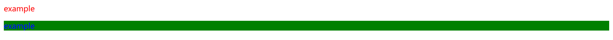

> HTML 属性基础：`HTML 语法 | HTML 元素 | 元素属性`
>
> [WHATWG 属性参考](https://html.spec.whatwg.org/multipage/indices.html#attributes-3 "WHATWG 属性参考")
>
> [MDN 属性参考](https://developer.mozilla.org/zh-CN/docs/Web/HTML/Reference/Attributes "MDN HTML 属性参考")

本笔记只记录**全局属性*，关于其它：

- **属性基础**：详见 `html | 属性` 笔记。
- **其它属性**：详见 `html-elements` 笔记中的各个元素。

# [全局属性](https://developer.mozilla.org/zh-CN/docs/Web/HTML/Reference/Global_attributes)

## [标识 `id` ](https://developer.mozilla.org/zh-CN/docs/Web/API/Element/id)

`id` 属性用于为元素指定唯一的标识符，属于全局属性。

- **唯一性**
    - 每个 HTML 文档中的 `id` 属性值必须是唯一的，不同元素之间不能有相同的 `id` 值。
    
- **命名规则**

    - 必须以字母（a-z，A-Z）开头。
    - 可以包含字母、数字（0-9）、连字符（-）、下划线（_）和句点（.）。
    - 区分大小写。
    - 不应包含空格和其他特殊字符。

- **应用**

    - 在 CSS 中通过 `#id` 方法，访问和操作元素。
    - 在 JS中 通过 `document.getElementById` 方法，访问和操作元素。

## [类名 `class`](https://developer.mozilla.org/zh-CN/docs/Web/HTML/Global_attributes/class)

- **定义**：`class` 属性用于为多个具有相似特征的一组元素定义类名，属于全局属性。
- **语法**：`class="类名1 类名2 ..."`

    ```html
    <p class="example">example</p>
    <p class="example1 example2">example</p>
    ```

    ```css
    .example {
      color: red;
    }
    
    .example1 {
      color: blue;
    }
    
    .example2 {
      background-color: green;
    }
    ```

    

- **说明**

    - 一个元素拥有多个类名，即可接受多个类选择器的样式

- **应用**

    - 在 CSS 中通过类选择器 `.类名`，访问和操作元素。
    - 在 JS 中通过 DOM 方法 `getElementsByClassName`，访问和操作元素。

## [样式 `style`](https://developer.mozilla.org/zh-CN/docs/Web/HTML/Element/style)

- `style` 属性用于为 HTML 元素添加样式，属于全局属性，详见 **[`CSS` - `css 来源`](../css/css.md#CSS 来源)**。
- 关于 `style` 属性最后一个声明结尾 `;` 的说明

    - 保留最后一个分号更规范，而且不易出错。
    - 因为代码格式化工具 `Prettier` 会将结尾 `;` 自动格式化删掉，所以暂时保持结尾没有 `;` 的写法。

        ```html
        <!-- 结尾有分号更规范 -->
        
        
        <!-- Prettier 会格式化删掉结尾分号 -->
        
        ```

## [悬停提示 `title`](https://developer.mozilla.org/zh-CN/docs/Web/HTML/Reference/Global_attributes/title)

- **语法**：当用户将鼠标悬停在带有 `title` 属性的元素上时，浏览器会显示该属性的值。

    ```html
    <!-- 用于锚元素 -->
    <a href="https://www.baidu.com/" title="点击跳转至百度">百度</a>
    
    <!-- 用于其它元素 -->
    <span title="公元前">AD</span>
    ```

- **渲染效果**

    > <a href="https://www.baidu.com/" title="点击跳转至百度">百度</a>
    >
    > <span title="公元前">AD</span>
