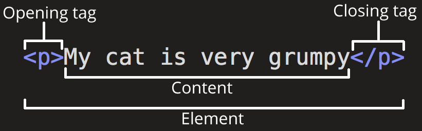

# [HTML](https://developer.mozilla.org/zh-CN/docs/Glossary/HTML)

**HTML**（**H**yper **T**ext **M**arkup **L**anguage，超文本标记语言），是一种用来定义 Web 网页**结构**和**语义**的**标记语言**。

HTML 文件通常会以 `.htm` 或 `.html` 为扩展名。用户可以从 [Web 服务器](https://developer.mozilla.org/zh-CN/docs/Glossary/Server)中下载，并使用任一 [Web 浏览器](https://developer.mozilla.org/zh-CN/docs/Glossary/Browser)来解析和显示这些文件。

本笔记只记录 [HTML 语法](https://html.spec.whatwg.org/multipage/#toc-syntax "WHATWG HTML 语法")，关于 HTML 元素和属性，详见各自笔记。

## HTML 资源

**HTML 资源**：

> <details>
> <summary>
>  <a
>    href="https://html.spec.whatwg.org/multipage/indices.html#index"
>    alt="WHATWG 参考"
>    >WHATWG 参考</a
>  >：官方参考
> </summary>
> <ul>
>  <li>
>    <a
>      href="https://html.spec.whatwg.org/multipage/indices.html#elements-3"
>      alt="HTML 元素参考"
>      >HTML 元素参考</a
>    >：所有 HTML 元素的表格
>  </li>
>  <li>
>    <a
>      href="https://html.spec.whatwg.org/multipage/indices.html#attributes-3"
>      alt="HTML 属性参考"
>      >HTML 属性参考</a
>    >：所有 HTML 属性的表格（不包括事件处理程序内容属性）
>  </li>
> </ul>
> </details>
> <details>
> <summary>
>  <a
>    href="https://developer.mozilla.org/zh-CN/docs/Web/HTML/Reference"
>    alt="MDN 参考"
>    title="MDN 参考"
>    >MDN 参考</a
>  >：MDN 对 WHATWG 参考的解释
> </summary>
> <ul>
>  <li>
>    <a
>      href="https://developer.mozilla.org/zh-CN/docs/Web/HTML/Reference/Elements"
>      alt="HTML 元素参考"
>      >HTML 元素参考</a
>    >：所有 HTML 元素详解
>  </li>
>  <li>
>    <a
>      href="https://developer.mozilla.org/zh-CN/docs/Web/HTML/Reference/Attributes"
>      alt="HTML 属性参考"
>      >HTML 属性参考</a
>    >：所有 HTML 属性详解
>  </li>
> </ul>
> </details>
> <details>
> <summary>
>  <a
>    href="https://developer.mozilla.org/zh-CN/docs/Web/HTML"
>    alt="MDN HTML"
>    title="MDN HTML"
>    >MDN HTML</a
>  >：MDN 关于 HTML 的主页面
> </summary>
> <ul>
>  <li>
>    <a
>      href="https://developer.mozilla.org/zh-CN/docs/Learn/Getting_started_with_the_web/HTML_basics"
>      alt="HTML 基础"
>      >HTML 基础</a
>    >：了解 HTML 的含义和最基本用法
>  </li>
>  <li>
>    <a
>      href="https://developer.mozilla.org/zh-CN/docs/Learn/HTML"
>      alt="HTML 学习区"
>      >HTML 学习区</a
>    >：学习 HTML 基础知识
>  </li>
>  <li>
>    <details>
>      <summary>
>        <a href="https://developer.mozilla.org/zh-CN/docs/Web/HTML/Reference"
>          >HTML 参考</a
>        >：MDN 对 WHATWG 官方文档的解释
>      </summary>
>      <ul>
>        <li>
>          <a
>            href="https://developer.mozilla.org/zh-CN/docs/Web/HTML/Reference/Elements"
>            alt="HTML 元素参考"
>            >HTML 元素参考</a
>          >：所有 HTML 元素详解
>        </li>
>        <li>
>          <a
>            href="https://developer.mozilla.org/zh-CN/docs/Web/HTML/Reference/Attributes"
>            alt="HTML 属性参考"
>            >HTML 属性参考</a
>          >：所有 HTML 属性详解
>        </li>
>      </ul>
>    </details>
>  </li>
> </ul>
> </details>

**[WHATWG](https://html.spec.whatwg.org/)  中 HTML 官方文档不同版本的含义**：

- **[单页版](https://html.spec.whatwg.org/)**：单页显示。

- **[多页版](https://html.spec.whatwg.org/multipage/)**：分多个页面显示，自己默认使用该版。

- **[开发者版](https://html.spec.whatwg.org/dev/)**：与多页版相比，此版删除了只有浏览器供应商才需要知道的信息。
- **[官方中文版1](https://whatwg-cn.github.io/html/)**：单页显示。
- **[官方中文版2](https://htmlspecs.com/)**：单页显示。

## 代码风格

- **大小写**：不敏感，通常全小写，但新版本的 (X)HTML 要求使用小写属性。
- **缩进**：不敏感，通常2个空格
- **分号**：行尾不加 `;`
- **空白行**：不敏感
- **换行**：不敏感

## [实体](https://developer.mozilla.org/zh-CN/docs/Glossary/Entity)

**HTML 实体**（也叫 `字符引用`）：是一段以符号 `&` 开始，以 `;` 结束的文本（字符串）。

在 HTML 中，某些特殊字符是 HTML 语法自身的一部分，如果想将这些字符包含进文本中，必须使用 `HTML 实体`。

```html
<!-- 错误写法 -->
<p>HTML 中用 <p> 来定义段落元素。</p>

<!-- 正确写法 -->
<p>HTML 中用 &lt;p&gt; 来定义段落元素</p>
```

> <p>HTML 中用 &lt;p&gt; 来定义段落元素</p>

**以下是常用的 HTML 实体**：

| 原义字符 | [HTML 实体](https://developer.mozilla.org/zh-CN/docs/Glossary/Entity) |
| :---: | :---: |
| `<` | `&lt;` |
| `>` | `&gt;` |
| `"` | `&quot;` |
| `'` | `&apos;` |
| `&` | `&amp;` |
| `空格` | `&nbsp;` |

# [HTML 注释](https://developer.mozilla.org/zh-CN/docs/Web/HTML/Guides/Comments)

- 单行注释：`Ctrl + / `，多行注释：`Ctrl + Shift + /`

    ```html
    <div>
      <!-- 这是一个单行注释 -->
      <h1>Hello, World!</h1>
        
      <!--
      多行注释第一行
      多行注释第二行
      多行注释第三行
      -->
      <h1>Hello, World!</h1>
    </div>
    ```

# [文档结构](https://developer.mozilla.org/zh-CN/docs/Learn/Getting_started_with_the_web/HTML_basics#html_文档详解)

- **文档结构**

    ```html
    <!DOCTYPE html>
    <html lang="en">
      <head>
          <meta charset="UTF-8">
          <meta name="viewport" content="width=device-width, initial-scale=1.0">
          <title>Document</title>
      </head>
      <body>
    
      </body>
    </html>
    ```

- **基本结构包含：**

    1. [**文档类型**](https://developer.mozilla.org/zh-CN/docs/Glossary/Doctype)：`<!DOCTYPE html>`
    2. [**根元素**](https://developer.mozilla.org/zh-CN/docs/Web/HTML/Element/html)：`<html>`

    3. [**元数据分区**](https://developer.mozilla.org/zh-CN/docs/Web/HTML/Element#文档元数据)：`<head>`
    4. [**内容分区**](https://developer.mozilla.org/zh-CN/docs/Web/HTML/Element/body)：`<body>`

- VS Code Emmet 快速创建文档结构：`!`

# [文档类型](https://developer.mozilla.org/zh-CN/docs/Glossary/Doctype)

在 HTML 中，**文档类型声明**是必要的。在所有文档的头部，你都将会看到 “`<!DOCTYPE html>`” 序言。这个声明的目的是防止浏览器在渲染文档时，切换到我们称为[“怪异模式”](https://developer.mozilla.org/zh-CN/docs/Web/HTML/Guides/Quirks_mode_and_standards_mode)的渲染模式。“`<!DOCTYPE html>`” 确保浏览器按照最佳的相关规范进行渲染，而不是使用一个不符合规范的渲染模式。

# 元素

本章节只记录 HTML 元素的基础，关于各元素的详解，详见 `html-elements` 笔记。

## [元素基础](https://developer.mozilla.org/zh-CN/docs/Learn_web_development/Core/Structuring_content/Basic_HTML_syntax#剖析一个_html_元素)

HTML 由一系列的元素组成，这些元素可以用来包围不同部分的内容，使其以某种方式呈现或者工作。目前符合要求的[元素](https://html.spec.whatwg.org/multipage/indices.html#elements-3)共计115个。



**元素的主要部分有**：

- **[开始标签](https://html.spec.whatwg.org/multipage/syntax.html#start-tags)**（Opening tag）：`<元素名称>` （本例为 `<p>`），表示元素从这里开始起作用。
- **[结束标签](https://html.spec.whatwg.org/multipage/syntax.html#end-tags)**（Closing tag）：`</元素名称>` （本例为 `</p>`），表示元素的结尾。
- **元素内容**（Content）：元素的内容，本例为 `My cat is veru grumpy`。
- **[元素](https://developer.mozilla.org/zh-CN/docs/Glossary/Element)**（Element）：开始标签、结束标签与内容相结合，便是一个完整的元素。

## 嵌套元素

元素可以嵌套符合条件的另一个元素。

```html
<p>My cat is <strong>very</strong> grumpy.</p>
```

## [元素分类](https://html.spec.whatwg.org/multipage/syntax.html#elements-2 "WHATWG 元素")

WHATWG 将 HTML 的元素分成六种类型：[空元素](https://html.spec.whatwg.org/multipage/syntax.html#void-elements)、[模板元素](https://html.spec.whatwg.org/multipage/syntax.html#the-template-element-2)、[原始文本元素](https://html.spec.whatwg.org/multipage/syntax.html#raw-text-elements)、[可转义的原始文本元素](https://html.spec.whatwg.org/multipage/syntax.html#escapable-raw-text-elements)、[外来元素](https://html.spec.whatwg.org/multipage/syntax.html#foreign-elements)和[普通元素](https://html.spec.whatwg.org/multipage/syntax.html#normal-elements)。

### [空元素](https://developer.mozilla.org/zh-CN/docs/Glossary/Void_element)

**空元素**（void element），是**不能**存在子节点（例如内嵌的元素或者文本节点）的元素。空元素只有开始标签，没有结束标签，即**自闭合标签**`。

[`<area>`](https://developer.mozilla.org/zh-CN/docs/Web/HTML/Reference/Elements/area)、[ `<base>`](https://developer.mozilla.org/zh-CN/docs/Web/HTML/Element/base)、

```html

```

关于**自闭合标签**写法的说明，以 `` 为例：

- 在 HTML5 中，`` 是空元素，**不需要**自闭合标签。这是现代 HTML 的标准写法，简洁且符合规范。
- 在 XHTML 中要求所有标签必须闭合，但 XHTML 已逐渐被 HTML5 取代。
- 因为代码格式化工具 `Prettier` 会将 `` 自动格式化为 `` ，所以暂时保持为 `` 写法。
- 所有空元素同理。

# 属性

本章节只记录 HTML 元素属性的基础，关于各元素属性的详解：

- **全局属性**：详见 `html-arrributes` 笔记。
- **其它属性**：详见 `html-elements` 笔记中的各个元素。

## [属性基础](https://developer.mozilla.org/zh-CN/docs/Learn_web_development/Core/Structuring_content/Basic_HTML_syntax#%E5%B1%9E%E6%80%A7)


**属性（Attribute）的说明**：

-  **属性**：存在于开始标签内
-  **属性名称**：本例为 `class`
    -  与元素名称之间用 `空格` 分隔
    -  多个属性之间用 `空格` 分隔

-  **属性值**：本例为 `editor-note`
    -  通常使用双引号 `"` 包围属性值，其它详见[不带引号的属性值语法](https://html.spec.whatwg.org/multipage/syntax.html#attributes-2)。
    -  多个属性值之间用 `空格` 分隔

-  **等号**：左右无空格

## [布尔属性](https://developer.mozilla.org/zh-CN/docs/Glossary/Boolean/HTML)

**布尔属性**，也称空属性，是表示 `true` 或 `false` 值的属性。只要指定属性，无论有没有属性值，或是取任何值，都显示为 `true`；只有不指定属性，才表现为 `false`。

```html
<!-- 未指定属性 -->
<input type="checkbox" /><br>

<!-- 指定属性 -->
<input type="checkbox" checked /><br />
<input type="checkbox" checked="" /><br />
<input type="checkbox" checked="checked" /><br />
<input type="checkbox" checked="true" /><br />
<input type="checkbox" checked="false" />
```

> - [ ] 
> - [x] 
> - [x] 
> - [x] 
> - [x] 
> - [x] 

# 其它

## 特殊渲染

某些元素在渲染时，会呈现特殊格式，以突出显示，使用时应遵循其语义，不能为了某种视觉效果而滥用该类元素。如想达到某种渲染效果，应使用 CSS 样式。

| 语义 | 元素 | 说明 |
| :---: | :---: | ----- |
|  | **粗体** |  |
| 重要文本 | `<strong>` | 用来对一个句子的部分**文本**增加重要性 |
| 注意文本 | `<b>` | 用来引起人们的注意，如关键词，不强调重要性 |
|  | *斜体* |  |
| 语气强调 | `<em>` | 表示语气上的强调 |
| 术语文本 | `<i>` | 用于技术术语、音译、思想或船名等 |
| 定义中的术语 | `<dfn>` | 表示定义中的术语 |
| 作品引用 | `<cite>` | 用于引用作品 |
| 变量 | `<var>` | 数学或编程的变量名称 |
|  | ~~删除线~~ |  |
| 删除文本 | `<del>` | 编辑标识，被从文档中删除的内容 |
| 不准确内容 | `<s>` | 表示不再准确或不再相关的内容 |
|  | <u>下划线</u> |  |
| 插入文本 | `<ins>` | 编辑标识，被插入文档中的内容 |
| 非文本注释 | `<u>` | 拼写错误和中文专有名词 |
|  | ==高亮== |  |
| 标记高亮 | `<mark>` | 上下文相关或突出显示以供参考 |
|  | <small>小字体</small> |  |
| 附注 | `<small>` | 附注 |
