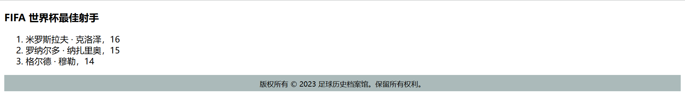
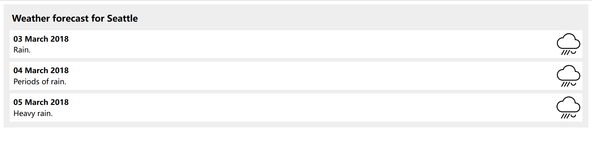
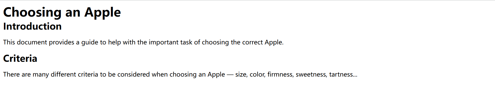
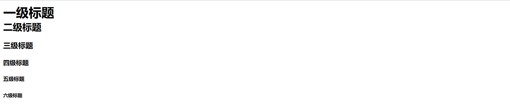
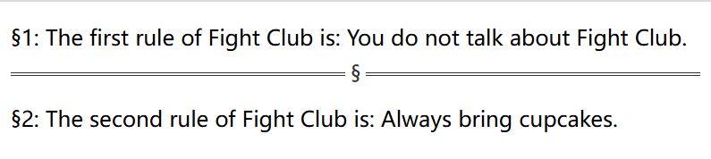
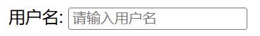
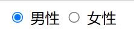
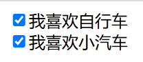
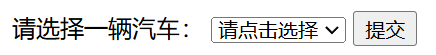
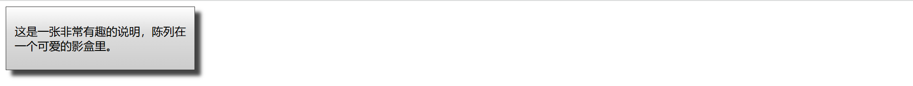

# [HTML](https://developer.mozilla.org/zh-CN/docs/Web/HTML)

**超文本标记语言**（**H**yper **T**ext **M**arkup **L**anguage，简称 HTML），是一种用来定义 Web 网页**结构**和**语义**的**标记语言**；HTML 文件的扩展名为 `.html`。

## HTML 主要资源

> <details>
> <summary>
>  <a href="https://developer.mozilla.org/zh-CN/docs/Web/HTML" alt="HTML" title="HTML on MDN"
>    >HTML</a
>  >：MDN 关于 HTML 的主页面
> </summary>
> <ul>
>  <li>
>    <a href="https://developer.mozilla.org/zh-CN/docs/Web/HTML" alt="HTML"
>      >HTML</a
>    >：MDN 关于 HTML 的主页面
>  </li>
>  <li>
>    <a
>      href="https://developer.mozilla.org/zh-CN/docs/Learn/Getting_started_with_the_web/HTML_basics"
>      alt="HTML 基础"
>      >HTML 基础</a
>    >：了解 HTML 的含义和最基本用法
>  </li>
>  <li>
>    <a
>      href="https://developer.mozilla.org/zh-CN/docs/Learn/HTML"
>      alt="HTML 学习区"
>      >HTML 学习区</a
>    >：学习 HTML 基础知识
>  </li>
>  <li>
>    <details>
>      <summary>
>        <a href="https://developer.mozilla.org/zh-CN/docs/Web/HTML/Reference"
>          >HTML 参考</a
>        >：MDN 对 WHATWG 官方文档的解释
>      </summary>
>      <ul>
>        <li>
>          <a
>            href="https://developer.mozilla.org/zh-CN/docs/Web/HTML/Reference/Elements"
>            alt="HTML 元素参考"
>            >HTML 元素参考</a
>          >：所有 HTML 元素详解
>        </li>
>        <li>
>          <a
>            href="https://developer.mozilla.org/zh-CN/docs/Web/HTML/Reference/Attributes"
>            alt="HTML 属性参考"
>            >HTML 属性参考</a
>          >：所有 HTML 属性详解
>        </li>
>        <li>
>          <a
>            href="https://developer.mozilla.org/zh-CN/docs/Web/HTML/Reference/Global_attributes"
>            alt="全局属性"
>            >全局属性</a
>          >
>        </li>
>        <li>
>          <a
>            href="https://developer.mozilla.org/zh-CN/docs/Web/HTML/Guides/Content_categories"
>            alt="内容分类"
>            >从不同维度，将内容元素分成几类</a
>          >
>        </li>
>      </ul>
>    </details>
>  </li>
> </ul>
> </details>
> <details>
>   <summary>
>     <a
>       href="https://developer.mozilla.org/zh-CN/docs/Web/HTML/Reference/Elements"
>       alt="HTML 元素参考"
>       title="HTML 元素参考"
>       >HTML 文档</a
>     >：此链接指向 MDN 的 HTML 元素参考
>   </summary>
>   <ul>
>     <li>
>       <a href="https://html.spec.whatwg.org/" alt="WHATWG 单页版"
>         >WHATWG 单页版</a
>       >：官方文档，单页显示
>     </li>
>     <li>
>       <details>
>         <summary>
>           <a href="https://html.spec.whatwg.org/multipage/" alt="WHATWG 多页版"
>             >WHATWG 多页版</a
>           >：官方文档，分多个页面显示
>         </summary>
>         <ul>
>           <li>
>             <a
>               href="https://html.spec.whatwg.org/multipage/indices.html#elements-3"
>               alt="WHATWG 元素参考"
>               >WHATWG 元素参考</a
>             >：WHATWG 多页版中所有 HTML 元素的列表
>           </li>
>         </ul>
>       </details>
>     </li>
>     <li>
>       <a href="https://html.spec.whatwg.org/dev/" alt="WHATWG 开发者版"
>         >WHATWG 开发者版</a
>       >：官方文档，与多页版相比，此版删除了只有浏览器供应商才需要知道的信息。
>     </li>
>     <li>
>       <details>
>         <summary>
>           <a
>             href="https://developer.mozilla.org/zh-CN/docs/Web/HTML/Reference"
>             alt="HTML 参考"
>             title="HTML 参考"
>             >MDN 版</a
>           >：MDN 对 WHATWG 官方文档的解释
>         </summary>
>         <ul>
>           <li>
>             <a
>               href="https://developer.mozilla.org/zh-CN/docs/Web/HTML/Reference/Elements"
>               alt="HTML 元素参考"
>               >HTML 元素参考</a
>             >：所有 HTML 元素详解
>           </li>
>           <li>
>             <a
>               href="https://developer.mozilla.org/zh-CN/docs/Web/HTML/Reference/Attributes"
>               alt="HTML 属性参考"
>               >HTML 属性参考</a
>             >：所有 HTML 属性详解
>           </li>
>           <li>
>             <a
>               href="https://developer.mozilla.org/zh-CN/docs/Web/HTML/Reference/Global_attributes"
>               alt="全局属性"
>               >全局属性</a
>             >
>           </li>
>           <li>
>             <a
>               href="https://developer.mozilla.org/zh-CN/docs/Web/HTML/Guides/Content_categories"
>               alt="内容分类"
>               >从不同维度，将内容元素分成几类</a
>             >
>           </li>
>         </ul>
>       </details>
>     </li>
>   </ul>
> </details>


## [HTML 注释](https://developer.mozilla.org/zh-CN/docs/Web/HTML/Guides/Comments)

- 单行注释：`Ctrl + / `，多行注释：`Ctrl + Shift + /`

    ```html
    <div>
      <!-- 这是一个单行注释 -->
      <h1>Hello, World!</h1>
        
      <!--
      多行注释第一行
      多行注释第二行
      多行注释第三行
      -->
      <h1>Hello, World!</h1>
    </div>
    ```

## [实体](https://developer.mozilla.org/zh-CN/docs/Glossary/Entity)

- **HTML 实体**（也叫 `字符引用`）：是一段以符号 `&` 开始，以 `;` 结束的文本（字符串）。
- 在 HTML 中，某些特殊字符是 HTML 语法自身的一部分，如果想将这些字符包含进文本中，必须使用 `HTML 实体`。
- 每个 HTML 实体以符号 `&` 开始，以 `;` 结束。

    |   原义字符   | HTML 实体         |
    | :----------: | ----------------- |
    |      <       | `&lt;`            |
    |      >       | `&gt;`            |
    |      "       | `&quot;`          |
    |      '       | `&apos;`          |
    |      &       | `&amp;`           |
    |     空格     | `&nbsp;`          |
    | ............ | ................. |

- **示例**

    ```html
    <!-- 错误写法 -->
    <p>HTML 中用 <p> 来定义段落元素。</p>
    
    <!-- 正确写法 -->
    <p>HTML 中用 &lt;p&gt; 来定义段落元素</p>
    ```

# [HTML 元素](https://developer.mozilla.org/zh-CN/docs/Learn_web_development/Getting_started/Your_first_website/Creating_the_content#html_元素详解)

HTML 由一系列的元素组成，这些元素可以用来包围不同部分的内容，使其以某种方式呈现或者工作。目前符合要求的[元素](https://html.spec.whatwg.org/multipage/indices.html#elements-3)共计115个。

本章节讲解 HTML 元素的基础，关于各元素的具体情况，详见各章节。各章节的元素分类参照 [WHATWG 元素目录](https://html.spec.whatwg.org/multipage/#toc-semantics)。

## 元素结构


**元素的主要部分有**：

- **开始标签**（Opening tag）：`<元素名称>` （本例为 `<p>`），表示元素从这里开始起作用。
- **结束标签**（Closing tag）：`</元素名称>` （本例为 `</p>`），表示元素的结尾。
- **元素内容**（Content）：元素的内容，本例为 `My cat is veru grumpy`。
- **元素**（Element）：开始标签、结束标签与内容相结合，便是一个完整的元素。

## 元素属性


- **有值的属性（Attribute）应包含**：

    -  **空格符**：在属性与元素名称（或上一个属性，如果有超过一个属性的话）之间的空格。
    -  **属性名称**，并接等号，本例为 `class`。
    -  **属性值**：由双（单）引号所包围，本例为 `editor-note`。

- **说明**
    - 属性一般存在于开始标签。
    - 一个元素可以有多个属性，每个属性之间用 `空格` 分隔。
    - 一个属性可以有多个属性值，每个属性值之间用 `空格` 分隔。
    - 属性和属性值对大小写不敏感，但新版本的 (X)HTML 要求使用小写属性。
    - 不包含 [ASCII](https://developer.mozilla.org/zh-CN/docs/Glossary/ASCII) 空格（以及 `"`、`'`、`=`、`<`、`>`）的简单属性值可以不使用引号，但是建议将所有属性值用引号括起来，这样的代码一致性更佳，更易于阅读。

## 嵌套元素

元素可以嵌套符合条件的另一个元素。

```html
<p>My cat is <strong>very</strong> grumpy.</p>
```

## [空元素](https://developer.mozilla.org/zh-CN/docs/Glossary/Void_element)

**空元素**，也称**自闭合标签**，只有开始标签，没有结束标。

```html

```

关于空元素**自闭合**的说明，以 `` 为例：

- 在 HTML5 中，`` 是空元素，**不需要**自闭合标签。这是现代 HTML 的标准写法，简洁且符合规范。
- 在 XHTML 中要求所有标签必须闭合，但 XHTML 已逐渐被 HTML5 取代。
- 因为代码格式化工具 `Prettier` 会将 `` 自动格式化为 `` ，所以暂时保持为 `` 写法。
- 所有空元素同理。

# HTML 属性

> HTML 属性基础：`HTML 笔记 | HTML 元素 | 元素属性`
>
> [HTML 属性参考](https://developer.mozilla.org/zh-CN/docs/Web/HTML/Reference/Attributes)

## [标识 `id` ](https://developer.mozilla.org/zh-CN/docs/Web/API/Element/id)

- **语法**

    - `id` 属性用于为元素指定唯一的标识符。
    - 每个 HTML 文档中的 `id` 属性值必须是唯一的，不同元素之间不能有相同的 `id` 值。

- **命名规则**

    - 必须以字母（a-z，A-Z）开头。
    - 可以包含字母、数字（0-9）、连字符（-）、下划线（_）和句点（.）。
    - 区分大小写。
    - 不应包含空格和其他特殊字符。

- **应用**

    - 在 CSS 中通过 `#id` 方法，访问和操作元素。
    - 在 JS中 通过 `document.getElementById` 方法，访问和操作元素。

## [类名 `class`](https://developer.mozilla.org/zh-CN/docs/Web/HTML/Global_attributes/class)

- **定义**：`class` 属性用于为多个具有相似特征的一组元素定义类名。
- **语法**：`class="类名1 类名2 ..."`

    ```html
    <p class="example">example</p>
    <p class="example1 example2">example</p>
    ```

    ```css
    .example {
      color: red;
    }

    .example1 {
      color: blue;
    }

    .example2 {
      background-color: green;
    }
    ```

    

- **说明**

    - 一个元素拥有多个类名，即可接受多个类选择器的样式

- **应用**

  - 在 CSS 中通过类选择器 `.类名`，访问和操作元素。
  - 在 JS 中通过 DOM 方法 `getElementsByClassName`，访问和操作元素。

## [样式 `style`](https://developer.mozilla.org/zh-CN/docs/Web/HTML/Element/style)

- `style` 属性用于为 HTML 元素添加样式，详见 **[`CSS` - `css 来源`](../css/css.md#CSS 来源)**。
- 关于 `style` 属性最后一个声明结尾 `;` 的说明

    - 保留最后一个分号更规范，而且不易出错
    - 因为代码格式化工具 `Prettier` 会将结尾 `;` 自动格式化删掉，所以暂时保持结尾没有 `;` 的写法。

        ```html
        <!-- 结尾有分号更规范 -->
        
        
        <!-- Prettier 会格式化删掉结尾分号 -->
        
        ```

## 路径 `src`

- **语法**：用于指定脚本文件引用的外部资源的路径。可以是本地路径，也可以是网络上的 URL。
- 通常用于元素，如 ``、`<script>`、`<audio>`、`<video>` 等。

    ```html
    
    ```

## 链接 `href`

- **语法**：`href`（超文本引用）是用于指定超链接。
- 通常用于 `<a>`、`<link>` 和 `<area>` 元素，一般用于链接资源文件，比如样式表。

    ```html
    <a href="https://www.example.com">点击这里</a>
    ```

- 跳转目标可以是绝对路径、相对路径、锚点、电话号、E-mail、JS 代码和文件等。
- **<span id="anchor">锚点</span>**：锚点元素添加属性 `id="锚点"`，跳转元素在 URL/SRC 后添加 `#锚点`（同一地址可省略 URL/SRC）

    ```html
    <div id="example">百度</div>
    
    <a href="#example">点击跳转至百度</a>
    ```

## [跳转方式 `target`](https://developer.mozilla.org/zh-CN/docs/Web/HTML/Element/a#target)

- 属性 `target` 用于指定链接的 *打开方式* 或者指定提交表单时的 *目标窗口*。通常用于 `<a>` 和 `<form>`。
- **语法**：`<a target="_blank"></a>`

    ```html
    <a href="https://www.example.com" target="_blank">Visit Example.com</a>
    ```

- **属性值**

  - **`_self`**：默认值，在当前窗口中打开。
  - **`_blank`**：在新窗口或新标签页中打开。
  - **`_parent`**：在父级框架中打开。
  - **`_top`**：在顶级窗口中打开。

## 替代文本 `alt`

- **语法**：用于描述图像的内容或作用。

  - 如果图像无法加载，`alt` 属性的文本将被显示。
  - 屏幕阅读器等辅助技术可以读取 `alt` 文本，以提供对图像的描述，帮助视觉障碍用户理解图像内容。

    ```html
    
    ```

## [宽度 `width`](https://developer.mozilla.org/zh-CN/docs/Web/CSS/width)

- **语法**：`width` 和 `height` 属性是 HTML 中用于指定元素宽度和高度的属性。
- **属性值单位**：可以是像素 `px`、百分比 `%`、视口 `vw/vh`、`em`、`rem` 和绝对长度单位（如mm）等，详见 `CSS` - `值和单位`。
- **自适应**：通常情况下，如果只设置 `width: 200px;`，而没有设置 `height`，浏览器将根据图像的纵横比自动计算 `height`。

## 悬停提示 `title`

- **语法**：当用户将鼠标悬停在带有 `title` 属性的元素上时，浏览器会显示该属性的值。

    ```html
    <!-- 用于锚元素 -->
    <a href="https://www.baidu.com/" title="点击跳转至百度">百度</a>

    <!-- 用于其它元素 -->
    <span title="公元前">AD</span>
    ```

- **渲染效果**

    > <a href="https://www.baidu.com/" title="点击跳转至百度">百度</a>
    >
    > <span title="公元前">AD</span>

## 禁用 `disabled`

- **语法**：禁用用户与某个元素进行交互。

    ```html
    <input type="text" disabled>
    ```

# 文档结构

本章节包含：

- 文档类型
- 主根元素
- 文档元数据
- 分区根元素

## [文档类型](https://developer.mozilla.org/zh-CN/docs/Glossary/Doctype)

## [文档结构](https://developer.mozilla.org/zh-CN/docs/Learn/Getting_started_with_the_web/HTML_basics#html_文档详解)

- **文档结构**

    ```html
    <!DOCTYPE html>
    <html lang="en">
      <head>
          <meta charset="UTF-8">
          <meta name="viewport" content="width=device-width, initial-scale=1.0">
          <title>Document</title>
      </head>
      <body>
    
      </body>
    </html>
    ```

- **基本结构包含：**

    1. [**文档类型**](#[文档类型](https://developer.mozilla.org/zh-CN/docs/Glossary/Doctype))：`<!DOCTYPE html>`
    2. [**根元素**](#[根元素](https://developer.mozilla.org/zh-CN/docs/Web/HTML/Element/html))：`<html>`

    3. [**元数据分区**](#[元数据分区](https://developer.mozilla.org/zh-CN/docs/Web/HTML/Element#文档元数据))：`<head>`
    4. [**内容分区**](#[内容分区 `<body>`](https://developer.mozilla.org/zh-CN/docs/Web/HTML/Element/body))：`<body>`

## [主根元素 `<html>`](https://developer.mozilla.org/zh-CN/docs/Web/HTML/Element/html)

**`<html>`** 元素称为*主根元素*。该元素包含整个页面的所有内容，其他所有元素必须是此元素的后代。

## [元数据分区](https://developer.mozilla.org/zh-CN/docs/Web/HTML/Element#文档元数据)

**元数据分区**是文档的元数据，由 `<head>` 所包围，该部分与浏览器进行交互，用户无法查看。

- [文档头部 `<head>`](#[文档头部 `<head>`](https://developer.mozilla.org/zh-CN/docs/Web/HTML/Element/head))
- [元数据 `<meta>`](#[元数据 `<meta>`](https://developer.mozilla.org/zh-CN/docs/Web/HTML/Element/meta))
- [**文档标题 `<title>`**](#[**文档标题 `<title>`**](https://developer.mozilla.org/zh-CN/docs/Web/HTML/Element/title))
- [外部资源链接 `<link>`](#[外部资源链接 `<link>`](https://developer.mozilla.org/zh-CN/docs/Web/HTML/Element/link))
- [样式信息 `<style>`](#[样式信息 `<style>`](https://developer.mozilla.org/zh-CN/docs/Web/HTML/Element/style))
- [文档根 URL `<base>`](#[文档根 URL `<base>`](https://developer.mozilla.org/zh-CN/docs/Web/HTML/Element/base))

## [文档头部 `<head>`](https://developer.mozilla.org/zh-CN/docs/Web/HTML/Element/head)

- 包含文档相关的元数据信息，包括文档的标题、脚本和样式表等。

## [元数据 `<meta>`](https://developer.mozilla.org/zh-CN/docs/Web/HTML/Element/meta)

- **语法**：用于表示那些不能由其他 HTML 元相关元素（如 `<style>`、`<title>`等）表示的元数据信息。

### 字符集 `charset`

- 告诉文档使用哪种字符编码：`<meta charset="UTF-8">`

### `name` 和 `content`

- `name` 和 `content` 属性一起使用，以名 - 值对的方式给文档提供元数据，其中 name 作为元数据的名称，content 作为元数据的值。
- [标准元数据名称](https://developer.mozilla.org/zh-CN/docs/Web/HTML/Element/meta/name)
- **作者信息**：`<meta name="author" content="NAME" />`
- **描述信息**：`<meta name="description" content="content..." />`
- [**视口**](https://developer.mozilla.org/zh-CN/docs/Web/CSS/Viewport_concepts)：`<meta name="viewport" content="width=device-width">`  
    视口可以确保页面以视口宽度进行渲染，避免移动端浏览器上因页面过宽导致缩放。

## [**文档标题 `<title>`**](https://developer.mozilla.org/zh-CN/docs/Web/HTML/Element/title)

- **语法**：定义文档的标题
- 显示在浏览器的标题栏或标签页上
- 作为收藏网页的描述文字
- 用在搜索的结果中

## [外部资源链接 `<link>`](https://developer.mozilla.org/zh-CN/docs/Web/HTML/Element/link)

- **语法**：引入外部资源。

    ```html
    <head>
      <link href="styles.css" rel="stylesheet" />
    </head>
    ```

    ```css
    /* styles.css */
    p {color: red;}
    ```

- **说明**

    - **`rel="stylesheet"`** 表示当前文档与`main.css`文件的关系是样式表，浏览器会将其视为页面的外部CSS样式文件，并应用其中的样式规则。
    - `<link>` 元素可以出现在 [`<head>`](https://developer.mozilla.org/zh-CN/docs/Web/HTML/Element/head) 元素或 [`<body>`](https://developer.mozilla.org/zh-CN/docs/Web/HTML/Element/body) 元素中，具体取决于它是否有一个 **body-ok** 的[链接类型](https://html.spec.whatwg.org/multipage/links.html#body-ok)，但最好将其放在 `<head>` 中。
    - 该元素最常用于链接 CSS，此外也可以被用来创建站点图标 。

## [样式信息 `<style>`](https://developer.mozilla.org/zh-CN/docs/Web/HTML/Element/style)

- **语法**：创建文档内部样式。

    ```html
    <head>
      <style>
        p {
          color: #26b72b;
      </style>
    </head>

    <body>
      <p>
        This text will be green. Inline styles take precedence over CSS included
        externally.
      </p>
    </body>
    ```

- **说明**：`<style>` 元素必须包含在文档的 `<head>` 内。但最好的方式是使用 `<link>` 元素引入 CSS。

## [文档根 URL `<base>`](https://developer.mozilla.org/zh-CN/docs/Web/HTML/Element/base)

- 指定用于一个文档中包含的所有相对 URL 的根 URL。一份中只能有一个该元素。

## [分区根元素 `<body>`](https://developer.mozilla.org/zh-CN/docs/Web/HTML/Element/body)

- 包含文档的结构信息（如页眉、页脚等）和文档其它内容。

# 内容分区

[内容分区](https://developer.mozilla.org/zh-CN/docs/Web/HTML/Reference/Elements#内容分区)元素允许你将文档内容从逻辑上进行组织划分。内容分区就是 `<body>` 里内容的结构划分。

## [ 页眉 `<header>`](https://developer.mozilla.org/zh-CN/docs/Web/HTML/Element/header)

-  **`<header>` 元素**用于展示介绍性内容，通常包含一组介绍性的或是辅助导航的实用元素。它可能包含一些标题元素，但也可能包含其他元素，比如 Logo、搜索框、作者名称，等等。
-  **语法**

    ```html
    <head>
      <link href="../css/css-test.css" rel="stylesheet" />
    </head>
    
    <body>
      <header>
        <a class="logo" href="#">Cute Puppies Express!</a>
      </header>
      
      <article>
        <header>
          <h1>Beagles</h1>
          <time>08.12.2014</time>
        </header>
        <p>I love beagles <em>so</em> much! Like, really, a lot. They’re adorable and their ears are so, so snugly soft!</p>
      </article>
    </body>
    ```

    ```css
    .logo {
      background: left / cover url('../images/dog.jpg');
      display: flex;
      height: 120px;
      align-items: center;
      justify-content: center;
      font:
        bold calc(1em + 2 * (100vw - 120px) / 100) 'Dancing Script',
        fantasy;
      color: #ff0083;
      text-shadow: #000 2px 2px 0.2rem;
    }

    header > h1 {
      margin-bottom: 0;
    }

    header > time {
      font: italic 0.7rem sans-serif;
    }
    ```

-  **渲染效果**

    > 

## [ 页脚 `<footer>`](https://developer.mozilla.org/zh-CN/docs/Web/HTML/Element/footer)

- 一个页脚通常包含该章节作者、版权数据或者与文档相关的链接等信息。
- **语法**

    ```html
    <head>
      <link href="../css/css-test.css" rel="stylesheet" />
    </head>
    <body>
      <h3>FIFA 世界杯最佳射手</h3>
      <ol>
        <li>米罗斯拉夫 · 克洛泽，16</li>
        <li>罗纳尔多 · 纳扎里奥，15</li>
        <li>格尔德 · 穆勒，14</li>
      </ol>

      <footer>
        <small> 版权所有 © 2023 足球历史档案馆。保留所有权利。 </small>
      </footer>
    </body>
    ```

    ```css
    footer {
      text-align: center;
      padding: 5px;
      background-color: #abbaba;
      color: #000;
    }
    ```

- **渲染效果**

    > 

## [ 导航栏 `<nav>`](https://developer.mozilla.org/zh-CN/docs/Web/HTML/Element/header)

- **`<nav>`元素**用于在当前文档或其他文档中提供导航链接。导航部分的常见示例是菜单，目录和索引。

- **语法**

    ```html
    <head>
      <link href="../css/css-test.css" rel="stylesheet" />
    </head>
    
    <body>
      <nav class="crumbs">
        <ol>
          <li class="crumb"><a href="#">Bikes</a></li>
          <li class="crumb"><a href="#">BMX</a></li>
          <li class="crumb">Jump Bike 3000</li>
        </ol>
      </nav>
    
      <h1>Jump Bike 3000</h1>
      <p>
        This BMX bike is a solid step into the pro world. It looks as legit as it
        rides and is built to polish your skills.
      </p>
    </body>
    ```

- **渲染效果**

    > 

## [ 侧边栏 `<aside>`](https://developer.mozilla.org/zh-CN/docs/Web/HTML/Element/aside)

- **`<aside>` 元素**表示一个和其余页面内容几乎无关的部分，被认为是独立于该内容的一部分并且可以被单独的拆分出来而不会使整体受影响。其通常表现为侧边栏或者标注框（call-out boxes）。

- **语法**

    ```html
    <head>
      <link href="../css/css-test.css" rel="stylesheet" />
    </head>
    
    <body>
      <p>
        Salamanders are a group of amphibians with a lizard-like appearance, including short legs and a tail in both larval
        and adult forms.
      </p>
    
      <aside>
        <p>The Rough-skinned Newt defends itself with a deadly neurotoxin.</p>
      </aside>
    
      <p>
        Several species of salamander inhabit the temperate rainforest of the Pacific Northwest, including the Ensatina, the
        Northwestern Salamander and the Rough-skinned Newt. Most salamanders are nocturnal, and hunt for insects, worms and
        other small creatures.
      </p>  
    </body>
    ```

    ```css
    aside {
      width: 40%;
      padding-left: 0.5rem;
      margin-left: 0.5rem;
      float: right;
      box-shadow: inset 5px 0 5px -5px #29627e;
      font-style: italic;
      color: #29627e;
    }
    
    aside > p {
      margin: 0.5rem;
    }
    ```

- **渲染效果**

    > 

## [ 主要内容 `<main>`](https://developer.mozilla.org/zh-CN/docs/Web/HTML/Element/header)

- **`<main>` 元素**呈现文档的主要内容。

- **语法**

    ```html
    <head>
      <link href="../css/css-test.css" rel="stylesheet" />
    </head>
    
    <body>
      <header>Gecko facts</header>
    
      <main>
        <p>
          Geckos are a group of usually small, usually nocturnal lizards. They are
          found on every continent except Antarctica.
        </p>
    
        <p>
          Many species of gecko have adhesive toe pads which enable them to climb
          walls and even windows.
        </p>
      </main>
    </body>
    ```

    ```css
    header {
      font: bold 7vw Arial, sans-serif;
    }
    ```

- **渲染效果**

    > 

- **扩展**

    - 主内容中还可以有各种子内容区段，可用 `<article>`、`<section>` 和 `<div>` 等元素表示。
    - 侧边栏 `<aside>`、 独立结构 `<article>`、独立章节 `<section>` 和 `<div>` 经常嵌套在 `<main>` 中。

## [独立结构 `<article>`](https://developer.mozilla.org/zh-CN/docs/Web/HTML/Element/article)

- **`<article>`** 元素表示文档、页面、应用或网站中的独立结构，其意在成为可独立分配的或可复用的结构，是行内元素。
- 例如，阅读器在博客上滚动时一个接一个地显示每篇文章的文本，每个帖子将包含在 `<article>` 元素中，可能包含一个或多个 `<section>`。
- **语法**

    ```html
    <!DOCTYPE html>
    <html lang="en">
      <head>
        <meta charset="UTF-8" />
        <meta name="viewport" content="width=device-width, initial-scale=1.0" />
        <title>Document</title>
        <link href="../css/css-test.css" rel="stylesheet" />
      </head>
    
      <body>
        <article class="forecast">
          <h1>Weather forecast for Seattle</h1>
          <article class="day-forecast">
            <h2>03 March 2018</h2>
            <p>Rain.</p>
          </article>
          <article class="day-forecast">
            <h2>04 March 2018</h2>
            <p>Periods of rain.</p>
          </article>
          <article class="day-forecast">
            <h2>05 March 2018</h2>
            <p>Heavy rain.</p>
          </article>
        </article>
      </body>
    </html>
    ```
    
    ```css
    .forecast {
      margin: 0;
      padding: 0.3rem;
      background-color: #eee;
    }
    
    .forecast > h1,
    .day-forecast {
      margin: 0.5rem;
      padding: 0.3rem;
      font-size: 1.2rem;
    }
    
    .day-forecast {
      background: right/contain content-box border-box no-repeat
        url('../images/rain.svg') white;
    }
    
    .day-forecast > h2,
    .day-forecast > p {
      margin: 0.2rem;
      font-size: 1rem;
    }
    ```
    
- **渲染效果**

    > 

## [独立章节 `<section>`](https://developer.mozilla.org/zh-CN/docs/Web/HTML/Element/section)

- `<section>` 是一个通用的分节元素，只有在没有更具体的元素来代表它的时候才可以使用。
- **语法**

    ```html
    <head>
      <link href="../css/css-test.css" rel="stylesheet" />
    </head>

    <body>
      <h1>Choosing an Apple</h1>
      <section>
        <h2>Introduction</h2>
        <p>This document provides a guide to help with the important task of choosing the correct Apple.</p>
      </section>

      <section>
        <h2>Criteria</h2>
        <p>
          There are many different criteria to be considered when choosing an Apple — size, color, firmness, sweetness,
          tartness...
        </p>
      </section>  
    </body>
    ```

    ```css
    h1,
    h2 {
      margin: 0;
    }
    ```

- **渲染效果**

    > 

## [地址 `<address>`](https://developer.mozilla.org/zh-CN/docs/Web/HTML/Element/address)

- **语法**：表示联系地址。

    ```html
    <p>Contact the author of this page:</p>
    
    <address>
      <a href="mailto:jim@example.com">jim@example.com</a><br />
      <a href="tel:+14155550132">+1 (415) 555‑0132</a>
    </address>
    ```

    ```css
    a[href^='mailto']::before {
      content: '📧 ';
    }
    
    a[href^='tel']::before {
      content: '📞 ';
    }
    ```

- **渲染效果**

    > 

# 文章结构

## [标题 `<h>`](https://developer.mozilla.org/zh-CN/docs/Web/HTML/Element/Heading_Elements)

**标题 `<h>`** 用于定义标题级别，从 `<h1>` 到 `<h6>`，是块级元素。

- **语法**

    ```html
    <h1>一级标题</h1>
    <h2>二级标题</h2>
    <h3>三级标题</h3>
    <h4>四级标题</h4>
    <h5>五级标题</h5>
    <h6>六级标题</h6>
    ```

- **渲染效果**

    

- **注意**

    - 不要为了减小标题的字体而使用低级别的标题
    - 避免跳过某级标题：始终要从 `<h1>` 开始，接下来依次使用 `<h2>` 等等
    - 同一篇幅尽量不要超过三级标题

## [段落 `<p>`](https://developer.mozilla.org/zh-CN/docs/Web/HTML/Element/p)

- **语法**：用于定义 HTML 文档中的段落，是行内元素。

    ```html
    <p>
      Geckos are a group of usually small, usually nocturnal lizards. They are found
      on every continent except Antarctica.
    </p>
    
    <p>
      Some species live in houses where they hunt insects attracted by artificial
      light.
    </p>
    ```

    ```css
    p {
      margin: 10px 0;
      padding: 5px;
      border: 1px solid #999;
    }
    ```

- **渲染效果**

    > 

- **说明**：浏览器会自动地在段落的前后添加空行。

## [可附标题内容 `<figure>`](https://developer.mozilla.org/zh-CN/docs/Web/HTML/Element/figure)

**可附标题内容 `<figure>`** 表示“独立的媒体单元”，是块级元素。可能包含 [`<figcaption>`](https://developer.mozilla.org/zh-CN/docs/Web/HTML/Reference/Elements/figcaption) 元素定义的说明内容。

- **语法**

    ```html
    <!-- 一个图注 -->
    <figure>
      
      <figcaption style="font-size: 16px; color: gray">图注</figcaption>
    </figure>
    
    <!-- 多个图注 -->
    <figure>
      
      <figcaption style="font-size: 16px; color: gray">
        <div>图注</div>
        <div>图注</div>
      </figcaption>
    </figure>
    ```

- **扩展示例**

    ```html
    <figure>
      
      <figcaption>An elephant at sunset</figcaption>
    </figure>
    ```

    ```css
    figure {
      border: thin #c0c0c0 solid;
      display: flex;
      flex-flow: column;
      padding: 5px;
      max-width: 220px;
      margin: auto;
    }
    
    img {
      max-width: 220px;
      max-height: 150px;
    }
    
    figcaption {
      background-color: #222;
      color: #fff;
      font: italic smaller sans-serif;
      padding: 3px;
      text-align: center;
    }
    ```

- **渲染效果**

    > 

## [主题分割 `<hr>`](https://developer.mozilla.org/zh-CN/docs/Web/HTML/Element/hr)

**主题分割 `<hr>`** 即水平线，语义上表示段落级元素之间的主题转换，是块级元素。

```html
<p>§1: The first rule of Fight Club is: You do not talk about Fight Club.</p>
<hr />
<p>§2: The second rule of Fight Club is: Always bring cupcakes.</p>
```

```css
hr {
  border: none;
  border-top: 3px double #333;
  color: #333;
  overflow: visible;
  text-align: center;
  height: 5px;
}

hr::after {
  background: #fff;
  content: '§';
  padding: 0 4px;
  position: relative;
  top: -13px;
}
```

> 

# 列表

**缩进**：列表与前一个元素会有一个缩进。

## [列表项 `<li>`](https://developer.mozilla.org/zh-CN/docs/Web/HTML/Reference/Elements/li)

**列表项 `<li>`** 用于表示列表中的项目。

## [无序列表 `<ul>`](https://developer.mozilla.org/zh-CN/docs/Web/HTML/Element/ul)

- **语法**：显示无顺序排列的列表项 `<li>`。

    ```html
    <ul>
      <li>第一列表项</li>
      <li>第二列表项</li>
      <li>第三列表项</li>
    </ul>
    ```

- **渲染效果**

    > <ul>
    >  <li>第一列表项</li>
    >  <li>第二列表项</li>
    >  <li>第三列表项</li>
    > </ul>

- **说明**：渲染时默认以圆点等符号进行标记，如果想修改，应该在 CSS 中修改。

## [有序列表 `<ol>`](https://developer.mozilla.org/zh-CN/docs/Web/HTML/Element/ol)

**有序列表 `<ol>`** 显示按顺序排列的列表项 `<li>`，默认以数字等符号进行标记。

### 有序列表语法

```html
<ol>
  <li>第一列表项</li>
  <li>第二列表项</li>
  <li>第三列表项</li>
</ol>
```

> <ol>
> <li>第一列表项</li>
> <li>第二列表项</li>
> <li>第三列表项</li>
> </ol>

### `type` 属性

**`type` 属性**用于指定有序列表的计数器类型，即序列号的类型。

```html
<ol type="A">
  <li>第一列表项</li>
  <li>第二列表项</li>
  <li>第三列表项</li>
</ol>
```

> <ol type="A">
> <li>第一列表项</li>
> <li>第二列表项</li>
> <li>第三列表项</li>
> </ol>

### `start` 属性

**`start` 属性**用于指定有序列表的起始值。

```html
<ol start="5">
  <li>第五列表项</li>
  <li>第六列表项</li>
  <li>第七列表项</li>
</ol>
```

> <ol start="5">
> <li>第五列表项</li>
> <li>第六列表项</li>
> <li>第七列表项</li>
> </ol>

### `value` 属性

**`value` 属性**用于指定有序列表项的值，这是 `<li>` 的属性。

```html
<ol>
  <li value="100">第一百列表项</li>
  <li value="200">第二百列表项</li>
  <li value="300">第三百列表项</li>
</ol>
```

> <ol>
> <li value="100">第一百列表项</li>
> <li value="200">第二百列表项</li>
> <li value="300">第三百列表项</li>
> </ol>

## 列表嵌套

**列表嵌套**是指在一个列表项 `<li>` 中包含另一个列表

```html
<!-- 规范写法 -->
<ul>
  <li>
    项目1
    <ol>
      <li>子项目 1</li>
      <li>子项目 2</li>
    </ol>
  </li>
  <li>项目2</li>
</ul>

<!-- 不规范写法 -->
<ul>
  <li>项目1</li>
  <ol>
    <li>子项目 1</li>
    <li>子项目 2</li>
  </ol>
  <li>项目2</li>
</ul>
```

> <ul>
> <li>项目1
>   <ol>
>       <li>子项目 1</li>
>       <li>子项目 2</li>
>   </ol>
> </li>
> <li>项目2</li>
> </ul>

**注意**：不要将一个列表当成列表项 `<li>` 进行嵌套，而是要把列表放在 `<li>` 的内容中。

## [菜单 `<menu>`](https://developer.mozilla.org/zh-CN/docs/Web/HTML/Element/menu)

**菜单 `<menu>`** 在 HTML 规范中被描述为 `<ul>` 的语义替代，但浏览器将其视为与 `<ul>` 没有区别。

```html
<menu>
  <li>第一列表项</li>
  <li>第二列表项</li>
  <li>第三列表项</li>
</menu>
```

> <menu>
>   <li>第一列表项</li>
>   <li>第二列表项</li>
>   <li>第三列表项</li>
> </menu>

# [表格 `<table>`](https://developer.mozilla.org/zh-CN/docs/Web/HTML/Element/table)

## 完整表格

- **语法**

    ```html
    <table>
      <caption>表格标题</caption>
      <thead>
        <tr>
          <th>表头1</th>
          <th>表头2</th>
        </tr>
      </thead>
      <tbody>
        <tr>
          <td>数据1</td>
          <td>数据2</td>
        </tr>
        <tr>
          <td>数据3</td>
          <td>数据4</td>
        </tr>
      </tbody>
      <tfoot>
        <tr>
          <td>总计</td>
          <td>100</td>
        </tr>
      </tfoot>
    </table>
    ```

- **渲染效果**

    > 

- **元素说明**

    - `<table>`：定义整个表格。
    - `<caption>` 标题  `<thead>` 表头  `<tbody>` 主体   `<tfoot>` 页脚，可省略。
    - `<tr>`：定义表格中的行。
    - `<th>`：定义表格中的表头单元格（表头单元格会加粗且默认居中显示）。
    - `<td>`：定义表格中的数据单元格。

## 基本表格

- **语法**

    ```html
    <table>
      <tr>
        <th>表头1</th>
        <th>表头2</th>
      </tr>
      <tr>
        <td>数据1</td>
        <td>数据2</td>
      </tr>
      <tr>
        <td>数据3</td>
        <td>数据4</td>
      </tr>
    </table>
    ```

- **渲染效果**

    > 

- **`border` 属性**：属性 `<table border="1">` 控制边框已经弃用，在实际开发中，建议使用 CSS 样式来进行更灵活和精细的样式控制，或者引入 BootStrap。

- **嵌套**：`<table>` 可以嵌套在 `<th>` 或 `<td>` 中

## 合并单元格

- **语法**：合并行  `rowspan`，合并列 `colspan`，单元格占几行（列），值就等于几。

    ```html
    <table border="1">
      <tr>
        <th>表头1</th>
        <th colspan="2">表头2</th>
      </tr>
      <tr>
        <td rowspan="2">数据1</td>
        <td>数据2</td>
        <td>数据3</td>
      </tr>
      <tr>
        <td>数据4</td>
        <td>数据5</td>
      </tr>
    </table>
    ```

- **渲染效果**

    > 

## 自由表头

- 属性 `scope` 可以添加在 `<th>` 元素中，以告诉屏幕阅读器该表头的类型——它是所在行的表头，还是所在列的表头。

- `scope` 的值

    - 单列表头 `col`
    - 多列表头 `colgroup`
    - 单行表头 `row`
    - 多行表头 `rowgroup`

- **示例**

    ```html
    <table border="1">
      <tr>
        <th>&nbsp;</th>
        <th scope="col">单列表头</th>
        <th colspan="2" scope="colgroup">多列表头</th>
        <th scope="col">单列表头</th>
      </tr>
      <tr>
        <th scope="row">单行表头</th>
        <td>数据1</td>
        <td>数据1</td>
        <td>数据1</td>
        <td>数据1</td>
      </tr>
      <tr>
        <th rowspan="2" scope="rowgroup">多行表头</th>
        <td>数据2</td>
        <td>数据2</td>
        <td>数据2</td>
        <td>数据2</td>
      </tr>
      <tr>
        <td>数据3</td>
        <td>数据3</td>
        <td>数据3</td>
        <td>数据3</td>
      </tr>
      <tr>
        <th scope="row">单行表头</th>
        <td>数据4</td>
        <td>数据4</td>
        <td>数据4</td>
        <td>数据4</td>
      </tr>
    </table>
    ```

- **渲染效果**

    > 

# 表单

## [表单 `<form>`](https://developer.mozilla.org/zh-CN/docs/Web/HTML/Reference/Elements/form)

**表单 `<form>`** 元素表示文档中的一个区域，此区域包含交互控件，用于向 Web 服务器提交信息。

### 表单语法

- **语法**

    ```html
    <form action="/submit" method="post">
      <!-- 这里是表单内容，包括输入框、按钮等 -->
      <input type="submit" value="提交">
    </form>
    ```

- **扩展**：在 Django 框架下，必须校验，否则无法提交。

    ```html
    <form action="/login/" method="post">
      <!-- 校验，否则无法提交 -->
      
      <!-- 这里是表单内容，包括输入框、按钮等 -->
      <input type="submit" value="提交">
    </form>
    ```

### 表单属性

- 允许的值在 [`<form>` 属性](https://developer.mozilla.org/zh-CN/docs/Web/HTML/Element/form#%E5%B1%9E%E6%80%A7)中

    - [**`action`**](#[`action`](https://developer.mozilla.org/zh-CN/docs/Web/HTML/Element/form#action))：提交的目标 URL
    - [**`method`**](#[`method`](https://developer.mozilla.org/zh-CN/docs/Web/HTML/Element/form#method))：数据传输方式
    - [`target`](https://developer.mozilla.org/zh-CN/docs/Web/HTML/Element/a#target)：跳转方式

### [`action`](https://developer.mozilla.org/zh-CN/docs/Web/HTML/Element/form#action)

**`action`** 属性用于指定表单数据提交的目标 URL。当用户填写表单并点击提交按钮时，浏览器会将表单数据发送到指定的 `action` URL。

**语法**：`<form action="/submit">`

### [`method`](https://developer.mozilla.org/zh-CN/docs/Web/HTML/Element/form#method)

**`method`** 属性用于指定表单数据提交时使用的 HTTP 方法。HTTP 方法定义了浏览器将如何发送表单数据以及服务器应该如何处理这些数据。`method` 属性有两个常用的取值： `get` 和 `post`。

**语法**：`<form method="post">`

**[GET方法](https://developer.mozilla.org/zh-CN/docs/Web/HTTP/Methods/GET)**

- 当使用 `GET` 方法提交表单时，表单数据会附加在 URL 的末尾（query string），并以键值对的形式出现。这种方式适合用于获取数据，但不适合包含敏感信息，因为数据会明文显示在 URL 中。GET 方法通常用于数据检索，而不涉及对服务器上数据的修改。

**[POST方法](https://developer.mozilla.org/zh-CN/docs/Web/HTTP/Methods/POST)**

- 使用 `POST` 方法提交表单时，表单数据会包含在表单体内，而不会显示在 URL 中。这种方式更适合用于提交敏感信息和对服务器上数据进行修改。POST 方法通常用于表单提交，文件上传等需要传输大量数据或包含敏感信息的场景。传递文件必须使用 `POST` 形式传递。

## [标签 `<label>`](https://developer.mozilla.org/zh-CN/docs/Web/HTML/Element/label)

- **标签 `<label>`** 用于为表单元素提供标签，并且在用户界面上通常表现为可点击的文本。

    -  点击关联的标签来聚焦或者激活输入框，就像直接点击输入框一样，这扩大了输入框的可点击区域。
    -  当用户聚焦到输入框时，屏幕阅读器可以读出标签，让使用辅助技术的用户更容易理解应输入什么数据。

- **语法**：

    ```html
    <form>
      <label for="username">用户名:</label>
      <input type="text" id="username" name="username" placeholder="请输入用户名">
    </form>
    ```

    

    **在上述示例中**：

    1. 使用 `<label>` 元素来标识 `用户名：` 字段。
    2. 使用 `for` 属性用于关联 `<input>` 元素的 `id`。
    3. 使用 `<input>` 元素来创建文本输入框。
    4. 当用户点击 `用户名：` 时，也可以激活输入框，而不是必须点击输入框。

- **`for` 属性**：用于关联表单元素的 `id`。

- **扩展**：如果将 `<input>` 元素嵌套在 `<label>` 元素内部，就不需要使用 `for` 和 `id` 属性，因为它们将自动关联。但这种方式不利于 CSS 样式控制。

    ```html
    <form>
      <label>
        用户名:
        <input type="text" name="username" placeholder="请输入用户名">
      </label>
    </form>
    ```

## [输入框 `<input>`](https://developer.mozilla.org/zh-CN/docs/Web/HTML/Element/input)

**输入框 `<input>`** 用于创建各种表单控件，允许用户输入数据或进行选择。

### 输入框语法

```html
<form action="/submit" method="post">
  <label for="username">用户名：</label>
  <input type="text" id="username" name="username" placeholder="请输入用户名">
  <input type="submit" value="提交">
</form>
```


**在上述示例中**：

1. 使用 `<label>` 元素的 `for` 属性来标识 `用户名：` 字段。
2. 使用 `id` 属性关联 `label` 元素的 `for` 属性。
3. 使用 `name` 属性标识输入框的内容。
4. 使用 `placeholder` 属性进行输入提示。

### 输入框属性

- 允许的值在 [`<input>` 属性](https://developer.mozilla.org/zh-CN/docs/Web/HTML/Element/input#%E5%B1%9E%E6%80%A7)中
- [**`type`**](#[`type`](https://developer.mozilla.org/zh-CN/docs/Web/HTML/Element/input#type))：控件类型
- [**`name`**](https://developer.mozilla.org/zh-CN/docs/Web/HTML/Element/input#name)：输入框名称，用于在提交表单时标识输入框的内容
- [**`value`**](https://developer.mozilla.org/zh-CN/docs/Web/HTML/Element/input#value)：输入框默认值
- [**`placeholder`**](https://developer.mozilla.org/zh-CN/docs/Web/HTML/Attributes/placeholder)：占位符，用于输入框提示
- [`accept`](https://developer.mozilla.org/zh-CN/docs/Web/HTML/Element/input#accept)：限制文件类型。`accept="image/*"`，仅允许选择图片文件。
- [**`required`**](https://developer.mozilla.org/zh-CN/docs/Web/HTML/Element/input#required)：当存在时，要求用户在提交表单之前必须填写该字段
- [**`readonly`**](https://developer.mozilla.org/zh-CN/docs/Web/HTML/Element/input#readonly)：当存在时，使输入框变为只读，用户无法编辑输入框的内容
- [**`disabled`**](https://developer.mozilla.org/zh-CN/docs/Web/HTML/Element/input#disabled)：当存在时，禁用输入框或按钮，使其不可编辑或不可点击
- [**`size`**](https://developer.mozilla.org/zh-CN/docs/Web/HTML/Element/input#size)：控件尺寸

### [`type`](https://developer.mozilla.org/zh-CN/docs/Web/HTML/Element/input#type)

**[`type`](https://developer.mozilla.org/zh-CN/docs/Web/HTML/Element/input#type)** 属性指定要渲染的控件的类型。`<input>` 的工作方式相当程度上取决于 `type` 属性的值。

- 允许的值在 [Input 类型](https://developer.mozilla.org/zh-CN/docs/Web/HTML/Element/input#input_类型)中
- 如果未指定此属性，则采用的默认类型为 `text`。

#### [单行文本 `text`](https://developer.mozilla.org/zh-CN/docs/Web/HTML/Element/input/text)

- **`text`** 类型的 `<input>` 元素用于创建单行文本输入框。

- **语法**：`<input type="text">`

    ```html
    <form action="/submit" method="post">
      <label for="name">用户名：</label>
      <input type="text" id="name" name="username" placeholder="请输入用户名">
      <input type="submit" value="提交">
    </form>
    ```

    

    **在以上示例中**：

    1. 使用 `placeholder` 属性进行输入提示。

#### [密码 `password`](https://developer.mozilla.org/zh-CN/docs/Web/HTML/Element/input/password)

- `password` 类型的 `<input>` 元素用于创建密码输入框，允许用户输入密码或其他敏感信息。与普通的文本输入框不同，密码输入框中的输入通常以点或星号的形式显示，以隐藏实际输入的字符。

- **语法**：`<input type="password">`

    ```html
    <form>
      <input type="password" name="password" placeholder="请输入密码">
    </form>
    ```

    

#### [文件上传 `file`](https://developer.mozilla.org/zh-CN/docs/Web/HTML/Element/input/file)

- `password` 类型的 `<input>` 元素用于创建文件上传表单控件，允许用户从本地文件系统中选择一个或多个文件，并将其上传到服务器。

- **语法**：`<input type="file">`

    ```html
    <form action="/upload" method="post" enctype="multipart/form-data">
      <label for="avatar">请上传图片：</label>
      <input type="file" id="avatar" name="avatar" accept="image/*">
      <input type="submit" value="上传">
    </form>
    ```

    

    **在上述示例中**：

    1. `method="post"`：传递文件必须使用 `POST` 形式传递。
    2. `enctype="multipart/form-data"`：指定了表单数据的编码类型，通常在上传文件时使用。
    3. `type="file"`：表示创建一个文件上传控件。
    4. `accept="image/*"` 限制文件类型，仅允许选择图片文件。

#### [单选框 `radio`](https://developer.mozilla.org/zh-CN/docs/Web/HTML/Element/input/radio)

- `radio` 类型的 `<input>` 元素用于创建单选框，允许用户从一组选项中选择一个选项。

- **语法**：`<input type="radio">`

    ```html
    <form>
      <input type="radio" name="gender" value="male"> 男性
      <input type="radio" name="gender" value="female"> 女性
    </form>
    ```

    

    **在上述示例中**：

    1. 使用 `name` 属性将单选框分组在一起，确保用户只能从同一组中选择一个选项。
    2. 使用 `value` 属性为每个选项指定一个值，这个值将在表单提交时被发送到服务器。

#### [复选框 `checkbox`](https://developer.mozilla.org/zh-CN/docs/Web/HTML/Element/input/checkbox)

- `checkbox` 类型的 `<input>` 元素用于创建复选框，允许用户选择或取消选择一个或多个选项。

- **语法**：`<input type="checkbox">`

    ```html
    <form>
      <input type="checkbox" name="vehicle" value="Bike">我喜欢自行车<br>
      <input type="checkbox" name="vehicle" value="Car">我喜欢小汽车
    </form>
    ```

    

    **在上述示例中**：

    1. 使用 `name` 属性将复选框分组在一起，确保用户可以从同一组中选择多个选项。
    2. 使用 `value` 属性为每个选项指定一个值，这个值将在表单提交时被发送到服务器。

- **说明**：用户可以点击复选框以选择或取消选择相应的选项。如果 `value` 属性未指定，提交表单时将默认使用 `on` 作为复选框的值。

#### [提交 `submit`](https://developer.mozilla.org/zh-CN/docs/Web/HTML/Element/input/submit)

- `submit` 类型的 `<input>` 元素用于创建表单中的提交按钮。当用户点击该按钮时，将触发表单的提交行为，将表单中的数据发送到服务器。

- **语法**：`<input type="submit">`

    ```html
    <form action="/submit" method="post">
      <!-- 这里是其他表单元素 -->
    
      <input type="submit" value="提交">
    </form>
    ```

    

    **在上述示例中**：

    1. `value` 属性定义了按钮上显示的文本，这里是 `提交`。
    2. 当用户点击 `提交` 按钮时，表单将按照指定的 `action` 和 `method` 属性提交到服务器。

- **扩展**：除了 `<input>` 元素之外，也可以使用 `<button>` 元素创建提交按钮。

    ```html
    <form action="/submit" method="post">
      <!-- 这里是其他表单元素 -->
    
      <button type="submit">提交</button>
    </form>
    ```

## [多行文本 `<textarea>`](https://developer.mozilla.org/zh-CN/docs/Web/HTML/Element/textarea)

- `<textarea>` 元素用于在 HTML 表单中创建多行文本输入框，允许用户输入大段自由格式的文本。

- **语法**：

    ```html
    <form action="/submit" method="post">
      <label for="story">Tell us your story:</label>
    
      <textarea id="story" name="story" rows="5" cols="33">
        It was a dark and stormy night...
      </textarea>
    </form>
    ```

    

    **在上述示例中**：

    1. 使用 `<textarea>` 元素创建多行文本输入框。
    2. `rows` 和 `cols` 属性定义了文本框的行数和列数，这是可选的。

## [下拉框 `<select>`](https://developer.mozilla.org/zh-CN/docs/Web/HTML/Element/select)

- `<select>` 元素表示一个提供下拉菜单的控件。通常与 [`<option>`](https://developer.mozilla.org/zh-CN/docs/Web/HTML/Element/option) 元素结合使用，每个 `<option>` 表示一个可选项。

- **语法**

    ```html
    <form  action="/submit" method="post">
      <label for="cars">请选择一辆汽车：</label>
      <select name="car" id="cars">
        <option value="">请点击选择</option>
        <option value="volvo">沃尔沃</option>
        <option value="saab">萨博</option>
        <option value="mercedes">奔驰</option>
        <option value="audi">奥迪</option>
      </select>
      <input type="submit" value="提交">
    </form>
    ```

    

    **在上述示例中**：

    1. 使用 `<select>` 元素创建下拉列表框。
    2. 使用 [`<option>`](https://developer.mozilla.org/zh-CN/docs/Web/HTML/Element/option) 元素定义了下拉列表中的每个选项。
    3. 使用 `name` 属性定义了在提交表单时将选择的值关联到的名称。
    4. 用户可以通过点击下拉列表框并选择其中的一个选项。当表单被提交时，所选选项的值将被作为表单数据的一部分发送到服务器。

- **扩展**：`<select>` 元素还支持 `multiple` 属性，允许用户通过 `Ctrl` 键选择多个选项。

    ```html
    <form>
      选择一辆汽车:
      <select name="cars" multiple>
        <option value="volvo">沃尔沃</option>
        <option value="saab">萨博</option>
        <option value="mercedes">奔驰</option>
        <option value="audi">奥迪</option>
      </select>
      <input type="submit" value="提交" />
    </form>
    ```

    

## [按钮 `<button>`](https://developer.mozilla.org/zh-CN/docs/Web/HTML/Element/button)

- `<button>` 元素用于在 HTML 中创建按钮，可以包含文本、图像或其他 HTML 元素。它是一个多功能的元素，通常用于与 JavaScript 配合执行自定义操作。

- **语法**

    ```html
    <button type="reset">重置</button>
    ```

- [**`type` 属性**](https://developer.mozilla.org/zh-CN/docs/Web/HTML/Element/button#type)

    - **`submit`**：默认值，提交按钮，在表单内点击时会提交表单。
    - **`button`**：普通按钮，没有默认行为。
    - **`reset`**：重置按钮，在表单内点击时会重置表单中的输入字段为默认值。

- **扩展**

    - 与 `<input>` 元素的按钮相比，`<button>` 元素具有更多的自定义选项和样式，可以包含其他 HTML 元素，并且更容易通过 CSS 进行样式化。

        ```html
        <!-- 这是一个包含按钮的示例 -->
        <button>
           点击我
        </button>
        ```

    - 在使用 `<button>` 元素时，通常会结合 JavaScript 使用，例如：

        ```html
        <button onclick="myFunction()">点击我</button>
        
        <script>
          function myFunction() {
            alert("按钮被点击了！");
            // 执行其他自定义操作
          }
        </script>
        ```

# 多媒体

**[图片和多媒体](https://developer.mozilla.org/zh-CN/docs/Web/HTML/Element#图片和多媒体)**：HTML 支持各种多媒体资源，例如图像、音频和视频。

## [图像 ``](https://developer.mozilla.org/zh-CN/docs/Web/HTML/Element/img)

**图像 ``** 用于在页面中嵌入图像，是行内元素，空元素。

### 语法

```html

```

> 

### [响应式图片](https://developer.mozilla.org/zh-CN/docs/Learn/HTML/Multimedia_and_embedding/Responsive_images)

**响应式图片**可以解决不同尺寸屏幕对图片的要求

### [图像映射 `<map>`](https://developer.mozilla.org/zh-CN/docs/Web/HTML/Reference/Elements/map)

**[图像映射 `<map>`](https://developer.mozilla.org/zh-CN/docs/Web/HTML/Reference/Elements/map)** 与 [图像映射区域 `area`](https://developer.mozilla.org/zh-CN/docs/Web/HTML/Reference/Elements/area) 元素一起使用来定义一个图像映射（一个可点击的链接区域）。

## [音频 `<audio>`](https://developer.mozilla.org/zh-CN/docs/Web/HTML/Element/audio)

**音频 `<audio>`** 元素用于在页面中嵌入音频，是行内元素。

```html
<audio src="music/实验音频.mp3" controls>降级文本</audio>
```

> <audio src="music/实验音频.mp3" controls>降级文本</audio>

- `降级文本` 是当浏览器不支持 `<audio>` 元素时的回退

## [视频 `<video>`](https://developer.mozilla.org/zh-CN/docs/Web/HTML/Element/video)

**视频 `<video>`** 元素 `<video>` 用于支持文档内的视频播放，属性 `controls` 用于添加播放按钮。

```html
<video src="video/终局第01集.mp4" controls></video>
```

### 视频属性

- src、height、width
- `autoplay` 自动播放
- `loop` 布尔属性；指定后，会在视频播放结束的时候，自动返回视频开始的地方，继续播放。
- `muted` 默认静音
- `poster` 播放前显示海报

### 视频事件

## [播放源 `<source>`](https://developer.mozilla.org/zh-CN/docs/Web/HTML/Reference/Elements/source)

**播放源 `<source>`** 元素为 picture、audio 或 video 元素指定多个媒体资源。

在 `<video>` 里嵌套 `<source>` 使视频有备用播放源，浏览器将会使用它所支持的第一个源。

```html
<video controls>
  <source src="video/终局第01集.mp4" type="video/MP4" />
  <source src="video/终局第01集.mkv" type="video/mkv" />
</video>
```

## [嵌入文本轨 `<track>`](https://developer.mozilla.org/zh-CN/docs/Web/HTML/Reference/Elements/track)

**嵌入文本轨 `<track>`** 作为媒体元素 [`audio`](https://developer.mozilla.org/zh-CN/docs/Web/HTML/Reference/Elements/audio) 和 [`video`](https://developer.mozilla.org/zh-CN/docs/Web/HTML/Reference/Elements/video) 的子元素使用。每个文本轨元素允许你指定一个定时文本轨（或基于时间的数据），可以与媒体元素并行显示，例如在视频上叠加字幕或隐藏式字幕，或与音频轨一起显示。

# 内嵌内容

**[内嵌内容](https://developer.mozilla.org/zh-CN/docs/Web/HTML/Reference/Elements#内嵌内容)**是嵌入到网页的内容。

## [picture `<picture>`](https://developer.mozilla.org/zh-CN/docs/Web/HTML/Element/picture)

**picture `<picture>`** 过包含零或多个 [`source`](https://developer.mozilla.org/zh-CN/docs/Web/HTML/Reference/Elements/source) 元素和一个 [`img`](https://developer.mozilla.org/zh-CN/docs/Web/HTML/Reference/Elements/img) 元素来为不同的显示 / 设备场景提供图像版本。

## [内联框架 `<iframe>`](https://developer.mozilla.org/zh-CN/docs/Web/HTML/Element/iframe)

**内联框架 `<iframe>`** 能够将另一个 HTML 页面嵌入到当前页面中。

## [外部内容嵌入 `<embed>`](https://developer.mozilla.org/zh-CN/docs/Web/HTML/Element/embed)

**外部内容嵌入 `<embed>`** 能够将外部内容嵌入文档中的指定位置。

## [嵌入对象 `<object>`](https://developer.mozilla.org/zh-CN/docs/Web/HTML/Element/object)

**嵌入对象 `<object>`** 表示引入一个外部资源，这个资源可能是一张图片，一个嵌入的浏览上下文，亦或是一个插件所使用的资源。

# 引用

## [块级引用 `<blockquote>`](https://developer.mozilla.org/zh-CN/docs/Web/HTML/Element/blockquote)

**块级引用 `<blockquote>`** 表示其中的文字是引用内容，是块级元素。

- **语法**

    ```html
    <div>
      <blockquote cite="https://www.huxley.net/bnw/four.html">
        <p>
          Words can be like X-rays, if you use them properly—they’ll go through
          anything. You read and you’re pierced.
        </p>
      </blockquote>
      <p>—Aldous Huxley, <cite>Brave New World</cite></p>
    </div>
    ```

    ```css
    div:has(> blockquote) {
      background-color: #ededed;
      margin: 10px auto;
      padding: 15px;
      border-radius: 5px;
    }
    
    blockquote p::before {
      content: "\201C";
    }
    
    blockquote p::after {
      content: "\201D";
    }
    
    blockquote + p {
      text-align: right;
    }    
    ```

- **渲染效果**：缩进，加引号

    > 

- **说明**

    - 若引文来源于网络，则可以将原内容的出处 URL 地址设置到 cite 特性上。
    - 若要以文本的形式告知读者引文的出处时，可以通过 `<cite>` 元素。

## [行内引用 `<q>`](https://developer.mozilla.org/zh-CN/docs/Web/HTML/Element/q)

**行内引用 `<q>`** 用于引用短文本，是行内元素，渲染时加引号。

```html
<p>他说：<q>今天的天气真好！</q></p>
```

> <p>他说：<q>今天的天气真好！</q></p>

## [作品引用 `<cite>`](https://developer.mozilla.org/zh-CN/docs/Web/HTML/Element/cite)

**作品引用 `<cite>`** 用于引用作品，是行内元素，渲染时为斜体。

```html
<p>
  更多内容详见<cite>《计算机基础》</cite>。
</p>
```

> <p>
> 更多内容详见<cite>《计算机基础》</cite>。
> </p>

# 标记

## 标记消歧义

标记类的元素一般在渲染时，呈现特殊格式，以突出显示，不能为了某种视觉效果而滥用该类元素。

- **粗体**

    - `<strong>` 用来对一个句子的部分**文本**增加重要性
    - `<b>` 用来引起人们的注意，如关键词、评论中的产品名称、交互式文本驱动软件中的可操作词或文章导语。

- **斜体**

    - `<em>` 表示语气上的强调
    - `<i>` 用于技术术语、音译、思想或船名等
    - `<dfn>` 表示定义中的术语
    - `<cite>` 用于引用作品

- **删除线**

    - `<del>` 属于编辑标识，表示被从文档中删除的内容。
    - `<s>` 表示不再准确或不再相关的内容，不适用于指示文档编辑。

- **下划线**

    -  `<del>` 属于编辑标识，表示已经被插入文档中的文本。
    -  `<u>` 表示非文本注释，例如拼写错误和中文专有名词。

- **高亮**：`<mark>` 表示上下文相关或突出显示以供参考

## [标记高亮 `<mark>`](https://developer.mozilla.org/zh-CN/docs/Web/HTML/Element/mark)

- `<mark>` 表示上下文相关或突出显示以供参考，是行内元素。

- **语法**

    ```html
    <p>&lt;mark&gt; 元素用于 <mark>高亮</mark> 文本</p>
    ```

- **渲染效果**：标记高亮

    > <p>&lt;mark&gt; 元素用于 <mark>高亮</mark> 文本</p>

- **注意**：不要纯粹为了高亮显示而用 `<mark>` 元素，而是应该使用 CSS 来实现。

- 浏览器通常以黄色背景高亮显示 `<mark>` 元素的内容，但您可以通过 CSS 进行自定义样式。

    ```css
    mark {
      background-color: yellow;
      color: black;
    }
    ```

## [语气强调 `<em>`](https://developer.mozilla.org/zh-CN/docs/Web/HTML/Element/em)

- `<em>` 表示语气上的强调，是行内元素。

- **语法**

    ```html
    <p>Get out of bed <em>now</em>!</p>
    <p>We <em>had</em> to do something about it.</p>
    <p>This is <em>not</em> a drill!</p>
    ```

- **渲染效果**：斜体

    > <p>Get out of bed <em>now</em>!</p>
    > <p>We <em>had</em> to do something about it.</p>
    > <p>This is <em>not</em> a drill!</p>

## [重要文本 `<strong>`](https://developer.mozilla.org/zh-CN/docs/Web/HTML/Element/strong)

- HTML5中，`<strong>` 用来对一个句子的部分**文本**增加重要性，是行内元素。

- **语法**

    ```html
    <p>这个句子里的<strong>这个词语</strong>比较重要。</p>
    ```

- **渲染效果**：粗体

    > <p>这个句子里的<strong>这个词语</strong>比较重要。</p>

## [删除文本 `<del>`](https://developer.mozilla.org/zh-CN/docs/Web/HTML/Element/del)

**删除文本 `<del>`** 表示被从文档中删除的内容，属于编辑标识，与 `<ins>` 对应，是行内元素，渲染时加删除线。

```html
<p><del>This text has been deleted</del>, here is the rest of the paragraph.</p>
```

> <p><del>This text has been deleted</del>, here is the rest of the paragraph.</p>

## [插入文本 `<ins>`](https://developer.mozilla.org/zh-CN/docs/Web/HTML/Element/ins)

**插入文本 `<ins>`** 表示已经被插入文档中的文本，属于编辑标识，与 `<del>` 对应，是行内元素，渲染时加下划线。

```html
<body>
  <p><ins>这是一段新增的文本</ins></p>
</body>
```

> <p><ins>这是一段新增的文本</ins></p>

## [不准确文本 `<s>`](https://developer.mozilla.org/zh-CN/docs/Web/HTML/Element/s)

**不准确文本 `<s>`** 表示不再准确或不再相关的内容，不适用于指示文档编辑，是行内元素，渲染时加删除线。

```html
<s>Today's Special: Salmon</s> SOLD OUT
```

> <s>Today's Special: Salmon</s> SOLD OUT

## [非文本注释 `<u>`](https://developer.mozilla.org/zh-CN/docs/Web/HTML/Element/u)

**非文本注释 `<u>`** 表示行内文本拥有一个非文本形式的注释，该注释需要以某种方式渲染出来。例如拼写错误和中文专有名词。渲染时加下划线。

```html
<p>This paragraph includes a <u>wrnogly</u> spelled word.</p>
```

> <p>This paragraph includes a <u>wrnogly</u> spelled word.</p>

## [注意文本 `<b>`](https://developer.mozilla.org/zh-CN/docs/Web/HTML/Element/b)

**注意文本 `<b>`** 用来引起人们的注意，但不传达任何额外的重要性，也不暗示其他语气或情绪，例如文档摘要中的关键词、评论中的产品名称、交互式文本驱动软件中的可操作词或文章导语。

- **语法**

    ```html
    <p>
      本文档描述了几个<b class="keywords">文本级</b>元素，并解释了它们在
      <b class="keywords">HTML</b> 文档中的用法。
    </p>
    ```

- **渲染效果**：粗体

    > <p>
    > 本文档描述了几个<b class="keywords">文本级</b>元素，并解释了它们在
    > <b class="keywords">HTML</b> 文档中的用法。
    > </p>

- **注意**：实在找不到合适的元素才使用

# 术语

## [描述列表 `<dl>`](https://developer.mozilla.org/zh-CN/docs/Web/HTML/Element/dl)

**描述列表 `<dl>`** 是一个包含 [术语 `<dd>`](https://developer.mozilla.org/zh-CN/docs/Web/HTML/Reference/Elements/dd) 和 [描述 `<dt>`](https://developer.mozilla.org/zh-CN/docs/Web/HTML/Reference/Elements/dt) 的列表，通常用于展示词汇表或者元数据 (键 - 值对列表)。

- **语法**

    ```html
    <p>Cryptids of Cornwall:</p>
    
    <dl>
      <dt>Beast of Bodmin</dt>
      <dd>A large feline inhabiting Bodmin Moor.</dd>
    
      <dt>Morgawr</dt>
      <dd>A sea serpent.</dd>
    
      <dt>Owlman</dt>
      <dd>A giant owl-like creature.</dd>
    </dl>
    ```

    ```css
    p,
    dt {
      font-weight: bold;
    }
    
    dl,
    dd {
      font-size: 0.9rem;
    }
    
    dd {
      margin-bottom: 1em;
    }
    ```

- **渲染效果**：描述部分有缩进

    > 

- **扩展**：`<dt>` 的元素内容可以使用 [`<dfn>`](#[术语 `<dfn>`](https://developer.mozilla.org/zh-CN/docs/Web/HTML/Element/dfn))。

## [术语定义 `<dfn>`](https://developer.mozilla.org/zh-CN/docs/Web/HTML/Element/dfn)

**术语定义 `<dfn>`** 表示定义中的术语，是行内元素。

```html
<p>
  <!-- Define "The Internet" -->
  <dfn id="def-internet">The Internet</dfn> is a global system of interconnected
  networks that use the Internet Protocol Suite (TCP/IP) to serve billions of
  users worldwide.
</p>

<dl>
  <dt>
    <!-- Define "World-Wide Web" and reference definition for "the Internet" -->
    <dfn>
      <abbr title="World-Wide Web">WWW</abbr>
    </dfn>
  </dt>
  <dd>
    The World-Wide Web (WWW) is a system of interlinked hypertext documents
    accessed on <a href="#def-internet">the Internet</a>.
  </dd>
</dl>
```

- **渲染效果**：斜体

    > <p>
    > <dfn id="def-internet">The Internet</dfn> is a global system of interconnected
    > networks that use the Internet Protocol Suite (TCP/IP) to serve billions of
    > users worldwide.
    > </p>
    >
    > 
    >
    >
    > <dl>
    > <dt>
    > <dfn>
    > <abbr title="World-Wide Web">WWW</abbr>
    > </dfn>
    > </dt>
    > <dd>
    > The World-Wide Web (WWW) is a system of interlinked hypertext documents
    > accessed on <a href="#def-internet">the Internet</a>.
    > </dd>
    > </dl>

- **扩展**：可以作为 [`<dl>`](#[描述列表 `<dl>`](https://developer.mozilla.org/zh-CN/docs/Web/HTML/Element/dl)) 中的 `<dt>` 的元素内容。

## [术语文本 `<i>`](https://developer.mozilla.org/zh-CN/docs/Web/HTML/Element/i)

**术语文本 `<i>`** 用于标记因某些原因需要区分普通文本的一系列文本。例如技术术语、音译、思想或船名等。是行内元素，渲染为斜体。

```html
<p>The Latin phrase <i>Veni, vidi, vici</i> is often mentioned in music, art, and literature.</p>
```

> <p>The Latin phrase <i>Veni, vidi, vici</i> is often mentioned in music, art, and literature.</p>

# 计算机

## [预格式化 `<pre>`](https://developer.mozilla.org/zh-CN/docs/Web/HTML/Element/pre)

**预格式化 `<pre>`** 用于保证文本的编排顺序不变，文本中的空白符（比如空格和换行符）都会显示出来，是行内元素。类似于 Markdown 的代码块。

```html
<pre>
function greet() {
  console.log("Hello, world!");
}
</pre>
```

> <pre>
> function greet() {
>  console.log("Hello, world!");
> }
> </pre>

## [行内代码 `<code>`](https://developer.mozilla.org/zh-CN/docs/Web/HTML/Element/code)

**行内代码 `<code>`** 表示在段落内的一段文本是一段代码，是行内元素。

```html
<p>请将以下代码添加到项目中：<code>console.log("Hello, world!");</code></p>
```

> <p>请将以下代码添加到项目中：<code>console.log("Hello, world!");</code></p>

## [键盘输入 `<kbd>`](https://developer.mozilla.org/zh-CN/docs/Web/HTML/Element/kbd)

**键盘输入 `<kbd>`** 表示用户输入，是行内元素。

```html
<kbd>Enter</kbd>
```

> <kbd>Enter</kbd>

## [程序输出 `<samp>`](https://developer.mozilla.org/zh-CN/docs/Web/HTML/Element/samp)

**程序输出 `<samp>`** 表示程序输出，是行内元素。

```html
<p>程序运行后输出：<samp>Hello, world!</samp></p>
```

> <p>程序运行后输出：<samp>Hello, world!</samp></p>

## [变量 `var`](https://developer.mozilla.org/zh-CN/docs/Web/HTML/Element/var)

**变量 `var`** 表示数学表达式或编程上下文中的变量名称，是行内元素，渲染为斜体。

```html
<p>
  长方体的体积公式为：<var>v</var> = <var>l</var> × <var>w</var> × <var>h</var>
</p>
```

> <p>
>   长方体的体积公式为：<var>v</var> = <var>l</var> × <var>w</var> × <var>h</var>
> </p>

# 文本方向

## [双向文本覆盖 `<bdo>`](https://developer.mozilla.org/zh-CN/docs/Web/HTML/Element/bdo)

**双向文本覆盖 `<bdo>`** 元素用于覆盖文本默认的渲染方向，默认从左向右，是行内元素。

```html
<p>该文本应从左到右绘制。</p>
<p><bdo dir="rtl">该文本应从右到左绘制。</bdo></p>
```

> <p>该文本应从左到右绘制。</p>
>
> <p><bdo dir="rtl">该文本应从右到左绘制。</bdo></p>

## [双向文本隔离 `<bdi>`](https://developer.mozilla.org/zh-CN/docs/Web/HTML/Reference/Elements/bdi)

**双向文本隔离 `<bdi>`** 元素用于隔离文本默认的渲染方向，防止未知方向的文本影响周围文本的布局，是行内元素。

# 交互

[交互元素](https://developer.mozilla.org/zh-CN/docs/Web/HTML/Element#交互元素)用于创建交互式用户界面对象。

## [折叠组件 `<details>`](https://developer.mozilla.org/zh-CN/docs/Web/HTML/Reference/Elements/details)

**折叠组件 `<details>`** 可创建一个折叠组件，仅在被切换成展开状态时，它才会显示内含的信息。[`<summary>`](https://developer.mozilla.org/zh-CN/docs/Web/HTML/Reference/Elements/summary) 元素可为该部件提供概要或者标签。

```html
<details>
  <summary>古埃及</summary>
  <p>
    <a href="https://zh.wikipedia.org/wiki/早王朝時期_(埃及)">早王朝时期</a> 前3150年–前2686年
  </p>
  <p>
    <a href="https://zh.wikipedia.org/wiki/古王国时期">古王国时期</a> 前2686年–前2181年
  </p>
  <p>
    <a href="https://zh.wikipedia.org/wiki/第一中间时期">第一中间时期</a> 前2181年–前2055年
  </p>
  <p>更多...</p>
</details>
```

> <details>
> <summary>古埃及</summary>
> <p>
>  <a href="https://zh.wikipedia.org/wiki/早王朝時期_(埃及)">早王朝时期</a> 前3150年–前2686年
> </p>
> <p>
>  <a href="https://zh.wikipedia.org/wiki/古王国时期">古王国时期</a> 前2686年–前2181年
> </p>
> <p>
>  <a href="https://zh.wikipedia.org/wiki/第一中间时期">第一中间时期</a> 前2181年–前2055年
> </p>
> <p>更多...</p>
> </details>

## [对话框 `dialog`](https://developer.mozilla.org/zh-CN/docs/Web/HTML/Reference/Elements/dialog)

# 脚本

**[脚本](https://developer.mozilla.org/zh-CN/docs/Web/HTML/Element#脚本)**可以创建动态内容和 Web 应用程序。

## [脚本 `<script>`](https://developer.mozilla.org/zh-CN/docs/Web/HTML/Reference/Elements/script)

**脚本 `<script>`** 用于嵌入可执行代码或数据，通常用作嵌入或者引用 JavaScript 代码。

## [`<canvas>`](https://developer.mozilla.org/zh-CN/docs/Web/HTML/Reference/Elements/canvas)

**`<canvas>`** 元素可被用来通过 JavaScript（[Canvas](https://developer.mozilla.org/zh-CN/docs/Web/API/Canvas_API) API 或 [WebGL](https://developer.mozilla.org/zh-CN/docs/Web/API/WebGL_API) API）绘制图形及图形动画。

## [无脚本 `<noscript>`](https://developer.mozilla.org/zh-CN/docs/Web/HTML/Reference/Elements/noscript)

**无脚本 `<noscript>`** 定义了在页面上的脚本类型不支持或浏览器当前关闭脚本时插入的 HTML 部分。

# SVG 和 MathML

**[SVG 和 MathML](https://developer.mozilla.org/zh-CN/docs/Web/HTML/Element#svg_和_mathml)**：可以使用 [`svg`](https://developer.mozilla.org/zh-CN/docs/Web/SVG/Reference/Element/svg) 或 [`math`](https://developer.mozilla.org/zh-CN/docs/Web/MathML/Reference/Element/math) 将 [SVG](https://developer.mozilla.org/zh-CN/docs/Web/SVG) 或 [MathML](https://developer.mozilla.org/zh-CN/docs/Web/MathML) 内容直接嵌入 HTML 文档。

# [Web 组件](https://developer.mozilla.org/zh-CN/docs/Web/API/Web_components)

**Web 组件**是一种与 HTML 相关联的技术，允许你创建可重用的定制元素（它们的功能封装在你的代码之外）并且在你的 web 应用中使用它们。

## [内容模板 `<template>`](https://developer.mozilla.org/zh-CN/docs/Web/HTML/Reference/Elements/template)

**内容模板 `<template>`** 是一种用于保存客户端内容机制，该内容在加载页面时不会呈现，但随后可以 (原文为 may be) 在运行时使用 JavaScript 实例化。

## [插槽 `<slot>`](https://developer.mozilla.org/zh-CN/docs/Web/HTML/Reference/Elements/slot)

**插槽 `<slot>`** 是一个在 web 组件内部的占位符，你可以使用自己的标记来填充该占位符，从而创建单独的 DOM 树并将其一起呈现。

# 其它行内元素

## [内容跨越 `<span>`](https://developer.mozilla.org/zh-CN/docs/Web/HTML/Element/span)

**内容跨越 `<span>`** 元素无语义，用于给段落内的文本加样式，是行内元素。该元素仅应在无其他合适语义元素时使用。

```html
<p>
  Add the <span class="ingredient">basil</span>,
  <span class="ingredient">pine nuts</span> and
  <span class="ingredient">garlic</span> to a blender and blend into a paste.
</p>

<p>
  Gradually add the <span class="ingredient">olive oil</span> while running the
  blender slowly.
</p>
```

```css
span.ingredient {
  color: #f00;
}
```

> 

## [锚元素 `<a>`](https://developer.mozilla.org/zh-CN/docs/Web/HTML/Element/a)

**锚元素 `<a>`** 可以通过它的 `href` 属性创建通向其他网页、文件、电子邮件地址、同一页面内的位置或任何其他 URL 的超链接，供用户点击，属于行内元素。

- **语法**：

    ```html
    <p>You can reach Michael at:</p>
    
    <ul>
      <li><a href="https://example.com">Website</a></li>
      <li><a href="mailto:m.bluth@example.com">Email</a></li>
      <li><a href="tel:+123456789">Phone</a></li>
    </ul>
    ```

- **渲染效果**

    > <p>You can reach Michael at:</p>
    >
    > <ul>
    > <li><a href="https://example.com">Website</a></li>
    > <li><a href="mailto:m.bluth@example.com">Email</a></li>
    > <li><a href="tel:+123456789">Phone</a></li>
    > </ul>

- **常用属性**：

    - `href`
    - [跳转方式 `target`](#[跳转方式 `target`](https://developer.mozilla.org/zh-CN/docs/Web/HTML/Element/a#target))
    - `title`
    - `download`

- **扩展**

    - 元素内容可以是文本或其它元素（如图像）
    - 可以在 URL/SRC 后加锚点

## [注音 `<ruby>`](https://developer.mozilla.org/zh-CN/docs/Web/HTML/Element/ruby)

**注音 `<ruby>`** 用来展示东亚文字注音或字符注释。

```html
<ruby>汉字<rp>(</rp><rt>hàn zì</rt><rp>)</rp></ruby>
```

> <ruby>汉字<rp>(</rp><rt>hàn zì</rt><rp>)</rp></ruby>

## [日期时间 `<time>`](https://developer.mozilla.org/zh-CN/docs/Web/HTML/Element/time)

- **语法**：表示一个特定的时间段。

    ```html
    <p>演出于 <time datetime="2018-07-07T20:00:00">20:00</time> 开始。</p>
    ```

- **渲染效果*

    > <p>演出于 <time datetime="2018-07-07T20:00:00">20:00</time> 开始。</p>

- **注意**

    - 在使用公历之前的日期时不应使用该元素（因为这些日期的计算比较复杂）。
    - 此部分关于 [**有效的日期时间值**](https://developer.mozilla.org/zh-CN/docs/Web/HTML/Element/time#有效的日期时间值) 没弄懂。

## [缩略语 `<abbr>`](https://developer.mozilla.org/zh-CN/docs/Web/HTML/Element/abbr)

**缩略语 `<abbr>`** 用于代表缩写。

- **语法**

    ```html
    <p>你可以用 <abbr>EMS</abbr> 把这个包裹寄给我。</p>
    <p>你可以用 <abbr title="邮政特快专递服务">EMS</abbr> 把这个包裹寄给我。</p>
    ```

- **渲染效果**

    > <p>你可以用 <abbr>EMS</abbr> 把这个包裹寄给我。</p>
    >
    > <p>你可以用 <abbr title="邮政特快专递服务">EMS</abbr> 把这个包裹寄给我。</p>

- **说明**：`title` 属性用于当鼠标悬停时，对缩略词提供一个扩展解释。

## 其它内联文本语义

[上标 `<sup>`](https://developer.mozilla.org/zh-CN/docs/Web/HTML/Element/sup)

[下标 `<sub>`](https://developer.mozilla.org/zh-CN/docs/Web/HTML/Element/sub)

[`data`](https://developer.mozilla.org/zh-CN/docs/Web/HTML/Element/data)

[`small`](https://developer.mozilla.org/zh-CN/docs/Web/HTML/Element/small)

[`wbr`](https://developer.mozilla.org/zh-CN/docs/Web/HTML/Element/wbr)

# 其它块级元素

## [内容划分 `<div>`](https://developer.mozilla.org/zh-CN/docs/Web/HTML/Element/div)

**内容划分 `<div>`** 元素无语义，用于将零散的行内元素组成区块，是块级元素。

```html
<div class="shadowbox">
  <p>这是一张非常有趣的说明，陈列在一个可爱的影盒里。</p>
</div>
```

```css
.shadowbox {
  width: 15em;
  border: 1px solid #333;
  box-shadow: 8px 8px 5px #444;
  padding: 8px 12px;
  background-image: linear-gradient(180deg, #fff, #ddd 40%, #ccc);
}
```

> 

# 其它空元素

## [换行 `<br>`](https://developer.mozilla.org/zh-CN/docs/Web/HTML/Element/br)

**换行 `<br>`** 用于在文本中生成一个换行符（回车），将 `<br>` 之后的文本从下一行开始渲染，是空元素。

```html
<p>这是第一行<br>这是第二行</p>
```

> <p>这是第一行<br>这是第二行</p>

**注意**

- 不要使用 <kbd>Enter</kbd> 进行换行
- 不要用 `<br>` 来增加文本之间的行间隔

