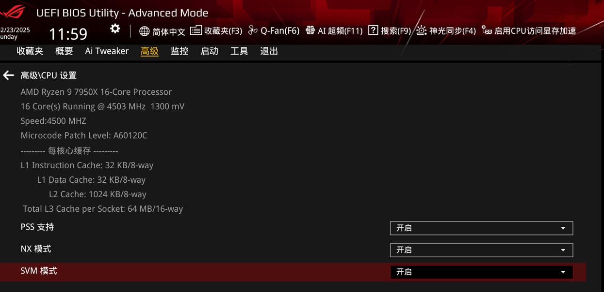
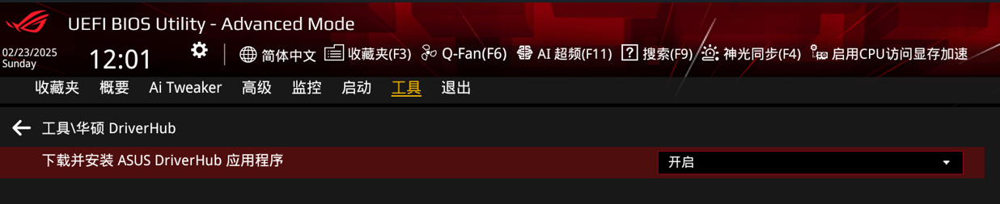

# 旧台式机

- **台式机配置**
- 电脑型号  微星 MS-7816 台式电脑 (扫描时间：2016年04月07日)

- 操作系统  Windows 7 旗舰版 64位 SP1 ( DirectX 11 )

- 处理器 英特尔 Xeon(至强) E3-1230 v3 @ 3.30GHz 四核

- 主板  微星 B85-G43 (MS-7816) ( 英特尔 Haswell )

- 内存  8 GB ( 金士顿 DDR3 1600MHz )

- 主硬盘 三星 SSD 840 Series ( 120 GB / 固态硬盘 )

- 显卡  Nvidia GeForce GTX 760 ( 2 GB / 七彩虹 )

- 显示器 通用非即插即用监视器

- 光驱  华硕 DVD-E818A9T b DVD光驱

- 声卡  瑞昱 ALC892 @ 英特尔 Lynx Point 高保真音频

- 网卡  瑞昱 RTL8168/8111/8112 Gigabit Ethernet Controller / 微星

# 新台式机

## 配置

- **处理器**
    - 型号：AMD Ryzen 9 7950X 16-Core Processor
    - 16核32线程

- **主板**
    - 型号：华硕 ROG STRIX X870E-E GAMING WIFI
    - 序列号：T1M0CS017899WYL
- **内存**：金士顿 64GB DDR5 4800MHz(32GB + 32GB )
- **显卡**：华硕 DUAL GeForce RTX 3060-O12G-V2
- **固态硬盘**：Samsung SSD 990 PRO 2TB
- **机械硬盘**：WDC WD20EZBX-00AYRA0 2TB
- **电源**：海韵 ATX3 FOCUS  GX1000
- **CPU散热器**：利民 FC140 风冷
- **机箱**：联力 L216

## U 盘安全性

## BIOS设置

- **TPM**

    

- **SVM 虚拟**

    

- **SATA 模式**

    

- **CSM 兼容**

    

- **安全启动**

    

- **ASUS DriverHub 驱动管理**

    

## 做系统

### 使用 Ventoy

- **分区**
    - 不要使用 DiskGenius 等分区工具分区。
    - 要使用官方镜像直接在 `未分配空间` 安装系统，安装程序会自动进行分区：系统分区、ESP 分区、MSR 分区。
    - 详见 `Windows` > `硬盘分区`

### 使用 PE

- VMware 备份
- Typora 取消激活
- 机箱只连接一个显示器，防止误认为黑屏。

- **分区**

    

- **Windows 安装器**

    

- 做完系统后先安装 `ASUS DriveHub` 安装驱动，然后再系统更新。

# MateBook 14

- **MateBook 14配置**

  - 电脑型号 HUAWEI MATE BOOK 14

  - 操作系统 Microsoft Windows 10 家庭中文版 (64位)

  - CPU (英特尔)Intel(R) Core(TM) i7-8565U CPU @ 1.80GHz(1992 MHz)

  - 主板 HUAWEI KLV-WX9-PCB

  - 内存 8.00 GB (  2133 MHz)

  - 主硬盘 510 GB (西数 WDC PC SN720 SDAPNTW-512G-1127 已使用时间: 未知)

  - 显卡 NVIDIA GeForce MX250

  - 显示器 奇美 P140ZKA-BZ1 32位真彩色 60Hz

  - 声卡 Realtek High Definition Audio

  - 网卡 Intel(R) Wireless-AC 9560 160MHz

## 解决办法

- 多屏协同不显示手机画面
  - 电脑端重置网络，电脑重启。
- 开机无线连接非常慢
  - 服务，找到wlan auto config，手动改为自动，重启。
- Fn 功能键/热键切换、设置方法
  - MateBook电脑管家，设置中心，功能键优先。

# Mate30 Pro 5G

## 解决办法

### 谷歌套件

#### 准备工作

- 从2020年开始，美国对华打压，华为手机正常手段不能使用谷歌套件，此方法是YouTube的[教程](https://www.youtube.com/watch?v=svPq4CEaGtU&t=983s)

- 将网盘存储的工具文件夹mobile3传入手机内部存储，暂时使用网盘中转，文件夹内容为：

  - GMS文件夹

    - googlefier 安装工具

    - google_play_store  google商店

  - Huawei
    - 手机备份

- 删除手机中一切关于google的软件和系统备份

  1. 删除这一步骤可以使用恢复出厂设置代替

  2. 删除google

     - 设置 > 应用和服务 > 应用管理 > 右上角4个点 > 显示系统进程 > 搜索"google"

     - 除了`Googlefier`以外，删除全部google软件和系统进程
       - 进一步删除
       - 应用市场 > 我的 > 安装管理 > 已安装
       - 除了`Googlefier`以外，删除全部google软件

  3. 删除系统备份

     - 设置 > 应用和服务 > 应用管理 > 右上角4个点 > 显示系统进程 > 搜索"备份"

     - 备份 > 存储 > 删除数据

- 关闭`应用分身`、`隐私空间`、`纯净模式`、`悬浮导航`，开启`锁屏密码`

- 使用`文件管理`将刚才下载的`Huawei`文件夹复制到`内部存储`根目录，`合并 `和`替换`

- 修改时间

  - 设置 > 系统和更新 > 时间和日期
  - 关闭`自动设置`，日期调整到`2019年...`

- 恢复备份

  - 设置 > 系统和更新 > 备份和恢复
  - 点`外部存储`，一路允许
  - 右上角`四个点`，正常没有`从内部存储恢复`选项
  - 返回至`系统和更新`再进`备份和恢复`，右上角`四个点`，`从内部存储恢复`选项出现，点击进入
  - 恢复至2019年12月7日

- 恢复备份完成以后，桌面出现`谷歌服务助手`

  - 打开谷歌服务助手，会出现7个操作选项，否则应该重复以上步骤
  - 点击`激活`
  - 激活后出现六项`感叹号`，`不要`点开始下载，让谷歌服务助手保持在后台，回到桌面

- 正式安装

  - 使用文件管理进入开始下载的GSM文件夹，安装`Googlefier`并进入
  - 点击`NEVERMIND,LET ME IN`，一路`Next`和`允许`
  - 点击`1`，`ok`，设置日期，打开`自动设置`，点击`左上角`返回
    - 返回以后在点击`1`没有反应，此时返回至桌面
  - 再次设置日期
    - 设置 > 系统和更新 > 时间和日期
    - 关闭`自动设置`，日期调整到`2019年...`
  - 切换至`Googlefier`，点击`1`，此时有反应，点`ok`，安装`MicroG-HUAWEI...`
    - 安装完成不要打开，直接返回至桌面
  - 再次设置日期
    - 设置 > 系统和更新 > 时间和日期
    - 打开`自动设置`
  - 打开`科学上网`，并切换至`全局模式`（尽量用美国节点），验证科学网络畅通
  - 打开`MicroG-HUAWEI...`
    - 点击`Account`，，右下角`SIGN IN`，第一次点击会闪退或报错
    - 返回再次点击`Account`，右下角`SIGN IN`
    - 登录谷歌
    - 登录成功后切换至`Googlefier`
      - `Googlefier`会提示再次打开`MicroG-HUAWEI...`
      - 如果想登录`多个谷歌账号`，必须在此时登录，否则一切安装完毕以后就无法登录了
      - 如果不想登录多个谷歌账号，即可切换回`Googlefier`，此时`1`消失
      - 其中`2`也是用来登录多个谷歌账号
  - 点击`3`开始安装谷歌全家桶
    - 安装过程中，每个软件安装完成后，不要点打开，要点完成
    - 当所有允许安装都完成以后，提示`卸载MicroG-HUAWEI...`，`强行停止`和`卸载`
    - `卸载MicroG-HUAWEI...`之后，会继续安装`Google Play 服务`
    - 至此`Googlefier`的使命完成，除非以后遇到问题，需要点击`小扫把`清除Google

  - 使用文件管理进入开始下载的GSM文件夹，安装`Google Play Store`，返回桌面
  - 检查网络畅通，打开`Google Play Store`
  - 完善
    - 如果出现错误，则清除`Google Play 服务`和`Google Play Store`的数据并重启手机
    - 如果不停报警通知，只需关闭通知即可
  - 最后，手机仍`未获得Play保护机制认证`，但不耽误使用
    - 网页版`Google Play Store`生成名称为设备`HUAWEI LIO-AN00`，原设备 `HUAWEI-MATE30`仍在
    - 不能在网页版Google Play Store下载软件

# 罗技M590

## 连接

1. 单击切换按钮，切换到指定编号
   - 默认 1 为笔记本，2 为台式机
2. 长按切换按钮，指示灯快速闪烁等待连接
3. `添加蓝牙或其它设备` - `蓝牙 (鼠标，键盘，手写笔)`

## 驱动

1. [**官网下载驱动 Options+**](https://www.logitech.com/zh-cn/setup/ergosetup/logi-options.html)

2. 微信登录

3. 软件设置

   

   

4. 点击鼠标图案，进入 FLOW，与另一台电脑连接（两台电脑应该在同一网络内）

5. 设置 FLOW

   1. 功能1，不点击鼠标切换按钮，鼠标移动至屏幕边缘即可切换至另一台电脑

   2. 功能2，不同电脑之间共用剪贴板

      

# 共和国之辉

## 快捷键

- **操作页面**
    - **`Q`**：建筑页面
    - **`W`**：武器页面
    - **`E`**：步兵页面
    - **`R`**：车辆页面
- **`D`**：部署部队
    - 中国，美国大兵的坐下和起立
    - 盟军坦克的变形
    - 从运输工具卸载部队
    - 基地车展开或收缩
- **`G`**：警戒目前区域
- **`X`**：散开部队
- **`Ctrl + 单击`**：强行攻击
- **`Alt`**：强制移动
- **`Z`**：路径
- **`F`**：跟随镜头
- **编队**
    - **`Ctrl + 1 ~ 9`**：部队编队
    - **`Shift + 单击`**：将其它部队加入已编号的编队
- **按类型选择单位**
    - **`T`**：选择视口内同类型单位或部队
    - **`TT`**：选择全局同类型单位或部队
- **按视口选择部队**
    - **`P`**：选择视口内所有部队
    - **`PP`**：选择全局所有部队
- **按星级选择部队**
    - **`Y`**：选择三星部队
    - **`YY`**：选择一星部队
    - **`YYY`**：选择无星部队
- **按生命值选择部队**
    - **`U`**：选择视口内所有残血部队
    - **`UU`**：选择视口内所有半血部队
    - **`UUU`**：选择视口内所有满血部队
- **`Space`**：前往雷达事件地点
- **`C`**：所有部队喝采
- **`Ctrl + Alt + 单击`**：跟随保护
- **``**：
- **``**：
- **``**：
- **``**：

## 偷术

- **方法**
  - 间谍 + 工程师

  - 己方建筑物需要微微掉血，地方无需掉血
  
  - 工程师在前，间谍在后
  
  - 框选 `间谍 + 工程师`，按住 `Z` 路径 > 点击空地 > 点击建筑物 > 松开 `Z` 路径，退出工程师
  
  - 如果将工程师换成谭雅或海豹部队或心灵突击队，间谍代替其爆破敌方建筑，且不会被地方发现
  
- **偷兵营**：出一级兵

- **偷战车工厂**：出一级武器

- **偷作战实验室**：解锁特殊兵种
  - **心灵突击队**：间谍进入苏军（非中国）或盟军作战实验室，并拥有盟军兵营

  - **尤里改**：间谍进入苏军（非中国）或盟军作战实验室，并拥有苏军（非中国）兵营
  - **超时空伊文**：间谍进入敌方盟军作战实验室，并拥有苏军（非中国）兵营
  - **时空突击队**：间谍进入敌方盟军作战实验室，并拥有盟军兵营

## 多功能步兵车

- **工程师**：相当于维修厂
- **疯狂伊文 / 超时空伊文 / 恐怖分子**：相当于自爆卡车

## 其它问题

- 虚拟机红警不全屏：将主机分辨率调至最低800*600

- 如果从主机复制红警地图和存储进度，在共享主机文件夹时不能选只读，否则系统识别不到

- 空投建筑物：单击已就绪的建筑物 > 单击 `维修` 不松手> 在建造点单击右键，然后松开左键

# 三国赵云传

## 顶级装备

### 物品炼制

- **炼制地点**
  1 易城，道观； 
  2 卧牛镇，铁匠； 
  3 许昌，铁匠； 
  4 荆州，铁匠； 
  5 破阵前，刘备大营，铁匠； 
  6 土旗阵破后，五行大阵中央，铁匠。 

- **炼制公式**

  龙鳞＋紫水晶＝龙卷风笺
   凤羽＋紫水晶＝火凤凰书
   龙鳞＋凤羽＝[雷神](https://www.baidu.com/s?wd=雷神&tn=SE_PcZhidaonwhc_ngpagmjz&rsv_dl=gh_pc_zhidao)书

  

  武器/防具＋龙鳞（最多加5个）＝（蓝）附加冰冻效果/抵抗冰系魔法（靴子）

  武器/防具＋凤羽（最多加5个）＝（红）降低敌人进攻/抵抗火系魔法（盔甲）

  武器/防具＋龙凤凤（最多加1套）＝（墨绿）附加毒系攻击/抵抗毒系魔法（头盔）

  武器/防具＋龙龙凤（最多加1套）＝（炽白）降低敌人防守/抵抗电系魔法

  武器/防具＋龙凤＝永固

  

  普通＋加强＝超强+加强＝珍稀+超强＝神奇+珍稀＝绝世

  普通＋改良＝精致+改良＝特制+精致＝珍稀+特制＝绝世

  普通+玄武=白虎+玄武=朱雀+白虎=青龙+朱雀=苍穹/浑元

### 枪

[方天画戟](https://www.baidu.com/s?wd=方天画戟&tn=SE_PcZhidaonwhc_ngpagmjz&rsv_dl=gh_pc_zhidao)＋浑元画戟＝化影戟*＋紫水晶＋[白虎之魂](https://www.baidu.com/s?wd=白虎之魂&tn=SE_PcZhidaonwhc_ngpagmjz&rsv_dl=gh_pc_zhidao)＋龙卷风笺＝龙胆枪*

钢?槊＋紫水晶＝狼牙枪＋紫水晶＋白虎之魂＋青缸剑＝寒杀枪*

寒杀枪＋紫水晶＋冰凌笺＝冰枪*

寒杀枪＋紫水晶＋力量之酒＋苍鹰之翼＝真空枪*

蛇?戟＋紫水晶＋火蛇符＋火轮符＝火焰枪*

### 铠甲

白锦云花甲＋紫水晶＋[雷神](https://www.baidu.com/s?wd=雷神&tn=SE_PcZhidaonwhc_ngpagmjz&rsv_dl=gh_pc_zhidao)书＋金刚之盾＝金刚甲*

燕翎金甲＋紫水晶＋龙卷风笺＋金刚之盾＝龙鳞宝铠*

### 头盔

勇士盔＋紫水晶＝将军盔＋紫水晶＝大将军盔＋紫水晶＝元帅盔＋紫水晶＝霸王盔
 狮头盔＋狼头盔＋鬼符咒＝鬼面盔*＋紫水晶＋[雷神](https://www.baidu.com/s?wd=雷神&tn=SE_PcZhidaonwhc_ngpagmjz&rsv_dl=gh_pc_zhidao)书＋金刚之盾＝金刚盔*（终极）
 风盔＋紫水晶＋火凤凰书＋苍鹰之翼＝飞凤盔*

### 靴子

神行靴＋紫水晶＋苍鹰之翼＝疾风靴*

### 剑

神木剑＋桃木剑＋紫水晶＋太极符＝斩妖剑*

青缸剑＋紫水晶＋[白虎之魂](https://www.baidu.com/s?wd=白虎之魂&tn=SE_PcZhidaonwhc_ngpagmjz&rsv_dl=gh_pc_zhidao)＋生命之心＝吸血剑*

青缸剑＋紫水晶＋雷神书＋苍鹰之翼＝闪电剑*

倚天剑＋紫水晶＋太极符＋生命之心＝七星剑*

倚天剑＋紫水晶＋雷神书＋力量之酒＝雷光剑*

### 弓

养由弓＋紫水晶＋火蛇符＋火轮符＝火神弓*

李广弓＋紫水晶＋力量之酒＋苍鹰之翼＝通天弓*

## 拜师学艺

- 进山洞前，进入左慈屋内，宝箱内有装备

### 清理后山山洞

- 进山洞后，从最外圈进，从最外圈出
- 枪杀木头人
- 有2个巫术师，左上角和右下角，boss是左上角，右下角的巫术师应该从左侧进入地图中间，宝箱有智慧水
- 此图能得到2个智慧水，1个凤羽，每样最少留一个复制用
- 任务之后，学会弓术

### 打兔子

- 弓箭射杀30只野兔

- 屏幕右上角有三个宝箱，中间银色的可以满血

- 在前山一共可以杀到29只，而后回来在屋前再杀1只仙兔充数就算是完成任务了

- 交任务前，右上角有宝箱，有智慧水

- 任务结束，学会升龙回旋斩和后勤术

### 废墟任务

- 废墟门前左边有一口井，可以将血补满

- 先清外圈，各个角落都有宝箱

- 枪杀木头人，剑对付武师，弓箭射祈祷师

### 打老虎

- 此图可得智慧水，龙鳞，白虎，生命，金刚盾，力量酒，苍鹰，太极符（留着炼**斩妖剑**）

- 留一个智慧水复制，其余用掉，弓箭可升至专家级，为炒钱做准备
- 弓箭可合并

- 下山路上有香火工，可买咒符备用，香火工旁宝箱有烧鸡

## 黑山报仇

### 射箭炒钱

- 回到赵庄，开始射箭炒钱
- 把弓箭术升到专家级，背175个箭(要3筒半)
- 把1筒弓箭用Ctrl+鼠标左键强行射出174支留1支
- 查看这1支弓箭的价格
- 把第2筒175箭背到身上，用刚看完价格的的1支弓箭的点一下身上背的175只弓箭，这个时候身上背的弓箭价值是10000。
- 这1支弓箭切记不要丢了。留在包袱里。以后再合一壶175只箭。装在身上，只要用这一只箭点一下就可以卖10000。
- 如果使用**蔚蓝箭支**，单次可炒20000

### 打黑山

- 左下角找樊娟，左上角一起去墓地，往左走进入墓地，哭完回赵家庄，左下角上黑山
- 黑山老三用剑杀，身上随机爆**桃木剑**（留着炼**斩妖剑**）

- 黑山老大掉力量酒
- 从右侧进山洞，洞口有宝箱别开，掉血
- 先在门口用弓箭射杀旁边两个巫术师，最后干大boss，可得凤羽、**玄学指南书**
- 洞口有马，出洞还给红衣少女，学会**御马术**
- 扫平黑山下山过程中，有个隐蔽山谷，里面有宝箱，随机出龙凤紫水晶
- 回到赵家庄

## 投军袁绍

- 赵家庄**东南**方向去投军，经过樊庄铁匠换装备
  - 此处可买**狼头盔**，一直戴着，为炼制**金刚盔**做准备
- 樊庄**右下角**去军营
- 见袁绍，**左下角**回樊庄准备
- 樊庄斩淳于琼，**张郃赠马**

## 公孙账下

### 物品复制

- **可以复制的地点**
  - 1公孙瓒大营的铁匠；2易城的铁匠、店小二、道观外的道士；3卧牛镇的铁匠；4征吕布时刘备大营的副将；5荆州的铁匠（救华佗回来后，转为酒楼老板）；6新野铁匠；7冲出长坂时的军需官；8破阵前刘备大营的军需官。在以上这八处都可以复制物品。

- **复制办法**
  1. 你先卖一个想要复制的物品给他
  2. 然后和他原来卖的东西交换一下位置，再买回来的时候，就成为无限的了。
  3. 注意：第4与第8两个地点只能复制龙鳞之类的占单格物品；第7个地点，最多只能复制弓、剑等占三格的物品；其他地点，只要排列得当，占八格的枪也能复制！
  4. 在无空间的地方复制多格的物品： 
     只要将销售商处的任意两件物品互换一下位置，再买的时候，空间就自动腾出来了！买几格的物品，就能腾出几格的空间。注意：购买的时候用左键，不要使用右键购买！
  5. 一定要**注意**：**技能点**显示值不要太大，否则数据溢出出错！

### 回帐休息

- 公孙瓒大营铁匠买**勇士盔**，买下准备炼制**霸王盔**
- **右上角**军营帐篷休息，得**兵器指南书**、龙凤

### 界桥救公孙瓒

- 公孙瓒大营**左下角**进界桥

- 击败袁绍和颜良，回公孙瓒大帐

### 破袁绍大营

- 额外两个支线任务

  - 商人让去城西南杀一个胖山贼，胖山贼旁的小兵掉**狼头盔**，留着炼制；

  - 一个道士让去杀一只老虎取回**玉横**，取回玉横便可以**炼制物品**。
- 从城西南进地图，先完成支线任务，紧接着可以直接进入袁绍大营
- 刚进大营地图，小兵随机掉**神木剑**（炼斩妖剑），杀鞠义，得玄武画戟
- 回易城，炼**炽白的斩妖剑**，向易城右上角太守复命
- 提前准备足够的龙鳞凤羽紫水晶，许昌不能复制
- 画面**右下角**去曹营送信
- 在送信的路上，路边石头旁边有个箱子．里面是**加强虎贲弓**．出口在**右下角** 
- 送完信就到了易城．
- 正好袁绍在屠城．公孙府门口的兵会暴**加强龙泉剑**（如果想要，在未打到加强龙泉之前，不要进帅府）
- 某个偏将掉**马术指南书**
- 进府和[公孙瓒](https://www.baidu.com/s?wd=公孙瓒&tn=SE_PcZhidaonwhc_ngpagmjz&rsv_dl=gh_pc_zhidao)说话，获得**钢槊**．火焰后面宝箱里有**防御术**

## 得遇明主

- 到达卧牛镇，马的装备栏物品全部掉落。可以将**钢槊**直接装备在身上
- 休闲小站买水晶综合汤
- 铁匠处炼物品
- **卧牛山找马**

  - 卧牛镇**左下角**去卧牛山找马．
  - 路上箱子里有水晶．
  - 进山寨后，在刚进门的台阶右边的箱子里有改良藤甲
  - 在山寨门口，随机获得金锁甲和白虎画戟
  - 打败裴元绍，和文路从**右下角**回卧牛镇找马
  - 镇北找胡二，给胡二娘钱，获得**学习指南**
  - 炼燃烧绝世藤甲
  - 卧牛镇**左下角**去山寨，到山寨陪文路去左上角悬崖边
  - 接到报告，山寨**左下角**去后山
  - 打败周仓，追周仓遇刘备，进屋谈话，出门口军需官找刘备，进刘备大帐

## 战吕布

- 刘备大营右上角去下邳

- 吕布掉方天画戟，某个兵掉白虎画戟，左上角回下邳见刘备

- 北面巡逻，曹操屋内遇貂蝉，带貂蝉见刘备，送回貂蝉，左上角去白门楼

- 刘备大营复制材料，下个场景不能复制

- 刘备大营，进屋见貂蝉，出门右下角陪貂蝉逛街
  - 找商人给貂蝉买礼物
  - 找铁匠买2个朱雀画戟，为炼龙胆枪做准备

- 此处不要炼龙胆枪（枪系终极武器），因为不能复制，材料不足
- 上城楼见曹操
- 东南见张将军

## 荆州新野

- 许昌城南（左下角）断后

- 见裴元绍，刘备大营左上角马厩旁步兵军需官去荆州

- 荆州炼龙胆枪（枪系终极武器），白虎画戟+朱雀画戟=青龙画戟+朱雀画戟=浑元画戟+[方天画戟](https://www.baidu.com/s?wd=方天画戟&tn=SE_PcZhidaonwhc_ngpagmjz&rsv_dl=gh_pc_zhidao)＝化影戟＋紫水晶＋[白虎之魂](https://www.baidu.com/s?wd=白虎之魂&tn=SE_PcZhidaonwhc_ngpagmjz&rsv_dl=gh_pc_zhidao)＋龙卷风笺＝龙胆枪*

- 荆州西找裴元绍，斩张武得卢马，回荆州
- 荆州西南找军需官回刘备大营，刘备大营献白马，上方找貂蝉小酌

- 到新野，右上方找貂蝉，出门裴元绍，左上角找刘备，出门跟裴元绍对话，左下角进博望坡
  - 新野铁匠卖狮头盔，为炼金刚盔做准备
  - 新野南方可买马

- 博望坡机关退敌，清除残兵，打败夏侯兰并放走，画面切回新野，找貂蝉

## 长坂扬名

- 长坂坡一，
  - 在这里可以捡到狮头盔，留着炼制。
  - 先找到裴元绍。冲杀一阵后，裴元绍出现(点击)，两人一齐向右杀过去，进入长坂坡二 
- 长坂坡二，
  - 在右下角找到简雍，简雍告知主母和小主人在北边，刘备被张飞救至南边。于是赵云和裴元绍杀向北边，依次进入长坂坡三、四， 
- 长坂坡四，
  - 在长坂坡四左上角(点击)一个士兵告知夫人和小主人往南方去了，于是一路向南杀下，依次经过长坂坡四、三、二，从二右下角进五
- 在长坂坡五的左下方找到了甘夫人，斩淳于导 
- 赵云则继续向西北方寻找糜夫人和阿斗，回到长坂坡二后向西回长坂坡一，再在西北角进入长坂坡六，发现夏侯恩，杀之取得青缸 
- 再向西到长板坡七（注意：长坂坡七有时间限制，动作要迅速），两人在左上方找到糜夫人和阿斗，赵云捡起阿斗(身上要有六格空物品少于 80个)
- 向右杀到长板坡六，再向下到长板坡一，这时突然出现了一个无比厉害的幽灵将军，此人实在太厉害了，血又无限长，应尽量躲避， 过一分半钟后，貂蝉救赵云 
- 赵云醒来后，斩马延，焦触二将 
- 向右来到长坂坡二，斩张南、曹真，二者掉智慧水
- 向下到达长坂坡五，斩钟绅、钟缙
- 向右上，来到长坂桥，终于见到张飞！桥头有马倌、军需官，可以换马。
- 见刘备，刘备摔孩子

## 别故友

- 右上角去荆州见夏侯兰，夏侯兰自杀，斩曹真
  - 到荆州可复制可炼装备

  - 狮头盔＋狼头盔＋鬼符咒=鬼面盔＋紫水晶＋雷神书＋金刚之盾=金刚盔（终极头盔）+ 龙凤凤（最多加1套）＝（墨绿）

  - 青缸＋紫水晶＋雷神书＋苍鹰之翼＝闪电剑（闪电效果）＋龙龙凤

- 去荆州北门找驿官，去许昌
- 到许昌右下角找张郃，右下角找张郃母亲，出张母家门，往左走，进门见张郃，得天牢令牌，左上角进天牢救华佗
- 救人之前，尽量消灭所有敌人！
- 东南方向进第二层，东北方向回第一层，西北方向下第二层，华佗就在这里，先杀许褚再救人！
- 出口：西北方向回第一层，东北方向下第二层，东南方向上第一层，西南方向出口到地面，张郃接应，从后门撤退！
- 出去后有一波怪，有妖术师，攻坚圈所有
- 出去后有客栈，客栈外面有俩人，倒买倒卖能赚钱，里面书生卖倚天剑20000
- 回荆州，葬樊娟后，华佗赠医术指南书（注意：物品栏中要有放书的空间，否则场景切换，书就没有了）
- 到荆州炼装备，此场景不能复制
  - 倚天剑＋紫水晶＋雷神书＋力量之酒＝雷光剑*

- 荆州城左上角，打城西山贼，左上角进荆州地洞
- 如果想再拿化影戟、鬼面盔，先不要去打幽灵法师，先去下面宝箱打开拿到宣花斧解开封印，再去第二层右上角打BOSS幽灵法师，可得，从第二层左下角回第一层，第一层左上角回地面

## 五行大阵

- 与诸葛亮谈话，进大帐，出大帐右上角陪褚葛亮上山察看五行大阵，确保背包至少6个空，打败[南华老仙](https://www.baidu.com/s?wd=南华老仙&tn=SE_PcZhidaonwhc_ngpagmjz&rsv_dl=gh_pc_zhidao)，得燕翎金甲。回大营	

- 军需官处复制：
  - 1个雷神书，1个龙卷风，3个紫水晶，1个苍鹰。2个金刚，14个龙鳞，12个凤羽
- 铁匠处，炼燃烧燕翎金甲，燕翎金甲＋紫水晶＋龙卷风笺＋金刚之盾＝龙鳞宝铠 + 5凤=红色

- 找周仓买紫电马

- 进屋商议，第二天破五行大阵

- 在破第一个土阵，打败[徐晃](https://www.baidu.com/s?wd=徐晃&tn=SE_PcZhidaonwhc_ngpagmjz&rsv_dl=gh_pc_zhidao)时得神行靴。神行靴＋紫水晶＋苍鹰之翼＝疾风靴。深蓝

- 第二个阵，打夏侯淳得吸血剑

- 第三阵，打曹仁得寒杀枪

- 第四阵，救黄忠得通天弓  

- 第五阵，杀许褚得飞凤盔，全凤羽，红色，防火

- 第六阵，杀败典韦得白云锦花甲。
  - 白锦云花甲＋紫水晶＋雷神书＋金刚之盾＝金刚甲（比较BT的盔甲）+5凤。其实在破第七个日阵时，打败南华老仙一样可以获得

- 日月大营，杀南华老仙得白锦云花甲，杀曹仁，得雷光剑

- 最后打修罗吕布
