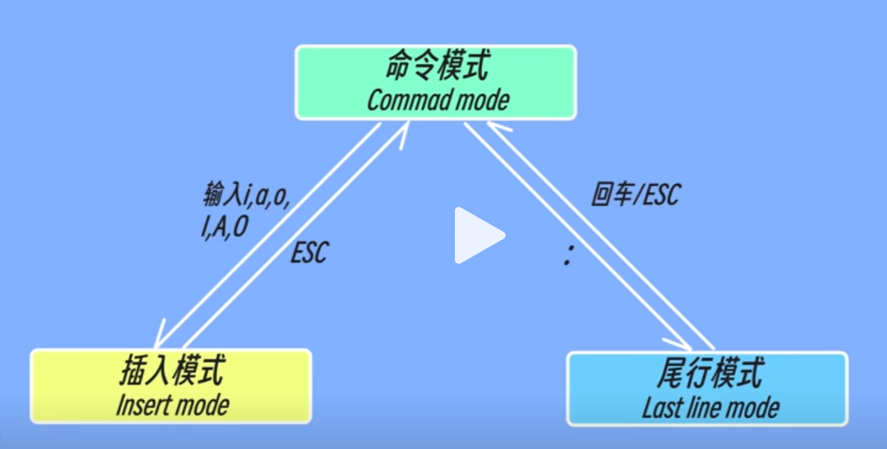

# Linux 基础

Linux 是一个开源的类 Unix 操作系统内核。它是一个多用户、多任务、支持多种处理器架构的操作系统。

## 环境搭建

### 在Windows中搭建

- 在Windows中搭建Linux有以下方法：虚拟机、WSL、Live CD/USB、远程服务器

#### WSL

​	WSL提供了与 Windows 集成较好的 Linux 子系统，可以在 Windows 上直接运行 Linux 命令。

- **启用 WSL**

1. 打开 PowerShell 作为管理员

   右键点击开始菜单，选择 "Windows PowerShell（管理员）" 或 "命令提示符（管理员）"。

2. 启用 WSL

   ```powershell
   dism.exe /online /enable-feature /featurename:Microsoft-Windows-Subsystem-Linux /all /norestart
   ```

3. 启用虚拟机平台功能

   ```powershell
   dism.exe /online /enable-feature /featurename:VirtualMachinePlatform /all /norestart
   ```

4. 重启计算机

   ```powershell
   restart-computer
   ```

- **安装 WSL 2**

1. 下载并安装 WSL 2 Linux 内核更新包：[WSL 2 Linux 内核更新包](https://aka.ms/wsl2kernel)

2. 设置 WSL 默认版本为 2

   ```powershell
   wsl --set-default-version 2
   ```

- **安装 Linux 发行版**

1. 打开 Microsoft Store。
2. 在搜索栏中输入你想要安装的 Linux 发行版的名称，例如 "Ubuntu"。
3. 选择并下载你选择的 Linux 发行版，例如 "Ubuntu 20.04 LTS"。
4. 安装完成后，点击启动，设置用户名和密码。
   1. 注意：即使你输入密码，也不会在屏幕上显示，就像没输入一样。


- **使用 WSL**

1. 打开 PowerShell 或者命令提示符，输入`wsl -l`。
2. 或者可以直接运行 `wsl.exe`。

- **维护 WSL**
  - 打开 PowerShell 或者命令提示符
  - 升级 WSL  `wsl.exe --update`
  - 查看已安装的 Linux 版本  `wsl -l`
  - 升级Linux  `sudo apt update`     `sudo apt upgrade`

## Zsh

- Zsh（Z Shell）是一种命令行解释器，也是一种交互式的 Unix shell，它是 Bash 的替代品。

- 安装 Zsh

  ```bash
  # 安装
  sudo apt install zsh
  # 设置 Zsh 为默认 shell
  chsh -s $(which zsh)
  ```

- 安装 Oh-My-Zsh 插件

  ```bash
  # 下载
  wget https://gitee.com/mirrors/oh-my-zsh/raw/master/tools/install.sh
  # 安装
  sh install.sh
  ```


- 安装 Zsh 主题和插件

  ```bash
  # PowerLevel10k主题
  git clone https://github.com/romkatv/powerlevel10k.git $ZSH_CUSTOM/themes/powerlevel10k
  # zsh-autosuggestions自动提示插件
  git clone https://github.com/zsh-users/zsh-autosuggestions ${ZSH_CUSTOM:-~/.oh-my-zsh/custom}/plugins/zsh-autosuggestions
  # zsh-syntax-highlighting语法高亮插件
  git clone https://github.com/zsh-users/zsh-syntax-highlighting.git ${ZSH_CUSTOM:-~/.oh-my-zsh/custom}/plugins/zsh-syntax-highlighting
  ```

- 编辑 `~/.zshrc` 文件启用插件和主题

  ```shell
  # 修改主题
  ZSH_THEME="powerlevel10k/powerlevel10k"
  
  # 启用插件
  plugins=(
    git
    zsh-autosuggestions
    zsh-syntax-highlighting
  )
  ```

- 重启终端，启动 PowerLevel10k 配置向导

  ```bash
  p10k configure
  ```

## 系统管理

- **用户**

  ```bash
  # 查看当前用户
  whoami
  # 创建用户
  sudo adduser $NEW_USER
  # 将用户添加到 sudo 组
  sudo usermod -aG sudo $USER
  # 切换用户
  su - $USER
  ```

- **包管理器**

  ```bash
  # 升级默认包管理器 apt
  sudo apt update
  # 安装snap
  sudo apt install snapd
  ```

- **命令行工具**

  ```bash
  # 安装 curl
  sudo snap install curl
  ```

- **其它命令**

  ```bash
  # 添加到开机启动
  sudo systemctl enable $APPICATION
  # 以超级权限执行命令（让普通用户变成root用户）
  sudo $COMMAND
  ```


## 操作常识

- **复制**：`Ctrl + Shift + C`
- **粘贴**：`Ctrl + Shift + V`
- **强制从输出中退出**：`Ctrl + C`
- **直达命令行首**：`Ctrl + A` / HOME
- **退出系统**：`Ctrl + D` / `exit`
- **$**：行首的 `$` 表示终端正在等待输入命令
- **跨行输入**：行尾使用 `\`
- **多条命令**：以 `;` 隔开
- **大小写**：命令中的大小写不敏感
- 以`.`开头的文件和目录为隐藏文件

## 路径

- **目录结构**：`/Home/USER_NAME/...`
- **路径分隔符**：正斜杠 `/`
- Linux 特有路径（区别于 Windows）
  - Home目录：`cd` 或 `/Home`
  - 上一次的工作目录：`cd -`

- 其它详见 [`web-basics` > `路径`](../../web-basics/web-basics.md#路径)


# 文件

## 文件基础

- **基础命令**

  ```bash
  # 查看文件
  cat $FILE
  # 创建文件
  touch $FILE
  # 编辑文件
  nano $FILE
  vim $FILE
  # 删除文件
  rm $FILE
  # 复制文件
  cp $FILE $DES_PATH
  ```

- **文本搜索**

  ```bash
  grep CONTENT
  ```

- 替换

  `sed`：流编辑器，用于对文本进行流式处理；`-i`：在原文件修改；`s`：替换；`g` ：全局替换

  ```bash
  sed -i 's/SOURCE_CONTENT/NEW_CONTENT/g' 'PATH/FILE'
  # eg
  sed -i 's/aaa/bbb/g' './html.py' # 将当前文件夹下的html.py文件中的aaa替换成bbb
  ```

- `echo`：快速向文件添加内容

  ```bash
  echo "[CONTENT]" > [FILE]
  # eg
  echo "Hello World!" > demo.txt
  ```

- 查找文件

  ```bash
  find PATH OPTION COMMAND
  # eg
  find . -name jquery* -print # 查找当前目录下所有文件名以jquery开头的文件，并打印路径
  ```

## Vim

**Vi**（Vi IMproved）是 Unix 系统上最早的文本编辑器之一，**Vim**（Vi IMproved）是 Vi 的增强版。

### Basics

- Basics

  ```bash
  # show version
  vi / vim
  # open / create file
  vim $FILE
  # into insert mode
  i
  # back to command mode
  `Esc`
  # exit
  :q
  # save and exit
  :wq
  ```

### Command mode

- Default enter into command mode.

  

- `Esc`: Back to command mode

- `dd`: Cut cursor line. `2dd`: Cut cursor and next line

- `yy`: Copy cursor line. `2yy`: Copy cursor and next line

- `p`: Paste at next line of cursor. `2p`: Paste at next line of cursor 2 times

- `Ctrl + F`: Page Up. `Ctrl + U`: Page Up Half.

- `Ctrl + B`: Page Down. `Ctrl + D`: Page Down Half.

### Insert mode

- Into insert mode
  - `i`: before cursor
  - `I`: line beginning
  - `a`: after cursor
  - `A`: line end
  - `o`: next new line
  - `O`: previous new line
- Edit
  - `^`: jump to line beginning
  - `$`: jump to line end

### Last line mode

- `:`: Into last line mode
- `:q`: exit
- `:wq`: save and exit
- `:set nu`: show line number
- `:set nonu`: close line number

# 文件夹

## 文件夹基础

- **基础命令**

  ```bash
  # 创建文件夹
  mkdir [PATH] FOLDER_NAME
  # 删除空文件夹
  rmdir [PATH] FOLDER_NAME
  # 删除非空文件夹
  rm -r [PATH] FOLDER_NAME
  # 列出文件夹内容
  ls [-al] # -al列出隐藏内容
  ```

# 命令选项

- `-rf` 选项是 `-r` 和 `-f` 的组合

  `-r` 选项，以确保递归删除子目录和文件。

  `-f` 选项，强制删除。

# 其它

- **|**：管道符，命令输出传递

  eg：打开 `tmp` 文件夹中的 `html.py` 文件 → 找出字符串 `jquery-1.11.3.min.js`

  ```bash
  cat /tmp/html.py | grep jquery-1.11.3.min.js
  ```

# 解决方法

## 密码反馈

​	在 Linux 终端中，默认情况下，输入密码时是不可见的，这是出于安全性考虑。然而，如果你想让密码在输入时可见，有一些方法可以实现。

- 打开 sudoers 文件：`sudo visudo`

- 找到`Defaults   env_reset`行，添加`pwfeedback`，如下

  ```bash
  Defaults env_reset,pwfeedback
  ```

- 这将启用密码反馈功能，使得在输入密码时可以看到 * 星号，但仍然不是明文显示。


## 安装软件

1. 下载 deb 安装包

2. 进入安装包目录

3. 命令行安装

   ```bash
   sudo dpkg -i [软件名]
   # eg
   sudo dpkg -i google-chrome-stable_current_amd64.deb
   ```

   


