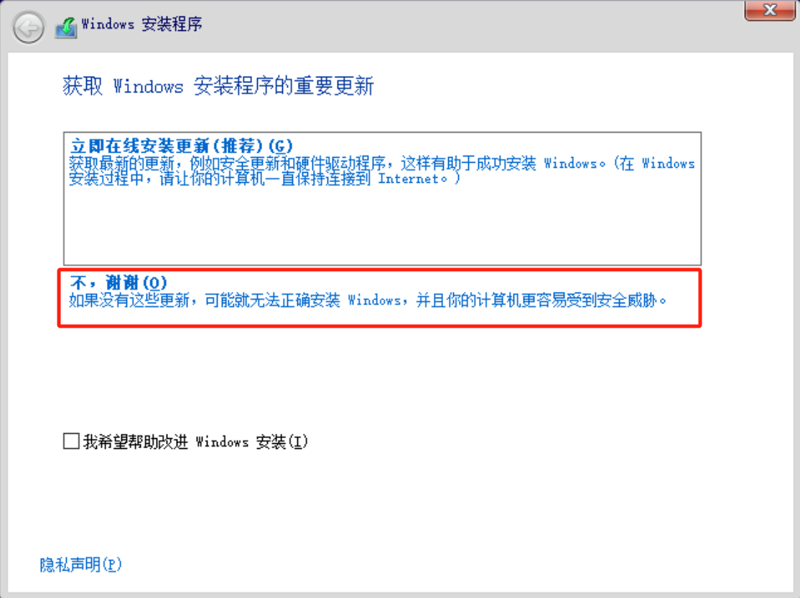
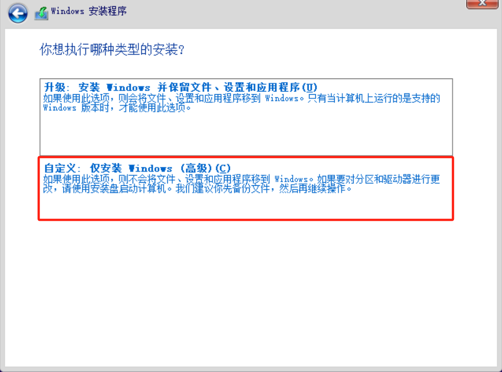
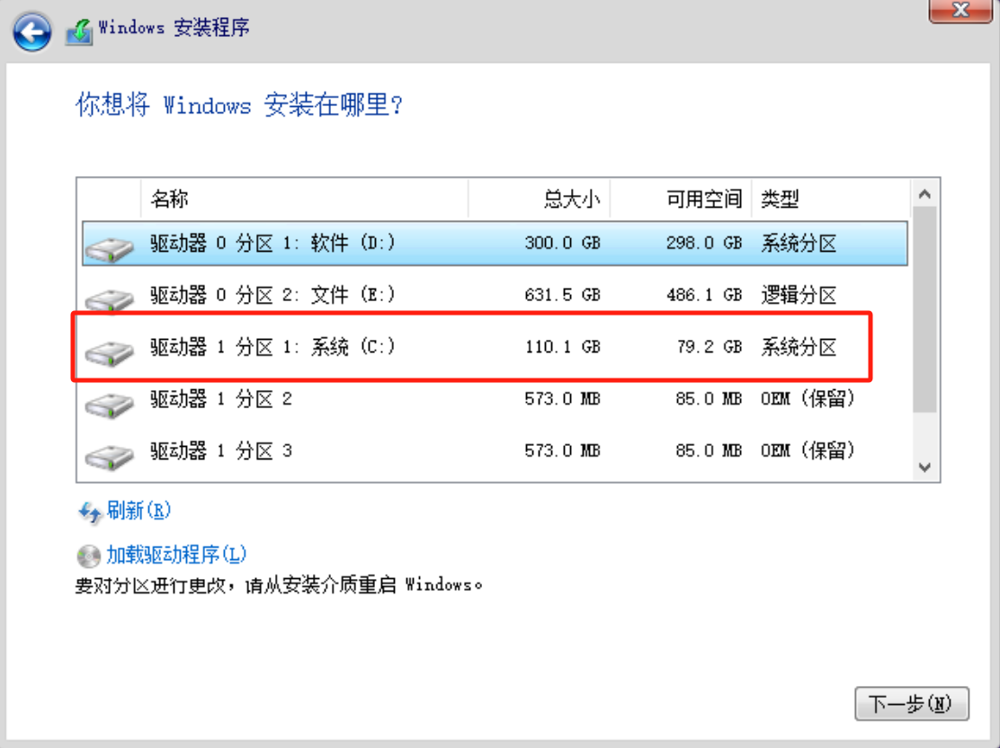
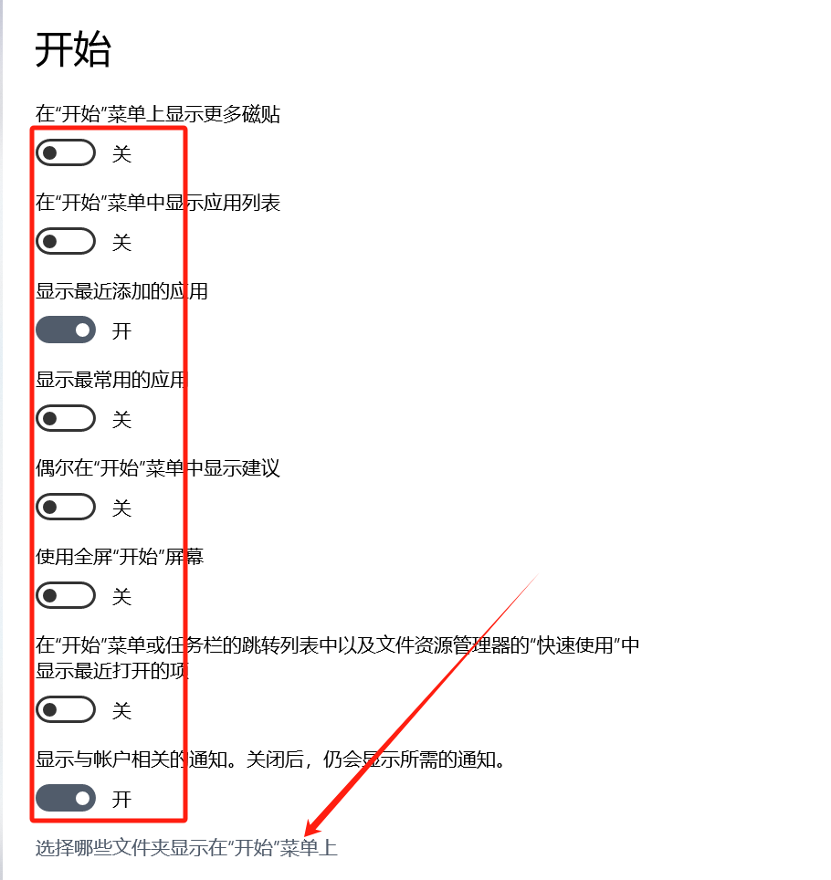
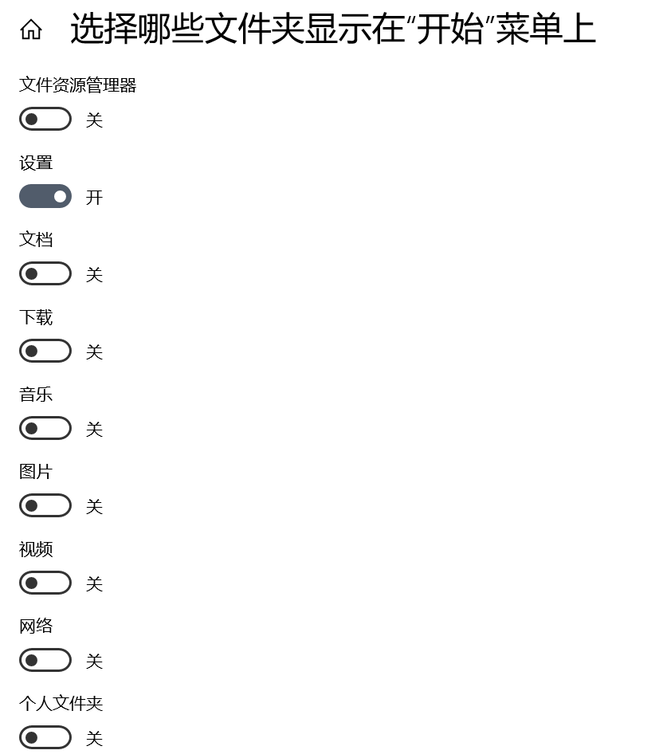
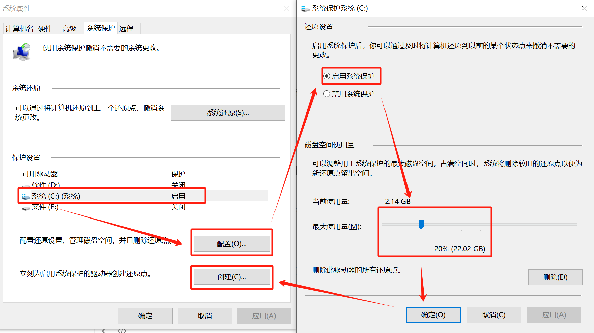
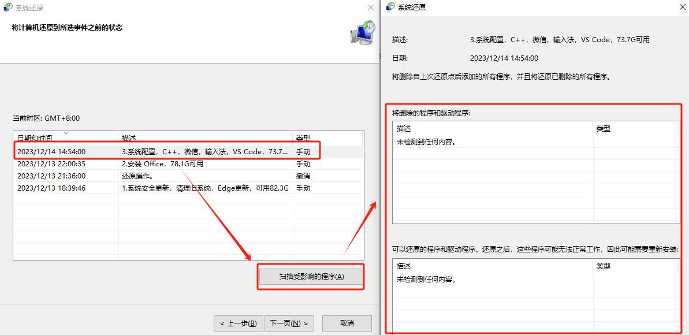
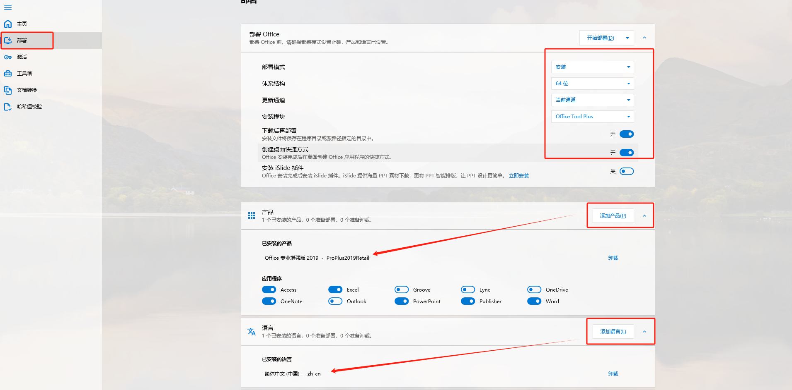
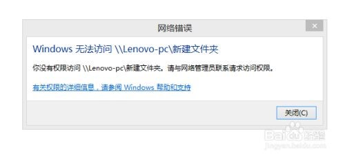

# Windows 基础

## 路径

- **目录结构**：`cd C:/Users/USER_NAME`
- **路径分隔符**：默认`\`，绝大多数时候都支持正斜杠 `/`
- 其它详见 [`web-basics` > `路径`](../../web-basics/web-basics.md#路径)

# 环境搭建

## Win 10 系统

### Win 10新系统

1. 此方法是在原系统为**已激活**的 “Win7专业版” 或 “Win10专业版” 基础上重新做全新系统

2. 准备

   1. 网盘下载 “Windows10多版本官方” ISO 文件
   2. Typora 取消激活

3. 双击进入 ISO 文件，进入 sources 文件夹，双击 setup.exe 运行安装程序

   1. 注意不要运行根目录的 setup.exe

4. 这里选择第二项“不，谢谢”，本地安装

   

5. 选择“我没有产品密钥”

   

6. 选“Windows 10 专业版”

   

7. 安装选择

   1. 如果想保留原来系统的个人文件和程序，就选第一个

   2. 一般情况想要一个全新的系统，选第二个

      

8. 这里一定要注意选择分区，不要看类型，要看盘符和磁盘大小

   

9. 安装过程简单选择

10. 此方法激活状态为：

    1. 版本：Winsows 10 专业版
    2. 激活：Winsows 已使用与 Microsoft 账户关联的数字许可证激活

11. 做完系统记得弹出 DVD 光驱

12. 接下来进入 Win10 配置

### 家庭升专业

- Windows10家庭版升级到Windows10专业版

  - 开始开始—设置—更新和安全—激活—更改产品秘钥—输入：
  - TPYNC-4J6KF-4B4GP-2HD89-7XMP6/W269N-WFGWX-YVC9B-4J6C9-T83GX
  - 更新至专业版
  - 然后使用激活工具激活

- Windows7升级到Windows10

  此种方法为官方升级方案，新Windows10系统为正版Windows10系统。

  新系统想用什么版本（比如旗舰版），原Windows7系统九必须为哪个版本，并且激活期限与原系统相同。

  微软官网下载“Windows10更新助手”，按照引导更新系统即可。

### win 10 激活

- 此方法在虚拟机试验，安装的是官方Win10专业版
- Win10专业版，运行Power Shell(管理员)，依次输入
  - slmgr /ipk W269N-WFGWX-YVC9B-4J6C9-T83GX
  - slmgr /skms kms.03k.org
  - slmgr /ato

### Win 10 配置

#### 初期配置

1. 检查系统版本和激活状态
2. 系统更新，简单调整固定任务栏
3. 升级和配置 Edge
4. 格式化 D 盘
5. 安装 Office
6. 安装输入法、Typora
7. 配置鼠标
8. 以上所有工作都完成，重启一次电脑
9. 最后通过“磁盘管理”清除旧系统（windows.old）以及一切待选项
10. 重启电脑，创建第一个还原点

#### 系统设置

1. 系统
   1. 屏幕：设置多显示器
   3. 存储：
      1. 开启并配置存储感知，频率为一周
      2. 更改新内容的保存位置
      3. 优化驱动器

2. 个性化

   1. 开始

      

      

   2. 任务栏

      

      

      

      

3. 应用

   1. 应用和功能：删除自带应用
   2. 启动：关闭启动应用

4. 账户

   1. 验证密码，开启账户同步

      

5. 更新和安全

   1. Windows 更新

      

6. 开启“卓越性能”

7. 资源管理器，文件扩展名，隐藏项目

8. 配置 NVIDIA

   1. 打开 NVIDIA > 桌面
   2. 取消“添加桌面上下文菜单”，这能能取消鼠标右键中的 NVIDIA
   3. 取消“显示通知托盘中的图标”

9. 局域网共享

10. 规划开始菜单

11. 重启电脑，创建第二个还原点

#### 安装软件

1. 4.QQ，Q-汽水-网易-酷狗-酷我音乐，微信，网盘，抖音，Slack，迅雷和影音，MusicBee，Bandzip
2. 设置默认软件
3. 重启电脑，创建第三个还原点
4. 搭梯子，Chrome
5. Python、Pycharm、VS code、CAD
6. 重启电脑，创建第四个还原点
7. 本次创建还原前安装的软件
   1. picasa，MusicBee（配置），vmware，vs code（配置）


# 还原点

- 还原点只是对系统配置的保存，并不是对 C 盘文件的保存

## 创建还原点

1. 创建还原点准备

   1. 在敏感操作之前最好创建还原点
   2. 在磁盘管理中清除系统垃圾
   3. 重启电脑

2. 开始图标 > 右键 > 系统 > 系统保护 > 选择 C 盘 > 配置

   

3. 创建

   1. 创建还原点之前，应该在系统还原中扫描一下受影响的程序，并将它们和 C 盘可用空间标记在新还原点的描述中

      


## 恢复还原点

1. 开始图标 > 右键 > 系统 > 系统保护 > 选择 C 盘 > 系统还原

2. 如果还原至 Typora 授权以前，应取消 Typora 授权

3. 扫描可能因为还原受影响的软件，以便还原以后再次安装（仅供参考，以还原点描述为准）

   

   

4. 恢复系统至还原点

5. 还原后的操作

   1. 如果对还原以后的效果不满意，可撤销还原
   2. 如果满意，可再次安装受影响的软件，重新安装软件需要重新登录，但不需要重新配置

# 安装Office

## 正常激活

- [网上下载](https://www.123pan.com/s/XYTUVv-4ejLH.html) Office的 ISO 文件，或者网盘下载
  - cn_office_professional_plus_2019_x86_x64_dvd_5e5be643.iso（Office 专业增强版2019）
- 直接双击安装 Office
- 安装完成以后，在开始菜单里打开一个word，输入激活码即可激活
  - Office 专业增强版2019 秘钥：XT9KH-CNYTP-MGJXH-3B7GW-RYBCT，拼多多12元购买，本台式机无限重装
- 如果激活没成功，出现以前激活的版本，比如2016，应 Office Tool Plus 工具卸载清理，然后电话激活

##  [Office Tool Plus](https://otp.landian.vip/zh-cn/) 工具

1. 如果多次安装导致混乱 ，应使用 Office Tool Plus 安装

2. [`官网`](https://otp.landian.vip/zh-cn/) 或者网盘下载 Office Tool Plus，解压放入 D 盘正常软件文件夹

3. 运行 Office Tool Plus.exe

4. 需要先将之前的 Office 卸载干净

   1. 优先使用控制面板卸载
   2. 如果还是不行，用 Office Tool Plus 里工具箱卸载

5. 配置安装程序

   

6. 点击“开始部署”，下载及安装 Office，全自动安装，2MB/S网速下耗时大概2小时

## 电话激活

1. 地区选“中国”，拨打电话 400-820-3800激活

2. 下次重装记得把 ID 截图

   

# 局域网共享

## 局域网共享

1. 此功能在win7中叫做“家庭组”，但win10专业版以下版本没有，但仍然可以共享！

2. 以下是win10专业版和win10家庭版共享经验！

3. 使电脑能在网络中被发现，并且无密码进入.

   - 确保两台电脑都处在`专用网络`中

     网络和Internet设置 > 属性 > 选择`专用`

   

   - 启用`网络发现`

     - 网络和Internet设置 > 网络和共享中心 > 更改高级共享设置

     - 在`专用`选项下，选择`启用网络发现`和`启用文件和打印机`

   

   - 在`所有网络`选项下，选择`无密码保护的共享`

   

4. 共享磁盘

   - 添加“Guest”账户，否则别人无法访问共享文件夹。
     - 右键E盘 > 属性 > 安全 > 编辑 > 添加 > 高级 > 立即查找 > 双击`Guest` > 确认。
   - 共享磁盘
     - 右键E盘 > 属性 > 共享 > 高级共享 > 选择`共享此文件夹` > 确认。

5. 查看共享

   - 打开“此计算机” > 选择左下角的`网络`，即可查看网络中共享的磁盘。

6. 如果访问时需要输入用户名和密码

   - 用户名就是计算机名
     - 共享电脑的 cmd 中输入 `whoami` 可查看用户名
   - 默认无密码

7. 如果提示“没有权限访问，请与网络管理员联系请求访问权限”。

   

   1. 找到你要共享的文件夹，选中并且右键，选中属性，选择安全选项卡。
   2. 点击安全选项卡下面的编辑，弹出编辑选项卡。
   3. 在组或用户名下面，点击添加，弹出选中用户和组选项卡。
   4. 点击左下角的高级，弹出新的选项卡。
   5. 点击立即查找，在下面的搜索结果中选择everyone。
   6. 点击确定，在输入对象名称下面出现了everyone。
   7. 点击确定，在组合用户名下面出现了everyone，在everyone的权限中选择你允许的权限，如读取，改写，读取和写入等，一般可以选择完全控制。然后点击确定。
   8. 最后可以查看在安全选项卡下面的组合用户名中已经有了everyone。
   9. 下面就是设置共享了，点击共享选项卡，点击高级共享。
   10. 勾选共享此文件夹复选框。
   11. 点击权限，选择everyone，并设置你的权限。
   12. 点击确定，并依次点击确定就可以了。这时局域网中的电脑就可以访问你共享的文件夹了。如果别人在网络中发现了你的电脑名称，直接双击打开就可以看到你共享的文件夹，并根据你分配的权限可以对此文件夹进行读写操作。

# 快捷键

## Win 快捷键

- `Win`：打开或关闭 **开始菜单**
- `Win + E `：打开 **此电脑**
- `Win + I `：打开 **系统设置**
- **窗口**
  - `Win + D `：最小化所有窗口 / 恢复所有窗口
  - `Win + ↑/↓ `：最大化 / 缩小窗口 
  - `Win + ←/→` ：最大化到窗口左 / 右侧的屏幕上 
  - `Alt + Tap`：显示当前桌面所有运行程序

- **桌面**
  - `Win + Tab`：显示所有桌面
  - `Win + Ctrl + D`：创建新桌面
  - `Win + Ctrl + ←/→`：向左/右切换桌面

- `Win + 加号或减号`：放大镜

## Ctrl 快捷键

- **鼠标**
  - `Ctrl + 鼠标滚轮` 改变文件和文件夹图标的大小和外观 
  - `Ctrl + 单击` 点击超链接
- `Ctrl + N` 新建一个文档
- `Ctrl + C` 复制
- `Ctrl + X` 剪切
- `Ctrl + V` 粘贴
- `Ctrl + Z` 撤消
- `Ctrl + Y` 恢复撤消
- `Ctrl + F` 查找
- `Ctrl + H` 替换
- `Ctrl + A` 全选
- `Ctrl + HOME` 返回至文档首页
- `Ctrl + Fn + ←` 返回至文档首页（华为笔记本）
- `Ctrl + B` 将所选文本改为粗体
- `Ctrl + I` 将所选文本改为斜体
- `Ctrl + U` 为所选文本添加下划线

## 其它快捷键 

- `Delete` 右删除 / 删除文件
- `Back Space` 左删除
- `Shift + Delete` 直接删除文件，而不是送入回收站
- `Insert` 插入 / 取消插入
  - 输入文本会逐渐覆盖光标右边文本

# WSL

**WSL（Windows Subsystem for Linux）** 是微软为 Windows 系统提供的一种工具，使用户可以在 Windows 上直接运行 Linux 的用户空间环境。

## WSL 环境搭建

### 启用 WSL

1. 右键点击开始菜单，选择 `Windows PowerShell（管理员）` 或 `命令提示符（管理员）`。

2. 启用 WSL

	```powershell
	dism.exe /online /enable-feature /featurename:Microsoft-Windows-Subsystem-Linux /all /norestart
	```

3. 启用虚拟机平台功能

	```powershell
	dism.exe /online /enable-feature /featurename:VirtualMachinePlatform /all /norestart
	```

4. 重启计算机

	```powershell
	restart-computer
	```

### 安装 WSL 2

1. 下载并安装 WSL 2 Linux 内核更新包：[WSL 2 Linux 内核更新包](https://aka.ms/wsl2kernel)

2. 设置 WSL 默认版本为 2

	```powershell
	wsl --set-default-version 2
	```

3. 至此，WSL 搭建完毕，接下来可以继续安装 Linux 应用或 Linux 发行版。

## WSL 基础

- **基础命令**

	```bash
	# 运行 WSL
	wsl.exe
	
	# 升级 WSL
	wsl.exe --update
	
	# 查看已安装的 Linux 应用或分发版本
	wsl -l
	```

# Windows解决方法

## 包管理器

- 安装包管理器

  ```bash
  # Chocolatey
  Set-ExecutionPolicy Bypass -Scope Process -Force; [System.Net.ServicePointManager]::SecurityProtocol = [System.Net.ServicePointManager]::SecurityProtocol -bor 3072; iex ((New-Object System.Net.WebClient).DownloadString('https://chocolatey.org/install.ps1'))
  ```

  

## 无法访问Windows APP文件夹

1. 选中WindowsApps文件夹，并点击鼠标右键，在弹出的选项框中点击“属性”选项；

2. 在WindowsApps属性对话框中，切换到“安全”选项卡；

3. 在安全选项卡下，看到提示“必须具有读取权限才能查看对象属性”，并点击“高级”选项按钮；

4. 点击高级选项后，这个时候会打开“WindowsApps的高级安全设置”对话窗口；

5. 在WindowsApps的高级安全设置对话窗口中，点击所有者后的“更改”按钮；

6. 点击更改后，这个时候会打开“选择用户或组”对话框；

7. 在输入要选择的对象名称输入框中，输入“Everyone”，并点击“确定”按钮；

   

8. 点击确定后，这个时候会跳转到WindowsApps的高级安全设置对话窗口；

9. 接着勾选所有者下的“替换子容器和对象的所有者”，并点击“确定”按钮；

10. 点击确定后，这个时候会弹出Windows安全对话框，进行更改所有权；

11. 更改所有权完成后，这个时候就能正常访问“WindowsApps”文件夹了。

## 环境变量

- 在终端执行软件操作时，正常需填写软件路径（如 `C:\...Programs\Python\Python311\python.exe test.py`）
- 为了方便输入，可直接填写 `python test.py`，但前提是必须将 Python 加入系统环境变量，其它软件同理。

- 具体方法如下：

- 右键 `此电脑` > `属性` > `高级系统设置` > `高级` > `环境变量`；
- 在 `用户变量` 中选中 `Path`，点击 `编辑` > `新建` > 在输入框填入软件执行文件（.exe）所在文件夹路径 `C:\...Programs\Python\Python311`；
- 所有窗口点击确定。

## Windows10性能优化

- 开启“卓越性能”选项
  - 系统默认没有“卓越性能”选项
  - 搜索“Windows PowerShell”，以管理员身份运行，输入以下代码：powercfg -duplicatescheme e9a42b02-d5df-448d-aa00-03f14749eb61，开启“卓越性能”选项。
- 控制面板-硬件和声音-电源选项-选择“卓越性能”。

## 加入开始菜单

- 安装软件以后，系统没有自动加入开始菜单，需手动加入，以 MusicBee 为例
- 进入软件安装目录，找到 MusicBee.exe 文件，发送至桌面快捷方式
- 到桌面，把文件名改为 MusicBee
- 剪切粘贴至 `C:\ProgramData\Microsoft\Windows\Start Menu\Programs` 文件夹
- 检查开始菜单，正常已经加入

## 删除顽固文件

- 文件夹里有个大小为0、类型为“文件”的文件，系统提示找不到，无法删除

- 新建一个记事本，输入以下内容

  ```
  DEL /F /A /Q \\?\%1
  RD /S /Q \\?\%1
  ```

- 另存为

  

- 将顽固文件拖放在新文件上面，即可删除

## 权限不足

- 当运行某个软件提示没有权限或权限不足
- 找到软件的运行文件（如 VMware.exe），右键属性 > 兼容性
- 勾选 “以管理员身份运行此程序”，保存即可

## 密钥对

1. 以 Windows 系统为例

2. Git Bash 进入文件夹 `C:\Users\39331\.ssh`

3. 创建密钥

   ```bash
   ssh-keygen -t rsa # 默认回车确认
   ```

4. 新生成的密钥存储在`C:\Users\39331\.ssh\`

   一个是私钥，另一个是同名的公钥（.pub）

5. 记事本打开新生成的公钥，复制内容，粘贴至其它平台公钥区域

6. 通过 SSH 连接至其它平台

7. 如果收到警告无法连接，原因是远程主机的公钥已经发生了变化，而 `known_hosts` 文件中的条目与之前保存的公钥不匹配。应该删除 `known_hosts` 文件的冲突条目，重新连接。

## 磁盘管理

1. 想要把 D 盘的空间分配一点给 E 盘
2. **打开磁盘管理工具**：
   - 右键点击“此电脑”或“计算机”，选择“管理”。
   - 在左侧的导航栏中选择“磁盘管理”。
3. **缩小 D 盘**：
   - 在磁盘管理窗口中，右键点击 D 盘（你想要缩小的分区），选择“压缩卷”。
   - 输入你希望缩小的空间大小，然后点击“压缩”。
4. **扩展 E 盘**：
   - 在磁盘管理窗口中，右键点击 E 盘（你想要扩展的分区），选择“扩展卷”。
   - 按照向导操作，选择刚才从 D 盘压缩出来的未分配空间，点击“下一步”直到完成。
   - 如果 E 盘无法选择“扩展卷”
     - 备份 E 盘数据，删除 E 盘
     - 这样 E 盘空间就和刚刚 D 盘压缩的空间合并到一起
     - 将新合并的空间新建一个磁盘即可
