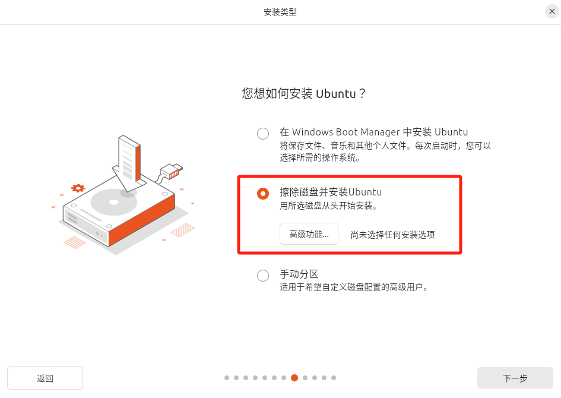
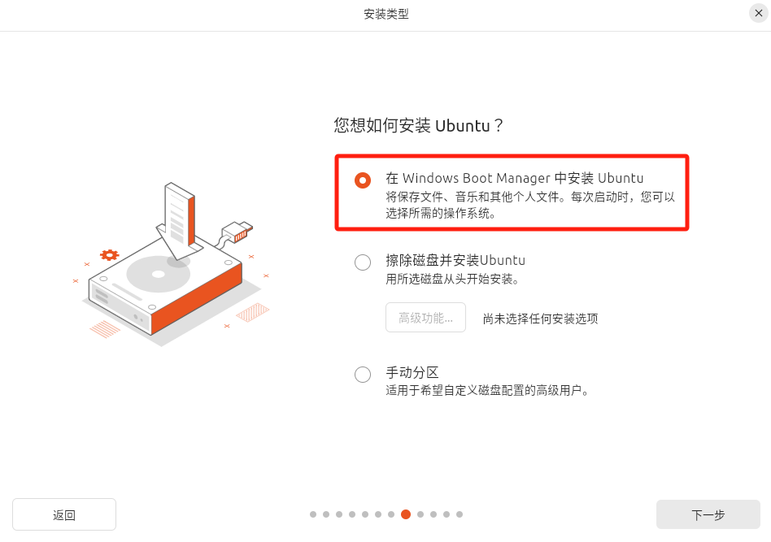
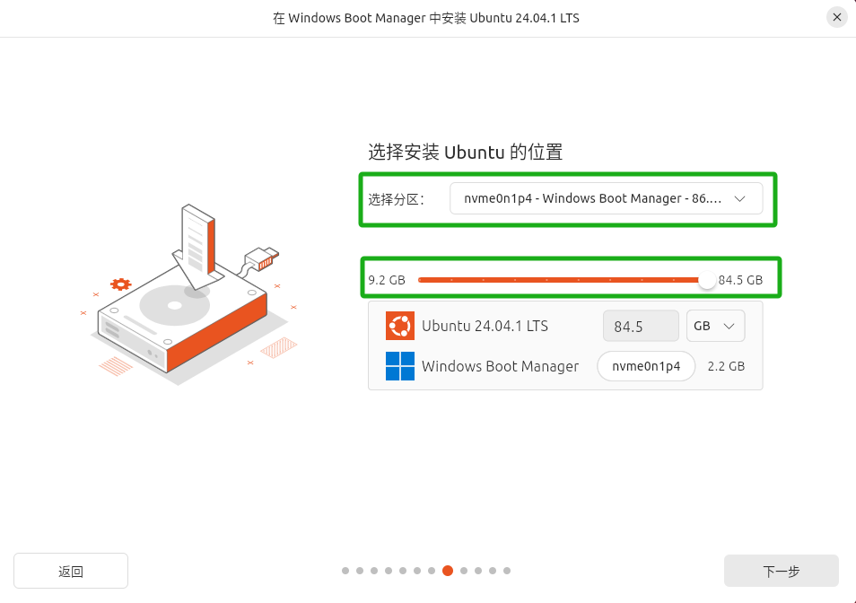
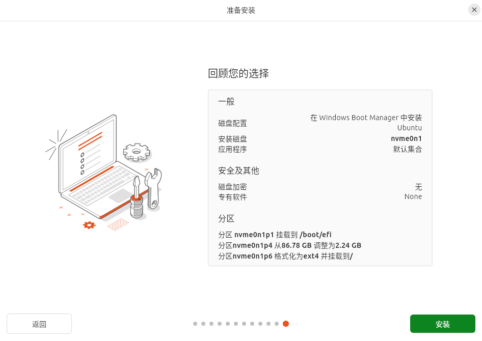
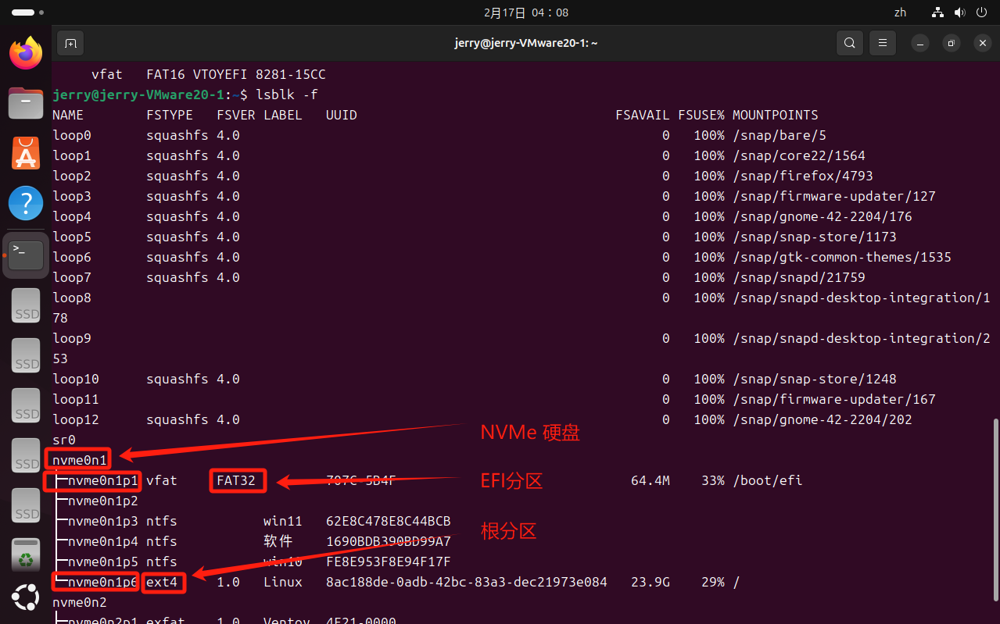
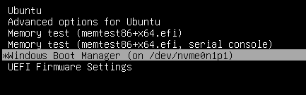

# Linux 基础

Linux 是一个开源的类 Unix 操作系统内核。它是一个多用户、多任务、支持多种处理器架构的操作系统。

## 环境搭建

### 在 Windows 中安装

- 在 Windows 中搭建 Linux 有以下方法：虚拟机、WSL、Live CD/USB、远程服务器。
- 接下来使用 WSL 方法。
- 确保 WSL 已安装，详见 [`Windows` > `WSL`](../windows/windows.md#WSL)。
- 在 Microsoft Store 中选择的 Linux 发行版，例如 "Ubuntu 20.04 LTS"。
- 安装完成后，点击启动，设置用户名和密码。
    - **注意**：即使你输入密码，也不会在屏幕上显示，就像没输入一样。

### 在物理机上安装

- [官网下载 Ubuntu Desktop 的 ISO 文件](https://ubuntu.com/download/desktop)，存入 Ventoy 启动 U 盘。
- 从 BIOS 进入 U 盘启动，选择 Ubuntu。
- 选择 `Try Or Install Ubuntu`，进入类似 PE 的 Ubuntu 系统。
- 右下角双击 `Install Ubuntu` 图标开始安装。
- 安装过程中会询问如何分区

    - 如果想把整个磁盘作为 Ubuntu 的运行磁盘，选择 `擦除磁盘并安装 Ubuntu` 即可，安装程序会自动修改分区类型和重新分区。

        

    - 如果是双系统

        - 提前使用 `磁盘管理工具` 或 `DiskGenius` 准备一个空分区供 Ubuntu 使用
        - 选择 `在 Windows Boot Manager 中安装 Ubuntu`

            

        - 根据磁盘容量选择分区，并将分区拉满

            

- 正常下一步设置其他项，直到安装

    

- 安装完成后，手动重启，根据提示，应先拔掉 U 盘，然后按 `Enter` 重启。
- 重启后即可进行初始设置。
- 如果是双系统，可以在 Ubuntu 安装完成后，进行引导设置，详见 `Linux > 系统引导`。

### 新系统配置

- VMware Tools
- 系统更新
- 系统设置

    - Dock 栏：图标，底部，最小化
    - 终端光标
    - 密码反馈

- VPN，Chrome，VSCode，Git，python，docker

## Zsh

- Zsh（Z Shell）是一种命令行解释器，也是一种交互式的 Unix shell，它是 Bash 的替代品。
- 安装 Zsh

    ```bash
    # 安装
    sudo apt install zsh
    # 设置 Zsh 为默认 shell
    chsh -s $(which zsh)
    ```

- 安装 Oh-My-Zsh 插件

    ```bash
    # 下载
    wget https://gitee.com/mirrors/oh-my-zsh/raw/master/tools/install.sh
    # 安装
    sh install.sh
    ```

- 安装 Zsh 主题和插件

    ```bash
    # PowerLevel10k主题
    git clone https://github.com/romkatv/powerlevel10k.git $ZSH_CUSTOM/themes/powerlevel10k
    # zsh-autosuggestions自动提示插件
    git clone https://github.com/zsh-users/zsh-autosuggestions ${ZSH_CUSTOM:-~/.oh-my-zsh/custom}/plugins/zsh-autosuggestions
    # zsh-syntax-highlighting语法高亮插件
    git clone https://github.com/zsh-users/zsh-syntax-highlighting.git ${ZSH_CUSTOM:-~/.oh-my-zsh/custom}/plugins/zsh-syntax-highlighting
    ```

- 编辑 `~/.zshrc` 文件启用插件和主题

    ```shell
    # 修改主题
    ZSH_THEME="powerlevel10k/powerlevel10k"

    # 启用插件
    plugins=(
      git
      zsh-autosuggestions
      zsh-syntax-highlighting
    )
    ```

- 重启终端，启动 PowerLevel10k 配置向导

    ```bash
    p10k configure
    ```

## 安装软件

- 优先使用 `apt` 或 `snap` 在线安装
- 其次官网下载 `.deb` 包至本地，使用 `apt` 安装
- 如果官网只有 `.tar.xz` 包

    - 解压安装包 `tar -xf <package_name>`
    - 根据 `README` 文件说明安装。

- 再次官网下载官方脚本至本地，使用 `sh` 运行安装脚本
- 再次，手动安装，以 Docke 为例

    - 更新软件包列表

        ```bash
        sudo apt update
        sudo apt upgrade -y
        ```

    - 安装依赖

        ```bash
        sudo apt install -y apt-transport-https ca-certificates curl software-properties-common
        ```

    - 添加 Docker 官方 GPG 密钥

        ```bash
        curl -fsSL https://download.docker.com/linux/ubuntu/gpg | sudo gpg --dearmor -o /usr/share/keyrings/docker-archive-keyring.gpg
        ```

    - 添加 Docker 软件源

        ```bash
        echo "deb [arch=$(dpkg --print-architecture) signed-by=/usr/share/keyrings/docker-archive-keyring.gpg] https://download.docker.com/linux/ubuntu $(lsb_release -cs) stable" | sudo tee /etc/apt/sources.list.d/docker.list > /dev/null
        ```

    - 再次更新软件包列表，以确保新添加的 Docker 软件源已经包含在软件包列表中

        ```bash
        sudo apt update
        ```

    - 安装 Docker Engine

        ```bash
        sudo apt install -y docker-ce docker-ce-cli containerd.io
        ```

- 最后，使用 `dpkg` 离线安装本地 `deb` 包，手动处理依赖，手动更新升级。

## 路径

### 常用路径

- **目录结构**：`/Home/USER_NAME/...`
- **路径分隔符**：正斜杠 `/`
- **Linux 特有路径（区别于 Windows）**

    - Home目录：`cd` 或 `/Home`
    - 上一次的工作目录：`cd -`

- 其它详见 [`web-basics` > `路径`](../../web-basics/web-basics.md#路径)

### 路径转义

- 在 Linux 中，空格是一个特殊字符，通常用来分隔不同的命令或参数。如果路径中包含空格，你需要使用转义字符 `\` 或者引号来避免错误。例如进入 `VMware Tools` 目录。
- 使用 `\` 转义

    ```bash
    cd /media/jerry/VMware\ Tools
    ```

- 使用 `'` 转义

    ```bash
    cd '/media/jerry/VMware Tools'
    ```

- 使用 `"` 转义

    ```bash
    cd "/media/jerry/VMware Tools"
    ```

- 关于 `'` 和 `"` 的区别

    - `'` 会**完全保留**其中的字符，不进行任何特殊的处理或扩展（例如，变量不会被展开）。
    - `"`  会允许其中的变量进行扩展和某些特殊字符的处理（例如 `$HOME` 会被展开为实际路径）。

## 快捷键

- `Win`：显示所有任务窗口
- `双击 Win`：显示所有程序
- `Ctrl + Alt + T`：打开终端
- `Win + Space`：切换输入法

# 发行版

# 包管理工具

Linux 包管理工具用于简化和管理软件包的安装、更新、卸载和依赖管理。不同的 Linux 发行版采用不同的包管理工具和格式，但它们的目标是相同的，即简化系统和应用软件的管理。

- 包管理工具

    - 分发行版默认包管理工具，如 Ubuntu 的 `apt`
    - 跨发行版包管理工具，如 `snap`

## apt

`apt` 是一个用于在 Debian 及其衍生发行版（如 Ubuntu）中用于管理软件包的上层工具，它是 `dpkg` 的前端工具，简化了软件包的安装、升级、删除等操作。

- **特点**：

    - **自动处理依赖**：安装本地 `.deb` 包时，`apt` 会从系统已配置的软件源（包括 `.deb` 包内自动添加的源）下载并安装缺失的依赖。
    - **触发软件源更新**：如果 `.deb` 包内嵌了软件源配置（如 Chrome 的包），`apt` 会识别并更新源信息。

- **命令**

    ```bash
    # 更新软件包列表
    sudo apt update
    
    # 升级所有软件包
    sudo apt upgrade
    # 升级所有软件包，并且允许安装新的依赖包，同时自动删除不再需要的包
    sudo apt full-upgrade
    
    # 安装新软件包
    sudo apt install <package_name>
    # 安装本地软件包
    sudo apt install path/to/package/<package_name>
    
    # 删除已安装的软件包（保留配置文件）
    sudo apt remove <package_name>
    # 删除已安装的软件包（包括配置文件）
    sudo apt purge <package_name>
    # 删除不再需要的依赖包
    sudo apt autoremove
    
    # 查看已安装的软件包
    apt list --installed
    
    # 搜索软件包
    apt search <package_name>
    
    # 查看软件包信息
    apt show <package_name>
    ```

## dpkg

`dpkg` 是 Debian 及其衍生发行版（如 Ubuntu）中用于管理软件包的底层工具。它用于安装、卸载、查询和管理 `.deb` 格式的包文件。`dpkg` 是一种更直接、低层次的工具，通常在没有网络连接的情况下使用，因为它不处理软件包的依赖关系（与 `apt` 不同，`apt` 会自动解决依赖问题）。

- **特点**

    - **不处理依赖**：仅安装当前 `.deb` 包，如果缺少依赖会报错，并提示需要运行 `sudo apt install -f` 修复依赖，但不会自动安装依赖。
    - **不修改软件源**：即使 `.deb` 包内嵌了软件源配置（如 Chrome 的 `.deb` 包），`dpkg` 不会主动触发 `apt` 更新。

- **适合场景**

    - 手动调试依赖或需要直接操作包文件时

- **命令**

    ```bash
    # 安装 .deb 包（不处理依赖和软件源）
    sudo dpkg -i <package_name.deb>
    ```

## apt-get


- `apt-get` 是 Debian 及其衍生发行版（如 Ubuntu）中用于管理软件包的命令行工具，是 `apt` 系列命令中的一个较为传统的工具。设计目标是**稳定性和脚本兼容性**，语法较为严格。它用于从软件源安装、升级、删除和管理 `.deb` 包，并且能够处理包的依赖关系，通常与 `dpkg` 配合使用。
- `apt-get` 的输出格式稳定，适合脚本解析（如 CI/CD 流水线）。
- `apt-get` vs `apt`

    - **`apt-get`** 提供更强的控制，适合脚本和系统管理员使用。
    - **`apt`** 是更现代化、更面向用户的工具，语法更简洁，通常在日常操作中推荐使用。

## snap

`Snap` 是由 Canonical（Ubuntu 的开发公司）开发的一种包管理系统，它使得软件可以以一种独立于发行版的格式进行分发和安装。`Snap` 包含所有运行该应用所需的依赖，因此它的优势之一是跨发行版的兼容性。无论你使用的是 Ubuntu、Debian、Fedora 还是其他 Linux 发行版，都可以使用 `snap` 安装同样的软件。

### `Snap` 的特点

- **跨平台兼容性**：`Snap` 包可以在多种 Linux 发行版上运行，避免了不同 Linux 系统之间依赖版本差异的兼容性问题。
- **封装依赖**：`Snap` 包包括了所有必需的依赖库，这意味着你不必担心缺少依赖库或版本冲突的问题。应用和它所需的所有资源被打包在一起，简化了安装过程。
- **自动更新**：Snap 包会自动更新，不需要用户干预。每次启动应用时，Snap 会检查是否有新版本，并自动安装更新。
- **沙箱隔离**：`Snap` 包在沙箱环境中运行，相较于传统的 `.deb` 包或 `.rpm` 包，它为应用提供了更多的安全性和隔离性。应用无法直接访问系统的其他部分，除非明确获得权限。

### Snap 的缺点

- **性能问题**：由于 Snap 包是封装了所有依赖的，这可能导致比传统包（如 `.deb` 或 `.rpm`）更大的磁盘占用，并且启动时间可能稍慢。
- **沙箱限制**：虽然沙箱环境提供了安全性，但它也可能对某些应用功能产生限制，例如无法与系统的其他部分完全交互。
- **自动更新**：虽然自动更新是方便的，但有些用户可能不喜欢不受控制的自动更新，尤其是在带宽有限的情况下。
- **支持度不如传统包**：尽管 Snap 得到了广泛的支持，但一些发行版的用户并不完全接受 Snap，尤其是那些有自定义软件包管理系统的发行版，如 Fedora 或 Arch Linux。

### Snap 与传统包管理工具的比较

- **APT / DPKG (Debian / Ubuntu)**：这些传统的包管理工具更依赖于操作系统的软件仓库和软件源，包通常不包含依赖，依赖库必须单独处理。
- **Snap**：相比之下，Snap 包包含所有必需的依赖，并且是跨发行版的兼容格式。Snap 的安装、更新和沙箱化提供了更高的便捷性和安全性，但可能在性能上有所牺牲。

# 系统管理

## 服务管理 systemctl

- 开机启动

    ```bash
    # 设置开机启动
    sudo systemctl enable $APP
    
    # 禁用开机启动
    sudo systemctl disable $APP
    
    # 查看开机启动
    sudo systemctl is-enabled $APP
    ```

- 运行和停止

    ```bash
    # 运行应用
    sudo systemctl start $APP
    
    # 停止应用
    sudo systemctl stop $APP
    
    # 查看应用状态
    sudo systemctl status $APP
    ```

- 其它服务管理

    ```bash
    # 以超级权限执行命令（让普通用户变成root用户）
    sudo $COMMAND
    ```

## 用户管理 usermod

- 修改用户组

    ```bash
    sudo usermod -aG docker jerry
    ```

    - 默认情况下，只有 `root` 用户或使用 `sudo` 前缀才能运行某些命令，如 `docker`。将当前用户加入 `docker` 组以后，可以不使用 `sudo` 来执行 Docker 命令。
    - 修改用户组以后，需退出当前终端并注销系统重新登录，使用户组生效。如果不想注销，可以直接在终端中使用 `newgrp docker` 命令，这个命令会让你切换到新的组，并使更改立即生效。但关闭当前终端再进入时，还是会失效，除非注销重新登录。

- 其它用户管理命令

    ```bash
    # 查看当前用户
    whoami
    
    # 创建用户
    sudo adduser $NEW_USER
    
    # 切换用户
    su - $USER
    ```

# GRUB 引导加载程序

## GRUB 基础

GRUB（GRand Unified Bootloader）是一个多重引导程序，通常用于 Linux 系统，它的主要功能是引导操作系统的启动。GRUB 支持多种操作系统的启动，因此它常常被用于在同一台计算机上安装多个操作系统的场景。它的工作方式是先加载引导程序到内存，然后让用户选择需要启动的操作系统或内核。

GRUB 的主要特点包括：

- **加载操作系统**：当计算机开机时，GRUB 会被加载，它会读取配置文件，显示操作系统的选择菜单，并将控制权转交给选择的操作系统。
- **多重引导支持**：GRUB 允许你安装并选择不同的操作系统，例如 Windows、各种 Linux 发行版、甚至是其他的类Unix系统。
- **内核加载**：GRUB 可以加载 Linux 内核，并将内核与根文件系统（root filesystem）一起加载到内存中。
- **灵活的配置**：GRUB 的配置文件通常是 `grub.cfg`，它包含了启动项和内核加载的配置。用户可以通过编辑这个配置文件来增加或修改启动选项。
- **支持多种文件系统**：GRUB 能够从多种文件系统中加载引导文件，包括 ext4、Btrfs、FAT、NTFS 等。
- **命令行界面**：GRUB 提供了一个命令行界面，用户可以在启动过程中输入命令进行故障排查或引导特定内核。
- **图形和文本模式**：GRUB 支持图形模式和文本模式，你可以选择不同的显示风格，增强用户体验。
- **支持内核参数**：GRUB 允许在启动时向内核传递参数，这对于调整内核的行为（例如调整内存、处理器参数等）非常有用。
- **链式引导**：GRUB 可以与其他引导程序配合使用，如 Windows 的引导程序，它会调用其他引导程序来启动相应的操作系统。

GRUB 的工作过程大致如下：

- BIOS 或 UEFI 启动时，GRUB 作为引导加载程序被加载到内存中。
- GRUB 读取配置文件（通常位于 `/boot/grub/grub.cfg`）并显示启动菜单。
- 用户从菜单中选择一个操作系统或内核进行启动。
- GRUB 将控制权交给选定的操作系统或内核，完成引导过程。

## GRUB 修复

- U 盘启动，进入 Live USB 环境。
- 查询每个分区的文件系统类型，进而确认 `根分区` 和 `EFI 分区` 路径

    ```bash
    lsblk -f
    ```

    

- **挂载分区并修复 GRUB**

    ```bash
    # 挂载 Linux 根分区（文件类型为 EXT4）
    sudo mount /dev/nvme0n1p6 /mnt
    
    # 挂载 EFI 分区（文件类型为 FAT32）
    sudo mount /dev/nvme0n1p1 /mnt/boot/efi
    
    # 挂载虚拟文件系统
    sudo mount --bind /dev /mnt/dev
    sudo mount --bind /proc /mnt/proc
    sudo mount --bind /sys /mnt/sys
    
    # 使用 chroot 进入已经挂载的 Linux 系统
    sudo chroot /mnt
    
    # 手动挂载 EFI 变量文件系统
    mount -t efivarfs efivarfs /sys/firmware/efi/efivars
    
    # 重新安装 GRUB 并更新（nvme0n1 为 NVMe 硬盘，就是系统所在的硬盘）
    grub-install /dev/nvme0n1
    update-grub
    
    # 退出 chroot 并重启
    exit
    sudo reboot
    
    # 重启后即可进入 Ubuntu 系统，但没有 Windows Boot Manager
    ```

- 修复 GRUB 后，Windows 的引导程序 `Windows Boot Manager` 会消失
- Ubuntu 默认禁用 `os-prober`（用于探测其他操作系统），需手动启用

    ```bash
    # 编辑 GRUB 配置文件
    sudo nano /etc/default/grub
    
    # 添加如下，取消禁用
    GRUB_DISABLE_OS_PROBER=false
    
    # 修改如下，显示启动菜单
    GRUB_TIMEOUT_STYLE=menu
    
    # 更新并重启
    sudo update-grub
    sudo reboot
    ```

- 重启后可在启动菜单里看见 `Windows Boot Manager`
- 从 `Windows Boot Manager` 进入 Windows 以后，Windows 会自动修复。

## GRUB 菜单

### GRUB 默认菜单

- GRUB 默认说明

    ```
    # 启动 Ubuntu
    Ubuntu
    
    # 选择 Ubuntu 其它内核
    Advanced options for Ubuntu
    
    # 启动内存检测
    Memory test (memtest86+x64.efi)
    Memory test (memtest86+x64.efi, serial console)
    
    # 启动 Windows 引导加载程序
    Windows Boot Manager (ondev/nvme0n1p1) # 启动 Windows
    
    # 进入固件
    UEFI Firmware Settings
    ```

### GRUB 设置

- 打开 GRUB 配置文件

    ```bash
    sudo nano /etc/defualt/grub
    ```

- 修改

    

    ```bash
    # 默认启动项为 Windows（第一项为0）
    GRUB_DEFAULT=4
    
    # GRUB 菜单倒计时
    GRUB_TIMEOUT=3
    ```

- 更新 GRUB 配置并重启

    ```bash
    sudo update-grub
    sudo reboot
    ```

- 系统倒计时3秒后自动进入 Windows 系统。

# Curl

`curl` 是一个用于与网络服务器进行数据交换的命令行工具。

## 下载文件

- 下载并显示文件内容

    ```bash
    curl http://example.com/file.txt
    ```

- 下载的文件，并按原文件名保存

    ```bash
    curl -O http://example.com/file.txt
    ```

- 下载的文件，并按指定路径和文件名保存

    ```bash
    curl -o myfile.txt http://example.com/file.txt
    ```

## 上传文件

- 上传文件

    ```bash
    curl -X POST -F "file=@myfile.txt" http://example.com/upload
    ```

# 文件

## 文件基础

- **基础命令**

    ```bash
    # 查看文件
    cat $FILE
    # 创建文件
    touch $FILE
    # 编辑文件
    nano $FILE
    vim $FILE
    # 删除文件
    rm $FILE
    # 复制文件
    cp $FILE $DES_PATH
    ```

- **文本搜索**

    ```bash
    grep CONTENT
    ```

- 替换

    `sed`：流编辑器，用于对文本进行流式处理；`-i`：在原文件修改；`s`：替换；`g` ：全局替换

    ```bash
    sed -i 's/SOURCE_CONTENT/NEW_CONTENT/g' 'PATH/FILE'
    # e.g.
    sed -i 's/aaa/bbb/g' './html.py' # 将当前文件夹下的html.py文件中的aaa替换成bbb
    ```

- `echo`：快速向文件添加内容

    ```bash
    echo "[CONTENT]" > [FILE]
    # e.g.
    echo "Hello World!" > demo.txt
    ```

- 查找文件

    ```bash
    find PATH OPTION COMMAND
    # e.g.
    find . -name jquery* -print # 查找当前目录下所有文件名以jquery开头的文件，并打印路径
    ```

## Vim

**Vi**（Vi IMproved）是 Unix 系统上最早的文本编辑器之一，**Vim**（Vi IMproved）是 Vi 的增强版。

### Basics

- Basics

    ```bash
    # show version
    vi / vim
    # open / create file
    vim $FILE
    # into insert mode
    i
    # back to command mode
    `Esc`
    # exit
    :q
    # save and exit
    :wq
    ```

### Command mode

- Default enter into command mode.

    

- `Esc`: Back to command mode
- `dd`: Cut cursor line. `2dd`: Cut cursor and next line
- `yy`: Copy cursor line. `2yy`: Copy cursor and next line
- `p`: Paste at next line of cursor. `2p`: Paste at next line of cursor 2 times
- `Ctrl + F`: Page Up. `Ctrl + U`: Page Up Half.
- `Ctrl + B`: Page Down. `Ctrl + D`: Page Down Half.

### Insert mode

- Into insert mode

  - `i`: before cursor
  - `I`: line beginning
  - `a`: after cursor
  - `A`: line end
  - `o`: next new line
  - `O`: previous new line

- Edit

  - `^`: jump to line beginning
  - `$`: jump to line end

### Last line mode

- `:`: Into last line mode
- `:q`: exit
- `:wq`: save and exit
- `:set nu`: show line number
- `:set nonu`: close line number

# 文件夹

## 文件夹基础

- **基础命令**

    ```bash
    # 创建文件夹
    mkdir [PATH] FOLDER_NAME
    # 删除空文件夹
    rmdir [PATH] FOLDER_NAME
    # 删除非空文件夹
    rm -r [PATH] FOLDER_NAME
    # 列出文件夹内容
    ls [-al] # -al列出隐藏内容
    ```

# 命令选项

- `-rf` 选项是 `-r` 和 `-f` 的组合

    - `-r` 选项，以确保递归删除子目录和文件。
    - `-f` 选项，强制删除。

- `-y`：默认同意

# 其它

- **`|`**：管道符，命令输出传递；eg：打开 `tmp` 文件夹中的 `html.py` 文件，然后找出字符串 `jquery-1.11.3.min.js`

    ```bash
    cat /tmp/html.py | grep jquery-1.11.3.min.js
    ```

## tldr

`tldr` 是一个简化的命令行工具，名字来源于 "Too Long; Didn't Read"，旨在提供比传统 `man` 页面更简洁、更实用的命令帮助信息。

- 安装

    ```bash
    sudo apt update && sudo apt full-upgrade
    sudo apt install tldr
    ```

- 升级

    ```bash
    tldr --update
    ```

- 使用（以 `apt` 为例）

    ```bash
    tldr apt
    ```

# 解决方法

## 密码反馈

在 Linux 终端中，默认情况下，输入密码时是不可见的，这是出于安全性考虑。然而，如果你想让密码在输入时可见，有一些方法可以实现。

- 打开 sudoers 文件：`sudo visudo`
- 找到 `Defaults   env_reset` 行，添加 `pwfeedback`，如下

    ```bash
    Defaults env_reset,pwfeedback
    ```

- 这将启用密码反馈功能，使得在输入密码时可以看到 * 星号，但仍然不是明文显示。

## 更新下载源

- 当执行 `sudo apt update` 时，提示以下信息

    ```bash
    E: 仓库 “file:/cdrom noble Release” 不再含有 Release 文件。
    N: 无法安全地用该源进行更新，所以默认禁用该源。
    N: 参见 apt-secure(8) 手册以了解仓库创建和用户配置方面的细节。
    ```

- 错误信息表明，系统无法从指定的仓库（`file:/cdrom noble Release`）获取 `Release` 文件，因此该源被禁用。这通常发生在你尝试从一个无效或不可用的源更新软件包时。

- 右键打开 `/etc/apt/sources.list` 文件，检查是否有指向 `file:/cdrom` 的源。
- 如果发现 `file:/cdrom` 相关的行，可以将其注释掉（在行首添加 `#`）或删除，然后保存。
- 重新更新。

## Ubuntu Dock 栏最小化

- 使用 Ubuntu LTS 时，点击 Dock 栏上已打开的应用图标时，无法最小化
- 终端运行如下代码

    ```bash
    gsettings set org.gnome.shell.extensions.dash-to-dock click-action 'minimize'
    ```

    
