# Windows 基础

## 路径

- **目录结构**：`cd C:/Users/USER_NAME`
- **路径分隔符**：默认`\`，绝大多数时候都支持正斜杠 `/`
- 其它详见 [`web-basics` > `路径`](../../web-basics/web-basics.md#路径)

## Chocolatey

Chocolatey 是一个功能强大的 Windows 包管理工具。

- **安装**：应该在 PowerShell 中安装，但可以在 Bash 中使用。

    ```shell
    Set-ExecutionPolicy Bypass -Scope Process -Force; [System.Net.ServicePointManager]::SecurityProtocol = [System.Net.SecurityProtocolType]::Tls12; iex ((New-Object System.Net.WebClient).DownloadString('https://community.chocolatey.org/install.ps1'))
    ```

- **验证安装**

    ```bash
    choco --version
    ```

- **使用**

    ```bash
    choco install APPLICATION
    ```

## 快捷键

### Win 快捷键

- `Win`：打开或关闭 **开始菜单**
- `Win + E `：打开 **快速访问**
- `Win + I `：打开 **系统设置**
- `Win + V `：剪贴板历史记录
- **窗口**

    - `Win + D `：最小化所有窗口 / 恢复所有窗口
    - `Win + ↑/↓ `：最大化 / 缩小窗口 
    - `Win + ←/→` ：最大化到窗口左 / 右侧的屏幕上 
    - `Alt + Tap`：显示当前桌面所有运行程序

- **桌面**

    - `Win + Tab`：显示所有任务窗口
    - `Win + Ctrl + D`：创建新桌面
    - `Win + Ctrl + ←/→`：向左/右切换桌面

- `Win + 加号或减号`：放大镜

### Ctrl 快捷键

- **鼠标**

    - `Ctrl + 鼠标滚轮` 改变文件和文件夹图标的大小和外观 
    - `Ctrl + 单击` 点击超链接

- `Ctrl + N` 新建一个文档
- `Ctrl + C` 复制
- `Ctrl + X` 剪切
- `Ctrl + V` 粘贴
- `Ctrl + Z` 撤消
- `Ctrl + Y` 恢复撤消
- `Ctrl + F` 查找
- `Ctrl + H` 替换
- `Ctrl + A` 全选
- `Ctrl + HOME` 返回至文档首页
- `Ctrl + Fn + ←` 返回至文档首页（华为笔记本）
- `Ctrl + B` 将所选文本改为粗体
- `Ctrl + I` 将所选文本改为斜体
- `Ctrl + U` 为所选文本添加下划线
- `Ctrl + Shift + Esc` 打开任务管理器

### 其它快捷键 

- `Delete` 右删除 / 删除文件
- `Back Space` 左删除
- `Shift + Delete` 直接删除文件，而不是送入回收站
- `Insert` 插入 / 取消插入

    - 输入文本会逐渐覆盖光标右边文本

# 环境搭建

## BIOS 设置

- Windows 8 以前选原始类型，Windows 10 以后选 UEFI。

## 硬盘分区

- 删除原来与系统相关的分区

    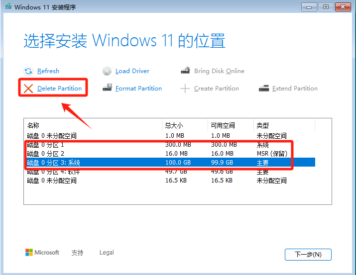

- 选择合并后的 `未分配空间`，然后点 `下一步`，安装程序会自动进行分区：系统分区、ESP 分区、MSR 分区。

    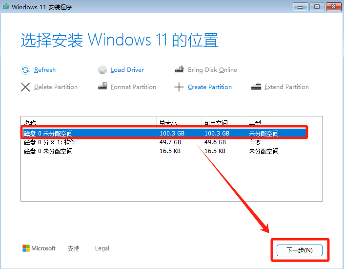

## 启动 U 盘安装系统

## 自定义系统

- [零度解说可以高度定制自定义系统。](https://www.youtube.com/watch?v=tcVVSUu-wnQ&list=PLPpU3NyRmFI5I3t6JeIE8HV2AsCv3YzQx&index=28)

## Win 10 系统

### Win 10新系统

1. 此方法是在原系统为**已激活**的 “Win7专业版” 或 “Win10专业版” 基础上重新做全新系统

2. 准备

   1. 网盘下载 “Windows10多版本官方” ISO 文件
   2. Typora 取消激活

3. 双击进入 ISO 文件，进入 sources 文件夹，双击 setup.exe 运行安装程序

   1. 注意不要运行根目录的 setup.exe

4. 这里选择第二项“不，谢谢”，本地安装

   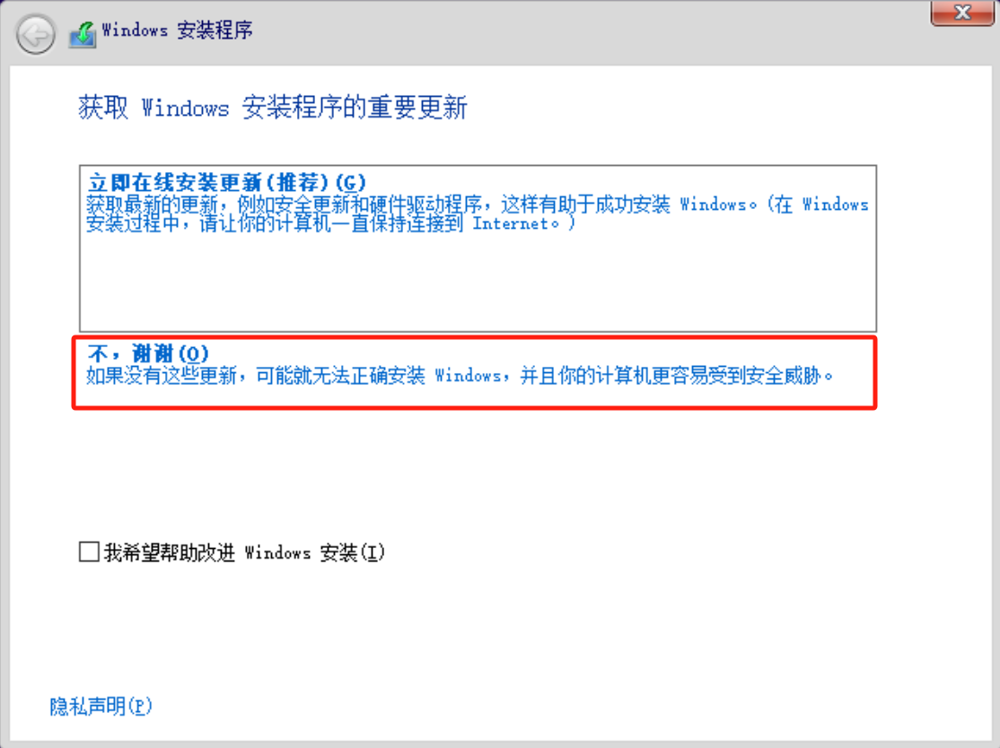

5. 选择“我没有产品密钥”

   

6. 选“Windows 10 专业版”

   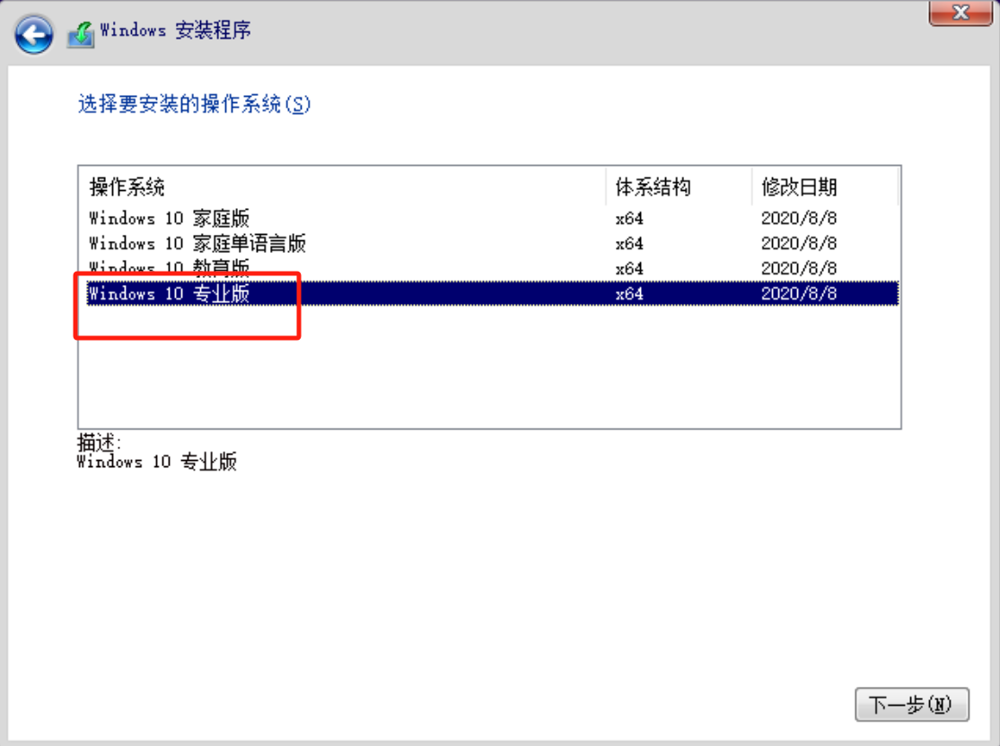

7. 安装选择

   1. 如果想保留原来系统的个人文件和程序，就选第一个

   2. 一般情况想要一个全新的系统，选第二个

      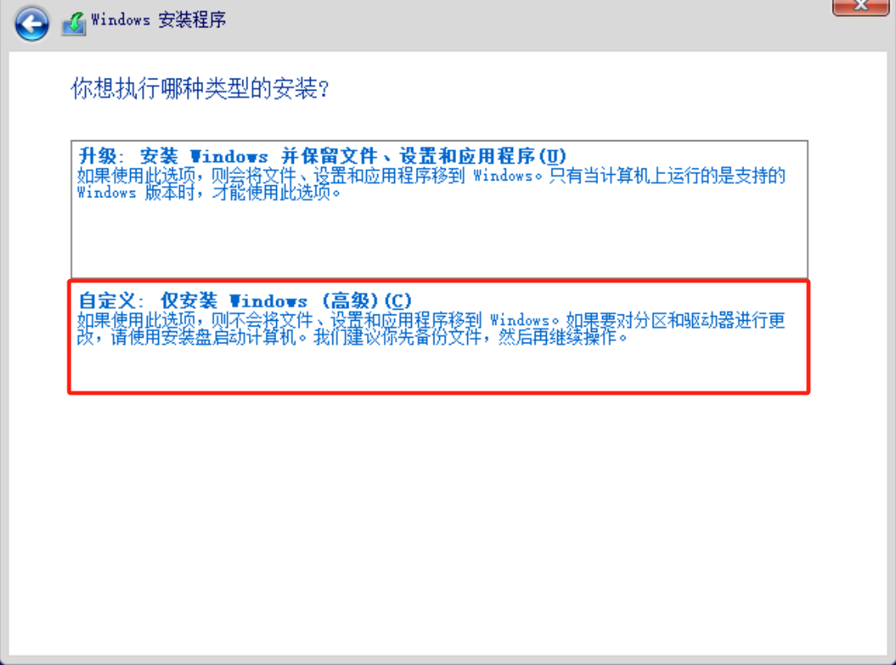

8. 这里一定要注意选择分区，不要看类型，要看盘符和磁盘大小

   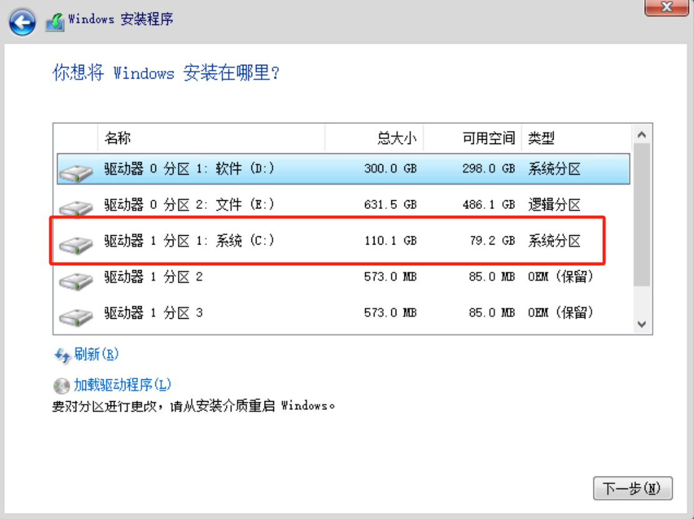

9. 安装过程简单选择

10. 此方法激活状态为：

    1. 版本：Winsows 10 专业版
    2. 激活：Winsows 已使用与 Microsoft 账户关联的数字许可证激活

11. 做完系统记得弹出 DVD 光驱

12. 接下来进入 Win10 配置

### 家庭升专业

- Windows10家庭版升级到Windows10专业版

  - 开始开始—设置—更新和安全—激活—更改产品秘钥—输入：
  - TPYNC-4J6KF-4B4GP-2HD89-7XMP6
  - W269N-WFGWX-YVC9B-4J6C9-T83GX
  - 更新至专业版
  - 然后使用激活工具激活

- Windows7升级到Windows10

  此种方法为官方升级方案，新Windows10系统为正版Windows10系统。

  新系统想用什么版本（比如旗舰版），原Windows7系统就必须为哪个版本，并且激活期限与原系统相同。

  微软官网下载“Windows10更新助手”，按照引导更新系统即可。

### win 10 激活

- 详见 Windows 激活

### Win 10 配置

#### 初期配置

1. 检查系统版本和激活状态
2. 系统更新，简单调整固定任务栏
3. 升级和配置 Edge
4. 格式化 D 盘
5. 安装 Office
6. 安装输入法、Typora
7. 配置鼠标
8. 以上所有工作都完成，重启一次电脑
9. 最后通过“磁盘管理”清除旧系统（windows.old）以及一切待选项
10. 重启电脑，创建第一个还原点

#### 系统设置

1. 系统
   1. 屏幕：设置多显示器
   3. 存储：
      1. 开启并配置存储感知，频率为一周
      2. 更改新内容的保存位置
      3. 优化驱动器

2. 个性化

   1. 开始

      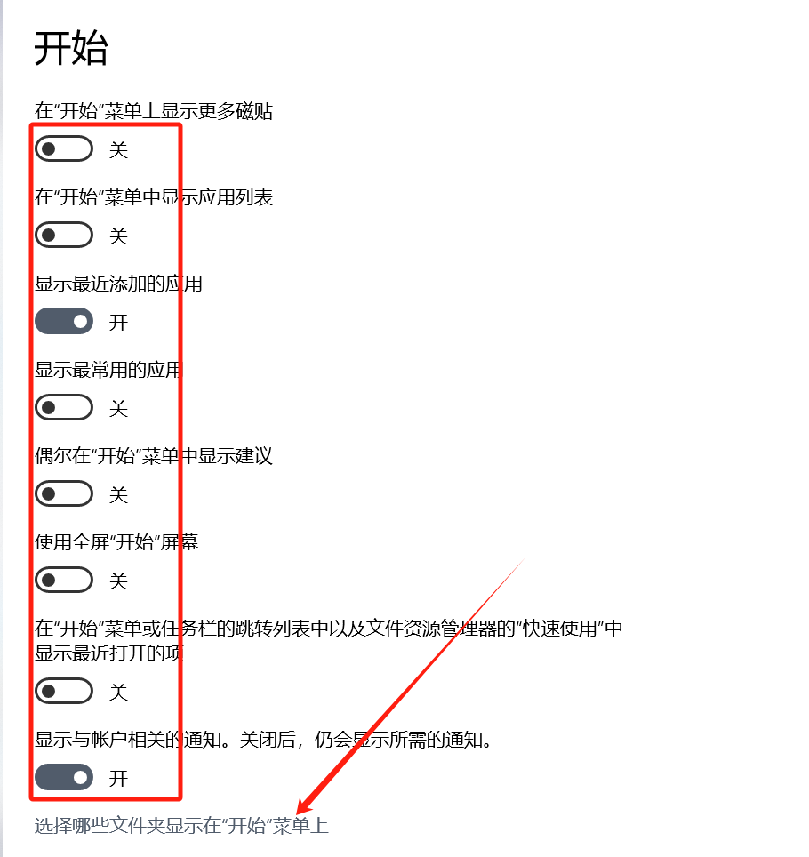

      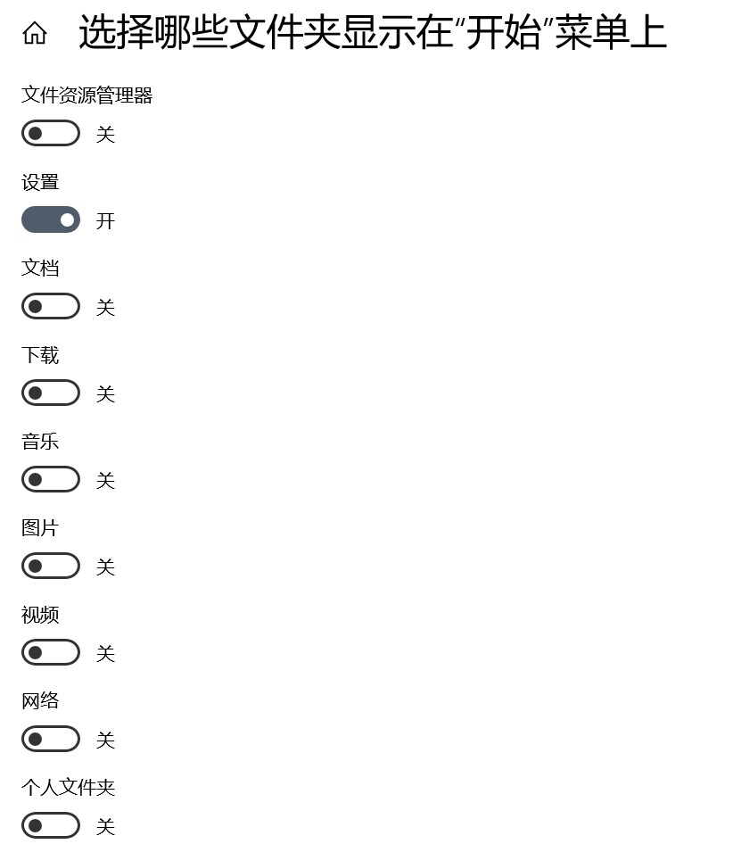

   2. 任务栏

      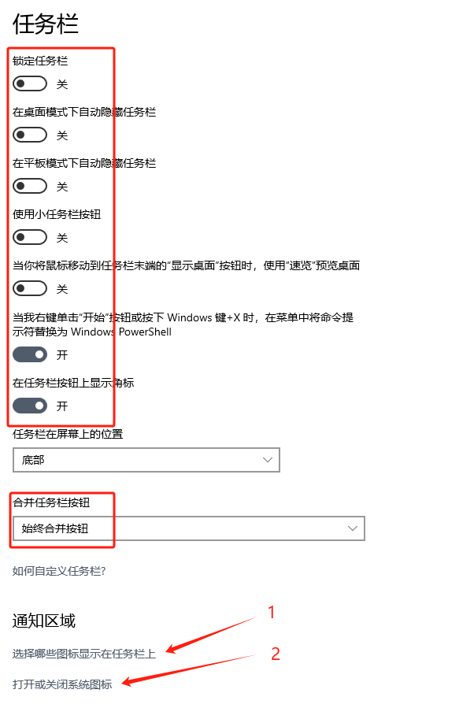

      

      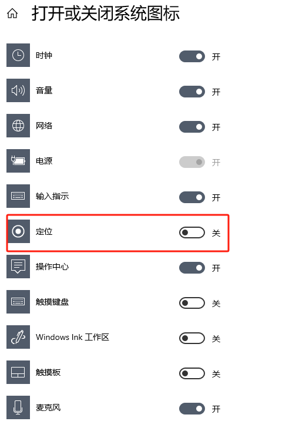

      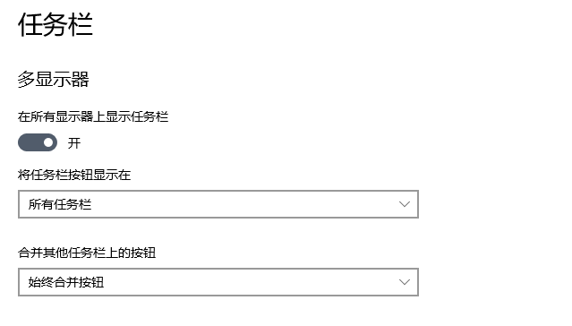

3. 应用

   1. 应用和功能：删除自带应用
   2. 启动：关闭启动应用

4. 账户

   1. 验证密码，开启账户同步

      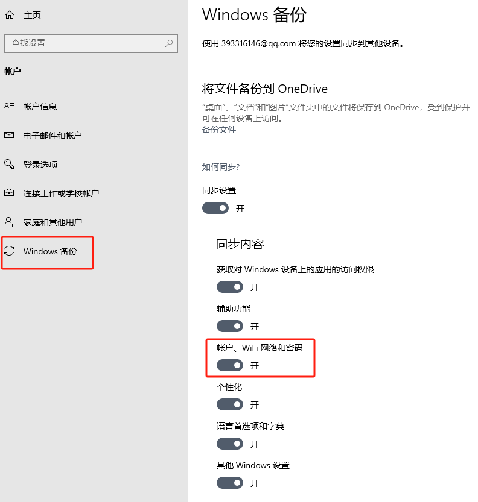

5. 更新和安全

   1. Windows 更新

      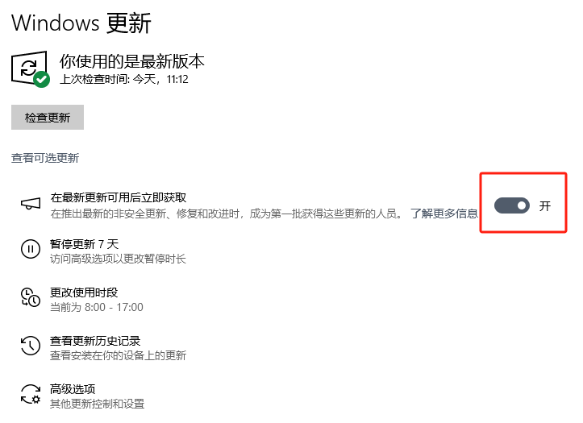

6. 开启“卓越性能”

7. 资源管理器，文件扩展名，隐藏项目

8. 配置 NVIDIA

   1. 打开 NVIDIA > 桌面
   2. 取消“添加桌面上下文菜单”，这能能取消鼠标右键中的 NVIDIA
   3. 取消“显示通知托盘中的图标”

9. 局域网共享

10. 规划开始菜单

11. 重启电脑，创建第二个还原点

#### 安装软件

1. 4.QQ，Q-汽水-网易-酷狗-酷我音乐，微信，网盘，抖音，Slack，迅雷和影音，MusicBee，Bandzip
2. 设置默认软件
3. 重启电脑，创建第三个还原点
4. 搭梯子，Chrome
5. Python、Pycharm、VS code、CAD
6. 重启电脑，创建第四个还原点
7. 本次创建还原前安装的软件
   1. picasa，MusicBee（配置），vmware，vs code（配置）

## Win 11 系统

### 不满足系统要求

当主板不支持 TPM 2.0时，不符合安装 win 11 最低要求，有两种方法解决。

#### 命令法

- 当 Win 10 想升级 Win 11 时，使用此种方法。
- 进入[下载 Windows 11](https://www.microsoft.com/zh-cn/software-download/windows11?774b232c-a48d-452a-a8fb-3906dc168d5c=True&4cd9df4f-deef-4431-9497-a04303f34986=True&9d47a9e1-e53b-49a1-92ca-a647d62dc410=True)。
- 下载 Windows 11 安装媒体

    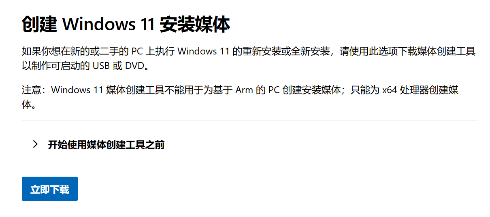

- 运行文件

    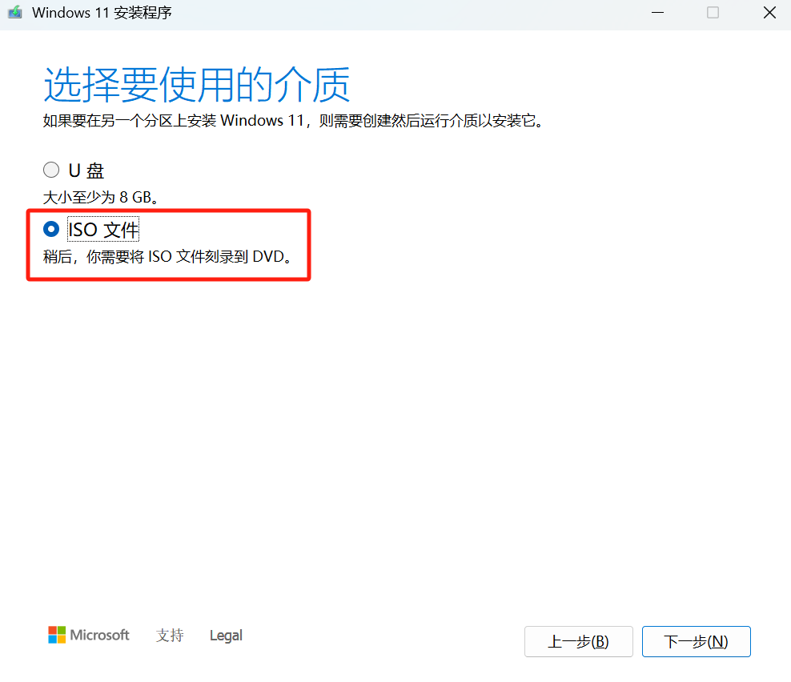

- 将 ISO 文件保存至 E 盘
- 双击下载好的 ISO 文件
- 在文件目录里打开 CMD 或 PowerShell，执行以下命令

    ```shell
    setup /product server
    ```

- 执行命令以后会打开安装向导
- 正常安装 win11

#### Rufus 法

- 当想全新安装 Win 11 时，使用此种方法。

- 使用 Rufus 工具制作启动 U 盘时，绕过 TPM 2.0 检查，详见 Rufus。

    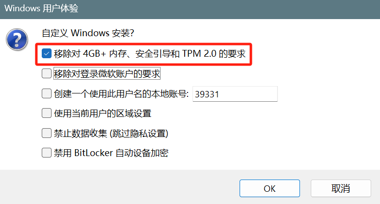

- 使用启动 U 盘安装全新 Win 11。

#### 安装时无法联网

- 提前将主板网卡驱动在 U 盘中解压
- 提示无法联网时，选择驱动程序文件夹，让系统自己安装。

# Windows 激活

## 激活方式

Windows 激活通常是通过将你的设备与微软的激活服务器进行通信来实现的，这一过程可以通过不同方式完成。

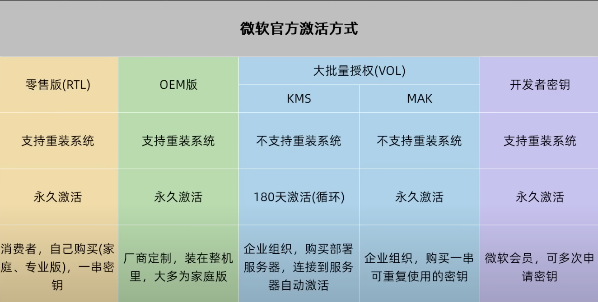

### KMS 激活

KMS 是一种通过本地服务器管理激活的方式，通常用于企业环境。KMS 通过一个中央服务器对设备进行激活，每台机器在安装 Windows 后需要连接到该 KMS 服务器进行激活。

- **激活方法**：以管理员身份运行 PowerShell

    ```shell
    slmgr /ipk W269N-WFGWX-YVC9B-4J6C9-T83GX
    slmgr /skms kms.0t.net.cn
    slmgr /ato
    ```

    **在以上代码中**：

    - 密钥为：[微软官方产品密钥（半年）专业版](https://learn.microsoft.com/zh-cn/windows-server/get-started/kms-client-activation-keys?tabs=server2025%2Cwindows1110ltsc%2Cversion1803%2Cwindows81)
    - KMS 服务器为非官方

- **时效**：每台计算机在初次安装Windows后，会尝试联系公司内部的KMS服务器进行激活。激活成功后，计算机会获得一个激活授权，通常有效期为180天。为了继续保持激活状态，设备需要每180天重新向KMS服务器进行“续期”。

- **重装系统**：KMS 支持重装系统后继续激活。只要重装后的系统能够重新连接到KMS服务器，它就会重新激活。如果KMS服务器能够识别该设备的许可信息并成功进行验证，那么系统会重新激活。

- **说明**：KMS 激活属于大批量授权，如果对激活服务器不了解，可能带来不安全。

### MAK 激活

MAK 是一种通过一个单独的密钥进行激活的方式，通常用于企业购买的批量许可。每个MAK密钥可以激活一定数量的设备。MAK 激活是一次性的，即每次激活后，密钥会消耗掉一个授权名额。

- **激活方法**：通过输入密钥完成激活
- **时效**：永不过期
- **重装系统**：支持

### OEM 激活

## 验证激活

- 以管理员身份运行 PowerShell

    ```shell
    slmgr /dli
    slmgr /dlv
    ```

## 注册表密钥

- **注意**：这并不是当前系统的激活密钥，而是安装时的密钥，不能用于激活。

- 注册表查看以下目录

    ```
    计算机\HKEY_LOCAL_MACHINE\SOFTWARE\Microsoft\Windows NT\CurrentVersion\SoftwareProtectionPlatform
    ```

- 右侧找到 `BackupProductKeyDefault`，在其后面的值就是安装时的密钥。

## 设备密钥

### 旧台式机

- **注册表密钥**：Win 11 专业版，RETAIL

    ```
    VK7JG-NPHTM-C97JM-9MPGT-3V66T
    ```

### 新台式机

- **激活密钥**：Win 11 专业版，MAK

    ```
    RR6X3-7QNJB-D9RKH-6RG33-H22KM
    ```

- **注册表密钥**：Win 11 专业版，RETAIL

    ```
    VK7JG-NPHTM-C97JM-9MPGT-3V66T
    ```

### MateBook 14

- **激活密钥**：，Win 11 专业版，OEM_DM

    ```
    WF7M7-NPQ2K-9PQXW-3J67C-YKMP2
    
    # 电话验证确认 ID
    313311-333250-599132-030502-995635-465642-833886-646123
    ```

- **注册表密钥**：Win 11 家庭版，OEM_DM

    ```
    YNDMB-2QCFC-HTFBP-JF9HC-FX849
    ```

## 家庭版升级专业版

家庭版升级专业版，应先升级到教育版，再升级到专业版。

- 输入密钥升级到教育版，系统会升级到教育版，但显示未激活

    ```
    XJW7N-9W68G-RKGKJ-7FRCG-V6DFQ
    ```

- 输入密钥升级到专业版，显示激活失败，再通过电话激活

    ```
    # 此处替换成购买的激活密钥
    WF7M7-NPQ2K-9PQXW-3J67C-YKMP2
    ```

- 电话激活获取 `激活 ID`，然后输入即可激活。

# 还原点

- **注意**
    - 还原点只是对系统配置的保存，并不是对 C 盘文件的保存
    - 系统会定期覆盖最前面的还原点


## 创建还原点

1. 创建还原点准备

   1. 在敏感操作之前最好创建还原点
   2. 在磁盘管理中清除系统垃圾
   3. 重启电脑

2. 开始图标 > 右键 > 系统 > 系统保护 > 选择 C 盘 > 配置

   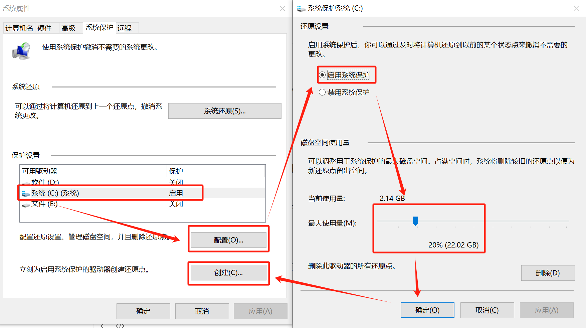

3. 创建

   1. 创建还原点之前，应该在系统还原中扫描一下受影响的程序，并将它们和 C 盘可用空间标记在新还原点的描述中

      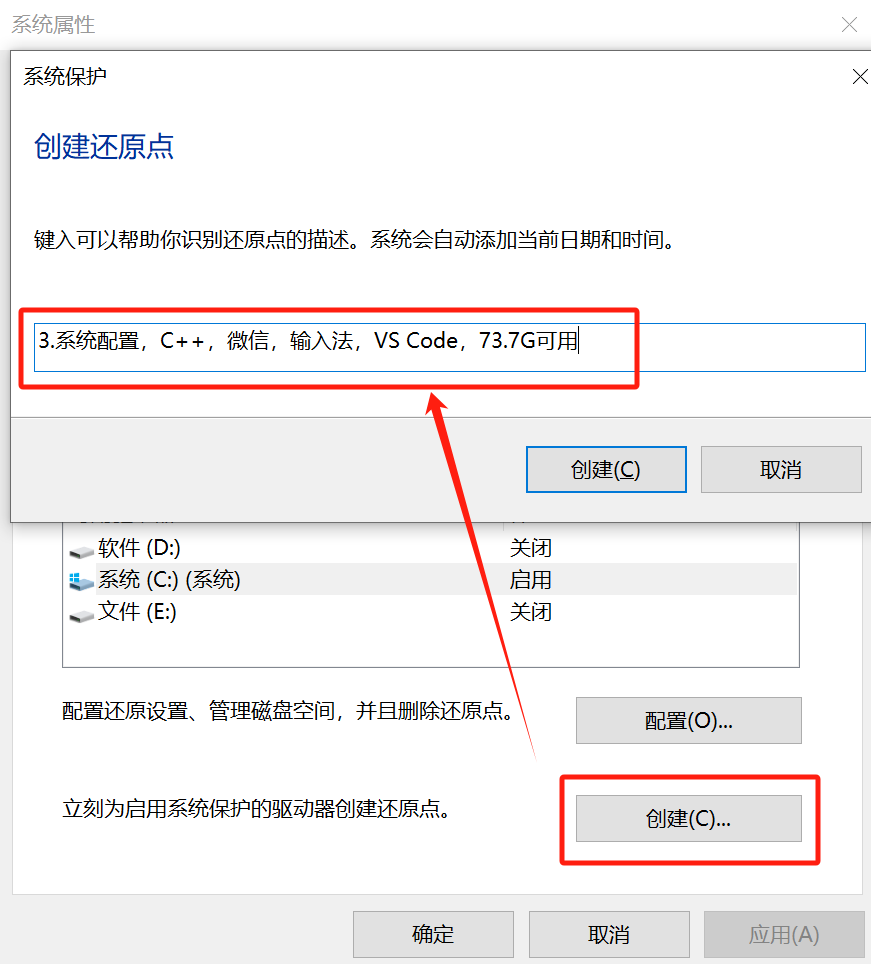


## 恢复还原点

1. 开始图标 > 右键 > 系统 > 系统保护 > 选择 C 盘 > 系统还原

2. 如果还原至 Typora 授权以前，应取消 Typora 授权

3. 扫描可能因为还原受影响的软件，以便还原以后再次安装（仅供参考，以还原点描述为准）

   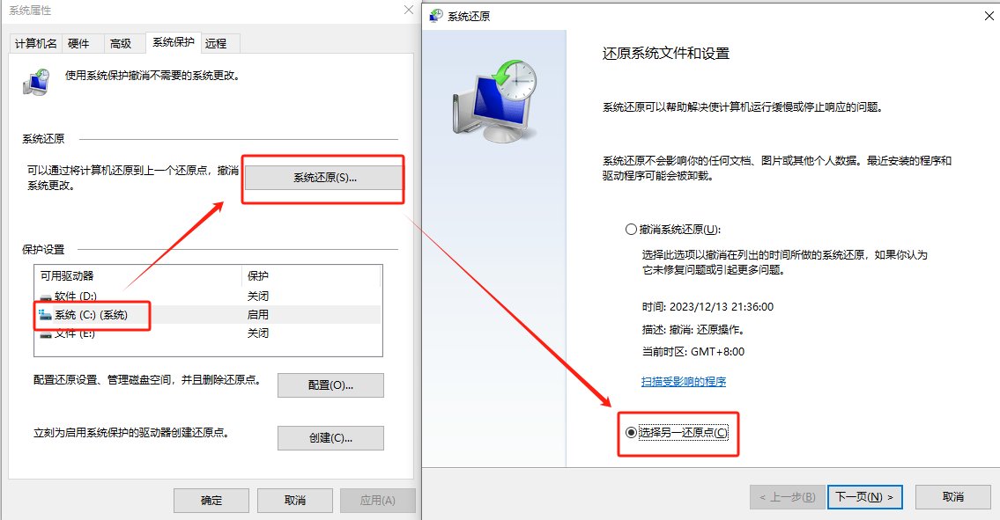

   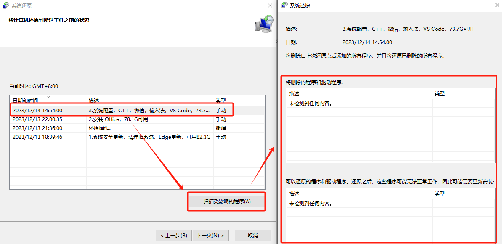

4. 恢复系统至还原点

5. 还原后的操作

   1. 如果对还原以后的效果不满意，可撤销还原
   2. 如果满意，可再次安装受影响的软件，重新安装软件需要重新登录，但不需要重新配置

# 安装Office

## 正常安装

- `设置` > `账户` > `查看产品详细信息` > 跳转到网页 `Windows 账户` > `订阅`

    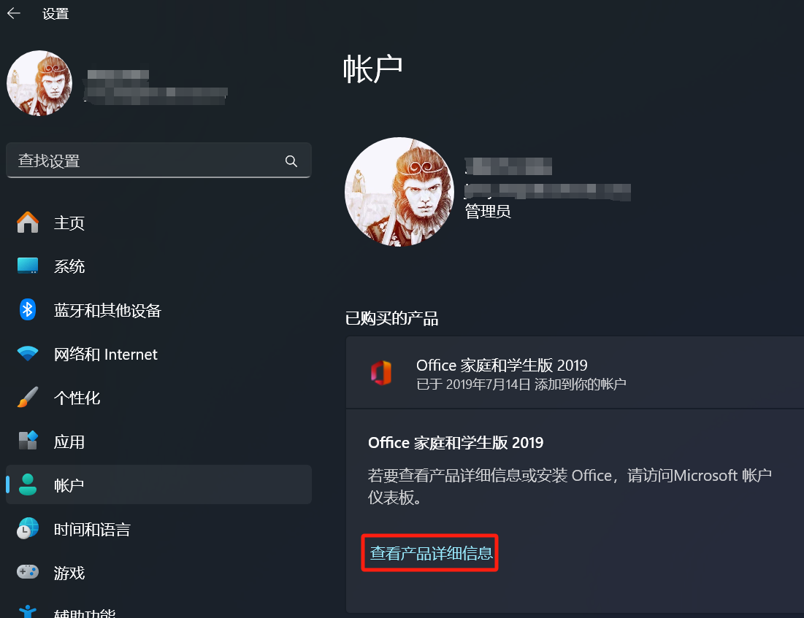

- 下载 `Office 安装器` 并运行，系统会自动安装。

- 安装成功后登录 `Windows 账户` 可自动激活。

- 验证激活：`任一 Office 软件` > `文件` > `更多` > `账户`。

## 激活码激活

- [网上下载](https://www.123pan.com/s/XYTUVv-4ejLH.html) Office的 ISO 文件，或者网盘下载
  - cn_office_professional_plus_2019_x86_x64_dvd_5e5be643.iso（Office 专业增强版2019）
- 直接双击安装 Office
- 安装完成以后，在开始菜单里打开一个word，输入激活码即可激活。
  - Office 专业增强版2019 秘钥：XT9KH-CNYTP-MGJXH-3B7GW-RYBCT，拼多多12元购买，本台式机无限重装
- 如果激活没成功，出现以前激活的版本，比如2016，应 Office Tool Plus 工具卸载清理，然后电话激活

##  [Office Tool Plus](https://otp.landian.vip/zh-cn/) 工具

1. 如果多次安装导致混乱 ，应使用 Office Tool Plus 安装

2. [`官网`](https://otp.landian.vip/zh-cn/) 或者网盘下载 Office Tool Plus，解压放入 D 盘正常软件文件夹

3. 运行 Office Tool Plus.exe

4. 需要先将之前的 Office 卸载干净

   1. 优先使用控制面板卸载
   2. 如果还是不行，用 Office Tool Plus 里工具箱卸载

5. 配置安装程序

   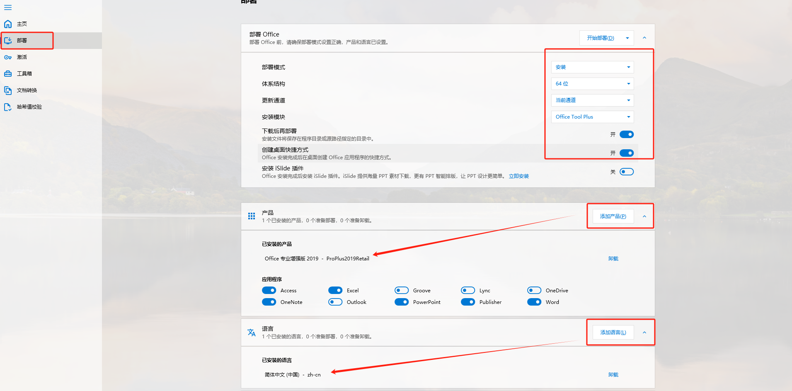

6. 点击“开始部署”，下载及安装 Office，全自动安装，2MB/S网速下耗时大概2小时

## 电话激活

1. 地区选“中国”，拨打电话 400-820-3800激活

2. 下次重装记得把 ID 截图

   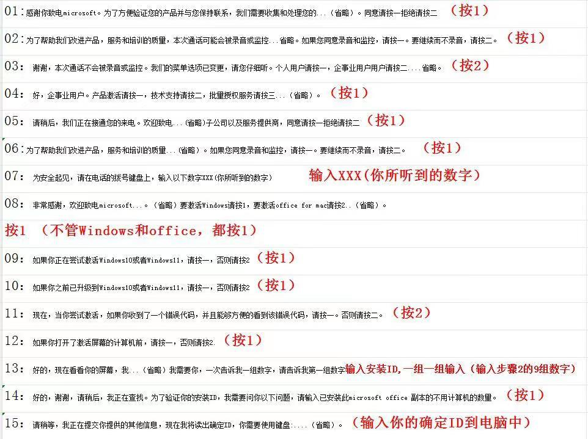

# 局域网共享

- **注意**：某些设置需要两台电脑都重新启动才可以解决！

## 网络设置

- 以下是 Win11 专业版之间共享的网络设置。
- 确保两台电脑都处在 `专用网络` 中：`设置` > `网络和Internet设置` > `高级网络设置` > `高级共享设置`

    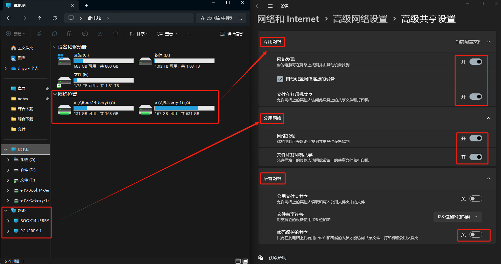

    - 专业网络与网络位置（映射驱动器）有关
    - 公有网络与网络（网上邻居）有关
    - 网络设置，需要两台电脑都重新启动才会完全生效。


## 共享磁盘

- 右键 `E盘` > `属性` > `共享` > `高级共享` > 选择 `共享此文件夹` > 确认。

## 映射驱动器

- **连接**：右键点击 `此电脑` > `映射网络驱动器`

    <div style="display: flex; justify-content: center;">
        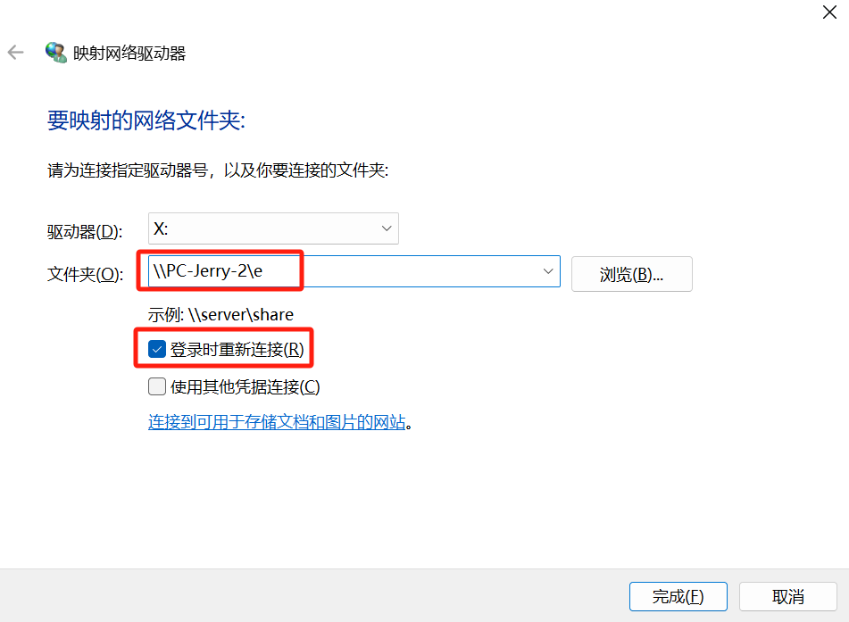
        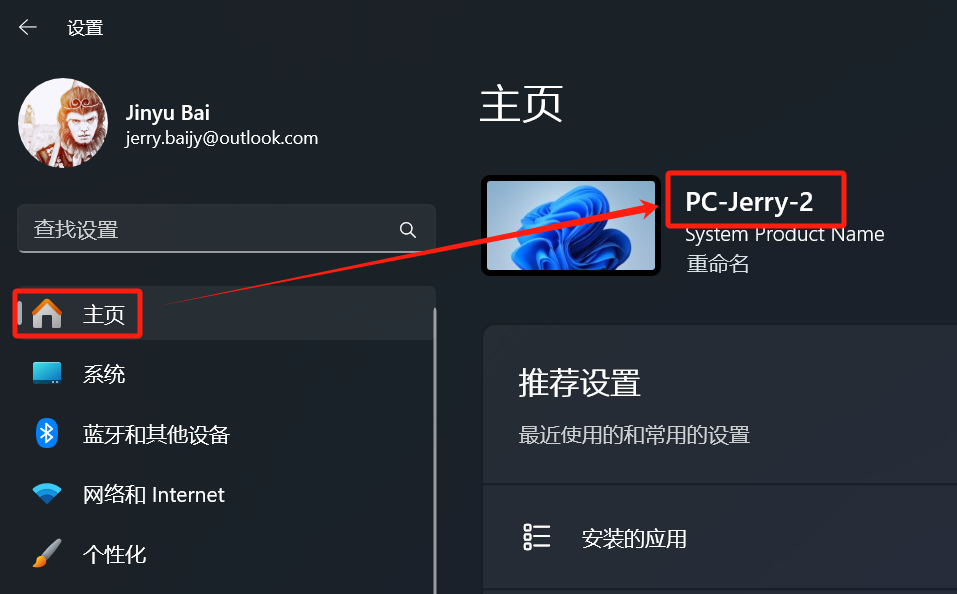
    </div>

- **语法**：`\\电脑名称\共享文件` | `\\电脑IP\共享文件`

- 尽量使用电脑名称，因为 IP 有时会变化。

- 选择 `登录时重新连接`，否则电脑重启后会丢失映射。

- 访问驱动器

    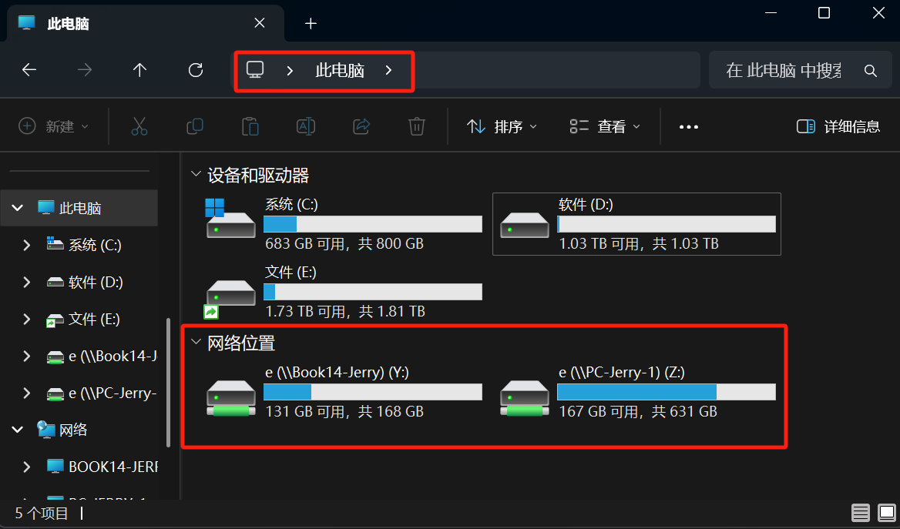

## 用户名和密码

- 通过在共享主机中添加一个本地用户实现，系统需要专业版。

- 右键 `此电脑` > `管理` > `系统工具` > `本地用户和组` > `用户`

- 新建一个用户，设置用户名和密码

    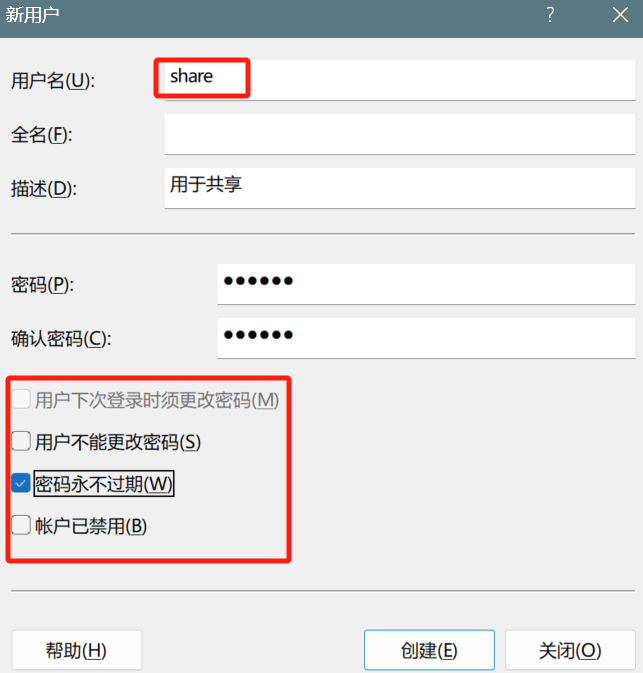

## 其它问题

- 有时重新启动可以解决
- 有时断开 VPN 可以解决

### Guest 用户

- 此项是之前没有使用 `映射驱动器` 时的方法，即在 `网上邻居` 中访问。

- 添加 `Guest` 账户，否则别人无法访问共享文件夹。
    - 右键E盘 > `属性` > `安全` > `编辑` > `添加` > `高级` > `立即查找` > 双击 `Guest` > 确认。

- 共享磁盘

    - 右键E盘 > `属性` > `共享` > `高级共享` > 选择 `共享此文件夹` > 确认。

### 没有权限访问

- 这是之前访问 `网上邻居` 的方法；可能跟网络设置有关，应先做网络设置，如果不可行，再试这个方法。

- 如果提示 `没有权限访问，请与网络管理员联系请求访问权限`。

    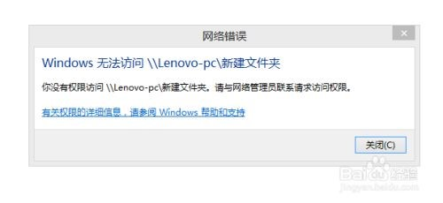

- 找到你要共享的文件夹，`右键` > `属性` > `安全` > `编辑`。

- 点击安全选项卡下面的 `编辑`，弹出编辑选项卡。

- 在 `组或用户名` 下面，点击 `添加`，弹出选中用户和组选项卡。

- 点击左下角的 `高级`，弹出新的选项卡。

- 点击 `立即查找`，在下面的搜索结果中选择 `Everyone`。

- 点击 `确定`，在输入对象名称下面出现了 `Everyone`。

- 点击 `确定`，在 `组和用户名` 下面出现了 `Everyone`，在 `Everyone` 的权限中选择你允许的权限，如读取，改写，读取和写入等，一般可以选择完全控制。然后点击 `确定`。

- 最后可以查看在安全选项卡下面的组合用户名中已经有了 `Everyone`。

- 下面就是设置共享了，点击 `共享` 选项卡，点击 `高级共享`。

- 勾选 `共享此文件夹` 复选框。

- 点击 `权限`，选择 `Everyone`，并设置你的权限。

- 点击 `确定`，并依次点击 `确定` 就可以了。这时局域网中的电脑就可以访问你共享的文件夹了。如果别人在网络中发现了你的电脑名称，直接双击打开就可以看到你共享的文件夹，并根据你分配的权限可以对此文件夹进行读写操作。

# Windows 美化

- **TranslucentTB**：任务栏透明
- **Nexus**：Dock 栏
- **MyDockFinder**：更强大的 
- **Rainmeter**：桌面
- **Steam**：Wallpaper Engine 依赖
- **Wallpaper Engine**：动态壁纸

# WSL

**WSL（Windows Subsystem for Linux）** 是微软为 Windows 系统提供的一种工具，使用户可以在 Windows 上直接运行 Linux 的用户空间环境。

## WSL 环境搭建

### 启用 WSL

1. 右键点击开始菜单，选择 `Windows PowerShell（管理员）` 或 `命令提示符（管理员）`。

2. 启用 WSL

	```powershell
	dism.exe /online /enable-feature /featurename:Microsoft-Windows-Subsystem-Linux /all /norestart
	```

3. 启用虚拟机平台功能

	```powershell
	dism.exe /online /enable-feature /featurename:VirtualMachinePlatform /all /norestart
	```

4. 重启计算机

	```powershell
	restart-computer
	```

### 安装 WSL 2

- 下载并安装 WSL 2 Linux 内核更新包：[WSL 2 Linux 内核更新包](https://aka.ms/wsl2kernel)

- 设置 WSL 默认版本为 2

  ```powershell
  wsl --set-default-version 2
  ```

- 至此，WSL 搭建完毕，接下来可以继续安装 Linux 应用或 Linux 发行版。

## WSL 基础

- **基础命令**

	```bash
	# 运行 WSL
	wsl.exe
	
	# 升级 WSL
	wsl.exe --update
	
	# 查看已安装的 Linux 应用或分发版本
	wsl -l
	```

# Windows解决方法

## 无法访问 Windows APP 文件夹

- 选中 WindowsApps 文件夹，并点击鼠标右键，在弹出的选项框中点击“属性”选项；
- 在 WindowsApps 属性对话框中，切换到“安全”选项卡；
- 在安全选项卡下，看到提示“必须具有读取权限才能查看对象属性”，并点击“高级”选项按钮；
- 点击高级选项后，这个时候会打开“WindowsApps的高级安全设置”对话窗口；
- 在WindowsApps的高级安全设置对话窗口中，点击所有者后的“更改”按钮；
- 点击更改后，这个时候会打开“选择用户或组”对话框；
- 在输入要选择的对象名称输入框中，输入“Everyone”，并点击“确定”按钮；

    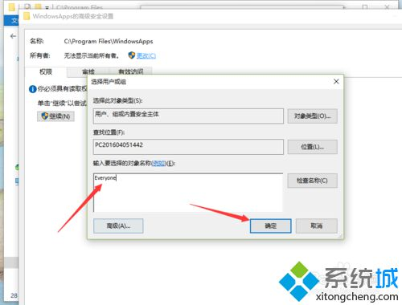

- 点击确定后，这个时候会跳转到WindowsApps的高级安全设置对话窗口；
- 接着勾选所有者下的“替换子容器和对象的所有者”，并点击“确定”按钮；
- 点击确定后，这个时候会弹出 Windows 安全对话框，进行更改所有权；
- 更改所有权完成后，这个时候就能正常访问“WindowsApps”文件夹了。

## 环境变量

- 在终端执行软件操作时，正常需填写软件路径（如 `C:\...Programs\Python\Python311\python.exe test.py`）
- 为了方便输入，可直接填写 `python test.py`，但前提是必须将 Python 加入系统环境变量，其它软件同理。

- 具体方法如下：

- 右键点击 `此电脑` > `属性` > `高级系统设置` > `高级` > `环境变量`；
- 在 `用户变量` 中选中 `Path`，点击 `编辑` > `新建` > 在输入框填入软件执行文件（.exe）所在文件夹路径 `C:\...Programs\Python\Python311`；
- 所有窗口点击确定。

## 卓越性能

- 系统默认没有 `卓越性能` 选项。
- 以管理员身份运行 PowerShell，输入以下代码，开启 `卓越性能` 选项。

    ```shell
    powercfg -duplicatescheme e9a42b02-d5df-448d-aa00-03f14749eb61
    ```

- `控制面板` > `硬件和声音` > `电源选项` > 选择 `卓越性能`。

## 加入开始菜单

- 安装软件以后，系统没有自动加入开始菜单，需手动加入，以 MusicBee 为例
- 进入软件安装目录，找到 MusicBee.exe 文件，发送至桌面快捷方式
- 到桌面，把文件名改为 MusicBee
- 剪切粘贴至 `C:\ProgramData\Microsoft\Windows\Start Menu\Programs` 文件夹
- 检查开始菜单，正常已经加入

## 开机启动

- 优先使用软件自身设置
- 其次使用 `设置` > `应用` > `启动`
- 最后采用手动将软件文件加入 `启动` 文件夹，下面任选其一
    - 优先选所有账户：`C:\ProgramData\Microsoft\Windows\Start Menu\Programs\Startup`
    - 特殊时选当前账户：`C:\Users\jerry\AppData\Roaming\Microsoft\Windows\Start Menu\Programs\Startup`

## 删除顽固文件

- 文件夹里有个大小为0、类型为“文件”的文件，系统提示找不到，无法删除

- 新建一个记事本，输入以下内容

  ```
  DEL /F /A /Q \\?\%1
  RD /S /Q \\?\%1
  ```

- 另存为

  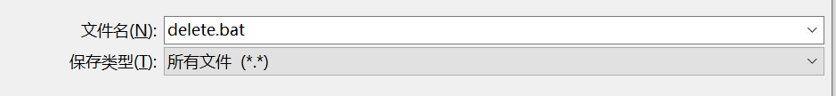

- 将顽固文件拖放在新文件上面，即可删除

## 权限不足

- 当运行某个软件提示没有权限或权限不足
- 找到软件的运行文件（如 VMware.exe），右键属性 > 兼容性
- 勾选 “以管理员身份运行此程序”，保存即可

## 密钥对

- 以 Windows 系统为例
- Git Bash 进入文件夹 `C:\Users\39331\.ssh`
- 创建密钥

    ```bash
    ssh-keygen -t rsa # 默认回车确认
    ```

- 新生成的密钥存储在 `C:\Users\39331\.ssh\`，一个是私钥，另一个是同名的公钥（.pub）
- 记事本打开新生成的公钥，复制内容，粘贴至其它平台公钥区域
- 通过 SSH 连接至其它平台
- 如果收到警告无法连接，原因是远程主机的公钥已经发生了变化，而 `known_hosts` 文件中的条目与之前保存的公钥不匹配。应该删除 `known_hosts` 文件的冲突条目，重新连接。

## 分区空间转移

- **前提**：只能在同一个物理磁盘内部转移，两个不同物理磁盘之间无法转移。
- **目标**：想要把 C 盘的空间分配一点给 D 盘

### 使用 DiskGenius 分区工具

- PE 中运行 DiskGenius 分区工具

- 右键点击 D 盘，选择 `扩容分区`

    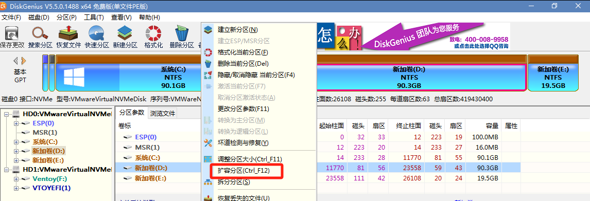

- 选择要缩小的分区，即 C 盘

    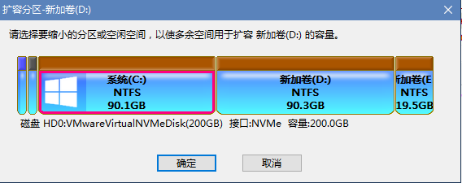

- 修改要分配多少空间给 D 盘

    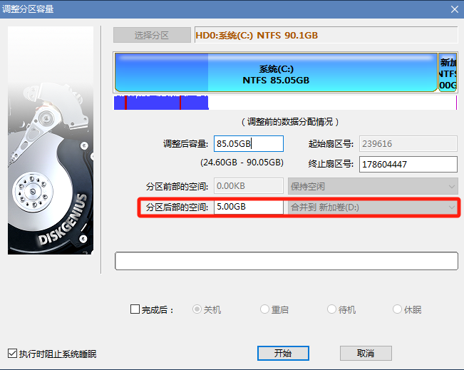

- 点击 `开始` 后，工具会自动从 C 盘分配 5G 的空间给 D 盘

### 使用 Windows 磁盘管理工具

- **获得未分配空间**
    - 磁盘中未使用的  `未分配空间`
    - 通过 `压缩卷` 获得
- **未分配空间作用**
    - 扩展给紧邻它左侧的分区
    - 与相邻的 `未分配空间` 自动合并
    - 通过 `新建简单卷` 新建一个分区
- 如果想用系统自带磁盘工具在分区之间转移空间，就是合理利用 `未分配空间` 的三个作用。
- 下面以 C 盘分配空间给 D 盘为例
- **打开磁盘管理工具**：右键点击 `开始菜单`，选择 `磁盘管理`。
- **缩小 C 盘**：
    - 在磁盘管理窗口中，右键点击 C 盘（想要缩小的分区），选择 `压缩卷`。
    - 输入希望缩小的空间大小，然后点击 `压缩`。
    - 即可在紧邻 C 盘右侧，出现一个 `未分配空间`。
- **扩容 D 盘**：
    - 先备份 D 盘所有文件至其它分区。
    - 右键点击 D 盘，选择 `删除卷`，将 D 盘也变成 `未分配空间`，并且和 C 盘压缩出来的 `未分配空间` 自动合并为一个新的  `未分配空间`。
    - 右键点击这个新的  `未分配空间` 选择 `新建简单卷` ，即可生成一个新的增容的分区。
    - 注意：如果驱动器号如果没有自动生成为 D 盘，应手动更改。
    - 最后把之前备份的 D 盘文件复制会新的 D 盘。
    - 这样就完成了 C 盘的空间分配一点给 D 盘的目的。
- **扩展**：如果想增加系统盘 C 盘空间，也需要删除 D 盘，然后对 C 盘进行 `扩展卷`。

## 系统修复

- `SFC /scannow` 是 Windows 操作系统中的一个命令，用于扫描系统文件的完整性并修复损坏的文件。
- 以管理员身份运行 PowerShell，运行以下代码：

    ```shell
    sfc /scannow
    ```

## 查看系统引导方式

- `Win + R` 输入 `msinfo32` 按 `Enter` 打开系统信息。
- `BIOS 模式`：`UEFI` / `传统`

## [基于虚拟化的安全性（VBS）](https://learn.microsoft.com/zh-cn/windows-hardware/design/device-experiences/oem-vbs?view=windows-11)

`基于虚拟化的安全性（VBS）` 使用硬件虚拟化和 Windows 虚拟机监控程序来创建独立的虚拟环境，与虚拟机相关。不同虚拟机关于是否开启 `基于虚拟化的安全性` 要求不同，有多种方法可以关闭该功能。

### 查看状态

- `Win + R` 运行 `msinfo32`，打开 `系统信息`。

- 找到 `基于虚拟化的安全性`（值为“正在运行”表示该功能已打开， “未启用”表示该功能已关闭）。

    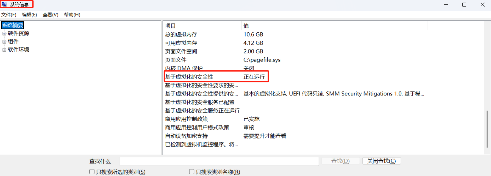

    

### 华为工具

- 此方法是使用 `Tool.bat` 关闭 `基于虚拟化的安全性`。

- 从[华为页面](https://consumer.huawei.com/cn/support/content/zh-cn16012808/)或网盘下载 `Tool.bat`，并以管理员身份运行。

- 工具完成自动操作后，手动重启。

    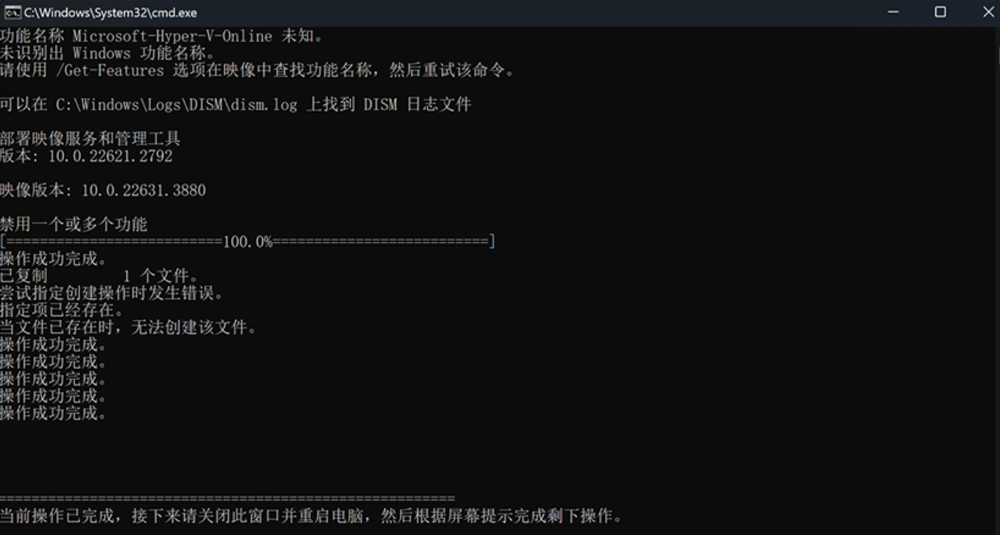

- 重启出现英文页面后，按界面提示点按4次F3键则表示同意关闭，等待电脑启动后完成操作。

    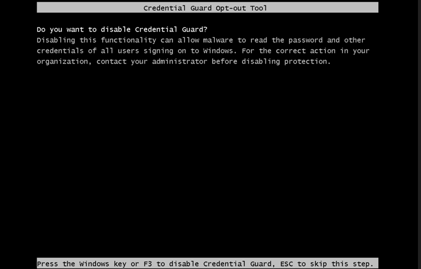

### 雷电模拟器

- 此方法是使用 `雷电模拟器` 关闭 `基于虚拟化的安全性`。
- 安装 `雷电模拟器` 并运行，程序会提示与系统冲突，弹出修复工具，点击修复，然后重启系统。
