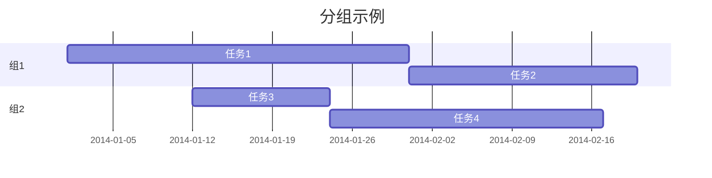
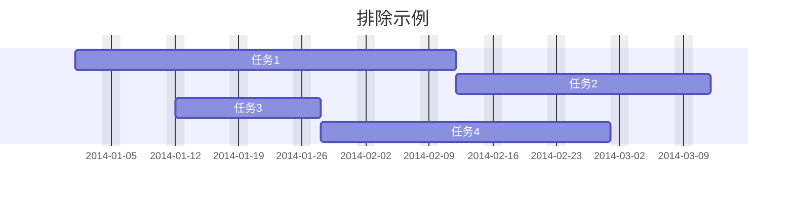
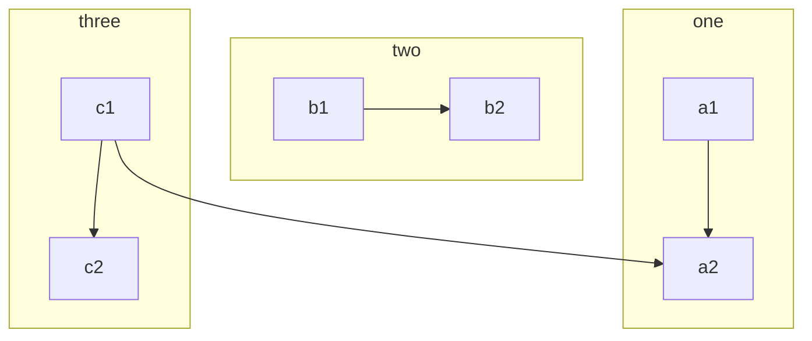
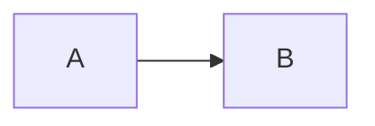

# Mermaid

[Mermaid](https://mermaid.nodejs.cn/) 是一款基于 JavaScript 的开源**图表工具**，通过类 Markdown 的语法将文本描述转换为流程图、时序图、甘特图等可视化图表，实现“代码即图表”的理念。

## 学习资源

- [Mermaid 中文网](https://mermaid.nodejs.cn/)
- [Mermaid 中文文档](https://docs.min2k.com/zh/mermaid/intro/)
- [Mermaid 在线编辑器](https://www.min2k.com/tools/mermaid/)
- [使用方法](https://docs.min2k.com/zh/mermaid/config/usage.html)

## 注释

```
%% 这是一个行注释
```

- 不能再行尾注释
- 不能含有某些特殊字符，如 `{}`，以防止[图表破坏](https://mermaid.js.org/intro/syntax-reference.html#diagram-breaking)。

## 语法结构

- [Mermaid 语法结构](https://docs.min2k.com/zh/mermaid/intro/syntax-reference.html)：所有图表定义都是以**图表类型声明**开始，之后是**图表内容**的定义。

```
%% 声明图表类型（流程图有方向）
flowchart TD

    %% 图表内容
```

> ```mermaid
> flowchart LR
>  A --> B
>  B --> C
> ```

## 图表破坏

人们应该小心使用**[某些词或符号](https://mermaid.js.org/intro/syntax-reference.html#diagram-breaking)**，它们可能会破坏图表。这些词或符号很少，并且通常只影响特定类型的图表。

## 主题

**[主题](https://docs.min2k.com/zh/mermaid/config/theming.html)**可以在**站点级别**或**单个 Mermaid 图表**上进行自定义。对于站点级别的自定义主题，使用 `initialize` 调用。对于单个图表的自定义主题，使用 `init` 指令。以下仅记录单个图表自定义主题的方法。

### 图表特定主题

**语法**：``%%{init: {'theme':'主题名'}}%%``

```
%%{init: {'theme':'forest'}}%%
graph LR
    a --> b
```

> ```mermaid
> ---
> title: 自定义主题的流程图
> ---
> %%{init: {'theme':'forest'}}%%
> graph LR
>     a --> b
> ```

### 图表自定义主题

要创建自定义主题，请通过 `init` 修改 `themeVariables`。

您需要使用 [base](https://github.com/mermaid-js/mermaid/blob/develop/packages/mermaid/src/themes/theme-base.js) 主题，因为它是唯一可修改的主题。

各变量详见：[主题变量](https://docs.min2k.com/zh/mermaid/config/theming.html#主题变量)

**语法**：

```
%%{
  init: {
    'theme': 'base',
    'themeVariables': {
      '主题变量1': '变量值',
      '主题变量2': '变量值',
      '主题变量n': '变量值'
    }
  }
}%%
```

## 布局和外观

可以使用 `config` 对图表的[外观和布局](https://docs.min2k.com/zh/mermaid/intro/syntax-reference.html#布局和外观)进行更改。

# 饼图

```
pie title 饼图示例
    "部分1" : 70
    "部分2" : 25
    "部分3" : 5
```

> ```mermaid
> pie title 饼图示例
>     "部分1" : 70
>     "部分2" : 25
>     "部分3" : 5
> ```

# 甘特图

## 甘特图概述

```
gantt
    %% 图表名称，可省略
    title 图表名称

        %% 定义任务
        任务名 :开始时间, 持续时间
        任务名 :开始时间, 持续时间
        任务名 :开始时间, 持续时间
        任务名 :开始时间, 持续时间
```

> ```mermaid
> gantt
>     title 甘特图示例
> 
>         任务1 :2014-01-01, 30d
>         任务2 :20d
>         任务3 :2014-01-12, 12d
>         任务4 :24d
> ```

- `开始时间`：除第一个以外，其余都可省略，默认为上一个任务的结束时间。
- 使用冒号 `:` 将**任务名**与其**[元数据](https://docs.min2k.com/zh/mermaid/syntax/gantt.html#语法)**分开。 

## 甘特图元数据

### 甘特图元数据语法

- 使用冒号 `:` 将**任务名**与其**[元数据](https://docs.min2k.com/zh/mermaid/syntax/gantt.html#语法)**分开。 `任务名: 元数据项`
- 如果指定**单个**元数据项，则确定任务结束时间。
    - 它可以是：`特定的日期/时间` | `持续时间`，如 `2025-09-26` | `15d`
    - 如果指定的是 `持续时间`，则将其添加到任务的开始日期以确定任务的结束日期，同时考虑任何排除项。
- 如果指定**两个**元数据项，则后面的元数据项将按前面的情况进行解释。如 `2025-09-26, 15d`
- 如果指定**三个**元数据项，则后面两个项目将按前面的情况进行解释。第一个项目将表示任务的 ID，可以使用 `later <taskID>` 语法引用它。如 `task1, 2025-09-26, 15d` & `after task1, 15d`，详见  `taskID`

### taskID

taskID 即任务的 ID 标签，用于另一个任务的关键字 `before`、`after` 等之后，作为这些关键字的基准。

```
gantt
    title 图表名称

        %% 定义一个任务 ID
        任务名 :任务ID, 开始时间, 持续时间
        任务名 :开始时间, 持续时间

        %% 使用前面的任务 ID
        任务名 :after 任务ID, 持续时间  
        任务名 :开始时间, 持续时间
```

> ```mermaid
> gantt
>     title ID示例：任务3开始时间，接续任务1结束时间
>         任务1 :task1ID, 2014-01-01, 30d
>         任务2 :20d
>         任务3 :after task1ID, 12d
>         任务4 :24d
> ```

## 分组

使用 `section` 对任务进行分组：`section 组名`

```
gantt
    title 图表名称

    %% 第一组
    section 组名
        任务名 :开始时间, 持续时间
        任务名 :开始时间, 持续时间

    %% 第二组
    section 组名
        任务名 :开始时间, 持续时间
        任务名 :开始时间, 持续时间
```



## 排除

使用 [`excludes`](https://docs.min2k.com/zh/mermaid/syntax/gantt.html#排除) 排除任务中的日期，值可以是：`YYYY-MM-DD` | `星期几` | `weekends`

```
gantt
    title 图表名称

    %% 定义排除日期
    excludes 排除日期

        任务名 :开始时间, 持续时间
        任务名 :开始时间, 持续时间
        任务名 :开始时间, 持续时间
        任务名 :开始时间, 持续时间
```



## 日期格式

使用 [`日期格式`](https://docs.min2k.com/zh/mermaid/syntax/gantt.html#设置日期) 达到特殊日期的输入和输出目的。

### 输入日期

使用 `dateFormat` 定义甘特图元素的日期的**输入**格式，默认为 `YYYY-MM-DD`。更多详见：[输入日期格式](https://docs.min2k.com/zh/mermaid/syntax/gantt.html#输入日期格式) | [Day.js](https://day.js.org/docs/zh-CN/parse/string-format)

```
gantt
    title 图表名称
    
    %% 定义输入日期格式
    dateFormat 输入日期格式

        任务名 :开始时间, 持续时间
        任务名 :开始时间, 持续时间
        任务名 :开始时间, 持续时间  
        任务名 :开始时间, 持续时间
```

> ```mermaid
> gantt
>     title 输入日期格式示例
>     dateFormat YYYY
>         任务1 :1500, 300y
>         任务2 :200y
>         任务3 :1600, 100y
>         任务4 :200y
> ```

### 输出日期

使用 `axisFormat` 定义甘特图元素的日期的**输出**格式。默认为 `YYYY-MM-DD`。更多详见：[输出日期格式](https://docs.min2k.com/zh/mermaid/syntax/gantt.html#轴上的输出日期格式) | [d3-time-format](https://github.com/d3/d3-time-format/tree/v4.0.0#locale_format)

```
gantt
    title 图表名称
    
    %% 定义输出日期格式
    axisFormat 输出日期格式

        任务名 :开始时间, 持续时间
        任务名 :开始时间, 持续时间
        任务名 :开始时间, 持续时间  
        任务名 :开始时间, 持续时间
```

> ```mermaid
> gantt
>     title 输出日期格式示例
>     axisFormat %Y
>         任务1 :1500-05-10, 300y
>         任务2 :200y
>         任务3 :1600-05-10, 100y
>         任务4 :200y
> ```

### 轴刻度

使用 [`tickInterval`](https://docs.min2k.com/zh/mermaid/syntax/gantt.html#轴刻度-v10-3-0) 定义甘特图输出日期的**刻度**。默认为自动。

```
gantt
    title 图表名称
    
    %% 定义轴刻度
    tickInterval 轴刻度

        任务名 :开始时间, 持续时间
        任务名 :开始时间, 持续时间
        任务名 :开始时间, 持续时间  
        任务名 :开始时间, 持续时间
```

> ```mermaid
> gantt
>     title 轴刻度示例
>     tickInterval 1month
>         任务1 :2014-01-01, 30d
>         任务2 :20d
>         任务3 :2014-03-12, 12d
>         任务4 :24d
> ```

### 特殊年份

此方案解决两个问题：

- 甘特图 `开始时间`

```
gantt
    title 公元前年份和不足四位年份示例
    
    %% 输入日期格式使用 Unix 时间戳，可使输出显示负数
    dateFormat X
    
    %% 输出日期的 Y 前面加符号 -，可移除输出刻度的前导零，使年份不必强制为4位
    axisFormat %-Y
        
        %% 开始时间为 Unix 时间戳
        任务1 :-68390640000, 300y
        
        任务2 :200y
        任务3 :-76841328000, 200y
        任务4 :-56841328000, 200y
```

> ```mermaid
> gantt
>     title 公元前年份和不足四位年份示例
>     dateFormat X
>     axisFormat %-Y
>         任务1 :-68390640000, 300y
>         任务2 :200y
>         任务3 :-76841328000, 200y
>         任务4 :-56841328000, 200y
> ```

# 流程图

## 流程图概述

**[流程图](https://docs.min2k.com/zh/mermaid/syntax/flowchart.html)**由**节点**和**连线**组成。

```
%% 声明图表类型和方向
flowchart LR

    %% 节点和连线
    A --> B
    B --> C
```

> ```mermaid
> flowchart LR
>        A --> B
>        B --> C
> ```

## 流程图方向

[流程图方向](https://docs.min2k.com/zh/mermaid/syntax/flowchart.html#节点形状)：`TD / TB` | `BT` | `RL` | `LR`

```
%% 图表方向为从上到下
flowchart TD
    A --> B
    B --> C
```

## 流程图标题

```
%% 定义流程图名称
---
title: 流程图名称
---

flowchart LR
    A --> B
    B --> C
```

> ```mermaid
> ---
> title: 流程图名称
> ---
> 
> flowchart LR
>     A --> B
>     B --> C
> ```

## 节点

### 节点概述

- [流程图节点](https://docs.min2k.com/zh/mermaid/syntax/flowchart.html#节点)

    ```
    %% 节点ID(显示文本)
    
    A(这是显示文本)
    ```

    > ```mermaid
    > flowchart LR
    >     A(这是显示文本)
    > ```

- 显示文本可以使用 HTML

    ```
    %% 节点ID("<font color='red'>显示文本</font>")
    
    A("<font color='red'>显示文本</font>")
    ```

    > ```mermaid
    > flowchart TD
    >     A("<font color='red'>黄帝</font>")
    > ```

### 节点形状

- [流程图节点形状](https://docs.min2k.com/zh/mermaid/syntax/flowchart.html#节点形状)
- `A[方形]`：矩形
- `B(圆角矩形)`：圆角矩形
- `C{菱形}`：菱形
- `D((圆形))`：圆形
- ...

## 连线

- [各种形式的连线](https://docs.min2k.com/zh/mermaid/syntax/flowchart.html#节点之间的链接)
- `A-->B` 实线箭头
- `A-- 文本 -->B` 实线箭头带文本
- `A-.->B` 虚线箭头
- `A==>B` 粗实线箭头
- `A--B` 实线
- `A-.B` 虚线

## 箭头

[箭头](https://docs.min2k.com/zh/mermaid/syntax/flowchart.html#新箭头类型)

## 子图

[子图](https://docs.min2k.com/zh/mermaid/syntax/flowchart.html#子图)



```
subgraph 子节点标题
    节点描述
end
```

```
flowchart TB
    subgraph one
    a1-->a2
    end
    subgraph two
    b1-->b2
    end
    subgraph three
    c1-->c2
    end
    c1-->a2
```

## 交互

[交互](https://docs.min2k.com/zh/mermaid/syntax/flowchart.html#%E4%BA%A4%E4%BA%92)



```
click 节点ID "网址" _blank
```

```
click B "https://www.github.com" _blank
```

## 样式和类

[样式和类](https://docs.min2k.com/zh/mermaid/syntax/flowchart.html#%E6%A0%B7%E5%BC%8F%E5%92%8C%E7%B1%BB)

### 节点样式

```
style 节点ID fill:#填充颜色,stroke:#边框色,stroke-width:边框线宽,color:#文字颜色
```

```
flowchart TD
    A(开始) --> B(处理)
    style A fill:#4CAF50,stroke:red,stroke-width:2px,color:red
    style B fill:#FF9800,stroke:blue,stroke-width:2px,color:#000
```

### 连线样式

```
linkStyle 索引 stroke:#连接线颜色,stroke-width:连接线线宽,color:#文字颜色
```

```
flowchart TD
    A --> B
    B --> C

    %% 修改第一条边 (A --> B)
    linkStyle 0 stroke:red,stroke-width:2px,color:blue;
```

- 注意：索引从 `0` 开始，按定义连线的顺序计算。

### 样式类定义

```
%% 定义样式类
classDef 类名 fill:#填充颜色,stroke:#边框框色,stroke-width:边框线宽,color:#文字颜色;

%% 应用样式类
class 节点ID1,节点ID2 类名;
```

```
flowchart TD
    A(开始) --> B(处理) --> C(结束)
  
    %% 定义两个样式类
    classDef greenNode fill:#4CAF50,stroke:#333,stroke-width:2px,color:red;
    classDef redNode fill:#F44336,stroke:#000,stroke-width:2px,color:#fff;
  
    %% 应用样式类
    class A greenNode;
    class C redNode;
```

## 破坏语法的特殊字符

[破坏语法的特殊字符](https://docs.min2k.com/zh/mermaid/syntax/flowchart.html#破坏语法的特殊字符)：将文本放在引号内，以呈现更麻烦的字符。

```
flowchart LR
    id1["这是一段（文本）"]
```

> ```mermaid
> flowchart LR
>     id1["这是一段（文本）"]
> ```
