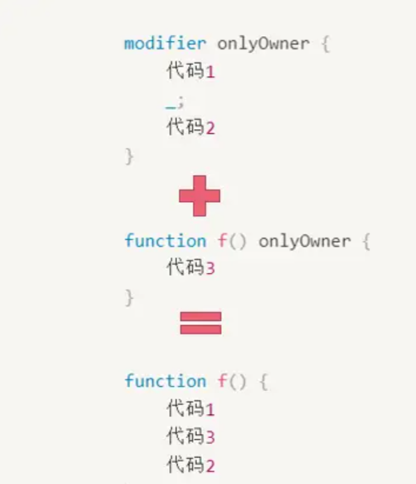
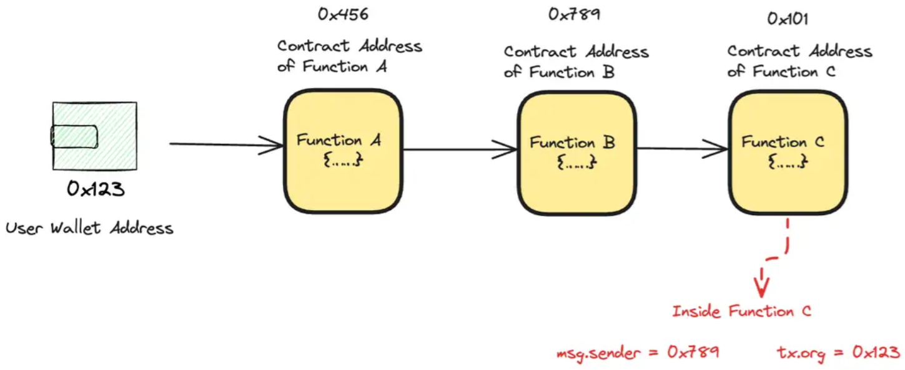

# Solidity

## Solidity

[Solidity](https://docs.soliditylang.org/zh-cn) 是一门为实现智能合约而创建的面向对象的高级编程语言。智能合约是控制 Ethereum 状态中账户行为的程序。

- Solidity 是一个开源的社区项目，由一个核心团队管理。
- Solidity 受 C++ 的影响最深，但也借用了 Python，JavaScript 等语言的概念。

**Solidity 的特点**：

- 面向对象
- 静态类型
- 强类型

**Solidity 资源**：

- [Solidity 资源](https://docs.soliditylang.org/zh-cn/latest/resources.html)
- [Solidity Docs](https://docs.soliditylang.org/zh-cn)
- [Solidity by Example](https://solidity-by-example.org/)
- [Course on Hackquest](https://www.hackquest.io/zh-cn/home)

## [源文件结构](https://docs.soliditylang.org/zh-cn/v0.8.24/layout-of-source-files.html)

源文件可以包含任意数量的 contract 定义，import 指令，pragma 指令，using for 指令，struct，enum，function，error 以及 constant 变量的定义。

### [SPDX 许可标识符](https://docs.soliditylang.org/zh-cn/v0.8.24/layout-of-source-files.html#spdx)

**SPDX 许可标识符**用于表示源代码的开源情况。每个开源的源文件都应该以一个 `// SPDX-License-Identifier: MIT` 注释开始。

### [编译指示](https://docs.soliditylang.org/zh-cn/v0.8.24/layout-of-source-files.html#pragma)

**pragma** 关键字用于启用某些编译器特性或检查。

#### [版本编译指示](https://docs.soliditylang.org/zh-cn/v0.8.24/layout-of-source-files.html#version-pragma)

使用 **pragma** 关键字指定编译器版本。

```solidity
//指定合约的编译器版本仅可为0.8.4
// SPDX-License-Identifier: MIT
pragma solidity 0.8.4;


//指定合约的编译器版本仅可为≥0.8.4 且 <0.9.0（）
// SPDX-License-Identifier: MIT
pragma solidity ^0.8.4;
```

pragma 的作用是确保代码能够在特定版本的编译器下正确编译和执行，以避免潜在的兼容性问题。

使用关键字 pragma 并不会直接更改编译器的版本。它也不会启用或禁用编译器的功能。它只是指示编译器检查它的版本是否与 *pragma* 要求的版本匹配。如果不匹配，则编译器会报错。

### [导入其它源文件](https://docs.soliditylang.org/zh-cn/v0.8.24/layout-of-source-files.html#import)

### [注释](https://docs.soliditylang.org/zh-cn/v0.8.24/layout-of-source-files.html#index-9)

- 单行注释（ `//` ）和多行注释（ `/*...*/` ）

    ```solidity
    // SPDX-License-Identifier: MIT
    pragma solidity ^0.8.0;
    
    // 这是一个单行注释，描述下面的合约。
    contract HelloWorld {
        // 这是一个单行注释，描述下面的方法。
        function sayHello() public pure returns (string memory) {
            /*
             * 多行注释第一行
             * 多行注释第二行
             * 多行注释第三行
             * 这里是对下面的返回代码块的解释。
             */
            return "Hello World";
        }
    }    
    ```

- NatSpec 注释（ `///`）和（ `/** ... */`），它们应该直接用在函数声明或语句之上。

    ```solidity
    // SPDX-License-Identifier: GPL-3.0
    pragma solidity >=0.4.16 <0.9.0;
    
    /// @author Solidity团队
    /// @title 一个简单的存储例子
    contract SimpleStorage {
        uint storedData;
    
        /// 存储 `x`。
        /// @param x 要存储的新值
        /// @dev 将数字存储在状态变量 `storedData` 中
        function set(uint x) public {
            storedData = x;
        }
    
        /// 返回存储的值。
        /// @dev 检索状态变量 `storedData` 的值
        /// @return 存储的值
        function get() public view returns (uint) {
            return storedData;
        }
    }
    ```

## 代码风格

- [Solidity 代码风格指南](https://docs.soliditylang.org/zh-cn/latest/style-guide.html#maximum-line-length)

### 标识符

**标识符规范**：

**命名习惯**：

- [命名规范](https://docs.soliditylang.org/zh-cn/latest/style-guide.html#id18)
- **合约**：大驼峰
- **结构体**：大驼峰
- **结构体属性**：num_Student
- **函数**：小驼峰
    - **函数参数**：小驼峰
- **局部变量和状态变量**：小驼峰
- **常量**：大蛇形
- **事件**：大驼峰
    - **事件参数**：小驼峰
- **枚举**：大驼峰
- **修饰符**：大驼峰

# [contract](https://docs.soliditylang.org/zh-cn/v0.8.24/contracts.html#contracts)

**合约**（Contract）类似于面向对象语言中的类。 

## 定义合约

使用 **contract** 关键字声明合约名称，一个 Solidity 的 **.sol** 文件可以包含一个或多个 contract。

```solidity
contract 合约名称 { }
contract MyContract{ }
```

```solidity
// SPDX-License-Identifier: MIT
pragma solidity ^0.8.0;

// 声明一个名称为 ContractA 的合约，相当于面向对象中的类
contract ContractA {
    uint256 public data;
}

// 声明一个名称为 ContractB 的合约，相当于面向对象中的类
// 这里有两个合约，是为了展示从一个合约可以引入另一个合约。
contract ContractB {
    //声明一个合约类型的变量 ContractA，相当于面向对象中的对象
    ContractA public contractA;
    ContractA public contractAA;

    constructor(address _contractA) {
        // 方式一：通过 new 的方式实例化 ContractA，相当于面向对象中的实例化对象
        contractA = new ContractA();

        // 方式二：通过指定地址的方式实例化 contractAA，相当于面向对象中的实例化对象
        contractAA = ContractA(_contractA);
    }
}
```

## 合约结构

在 Solidity 中，合约类似于面向对象编程语言中的类。 

每个合约中可以包含如下声明：

- 状态变量
- 函数
- 函数修饰器
- 事件
- 错误
- 结构类型
- 枚举类型

合约可以从其他合约继承。

还有一些特殊种类的合约，叫做**库合约**和**接口合约**。

# [可见性和 getter 函数](https://docs.soliditylang.org/zh-cn/v0.8.24/contracts.html#getter)

## 可见性说明符

状态变量和函数的可见性通过**[可见性说明符](https://docs.soliditylang.org/zh-cn/v0.8.24/cheatsheet.html#index-10)**表示，可写在如下位置：

- **状态变量**：放在变量名之前
- **函数**：参数列表和返回参数列表之间

```solidity
//状态变量的可见性
变量类型 可见性说明符 变量名;

//函数的可见性
function 函数名() 可见性说明符 { }
```

```solidity
uint public a;
function aa() public { 
	//funciton body 
}
```

- **public**：合约内、外均可见
- **private**：仅在内部可见（继承合约不可见）
- **external**：仅在外部可见（仅可修饰函数）
- **internal**：仅在内部可见（继承合约可见）（默认可见性）

| 可见性 | 适用对象 | 可访问范围 | Getter生成 | 默认可见性 | 特性与限制 |
| :---: | :---: | :---: | :---: | :---: | :---: |
| public | 状态变量、函数 | 合约内外 | 状态变量：是<br>函数：不适用 | 否 | 状态变量自动生成Getter；函数参数复制到内存，Gas消耗较高 |
| private | 状态变量、函数 | 仅当前合约内部（继承合约不可见） | 否 | 否 | 数据仍存于链上，继承合约不可访问 |
| external | 函数 | 仅外部调用（内部需`this.func()`） | 不适用 | 否 | 参数用`calldata`存储，Gas优化；不可修饰状态变量 |
| internal | 状态变量、函数 | 当前合约及继承合约 | 否 | 状态变量：是<br>函数：否 | 状态变量默认可见性；函数需显式声明，常用于继承体系共享逻辑 |

在下面的例子中，合约 `D`, 可以调用 `c.getData()` 来检索状态存储中 `data` 的值， 但不能调用 `f`。 合约 `E` 是从合约 `C` 派生出来的，因此可以调用 `compute`。

```solidity
// SPDX-License-Identifier: GPL-3.0
pragma solidity >=0.4.16 <0.9.0;

contract C {
    uint private data;

    function f(uint a) private pure returns(uint b) { return a + 1; }
    function setData(uint a) public { data = a; }
    function getData() public view returns(uint) { return data; }
    function compute(uint a, uint b) internal pure returns (uint) { return a + b; }
}

// 这将不会编译
contract D {
    function readData() public {
        C c = new C();
        uint local = c.f(7); // 错误：成员 `f` 不可见
        c.setData(3);
        local = c.getData();
        local = c.compute(3, 5); // 错误：成员 `compute` 不可见
    }
}

contract E is C {
    function g() public {
        C c = new C();
        uint val = compute(3, 5); // 访问内部成员（从继承合约访问父合约成员）
    }
}
```

## [状态变量的可见性](https://docs.soliditylang.org/zh-cn/v0.8.24/contracts.html#id3)

| 修饰符 | 可访问范围 | 自动生成 Getter | 典型应用场景 | 特性与限制 |
| :---: | :---: | :---: | :---: | :---: |
| public | 合约内外均可读取（通过自动生成的 Getter 函数） | 是 | 需对外公开的状态（如代币总供应量） | 自动生成同名 Getter 函数；存储数据仍可通过事件或链上分析获取 |
| private | 仅在当前合约内部可访问（继承合约不可见） | 否 | 敏感数据（如管理员地址、内部计算中间值） | 编译后数据仍存于链上，仅限制合约层面的直接访问；继承合约不可见 |
| internal | 当前合约及继承合约可访问 | 否 | 需在继承体系中共享的数据（如基础合约配置） | 默认可见性（未显式声明时）；与 `private` 类似但允许继承 |

## [函数的可见性](https://docs.soliditylang.org/zh-cn/v0.8.24/contracts.html#id4)

Solidity 有两种函数调用：确实创建了实际 EVM 消息调用的**外部函数**和不创建 EVM 消息调用的**内部函数**。 此外，派生合约可能无法访问内部函数。 这就产生了四种类型的函数的可见性。Solidity 0.5 及之后：必须显式指定函数的可见性（之前是 public），否则编译报错！

| 修饰符 | 可访问范围 | 典型应用场景 | 特性与限制 |
| :---: | :---: | :---: | :---: |
| public | 合约内外均可调用（包括其他合约、EOA用户、继承合约） | 需对外暴露的接口（如 DApp 前端交互）、状态变量自动生成 getter 函数 | 参数处理需复制到内存，Gas 消耗较高；默认可见性修饰符 |
| private | 仅在当前合约内部可调用（继承合约不可见） | 内部工具函数、敏感逻辑（如权限校验） | 编译后仍可通过链上数据逆向分析，仅防止其他合约调用 |
| external | 仅能通过外部调用（合约或用户），内部需通过 `this.func()` 调用 | 面向外部的高频接口（如代币转账）、需节省 Gas 的场景 | 参数以 `calldata` 存储，避免内存复制，Gas 更优；不支持内部直接调用 |
| internal | 当前合约及其继承合约可调用 | 可复用逻辑封装（如代币铸造）、继承体系中的工具函数 | 参数处理与 `public` 类似 |

## [Getter 函数](https://docs.soliditylang.org/zh-cn/v0.8.24/contracts.html#getter-functions)

# 变量

## 状态变量

**状态变量**（State Variable）是在函数外部声明的变量。如果这个信息应该被记录在区块链上，则将其设置为状态变量。状态变量通常需要更多的 gas 来读写，所以应当仅在必要时使用。

```solidity
contract ContractName {
    //这是一个状态变量
    int a;

    function add(int b) returns (int) {
        //b被定义为函数的输入参数，所以它不是状态变量
        //c是在函数中定义的，所以它也不是状态变量
        int c = a + b;
        return c;
    }
}
```

获取其它合约的状态变量：只有 public 的变量才可以通过 `合约名.参数名()` 的方式获取

```solidity
contract NFTContract {
    //只有 public 的变量才可以通过 `合约名.参数名()` 的方式获取
    uint public totalSupply;
}

contract MarketplaceContract {
    // 必须持有合约 NFTContract 的实例引用才能调用其状态变量
    NFTContract public nft;

    function getTotalSupply() public view returns (uint) {
        // 调用合约 NFTContract 的 状态变量 totalSupply
        return nft.totalSupply();
    }
}
```

## 局部变量

**局部变量**（Local Variable）是在函数内部声明的变量，其作用域仅限于该函数内部。

## 常量

使用 constant 关键字声明常量

```solidity
//将1赋值给了常量NUM。
uint256 constant NUM = 1;
```

constant 只能用于声明**状态变量**，但**不会**被写入合约的 storage 中，而是直接在编译时被硬编码到**字节码**中，而字节码是在合约部署时就生成的值，所以不可能在函数运行时再改变字节码。

## immutable

immutable 修饰的变量可以在构造函数中对其赋值，且赋值后不可更改。immutable 只能用于状态变量的定义，这是因为 immutable 修饰的变量也会硬编码到合约的字节码中。

# 数据类型

## 整型

`int` / `uint`：分别表示**有符号**和**无符号**的整型变量。 可以在 uint 或 int 后面添加位数，以指定 uint 和 int 类型所存储的 bit 位大小。

- 位数可以从 8 到 256，而且必须是 8 的倍数。
- `int` 和 `uint` 分别是 `int256` 和 `uint256` 的别名。

```solidity
uint8 a;
int256 b;
int128 c;
uint127 d; //这不是有效的，因为127不是8的倍数。
```

## bool

`bool` ：可能的取值为常数值 `true` 和 `false`。

## address

### address

地址（address）是以太坊区块链上账户或智能合约的唯一标识符。

地址占20个字节，一个字节有8个 bit ,所以地址共有160个 *bit*，一个字节需要两个十六进制数表示，所以需要40个十六进制数表示一个地址。

```solidity
//定义
address address1 = 0x35701d003AF0e05D539c6c71bF9421728426b8A0;

//在以太坊中，每个地址都有一个成员变量，即地址的余额balance
//余额以 uint 形式存在，因为它永远不可能为负值
uint balance = address1.balance;
```

地址分为两类：账户地址或合约地址。

- **账户地址**：它是由用户创建的用于接收或发送资金的地址，由用户控制，也称为钱包。
- **合约地址**：与“账户地址”相反，“合约地址”由合约（程序）控制。将合约放在以太坊上时，系统会为它生成一个独特的地址。其他人通过这个地址与合约进行交互。

### payable

在 Solidity 中，只能对申明为 payable 的地址进行转账。

```solidity
address payable add;

//类型转换
address add1 = 0x5B38Da6a701c568545dCfcB03FcB875f56beddC4;
address payable add2 = payable(add1); //使用 payable() 显式转换
address add3 = add2; //隐式转换

//转账
//从当前合约向address1转移5 Wei
address1.transfer(5);
```

## string

```solidity
string myString = "I will be back!";

//String 作为参数时必须指定其存储的位置，在大多数场景中都使用 memory
constructor(string memory name_, string memory symbol_) {
    _name = name_;
    _symbol = symbol_;
}
```

要连接字符串，我们可以使用 string.concat 函数。

```solidity
//定义两个字符串变量（str_1 和 str_2）
string memory str_1 = "hello ";
string memory str_2 = "world";

//将上面的两个字符串变量传递给 concat 函数，
//该函数将返回这两个字符串的拼接结果"helloworld"
string memory result = string.concat(str_1, str_2);
```

在 Solidity 中，字符串的**长度**通常使用 *uint256* 类型来表示。要确定 Solidity 中字符串的长度，可以使用内置的 bytes 类型，该类型表示动态的 bytes 数组。bytes 类型有一个 length 属性，用来返回数组中的 bytes 数量。通过它我们可以得到字符串的长度。

```solidity
//值为 hello 的字符串变量
string hi = "hello";
//我们将字符串转换为 bytes，然后调用 length 函数获取长度
uint256 len = bytes(hi).length;
```

## mapping

映射（mapping）是一种键值对类型。

```solidity
mapping(键 => 值) 变量名;
```

```solidity
mapping(address => uint) balance;
```

增删改查

```solidity
// 增
balance[address(0x123)] = 10;///这将为地址 0x123 分配一个新值

// 改
balance[address(0x123)] = 20;//这将把值从 10 更新为 20

// 查
uint b = balance[address(0x123)];

// 删
delete balance[address(0x123)];
```

如果要查询的键不存在，则会返回这个值类型的默认值。 例如 uint 的默认值是0，bool 的默认值是 false 。

删除实际上等同于将该值指定为默认值。因此，在执行删除操作后，仍然可以通过访问相应键的方式来获取该元素的值，只不过该值现在是**默认值**而已。

## struct

在 Solidity 中，结构体（struct）是一种用户自定义的数据类型，其中可以包含多个不同类型的属性。

用 {} 将其属性括起来，{} 里面每个属性用“；”隔开，结构体属性的定义与状态变量的定义相同，只是没有作用域这个概念。

```solidity
struct Student {
    string name;
    uint256 age;
}
```

初始化结构体；结构体只能够存储在像 mapping，array 这样的引用类型当中。

```solidity
Student memory student = Student(1, 18, "Alice");
```

访问和修改结构体

```solidity
//访问
string name = student.name;

//修改
student.name = "Thomas";
```

## array

### 定长数组

```solidity
uint256[3] public numbers; // 定义一个长度为3的定长数组

//我们需要使用[元素，元素，元素]的形式为定长数组赋值。
//需要特别注意的是，所有元素的类型必须一致。
//因此在定长数组的定义中，只需要在方括号中指定第一个元素的类型即可（对应下方的[uint256(10), 20, 30]）。
function setNumbers() public {
  uint256[3] memory tempArray = [uint256(10), 20, 30]; // 定义一个临时的长度为3的定长数组
  numbers = tempArray; // 将临时数组赋值给定长数组
}
```

### 动态数组

```solidity
uint256[] arr;
```

静态数组需要在声明时确定的固定大小，而动态数组的大小可以在运行时进行调整。动态数组只占用实际元素所需内存空间，节省内存。

### 数组方法

追加：只有 **storage** 动态数组有 push() 方法；只允许在数组的末尾添加新的元素，而且注意一次只能 push 一个元素。

```solidity
arr.push(1);
```

删除：使用 pop() 方法删除；只允许删除数组的末尾元素，而且注意一次只能 pop 一个元素。

```solidity
arr.pop();
```

获取数组长度：数组的长度是用 *uint256* 类型来存储的。

```solidity
uint256 len = arr.length;
```

索引

```solidity
uint256 num = arr[10];
```

## enum

使用 **enum** 关键字定义枚举，每个枚举值之间用 `,` 分隔。

```solidity
enum 枚举名 {枚举值列表}
```

```solidity
enum Season {
    Spring,
    Summer,
    Autumn,
    Winter
}
```

枚举类型中的每个**枚举值**将被映射为一个**整数值**，枚举类型是以 uint8 存储的（即0-255），所以一个枚举类型最多可以定义256个值，分别对应到 uint8 的 0-255 。

在上面的例子中，**Spring** 的整数值为0，**Summer** 的整数值为1，**Autumn** 的整数值为2，**Winter** 的整数值为3。

**给枚举类型的变量赋值**

```solidity
枚举类型 变量名 = 枚举名.枚举值
```

```solidity
// 赋值给枚举类型变量
// season1 是一个 Season 枚举类型变量，实际上赋给 season1 的值是 Spring 对应的整数值 0，而不是 Spring
Season season1 = Season.Spring;

// 枚举类型可以与整数进行显式转换，但不能进行隐式转换。
Season season2 = Season(0);
```

**最小值和最大值**

```solidity
枚举类型 变量名 = type(枚举名).min/max
```

```solidity
Season season3 = type(Season).min;
Season season4 = type(Season).max;
```

# 数据位置

每种引用类型都有一个数据位置，指明变量值应该存储在哪里。Solidity 提供3种类型的数据位置：**storage**、**memory** 和 **calldata**。

| 数据位置 | 作用范围 | 是否可变 |
| :---: | :---: | :---: |
| storage | contract | yes |
| memory | function | yes |
| calldata | function | no |

而 storage 则是作用于合约的存储结构。这个位置用于存储合约的状态变量。存储在此位置的数据被持久化存储在以太坊区块链上，因此消耗的gas更大。状态变量默认存储在 storage ，我们不需要显示指定。

```solidity
//这个字符串状态变量存储在 storage 中
string str;

function a() {
	//函数体
}
```

memory 在 Solidity 中表示一个临时数据存储区域。与 storage 不同，存储在 memory 中的数据在函数调用结束时会被清空，不具有持久性。

要在 memory 中声明变量，您需要在函数内部定义它，然后加上关键字 memory。

```solidity
pragma solidity ^0.8.4;

contract MemoryExample {
    function example() public pure {
        // tempStr 是存储在memory中的局部变量
        string memory tempStr = "Hello, World!";
    }
}
```

# 控制结构

## 选择结构

Solidity 中有 `if`、`三元表达式`、`require` 语句、和 `assert` 语句四种选择结构。其中 `if`、`三元表达式` 的用法同 Java。

### require

**require** 是一种类似于断言的语法，如果 *require* 当中的条件没有满足，此次调用将会失败。

为了检查条件是否成立，我们使用关键字 require，然后跟上条件，如果不满足条件，则报告错误消息。

```solidity
require(条件表达式, "错误消息")
```

```solidity
require(a > 5, "Value must be greater than 5");
```

Solidity 暂不支持中文编码，错误信息请用英文编写。错误消息为可选参数。

### assert

## 循环结构

Solidity 中有 `for` 、`while`  和 `do-while` 三种循环结构。

Solidity 中没有 `for-each` 循环，可用“for 循环 + 索引”进行遍历，详见 Java。

## 跳转结构

Solidity 中有 `continue`、`break`、`return`、`revert`、`require` 和 `assert` 六种跳转结构。其中前三种用法与 java 几乎相同。

- 关于 continue 和 break：Solidity **不支持标签跳转**（如跳出多层嵌套循环），仅能在单层循环中使用。

# 函数

## 定义函数

```solidity
function 函数名() {
	//函数体
}
```

```solidity
function sum() {
	//函数体
}
```

为了保持一致性，我们建议遵循此顺序：函数名称 、参数、作用域、状态可变性、返回值。

## 传参和返回值

要定义一个*函数*的**输入参数**，我们在函数名后的括号中放置它们。如果我们想要多个参数，则使用“,”进行分隔。

```solidity
//这里有两个输入参数，a 和 b，都是有符号整数 int。
function sum(int a, int b) public {
	//function body 
}
```

要定义函数的**返回值**，我们在函数花括号前加上 returns 关键字定义返回类型，并且在函数体中使用 return 关键词返回函数输出。

```solidity
//此函数返回一个int型变量。
function sum(int a, int b) public returns(int) {
    return 1;
}
```

## 函数的调用

调用函数本身的限制条件在于函数**可见性**。

- 如果是用户和合约之间，只能调用 public 或 external 的函数。

- 如果是合约内部的函数之间相互调用，则没有限制条件。

- 被 external 修饰的函数可以直接用调用。

- 合约之间的调用需要先定义出要调用的合约类型的变量。

### 合约之间调用

合约之间调用函数，需要先定义出要调用的合约类型的变量。

```solidity
// SPDX-License-Identifier: MIT
pragma solidity ^0.8.0;

// 合约B
contract B {
    uint public result;

    // 关键要求：函数必须声明为 public/external，否则外部合约无法调用
    function foo(uint _input) public {
        result = _input * 2;
    }
}

// 合约A
contract A {
    // 必须持有合约 B 的实例引用才能调用其函数
    // 声明合约 B 的实例变量
    B public b;

    // 通过构造函数传入合约 B 的地址
    constructor(address _bAddress) {
        b = B(_bAddress);
    }

    // 调用合约 B 的foo函数
    function callBFunction(uint _input) public {
        b.foo(_input);
    }
}
```

## [状态可变性](https://docs.soliditylang.org/zh-cn/v0.8.24/contracts.html#state-mutability)

### [Pure 函数](https://docs.soliditylang.org/zh-cn/v0.8.24/contracts.html#pure)

纯函数（pure）不会访问以及修改任何状态变量。

要将一个*函数*定义为 pure 函数，我们需要在*函数头*中使用关键字 pure。

```solidity
function add() public pure {
	//function body 
}
```

使用 pure 定义的函数被调用时不用花费 gas，并且可以保证该函数不会改变状态变量，有益于开发时的模块化管理。

### [View 函数](https://docs.soliditylang.org/zh-cn/v0.8.24/contracts.html#view)

视图函数（view）不会修改状态变量，但可能使用（读取）状态变量。

```solidity
function add() public view {
	//function body 
}
```

## constructor 函数

**构造函数**（constructor）是在合约部署时自动调用且只被调用一次的函数。

```solidity
constructor(int a, bool b) {
	//函数体
}
```

**构造函数没有名称和返回值**：

- 名称，不需要显式命名。由于每个类中只能有一个构造函数，它将在对象创建时被自动调用。
- 返回值，没有返回值，因为构造函数是用于初始设置的。

## [modifier](https://docs.soliditylang.org/zh-cn/v0.8.24/contracts.html#modifiers)

**函数修饰器**（modifier）允许开发人员在函数执行前后或期间插入代码，以便确保特定的条件得到满足。例如，您可以使用修饰器在执行函数之前自动检查一个条件。

函数修器符内的代码的不能被独立执行。单个“函数”可以有多个“修饰器”， 修饰器按照它们出现的顺序执行。



使用 **modifier** 关键字自定义函数修饰器

```solidity
modifier 修改器名称(可选参数) {
    require(条件, "错误提示"); // 函数执行前执行的代码，这里是条件检查
    _;                       // 表示执行被修饰函数的代码
                             // 函数执行后执行的代码（可选）
}
```

```solidity
contract Owned {
    address owner;
    constructor() { owner = msg.sender; }

    // 定义仅允许所有者调用的 onlyOwner 修饰符
    modifier onlyOwner {
        require(msg.sender == owner, "Not owner");
        _;
    }

    // 使用 onlyOwner 限制函数调用权限
    function destroy() public onlyOwner {
        selfdestruct(payable(owner));
    }
}
```


# 事件

**事件**（ *Event* ）是一种用于在智能合约中发布通知和记录信息的机制。它可以在合约执行期间发出消息，允许外部应用程序监听并对这些消息做出响应。事件是合约的可继承成员。

## event

使用 **event** 关键字声明事件

```solidity
event 事件名(参数列表);
```

```solidity
//在这里我们定义了一个名为EventName的事件，其有parameter1和parameter2两个参数。
event EventName(
  uint256 parameter1,
  uint256 parameter2
);
```

## emit

使用 **emit** 关键字初始化并提交一个事件。

```solidity
//在这里我们提交了一个名为MessageSent的事件，参数分别为msg.sender和message。
emit MessageSent(msg.sender, message);
```

当提交事件时，会触发参数存储到交易的日志中，事件的参数存放在交易日志里。这些日志与合约的地址关联，并记录到区块链中。

需要注意的是，虽然这个事件是广播到区块链网络中的，但智能合约是无法监听广播的信息的，只能通过一些工具辅助查询（如 etherscan）或者别的方式监听。

## indexed

在事件声明中的参数类型后面添加 **indexed** 关键字，使参数可搜索。

```solidity
envent 事件名(参数类型 indexed 参数名);
```

```solidity
// 定义事件，其中 id 可被搜索
event LogChange(uint indexed id);
```


# block

**block** 是一个预定义的全局对象，表示当前交易所在的区块，用于访问当前区块的元数据信息。

## block.number

block.number 是一个全局变量，表示当前区块的编号，数据类型为 uint。

```solidity
//通过block.number返回当前区块的高度，并赋值给了变量blockNumber。
uint256 blockNumber = block.number;
```

## block.timestamp

**block.timestamp** 是一个全局变量，表示当前区块的时间戳，数据类型为 uint。

```solidity
//通过 block.timestamp 返回当前区块的时间戳，并赋值给了变量 blockTimestamp。
uint256 blockTimestamp = block.timestamp;
```

# 其它

## msg.sender

**msg.sender** 可以获取本次调用的调用者地址。

要使用 msg.sender，我们不需要定义它。它在函数中处处可用，代表函数的调用者。

```solidity
function a() {
    //这里 msg.sender 没有定义为状态变量
    //也不作为参数传入，我们可以直接使用它
    address a = msg.sender;
}
```

**tx.origin** 表示最初初始化整个调用链的账户地址。



## 支付 ETH

在调用一个 payable 函数时，只需要在函数名和参数之间插入一个 `{value : xx}` 语法即可，其中 xx 代表你需要附加的 ETH 数量。

```solidity
deposit{value: 5}();
```

## 接收 ETH

### payable

使用 **payable** 修饰的函数，表示可以接收 ETH。只有 public 和 external 的函数支持 payable 修饰。

在函数参数后，使用 payable 关键字可以使该函数成为一个可支付函数。

```solidity
function 函数名() payable 外部修饰符 { }
```

```solidity
function receivePayment() payable public { }
```

### msg.value

***msg.value*** 用于获取当前函数调用时传递给合约的 ETH 数量。msg.value 的单位是 Wei，是以太坊最小的货币单位。1 Eth = 10^18 Wei。

```solidity
uint256 value = msg.value;
```

