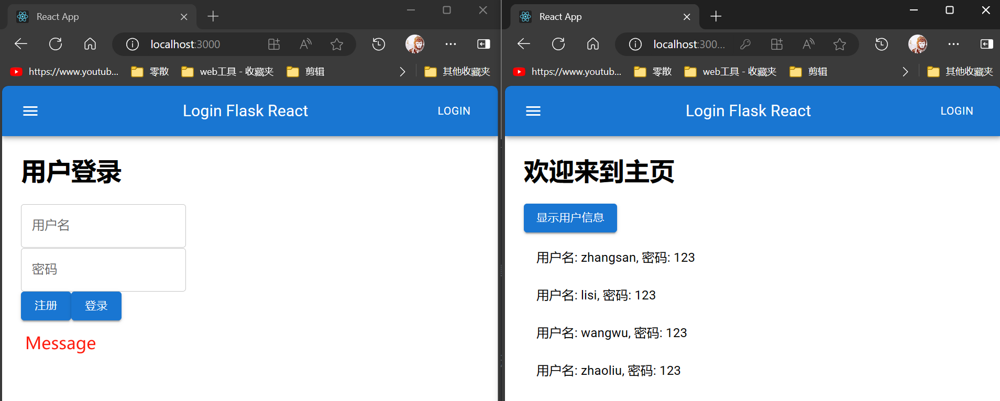

# Aircraft Battle

- 这是一个基于 Python 的游戏，使用 pygame 模块开发

- 项目文件存储于 Git 仓库

  ```
  # 老师操作步骤
  
  1.构建整体结构
  
  2.main中创建窗口对象
  
  3.初始化定义属性
  
  初始化Player
  初始化PlayerBullet
  初始化Enemy
  初始化EnemyrBullet
  
  4.创建对象
  
  创建background
  创建player
  创建enemy
  
  5.显示对象
  
  死循环while
  背景图片
  显示对象：调display
  未写敌机开火和Key_ctrol
  
  5.1定义display
  玩家-不含子弹
  敌机-不含子弹
  
  6.键盘控制
  编写键盘控制（只有退出）
  将Key_ctrol填入main()
  
  7.定义敌机move和fire
  敌机move
  添加至main()
  敌机子弹和fire
  ```

  ```python
  import time  # 控制刷新频率
  import pygame
  from pygame.locals import *  # 检测事件，如监控键盘按键
  import sys  # 用来退出游戏
  import random  # 控制子弹随机发射
  
  
  # 玩家类：
  # 属性：显示窗口、位置、图片、子弹列表、移动状态
  # 方法：显示、移动、开火
  class Player():
      def __init__(self, screen):  # 将main()中的screen传入
          self.screen = screen  # 将一个窗口对象作为了属性值，表示玩家对象显示的窗口
          # 等号左侧的screen为类的形参，右侧的为实参，右侧为main()中定义的screen
          self.x = 150  # 玩家初始位置
          self.y = 500
          self.img = pygame.image.load(r"feiji/hero1.png")  # 玩家图片
          self.bulletList = []  # 玩家子弹列表
          self.moveLeftState = 0  # 0不移动  1移动
          self.moveRightState = 0  # 0不移动  1移动
  
      def display(self):
          # 当前对象所在的screen属性下，调blit函数
          self.screen.blit(self.img, (self.x, self.y))  # 将玩家显示到窗口
          for b in self.bulletList:  # 创建子弹，并在子弹列表中遍历
              b.display()  # 将玩家子弹显示到窗口
              b.move()  # 将玩家子弹移动状态显示到窗口
              if b.y <= 0:
                  self.bulletList.remove(b)  # 在子弹列表中移除b
  
      def move(self):
          if self.moveLeftState == 1 and self.x > -30:
              self.x -= 5
          if self.moveRightState == 1 and self.x < 330:
              self.x += 5
  
      def fire(self):
          b = PlayerBullet(self.screen, self.x, self.y)
          self.bulletList.append(b)
  
  
  # 玩家子弹类：
  # 属性：显示窗口、位置、图片
  # 方法：显示、移动
  class PlayerBullet():
      def __init__(self, screen, x, y):  # xy为玩家位置，传入给玩家子弹
          self.screen = screen
          self.x = x + 40  # 玩家子弹初始位置，需要跟随玩家飞机
          self.y = y - 20
          self.img = pygame.image.load(r"feiji/bullet.png")
  
      def display(self):
          self.screen.blit(self.img, (self.x, self.y))
  
      def move(self):
          self.y -= 20
  
  
  # 敌机类
  # 属性：显示窗口、位置、图片、子弹列表、移动状态
  # 方法：显示、移动、开火
  class Enemy():
      def __init__(self, screen):
          self.screen = screen
          self.x = 0  # 敌机初始位置
          self.y = 0
          self.img = pygame.image.load(r"feiji/enemy0.png")
          self.bulletList = []
          self.moveState = 1
  
      def display(self):
          # 当前对象所在的screen属性下，调blit函数
          self.screen.blit(self.img, (self.x, self.y))
          for b in self.bulletList:
              b.display()
              b.move()
              if b.y >= 600:
                  self.bulletList.remove(b)
  
      def move(self):
          if self.moveState == 1:
              self.x += 5
          elif self.moveState == 0:
              self.x -= 5
          if self.x < -20:
              self.moveState = 1
          if self.x > 280:
              self.moveState = 0
  
      def fire(self):
          b = EnemyBullet(self.screen, self.x, self.y)
          self.bulletList.append(b)
  
  
  # 敌机子弹类
  # 属性：显示窗口、位置、图片
  # 方法：显示、移动
  class EnemyBullet():
      def __init__(self, screen, x, y):  # xy为敌机位置，传入给敌机子弹
          self.screen = screen
          self.x = x + 20  # 敌机子弹初始位置，需要跟随敌机飞机
          self.y = y + 30
          self.img = pygame.image.load(r"feiji/bullet2.png")
  
      def display(self):
          self.screen.blit(self.img, (self.x, self.y))
  
      def move(self):
          self.y += 20
  
  
  # 捕捉用户操作
  def key_control(player):  # 传入玩家对象，只控制玩家
      for event in pygame.event.get():
          if event.type == QUIT:
              print("正在退出....")
              sys.exit(0)
          elif event.type == KEYDOWN:  # 按下键盘
              if event.key == K_LEFT:
                  print("玩家向左！")
                  player.moveLeftState = 1
              if event.key == K_RIGHT:
                  print("玩家向右！")
                  player.moveRightState = 1
              if event.key == K_SPACE:
                  print("玩家开火！")
                  player.fire()
          elif event.type == KEYUP:  # 松开键盘
              if event.key == K_LEFT:
                  player.moveLeftState = 0
              if event.key == K_RIGHT:
                  player.moveRightState = 0
  
  
  # main方法
  class main():
      # 创建对象
      screen = pygame.display.set_mode((300, 600))  # 创建窗口
      background = pygame.image.load(r"feiji/background.png")  # 创建背景
      player = Player(screen)  # 创建玩家，并将screen属性传入玩家
      enemy = Enemy(screen)  # 创建敌军，并将screen属性传入敌军
  
      while 1 == 1:  # 在循环中显示所有对象并刷新，以实现对象的变化
          screen.blit(background, (0, 0))  # 将背景添加到屏幕，即显示背景
          player.display()  # 显示玩家，因为玩家还要显示其它操作。所以玩家的显示写在display中
          enemy.display()  # 显示敌机
          player.move()  # 玩家移动
          enemy.move()  # 敌机移动
  
          # 敌机随机开火
          r = random.randint(1, 10)
          if r == 1:
              enemy.fire()
  
          # 捕捉玩家操作
          key_control(player)
  
          pygame.display.update()  # 刷新窗口
          time.sleep(0.05)  # 休眠0.05秒，减少内存消耗
  
  
  # ---------------------------
  if __name__ == '__main__':
      main()
  ```

# ATM

## 项目概述

- 这是一个 Python 练习，旨在练习控制结构；
- 模拟3张银行卡，1001，1002，1003，分别设置密码和余额（使用列表嵌套字典的方式）；
- 提示用户输入银行卡和密码，遍历每张卡的信息验证是否成功；
- 如果用户输入正确
  - 提示让用户选择取款，存款还是退出，并提示余额多少；
- 输入错误
  - 重新输入卡号密码；
  - 错误 3 次即锁卡，程序结束；

## 具体步骤

- 脚本

  ```python
  card1 = {"姓名": "张三", "卡号": "111", "密码": "111", "余额": 10000}
  card2 = {"姓名": "李四", "卡号": "222", "密码": "222", "余额": 20000}
  card3 = {"姓名": "王五", "卡号": "333", "密码": "333", "余额": 30000}
  cardslist = [card1, card2, card3]
  count = 0  # 记录输入错误的次数
  msg = 0  # 记录登录状态 0失败 1成功！
  
  # 登录业务
  while 1 == 1:  # 输入账号和密码的无限循环
      cnum = input("请输入卡号：")
      cpwd = input("请输入密码：")
      for card in cardslist:
          if cnum == card["卡号"] and cpwd == card["密码"]:
              msg = 1  # 设定登录成功！
              count = 0  # 当验证成功时，错误次数清零
              print("恭喜你", card["姓名"], "登录成功！")
      if msg == 0:  # 设定登录失败！
          count += 1  # 失败次数加1
          if count < 3:
              print("验证失败！您已连续", count, "次输入错误，还有", 3 - count, "次机会，请重新输入：")
              continue
          elif count == 3:
              print("您已连续3次输入错误，银行卡已被锁定！")
              break
  
      # 银行业务
      while 2 == 2:  # 选择业务的无限循环
          choice = int(input("请输入要办理的业务（1.存款 2.取款 3.退出）："))
          if choice == 1:
              money1 = float(input("请输入存款金额："))
              for card in cardslist:
                  if card["卡号"] == cnum:
                      card["余额"] += money1
                      print("存款成功！", "存入", money1, "元！", "余额", card["余额"], "元！")
          elif choice == 2:
              money2 = float(input("请输入取款金额："))
              for card in cardslist:
                  if card["卡号"] == cnum:
                      card["余额"] -= money2
                      print("取款成功！", "取出", money2, "元！", "余额", card["余额"], "元！")
          elif choice == 3:
              print("已退出！")
              break
          else:
              print("没有此业务，请重新选择：")
              continue
  ```

# Argo CD Git

## 项目概述

- **项目来源**：[ YouTube 博主 TechWorld with Nana](https://www.youtube.com/watch?v=MeU5_k9ssrs)
- **文件来源**：[使用项目 Student Spring Boot React Full Stack 的 jerrybaijy/student-springboot-react-frontend:v1.0](https://hub.docker.com/repository/docker/jerrybaijy/student-springboot-react-frontend/general)
- **概述**：此项目旨在实现通过 Argo CD 以 Git 方式（区别于 Helm 方式）在集群中部署一个应用
- **存储**：代码存储在 Git 托管平台

## 具体步骤

1. 集群已运行，Argo CD 已安装。

2. UI 界面创建 Git 仓库 argocd-git，clone 至本地

3. argocd-git 根目录创建 dev 目录

4. dev 目录创建 deployment.yaml

   ```yaml
   apiVersion: apps/v1
   kind: Deployment
   metadata:
     name: argocd-git
   spec:
     selector:
       matchLabels:
         app: argocd-git
     replicas: 1
     template:
       metadata:
         labels:
           app: argocd-git
       spec:
         containers:
           - name: argocd-git
             image: jerrybaijy/student-springboot-react-frontend:v1.0
             ports:
               - containerPort: 8080
             env:
               - name: PORT
                 value: "8080"
             resources:
               requests:
                 memory: "1Gi"
                 cpu: "500m"
                 ephemeral-storage: "1Gi"
               limits:
                 memory: "1Gi"
                 cpu: "500m"
                 ephemeral-storage: "1Gi"
   ```

5. dev 目录创建 service.yaml

   ```yaml
   apiVersion: v1
   kind: Service
   metadata:
     name: argocd-git
   spec:
     selector:
       app: argocd-git
     type: LoadBalancer # 如本地访问服务类型为 ClusterIP
     ports:
       - port: 80
         targetPort: 8080
   ```

6. argocd-git 根目录创建 application.yaml

   ```yaml
   apiVersion: argoproj.io/v1alpha1
   kind: Application
   metadata:
     name: argocd-git
     namespace: argocd
   
   spec:
     project: default
     source:
       repoURL: https://gitlab.com/jerrybai/argocd-git.git
       targetRevision: HEAD
       path: dev
     
     destination:
       server: https://kubernetes.default.svc
       namespace: argocd-git
   
     syncPolicy:
       syncOptions:
         - CreateNamespace=true
       automated:
         selfHeal: true
         prune: true
   ```

7. 部署应用

   ```
   kubectl apply -f application.yaml
   ```

8. 查看 IP 即可访问应用（如有需要可进行端口转发）

   ```bash
   kubectl get svc -n argocd-git
   ```

## 未验证

- **以下内容为 Nana 视频提及的信息，还未验证**
- 等价产品：Flux CD

流程

- 开发人员将代码推送至 GitHub
- A 自动构建 image 并推送至 Dockerhub
- 最后更新 K8S yaml 文件

Nana 说最好将代码源文件和 yaml 文件分别存储，以利于更改代码或部署时，不必检查另一方，最终有单独的 CI 和 CD

yaml 文件、helm 图表、K8S 清单、自定义文件或其它模板文件，所有都会自动转换为纯 K8S yaml 文件


A 不仅监视存储库更改，还会监视集群中的更改，双方任意一个改变，另一方将自动更改

一个 A 可以同时配置多个集群

# Argo CD Helm

## 项目概述

- **项目来源**：学完 Helm Chart 以后，自己基于项目 Argo CD Git，以 Helm 方式在集群中部署一个应用
- **文件来源**：[使用项目 Student Spring Boot React Full Stack 的 jerrybaijy/student-springboot-react-frontend:v1.0](https://hub.docker.com/repository/docker/jerrybaijy/student-springboot-react-frontend/general)
- **概述**：此项目旨在实现通过 Argo CD 以 Helm 方式（区别于 Git 方式）在集群中部署一个应用
- **存储**：代码存储在 Git 托管平台

## 具体步骤

1. 集群已运行，Argo CD 已安装。

2. UI 界面创建 Git 仓库 argocd-git-helm，clone 至本地

3. 创建 argocd-helm-chart.0.1.0.tgz。

   - deployment.yaml

     ```yaml
     apiVersion: apps/v1
     kind: Deployment
     metadata:
       name: {{ include "argocd-helm-chart.fullname" . }}
       labels:
         {{- include "argocd-helm-chart.labels" . | nindent 4 }}
     spec:
       {{- if not .Values.autoscaling.enabled }}
       replicas: {{ .Values.replicaCount }}
       {{- end }}
       selector:
         matchLabels:
           {{- include "argocd-helm-chart.selectorLabels" . | nindent 6 }}
       template:
         metadata:
           {{- with .Values.podAnnotations }}
           annotations:
             {{- toYaml . | nindent 8 }}
           {{- end }}
           labels:
             {{- include "argocd-helm-chart.labels" . | nindent 8 }}
             {{- with .Values.podLabels }}
             {{- toYaml . | nindent 8 }}
             {{- end }}
         spec:
           {{- with .Values.imagePullSecrets }}
           imagePullSecrets:
             {{- toYaml . | nindent 8 }}
           {{- end }}
           serviceAccountName: {{ include "argocd-helm-chart.serviceAccountName" . }}
           securityContext:
             {{- toYaml .Values.podSecurityContext | nindent 8 }}
           containers:
             - name: {{ .Chart.Name }}
               securityContext:
                 {{- toYaml .Values.securityContext | nindent 12 }}
               image: "{{ .Values.image.repository }}:{{ .Values.image.tag | default .Chart.AppVersion }}"
               imagePullPolicy: {{ .Values.image.pullPolicy }}
               ports:
                 - name: http
                   containerPort: {{ .Values.service.targetPort }}
                   protocol: TCP
               livenessProbe:
                 {{- toYaml .Values.livenessProbe | nindent 12 }}
               readinessProbe:
                 {{- toYaml .Values.readinessProbe | nindent 12 }}
               resources:
                 {{- toYaml .Values.resources | nindent 12 }}
               {{- with .Values.volumeMounts }}
               volumeMounts:
                 {{- toYaml . | nindent 12 }}
               {{- end }}
           {{- with .Values.volumes }}
           volumes:
             {{- toYaml . | nindent 8 }}
           {{- end }}
           {{- with .Values.nodeSelector }}
           nodeSelector:
             {{- toYaml . | nindent 8 }}
           {{- end }}
           {{- with .Values.affinity }}
           affinity:
             {{- toYaml . | nindent 8 }}
           {{- end }}
           {{- with .Values.tolerations }}
           tolerations:
             {{- toYaml . | nindent 8 }}
           {{- end }}
     ```

   - service.yaml

     ```yaml
     apiVersion: v1
     kind: Service
     metadata:
       name: {{ include "argocd-helm-chart.fullname" . }}
       labels:
         {{- include "argocd-helm-chart.labels" . | nindent 4 }}
     spec:
       type: {{ .Values.service.type }}
       ports:
         - port: {{ .Values.service.port }}
           targetPort: {{ .Values.service.targetPort }}
           protocol: TCP
           name: http
       selector:
         {{- include "argocd-helm-chart.selectorLabels" . | nindent 4 }}
     ```

   - values.yaml

     ```yaml
     replicaCount: 1
     image:
       repository: jerrybaijy/student-springboot-react-frontend
       pullPolicy: IfNotPresent
       tag: "v1.0"
     imagePullSecrets: []
     nameOverride: ""
     fullnameOverride: ""
     serviceAccount:
       create: true
       automount: true
       annotations: {}
       name: ""
     podAnnotations: {}
     podLabels: {}
     podSecurityContext: {}
     securityContext: {}
     
     service:
       type: LoadBalancer
       port: 80
       targetPort: 8080
     
     ingress:
       enabled: false
       className: ""
       annotations: {}
       hosts:
         - host: chart-example.local
           paths:
             - path: /
               pathType: ImplementationSpecific
       tls: []
     resources: {}
     livenessProbe:
       httpGet:
         path: /
         port: http
     readinessProbe:
       httpGet:
         path: /
         port: http
     autoscaling:
       enabled: false
       minReplicas: 1
       maxReplicas: 100
       targetCPUUtilizationPercentage: 80
     volumes: []
     volumeMounts: []
     nodeSelector: {}
     tolerations: []
     affinity: {}
     ```

4. 建立远程 Helm 仓库

5. 创建 Argo CD 的 application.yaml

   ```yaml
   apiVersion: argoproj.io/v1alpha1
   kind: Application
   metadata:
     name: argocd-helm
     namespace: argocd
   
   spec:
     project: default
     source:
       repoURL: https://jerrybaijy.github.io/argocd-helm/
       targetRevision: 0.1.0
       chart: argocd-helm-chart
       helm:
         valueFiles:
           - values.yaml
     destination:
       server: https://kubernetes.default.svc
       namespace: argocd-helm
   
     syncPolicy:
       syncOptions:
         - CreateNamespace=true
       automated:
         selfHeal: true
         prune: true
   ```

6. 部署应用

   ```bash
   kubectl apply -f application.yaml
   ```

7. 查看 IP 即可访问应用（如有需要可进行端口转发）

   ```bash
   kubectl get svc -n argocd-helm
   ```

## 方法二

1. This method deploy a App manually through a command, including the options instead of YAML file `application.yaml`

2. This method is unverified

3. Creat a new GitHub  repository and clone it to local

4. Create a Helm chart in the local repo and config the YAML file

5. Use the Argo CLI to deploy your chart into your Kubernetes cluster

   ```bash
   argocd app create $DEPLOYMENT_NAME \
   	--repo https://github.com/$USERNAME/$REPO.git \
   	--path $PATH \
   	--dest-server https://kubernetes.default.svc \
   	--dest-namespace $NAMESPACE \
   	--sync-option CreateNamespace=true \
   	--parameter namespace=$NAMESPACE \
   ```

6. Config others ...

# Commodity Manage (Login)

## 项目概述

- 这是一个带有 Login 功能的商品管理系统，一个 Python 脚本。

- 功能

  ```
  a.	使用列表嵌套字典的方式保存用户数据（包含用户名，密码，姓名）；
  b.	使用列表嵌套字典的方式保存商品数据（包含编号，名称，价格，折扣）；
  c.	编写用户登录的函数，返回登录结果；
  d.	循环提示菜单，业务完毕时返回主菜单，退出时回到登陆页面；
  e.	将功能菜单中的业务功能各自编写到函数中；
  f.	用户选择不同业务编号时，调用已经写好的各种函数。
  ```

## 创建过程

- main.py

  ```python
  # 数据准备
  user1 = {"用户名": "aaa", "密码": "123", "姓名": "张三"}
  user2 = {"用户名": "bbb", "密码": "123", "姓名": "李四"}
  user3 = {"用户名": "ccc", "密码": "123", "姓名": "王五"}
  users_list = [user1, user2, user3]  # 用户列表
  
  p1 = {"编号": "1001", "名称": "苹果", "价格": 5, "折扣": 1}
  p2 = {"编号": "1002", "名称": "香蕉", "价格": 3, "折扣": 1}
  p3 = {"编号": "1003", "名称": "牛奶", "价格": 4, "折扣": 1}
  p4 = {"编号": "1004", "名称": "白菜", "价格": 1, "折扣": 1}
  p5 = {"编号": "1008", "名称": "西瓜", "价格": 3, "折扣": 1}
  products_list = [p1, p2, p3, p4, p5]  # 商品列表
  
  
  # 登录
  def login():
      msg = "失败"
      while 1 == 1:
          uname = input("请输入用户名：")
          upwd = input("请输入密码：")
          for user in users_list:
              if uname == user["用户名"] and upwd == user["密码"]:
                  print("---------验证成功！欢迎你，", user["姓名"], "！")
                  msg = "成功"
                  break
          if msg == "失败":
              print("用户名密码错误，请重新输入！")
              continue
          else:
              break
      return msg  # 返回登录结果
  
  
  # 1.显示商品列表
  def show_procucts():
      print("-编号----名称----价格----折扣-")
      for product in products_list:
          print(product["编号"] + "-----" + product["名称"] + "-----" + str(product["价格"]) + "-------" + str(
              product["折扣"]))
      print("-----------------------------")
  
  
  # 2.增加商品信息
  def add_procuct():
      # 生成新编号
      lista = []  # 存放所有商品的编号
      for product in products_list:
          lista.append(int(product["编号"]))
      new_num = str(max(lista) + 1)
      name = input("请输入商品名称：")
      price = float(input("请输入商品单价："))
      new_product = {"编号": new_num, "名称": name, "价格": price, "折扣": 1}
      products_list.append(new_product)
      print("-------商品", name, "添加成功！")
      show_procucts()
  
  
  # 3.删除商品（通过编号删除）
  def del_product():
      while 1 == 1:
          msg = 0  # 记录商品是否存在
          num = input("请输入要删除的商品编号：")
          for product in products_list:
              if num == product["编号"]:
                  print("---正在删除", product["名称"], "商品...........")
                  products_list.remove(product)  # 删除商品
                  print("----删除成功！")
                  msg = 1
                  break
          if msg == 0:
              print("商品编号不存在！")
              choice = int(input("取消请按1，重新输入请按2："))
              if choice == 1:
                  break
              else:
                  continue
          else:
              show_procucts()
              break
  
  
  # 4.设置商品折扣
  def set_discout():
      while 1 == 1:
          msg = 0  # 记录商品是否存在
          num = input("请输入要设置折扣的商品编号：")
          for product in products_list:
              if num == product["编号"]:
                  new_discout = float(input("请输入新的折扣（0.1-1）："))
                  product["折扣"] = new_discout  # 设置折扣
                  print("---商品", product["名称"], "折扣已设置成功，", new_discout * 10, "折！")
                  msg = 1
                  break
          if msg == 0:
              print("商品不存在！")
              choice = int(input("取消请按1，重新输入请按2："))
              if choice == 1:
                  break
              else:
                  continue
          else:
              show_procucts()
              break
  
  
  # 5.修改商品价格信息
  def set_rice():
      while 1 == 1:
          msg = 0  # 记录商品是否存在
          num = input("请输入要调整价格的商品编号：")
          for product in products_list:
              if num == product["编号"]:
                  new_rice = float(input("请输入新的价格："))
                  product["价格"] = new_rice  # 设置价格
                  print("---商品", product["名称"], "价格已设置成功，", new_rice, "元！")
                  msg = 1
                  break
          if msg == 0:
              print("商品不存在！")
              choice = int(input("取消请按1，重新输入请按2："))
              if choice == 1:
                  break
              else:
                  continue
          else:
              show_procucts()
              break
  
  
  # 6.根据价格排序显示商品列表
  def sort():
      choice = int(input("请选择升序或者降序（1.升序  2.降序）："))
      pList = []  # 存放所有价格信息
      for product in products_list:
          pList.append(product["价格"])
      pList = list(set(pList))  # 去掉重复价格
  
      print("-编号----名称----价格----折扣-")
      if choice == 1:
          newList = sorted(pList)
          for price in newList:
              for product in products_list:
                  if price == product["价格"]:
                      print(
                          product["编号"] + "-----" + product["名称"] + "-----" + str(product["价格"]) + "-------" + str(
                              product["折扣"]))
      else:
          newList = sorted(pList, reverse=True)
          for price in newList:
              for product in products_list:
                  if price == product["价格"]:
                      print(
                          product["编号"] + "-----" + product["名称"] + "-----" + str(product["价格"]) + "-------" + str(
                              product["折扣"]))
  
  
  # 模块化
  # -------------------------------------
  # 显示主菜单，调用已经写好的业务函数
  
  while 0 == 0:
      result = login()
      if result == "成功":
          while 2 == 2:
              print("----------------主菜单---------------")
              print("---1.显示商品列表")
              print("---2.增加商品信息")
              print("---3.删除商品")
              print("---4.设置商品折扣")
              print("---5.修改商品信息")
              print("---6.按照价格排序显示")
              print("---7.退出")
  
              choice = int(input("请选择业务编号（输入1-6）："))
              if choice == 1:
                  show_procucts()
              elif choice == 2:
                  add_procuct()
              elif choice == 3:
                  del_product()
              elif choice == 4:
                  set_discout()
              elif choice == 5:
                  set_rice()
              elif choice == 6:
                  sort()
              elif choice == 7:
                  print("-------------正在退出...")
                  break
              else:
                  print("没有此功能，请重新选择！")
                  continue
  ```

# Commodity Manage (MySQL)

## 项目概述

- **来源**：[我要自学网燎原《Python编程入门2021新版教程》第十六章：综合训练-基于数据库的超市管理系统](https://www.51zxw.net/Show.aspx?cid=929&id=110570)
- **概述**：这是一个商品管理系统的 Python 脚本，旨在练习函数的调用和 MySQL 的使用

## 创建过程

### 概述

- **orm.py**：MySQL 部分
- **market.py**：商品业务部分
- **main.py**：总页面

### Orm

- MySQL 已创建“market”数据库

- orm.py

  ```python
  # 数据库操作
  import pymysql
  
  host = "localhost"
  port = 3306
  user = "root"
  password = "123456"
  dbname = "market"  # 数据库名称
  charset = "utf8"
  
  
  # 连接数据库
  def get_connection():
      db = pymysql.Connect(host=host, port=port, user=user, passwd=password, db=dbname, charset=charset)
      return db
  
  
  # 查询数据
  def get_data(sql):
      db = get_connection()  # 连接数据库
      cursor = db.cursor()
      # 在 market 中写各自的 sql 语句
      data = None  # 保存返回数据
      try:
          cursor.execute(sql)
          data = cursor.fetchall()
      except Exception as e:
          print("异常：", e)
      finally:
          cursor.close()
          db.close()
      return data
  
  
  # 更新数据
  def write_data(sql):
      db = get_connection()  # 连接数据库
      cursor = db.cursor()
      r = 0
      try:
          r = cursor.execute(sql)
          db.commit()
          print("---------数据已更新！", r)
      except Exception as e:
          print("异常：", e)
      finally:
          cursor.close()
          db.close()
      return r  # 返回受影响的行数
  ```

### Market

- market.py

  ```python
  # 编写业务方法
  import orm
  import random
  
  
  # 查看商品列表
  def get_all_products():
      sql = "SELECT * FROM products;"
      data = orm.get_data(sql)
      print("序号    编号    名称    单价   折扣")
      for product in data:
          for x in product:
              print(x, end="    ")
          print()  # 换行
  
  
  # 根据编号查询商品
  def get_product():
      num = input("请输入商品编号：")
      sql = "SELECT * FROM products WHERE num=" + num + ";"
      data = orm.get_data(sql)
      if data != None:
          print("-----商品名称：", data[0][2], "单价：", data[0][3], "折扣：", data[0][4])
          return data[0][2], data[0][3], data[0][4]
      else:
          print("-----商品不存在！")
          return None
  
  
  # 添加商品
  def add_product():
      name = input("请输入商品名称：")
      num = str(random.randint(1000, 9999))
      price = input("请输入商品价格：")
      sql = "INSERT INTO products(num,name,price,discount) VALUES(" + num + ",'" + name + "'," + price + ",1);"
      # 由于 id 自动生成，所以 products 要指定添加内容
      r = orm.write_data(sql)  # 方便查看执行结果
      print(r)
  
  
  # 根据编号删除商品
  def del_product():
      num = input("请输入商品编号：")
      sql = "DELETE FROM products WHERE num=" + num + ";"
      r = orm.write_data(sql)
      if r == 0:
          print("删除失败！")
      else:
          print("商品", num, "已删除！")
  
  
  # 商品打折（修改折扣）
  def set_discount():
      num = input("请输入要修改的商品编号：")
      discount = float(input("请输入设置的折扣："))
      if 0.1 <= discount <= 1:
          sql = "UPDATE products SET discount=" + str(discount) + " WHERE num=" + num + ";"
          r = orm.write_data(sql)
          if r == 0:
              print("设置失败！")
          else:
              print("商品", num, "折扣设置成功！")
      else:
          print("折扣输入错误！")
  
  
  # 查看所有订单；
  def get_all_orders():
      sql = "SELECT * FROM orders;"
      data = orm.get_data(sql)
      print("序号    编号    数量    金额")
      for order in data:
          for x in order:
              print(x, end="    ")
          print()
  
  
  # 删除订单；（通过订单号删除）
  def del_order():
      num = input("请输入订单编号：")
      sql = "DELETE FROM orders WHERE num=" + num + ";"
      r = orm.write_data(sql)
      if r == 0:
          print("删除失败！")
      else:
          print("订单", num, "已删除！")
  
  
  # 订单统计（总销量，销售额）；
  def accord_order():
      sql = "SELECT * FROM orders;"
      data = orm.get_data(sql)
      total_count = 0
      total_amount = 0
      for order in data:
          total_count += order[2]
          total_amount += order[3]
      print("总销量", total_count, "件！，销售额", total_amount, "元！")
  
  
  # 商品结算
  def settle():
      order_count = 0
      order_amount = 0
      msg = 0  # 保存订单是否有效，以决定是否生成新订单
      while 1 == 1:
          data = get_product()
          num = int(input("请输入商品数量："))
          if data != None:
              msg = 1
              price = data[1]
              discount = data[2]
              amount = price * num * discount
              order_count += num
              order_amount += amount
              print("当前添加", num, "件！金额", amount, "元！")
          r = input("继续添加请输入1，结算请输入2：")
          if r == "1":
              continue
          else:
              print("--------------------------------------")
              break
      print("****您购买的总数量", order_count, "件！总金额", order_amount, "元！")
  
      # 添加订单
      if msg == 1:
          oid = str(random.randint(1000, 9999))  # 随机引入编号
          sql = "INSERT INTO orders(num,count,amount) VALUES(" + oid + "," + str(order_count) + "," + str(
              order_amount) + "); "  # 由于 id 自动生成，所以 order 要指定添加内容
          orm.write_data(sql)
          print("--------添加成功！")
  ```

### Main

- main.py

  ```python
  # 调用
  import market
  
  
  def main():
      print("***********************超市管理系统*************************")
      print("***********************1.查看商品列表")
      print("***********************2.根据编号查询商品")
      print("***********************3.添加商品")
      print("***********************4.根据编号删除商品")
      print("***********************5.商品打折")
      print("***********************6.查看所有订单")
      print("***********************7.删除订单")
      print("***********************8.订单统计")
      print("***********************9.商品结算")
      print("***********************10.退出")
      print("***********************************************************")
      c = int(input("请选择："))
      if c == 1:
          market.get_all_products()
      elif c == 2:
          market.get_product()
      elif c == 3:
          market.add_product()
      elif c == 4:
          market.del_product()
      elif c == 5:
          market.set_discount()
      elif c == 6:
          market.get_all_orders()
      elif c == 7:
          market.del_order()
      elif c == 8:
          market.accord_order()
      elif c == 9:
          market.settle()
      else:
          print("***********************************************************")
  
  
  if __name__ == '__main__':
      main()
  ```

# Dockerfile Build Image

## 项目概述

- **来源**：[GoogleCloudPlatform/kubernetes-engine-samples/quickstarts/hello-app/](https://github.com/GoogleCloudPlatform/kubernetes-engine-samples/tree/da3e2c22c727e3b6d72d4eea04c19335db0727cb/quickstarts/hello-app)
- **概述**：这是一个简单的 Go 语言 Web Server 应用项目，旨在实现在本地通过 Dockerfile 创建镜像。
- **存储**
  - 代码存储在 Git 托管平台
  - 镜像存储在 DockerHub

## 创建过程

1. 创建 web-server.go 文件

   ```go
   package main
   
   import (
   	"fmt"
   	"log"
   	"net/http"
   	"os"
   )
   
   func main() {
   	mux := http.NewServeMux()
   	mux.HandleFunc("/", hello)
   
   	port := os.Getenv("PORT")
   	if port == "" {
   		port = "8080"
   	}
   
   	log.Printf("Server listening on port %s", port)
   	log.Fatal(http.ListenAndServe(":"+port, mux))
   }
   
   func hello(w http.ResponseWriter, r *http.Request) {
   	log.Printf("Serving request: %s", r.URL.Path)
   	host, _ := os.Hostname()
   	fmt.Fprintf(w, "你好, 世界!\n")
   	fmt.Fprintf(w, "Version: 1.0.0\n")
   	fmt.Fprintf(w, "Hostname: %s\n", host)
   }
   ```

2. 创建 Dockerfile 文件

   ```dockerfile
   FROM golang:1.21.0 as builder
   WORKDIR /app
   RUN go mod init hello-app
   COPY *.go ./
   RUN CGO_ENABLED=0 GOOS=linux go build -o /hello-app
   
   FROM gcr.io/distroless/base-debian11
   WORKDIR /
   COPY --from=builder /hello-app /hello-app
   ENV PORT 8080
   USER nonroot:nonroot
   CMD ["/hello-app"]
   ```

3. 创建镜像

   ```bash
   docker build -t dockerfile-build-image .
   ```

4. 运行容器

   ```bash
   docker run -d -p 80:8080 --name test dockerfile-build-image:latest
   ```

5. 本地访问应用：http://127.0.0.1:80

# GitLab CI Image

## 项目概述

- **来源**：[GoogleCloudPlatform/kubernetes-engine-samples/quickstarts/hello-app/](https://github.com/GoogleCloudPlatform/kubernetes-engine-samples/tree/da3e2c22c727e3b6d72d4eea04c19335db0727cb/quickstarts/hello-app)
- **文件**：web-server.go 和 Dockerfile 从 Dockerfile Build Image 项目复制
- **概述**：这是一个简单的 Go 语言 Web Server 应用项目，旨在实现通过 GitLab CI 创建镜像。
- **存储**
  - 代码存储在 Git 托管平台
  - 镜像存储在 DockerHub

## 创建过程

1. 创建 web-server.go 文件

   ```go
   package main
   
   import (
   	"fmt"
   	"log"
   	"net/http"
   	"os"
   )
   
   func main() {
   	mux := http.NewServeMux()
   	mux.HandleFunc("/", hello)
   
   	port := os.Getenv("PORT")
   	if port == "" {
   		port = "8080"
   	}
   
   	log.Printf("Server listening on port %s", port)
   	log.Fatal(http.ListenAndServe(":"+port, mux))
   }
   
   func hello(w http.ResponseWriter, r *http.Request) {
   	log.Printf("Serving request: %s", r.URL.Path)
   	host, _ := os.Hostname()
   	fmt.Fprintf(w, "你好, 世界!\n")
   	fmt.Fprintf(w, "Version: 1.0.0\n")
   	fmt.Fprintf(w, "Hostname: %s\n", host)
   }
   ```

2. 创建 Dockerfile 文件

   ```dockerfile
   FROM golang:1.21.0 as builder
   WORKDIR /app
   RUN go mod init hello-app
   COPY *.go ./
   RUN CGO_ENABLED=0 GOOS=linux go build -o /hello-app
   
   FROM gcr.io/distroless/base-debian11
   WORKDIR /
   COPY --from=builder /hello-app /hello-app
   ENV PORT 8080
   USER nonroot:nonroot
   CMD ["/hello-app"]
   ```

3. 创建 .gitlab-ci.yml 文件

   ```yaml
   variables:
     IMAGE_NAME: jerrybaijy/gitlab-ci-image
     IMAGE_TAG: v1.0
   
   stages: 
     - build
   
   build_image:
     stage: build
     image: docker:20.10.20
     services:
       - docker:20.10.20-dind
     variables:
       DOCKER_TLS_CERTDIR: "/certs"
     before_script:
       - docker login -u $DOCKER_USER -p $DOCKER_PASSWORD
     script:
       - docker build -t $IMAGE_NAME:$IMAGE_TAG .
       - docker push $IMAGE_NAME:$IMAGE_TAG
   ```

4. 推送至 GitLab

   - 项目文件推送至远程仓库
   - GitLab 在 Pipeline 中自动生成 Image 并推送至 DockerHub

# Library Manage

## 项目概述

- **来源**：[我要自学网燎原《Python编程入门2021新版教程》第十一章：综合训练-迷你图书馆](https://www.51zxw.net/Show.aspx?cid=929&id=110528)
- **概述**：这是一个迷你图书馆借阅系统的 Python 脚本，旨在练习函数的调用
- **说明**
  - 自己添加了循环 Login 功能
  - 创建数据文件时，注释掉主函数部分
  - 运行主函数时，注释掉创建数据文件部分

## 创建过程

- library.py

  ```python
  import json
  import datetime
  import time
  
  
  # 创建数据库（先注释掉主函数创建数据库，然后注释掉此部分）
  users_data='[{"用户名": "admin", "密码": "123", "姓名": "张三"},{"用户名": "aaa", "密码": "123", "姓名": "李四"}]'
  with open(r"users.txt","w") as f:
  		f.write(users_data)
  
  books_data='[{"编号":1001, "书名": "<红楼梦>", "作者": "曹雪芹", "借出状态": "可借"},\
  {"编号":1002, "书名": "<java教程>","作者": "齐一天", "借出状态": "可借"},\
  {"编号":1003, "书名": "<圣经>","作者": "耶稣", "借出状态": "已借出"},\
  {"编号":1004, "书名": "<李白诗集>","作者": "李白", "借出状态": "可借"}\
  ]'
  with open(r"books.txt","w") as f:
  		f.write(books_data)
  
  # 读数据
  def read_users():
      with open(r"users.txt", "r") as f:
          json_data = f.read()
      data_list = json.loads(json_data)
      return data_list
  
  
  def read_books():
      with open(r"books.txt", "r") as f:
          json_data = f.read()
      data_list = json.loads(json_data)
      return data_list
  
  
  # 写数据
  def write_users(data_list):
      json_data = json.dumps(data_list, ensure_ascii=False)
      with open(r"users.txt", "w") as f:
          f.write(json_data)
          print("------数据写入成功！")
  
  
  def write_books(data_list):
      json_data = json.dumps(data_list, ensure_ascii=False)
      with open(r"books.txt", "w") as f:
          f.write(json_data)
          print("------数据写入成功！")
  
  
  # 用户登录
  def login():
      while 1 == 1:
          msg = "失败"
          user_list = read_users()
          name = input("请输入用户名：")
          pwd = input("请输入密码：")
          for user in user_list:
              if name == user["用户名"] and pwd == user["密码"]:
                  msg = "成功"
                  print("------登录成功！")
                  break
          if msg == "失败":
              print("登录失败，请重新输入！")
              continue
          else:
              break
      return msg
  
  
  # 1.显示图书列表
  def show_books():
      data_list = read_books()
      print("----------图书列表----------")
      for book in data_list:
          print(book["编号"], "   ", book["书名"], "   ", book["作者"], "   ", book["借出状态"])
      print("---------------------------")
  
  
  # 2.图书上架
  def add_book():
      data_list = read_books()
      num_list = []
      for book in data_list:
          num_list.append(book["编号"])
      new_num = max(num_list) + 1
      book_name = input("请输入书名：")
      book_name = "<" + book_name + ">"
      author = input("请输入作者：")
      state = "可借"
      new_book = {"编号": new_num, "书名": book_name, "作者": author, "借出状态": state}
      data_list.append(new_book)
      write_books(data_list)
  
  
  # 3.图书下架
  def del_book():
      data_list = read_books()
      show_books()
      data1 = input("请输入图书名：")
      data2 = int(input("请输入图书编号："))
      for book in data_list:
          if data1 == book["书名"] or data2 == book["编号"]:
              data_list.remove(book)
              print("-----图书", book["书名"], "已下架！")
              write_books(data_list)
              show_books()
  
  
  # 4.借书
  def lend_book():
      show_books()
      msg = 0
      data_list = read_books()
      num = int(input("请输入要借的图书编号："))
      for book in data_list:
          if num == book["编号"]:
              msg = 1
              if book["借出状态"] == "可借":
                  print("----您已成功借出图书：", book["书名"], "！")
                  book["借出状态"] = "已借出"
                  write_books(data_list)
              else:
                  print("----", book["书名"], "已经借出！下次再来吧！")
      if msg == 0:
          print("-----没有此图书！")
      show_books()
  
  
  # 5.还书
  def return_book():
      show_books()
      data_list = read_books()
      num = int(input("请输入要归还的图书编号："))
      msg = 0
      for book in data_list:
          if num == book["编号"]:
              msg = 1
              if book["借出状态"] == "已借出":
                  print("----成功归还图书", book["书名"], "!")
                  book["借出状态"] = "可借"
                  write_books(data_list)
              else:
                  print("---该图书不允许归还！")
      if msg == 0:
          print("-----没有此图书！")
      show_books()
  
  
  # 主函数
  def main():
      msg = login()
      if msg == "成功":
          while 1 == 1:
              print("***********************图书管理系统1.0*************************")
              print("1.显示所有图书；\n2.图书上架；\n3.图书下架；\n4.借书；\n5.还书。")
              print("*************************************************************")
              c = int(input("请输入业务编号（1-5）："))
              if c == 1:
                  show_books()
              elif c == 2:
                  add_book()
              elif c == 3:
                  del_book()
              elif c == 4:
                  lend_book()
              elif c == 5:
                  return_book()
              else:
                  print("没有此业务！")
  
  
  # 运行
  if __name__ == '__main__':
      main()
  ```

# Login And Sign Up

## 项目概述

- **概述**：这是一个自己整合的 Login And Sign Up 笔记。
- 使用了四种方法充当数据库：List，TXT，JSON，MySQL
- 循环逻辑的实现以列表数据库为准，其余只是为了展示不同数据库使用方法

## List 数据库

- 此例为了展示 Login And Sign Up 的循环逻辑，所有逻辑以新版为准
  - 注册
  - 循环登录
  - 选择菜单
- 为了方便，此例使用 List 模拟数据库
- 此例有两个版本，以新版为准，旧版的意义在于
  - 留存 msg 的用法
  - 对 `continue` `breake` `return` 更深的理解


### 新版

- login.py （新版）

  ```python
  users_list = [{"username": "zhangsan", "password": "123"}]
  
  
  # 用户信息
  def user_info():
      print("用户信息：")
      for user in users_list:
          print(f"用户名: {user['username']}, 密码: {user['password']}")
  
  
  # 注册
  def register():
      while True:  # 循环注册
          username = input("请输入注册用户名/返回请按'Q'：")
          if username.upper() == "Q":
              return  # 输入 Q 退出注册
          password = input("请输入注册密码：")
          user = {"username": username, "password": password}
  
          # 检查用户名是否已存在
          # 此处为了使下面的 continue 对 while 生效，减少一层 for 循环
          exists = any(user["username"] == user_exist["username"] for user_exist in users_list)
          if exists:
              print("用户名已存在，请重新输入！")
              continue  # 如果用户名存在，本次循环终止，重新执行 while 循环
  
          # 用户名不存在，将新用户添加到列表中
          users_list.append(user)
          print("恭喜你，注册成功！")
  
  # 登录
  def login():  # 循环登录
      while True:
          username = input("请输入登录用户名/退出请按'Q'：")
          if username.upper() == "Q":
              return None  # 返回 None 传回主函数，使主函数终止，代替了 msg
          password = input("请输入登录密码：")
          for user_exist in users_list:
              if username == user_exist["username"] and password == user_exist["password"]:
                  print("恭喜你，登录成功！")
                  return user_exist  # 不返回 None 传回主函数，使登录成功，代替了 msg
          print("用户名或密码错误，请重新输入！")
  
  
  def main():
      while True:
          if login():  # 登录并判断登录结果，以 login() 的返回值是不是 None 作为判定标准
              while True:
                  print("-----业务选择------")
                  print("1.注册")
                  print("2.登录")
                  print("3.查看用户信息")
                  print("4.退出")
                  choice = input("请选择业务编号：")
  
                  # 将要执行函数的函数名放入字典
                  mapping = {
                      "1": register,
                      "2": login,
                      "3": user_info
                  }
  
                  func = mapping.get(choice)  # func 即为 mapping 里的值，如果不能获取到键，func 为 None
                  if func:  # 即 func 不为 None，能获取键
                      func()  # func 为 mapping 里对应 choice 的值
                  elif choice == "4":
                      return  # 函数终止
                  else:
                      print("输入错误，请重新选择！")
          else:
              return  # 如果输入的是 Q，login() 的返回值传回的是 None，则主函数终止
  
  
  if __name__ == '__main__':
      main()
  ```

### 旧版 msg

- login.py （旧版 msg）

  ```python
  users_list = [{"username": "zhangsan", "password": "123"}]
  
  
  def register():
      while True:
          username = input("请输入注册用户名/返回请按'Q'：")
          if username.upper() == "Q":
              return
          password = input("请输入注册密码：")
          user = {"username": username, "password": password}
  
          exists = any(user["username"] == user_exist["username"] for user_exist in users_list)
          if exists:
              print("用户名已存在，请重新输入！")
              continue
  
          users_list.append(user)
          print("恭喜你，注册成功！")
  
  
  def login():
      msg = 0  # msg 作为登录是否成功的标志，0失败，1成功
      while True:
          username = input("请输入登录用户名/退出请按'Q'：")
          if username.upper() == "Q":
              return  # 默认返回 None，传回主函数，主函数终止
          password = input("请输入登录密码：")
          for user_exist in users_list:
              if username == user_exist["username"] and password == user_exist["password"]:
                  print("恭喜你，登录成功！")
                  msg = 1  # 登录成功
                  return msg  # 返回 1，传回主函数，登录成功
          print("用户名密码错误，请重新输入！")
          # 此步骤是以下三行的简写
          # if msg == 0:
          #     print("用户名密码错误，请重新输入！")
          #     continue
  
  
  def user_info():
      print(users_list)
  
  
  def main():
      while True:
          if login() == 1:  # 如果 login() 传回 1 代表登录成功
              while True:
                  print("-----业务选择------")
                  print("1.注册")
                  print("2.登录")
                  print("3.查看用户信息")
                  print("4.退出")
                  choice = input("请选择业务编号：")
  
                  mapping = {
                      "1": register,
                      "2": login,
                      "3": user_info
                  }
                  func = mapping.get(choice)
                  if func:
                      func()
                  elif choice == "4":
                      return  # 函数终止
                  else:
                      print("输入错误，请重新选择！")
                      # continue  # 本次循环后面无代码，此处可省略
          else:
              # 如果输入的是 Q，login() 的返回值传回的是 None，则 while 循环终止，主函数终止
              # 此处最好使用 return，直接终止主函数，因为目的就是要直接终止主函数
              break
  
  
  if __name__ == '__main__':
      main()
  ```

## TXT 数据库（加密）

- 此例为了展示使用 TXT 模拟数据库，并且密码加密，用 Python 实现 Login And Sign Up 功能

- 逻辑以 List 数据库示例为准

- users.txt

  ```
  # 初始密码：123
  zhangsan|a75362a2fb4b34836614959f7294d01b
  ```

- login.py

  ```python
  import hashlib
  
  USERS_PATH = r"users.txt"  # 环境变量
  
  
  def md5(data_string):
      obj = hashlib.md5("88888".encode('utf-8'))  # 加盐
      obj.update(data_string.encode('utf-8'))  # 括号里必须是字节
      return obj.hexdigest()  # 返回密文
  
  
  def register():
      user = input("请输入注册用户名：")
      if user.upper() == "Q":
          return
      pwd = input("请输入注册密码：")
      pwd_md5 = md5(pwd)
  
      with open(USERS_PATH, 'a', encoding='utf-8') as f:
          line = "{}|{}\n".format(user, pwd_md5)
          f.write(line)
      print("恭喜你，注册成功！")
  
  
  def login():
      msg = 0
      while True:
          user = input("请输入登录用户名/退出请按'Q'：")
          if user.upper() == "Q":
              msg = 0
              return msg
          pwd = input("请输入登录密码：")
          pwd_md5 = md5(pwd)
  
          with open(USERS_PATH, 'r', encoding='utf-8') as f:
              for line in f:
                  line = line.strip()
                  user_library, pwd_library = line.split('|')
                  if user == user_library and pwd_md5 == pwd_library:
                      print("恭喜你，登录成功！")
                      msg = 1
                      return msg
          if msg == 0:
              print("用户名密码错误，请重新输入！")
              continue
  
  
  def user_info():
      with open(USERS_PATH, 'r', encoding='utf-8') as f:
          for line in f:
              print(line)
  
  
  def main():
      while True:
          result = login()
          if result == 1:
              while True:
                  func_dict = {
                      "1": register,
                      "2": login,
                      "3": user_info
                  }
                  print("-----业务选择------")
                  print("1.注册")  # 可以将此类整合到mapping中，通过函数输出
                  print("2.登录")
                  print("3.查看用户信息")
                  print("4.退出")
                  choice = input("请选择业务编号：")
  
                  func = func_dict.get(choice)  # 如果获取不到键，func为None
                  if func:
                      func()
                  elif choice == "4":
                      return
                  else:
                      print("输入错误，请重新选择！")
                      continue
          else:
              break  # 保证在login页面系统可以退出
  
  
  if __name__ == '__main__':
      main()
  ```

## JSON 数据库

- 此例为了展示使用 JSON 模拟数据库，用 Python 实现 Login And Sign Up 功能

- 循环逻辑以 List 数据库示例为准

- login.py

  ```python
  import json
  
  USERS_PATH = r"users.txt"  # 环境变量
  
  # 1.创建数据库文件
  # 创建 TXT 文件，将数据信息以 JSON 格式保存在该文件中
  # 注意使用编程程序创建文本文件，否则会出现编码问题
  with open(USERS_PATH, "w") as f:
      users = '[{"name":"zhangsan","pwd":"123"},{"name":"lisi","pwd":"123"},{"name":"wangwu","pwd":"123"}]'
      f.write(users)
  
  
  # 2.读数据（查询）
  # 获取数据库文件中的 JSON 数据，转换成 Python 数据 user_list，并返回至 Python 数据
  def read_data():
      with open(USERS_PATH, "r") as f:
          data_json = f.read()  # 获取到 JSON 数据
      users_list = json.loads(data_json)  # 将 JSON 数据转化为 Python 数据
      return users_list  # 函数返回至 Python 数据
  
  
  # 3.写数据（修改）
  # 将新 Python 数据 user_list 转换成 JSON 数据，并写入数据库文件
  def write_data(users_list):
      data_json = json.dumps(users_list, ensure_ascii=False)  # 将数据转化成 JSON 数据
      with open(USERS_PATH, "w") as f:  # 打开文件
          f.write(data_json)  # 写入 JSON 数据
          print("----数据写入成功！")
  
  
  # 4.登录
  def login():
      name = input("请输入用户名：")
      password = input("请输入密码：")
      users_list = read_data()  # 读取数据库文件中的 JSON 数据，转换成 Python 数据，详见 read_data()，并用userList接收
      msg = "失败"
      for user in users_list:
          if name == user["name"] and password == user["pwd"]:
              msg = "成功"
              print("----恭喜登陆成功！")
      if msg == "失败":
          print("----登录失败！")
      return msg
  
  
  # 5.注册（在数据库中增加用户）
  def reg():
      name = input("请输入新用户名：")
      password = input("请输入密码：")
      user_new = {"name": name, "pwd": password}  # 新用户
      users_list = read_data()  # 读取数据库文件中的 JSON 数据，转换成 Python 数据，详见read_data()，并用 user_list接收
      users_list.append(user_new)  # 将新用户添加到用户列表
      write_data(users_list)  # 将 Python 数据 users_list 转换成 JSON 数据并写入数据库文件，详见 write_data()
      print("-----新用户添加成功！")
  
  
  if __name__ == '__main__':
      login()
  ```

## MySQL

- 此例为了展示使用 MySQL 数据库，用 Python 实现 Login And Sign Up 功能

- 循环逻辑以 List 数据库示例为准，此例的循环逻辑完全套用 List 数据库示例

- login.py

  ```python
  import pymysql
  from pymysql.cursors import DictCursor
  
  
  # 连接 MySQL 函数
  def conn_mysql():
      return pymysql.Connect(
          host="localhost",
          port=3306,
          user="root",
          password="123456",
          charset="utf8",
          database="db_test"
      )
  
  
  # 断开 MySQL 函数
  def close_conn_mysql(conn, cursor):
      cursor.close()
      conn.close()
  
  
  # 获取数据
  def get_data():
      conn = conn_mysql()
      cursor = conn.cursor(cursor=DictCursor)
      cursor.execute("select * from tb_test")
      result = cursor.fetchall()
      close_conn_mysql(conn, cursor)
      return result  # 返回获取结果
  
  
  # 用户信息
  def user_info():
      print("用户信息：")
      for user in get_data():  # 使用 get_data() 的返回值
          print(f"用户名: {user['username']}, 密码: {user['password']}")
  
  
  # 注册
  def register():
      while True:
          username = input("请输入注册用户名/退出请按Q：")
          if username.upper() == "Q":
              return
          password = input("请输入注册密码：")
          user = {"username": username, "password": password}
  
          # 检查用户名是否已存在
          exists = any(user["username"] == user_exist["username"] for user_exist in get_data())
          if exists:
              print("用户名已存在，请重新输入！")
              continue
  
          # 用户名不存在，执行插入操作
          conn = conn_mysql()
          cursor = conn.cursor(cursor=DictCursor)
          sql = "insert into tb_test(username, password) values(%s, %s)"
          cursor.execute(sql, [user["username"], user["password"]])
          conn.commit()
          close_conn_mysql(conn, cursor)
          print("恭喜你，注册成功！")
  
  
  # 登录
  def login():
      while True:
          username = input("请输入登录用户名/退出请按'Q'：")
          if username.upper() == "Q":
              return None
          password = input("请输入登录密码：")
          for user_exist in get_data():
              if username == user_exist["username"] and password == user_exist["password"]:
                  print("恭喜你，登录成功！")
                  return user_exist
          print("用户名或密码错误，请重新输入！")
  
  
  def main():
      while True:
          if login():
              while True:
                  print("-----业务选择------")
                  print("1.注册")
                  print("2.登录")
                  print("3.查看用户信息")
                  print("4.退出")
                  choice = input("请选择业务编号：")
  
                  mapping = {
                      "1": register,
                      "2": login,
                      "3": user_info
                  }
                  func = mapping.get(choice)
                  if func:
                      func()
                  elif choice == "4":
                      return
                  else:
                      print("输入错误，请重新选择！")
          else:
              return
  
  
  if __name__ == '__main__':
      main()
  ```
  
  

# Login Flask React



## 项目概述

- **项目概述**：这是一个全栈 Web 应用项目，主要功能注册和登录，实现网页端与数据库的数据交互。
- **文件来源**：后端文件循环逻辑来自于项目 Login And Sign Up 的 List 数据库（新版）
- **环境搭建**
  - **前端**：使用 Java Script 的 React 框架搭建
  - **后端**：使用 Python 的 Flask 框架搭建
  - **数据库**：使用容器化的 MySQL

- **项目功能**
  - 网页端可以通过后端连接 MySQL 登录、注册、获取用户信息
  - 网页端有操作反馈，显示在 Message 区
  - 登录以后实现跳转到 Home 页面

- **代码存储**：前后端和数据库以两个分项目形式分别存储在托管平台
  - **后端**：login-flask
  - **前端**：login-react


## 后端

1. Pycharm 创建后端 Flask 框架项目 `login-flask`

2. login-flask/app.py

   ```python
   from flask import Flask, jsonify, request
   from flask_cors import CORS
   import pymysql
   from pymysql.cursors import DictCursor
   
   app = Flask(__name__)
   CORS(app)  # 允许所有域的跨域请求，即允许前端的 3000 端口访问后端的 5000 端口
   
   
   # 连接 MySQL 函数
   def conn_mysql():
       return pymysql.Connect(
           host="localhost",
           port=3306,
           user="root",
           password="123456",
           charset="utf8",
           database="db_test"
       )
   
   
   # 断开 MySQL 函数
   def close_conn_mysql(conn, cursor):
       cursor.close()
       conn.close()
   
   
   # 获取数据
   def get_data():
       conn = conn_mysql()
       cursor = conn.cursor(cursor=DictCursor)
       cursor.execute("select * from tb_test")
       result = cursor.fetchall()
       close_conn_mysql(conn, cursor)
       return result  # 返回获取结果
   
   
   # 注册
   @app.route('/register', methods=['POST'])
   def register():
       data = request.json
       username = data.get('username')
       password = data.get('password')
   
       if not username or not password:
           return jsonify({'message': '用户名或密码不能为空'})
   
       users = get_data()
       for user in users:
           if user['username'] == username:
               return jsonify({'message': '用户名已存在'})
   
       conn = conn_mysql()
       cursor = conn.cursor(cursor=DictCursor)
       sql = "insert into tb_test(username, password) values(%s, %s)"
       cursor.execute(sql, [username, password])
       conn.commit()
       close_conn_mysql(conn, cursor)
       return jsonify({'message': '注册成功'})
   
   
   # 登录
   @app.route('/login', methods=['POST'])
   def login():
       data = request.json
       username = data.get('username')
       password = data.get('password')
   
       if not username or not password:
           return jsonify({'message': '用户名或密码不能为空'})
   
       users = get_data()
       # print(users)
       for user in users:
           if username == user['username'] and password == user['password']:
               return jsonify({'message': '登录成功', 'user': user})
   
       return jsonify({'message': '用户名或密码错误'})
   
   
   # 查看用户信息
   @app.route('/user_info', methods=['GET'])
   def user_info():
       users = get_data()
       return jsonify({'users': users})
   
   
   if __name__ == '__main__':
       app.run(debug=True)
   ```

## 数据库

- 在本地使用 Docker 运行 MySQL，创建数据库 `db_test` 和数据表 `tb_test`

  ```
  +----+----------+----------+
  | id | username | password |
  +----+----------+----------+
  | 31 | zhangsan | 123      |
  +----+----------+----------+
  ```

- 访问 http://localhost:5000/user_info 即可获取数据库数据

## 前端

- Pycharm 创建前端 React 框架项目 `login-react`

### Appbar 组件

- login-react/src/components/Appbar.js

  ```javascript
  import * as React from 'react';
  import AppBar from '@mui/material/AppBar';
  import Box from '@mui/material/Box';
  import Toolbar from '@mui/material/Toolbar';
  import Typography from '@mui/material/Typography';
  import Button from '@mui/material/Button';
  import IconButton from '@mui/material/IconButton';
  import MenuIcon from '@mui/icons-material/Menu';
  
  // 此处的 Appbar 即主程序文件 App.js 中的 <Appbar />
  export default function Appbar() {
    return (
      <Box sx={{flexGrow: 1}}>
        <AppBar position="static">
          <Toolbar>
            <IconButton
              size="large"
              edge="start"
              color="inherit"
              aria-label="menu"
              sx={{mr: 2}}
            >
              <MenuIcon/>
            </IconButton>
            <Typography variant="h6" component="div" sx={{flexGrow: 1, textAlign: 'center'}}>
              Login Flask React
            </Typography>
            <Button color="inherit">Login</Button>
          </Toolbar>
        </AppBar>
      </Box>
    );
  }
  ```

### Login 组件

- login-react/src/components/Login.js

  ```javascript
  import React, {useState} from 'react';
  import axios from 'axios';
  import {TextField, Button, Container} from '@mui/material';
  
  const Login = ({onLogin}) => {
    const [username, setUsername] = useState('');
    const [password, setPassword] = useState('');
    const [message, setMessage] = useState('');
    const [error, setError] = useState('');
  
    const handleRegister = async () => {
      try {
        const response = await axios.post('http://localhost:5000/register', {username, password});
        if (response.data.message === '注册成功') {
          setMessage(response.data.message);
        } else {
          setMessage(response.data.message);
        }
      } catch (error) {
        console.error('Registration failed:', error);
        setError('注册失败，请稍后重试');
      }
    };
  
    const handleLogin = async () => {
      try {
        const response = await axios.post('http://localhost:5000/login', {username, password});
        if (response.data.message === '登录成功') {
          onLogin();
        } else {
          setMessage(response.data.message);
        }
      } catch (error) {
        console.error('Login failed:', error);
        setError('登录失败，请稍后重试');
      }
    };
  
    return (
      <Container>
        <h1>用户登录</h1>
        <div>
          <TextField label="用户名" value={username} onChange={(e) => setUsername(e.target.value)}/>
        </div>
        <div>
          <TextField label="密码" type="password" value={password} onChange={(e) => setPassword(e.target.value)}/>
        </div>
        <div>
          <Button variant="contained" color="primary" onClick={handleRegister}>注册</Button>
          <Button variant="contained" color="primary" onClick={handleLogin}>登录</Button>
        </div>
        <div>{message}</div>
      </Container>
    );
  };
  
  export default Login;
  ```

### Home 组件

- login-react/src/components/Home.js

  ```javascript
  import React, {useState, useEffect} from 'react';
  import axios from 'axios';
  import {Container, Button, List, ListItem, ListItemText} from '@mui/material';
  
  
  const Home = () => {
    const [userInfo, setUserInfo] = useState([]);
    const [error, setError] = useState('');
    const [showUserInfo, setShowUserInfo] = useState(false);
  
    useEffect(() => {
      if (showUserInfo) {
        fetchUserInfo();
      }
    }, [showUserInfo]);
  
    const fetchUserInfo = async () => {
      try {
        const response = await axios.get('http://localhost:5000/user_info');
        setUserInfo(response.data.users);
      } catch (error) {
        console.error('Failed to fetch user info:', error);
        setError('获取用户信息失败，请稍后重试');
      }
    };
  
    return (
      <Container>
        <h1>欢迎来到主页</h1>
        <Button variant="contained" color="primary" onClick={() => setShowUserInfo(true)}>显示用户信息</Button>
        {error && <div>{error}</div>}
        {showUserInfo && (
          <List>
            {userInfo.map((user, index) => (
              <ListItem key={index}>
                <ListItemText primary={`用户名: ${user.username}, 密码: ${user.password}`}/>
              </ListItem>
            ))}
          </List>
        )}
      </Container>
    );
  };
  
  export default Home;
  ```

### App 访问程序

- login-react/src/App.js

  ```javascript
  import React, { useState } from 'react';
  import axios from 'axios';
  import { BrowserRouter as Router, Routes, Route, Navigate } from 'react-router-dom';
  import Login from './components/Login';
  import Home from './components/Home';
  
  const App = () => {
    const [isLoggedIn, setIsLoggedIn] = useState(false);
  
    const handleLoginSuccess = () => {
      setIsLoggedIn(true);
    };
  
    return (
  
      <Router>
        <Routes>
          {/*如果未登录直接访问 Home 页面，则跳转至登录页面*/}
          <Route path="/" element={isLoggedIn ? <Navigate to="/home" /> : <Login onLogin={handleLoginSuccess} />} />
          <Route path="/home" element={isLoggedIn ? <Home /> : <Navigate to="/" />} />
        </Routes>
      </Router>
    );
  };
  
  export default App;
  ```

### Index 主程序

- login-react/src/index.js

  ```js
  import React from 'react';
  import ReactDOM from 'react-dom/client';
  import './index.css';
  import App from './App';
  import reportWebVitals from './reportWebVitals';
  import Appbar from "./components/Appbar";
  
  const root = ReactDOM.createRoot(document.getElementById('root'));
  root.render(
    <React.StrictMode>
      <Appbar/>
      <App/>
    </React.StrictMode>
  );
  
  reportWebVitals();
  ```

- login-react/src/index.css

  ```css
  body {
    font-family: -apple-system, BlinkMacSystemFont, 'Segoe UI', 'Roboto', 'Oxygen',
      'Ubuntu', 'Cantarell', 'Fira Sans', 'Droid Sans', 'Helvetica Neue',
      sans-serif;
    -webkit-font-smoothing: antialiased;
    -moz-osx-font-smoothing: grayscale;
    margin: 0;
    padding: 0;
  }
  
  code {
    font-family: source-code-pro, Menlo, Monaco, Consolas, 'Courier New',
      monospace;
  }
  ```

- 访问 http://localhost:3000/

# Student Spring Boot React Full Stack


## 项目概述

- **来源**：[YouTube 博主 Arjun Full Stack web application using Spring Boot and React | REST API | MySQL | React Hooks](https://www.youtube.com/watch?v=O_XL9oQ1_To)
- **项目概述**：这是一个全栈 Web 应用项目，主要功能是网页端与数据库的数据交互。
- **前端**：使用 Java Script 的 React 框架搭建
- **后端**：使用 Java 的 Spring Boot 框架搭建
- **数据库**：使用 XAMPP 集成的 MySQL
- **代码存储**：前后端和数据库以三个分项目形式分别存储在托管平台
  - student-springboot-react-frontend
  - student-springboot-react-backend
  - student-springboot-react-database


## 后端

### 后端环境搭建

- **框架**：Spring Boot
- **语言**：Java
- **环境依赖**：JDK
- **IDE**：IDEA

### 创建后端项目

- 完成  Spring Boot 环境搭建，详见  Spring Boot

- 项目依赖：Spring Web, MySQL Driver, Spring Data JPA

- IDEA 打开项目文件夹


### 创建包和类

- 创建 package `model`
  - 创建 class `Student`
- 创建 package `respository`
  - 创建 class - Interface `StudentReporitory`（数据库接口）
- 创建 package `controller`（用于映射所有 http 方法）
  - 创建 class `StudentCtroller`
- 创建 package `service`
  - 创建 class - Interfaces `StudentService` （服务接口）
  - 创建 class `StudentServiceImpl` （服务实现）

### model

- 类和对象：model / Student.java

  ```java
  package com.jerrycodes.studentsystem.model;
  
  import com.jerrycodes.studentsystem.repository.StudentRepository;
  import jakarta.persistence.*;
  
  @Entity
  public class Student {
      @Id
      @GeneratedValue(strategy = GenerationType.IDENTITY)
      // 类的属性
      private int id;
      private String name;
      private String address;
  
  
      // 类的实例对象：Alt + Insert - Constructor - int.int
      public Student() {}
  
      // 为删除学生而写
      public Student(String name, String address) {
          this.name = name;
          this.address = address;
      }
  
      // 类的方法：Alt + Insert - Getter and Setter - int.int, name:String, address:String
      public int getId() {
          return id;
      }
      public void setId(int id) {
          this.id = id;
      }
      public String getName() {
          return name;
      }
      public void setName(String name) {
          this.name = name;
      }
      public String getAddress() {
          return address;
      }
      public void setAddress(String address) {
          this.address = address;
      }
      // 删除学生信息
      public void delete(EntityManager entityManager) {
          entityManager.getTransaction().begin();
          entityManager.remove(this);
          entityManager.getTransaction().commit();
      }
      // 修改学生信息
      public void update(String newName, String newAddress) {
          if (newName != null) {
              this.name = newName;
          }
          if (newAddress != null) {
              this.address = newAddress;
          }
      }
  }
  ```


### repository

- 数据库接口：repository / StudentRrpository.java

  ```java
  package com.jerrycodes.studentsystem.repository;
  
  import com.jerrycodes.studentsystem.model.Student;
  import org.springframework.data.jpa.repository.JpaRepository;
  import org.springframework.stereotype.Repository;
  
  @Repository
  public interface StudentRepository extends JpaRepository<Student, Integer> {
  }
  ```

### service

- 服务接口：service / StudentService.java

  ```java
  package com.jerrycodes.studentsystem.service;
  
  import com.jerrycodes.studentsystem.model.Student;
  
  import java.util.List;
  
  public interface StudentService {
      public Student saveStudent(Student student);
      public List<Student> getAllStudents();
      public void deleteStudent(int studentId);
      public void updateStudent(int studentId, String name, String address);
  }
  ```

- 服务实现：service / StudentServicelmpl.java

  ```java
  package com.jerrycodes.studentsystem.service;
  
  import com.jerrycodes.studentsystem.model.Student;
  import com.jerrycodes.studentsystem.repository.StudentRepository;
  import org.springframework.beans.factory.annotation.Autowired;
  import org.springframework.stereotype.Service;
  import com.jerrycodes.studentsystem.exception.StudentNotFoundException;
  
  import java.util.List;
  
  @Service
  public class StudentServicelmpl implements StudentService{
      // 连接数据库
      @Autowired
      private StudentRepository studentRepository;
  
      // 保存，Alt + Insert - Override Methods... - SaveStudent(student:Student):Student
      @Override
      public Student saveStudent(Student student) {
          return studentRepository.save(student);
      }
  
      // 获取：Alt + Insert - Override Methods... - getALLStudents():List<Student>
      @Override
      public List<Student> getAllStudents() {
          return studentRepository.findAll();
      }
  
      @Override
      public void deleteStudent(int studentId) {
          studentRepository.deleteById(studentId);
      }
      @Override
      public void updateStudent(int studentId, String name, String address) {
          Student studentToUpdate = studentRepository.findById(studentId).orElse(null);
          if (studentToUpdate != null) {
              studentToUpdate.setName(name);
              studentToUpdate.setAddress(address);
              studentRepository.save(studentToUpdate);
          } else {
              throw new StudentNotFoundException("Student with ID " + studentId + " not found.");
          }
      }
  }
  ```

### controller

- 控制器：controller / StudentController.java

  ```java
  package com.jerrycodes.studentsystem.controller;
  
  import com.jerrycodes.studentsystem.model.Student;
  import com.jerrycodes.studentsystem.service.StudentService;
  import org.springframework.beans.factory.annotation.Autowired;
  import org.springframework.web.bind.annotation.*;
  
  import java.util.List;
  
  
  @RestController
  @RequestMapping("/student")
  @CrossOrigin
  public class StudentController {
      @Autowired
      private StudentService studentService;
  
      @PostMapping("/add")
      public String add(@RequestBody Student student){
          studentService.saveStudent(student);
          return "New student is added";
      }
  
      @GetMapping("/getAll")
      public List<Student> getAllStudents(){
          return studentService.getAllStudents();
      }
  
      @DeleteMapping("/delete/{studentId}")
      public String delete(@PathVariable int studentId){
          studentService.deleteStudent(studentId);
          return "Student with ID " + studentId + " is deleted";
      }
      @PutMapping("/update/{studentId}")
      public String update(@PathVariable int studentId, @RequestBody Student updatedStudent) {
          studentService.updateStudent(studentId, updatedStudent.getName(), updatedStudent.getAddress());
          return "Student with ID " + studentId + " is updated";
      }
  }
  ```

### 本地数据库

- **工具**：使用 XAMPP 集成的 Apache MySQL Tomcat 创建数据库
- 启动 XAMPP，创建数据库 fullstack

### 连接数据库

- 提前完成数据库搭建

- 连接数据库：resources / application.properties

  ```properties
  # configuration
  spring.jpa.hibernate.ddl-auto=update
  spring.datasource.url=jdbc:mysql://localhost:3306/fullstack
  spring.datasource.username=jerry
  spring.datasource.password=123456
  spring.datasource.driver-class-name=com.mysql.cj.jdbc.Driver
  ```

  删掉了原文件自动生成的一句代码：`spring.application.name=studentsystem`

- 此时转到 StudentsystemApplication.java 文件即可运行应用，验证数据库启动成功

- 在数据库 Admin 页面可以看到已经创建了 student 数据表

### 调试后端

- 启动 APP 后端
- 使用 Postman 模拟前端浏览器与后端交互
- 调试通过即可转向前端开发

### 构建项目

- 在项目的根目录中运行 Maven 命令来构建项目，将生成的可执行 JAR 文件 `studentsystem-0.0.1-SNAPSHOT.jar` 复制到项目根目录

  ```bash
  mvn clean package -DskipTests
  ```

### 生成 Image

- 使用 GitLab Pipeline 生成 Image

- .gitlab-ci.yml

  ```yaml
  variables:
    IMAGE_NAME: jerrybaijy/student-springboot-react-backend
    IMAGE_TAG: v1.0
  
  stages: 
    - build
  
  build_image:
    stage: build
    image: docker:20.10.20
    services:
      - docker:20.10.20-dind
    variables:
      DOCKER_TLS_CERTDIR: "/certs"
    before_script:
      - docker login -u $DOCKER_USER -p $DOCKER_PASSWORD
    script:
      - docker build -t $IMAGE_NAME:$IMAGE_TAG .
      - docker push $IMAGE_NAME:$IMAGE_TAG
  ```

- Dockerfile

  ```bash
  FROM openjdk:17.0.1-jdk-slim
  WORKDIR /app
  COPY studentsystem-0.0.1-SNAPSHOT.jar app.jar
  EXPOSE 8080
  CMD ["java", "-jar", "app.jar"]
  ```

### 部署应用

1. 使用 Argo CD 在集群中部署

   1. 一直连接不到 MySQL

   2. Pod 一直重建

2. application.yaml

   ```yaml
   apiVersion: argoproj.io/v1alpha1
   kind: Application
   metadata:
     name: backend
     namespace: argocd
   
   spec:
     project: default
     source:
       repoURL: https://gitlab.com/jerrybai/student-springboot-react-backend.git
       targetRevision: HEAD
       path: dev
     destination:
       server: https://kubernetes.default.svc
       namespace: student
   
     syncPolicy:
       syncOptions:
         - CreateNamespace=false
       automated:
         selfHeal: true
         prune: true
   ```

3. deploymnet.yaml

   ```yaml
   apiVersion: apps/v1
   kind: Deployment
   metadata:
     name: backend
   spec:
     selector:
       matchLabels:
         app: backend
     replicas: 1
     template:
       metadata:
         labels:
           app: backend
       spec:
         containers:
           - name: backend
             image: jerrybaijy/student-springboot-react-backend:v1.0
             ports:
               - containerPort: 8080
   ```

4. service.yaml

   ```bash
   apiVersion: v1
   kind: Service
   metadata:
     name: backend
   spec:
     selector:
       app: backend
     type: ClusterIP
     ports:
       - port: 8080
         targetPort: 8080
   ```

## 前端

### 前端环境搭建

- **框架**：React
- **语言**：HTML, CSS, Java Script, JavaScript XML, React Hooks
- **环境依赖**：Node.js
- **IDE**：VS Code, IDEA
- **其它工具**
	- **Postman**：模拟浏览器
	- **Material UI**：React 组件依赖

### 具体步骤

1. 创建 React 项目，具体方法详见 React

   1. 创建 React APP
   2. 安装 Material-UI 和 Material Icons
   3. 创建组件文件 `Appbar.js` 和  `Student.js`

2. 创建组件 `Appbar.js`

   ```js
   import * as React from 'react';
   import AppBar from '@mui/material/AppBar';
   import Box from '@mui/material/Box';
   import Toolbar from '@mui/material/Toolbar';
   import Typography from '@mui/material/Typography';
   import Button from '@mui/material/Button';
   import IconButton from '@mui/material/IconButton';
   import MenuIcon from '@mui/icons-material/Menu';
   
   // 此处的 Appbar 即主程序文件 App.js 中的 <Appbar />
   export default function Appbar() {
     return (
       <Box sx={{ flexGrow: 1 }}>
         <AppBar position="static">
           <Toolbar>
             <IconButton
               size="large"
               edge="start"
               color="inherit"
               aria-label="menu"
               sx={{ mr: 2 }}
             >
               <MenuIcon />
             </IconButton>
             <Typography variant="h6" component="div" sx={{ flexGrow: 1 }}>
               Spring Boot React Full Stack
             </Typography>
             <Button color="inherit">Login</Button>
           </Toolbar>
         </AppBar>
       </Box>
     );
   }
   ```

3. 创建组件  `Student.js`

   ```js
   import * as React from 'react';
   import Box from '@mui/material/Box';
   import TextField from '@mui/material/TextField';
   import { Button, Container, Paper } from '@mui/material';
   
   // 此处的 Student 即主程序文件 App.js 中的 <Student />
   export default function Student() {
     const paperStyle = { padding: '50px 20px', width: 600, margin: '20px auto' }
   
     const [students, setStudents] = React.useState([])
     const [name, setName] = React.useState('')
     const [address, setAddress] = React.useState('')
   
     // 定义 getAll
     const fetchStudents = () => {
       fetch("http://localhost:8080/student/getAll")
         .then(res => res.json())
         .then((result) => {
           setStudents(result);
         })
     }
   
     // 在组件挂载时获取学生信息
     React.useEffect(fetchStudents, [])
   
     // 定义 add
     const handleClick = (e) => {
       e.preventDefault()
       const student = { name, address }
       console.log(student)
       fetch("http://localhost:8080/student/add", {
         method: "POST",
         headers: { "Content-Type": "application/json" },
         body: JSON.stringify(student)
       }).then(() => {
         console.log("New Student added")
         fetchStudents();
       })
     }
   
     // 定义 delete
     const handleDelete = (studentId) => {
       fetch(`http://localhost:8080/student/delete/${studentId}`, {
         method: "DELETE"
       }).then(() => {
         console.log(`Student with ID ${studentId} deleted`);
         // 删除学生后更新页面以显示删除后的学生信息
         setStudents(students.filter(student => student.id !== studentId));
       });
     }
   
     // 定义 update
     const handleUpdate = (studentId) => {
       const updatedName = name;
       const updatedAddress = address;
       const updatedStudent = { name: updatedName, address: updatedAddress }
       fetch(`http://localhost:8080/student/update/${studentId}`, {
         method: "PUT",
         headers: { "Content-Type": "application/json" },
         body: JSON.stringify(updatedStudent)
       }).then(() => {
         console.log(`Student with ID ${studentId} updated`);
         // 更新学生信息后更新页面以显示最新的学生信息
         fetchStudents();
       });
     }
   
   
     return (
       <Container>
         {/* 提交框 */}
         <Paper elevation={3} style={paperStyle}>
           <h1>Add Student</h1>
           <Box
             component="form"
             sx={{
               '& > :not(style)': { m: 1 },
             }}
             noValidate
             autoComplete="off"
           >
             <TextField id="outlined-basic" label="Student Name" variant="outlined" fullWidth
               value={name}
               onChange={(e) => setName(e.target.value)}
             />
   
             <TextField id="outlined-basic" label="Student Address" variant="outlined" fullWidth
               value={address}
               onChange={(e) => setAddress(e.target.value)}
             />
   
             <Button variant="contained" color="secondary" onClick={handleClick}>
               Submit
             </Button>
   
           </Box>
           {name}
           {address}
         </Paper>
   
         {/* 展示框 */}
         <Paper elevation={3} style={paperStyle}>
           <h1>List Students</h1>
           {students.map(student => (
             <Paper elevation={6} style={{ margin: "10px", padding: "15px", textAlign: "left" }} key={student.id}>
               <div>
                 Id: {student.id}<br />
                 Name: {student.name}<br />
                 Address: {student.address}
               </div>
   
               <Button variant="contained" color="primary" onClick={() => handleUpdate(student.id)}>
                 Modify
               </Button>
   
               <Button variant="contained" color="secondary" onClick={() => handleDelete(student.id)}>
                 Delete
               </Button>
             </Paper>
           ))}
         </Paper>
       </Container>
     );
   }
   ```

4. 创建主程序 `App.js`

   ```js
   import './App.css';
   // 引入 Appbar.js 文件
   import Appbar from './components/Appbar';
   // 引入 Student.js 文件
   import Student from './components/Student';
   
   // APP 主函数
   function App() {
     return (
       <div className="App">
         {/* 调用 Appbar.js 中的 Appbar 函数 */}
         <Appbar />
   
         {/* 调用 Student.js 中的 Student 函数 */}
         <Student />
       </div>
     );
   }
   export default App;
   ```

5. 生成静态文件夹

6. 通过 GitLab Pipeline 生成 Image

   - .gitlab-ci.yml

     ```yaml
     variables:
       IMAGE_NAME: jerrybaijy/student-springboot-react-frontend
       IMAGE_TAG: v1.0
     
     stages: 
       - build
     
     build_image:
       stage: build
       image: docker:20.10.20
       services:
         - docker:20.10.20-dind
       variables:
         DOCKER_TLS_CERTDIR: "/certs"
       before_script:
         - docker login -u $DOCKER_USER -p $DOCKER_PASSWORD
       script:
         - docker build -t $IMAGE_NAME:$IMAGE_TAG .
         - docker push $IMAGE_NAME:$IMAGE_TAG
     ```

   - Dockerfile

     ```dockerfile
     FROM node:latest
     WORKDIR /app
     COPY ./build .
     RUN npm install -g http-server
     CMD ["http-server", "-p", "8080"]
     ```

7. 使用 Argo CD 在集群中部署

   - application.yaml

     ```yaml
     apiVersion: argoproj.io/v1alpha1
     kind: Application
     metadata:
       name: frontend
       namespace: argocd
     
     spec:
       project: default
       source:
         repoURL: https://gitlab.com/jerrybai/student-springboot-react-frontend.git
         targetRevision: HEAD
         path: dev
       
       destination:
         server: https://kubernetes.default.svc
         namespace: student
     
       syncPolicy:
         syncOptions:
           - CreateNamespace=false
         automated:
           selfHeal: true
           prune: true
     ```

   - deploymnet.yaml

     ```yaml
     apiVersion: apps/v1
     kind: Deployment
     metadata:
       name: frontend
     spec:
       selector:
         matchLabels:
           app: frontend
       replicas: 1
       template:
         metadata:
           labels:
             app: frontend
         spec:
           containers:
             - name: frontend
               image: jerrybaijy/student-springboot-react-frontend:v1.0
               ports:
                 - containerPort: 8080
     ```
     
   - service.yaml
   
     ```bash
     apiVersion: v1
     kind: Service
     metadata:
       name: frontend
     spec:
       selector:
         app: frontend
       type: LoadBalancer
       ports:
         - port: 80
           targetPort: 8080
     ```

## 数据库

1. 使用 Argo CD 在集群中部署数据库 MySQL

2. application.yaml

   ```yaml
   apiVersion: argoproj.io/v1alpha1
   kind: Application
   metadata:
     name: mysql
     namespace: argocd
   
   spec:
     project: default
     source:
       repoURL: https://gitlab.com/jerrybai/student-springboot-react-mysql.git
       targetRevision: HEAD
       path: dev
     
     destination:
       server: https://kubernetes.default.svc
       namespace: student
   
     syncPolicy:
       syncOptions:
         - CreateNamespace=true
       automated:
         selfHeal: true
         prune: true
   ```

3. pvc-pod-demo.yaml

   1. [GKE 中动态预配 PersistentVolume](https://cloud.google.com/kubernetes-engine/docs/concepts/persistent-volumes?hl=zh-CN)
   2. [运行一个单实例有状态应用](https://kubernetes.io/zh-cn/docs/tasks/run-application/run-single-instance-stateful-application/)
   3. 结合以上两点自己生成此 YAML 文件
   4. 部署 MySQL 成功，查询日志正常，但一直处于同步状态

   ```yaml
   # pvc-pod-demo.yaml
   apiVersion: v1
   kind: PersistentVolumeClaim
   metadata:
     name: pvc-demo
   spec:
     accessModes:
       - ReadWriteOnce
     resources:
       requests:
         storage: 30Gi
     storageClassName: standard-rwo
   ---
   kind: Pod
   apiVersion: v1
   metadata:
     name: mysql
   spec:
     volumes:
       - name: pvc-demo-vol
         persistentVolumeClaim:
          claimName: pvc-demo
     containers:
       - name: mysql
         image: mysql:8.0
         env:
         - name: MYSQL_ROOT_PASSWORD
           value: "123456"
         - name: MYSQL_DATABASE
           value: "fullstack"
         - name: MYSQL_USER
           value: "jerry"
         - name: MYSQL_PASSWORD
           value: "123456"
         resources:
           limits:
             cpu: 10m
             memory: 80Mi
           requests:
             cpu: 10m
             memory: 80Mi
         ports:
           - containerPort: 3306
             name: "mysql"
         volumeMounts:
           - mountPath: "/usr/share/nginx/html"
             name: pvc-demo-vol
   
   ---
   apiVersion: v1
   kind: Service
   metadata:
     name: mysql
   spec:
     selector:
       app: mysql
     type: ClusterIP
     ports:
       - port: 3306
         targetPort: 3306
   ```

## 说明

- 从此以下，都是临时保存，为了留存当初试验过的内容

## Local docker

### 使用 link

- mysql

```bash
docker run -d \
--name mysql \
-e MYSQL_ROOT_PASSWORD=123456 \
-e MYSQL_DATABASE=fullstack \
-e MYSQL_USER=jerry \
-e MYSQL_PASSWORD=123456 \
-p 3306:3306 \
mysql:8.0 \
--character-set-server=utf8mb4
```

- backend

```bash
docker run -d \
--name backend \
-p 8080:8080 \
--link mysql:mysql \
jerrybaijy/student-springboot-react-backend:v1.0
```

```
docker run -d \
--name frontend \
--type LoadBalancer \
-p 80:8080 \
--link mysql:mysql \
jerrybaijy/student-springboot-react-frontend:v1.0
```

### 加入同一网络

- create network

  ```bash
  docker network create full-stack
  ```

- mysql

  ```bash
  docker run -d \
  --name mysql \
  -e MYSQL_ROOT_PASSWORD=123456 \
  -e MYSQL_DATABASE=fullstack \
  -e MYSQL_USER=jerry \
  -e MYSQL_PASSWORD=123456 \
  -p 3306:3306 \
  --network full-stack \
  mysql:8.0 \
  --character-set-server=utf8mb4
  ```

- backend

  ```bash
  docker run -d \
  --name backend \
  -p 8080:8080 \
  --network full-stack \
  jerrybaijy/student-springboot-react-backend:v1.0
  ```

- frontend

  ```bash
  docker run -d \
  --name frontend \
  -p 80:8080 \
  --network full-stack \
  jerrybaijy/student-springboot-react-frontend:v1.0
  ```

- 访问

  ```
  docker exec -it mysql bash
  ```


## Helm

- 11

  ```bash
  helm install mysql-cluster \
  oci://registry-1.docker.io/bitnamicharts/mysql \
  --set global.storageClass=nfs-client \
  --set architecture=replication \
  --set secondary.replicaCount=2
  ```

  
