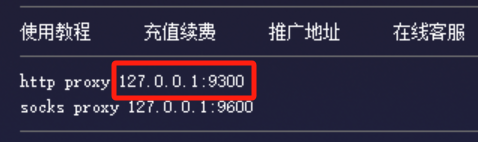
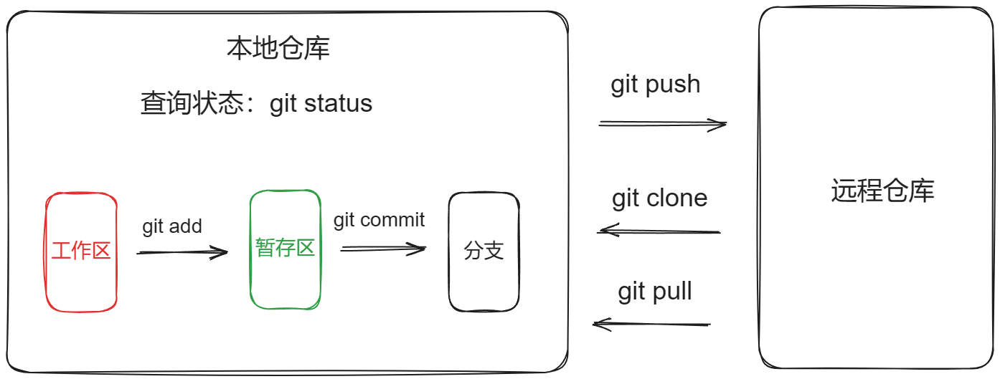

# Git

## Git基础

- [Git - 官方中文文档](https://git-scm.com/book/zh/v2/起步-关于版本控制)
- [Git 菜鸟教程](https://www.runoob.com/git/git-tutorial.html)

### 环境搭建

#### Windows

- 官网下载安装包：**[64-bit Git for Windows Setup](https://git-scm.com/downloads/win)**
- 安装时注意
    - 选择 `main` 分支
    - 将 `Open Git UI Here` 从上下文菜单中取消勾选
    - 可以将 Git Bash 添加到 Windows Terminal（添加后需在 Windows Terminal 配置中添加样式，详见 Windows Terminal）


#### Debian

- `sudo apt-get install git`

#### 配置

- 配置用户名和邮箱，此处的用户名和邮箱并不是登录用的

    ```bash
    # 配置用户名，如果有空格，要用引号包含
    git config --global user.name jerrybaijy
    
    # 配置email
    git config --global user.email jerry.baijy@outlook.com
    
    # 保存配置，这样就不用每次都配置
    git config --global credential.helper store
    
    # 查看配置信息
    git config --global --list
    ```

- 登录

    - 第一次 push，系统会要求输入平台用户名和密码。
    - GitLab 可以用户名密码登录。
    - GitHub 需使用令牌登录，详见 GitHub。


#### 网络代理

- 由于网络原因，在执行 `git push` 时，经常推送失败；
- 应设置网络代理代理

    ```bash
    git config --global http.proxy http://127.0.0.1:9788
    git config --global https.proxy https://127.0.0.1:9788
    ```

    **说明**：将 `proxy.example.com:8080` 换成代理商提供的地址和端口。

    

- 查看配置

    ```bash
    git config --list
    ```

- 如果之后不需要代理了，可以通过以下命令取消代理设置：

    ```bash
    git config --global --unset http.proxy
    git config --global --unset https.proxy
    ```

### 其它基础

- **Git 管理**

    ```bash
    # 查看git版本信息
    git -v
    ```

- **基本流程**

    

# Repo

- **基础命令**

    ```bash
    # 查看仓库状态
    git status
    # 下载
    git clone PATH
    # 跟踪
    git add .
    # 提交
    git commit -m "MESAGE"
    # 推送
    git push
    # 拉取
    git pull
    ```

- **两个 Remote Repo**

    ```bash
    # 查看本地 Repo 配置的 Remote Repo
    git remote -v
    # 添加默认 Remote Repo（本地没有 Remote Repo 的操作，添加后需设置 Upstream）
    git remote add origin $REMOTE_REPO
    # 添加另一个 Remote Repo，后添加的只能 push
    git remote set-url --add origin $REMOTE_REPO
    # 移除一个 Remote Repo
    git remote set-url --delete origin $REMOTE_REPO
    # 移除所有 Remote Repo
    git remote rm origin
    ```

- **git init 步骤**

    ```bash
    # 创建一个 Local Repo，并设置默认分支名为 main。
    git init --initial-branch=main
    
    # 网页创建 Remote Repo，
    
    # 添加默认 Remote Repo
    git remote add origin $REMOTE_REPO
    
    # 设置 upstream（前提是已经commit过）
    git push -u origin main
    
    # 其它与正常操作同理
    ```

## 本地创建仓库

1. 本地新建文件夹 `FOLDER_NAME`；
2. 终端进入文件夹 `FOLDER_NAME`；
3. 本地创建 Local Repo，并设置默认分支名为 `main`；

    ```bash
    git init --initial-branch=main
    ```

4. GitLab 和 GitHub 网页端分别创建 Remote Repo；
6. 添加默认 Remote Repo

    ```bash
    git remote add origin $REMOTE_REPO
    ```

7. 添加另一个 Remote Repo，后添加的只能 `push`；

    ```bash
    git remote set-url --add origin $REMOTE_REPO
    ```

8. 检查添加两个仓库成功

    ```bash
    git remote -v
    ```

    ```
    origin  https://gitlab.com/jerrybai/notes.git (fetch)
    origin  https://gitlab.com/jerrybai/notes.git (push)
    origin  https://github.com/Jerrybaijy/notes.git (push)
    ```

9. 向文件夹 `FOLDER_NAME` 添加任何文件，否则接下来无法 `commit`；
10. 添加两个 Remote Repo 的默认分支并关联，同时完成第一次推送；

    ```bash
    git add .
    git commit -m "1st commit"
    git push -u origin main
    ```

11. 网页检查已推送成功；
12. 其它操作同正常操作。

# Branch

## Branch 基础

安装 Git 时，有选项选择本地仓库默认分支为 main。

- **基础命令**

    ```bash
    # 查看分支
    git branch
    # 创建分支
    git branch $BRANCH_NAME # 使用-d删除
    # 切换分支
    git checkout $BRANCH_NAME # 使用-b创建并切换新分支
    # 关联分支
    git push -u origin $BRANCH_NAME # git pull -u origin BRANCH_NAME
    # 合并分支
    git merge $BRANCH_NAME
    # 重命名目前分支
    git branch -m $BRANCH_NAME
    
    # 删除远程分支
    git push origin --delete $REMOTE_BRANCH_NAME
    ```

## 其它

- **关联 Branch**

    ```bash
    # 关联分支
    git push -u origin $BRANCH_NAME
    git pull -u origin $BRANCH_NAME
    
    # 清除关联
    git remote rm origin
    ```

    **解释**：

    - **-u**：等价于 `--set-upstream`，设置上游分支
    - **origin**：远程仓库的别名；当克隆一个远程仓库时，Git 会默认创建一个名为 `origin` 的远程仓库别名，指向远程仓库地址。
    - **BRANCH_NAME**：远程分支名字
    - 设置上游分支以后，本地分支与上游分支建立关联，以后可在本分支下直接使用 `git push`
    - 每次新生成分支需将新分支与远程分支建立一次关联

# Version Control

- **基础命令**

    ```bash
    # 追溯
    git reset --hard SHA # SHA哈希值
    ```

# Git Ignore

`.gitignore` 文件是一个用来告诉 Git 哪些文件或目录不需要被版本控制的配置文件。通常，这些文件包括编译生成的文件、临时文件、日志文件、依赖库等，因为它们不应该被提交到版本库中，或者它们可以通过其他途径重新生成。创建一个 `.gitignore` 文件可以帮助确保你的代码仓库保持整洁，只包含必要的文件。

## Symbol

- **`#`**：注释
- **`*`**：所有
- **`!`**：否定

## Template

- .gitignore

    ```tex
    # Ignore compiled files
    *.class
    *.o
    *.pyc
    
    # Ignore build output directories
    build/
    dist/
    bin/
    
    # Ignore log files
    *.log
    
    # Ignore IDE and editor-specific files
    .idea/
    .vscode/
    
    # Ignore dependency directories
    node_modules/
    venv/
    
    # Ignore configuration files with sensitive information
    config.ini
    secrets.json
    ```

# Git LFS

Git LFS（Large File Storage）是 Git 的扩展，用于版本控制大文件（如图片、视频、音频等）或二进制文件。Git LFS 将大文件存储在外部的专用存储服务器上，而不是将它们存储在 Git 仓库中。这样可以显著减少 Git 仓库的体积，并提高克隆和拉取操作的速度。

## 环境搭建

- [官网下载并安装 Git LFS](https://git-lfs.com/)
- 初始化

    ```bash
    git lfs install
    ```

## 使用

- 跟踪大文件

    ```bash
    git lfs track "Various Artists - 风舞九天现场 三 (Remix).mp3"
    ```

- 这会在 `.gitattributes` 文件（如果没有会自动创建）中添加一行，具体到这个文件：

    ```
    Various Artists - 风舞九天现场 三 (Remix).mp3 filter=lfs diff=lfs merge=lfs -text
    ```

- 接下来正常添加提交推送即可。

## 注意

- 单个 LFS 文件：限制1GB
- 每月 LFS 带宽限制：GitHub 1GB，GitLab 10GB。

# GitHub

## 登录

1. GitHub 不再支持密码登录，以下是使用令牌登录方法；

    - 后来，在使用验证器二次验证登录以后， GitHub 又支持网页登录了。

2. 网页登录到你的 GitHub 帐户；
3. 点击你的头像，在下拉菜单中选择 `Settings`；
4. 在左侧导航栏中，选择 `Developer settings`；
5. 在左侧导航栏中，选择 `Generate new token`；
6. 点击 `Tokens (classic)`；
7. 在下拉菜单中选择 `Generate new token (classic)`；

    1. `Note` 随便填，只是用于标记这个令牌想在哪用；
    2. `Expiration` 使用期限；
    3. 如果自己用，所有选项都打勾（实际经验只勾选 `repo` 大类也没影响目前使用）；
    4. 创建令牌，会得到令牌，注意令牌内容只能看见这一次；

8. 当在 Bash 中要求输入用户名密码时；

    1. 用户名依然是原来的用户名；
    2. 密码用令牌代替；

## 创建远程 GitHub 仓库

GitHub 网页创建 Remote Repo：

- 仓库名填写本地文件夹名称 `FOLDER_NAME`，保证本地文件夹和远程仓库同名，便于管理；
- `Repository name` 填写小写连字符文件名；
- `Visibility Level` 选 `Public`；
- 不要在这里创建 `README.md`，否则本地无法直接 `push`；

## 存储库限制

- [GitHub 官方关于存储库大小的限制](https://docs.github.com/zh/repositories/working-with-files/managing-large-files/about-large-files-on-github)

### 单个文件

- 推荐小于50MB，阻止超过100MB的单个文件。
- 超过100MB的单个文件应使用 LFS。
- 通过浏览器将文件添加到存储库，该文件不得大于 25 MiB。

### 存储库

- 理想情况下小于 1 GB，强烈建议小于 5 GB。

### 历史经验

- 单次推送总大小达到1.17GB

## 解决办法

- 在 Linux 中从 GitHub 上下载特定文件

    ``` bash
    curl -O https://raw.githubusercontent.com/$USER/$REPO/$BRANCH/$PATH_TO_FILE
    # eg：同时下载两个，可同时使用两个 -O 下载两个文件
    curl -O https://raw.githubusercontent.com/Jerrybaijy/it-notes/main/devops/docker/docker.md
    ```

### 使用 Web VSCode 查看代码

- 在 GitHub 中查看代码时，可通过将 URL 中的 `.com` 修改为 `.dev`，使用 Web VSCode 查看代码：

    ```
    # 原地址
    https://github.com/Jerrybaijy/blog-flak-sqlite-html
    
    # 原地址
    https://github.dev/Jerrybaijy/blog-flak-sqlite-html
    ```

# GitLab

## GitLab 基础

## 创建远程 GitLab 仓库

GitLab 网页创建 Remote Repo

- 仓库名填写本地文件夹名称 `FOLDER_NAME`，保证本地文件夹和远程仓库同名，便于管理；
- `Project name` 和 `Project slug` 都填写小写连字符文件名；
- `Visibility Level` 选 `Public`；
- 不要在这里创建 `README.md`，否则本地无法直接 `push`；

## 存储库限制

- [GitLab 官方关于存储库大小的限制](https://docs.gitlab.com/ee/user/gitlab_com/#account-and-limit-settings)

## GitLab CI

目的是根据用户自己编写的应用文件 `main.go`、`Dockerfile`、 `.gitlab-ci.yml`，在将文件 push 到 Gitlab 时，通过 Pipeline 自动生成 Docker image 并推送到 Dockerhub。

### 配置文件

- .gitlab-ci.yml

    ```yaml
    variables:
      IMAGE_NAME: jerrybaijy/jerry-image
      IMAGE_TAG: v1.0
    
    stages: 
      - build
    
    build_image:
      stage: build
      image: docker:20.10.20
      services:
        - docker:20.10.20-dind
      variables:
        DOCKER_TLS_CERTDIR: "/certs"
      before_script:
        - docker login -u $DOCKER_USER -p $DOCKER_PASSWORD
      script:
        - docker build -t $IMAGE_NAME:$IMAGE_TAG .
        - docker push $IMAGE_NAME:$IMAGE_TAG
    ```

### 基本流程

1. 远程创建仓库 clone 至本地
2. 项目目录创建  `main.go`, `Dockerfile` 和 `.gitlab-ci.yml` 文件
3. GitLab 仓库项目配置环境变量

   1. 在配置文件中可能需要某些敏感信息（如密码），可在文件中使用 `$VARIABLE_NAME` 代替，在托管平台中设置这个变量信息，然后在 Pipeline 执行配置文件时，平台会自动处理。
   2. 进入项目设置页面
   3. 左下角 `Settings` > `CI/CD`
   4. 选择 `Variables` > `添加变量信息`

      - 不要选择 Protect variable 选项，否则在非 main 分支无法完成 CI。
      - 注意一定要选择 Masked variable 选项，否则在 log 日志时会打印出来。

4. 推送至 GitLab

   - 项目文件推送至远程仓库
   - GitLab 在 Pipeline 中自动生成 Image 并推送至 DockerHub

### 项目

- GitLab CI Image

# 解决办法

## 远程仓库改名

- **GitLab**

    - **改名**：右上角三个点 > `Project settings` > `Project name`
    - **改地址**：`Advanced` > `Change path`

- **GitHub**

    - **改名**：导航栏 > `Settings` > `Repository name`
    - **改地址**：GitHub 改完项目名称后，仓库地址自动更改。

- **本地仓库**：移除旧仓库，重新添加远程地址，重新关联 `main` 分支。