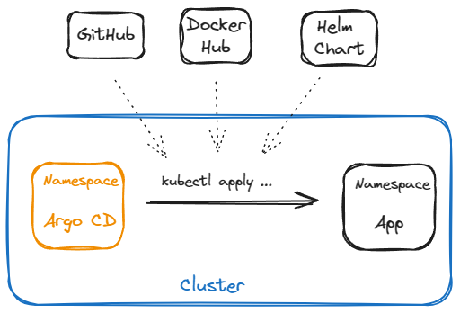
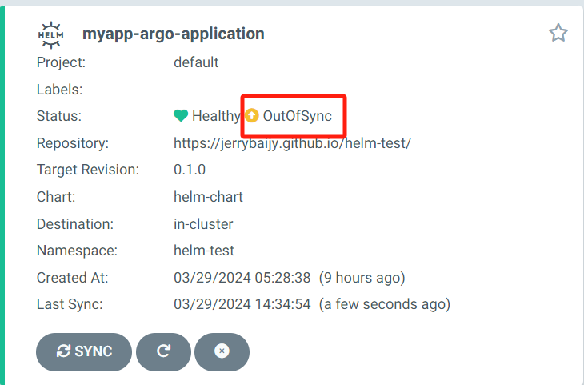
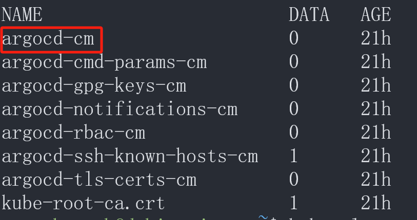

# K8S Basics

Kubernetes （K8S）是一个可移植、可扩展的开源平台，用于管理容器化的工作负载和服务，可促进声明式配置和自动化。

## Build ENV

- K8S 需运行在 Docker 基础上
- 在本地使用 Minikube 搭建集群
- 在 Cloud 中搭建集群
- 其它

## K8S 架构


## [K8S Objects](https://kubernetes.io/zh-cn/docs/concepts/overview/working-with-objects/)

- *Kubernetes objects* are persistent entities in the Kubernetes system.

### [Manifest File](https://kubernetes.io/docs/concepts/overview/working-with-objects/#describing-a-kubernetes-object)

#### [Fields](https://kubernetes.io/docs/concepts/overview/working-with-objects/#required-fields)

#### [Field Selectors](https://kubernetes.io/zh-cn/docs/concepts/overview/working-with-objects/field-selectors/)

#### [Labels](https://kubernetes.io/zh-cn/docs/concepts/overview/working-with-objects/common-labels/)

# [Control Plane](https://kubernetes.io/zh-cn/docs/concepts/overview/components/#control-plane-components)

Control Plane is one of the cluster's basic components, and make global decisions about the cluster.

# Cluster

## Cluster basics

- A Kubernetes cluster consists of two types of resources:

  - **Control Plane**: The Control Plane is responsible for managing the cluster
  - **Node**: A node is a VM or a physical computer that serves as a worker machine in a Kubernetes cluster.

- [All the required components in a complete and working cluster.](https://kubernetes.io/zh-cn/docs/concepts/overview/components/)

  

- Basic commands

  ```bash
  # Show cluster
  kubectl cluster-info
  # Stop Cluster
  systemctl stop kubelet
  ```

## Build cluster

搭建集群需要一些步骤，主要是配置和安装相关软件。以下是 GPT 在一台空服务器上搭建集群的一般步骤：

1. **选择操作系统**：选择适合您需求的操作系统。常见的选择包括 Ubuntu、CentOS、或者其他 Linux 发行版。
2. **安装必要软件**：安装必要的软件，包括 SSH 服务器（用于远程连接）和基本的网络配置。
3. **配置主机名和 IP 地址**：为您的服务器配置主机名和静态 IP 地址，这样其他服务器可以通过主机名或 IP 地址访问它。
4. **安装容器化平台**：选择并安装适合您的容器化平台，比如 Docker 或者 Kubernetes。这些平台可以帮助您管理和运行应用程序容器。
5. **配置容器化平台**：配置您的容器化平台，包括设置网络、存储和其他必要的配置。
6. **创建集群**：使用容器化平台工具创建一个集群，将多台服务器连接在一起。
7. **部署应用程序**：将您的应用程序容器化，并在集群中部署它们。您可以使用 Docker 镜像或者 Kubernetes 部署描述文件来简化这个过程。
8. **监控和维护**：设置监控和日志记录，确保您的集群正常运行。定期进行维护和更新以确保安全性和性能。


# Deployment

## Deployment 基础

​	Deployment（部署）是 Kubernetes 中用于管理 Pod 和 ReplicaSet 的控制器。它定义了您希望部署的应用程序的期望状态，并负责确保集群中的实际状态与所定义的状态匹配。


- **基础命令**

  ```bash
  # 查看deployment
  kubectl get deployment
  # 手动创建 deployment
  kubectl create deployment DEPLOYMENT_NAME --image=IMAGE
  # YAML 文件创建 deployment
  kubectl apply -f deployment.yaml
  # 删除 deployment
  kubectl delete deployment DEPLOYMENT_NAME
  ```

- **deployment.yaml**

  ```yaml
  apiVersion: apps/v1              # API 版本
  kind: Deployment                 # 资源类型
  metadata:                        # 资源元数据
    labels:                        # 资源标签
      $KEY: $VLUE                  # 资源的标签键值对，可以用来标识和分类资源
    name:                          # Deploymnet 名称
    namespace:                     # Deploymnet 命名空间
  spec:                            # Deploymnet 规格
    replicas:                      # Pod 数量
    selector:                      # 标签选择器，用于选择要管理的 Pod
      matchLabels:                 # 匹配标签
        $KEY: $VLUE                # 标签选择器中用于匹配的标签键值对
    template:                      # Pod 模板
      metadata:                    # Pod 元数据
        labels:                    # Pod 标签
          $KEY: $VLUE              # Pod 的标签键值对
      spec:                        # Container 规格
        containers:                # Container 列表
        - image:                   # Image 地址
          imagePullSecrets:        # Image 下载策略
          name:                    # Container 名称
          args:                    # ENTRYPOINT 参数
          commnd:                  # 执行命令
          ports:                   # Container 公开端口
          env:                     # 环境变量
          resources:               # 容器资源限制和请求
            requests:                               # 请求资源
              memory: "1Gi"                         # 请求内存为 1Gi
              cpu: "500m"                           # 请求 CPU 为 500m
              ephemeral-storage: "1Gi"              # 请求临时存储为 1Gi
            limits:                                 # 资源限制
              memory: "1Gi"                         # 内存限制为 1Gi
              cpu: "500m"                           # CPU 限制为 500m
              ephemeral-storage: "1Gi"              # 临时存储限制为 1Gi
          livenessProbe:           # 存活检查
          readinessProbe:          # 就绪检查
          startupProbe:            # 启动检查
          volumeMounts:            # 卷挂载
          securityContext:         # 安全上下文
          lifecycle:               # 容器生命周期回调
        volumes:                   # Pod 的卷列表
  ```

  ```yaml
  apiVersion: apps/v1
  kind: Deployment
  metadata:
    labels:
      app: jerry-app
    name:
    namespace:
  spec:
    replicas:
    selector:
      matchLabels:
        app: jerry-app
    template:
      metadata:
        labels:
          app: jerry-app
      spec:
        containers:
        - image:
          imagePullSecrets:
          name:
          args:
          commnd:
          ports:
          env:
          resources:
            requests:
              memory: "1Gi"
              cpu: "500m"
              ephemeral-storage: "1Gi"
            limits:
              memory: "1Gi"
              cpu: "500m"
              ephemeral-storage: "1Gi"
          livenessProbe:
          readinessProbe:
          volumeMounts:
          securityContext:
          lifecycle:
        volumes:
  ```

# [Kubectl](https://kubernetes.io/zh-cn/docs/reference/kubectl/)

​	kubectl 命令行工具用于与集群交互

## Install

### [On Linux](https://kubernetes.io/zh-cn/docs/tasks/tools/install-kubectl-linux/#install-using-other-package-management)

- Install on Linux

  ```bash
  # 安装 kubectl
  sudo snap install kubectl --classic
  # 添加环境变量
  export PATH=$PATH:/snap/bin
  # 验证安装
  kubectl version --client
  ```

  解释：

  - `--classic` 用于允许 kubectl 访问系统上的文件系统。
  - `--client` 用于告诉 kubectl 仅显示客户端版本信息，而不连接到 Kubernetes 集群来获取服务器版本信息。

## [Commands](https://kubernetes.io/zh-cn/docs/reference/kubectl/)

- Commands

  ```bash
  # 列出资源
  kubectl get $RESOURCE
  # 删除资源
  kubectl delete $RESOURCE
  # 应用 apply
  kubectl apply -f $YAML # `-f` 指定路径
  # 查看资源日志
  kubectl logs $RESOURCE
  # 查看资源详细信息
  kubectl describe $RESOURCE
  ```

- Options

  -  `-n $NAMESPACE`：指定命名空间

# [Minikube](https://minikube.sigs.k8s.io/docs/)

​	Minikube 用于创建本地集群，供学习使用，不能用于生产环境。

- **Install**

  ```bash
  curl -LO https://storage.googleapis.com/minikube/releases/latest/minikube-linux-amd64
  sudo install minikube-linux-amd64 /usr/local/bin/minikube
  ```

- **Manage**

  ```bash
  # 列出 minkube 配置文件
  minikube profile list
  ```

- **基础命令**

  ```bash
  # 查看集群
  minikube status
  # 创建集群
  minikube start
  # 删除集群
  minikube delete
  ```

# [Namespace](https://kubernetes.io/zh-cn/docs/concepts/overview/working-with-objects/namespaces/)

## Namespace 基础

​	Namespace（命名空间）是 Kubernetes 中用于隔离和组织资源的虚拟工作空间。它是一种在逻辑上划分集群资源的方式，允许在同一集群内创建多个虚拟的独立环境。Namespace 作用域仅针对同一 Namespace 的对象，对集群范围的对象不适用。

- **基础命令**

  ```bash
  # 创建 namespace
  kubectl create namespace NAMESPACE_NAME
  # 删除 namespace
  kubectl delete namespace NAMESPACE_NAME
  ```

# [Node](https://kubernetes.io/zh-cn/docs/concepts/architecture/nodes/)

- [**Node Component**](https://kubernetes.io/zh-cn/docs/concepts/overview/components/#node-components)
  - Node component is one of the cluster's basic components.
  - Node components run on every node, maintaining running pods and providing the Kubernetes runtime environment.

- Node 可以是一个虚拟机或者物理机器，取决于所在的集群配置。 每个节点包含运行 Pod 所需的服务； Kubernetes 通过将容器放入在 Node 上运行的 Pod 中来执行你的工作负载。

- 所有 Node 由 Control Plane 负责管理。

- Node 上的组件包括 [kubelet](https://kubernetes.io/docs/reference/generated/kubelet)、 [container runtime](https://kubernetes.io/zh-cn/docs/setup/production-environment/container-runtimes) 以及 [kube-proxy](https://kubernetes.io/zh-cn/docs/reference/command-line-tools-reference/kube-proxy/)。


# Pod


- Command

  ```bash
  # 列出 pod
  kubectl get pod
  # 删除 pod
  kubectl delete pod
  # 查看 pod 日志
  kubectl logs pod
  # 查看 pod 详细信息
  kubectl describe pod $POD
  # Exit pod
  kubectl exec -it $POD -- /bin/bash
  ```
  
  

# Service

- **基础命令**

  ```bash
  # 查看 service
  kubectl get svc [-n NAMESPACE]
  ```

- **service.yaml**

  ```yaml
  apiVersion: v1
  kind: Service
  metadata:
    name: $SERVICE_NAME
  spec:
    selector:
      $KEY: $VALUE
    type: LoadBalancer
    ports:
      - port: 80
        targetPort: 8080
  ```
  
  ```yaml
  apiVersion: v1
  kind: Service
  metadata:
    name: myapp-service
  spec:
    selector:
      app: myapp
    type: LoadBalancer            # 如本地访问服务类型为 ClusterIP
    ports:                        # 服务监听的端口列表
      - port: 80                  # 公网端口 80
        targetPort: 8080          # Pod 端口 8080
  ```
  
- **port**

  - **公开至公网**

    方法一：将现有服务的类型更改为 LoadBalancer 类型
  
    ```bash
    kubectl patch svc $SERVICE_NAME -n $NAMESPACE -p '{"spec": {"type": "LoadBalancer"}}'
    ```
  
    方法二：为 Deployment 创建一个新的 Service，并将其类型设置为 LoadBalancer
  
    ```bash
    kubectl expose deployment $DEPLOYMENT_NAME --type LoadBalancer --port 80 --target-port 8080
    ```
  
  - **公开至本地**
  
    ```bash
    kubectl port-forward deployment/$DEPLOYMENT_NAME $HOST_PORT:$POD_PORT
    # eg
    kubectl port-forward deployment/nginx 80:8080
    ```
    
    

# Argo CD

## Argo CD 基础

​	Argo CD 是一个持续部署工具，可以通过修改 yaml 文件，改变应用的运行。

​	

### 环境搭建

1. Linux 系统，Docker 已安装，kubectl 已安装，启动一个集群。

2. 安装 Argo CD

   ```bash
   kubectl create namespace argocd
   kubectl apply -n argocd -f https://raw.githubusercontent.com/argoproj/argo-cd/stable/manifests/install.yaml
   ```

3. 查看 pod 状态，直到全部运行

   ```bash
   kubectl get pod -n argocd
   ```

4. 将端口转发至本地或公网即可查看 Argo CD UI 界面

   ```bash
   kubectl get svc -n argocd
   # 本地
   kubectl port-forward -n argocd svc/argocd-server 8080:443
   # 公网
   kubectl patch svc argocd-server -n argocd -p '{"spec": {"type": "LoadBalancer"}}'
   ```
   
5. 获取密码

   ```bash
   # 获取密码
   kubectl get secret argocd-initial-admin-secret -n argocd -o yaml
   # 解码，PASSWORD为上一步获取到的加密密码
   echo $PASSWORD== | base64 --decode
   
   # 上次密码OaVoMpufPwfd-X-9
   ```

6. 在本地或公网通过 IP 访问 Argo CD 页面登录，用户名为admin，公网访问需要科学上网

## 基本流程

1. Argo CD 已安装

2. UI 界面创建 Git 仓库，clone 至本地

3. Repo 根目录创建 dev 目录

4. dev 目录创建 deployment.yaml 和 service.yaml

   1. 注意云上的集群有节点限制，试用时只能创建一个副本
   2. deployment.yaml 和 service.yaml 见 Kubenetes

5. Repo 根目录创建 application.yaml

   ```yaml
   apiVersion: argoproj.io/v1alpha1
   kind: Application
   metadata:
     name: student-springboot-react-frontend
     namespace: argocd
   
   spec:
     project: default
     source:
       repoURL: https://github.com/Jerrybaijy/student-springboot-react-frontend.git
       targetRevision: HEAD
       path: dev
     
     destination:
       server: https://kubernetes.default.svc
       namespace: student-springboot-react-frontend
   
     syncPolicy:
       syncOptions:
         - CreateNamespace=true
       automated:
         selfHeal: true
         prune: true
   ```

6. 推送仓库

7. 部署应用

   ```bash
   kubectl apply -f application.yaml
   ```

8. 在 Argo CD 页面查看应用已启动

9. 查看 IP 即可访问应用（如有需要可进行端口转发）

   ```bash
   kubectl get svc -n myapp
   ```

10. 以后若想更改应用，只需需改 yaml 文件并推送至 Git 仓库，Argo CD 可自动识别自动部署。

11. 删除应用

    1. 不要直接在集群删除应用，要先在 Argo CD 页面删除应用（因为已配置自愈，Argo CD 会自动创建应用）
    2. 再删除应用的命名空间

12. 删除 Argo CD

    1. **删除 ArgoCD 自定义资源定义（CRD）**

       ```bash
       kubectl delete crd applications.argoproj.io appprojects.argoproj.io argocds.argoproj.io
       ```

    2. **删除 ArgoCD 的命名空间**

       ```bash
       kubectl delete namespace 
       ```

## 相关项目

- Argo CD Git
- Argo CD Helm

## 解决方案

### OutOfSync

1. 当使用 ArgoCD 部署好应用以后，一切运行正常，但 UI 页面一直显示 OutOfSync，即使状态不同步，应用程序实际上也是同步的，但看到它不同步很烦人。若要消除此问题，有一种解决方案是使用资源排除。

   

2. [以下方法由博主提供](https://medium.com/@rojenshrestha100/argo-cd-out-of-sync-due-to-cilium-identity-f9d6188aa056)

3. 访问 Argo CD 的 configmap

   ```bash
   kubectl get cm -n argocd
   ```

   

4. 使用 nano 编辑器编辑此配置图

   ```bash
   KUBE_EDITOR="nano" kubectl edit cm argocd-cm -n argocd
   ```

5. 文末在第一层级添加以下数据并保存

   ```yaml
   data:
     resource.exclusions: |
       - apiGroups:
         - cilium.io
         kinds:
         - CiliumIdentity
         clusters:
         - "*"
   ```

# Grafana

# Helm

Helm 是 Kubernetes 的包管理器，使用 "chart" 的打包格式来描述 Kubernetes 资源的集合，使得部署和管理应用程序变得更加简单和可重复。

## 环境搭建

- 集群已运行，Kubectl 已安装

- Linux 安装（Debian / Ubuntu）

  ```bash
  sudo snap install helm --classic
  # 添加环境变量
  export PATH="$PATH:/snap/bin"
  ```

- Windows 安装

  ```bash
  # 提前安装包管理器 Chocolatey，详见 Windows
  choco install kubernetes-helm
  ```

## Helm 基础

- **命令**

  ```bash
  # 查看 helm 版本
  helm version
  
  # 查看 chart 配置值（values.yaml 文件中的值）
  helm show values .
  
  # 重置 index
  helm repo index $CHART_PATH --url https://jerrybaijy.github.io/$REPO/
  ```

## 基本流程

### 建立远程仓库

1. UI 界面创建 Git 仓库，clone 至本地

2. Repo 根目录创建创建 Chart

   ```bash
   helm create $CHART_NAME
   ```

3. 配置 Chart
   1. 编辑模板 `mychart/templates`
   2. 编辑 values `mychart/values.yaml`

4. 封装 Chart

   ```bash
   helm package $CHART_PATH
   ```

5. 重置 index

   ```bash
   helm repo index $CHART_PATH
   ```

6. Git 推送，GitHub 设置 Pages - Branch（一定不要提前设置）

7. 重置 index

   ```bash
   helm repo index $CHART_PATH --url https://jerrybaijy.github.io/$REPO/
   ```

8. Git 推送

9. 至此，远程 Helm Chart 仓库已建好，可供其它调用：https://jerrybaijy.github.io/$REPO/

### 使用远程仓库

1. 添加本地 Helm 仓库，与远程仓库关联

   ```bash
   helm repo add $HELM_REPO https://jerrybaijy.github.io/$REPO
   ```

2. 使用 Helm Charts

   ```bash
   helm install $RELEASE $HELM_REPO/$CHART_NAME
   ```

### 流程实例

- 这是项目 Argo CD Git 的步骤留存，最后两大步取一个操作

  ```bash
  # UI 界面创建 Git 仓库，clone 至本地，进入 repo 目录
  
  helm create argocd-helm-chart
  helm package argocd-helm-chart
  helm repo index .
  
  # Git 推送，GitHub 设置 Pages - Branch（一定不要提前设置）
  
  helm repo index . --url https://jerrybaijy.github.io/argocd-helm/
  
  # Git 推送
  
  # 1.以下是本地使用远程 Helm Charts
  helm repo add argocd-helm https://jerrybaijy.github.io/argocd-helm/
  kubectl create namespace argocd-helm
  helm install argocd-helm-app argocd-helm/argocd-helm-chart -n argocd-helm
  kubectl get pod -n argocd-helm
  kubectl get svc -n argocd-helm
  kubectl delete namespace argocd-helm
  
  # 2.以下是 Argo CD 使用远程 Helm Charts
  kubectl apply -f application.yaml
  kubectl get namespace
  kubectl get pod -n argocd-helm
  kubectl get svc -n argocd-helm
  kubectl delete namespace argocd-helm
  ```

## Helm Repo

- **基础命令**

  ```bash
  # 查看 Helm Repo
  helm repo list
  # 添加 Helm Repo
  helm repo add $HELM_REPO https://jerrybaijy.github.io/$REPO
  helm repo add arldka https://arldka.github.io/helm-charts
  helm repo update
  # 删除 Helm Repo
  helm repo remove $HELM_REPO
  # 删除所有 Helm Repo
  rm ~/.config/helm/repositories.yaml
  ```

- Helm Repo 实际只是一个 YAML 文件，存储于 `~/.config/helm/repositories.yaml`，里面声明了各个 Helm Repo 与 Remote Repo 的对应关系。

## Chart

- **基础命令**

  ```bash
  # 查看 chart 信息
  helm show chart .
  # 创建 chart
  helm create $CHART_NAME
  # 封装 chart
  helm package $CHART_PATH
  # 发布 chart，没用过
  helm push $CHART $CHART_REPO
  # 测试 chart
  helm lint $CHART
  ```

## Release

- **基础命令**

  ```bash
  # 查看 release
  helm list
  # 部署 release
  helm install $RELEASE $HELM_REPO/$CHART_NAME
  # 删除 release
  helm delete $RELEASE
  # 测试 release
  helm test $RELEASE
  ```

## Values

- values.yaml

  ```yaml
  # 副本数量
  replicaCount: 2
  
  image:
    repository: jerrybaijy/jerry-image
    tag: "v1.0"
    pullPolicy: IfNotPresent
  
  imagePullSecrets: []
  nameOverride: ""
  fullnameOverride: ""
  
  serviceAccount:
    # Specifies whether a service account should be created
    create: true
    # Automatically mount a ServiceAccount's API credentials?
    automount: true
    # Annotations to add to the service account
    annotations: {}
    # The name of the service account to use.
    # If not set and create is true, a name is generated using the fullname template
    name: ""
  
  podAnnotations: {}
  podLabels: {}
  
  podSecurityContext: {}
    # fsGroup: 2000
  
  securityContext: {}
    # capabilities:
    #   drop:
    #   - ALL
    # readOnlyRootFilesystem: true
    # runAsNonRoot: true
    # runAsUser: 1000
  
  service:
    type: ClusterIP
    port: 80
  
  ingress:
    enabled: false
    className: ""
    annotations: {}
      # kubernetes.io/ingress.class: nginx
      # kubernetes.io/tls-acme: "true"
    hosts:
      - host: chart-example.local
        paths:
          - path: /
            pathType: ImplementationSpecific
    tls: []
    #  - secretName: chart-example-tls
    #    hosts:
    #      - chart-example.local
  
  resources: {}
    # We usually recommend not to specify default resources and to leave this as a conscious
    # choice for the user. This also increases chances charts run on environments with little
    # resources, such as Minikube. If you do want to specify resources, uncomment the following
    # lines, adjust them as necessary, and remove the curly braces after 'resources:'.
    # limits:
    #   cpu: 100m
    #   memory: 128Mi
    # requests:
    #   cpu: 100m
    #   memory: 128Mi
  
  livenessProbe:
    httpGet:
      path: /
      port: http
  readinessProbe:
    httpGet:
      path: /
      port: http
  
  autoscaling:
    enabled: false
    minReplicas: 1
    maxReplicas: 100
    targetCPUUtilizationPercentage: 80
    # targetMemoryUtilizationPercentage: 80
  
  # Additional volumes on the output Deployment definition.
  volumes: []
  # - name: foo
  #   secret:
  #     secretName: mysecret
  #     optional: false
  
  # Additional volumeMounts on the output Deployment definition.
  volumeMounts: []
  # - name: foo
  #   mountPath: "/etc/foo"
  #   readOnly: true
  
  nodeSelector: {}
  
  tolerations: []
  
  affinity: {}
  ```

# How to deploy Kubernetes on bare metal

在裸机服务器上部署 Kubernetes 涉及检查一些先决条件、安装 Kubernetes 工具以及使用终端配置集群。

## 设置物理机

在裸机服务器上部署 Kubernetes 之前，您需要配置物理机：

- **安装****操作系统****：**选择轻量级 Linux 发行版模型（示例包括 Ubuntu、CentOS 和 CoreOS），并将其安装在裸机服务器上。
- **配置网络设置：**安装操作系统后，请进行网络配置并确保每台计算机都有唯一的 IP 地址。
- **分配主机名：**编辑 **etc** 中的**主机名**，为每台物理机分配描述性主机名（例如，主节点、worker1 和 worker2），以便于管理。此外，编辑**主机**以将每个主机名连接到其各自的 IP 地址。

在此步骤结束时，您将安装必要的操作系统。除此之外，每个节点都有一个唯一的名称。

## 安装容器运行时

虽然 Kubernetes 可帮助您运行容器化应用程序，但它通过与容器运行时交互来启动和管理集群来实现。

如果您选择了 Ubuntu 或 [CentOS，Docker](https://www.liquidweb.com/kb/install-docker-on-linux-almalinux/) 是常见的容器运行时选择。对于 CoreOS，rkt （Rocket） 通常服务得更好。

## 禁用交换

交换是硬盘驱动器上用于在物理 RAM 已满时临时存储数据的空间。它充当 RAM 的扩展，并为操作系统提供了一种从 RAM 卸载非活动数据的方法。

但是，Kubernetes 和容器化应用程序针对快速访问物理 RAM 进行了优化。因此，您必须禁用交换，以防止 Kubernetes 依赖较慢的交换空间。

您可以通过在终端中输入以下代码来禁用交换：

```
sudo swapoff -a
```

## 安装 Kubernetes 工具

现在，是时候在集群中的所有物理计算机上安装 Kubernetes 工具了。基本工具包括 **kubeadm**、**kubelet** 和 **kubectl**，它们支持创建、操作和管理 Kubernetes 集群。

将 Kubernetes 存储库添加到包管理器，以便您的操作系统（在此示例中为 Ubuntu）可以找到必要的包。然后，安装以下 Kubernetes 工具：

1. 输入以下代码以更新软件包列表，以便操作系统可以访问存储库的最新可用软件包及其版本：

```
sudo apt-get update
```

2. 安装依赖项以避免在下一步中遇到问题。

```
sudo apt-get install -y apt-transport-https curl
```

3. 从指定的 URL 下载 Kubernetes 包的安全密钥 — GPG 密钥，并将其添加到密钥环中。

```
curl -s https://packages.cloud.google.com/apt/doc/apt-key.gpg | sudo apt-key --keyring /usr/share/keyrings/kubernetes-archive-keyring.gpg add -
```

4. 将 Kubernetes 存储库添加到包源列表中。

```
echo "deb [signed-by=/usr/share/keyrings/kubernetes-archive-keyring.gpg] https://apt.kubernetes.io/ kubernetes-xenial main" | sudo tee /etc/apt/sources.list.d/kubernetes.list
```

5. 在终端中输入以下代码以安装 kubeadm、kubelet 和 kubectl：

```
sudo apt-get update
sudo apt-get install -y kubelet kubeadm kubectl
```

## 初始化主节点

安装 Kubernetes 工具后，您可以使用 **kubeadm** 初始化主节点。

输入以下代码开始：

```
sudo kubeadm init --pod-network-cidr=CIDR
```

“CIDR”的值取决于您选择的 Pod 网络。对于法兰绒，通常为 10.244.0.0/16。

因此，如果您选择法兰绒，您可以输入：

```
sudo kubeadm init --pod-network-cidr=10.244.0.0/16
```

命令完成后，你将看到有关在主节点上配置 kubectl 并将工作节点连接到集群的说明输出。

具体而言，你将看到如下输出：

```
kubeadm join <master-node-ip>:<master-node-port> --token <token> --discovery-token-ca-cert-hash sha256:<hash>
```

保存此输出命令，因为在步骤 8 中需要它来将工作器节点连接到群集。

## 在主节点上设置 kubectl

初始化主节点后，您需要在其[上配置 kubectl](https://www.liquidweb.com/kb/how-to-install-and-configure-kubectl-a-tutorial/)，以方便其与 Kubernetes API 的通信。

您可以通过在终端中输入以下命令来执行此操作：

```
mkdir -p $HOME/.kube
sudo cp -i /etc/kubernetes/admin.conf $HOME/.kube/config
sudo chown $(id -u):$(id -g) $HOME/.kube/config
```

## 安装 Pod 网络插件

为了帮助 Kubernetes 集群中节点之间的通信，您需要一个 Pod 网络附加组件。您可以在 Kubernetes 网站上找到[附加选项](https://kubernetes.io/docs/concepts/cluster-administration/addons/)列表。

选择附加组件后，您可以通过输入以下命令来安装它：

```
kubectl apply -f <pod-network-addon>.yaml
```

将 <pod-network-addon> 替换为您所选附加组件的 URL。例如，如果要安装 Flannel，则可以输入以下命令：

```
kubectl apply -f https://raw.githubusercontent.com/coreos/flannel/master/Documentation/kube-flannel.yaml
```

## 将工作节点加入集群

初始化主节点并配置 Pod 网络后，您可以将工作节点添加到集群中。

您可以通过在每个节点上运行以下命令来执行此操作：

```
sudo kubeadm join <master-node-ip>:<master-node-port> --token <token> --discovery-token-ca-cert-hash sha256:<hash>
```

在这里，您必须将 **<master-node-ip>**、**<master-node-port>**、**<token>** 和 **<hash>** 替换为您在步骤 5 结束时保存的值。

## 验证集群状态

将所有工作节点添加到主节点后，就可以验证集群的状态了。

您可以通过在主节点中输入以下命令来执行此操作：

```
kubectl get nodes
```

您应该会看到包含所有工作节点的输出，其状态为“就绪”。

## 部署应用程序

设置 Kubernetes 集群后，现在可以将应用程序部署到集群上。例如，如果要使用 NGINX 应用程序进行测试，可以通过输入以下命令来实现：

```
kubectl create deployment nginxtest1 --image=nginx
```
