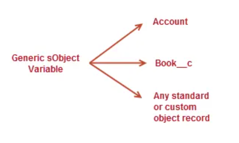
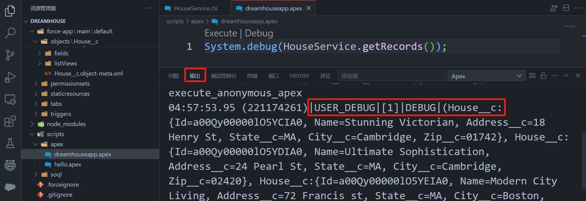
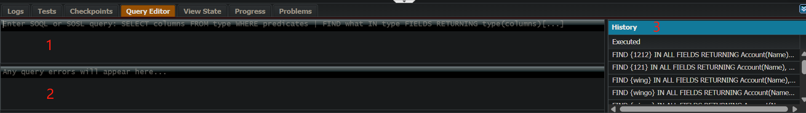
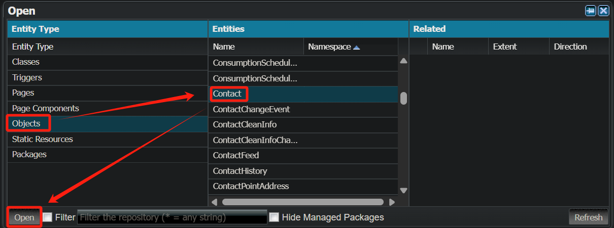
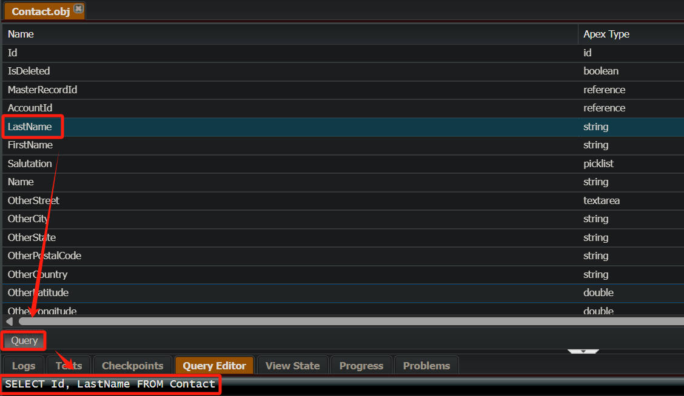
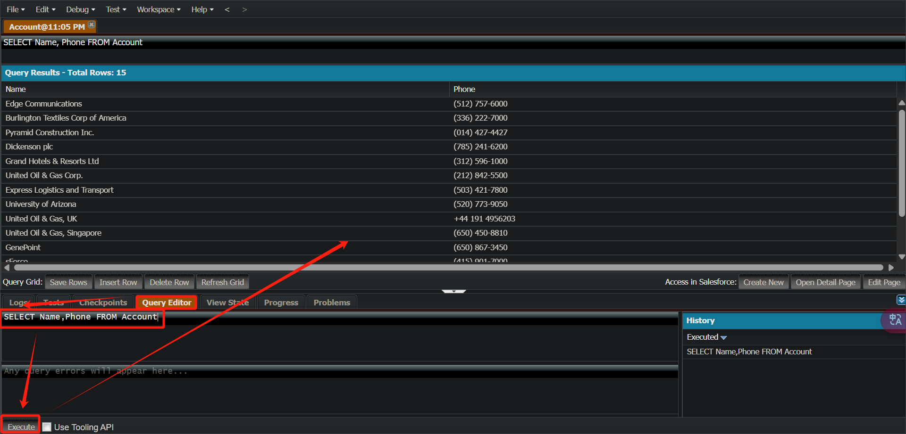
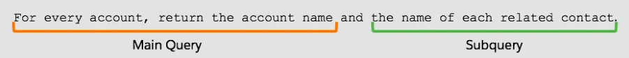
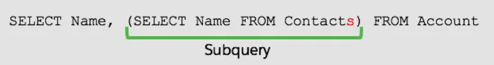

Apex is a **strongly-typed**, **object-oriented** programming language developed by Salesforce for building applications on the Salesforce platform. It is similar to Java and C# in syntax. Apex is saved, compiled, and executed on the server—the Lightning Platform.

Apex 是 Salesforce 提供的一种**强类型**、**面向对象**编程语言，专门用于在 Salesforce 平台上进行后端逻辑开发，它的语法类似于 Java。

- [Apex Developer Guide](https://developer.salesforce.com/docs/atlas.en-us.apexcode.meta/apexcode/apex_dev_guide.htm)

- [Apex Reference Guide](https://developer.salesforce.com/docs/atlas.en-us.apexref.meta/apexref/apex_ref_guide.htm)

# Apex 基础

## 运行环境

- **Developer Console**: **Quick access menu ()** > **Developer Console**
- **VS Code**

## 代码规范

- 同 java

## 标识符

- 同 java

## 注释

- 同 java


## 声明变量

- **声明基本类型变量**

    ```java
    数据类型 变量名 = 初始值;
    ```

    ```java
    Integer myInteger = 10;  // 声明一个整数并赋初值
    ```

- **声明数组类型变量**

    ```java
    String[] colors = new List<String>();
    ```

- **声明集合类型变量**

    ```java
    集合类型<数据类型> 变量名 = new 集合类型<数据类型>();
    ```

    ```java
    List<String> myList = new List<String>();   // 声明一个 String 类型的列表
    Set<Integer> mySet = new Set<Integer>();    // 声明一个 Integer 类型的集合
    Map<String, Integer> myMap = new Map<String, Integer>(); // 声明一个 Map，键为 String，值Integer
    ```

- **声明自定义对象类型变量**

    ```java
    对象类型 变量名 = new 对象类型(字段 = 字段的值);
    ```

    ```java
    Account myAccount = new Account(Name = 'Acme Corp');  // 声明一个 Account 对象并初始化
    ```

## 输入与输出

- **输出**

    ```java
    System.debug('这是要输出的信息');
    ```

## Quick Start

- Sample in Trailhead: [Quick Start: Apex](https://trailhead.salesforce.com/content/learn/projects/quickstart-apex).
- Create a new TP : **Quick Start: Apex - learning**

### Create an Apex Class with Developer Console

- Click the **setup gear**  and select **Developer Console**.

- Click **File | New | Apex Class**.

- For **Class Name**, enter `OlderAccountsUtility` and then click **OK**.

- The code in your editor looks like this:

    ```java
    public class OlderAccountsUtility {
    }
    ```

### Add a Method to the Class

- In the body of the **OlderAccountsUtility** class (the information between the curly brackets), copy and paste the following method.

    ```java
    public class OlderAccountsUtility {
        public static void updateOlderAccounts() {
          // Get the 5 oldest accounts
          Account[] oldAccounts = [SELECT Id, Description FROM Account ORDER BY CreatedDate ASC LIMIT 5];
          // loop through them and update the Description field
          for (Account acct : oldAccounts) {
              acct.Description = 'Heritage Account';
          }
          // save the change you made
          update oldAccounts;
        }
    }
    ```

- Click **File | Save**.

### Invoke and Test the Code

- An anonymous block is Apex code that does **not get stored**, but can be compiled and executed on demand right from the Developer Console. This is a great way to test your Apex Classes or run sample code.

- In the **Developer Console**, Click **Debug | Open Execute Anonymous Window**.

- In the **Enter Apex Code** window, enter the following:

    ```java
    OlderAccountsUtility.updateOlderAccounts();
    ```

- At the bottom right, click **Execute**.

### Verify the Updated Accounts

- Select **Sales** from **App Launcher**.
- Click the **Accounts** tab.
- Select **All Accounts**.
- Click the **gear icon**  and select **Select Fields to Display**. Move **Last Modified Date** to the **Visible Fields** column, and then click **Save**.
- Click one of the five most recently modified account records (use the **Last Modified Date** to find these accounts).
- Click **Details**.
- Look for the **Description** field. The value should be: **Heritage Account**.

# [数据类型](https://developer.salesforce.com/docs/atlas.en-us.apexcode.meta/apexcode/langCon_apex_data_types.htm)

## 数据类型分类

- [Primitive Data Types (14)](https://developer.salesforce.com/docs/atlas.en-us.apexcode.meta/apexcode/langCon_apex_primitives.htm)
    - **整型**：Integer，Long，Decimal
    - **浮点型**：Double
    - **字符串**：String
    - **布尔型**：Boolean
    - **日期和时间**：Date，Datetime，Time
    - **对象**：Object
    - **ID**：ID
    - **二进制**：Blob
    - **非标准原始数据类型**：AnyType，Currency
- [Collections](https://developer.salesforce.com/docs/atlas.en-us.apexcode.meta/apexcode/langCon_apex_collections.htm)
    - **列表**：List
    - **集合**：Set
    - **映射**：Map
- [**枚举**：Enum](https://developer.salesforce.com/docs/atlas.en-us.apexcode.meta/apexcode/langCon_apex_enums.htm)

## String

- 与 Java 不同，Apex 字符串支持使用比较运算符 == 、 != 、 < 、 <= > 和 >= 。由于 Apex 使用 SOQL 比较语义，因此字符串的结果根据上下文用户的区域设置进行整理，并且不区分大小写。有关更多信息，请参阅[表达式运算符](https://developer.salesforce.com/docs/atlas.en-us.254.0.apexcode.meta/apexcode/langCon_apex_expressions_operators_understanding.htm)。
- **边界标记**：使用单引号 `'` 标记字符串。

### 字符串方法

- [字符串的方法](https://developer.salesforce.com/docs/atlas.en-us.254.0.apexref.meta/apexref/apex_methods_system_string.htm)

## List

- In Apex, **lists** hold an **ordered collection** of data of the **same type**.

### Declare List

```java
// 列表式声明
List<String> myList = new List<String>();

// 数组式声明
String[] myList = new List<String>();

// 限制列表长度
new List<String>[长度值];
```

```java
List<String> colors = new List<String> { 'red', 'green', 'blue' };
```

### [List 方法](https://developer.salesforce.com/docs/atlas.en-us.254.0.apexref.meta/apexref/apex_methods_system_list.htm)

```java
myList.get(索引);  // 获取元素
myList.add(元素);  // 追加（可突破列表长度限制）
myList.set(索引, 元素);  // 根据索引替换（不可突破列表长度限制）
myList[索引] = 元素;  // 根据索引替换（不可突破列表长度限制）
myList.clear();  // 清空
myList.sort();  // 排序
```

### [排序](https://developer.salesforce.com/docs/atlas.en-us.apexcode.meta/apexcode/langCon_apex_collections_lists_sorting.htm)

- 语法

    ```java
    myList.sort();
    ```

- 对 SelectOption 元素进行排序时，优先使用 value 字段，如果相同，则再使用 label 字段。

    ```java
    List<SelectOption> options = new List<SelectOption>();
    options.add(new SelectOption('A','United States'));
    options.add(new SelectOption('C','Canada'));
    options.add(new SelectOption('A','Mexico'));
    System.debug('Before sorting: ' + options);
    options.sort();
    System.debug('After sorting: ' + options);
    ```

## Boolean

## 引用数据类型

引用数据类型是指存储对象的引用而不是数据本身。Apex 的引用数据类型包括类、接口、数组、集合以及 Salesforce 特有的 sObject 类型。

### sObject 类型

Each Salesforce record is represented as an **sObject** before it is inserted into Salesforce.

**Create sObject Variables**

- To create an sObject, you need to declare a variable and assign an sObject instance to it. The data type of the variable is sObject.

    ```java
    Account acct = new Account(Name='Acme');
    ```

**sObject and Field Names**

- Apex references standard or custom sObjects and their fields using their unique **API names**.
- API names of object and fields can **differ** from their labels. For example, the Employees field has a label of **Employees** and appears on the account record page as **Employees** but its API name is **NumberOfEmployees**. To access this field in Apex, you’ll need to use the API name for the field: **NumberOfEmployees**.
- **Find API Name**: **Setup** > **Object Manager** > Click object's name

- **API Name Suffix**
    - For **custom objects** and **custom fields**, the API name always ends with **__c**.

    - For **custom relationship fields**, the API name ends with **__r**.

**Create sObjects and Add Fields**

- Create sObjects

    ```java
    Account acct = new Account();
    ```

- Two ways to add fields: **constructor** or **dot notation**.

    ```java
    // 1. Add fields with constructor.
    Account acct = new Account(Name='Acme', Phone='(415)555-1212', NumberOfEmployees=100);
    
    // 2. Add fields with dot notation.
    Account acct = new Account();
    acct.Name = 'Acme';
    acct.Phone = '(415)555-1212';
    acct.NumberOfEmployees = 100;
    ```


**Generic sObject Data Type**

- You can use the **generic sObject data type** when you don’t know the type of sObject your method is handling.

- Variables that are declared with the generic sObject data type can reference **any** Salesforce record.

    

    ```java
    sObject sobj1 = new Account(Name='Trailhead');
    sObject sobj2 = new Book__c(Name='Workbook 1');
    ```

- The generic sObject is **not** able to access fields using dot notation. Need to **cast** your generic sObject variable to a specific sObject type.

    ```java
    // Cast a generic sObject to an Account
    Account acct = (Account)myGenericSObject;
    // Now, you can use the dot notation to access fields on Account
    String name = acct.Name;
    String phone = acct.Phone;
    ```

- The fields of a generic sObject can be accessed only through the `put()` and `get()` methods.

### 数组类型

数组用于存储一组不同类型的元素。Apex 中的数组可以存储对象、基本数据类型等。

### 类和对象

Apex 支持面向对象编程，可以创建类并实例化对象。

### 接口类型

Apex 支持接口（`interface`），可以定义一些方法，然后让类去实现这些方法。

### 枚举类型

Apex 支持枚举（`enum`），枚举用于表示一组常量。

# 选择结构

Apex 中有 `if`、`switch` 和 `三元表达式` 三种选择结构。

## if 语句

- Apex 中 `if` 语句的语法格式与 Java 相同。

## switch 语句

- Apex 的 `switch` 语句类似于 Java，但语法稍有不同。
    - Apex 使用 `switch on` 进行变量匹配.
    - Apex 使用 `when` 关键字代替 Java 的 `case`。
    - Apex 的 `switch` 不会发生 Java 中的 Fall-through（贯穿），每个 `when` 代码块都是独立的，不需要 `break`。
    - Apex 使用 `when else` 关键字代替 Java 的 `default`。

- **语法**

    ```java
    switch on 条件值 {
        when 值1 {
            // 执行代码
        }
        when 值2 {
            // 执行代码
        }
        when else {
            // 处理默认情况（类似 Java 的 default）
        }
    }
    ```

    ```java
    String status = 'Processing';
    
    switch on status {
        when 'New' {
            System.debug('订单是新的');
        }
        when 'Processing' {
            System.debug('订单正在处理中');
        }
        when 'Completed' {
            System.debug('订单已完成');
        }
        when else {
            System.debug('未知订单状态');
        }
    }
    ```

- **多值匹配**

    ```java
    Integer day = 6;
    
    switch on day {
        when 1, 2, 3, 4, 5 {
            System.debug('工作日');
        }
        when 6, 7 {
            System.debug('周末');
        }
        when else {
            System.debug('未知');
        }
    }
    ```

## 三元表达式

- Apex 的三元表达式语法和 Java 相同，但 **适用范围** 和 **类型推导** 上有一些不同。

# 循环结构

- Apex 中有 `for` 、`for-each`、`while`  和 `do-while` 四种循环结构，用法同 Java。
- Apex 中支持**无限循环**和**循环嵌套**，用法同 Java。

# 跳转结构

- Apex 中有 `continue`、`break`、`return`、`throw`、`throws` 五种跳转结构，用法同 Java。

# Class

## Create and Deploy an Apex Class with VS Code

- Sample in Trailhead: [Create and Deploy the Apex Class](https://trailhead.salesforce.com/content/learn/projects/get-started-with-salesforce-development/write-business-logic-in-apex).

- Based on the project : [Create a New Salesforce Project](https://trailhead.salesforce.com/content/learn/projects/get-started-with-salesforce-development/get-ready-to-develop?trail_id=force_com_dev_beginner).

- In VS Code, under the folder **force-app/main/default**, right-click **classes** and select **SFDX: Create Apex Class**.

- Name the class `HouseService`. Click **Enter**.

- The initial code is as follows:

    ```java
    public with sharing class HouseService {
        public HouseService() {
    
        }
    }
    ```

- Replace with the following and save:

    ```java
    public with sharing class HouseService {
        @AuraEnabled(cacheable=true)
        public static List<House__c> getRecords() {
            try {
                // Create a list of House records from a SOQL query
                List<House__c> lstHouses = [
                    SELECT
                       Id,
                       Name,
                       Address__c,
                       State__c,
                       City__c,
                       Zip__c
                       FROM House__c
                       WITH USER_MODE
                       ORDER BY CreatedDate
                       LIMIT 10
                    ];
                      return lstHouses;
            }
            // Code to handle exception
            catch (Exception e) {
               throw new AuraHandledException(e.getMessage());
            }
        }
    }
    ```

- Right-click **HouseService.cls** and select **SFDX: Deploy This Source to Org**. You see a confirmation message that the Apex class successfully deployed to the org.

- Create an anonymous script to test **getRecords()**.

    - Create a new file named **dreamhouseapp.apex** in the **scripts/apex** folder.

    - Tyoe the following:

        ```java
        System.debug(HouseService.getRecords());
        ```

    - Click **Execute**.

    - Check the query results in the **output panel** shown below. 

        

## Call a Static Method

- 使用 static 声明方法

    ```java
    public class EmailManager {
        // 使用 static 声明方法
        public static void sendMail(String address, String subject, String body) {
            // Create an email message object
        }
    }
    ```

    ```java
    // 直接使用类名调用方法
    EmailManager.sendMail('Your email address', 'Trailhead Tutorial', '123 body');
    ```

- 不使用 static 声明方法

    ```java
    public class EmailManager {
        // 不使用 static 声明方法
        public void sendMail(String address, String subject, String body) {
            // Create an email message object
        }
    }
    ```

    ```java
    EmailManager em = new EmailManager();
    em.sendMail('Your email address', 'Trailhead Tutorial', '123 body');
    ```

# Developer Console

## Excute

### Excute Anonymous Window

- **Setup | Developer Console** > **Debug | Open Excute Anonymous Window**

### Excute Logs

- **Debug Only**: Only for `System.debug()` statements.

## Query Editor

- **Query Editor** is a tool to edit SOQL and SOSL.

- **Setup | Developer Console** > **Query Editor**

    

- **Setup | Developer Console** > **File | Open** > **Objects | Contact**

    
    
    

# DML

**DML** (Data Manipulation Language) is used to manipulate the data in Salesforce.

- [Apex DML Statements](https://developer.salesforce.com/docs/atlas.en-us.apexref.meta/apexref/apex_dml_section.htm#apex_dml)

    - `insert`：Adds sObjects
    - `update`：Modify the existing sObject
    - `upsert`：Insert or update
    - `delete`：Delete the existing sObject
    - `undelete`：Restore the existing sObject
    - `merge`：合并至多三个记录到其中一个记录

- The DML statements are analogous to the statement in SQL.

## [Insert](https://developer.salesforce.com/docs/atlas.en-us.apexref.meta/apexref/apex_dml_section.htm#apex_dml_insert)

- The **insert** DML operation adds one or more sObjects.

- **Syntax**

    ```java
    insert sObject
    insert sObject[]
    ```

    ```java
    Account newAcct = new Account(name = 'Acme');
    try {
       insert newAcct;
    } catch (DmlException e) {
    // Process exception here
    }
    ```

## [Update](https://developer.salesforce.com/docs/atlas.en-us.apexref.meta/apexref/apex_dml_section.htm#apex_dml_update)

- The **update** DML operation modifies one or more existing sObject records.

- **Syntax**

    ```java
    update sObject
    update sObject[]
    ```

    ```java
    Account a = new Account(Name='Acme2');
    insert(a);
    
    Account myAcct = [SELECT Id, Name, BillingCity FROM Account WHERE Id = :a.Id];
    myAcct.BillingCity = 'San Francisco'; 
    
    try {
        update myAcct;
    } catch (DmlException e) {
        // Process exception here
    }
    ```

## [Upsert](https://developer.salesforce.com/docs/atlas.en-us.apexref.meta/apexref/apex_dml_section.htm#apex_dml_upsert)

- The **upsert** DML operation **creates** new records or **updates** sObject records, using the ID field if no field is specified, or a specified field to determine the presence of existing objects.

- How Upsert Chooses to Insert or Update

    - Upsert uses the sObject record's primary key (the ID), an idLookup field, or an external ID field to determine whether it should create a record or update an existing one:
    - If the key isn’t matched, a new object record is created.
    - If the key is matched once, the existing object record is updated.
    - If the key is matched multiple times, an error is generated and the object record isn’t inserted or updated.

- **Syntax**

    ```java
    upsert sObject[opt_field]
    upsert sObject[][opt_field]
    ```

    ```java
    // -------------Upsert based on ID-------------
    List<Account> acctList = new List<Account>();
    // Fill the accounts list with some accounts
    
    try {
        upsert acctList;
    } catch (DmlException e) {
       
    }
    ```

    ```java
    // -------------Upsert based on custom fields-------------
    // 1. Upsert based on an external ID field
    List<Account> acctList = new List<Account>();
    // Fill the accounts list with some accounts
    
    try {
        // Upsert based on an external ID field
        upsert acctList myExtIDField__c;
    } catch (DmlException e) {
       
    }
    
    
    // 2. Upsert based on the custom field Email
    Contact jane2 = new Contact(FirstName='Jane',
                             LastName='Smith',
                             Email='jane.smith@example.com',
                             Description='Prefers to be contacted by email.');
    
    upsert jane2 Contact.fields.Email;
    ```

## [Delete](https://developer.salesforce.com/docs/atlas.en-us.apexref.meta/apexref/apex_dml_section.htm#apex_dml_delete)

- The **delete** DML operation deletes one or more existing sObject records.

- **Syntax**

    ```java
    delete sObject
    delete sObject[]
    ```

    ```java
    Account[] doomedAccts = [SELECT Id, Name FROM Account 
                             WHERE Name = 'DotCom']; 
    try {
        delete doomedAccts;
    } catch (DmlException e) {
        // Process exception here
    }
    ```

## [Undelete](https://developer.salesforce.com/docs/atlas.en-us.apexref.meta/apexref/apex_dml_section.htm#apex_dml_undelete)

- The **undelete** DML operation restores one or more existing sObject records.

- **Syntax**

    ```java
    undelete sObject | ID
    undelete sObject[] | ID[]
    ```

    ```java
    Account[] savedAccts = [SELECT Id, Name FROM Account WHERE Name = 'Universal Containers' ALL ROWS]; 
    try {
        undelete savedAccts;
    } catch (DmlException e) {
        // Process exception here
    }
    ```

## [Merge](https://developer.salesforce.com/docs/atlas.en-us.apexref.meta/apexref/apex_dml_section.htm#apex_dml_merge)

- The **merge** statement merges up to three records of the same sObject type into one of the records, deleting the others, and re-parenting any related records.

- **Syntax**

    ```java
    // The first parameter represents the master record into which the other records are to be merged.
    merge sObject sObject
    merge sObject sObject[]
    merge sObject ID
    merge sObject ID[]
    ```
    
    ```java
    List<Account> ls = new List<Account>{new Account(name='Acme Inc.'),new Account(name='Acme')};
    insert ls;
    Account masterAcct = [SELECT Id, Name FROM Account WHERE Name = 'Acme Inc.' LIMIT 1];
    Account mergeAcct = [SELECT Id, Name FROM Account WHERE Name = 'Acme' LIMIT 1];
    try {
        merge masterAcct mergeAcct;
    } catch (DmlException e) {
        // Process exception here
    }
    ```

## [获取 ID](https://trailhead.salesforce.com/content/learn/modules/apex_database/apex_database_dml)

插入记录时，系统会为每条记录分配一个 ID。除了在数据库中保留 ID 值外，ID 值还会自动填充到您在 DML 调用中用作参数的 sObject 变量上。

- **语法**

    ```java
    Account acct = new Account(Name='Acme', Phone='(415)555-1212', NumberOfEmployees=100);
    insert acct;
    
    // Get the new ID on the inserted sObject argument
    ID acctID = acct.Id;
    // Display this ID in the debug log
    System.debug('ID = ' + acctID);
    // Debug log result (the ID will be different in your case)
    // DEBUG|ID = 001D000000JmKkeIAF
    ```

## [DML Bulk](https://trailhead.salesforce.com/content/learn/modules/apex_database/apex_database_dml?trail_id=force_com_dev_beginner)

- 批量处理有助于节约资源。

- **语法**

    ```java
    List<Contact> conList = new List<Contact> {
        new Contact(FirstName='Joe',LastName='Smith',Department='Finance'),
            new Contact(FirstName='Kathy',LastName='Smith',Department='Technology'),
            new Contact(FirstName='Caroline',LastName='Roth',Department='Finance'),
            new Contact(FirstName='Kim',LastName='Shain',Department='Education')};
    // Bulk insert all contacts with one DML call
    insert conList;
    // List to hold the new contacts to update
    List<Contact> listToUpdate = new List<Contact>();
    // Iterate through the list and add a title only
    //   if the department is Finance
    for(Contact con : conList) {
        if (con.Department == 'Finance') {
            con.Title = 'Financial analyst';
            // Add updated contact sObject to the list.
            listToUpdate.add(con);
        }
    }
    // Bulk update all contacts with one DML call
    update listToUpdate;
    ```

## [DML Exceptions](https://trailhead.salesforce.com/content/learn/modules/apex_database/apex_database_dml)

- **语法**

    ```java
    try {
        // This causes an exception because
        //   the required Name field is not provided.
        Account acct = new Account();
        // Insert the account
        insert acct;
    } catch (DmlException e) {
        System.debug('A DML exception has occurred: ' +
                    e.getMessage());
    }
    ```

## [Database Methods](https://trailhead.salesforce.com/content/learn/modules/apex_database/apex_database_dml)

- Apex 包含内置的 Database 类，该类提供的方法可代替对应的 DML 语句。

    - `Database.insert()`

    - `Database.update()`

    - `Database.upsert()`

    - `Database.delete()`

    - `Database.undelete()`

    - `Database.merge()`

    - 例如，以下方法等效于 `insert recordList;` 语句。

        ```java
        Database.insert(recordList);
        ```

- **allOrNone**

    - Database 方法具有可选的 allOrNone 参数，该参数允许您指定操作是否可以部分成功。
    - 该参数默认为 `true`，即**不提交**成功的记录，并且任何记录发生错误时，立即返回失败记录的错误；等同于正常流程的 DML 语句。
    - 当该参数设置为 `false` 时，**提交**成功的记录，并且如果部分记录发生错误，则返回失败记录的错误；这是 Database 方法和 DML 语句的区别。
    - 此外，partial success 选项不会引发异常。
    - 以下是调用 `insert` 方法，并将 allOrNone 设置为 `false`。

        ```java
        Database.insert(recordList, false);
        ```

- database 的返回值

    - Database 方法会返回一个对象，这个对象包含每条记录的成功或失败的信息。
    - Insert 返回 `Database.SaveResult` 对象；
    - Upsert 返回 `Database.UpsertResult` 对象；
    - Delete 返回 `Database.DeleteResult` 对象。
    - 例如，insert 返回 `Database.SaveResult` 对象的数组。

        ```java
        Database.SaveResult[] results = Database.insert(recordList, false);
        ```

- **综合示例**：使用 Database 方法，并且有一条记录会返回错误信息。

    ```java
    // Create a list of contacts
    List<Contact> conList = new List<Contact> {
            new Contact(FirstName='Joe',LastName='Smith',Department='Finance'),
            new Contact(FirstName='Kathy',LastName='Smith',Department='Technology'),
            new Contact(FirstName='Caroline',LastName='Roth',Department='Finance'),
            new Contact()};
    
    // Bulk insert all contacts with one DML call
    Database.SaveResult[] srList = Database.insert(conList, false);
    
    // Debug logs: Iterate through each returned result
    for (Database.SaveResult sr : srList) {
        if (sr.isSuccess()) {
            // Operation was successful, so get the ID of the record that was processed
            System.debug('Successfully inserted contact. Contact ID: ' + sr.getId());
        } else {
            // Operation failed, so get all errors
            for(Database.Error err : sr.getErrors()) {
                System.debug('The following error has occurred.');
                System.debug(err.getStatusCode() + ': ' + err.getMessage());
                System.debug('Contact fields that affected this error: ' + err.getFields());
    	 }
        }
    }
    ```

## [Work with Related Records](https://trailhead.salesforce.com/content/learn/modules/apex_database/apex_database_dml#work-with-related-records)

### Insert Related Records

- **示例**

    ```java
    Account acct = new Account(Name='SFDC Account');
    insert acct;
    // Once the account is inserted, the sObject will be populated with an ID.
    // Get this ID.
    ID acctID = acct.ID;
    // Add a contact to this account.
    Contact mario = new Contact(
        FirstName='Mario',
        LastName='Ruiz',
        Phone='415.555.1212',
        AccountId=acctID);
    insert mario;
    ```

### Update Related Records

- **示例**

    ```java
    // Query for the contact, which has been associated with an account.
    Contact queriedContact = [SELECT Account.Name
                              FROM Contact
                              WHERE FirstName = 'Mario' AND LastName='Ruiz'
                              LIMIT 1];
    // Update the contact's phone number
    queriedContact.Phone = '(415)555-1213';
    // Update the related account industry
    queriedContact.Account.Industry = 'Technology';
    // Make two separate calls
    // 1. This call is to update the contact's phone.
    update queriedContact;
    // 2. This call is to update the related account's Industry field.
    update queriedContact.Account;
    ```

### Delete Related Records

- 该操作会串联删除父记录以下的所有子记录。

- **示例**：此示例会删除该 Account 和其相关的 Contact。

    ```java
    Account[] queriedAccounts = [SELECT Id FROM Account WHERE Name='SFDC Account'];
    delete queriedAccounts;
    ```


# [SOQL](https://trailhead.salesforce.com/content/learn/modules/apex_database/apex_database_soql?trail_id=force_com_dev_beginner)

**SOQL** (**S**alesforce **O**bject **Q**uery **L**anguage) 是 Salesforce 专有的查询语言，用于从 Salesforce 数据库中检索数据，语法结构类似于 SQL。SOQL 可以内嵌在 Apex 代码中，即**内联 SOQL**。

- [Get Started with SOQL Queries](https://trailhead.salesforce.com/content/learn/modules/soql-for-admins/get-started-with-soql-queries)

## 注释

- SOQL 不支持 SQL 中的注释。

- SOQL **本身不支持注释**，在 Apex 代码中用 `//` 或 `/* ... */` 记录注释。

    ```sql
    // 这是一个 Apex 代码中的 SOQL 查询
    List<Account> accounts = [ 
        SELECT Id, Name FROM Account
        // WHERE Name = 'Acme'  -- 这里不能直接使用 SOQL 注释
    ];
    ```

## 运行环境

- **Setup Menu** > **Developer Console** > **Query Editor**

    

## SOQL 基础

- SOQL 绝大部分语法与 SQL 相同。
- **不同点**
  
    - 尾缀不加分号 `;`。
    - SOQL 不能使用 `*` 表示所有字段。
    - ...

## 基本示例

- Query Editor

    ```sql
    SELECT Name,Phone FROM Account
    ```

- Embedded in Apex

    ```java
    List<Account> accounts = [SELECT Name, Phone FROM Account];
    ```

- **Notice**: **Name** and **Phone** is the **Field Name**. If the sObject is a custom object, a **__c** suffix should be the end of the **Field Name**.


## 引用变量

- Apex 中的 SOQL 语句可以引用 Apex 代码变量和表达式；

- **语法**：在变量前加冒号 `:`

    ```java
    String targetDepartment = 'Wingo';
    Contact[] techContacts = [SELECT FirstName,LastName
                              FROM Contact WHERE Department=:targetDepartment];
    ```

## Using For Loops to Iterate Through a List

- Sample in Trailhead: [Using For Loops to Iterate Through a List](https://trailhead.salesforce.com/content/learn/modules/soql-for-admins/create-soql-queries-in-apex-classes#using-for-loops-to-iterate-through-a-list)

- **Setup | Developer Console** > **File | New | Apex Class**.

    ```java
    public class ContactUtility {
        public static void viewContacts() {
            List<Contact> listOfContacts = [SELECT FirstName, LastName FROM Contact];
            for(Contact con : listOfContacts) {
                String fullName = 'First Name: ' + con.FirstName + ', Last Name: ' + con.LastName;
                System.debug(fullName);
            }
        }
    }
    ```

- **Setup | Developer Console** > **Debug | Open Execute Anonymous window**

    ```java
    ContactUtility.viewContacts();
    ```

## Query Related Records





### Parent-to-Child Query

- **示例**

    ```java
    Account[] acctsWithContacts = [SELECT Name, (SELECT FirstName,LastName FROM Contacts)
                                   FROM Account
                                   WHERE Name = 'SFDC Computing'];
    // Get child records
    Contact[] cts = acctsWithContacts[0].Contacts;
    System.debug('Name of first associated contact: '
                 + cts[0].FirstName + ', ' + cts[0].LastName);
    ```

- **查询目的**：从 **Account** 对象中筛选出 **Name** 为 **SFDC Computing** 的 Account 记录，同时获取与这些 Account 记录关联的 **Contact** 的 **FirstName** 和 **LastName**。

- `(SELECT FirstName,LastName FROM Contacts)`

    - 括号里的 SELECT 是一个内部子查询，子查询在父查询的结果基础上运行。
    - 内部子查询的 `FROM Contacts` 子句针对关系名称运行，而不是针对 Salesforce 对象名称运行。
    - 也就是说，内部子查询的 Contacts 只是 Name 为 **SFDC Computing** 的 Account 关联的所有 Contact 对象，而不是整个 Salesforce 的 Contact 对象。

- **结果存储**：查询结果存储在 `acctsWithContacts` 数组中，数组中的每个元素都是一个 `Account` 对象，每个 `Account` 对象包含一个 `Contacts` 集合，该集合包含了与该账户关联的所有联系人记录。

### Child-to-Parent Query

- **示例**

    ```java
    Contact[] cts = [SELECT Account.Name FROM Contact
                     WHERE FirstName = 'Carol' AND LastName='Ruiz'];
    Contact carol = cts[0];
    String acctName = carol.Account.Name;
    System.debug('Carol\'s account name is ' + acctName);
    ```

- **查询目的**：从 `Contact` 对象中筛选出 `FirstName` 为 **Carol** 且 `LastName` 为 **Ruiz** 的 Contact 记录，同时获取这些 Contact  记录关联的 `Account` 对象的 `Name` 字段值。

- `SELECT Account.Name`，这里的 Account 是 Contact 记录的一个字段，这个字段会关联到 Contact 记录对应的 Account 对象。

- 整个第一条语句返回的是一个包含多个 Contact 记录的数组，每个记录里包含了 Account 字段，Account 字段又有 Name 字段。

    ```
    [
        {
            "Id": "003000000123456",
            "Account": {
                "Name": "ABC 公司"
            }
        },
        {
            "Id": "003000000789012",
            "Account": {
                "Name": "XYZ 企业"
            }
        }
    ]
    ```


### Child-to-Parent Query of Custom Object

- Sample in Trailhead: [Create a Child-to-Parent Query](https://trailhead.salesforce.com/content/learn/modules/soql-for-admins/create-relationship-queries-with-custom-objects#create-a-child-to-parent-query)
- 对于 Custom Object 的 Query Related Records，有如下特殊说明。
- 如果 **Property__c** 中有一个指向 **Broker__c** 的 Lookup 类型字段
- 那么字段名称应该由 **Broker__c** 改成 **Broker__r**
- 否则使用 **Broker__c.Name** 调用时，无法获取到 Name
- 因为 `SELECT Broker_c FROM Property__c` 获取到的是 Broker 的 ID
- 所以正确的写法应该是： `SELECT Broker_r FROM Property__c`
- 其它用法同 Srandard Object

## Filtered Query

- Sample

    ```sql
    SELECT Name, (SELECT Name FROM Contacts)
    FROM Account
    WHERE Id IN (SELECT AccountId FROM Contact WHERE LastName = 'Forbes')
    ```

- **查询目的**：从 **Account** 对象中筛选出 **Account** 和 **Contact** 的 **Name**，这个 **Contact** 的 **LastName** 为 **Forbes**。

# [SOSL](https://trailhead.salesforce.com/content/learn/modules/apex_database/apex_database_sosl?trail_id=force_com_dev_beginner)

**SOSL**（**S**alesforce **O**bject **S**earch **L**anguage）is used to perform **text searches** in records provided by Salesforce. Use SOSL to search fields across **multiple** standard and custom object records in Salesforce. SOSL is similar to Apache Lucene.

- SOSL 用于在**多个**对象和字段中快速搜索特定的文本字符串，而 SOQL 主要用于查询**单个**对象或对象之间的关系。
- SOSL 默认是一种**模糊**搜索，而 SOQL 默认是一种精准搜索。比如搜索 Digital：
    - SOSL：Digital | The Digital Company
    - SOQL：Digital

## 运行环境

- **Query Editor**：**Setup Menu** > **Developer Console** > **Query Editor**
- **Inline SOSL**: Embedded in Apex.

## 语法结构

SOSL 的基本语法结构如下：在 Query Editor 和 API 中，语法略有不同。

- 在 Query Editor 中，**SearchQuery** 使用花括号 `{}` 包围，且没有尾缀分号。

    ```sql
    FIND {SearchQuery} [IN SearchGroup] [RETURNING ObjectsAndFields]
    ```

- 内嵌在 Apex 中，**SearchQuery** 使用单引号 `‘` 包围

    ```sql
    FIND 'SearchQuery' [IN SearchGroup] [RETURNING ObjectsAndFields]
    ```

    ```java
    String searchQuery = 'SFDC'
    List<List<SObject>> searchList = [FIND :searchQuery IN ALL FIELDS
                                          RETURNING Account(Name), Contact(FirstName,LastName)];
    ```

## SearchQuery

- SearchQuery 是要搜索的文本。
- 必须是一个或多个**完整**的单词，否则不识别。
    - `Hello`：可以搜索到 **Hello world**
    - `Hell`：不可以搜索到 **Hello world**
    - `-` 可分隔多个单词，例如 `1234-5678` 中，`1234` 和 `5678` 被认为是两个单词。

- 如果搜索的是两个单词，字段中包含这两个单词即可，与位置无关。
    - 例如搜索 `The Query`，可以搜索到 `Account: The SFDC Query Man`
- 可以使用逻辑运算符（AND、OR）和括号进行分组。
    - 例如：`FIND {wingo OR man} IN ALL FIELDS RETURNING Account(Name)`

- 搜索文本不区分大小写。
    - 例如：`FIND {wingo} IN ALL FIELDS RETURNING Account(Name)` 等效于 例如：`FIND {WINGO} IN ALL FIELDS RETURNING Account(Name)`

- 通配符
    - `*`：匹配搜索文本中间或末尾的**任意个**字符
    - `?`：匹配搜索文本中间或末尾的**一个**字符

## SearchGroup

- SearchGroup 是要搜索的字段的范围。
- 它是可选的，如果未指定，则默认搜索范围为 **ALL FIELDS**。
- 可以采用以下值之一
    - `ALL FIELDS` `所有字段`
    - `NAME FIELDS` `名称字段`
    - `EMAIL FIELDS` `电子邮件字段`
    - `PHONE FIELDS` `电话字段`
    - `SIDEBAR FIELDS` `侧边栏字段`

## ObjectsAndFields

- ObjectsAndFields 是要在搜索结果中返回的信息，一个或多个 sObject 的列表，以及每个 sObject 中一个或多个字段的列表，其中包含要筛选的可选值。
- 它是可选的，如果未指定，则搜索结果包含找到的所有对象的 ID。

## 其它

- SOSL 同样具有 SQL 的如下功能。
    - **WHERE**: `RETURNING Account(Name, Industry WHERE Industry='Apparel')`
    - **ORDER**: `RETURNING Account(Name, Industry ORDER BY Name)`
    - **LIMIT**: `RETURNING Account(Name, Industry LIMIT 10)`
    - 引用变量（详见 SOQL）

## SOSL Sample

- Sample in Trailhead: [SOSL Apex Example](https://trailhead.salesforce.com/content/learn/modules/apex_database/apex_database_sosl?trail_id=force_com_dev_beginner#sosl-apex-example)

- Based on

    - TP: **Write SOQL Queries**

    - Sample: **Prerequisites**

        ```java
        // Add account and related contact
        Account acct = new Account(
            Name='SFDC Computing',
            Phone='(415)555-1212',
            NumberOfEmployees=50,
            BillingCity='San Francisco');
        insert acct;
        // Once the account is inserted, the sObject will be
        // populated with an ID.
        // Get this ID.
        ID acctID = acct.ID;
        // Add a contact to this account.
        Contact con = new Contact(
            FirstName='Carol',
            LastName='Ruiz',
            Phone='(415)555-1212',
            Department='Wingo',
            AccountId=acctID);
        insert con;
        // Add account with no contact
        Account acct2 = new Account(
            Name='The SFDC Query Man',
            Phone='(310)555-1213',
            NumberOfEmployees=50,
            BillingCity='Los Angeles',
            Description='Expert in wing technologies.');
        insert acct2;
        ```

- Sample

    ```java
    String soslFindClause = 'Wingo OR SFDC';
    List<List<sObject>> searchList = [FIND :soslFindClause IN ALL FIELDS
                        RETURNING Account(Name),Contact(FirstName,LastName,Department)];
    Account[] searchAccounts = (Account[])searchList[0];
    Contact[] searchContacts = (Contact[])searchList[1];
    System.debug('Found the following accounts.');
    for (Account acct : searchAccounts) {
        System.debug(acct.Name);
    }
    System.debug('Found the following contacts.');
    for (Contact cont : searchContacts) {
        System.debug(cont.LastName + ', ' + cont.FirstName);
    }
    ```


# Trigger

## 
