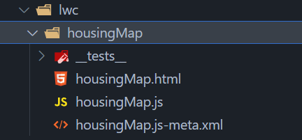
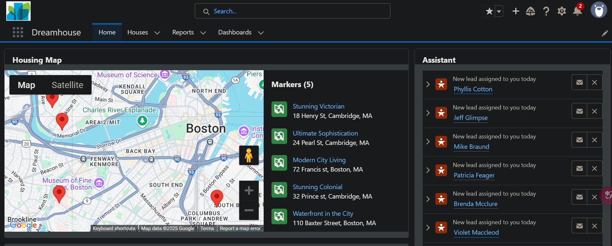

# Lightning Components

Lightning Components is a framework for developing mobile and desktop apps.

You can build Lightning components using two programming models: the **Lightning Web Components** model and the original **Aura Components** model.

## Create an Aura Component

- Sample in Trailhead: [Developer Console Basics | Navigate and Edit Source Code | Create an Aura Component](https://trailhead.salesforce.com/content/learn/modules/developer_console/developer_console_source_code#create-an-aura-component)

# [LWC](https://trailhead.salesforce.com/content/learn/modules/lightning-web-components-basics)

**Lightning web components (LWC)** are custom HTML elements that use the [Web Components](https://developer.mozilla.org/en-US/docs/Web/Web_Components) standards and are built with HTML and JavaScript. A LWC runs in the browser natively and allows developers to customize the out-of-the-box user interface.

- [Lightning Web Components for Visualforce Developers](https://trailhead.salesforce.com/content/learn/modules/lwc-for-visualforce-developers)
- [Component Reference](https://developer.salesforce.com/docs/component-library/overview/components)
- https://www.lightningdesignsystem.com/2e1ef8501/p/355656-patterns
- https://developer.salesforce.com/docs/component-library/overview/components

# HTML

在 **LWC** 中，HTML 负责定义组件的结构和内容。LWC 的 HTML 采用标准的 Web 组件技术，并结合 Salesforce 提供的 **Lightning Base Components**，确保与 Salesforce 平台的无缝集成。

## 基本结构

LWC 组件的 HTML 代码必须放在 `<template>` 根标签内。例如：

```html
<template>
  <div class="container">
    <h1>Hello, LWC!</h1>
    <lightning-button label="Click Me" onclick={handleClick}></lightning-button>
  </div>
</template>
```

## 数据绑定

LWC 使用 **大括号 `{}`** 语法来绑定 JavaScript 中的变量：

```html
<template>
  <p>Hello, {name}!</p>
</template>
```

```javascript
import { LightningElement } from 'lwc';

export default class MyComponent extends LightningElement {
  name = 'Salesforce';
}
```

## 条件渲染

### 静态条件

LWC 提供 `lwc:if` 和 `lwc:else-if` 和 `lwc:else` 进行静态条件渲染：

```html
<template lwc:if={isAdmin}>
  <p>You are an administrator!</p>
</template>
<template lwc:else-if={isUser}>
  <p>You are a regular user.</p>
</template>
<template lwc:else>
  <p>Please log in first.</p>
</template>
```

```java
import { LightningElement } from 'lwc';

export default class ConditionalRendering extends LightningElement {
  isAdmin = false;
  isUser = true;
}
```

### 动态条件

LWC 提供 `if:true` 和 `if:false` 进行动态条件渲染：

```html
<template>
  <template if:true={isVisible}>
    <p>This text is visible!</p>
  </template>
  <template if:false={isVisible}>
    <p>This text is hidden.</p>
  </template>
</template>
```

```javascript
import { LightningElement } from 'lwc';

export default class MyComponent extends LightningElement {
  isVisible = true;
}
```

## 列表渲染

LWC 允许使用 `for:each` 遍历数组：

```html
<template>
  <ul>
    <template for:each={items} for:item="item">
      <li key={item.id}>{item.name}</li>
    </template>
  </ul>
</template>
```

```javascript
import { LightningElement } from 'lwc';

export default class MyComponent extends LightningElement {
  items = [
    { id: 1, name: 'Item A' },
    { id: 2, name: 'Item B' },
    { id: 3, name: 'Item C' }
  ];
}
```

## 事件绑定

LWC 通过标准的 `on` 事件前缀绑定事件处理函数：

```html
<template>
  <button onclick={handleClick}>Click Me</button>
</template>
```

```javascript
import { LightningElement } from 'lwc';

export default class MyComponent extends LightningElement {
  handleClick() {
    alert('Button clicked!');
  }
}
```

## 插槽

LWC 支持 `slot`，允许父组件向子组件传递内容：

**子组件** (`childComponent.html`)

```html
<template>
  <div>
    <h2>Child Component</h2>
    <slot></slot> <!-- 这里是插槽 -->
  </div>
</template>
```

**父组件** (`parentComponent.html`)

```html
<template>
  <c-child-component>
    <p>This content is passed to the child component.</p>
  </c-child-component>
</template>
```

## 引用 HTML 元素

可以通过 `template.querySelector()` 访问 HTML 元素：

```html
<template>
  <input type="text" class="my-input" />
  <button onclick={handleClick}>Get Value</button>
</template>
```

```javascript
export default class MyComponent extends LightningElement {
  handleClick() {
    const inputElement = this.template.querySelector('.my-input');
    alert(inputElement.value);
  }
}
```

# Java Script

在 **LWC** 中，JavaScript 负责 **组件逻辑**、**数据管理** 和 **事件处理**，并与 HTML 进行交互。

## 基本结构

```javascript
import { LightningElement } from 'lwc'; // 导入 LightningElement 基类

export default class MyComponent extends LightningElement { // 定义组件类
  // 具体功能
  message = 'Hello, LWC!'; // 组件的属性

  handleClick() {
    this.message = 'Button Clicked!'; // 修改属性值
  }
}

```

### 导入基类

每个 LWC 组件都需要从 `lwc` 模块导入**基类** `LightningElement`，所有组件都必须继承它：

```javascript
import { LightningElement } from 'lwc';
```

### 定义组件类

```javascript
export default class MyComponent extends LightningElement {
}
```

- `export default class`：导出 LWC 组件，使其可以被 Salesforce 识别并使用。
- `extends LightningElement`：继承 `LightningElement` 以获得 LWC 的功能。

### 组件的属性

在 LWC 中，组件的数据通常通过类的 **属性** 存储：

```java
message = 'Hello, LWC!';
```

然后可以在 HTML 文件中使用 **数据绑定**：

```html
<template>
  <p>{message}</p>  <!-- 绑定 message 变量 -->
</template>
```

当 `message` 发生变化时，LWC 会自动更新 UI。

### 事件处理

LWC 组件中的按钮、输入框等可以触发事件，并通过 JS 处理：

```javascript
handleClick() {
  this.message = 'Button Clicked!';
}
```

HTML 绑定 `onclick` 事件：

```html
<template>
  <p>{message}</p>
  <lightning-button label="Click Me" onclick={handleClick}></lightning-button>
</template>
```

点击按钮后，`handleClick()` 方法会执行，`message` 更新，页面上的文本自动变化。

## 装饰器

### `@api`

在 LWC 中，`@api` 装饰器的作用是使 **子组件类的属性或方法** 变成 **公开属性或方法**，从而允许 **其它组件访问和修改** 这些属性或方法。

- **属性暴露**：使用 `@api` 装饰的属性可以从父组件传递数据到子组件。父组件可以通过在模板中绑定属性的方式，将数据传递给子组件中使用 `@api` 声明的属性，实现组件间的数据通信。
- **方法暴露**：被 `@api` 装饰的方法可以在其他组件中被调用，这使得子组件可以向父组件或其他兄弟组件暴露一些公共的行为或功能，方便在不同组件之间进行交互和协作。

**在子组件中：**

- 在子组件 `childComponent.js` 中，使用 `@api` 让 `name` 变成一个 **可被父组件访问的公开属性**：

    ```javascript
    import { LightningElement, api } from 'lwc';
    
    export default class ChildComponent extends LightningElement {
      @api name = 'Default Name'; // 公开属性，可被父组件访问和赋值
    }
    ```

- 在子组件 HTML 模板中使用 `{name}` 绑定 `name` 变量：

    ```html
    <template>
      <p>Child Component Name: {name}</p>
    </template>
    ```

**在父组件中：**

- 在父组件的 HTML 中使用 `<c-child-component>`，并给 `name` 传递一个值：

    ```html
    <template>
      <c-child-component name="Custom Name"></c-child-component>
    </template>
    ```

- **说明：**

    - `name="Custom Name"` 这一行表示 **父组件** 在 **HTML 中设置子组件的 `name` 值**。
    - LWC 会自动**将 `"Custom Name"` 传递到子组件的 `name` 变量**。

**渲染结果：**

- 当 LWC 渲染 `parentComponent.html` 时，`childComponent.html` 会显示：

    ```html
    <p>Child Component Name: Custom Name</p>
    ```

### `@wire`

`@wire` 用于 **调用 Salesforce 数据** 或 **Apex 方法**：

```javascript
import { LightningElement, wire } from 'lwc';
import { getRecord } from 'lightning/uiRecordApi';

export default class MyComponent extends LightningElement {
  @wire(getRecord, { recordId: '001XXXXXXXXXXXXXXX', fields: ['Account.Name'] })
  account;
}
```

- `@wire` 自动调用 Salesforce API，并把数据存入 `account` 变量。

#### 调用 Salesforce 数据

LWC 提供 `lightning/uiRecordApi`，可以使用 `getRecord()` 来获取 Salesforce 对象（如 Account、Contact 等）的数据。

- **获取 Account 记录**

    ```javascript
    import { LightningElement, wire } from 'lwc';
    import { getRecord } from 'lightning/uiRecordApi';
    
    export default class MyComponent extends LightningElement {
      recordId = '001XXXXXXXXXXXXXXX'; // 假设的 Account 记录 ID
    
      @wire(getRecord, { recordId: '$recordId', fields: ['Account.Name', 'Account.Industry'] })
      account;
    }
    ```

- **说明**

    | 代码                                                         | 作用                                                         |
    | ------------------------------------------------------------ | ------------------------------------------------------------ |
    | `@wire(getRecord, { recordId: '$recordId', fields: [...] })` | 通过 `@wire` **调用 Salesforce API** 并获取 `recordId` 对应的 Account 记录 |
    | `recordId: '$recordId'`                                      | `recordId` 以 `$` 开头，表示它是 **动态绑定的变量**          |
    | `fields: ['Account.Name', 'Account.Industry']`               | 指定要获取的字段                                             |
    | `account`                                                    | **自动存储 API 返回的数据**                                  |

- **使用 `account` 数据**：在 **HTML 文件** 里，可以用 `{account.data}` 访问数据：

    ```html
    <template>
      <template if:true={account.data}>
        <p>Account Name: {account.data.fields.Name.value}</p>
        <p>Industry: {account.data.fields.Industry.value}</p>
      </template>
      <template if:true={account.error}>
        <p>Error fetching record!</p>
      </template>
    </template>
    ```

#### 调用 Apex 方法

**编写 Apex 方法**：

```java
public with sharing class AccountController {
    @AuraEnabled(cacheable=true) // 开启缓存，提高性能
    public static List<Account> getAccounts() {
        return [SELECT Id, Name, Industry FROM Account LIMIT 5];
    }
}
```

**在 LWC 中调用 Apex**：

```javascript
import { LightningElement, wire } from 'lwc';
import getAccounts from '@salesforce/apex/AccountController.getAccounts';

export default class MyComponent extends LightningElement {
  @wire(getAccounts)
  accounts;
}
```

**在 HTML 中显示数据**：

```html
<template>
  <template if:true={accounts.data}>
    <template for:each={accounts.data} for:item="acc">
      <p key={acc.Id}>{acc.Name} - {acc.Industry}</p>
    </template>
  </template>
  <template if:true={accounts.error}>
    <p>Error fetching accounts!</p>
  </template>
</template>

```

## Getter 和 Setter

## 生命周期方法

LWC 组件有多个生命周期钩子，例如：

```javascript
connectedCallback() {
  console.log('组件已加载！');
}
```

**常见生命周期方法**

| 方法                     | 触发时机            |
| ------------------------ | ------------------- |
| `constructor()`          | 组件实例被创建时    |
| `connectedCallback()`    | 组件插入 DOM 时     |
| `renderedCallback()`     | 组件渲染完成后      |
| `disconnectedCallback()` | 组件从 DOM 中移除时 |

## 监听事件

## 组件间通信

# XML

在 LWC 中，XML 为 Salesforce 提供元数据。

- [XML Configuration File Elements](https://developer.salesforce.com/docs/platform/lwc/guide/reference-configuration-tags?-ga=2.133572430.1746469108.1743066462-502386947.1743066462.html)

# LBC

**Lightning Base Components (LBC)** 是 Salesforce 提供的一组 **标准 UI 组件**，用于在 **LWC** 中构建和增强用户界面。

- **官方文档**：Salesforce 提供了 [Lightning Base Components 官方文档](https://developer.salesforce.com/docs/component-library/overview/components)，其中列出了所有可用的组件、属性、方法及示例。
- **Lightning Design System**：可以参考 Salesforce 的 [Lightning Design System](https://www.lightningdesignsystem.com/) 来查看所有组件的设计规范和样式。

## LBC 基础

- 使用驼峰式命名您的组件，例如 `myComponent`。驼峰式组件文件夹名称在标记中映射为短横线分隔式。在标记中，要引用名为 myComponent 的组件，请使用 `<c-my-component>` 。

## LBC 用法

这些组件可以通过 **LWC** 或 **Aura 组件** 中使用，通常以 HTML 标签的形式进行调用。

示例：使用 `lightning-button`

```html
<template>
  <lightning-button label="Click Me" onclick={handleClick}></lightning-button>
</template>

```

```javascript
import { LightningElement } from 'lwc';

export default class MyComponent extends LightningElement {
  handleClick() {
    alert('Button clicked!');
  }
}
```

## LBC 结构

组件只需要一个文件夹和与其同名的文件。它们会根据名称和位置自动链接。

# Components Communication

在 **Lightning Web Components (LWC)** 中，**向上** 和 **向下** 传递数据主要涉及 **父子组件通信**。LWC 遵循 **单向数据流** 原则，即 **数据通常从父组件流向子组件，而事件则从子组件传递到父组件**。

## **向下传递属性**

父组件可以通过 **属性** 将数据传递给子组件。

**关键点**：**`@api`** 修饰符让子组件的 `message` 变量成为公开属性，父组件可以设置它的值。

```html
<!-- parentComponent.html -->
<template>
  <c-child-component message="Hello from Parent"></c-child-component>
</template>
```

```javascript
// childComponent.js
import { LightningElement, api } from 'lwc';

export default class ChildComponent extends LightningElement {
  @api message; // 通过 @api 公开属性以接收数据
}
```

```html
<!-- childComponent.html -->
<template>
  <p>Message from Parent: {message}</p>
</template>
```

## 向下传递方法 

如果子组件需要执行 **父组件提供的方法**，可以使用 `@api` 暴露子组件的方法，供父组件调用。

**关键点**：子组件用 `@api` 公开 `childMethod()`，父组件通过 `this.template.querySelector()` 调用它。

```html
<!-- parentComponent.html -->
<template>
  <c-child-component></c-child-component>
  <button onclick={callChildMethod}>Call Child Method</button>
</template>
```

```javascript
// parentComponent.js
import { LightningElement, api } from 'lwc';

export default class ParentComponent extends LightningElement {
  callChildMethod() {
    this.template.querySelector('c-child-component').childMethod();
  }
}
```

```javascript
// childComponent.js
import { LightningElement, api } from 'lwc';

export default class ChildComponent extends LightningElement {
  @api childMethod() {
    alert('Child method called by Parent!');
  }
}
```

## **向上传递事件**

子组件可以通过 **事件** 向父组件传递数据。

**关键点**：

- 使用 `CustomEvent` 创建事件，`detail` 属性包含传递的数据。
- 通过 `dispatchEvent()` 触发事件，父组件监听 `onmessageevent` 处理数据。

```html
<!-- parentComponent.html -->
<template>
  <c-child-component onmessageevent={handleMessage}></c-child-component>
  <p>Received Message: {receivedMessage}</p>
</template>
```

```javascript
// parentComponent.js
import { LightningElement } from 'lwc';

export default class ParentComponent extends LightningElement {
  receivedMessage = '';

  handleMessage(event) {
    this.receivedMessage = event.detail; // 获取子组件传递的数据
  }
}
```

```javascript
// childComponent.js
import { LightningElement } from 'lwc';

export default class ChildComponent extends LightningElement {
  sendMessage() {
    const event = new CustomEvent('messageevent', {
      detail: 'Hello from Child' // 传递的数据
    });
    this.dispatchEvent(event); // 触发事件
  }
}
```

```javascript
<!-- childComponent.html -->
<template>
  <button onclick={sendMessage}>Send Message</button>
</template>
```

## 兄弟传递

如果两个 **无直接关系的组件**（兄弟组件）需要通信，可以使用 **发布-订阅 (Pub-Sub) 模式**。

使用 `pubsub.js` 作为事件总线

```javascript
// pubsub.js
const callbacks = {};

export const subscribe = (event, callback) => {
  if (!callbacks[event]) {
    callbacks[event] = [];
  }
  callbacks[event].push(callback);
};

export const publish = (event, data) => {
  if (callbacks[event]) {
    callbacks[event].forEach(callback => callback(data));
  }
};
```

兄弟组件 A 触发事件

```javascript
// componentA.js
import { LightningElement } from 'lwc';
import { publish } from 'c/pubsub';

export default class ComponentA extends LightningElement {
  handleClick() {
    publish('eventName', 'Hello from Component A');
  }
}
```

```html
<!-- componentA.html -->
<template>
  <button onclick={handleClick}>Send to B</button>
</template>
```

兄弟组件 B 监听事件

```javascript
// componentB.js
import { LightningElement } from 'lwc';
import { subscribe } from 'c/pubsub';

export default class ComponentB extends LightningElement {
  message = '';

  connectedCallback() {
    subscribe('eventName', (data) => {
      this.message = data;
    });
  }
}
```

```html
<!-- componentB.html -->
<template>
  <p>Message from A: {message}</p>
</template>
```

# Displaying a Component in an Org

[Displaying a Component in an Org](https://trailhead.salesforce.com/content/learn/modules/lightning-web-components-basics/push-lightning-web-component-files?trail_id=force_com_dev_beginner)

You have two options for displaying a Lightning web component in the UI.

1. Set the component to support various flexipage types (home, record home, and so on) then add it to a flexipage using the Lightning App Builder. This is the simplest approach and the one you follow in this unit.
2. You can also create a tab which points to an Aura component containing your Lightning web component. You can see the required pieces in the repo.
    - [Wrapper Components](https://github.com/trailheadapps/lwc-recipes/tree/master/force-app/main/default/aura)
    - [Tabs](https://github.com/trailheadapps/lwc-recipes/tree/master/force-app/main/default/tabs)
    - [Visibility Settings](https://github.com/trailheadapps/lwc-recipes/blob/master/force-app/main/default/permissionsets/recipes.permissionset-meta.xml)
    - [Default application configuration file](https://github.com/trailheadapps/lwc-recipes/blob/master/force-app/main/default/applications/LWC_Recipes.app-meta.xml)

# Build a Reusable UI Component with LWC

- Sample in Trailhead: [Build a Reusable UI Component with Lightning Web Components](https://trailhead.salesforce.com/content/learn/projects/get-started-with-salesforce-development/build-reusable-ui-component-with-lightning-web-components?trail_id=force_com_dev_beginner).
- Based on the project **Dreamhouse**: [Create a New Salesforce Project](https://trailhead.salesforce.com/content/learn/projects/get-started-with-salesforce-development/get-ready-to-develop?trail_id=force_com_dev_beginner).

## Create and Deploy a LWC

- Under the **force-app/main/default** folder, right-click the **lwc** folder and select **SFDX: Create Lightning Web Component**.

- Name the Lightning web component `housingMap` and select the **main/default/lwc** directory.

- You see these files: a HTML file, a JavaScript file, a metadata XML file, and a test.js file.

    

- In the HTML file, **housingMap.html**, copy and paste the following code.

    ```html
    <template>
      <lightning-card title="Housing Map">
        <!-- Explore all the base components via Base component library
        (https://developer.salesforce.com/docs/component-library/overview/components)-->
          <lightning-map map-markers={mapMarkers}> </lightning-map>
      </lightning-card>
    </template>
    ```

- In the JavaScript file, **housingMap.js**, copy and paste the following code.

    ```javascript
    import { LightningElement, wire } from "lwc";
    import getHouses from "@salesforce/apex/HouseService.getRecords";
    export default class HousingMap extends LightningElement {
        mapMarkers;
        error;
        @wire(getHouses)
        wiredHouses({ error, data }) {
            if (data) {
            console.log(data);
        }
      }
    }
    ```

    **Notice**: The Lightning web component invokes the Apex class **HouseService** you wrote in the previous section to fetch the data.

- Next, let's add code to transform the data as needed by the [lightning-map](https://developer.salesforce.com/docs/component-library/bundle/lightning-map/documentation) Base component. Replace the code with the following lines.

    ```javascript
    import { LightningElement, wire } from "lwc";
    import getHouses from "@salesforce/apex/HouseService.getRecords";
    export default class HousingMap extends LightningElement {
        mapMarkers;
        error;
        @wire(getHouses)
        wiredHouses({ error, data }) {
            if (data) {
             // Use JavaScript Map function to transform the Apex method response wired to the component into the format required by lightning-map
              this.mapMarkers = data.map((element) => {
                    return {
                        location: {
                            Street: element.Address__c,
                            City: element.City__c,
                            State: element.State__c
                        },
                        title: element.Name
                    };
                });
                this.error = undefined;
            } else if (error) {
                this.error = error;
                this.mapMarkers = undefined;
            }
        }
    }
    ```

- In the XML file, **housingMap.js-meta.xml**, Replace the code with the following lines.

    ```xml
    <?xml version="1.0" encoding="UTF-8" ?>
    <LightningComponentBundle xmlns="http://soap.sforce.com/2006/04/metadata">
        <apiVersion>63.0</apiVersion>
        <isExposed>true</isExposed>
        <targets>
          <target>lightning__HomePage</target>
        </targets>
    </LightningComponentBundle>
    ```

- Right click and select **SFDX: Deploy This Source to Org**.

## Add the Component to the App Home

- Select **Dreamhouse** from **App Launcher**.

- Click **Home** tab in the top navigation menu.

- Select **Edit Page** from **Setup**.

- Drag the **housingMap** Lightning web component from the **Custom** area of the Lightning Components list to the top of the **Page Canvas**.

    

- Click **Save** > **Activate** > **Assign as Org Default** > **Save** > **Save**.

- Click  to return to the page.

- Refresh the page to view your new component.

    

# Create a Hello World LWC

- Sample in Trailhead: [Create a Hello World Lightning Web Component](https://trailhead.salesforce.com/content/learn/projects/quick-start-lightning-web-components/create-a-hello-world-lightning-web-component)
- A new TP: **Quick Start: Lightning Web Components**

## Create a Salesforce DX Project

- Preconditions
    - Salesforce CLI
    - Salesforce Extension Pack

## Authorize Your Trailhead Playground

- In VS Code, open the Command Palette by pressing **Ctrl+Shift+P**.
- Type `SFDX` and select **SFDX: Authorize an Org**.
- Press **Enter** to accept the Project Default login URL option.
- Press **Enter** to accept the default alias.
- Log in using your Trailhead Playground credentials.

## Create a LWC

- In VS Code, open the Command Palette by pressing **Ctrl+Shift+P**.

- Type `SFDX` and select **SFDX: Create Lightning Web Component**.

- Enter `helloWorld` for the name of the new component.

- Press **Enter** to accept the default `force-app/main/default/lwc.`.

- Press **Enter**.

- View the newly created files in VS Code: a HTML file, a JavaScript file, a metadata XML file.

    

- In the HTML file, `helloWorld.html`, copy and paste the following code.

    ```html
    <template>
      <lightning-card title="HelloWorld" icon-name="custom:custom14">
        <div class="slds-m-around_medium">
          <p>Hello, {greeting}!</p>
          <lightning-input label="Name" value={greeting} onchange={changeHandler}></lightning-input>
        </div>
      </lightning-card>
    </template>
    ```

- In the JavaScript file, `helloWorld.js`, copy and paste the following code.

    ```javascript
    import { LightningElement } from 'lwc';
    export default class HelloWorld extends LightningElement {
            greeting = 'World';
            changeHandler(event) {
            this.greeting = event.target.value;
            }
    }
    ```

- In the XML file `helloWorld.js-meta.xml`, copy and paste the following code.

    ```xml
    <?xml version="1.0" encoding="UTF-8"?>
    <LightningComponentBundle xmlns="http://soap.sforce.com/2006/04/metadata" fqn="helloWorld">
        <apiVersion>58.0</apiVersion>
        <isExposed>true</isExposed>
        <targets>
        <target>lightning__AppPage</target>
        <target>lightning__RecordPage</target>
        <target>lightning__HomePage</target>
        </targets>
    </LightningComponentBundle>
    ```

## Deploy to Your Trailhead Playground

- Right-click the `default` folder under `force-app/main`.
- Click **SFDX: Deploy Source to Org**.

## Add Component to App in Lightning Experience

- In VS Code, open the Command Palette by pressing **Ctrl+Shift+P**.

- Type `SFDX` and select **SFDX: Open Default Org**.  
    This opens your Trailhead Playground in a separate browser.

- **Setup** > **Quick Find**, select **Home** in the **Feature Settings** section.

- For **Advanced Seller Home**, toggle the setting to **Inactive**.

- Select **Sales** from **App Laucher**.

- Click then select **Edit Page**.

- Drag the `helloWorld` Lightning web component from the **Custom** area of the Lightning Components list to the top of the Page Canvas. 

    

- Click **Save** | **Activate** | **Assign as Org Default** | **Save**

- Click **Save** again, then click  to return to the page.

- Click **Home** again to view your new component.