# Salesforce Tools

## Salesforce CLI

**Salesforce CLI** (Command Line Interface) is a command-line tool provided by Salesforce.

**Salesforce CLI command** should be executed in the root directory of project with **PowerShell**.

### [Install Salesforce CLI](https://developer.salesforce.com/docs/atlas.en-us.sfdx_setup.meta/sfdx_setup/sfdx_setup_install_cli.htm)

- [**Windows**](https://developer.salesforce.com/docs/atlas.en-us.sfdx_setup.meta/sfdx_setup/sfdx_setup_install_cli.htm#sfdx_setup_install_cli_windows)

    - Download and install [Salesforce CLI](https://developer.salesforce.com/tools/salesforcecli) from the official website.

    - Confirm that the Salesforce CLI is correctly installed and up to date.

        ```bash
        sf update
        ```

- **Linux**

    - Install the **npm** package manager.

        ```bash
        sudo apt update
        sudo apt install npm -y
        ```

    - Install the **Salesforce CLI** using **npm**.

        ```bash
        sudo npm install -g @salesforce/cli
        ```

- Check the version.

    ```bash
    sf -v
    ```

- Update the CLI.

    ```bash
    sf update
    ```

- After the installation completes, restart your terminal tool or IDE to make sure Salesforce CLI is available.

- **Warning**: Salesforce CLI works best within the native Windows command prompt (cmd.exe) and the Microsoft Windows PowerShell. 


## Salesforce Extension Pack

**Salesforce Extension Pack** is a VS Code Extension.

- **Install Salesforce Extension Pack (Expanded)**

    - Install the **Salesforce Extension Pack (Expanded)** extension in **VS Code**.
    - Press **Ctrl+Shift+P** in VS Code to open the command palette, type `SFDX`, and you can select commands provided by the Salesforce extensions.
    - If you can't find the command in the command palette, try to disable and then re-enable the extension.

- **JDK**

    - Some features of the extension require JDK support, so you need to install JDK. For details, refer to the **Java Notes**.

    - [Configure the full path to the Java runtime for the Apex server:](https://developer.salesforce.com/docs/platform/sfvscode-extensions/guide/java-setup.html)

        - Click the **Settings** button in the bottom-left corner.

        - Search for **apex**.

        - Select the **Salesforcedx-vscode-apex > Java: Home** tab. Then type the following path:

            ```
            C:\\Program Files\\Java\\jdk-21
            ```

## [Developer Console](https://trailhead.salesforce.com/content/learn/modules/developer_console)

The **Developer Console** is a web-based IDE provided by Salesforce.

- Workspace

[What you can do with Developer Console:](https://trailhead.salesforce.com/content/learn/modules/developer_console/developer_console_source_code)

- Execute an Apex Class
- Create an Aura Component
- Create Visualforce Pages and Components
- Create a Visualforce Page

### [Debug Logs](https://trailhead.salesforce.com/content/learn/modules/developer_console/developer_console_logs)

# Organization

## Org Basics

In Salesforce, an **Organization** (**Org**) refers to a specific instance of Salesforce. An Org can be either a **production environment** or a **non-production environment**, and it includes its own **data, users, features, configurations, and customizations**.

Salesforce provides different types of Orgs, including:

- **Trailhead Playground**: Learning ENV.
- **Developer Edition**: Dev ENV.
- **Sandbox (Partial/Full Copy)**: Test ENV with production data.
- **Scratch Org**: Temporary ENV for DevOps.
- **Preview Sandbox**: Test upcoming releases in advance.
- **Production**: Production ENV.

## [Trailhead Playground](https://trailhead.salesforce.com/content/learn/modules/trailhead_playground_management)

### TP Basics

**Trailhead Playground** (**TP**) is a Salesforce-provided, **dedicated learning environment** designed for hands-on practice. 

- **Purpose**: Primarily used for Trailhead courses, challenges, and experiments.
- **Pre-configured**: Some components required by Trailhead courses are pre-installed.
- **Free**
    - Free, with no time limits.
    - Up to 10 TPs at a time.

- **Limitations**: Some advanced features (e.g., API access) may be restricted.

### [Create a TP](https://trailhead.salesforce.com/content/learn/modules/trailhead_playground_management/create-a-trailhead-playground)

- **About language**: If you're using Trailhead in a language other than English, make sure that your playground is set to the same language as the hands-on challenge. Otherwise you may run into issues passing challenges.

- Open the **Trailhead** website.
- Click the **profile icon** in the top-right corner.
- Select **Hands-On Orgs**.
- Click **Create Playground**.
- You‘ll receive an email when your new playground is ready. It may take a few minutes for your new playground to be created.

### [Get TP Username and Password](https://trailhead.salesforce.com/content/learn/modules/trailhead_playground_management/get-your-trailhead-playground-username-and-password)

- **Notice**: The username and password here are specifically for TP, not for Trailhead.
- Accessing TP from within Trailhead does not require a username or password. 
- Accessing TP from outside Trailhead (e.g., **Salesforce CLI** and **VS Code**) requires a username and password.
- Launch a TP.
- Click the **Get Your Login Credentials** tab. Here you can see your **current TP username**. 
- Click **Reset My Password**. This sends an email to the address associated with your username.
- Click the link in the email.
- Enter a new password, confirm it, and click **Change Password**. 

## Developer Edition

### DE Basics

**Developer Edition** (**DE**) is a Salesforce-provided,  **development environment** designed for developers. 

# Objects

## Objects Basics

In Salesforce, **Objects** are **database tables** that store specific types of data. Each object consists of **fields** (columns) and **records** (rows),

Salesforce supports various types of objects, including:

- **Standard Objects**
- **Custom Objects**
- **External Objects**
- **Platform Events**
- **BigObjects**

## Standard Objects

**Standard Objects** in Salesforce are pre-built, out-of-the-box objects to help manage common business processes. 

## Custom Objects

**Custom Objects** in Salesforce are user-defined objects created to store data that is specific to an organization's business needs. 

### Create a Custom Object

#### Custom Object

- Sample in Trailhead: [Create a Custom Object](https://trailhead.salesforce.com/content/learn/modules/data_modeling/objects_intro?trail_id=force_com_dev_beginner)
- Create an Org.
- **Setup** > **Object Manager** > **Create** > **Custom Object**
- For **Label**, enter `Property`. Notice that the **Object Name** and **Record Name** fields auto-fill.
- For **Plural Label**, enter `Properties`.
- Select the checkbox **Launch New Custom Tab Wizard after saving this custom object**.
- Leave the rest of the values as default and click **Save**.
- **New Custom Object Tab**
    - Click the **Tab Style** field and select a style you like.
    - Click **Next**, **Next**, and **Save**.

#### Custom Object from Spreadsheet

- Sample in Trailhead: [Create a House Custom Object](https://trailhead.salesforce.com/content/learn/projects/get-started-with-salesforce-development/create-a-data-model-using-clicks?trail_id=force_com_dev_beginner)
- Download and open [this spreadsheet](https://developer.salesforce.com/files/House.csv) and save it as **House.csv**.
- **Setup** > **Object Manager** > **Create** > **Custom Object from Spreadsheet**
- Click **Login With Salesforce**.
- Login with your username and password of your **org**.
- Click **Allow**. Then upload the **House.csv** file you downloaded.
- Salesforce automatically detects the fields and populates all its record data.
- Choose **House Name** as the Record Name field in the top right.
- Click **Next** and enter the following settings.
    - Label: `House`

    - Plural Label: `Houses`
    - API Name: `House`
- Click **Finish**. The House object is successfully created and data imported, all within minutes.
- Check the new object in the **Object Manager**.
- Check the records:
    - Select **Houses** From **App Launcher**.
    - Click **Recently Viewed**, then select **All Records** to view all of the records in the House object.

- There're some other fertures in the Trailhead sample:
    -  [Data Security](https://trailhead.salesforce.com/content/learn/modules/data_security)
    - REST API
    - [Salesforce APIs Postman collection](https://github.com/forcedotcom/postman-salesforce-apis)
    - [Salesforce Mobile app](https://www.salesforce.com/solutions/mobile/overview/)

- To work with the **House** object you just created, you need to create an **App** to allow easy navigation.
    - Refer to the sample of Trailhead: [Create an App](#Create an App)

## [Object Relationships](https://trailhead.salesforce.com/content/learn/modules/data_modeling/object_relationships?trail_id=force_com_dev_beginner)

**Object Relationships** are a special field type that connects two objects together.

There are two main types of object relationships: **lookup** and **master-detail**.

### Lookup Relationship

A **Lookup Relationship** in Salesforce is a type of relationship where one object can be linked to another object, but it doesn't require the dependent object to be strictly tied to the primary object. 

Similar to a **foreign key**, it allows a non-strict relationship between objects. For example, a **Contact** can be related to an **Account**, but the **Contact** can still exist independently.

#### Create a Lookup Relationship

- Sample in Trailhead: [Create a Lookup Relationship](https://trailhead.salesforce.com/content/learn/modules/data_modeling/object_relationships?trail_id=force_com_dev_beginner)

- Based on:

    - TP: [Optimize Customer Data with Standard and Custom Objects](https://trailhead.salesforce.com/content/learn/modules/data_modeling/objects_intro?trail_id=force_com_dev_beginner)
    - Custom Object **Favorite**: [Create a Custom Object](https://trailhead.salesforce.com/content/learn/modules/data_modeling/object_relationships?trail_id=force_com_dev_beginner)

- From **Setup**, go to **Object Manager** > **Favorite**.

- In the sidebar, click **Fields & Relationships**. 

- Click **New** in the top right.
    - For **data type**, Choose **Lookup Relationship** and click **Next**.
    - For **Related To**, choose **Contact**, then click **Next**.
    - For **Field Name**, enter `Contact`, then click **Next**.
    - Click **Next**, **Next**, **Next**, and **Save**.

- Check the new relationship field **Contact**.

    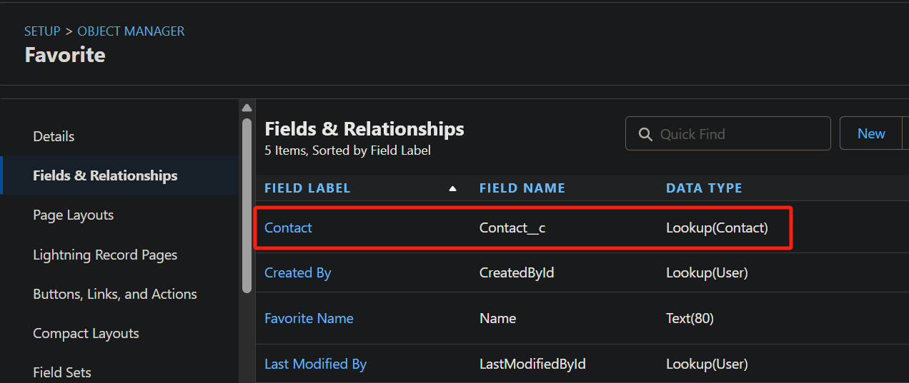

### Master-Detail Relationship

A **Master-Detail Relationship** in Salesforce is a type of relationship. The **Detail Record** is highly dependent on the **Master Record** , and its existence is tied to the **Master**. If a **Master record** is deleted, the associated **Detail records** are also deleted automatically.

#### Create a Master-Detail Relationship

- Sample in Trailhead: [Create a Master-Detail Relationship](https://trailhead.salesforce.com/content/learn/modules/data_modeling/object_relationships?trail_id=force_com_dev_beginner)

- Based on:

    - TP: [Optimize Customer Data with Standard and Custom Objects](https://trailhead.salesforce.com/content/learn/modules/data_modeling/objects_intro?trail_id=force_com_dev_beginner)
        - Custom Object: **Property**
        - Custom Field: **Price**
        - Custom Record: **Jerry's house**
    - Custom Object **Favorite**: [Create a Custom Object](https://trailhead.salesforce.com/content/learn/modules/data_modeling/object_relationships?trail_id=force_com_dev_beginner)

- **Property** is the master and **Favorite** is the detail.

- From **Setup**, select **Object Manager**.

- Select the **detail** object **Favorite**.

- In the sidebar, click **Fields & Relationships**. 

- Click **New** in the top right.

    - For **data type**, Choose **Master-Detail Relationship** and click **Next**.
    - For **Related To**, choose the **master** object **Property**, then click **Next**.
    - Click **Next**, **Next**, and **Save**.

- Check the new relationship field **Property**.

    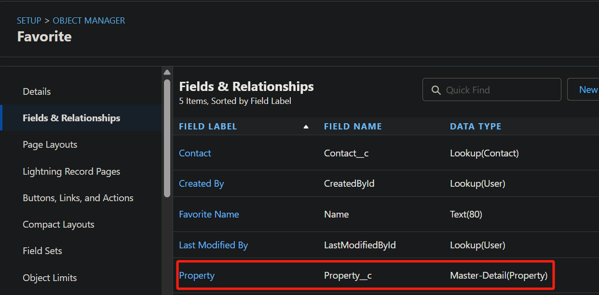

- Add a **Detail Record**

    - From the **App Launcher** select **Sales**.

    - Click the **Properties** tab in the navigation bar.

    - Click the name of a Property record: **Jerry's house**.

    - Click **Related** > **New**.

    - For **Favorite Name**, enter `Jerry's house - Related`, then click **Save**.

        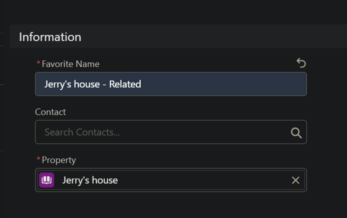

    - The detail record named **Jerry's house - Related** has been related to the master record **Jerry's house** of **Property**.

        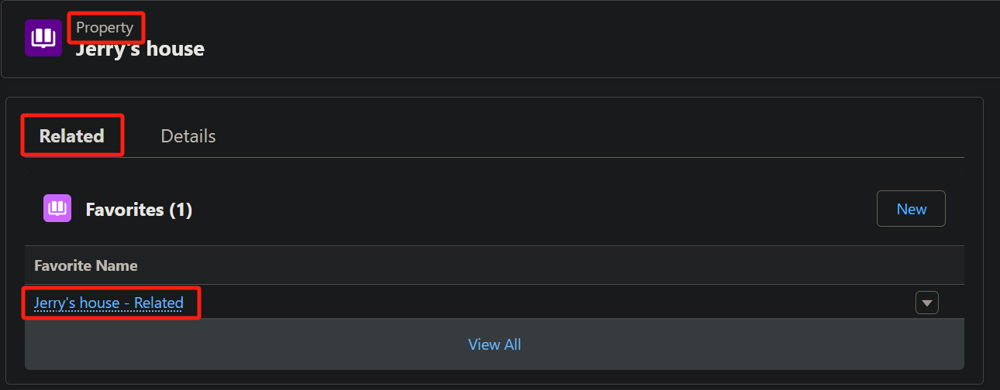

    - The record **Jerry's house - Related** is showed in the object **Favorite**.

        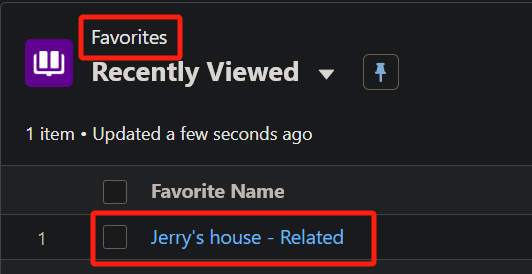

# Fields

## Fields Basics

**Fields** are columns in object database tables. There are **Standard Fields** and **Custom Fields**

**Standard Fields**: These are **pre-defined** fields for standard objects, for example **Name**, **Created Date**, and **Phone**.

**Custom Fields**: Users can create custom fields for both standard and custom objects to capture specific information that the out-of-the-box fields don't cover.

- **Field Name**: `Price__c`, the `__c` suffix is an easy way to identify a custom field.
- **Field Label**: The Field Label is what you see on the \<Object> page.

## Create a Field

- Sample in Trailhead: [Create a Custom Field](https://trailhead.salesforce.com/content/learn/modules/data_modeling/objects_intro?trail_id=force_com_dev_beginner)
- Based on the sample: [Create a Custom Object](https://trailhead.salesforce.com/content/learn/modules/data_modeling/objects_intro?trail_id=force_com_dev_beginner)
- From **Setup**, locate to **Object Manager** > **Property**.
- In the sidebar, click **Fields & Relationships**. 
- Click **New** in the top right.
- For **data type**, select **Currency** and click **Next**.
- Fill out the following:
    - Type `Price` in the **Field Label** field, and **Field Name** field auto-fill.
    - Type `The listed sale price of the home.` in the **Description** field.
    - Check the **Required** box.
- Click **Next**, **Next** again, and then **Save**.
- You’ll see your new **Price** field in the list of **Property** fields.
- Notice that it says **Price\__c**. The “__c” part is an easy way to tell that a particular field is a custom field.

# Records

**Records** are the information the fields store.

## Create a Record

- Sample in Trailhead: [Create a Custom Record](https://trailhead.salesforce.com/content/learn/modules/data_modeling/objects_intro?trail_id=force_com_dev_beginner)

- Based on the sample:

    - [Create a Custom Object](https://trailhead.salesforce.com/content/learn/modules/data_modeling/objects_intro?trail_id=force_com_dev_beginner)
    - [Create a Custom Field](https://trailhead.salesforce.com/content/learn/modules/data_modeling/objects_intro?trail_id=force_com_dev_beginner)

- From the **App Launcher** find and select **Sales**.

- Click the **Properties** tab in the navigation bar. 

- Click **New** in the top corner.

- Enter a name (**Jerry's house**) and price for the Object and click **Save**.

- You’ll see something like the following.

    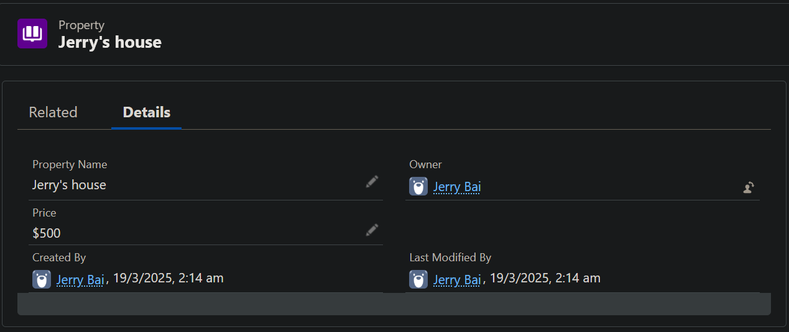

# [Setup](https://trailhead.salesforce.com/content/learn/modules/starting_force_com/starting_tour?trail_id=force_com_dev_beginner)

You can get to Setup from any page in your Salesforce org. From the gear menu at the top of the screen ( ), click **Setup**.

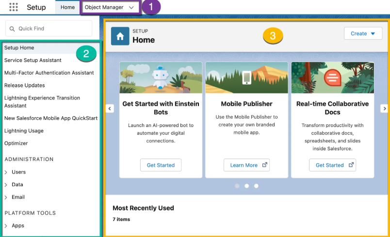

- **Object Manager:** Object Manager is where you can view and customize standard and custom objects in your org.
- **Setup Menu:** The menu gives you quick links to a collection of pages that let you do everything from managing your users to modifying security settings.
- **Main Window:** We’re showing you the Setup home page, but this is where you can see whatever it is you’re trying to work on.

# Lightning Apps

## [Lightning Apps Basics](https://trailhead.salesforce.com/content/learn/modules/lex_customization/lex_customization_apps?trail_id=force_com_dev_beginner)

An **app** is a collection of items that work together to serve a particular function. In Lightning Experience, **Lightning apps** give your users access to sets of objects, tabs, and other items all in one convenient bundle in the navigation bar.

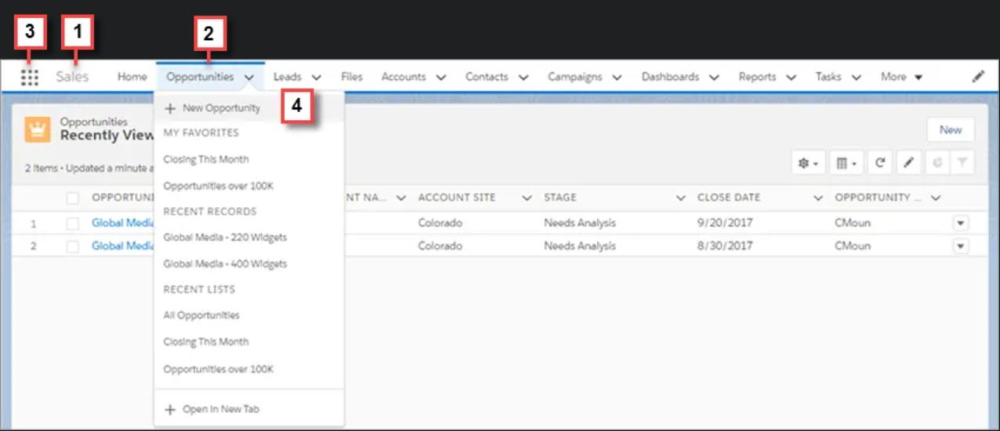

- The app name (1) displays on the left side of the navigation bar and custom colors.
- You can access other items and apps by clicking the **App Launcher** icon (3).

## Install an App

- Sample in Trailhead: [Install the Dreamhouse App](https://trailhead.salesforce.com/content/learn/modules/starting_force_com/starting_intro?trail_id=force_com_dev_beginner)
- Launch a Trailhead Playground.
- Locate to **Playground Starter** from **App Launcher**.
- Click the **Get Your Login Credentials** tab and reset your password.
- Click the **Install a Package** tab. 
- Paste `04tKY000000LOv6YAG` into the **Package ID** field and click **Install**.
- Select **Install for All Users**, then click **Install**.
- When it prompts you to Approve Third-party access, click **Yes** and click **Continue**. This provides updated information to the map in the Dreamhouse App.
- When the installation completes, click **Done**.
- Locate to **Dreamhouse** from **App Launcher**.
- Click the **Settings** tab, then click the **Import Data** button. This populates the app with sample data, including properties, contacts, and brokers.

## Create an App

- Sample in Trailhead: [Create an App](https://trailhead.salesforce.com/content/learn/projects/get-started-with-salesforce-development/create-a-data-model-using-clicks?trail_id=force_com_dev_beginner).
- Based on the project **Dreamhouse**: [Create a New Salesforce Project](https://trailhead.salesforce.com/content/learn/projects/get-started-with-salesforce-development/get-ready-to-develop?trail_id=force_com_dev_beginner).
- From **Setup**, select `App Manager` in the **Quick Find**.
- Click **New Lightning App**.
- In the **App Details & Branding** window, enter these details.
    - For App Name, type `Dreamhouse`.
    - For the Image, download [dreamhouse-logo.png](https://github.com/trailheadapps/dreamhouse-lwc/blob/main/dreamhouse-logo.png) as **dreamhouse-logo.png** and upload it.
    - Click **Next**.
- On the **App Options** screen, select **Standard navigation**, then click **Next**.
- On the **Utility Items** screen, click **Next**.
- On the **Navigation Items** screen, select **Home**, **Houses**, **Reports**, and **Dashboards** from the **Available Items** list, and move them to the **Selected Items** list using the arrow. Ensure you choose the pink **Home** tab. Then click **Next**.
- On the **User Profiles** screen, select **System Administrator**, add it to **Selected Profiles**, and then click **Save & Finish**.
- Select **Dreamhouse** from **App Launcher** to check the new App.

## Sample Apps

- Sample Apps in GitHub: https://github.com/trailheadapps

# CI

- CI in Salesforce Document: [Continuous Integration](https://developer.salesforce.com/docs/atlas.en-us.sfdx_dev.meta/sfdx_dev/sfdx_dev_ci.htm?_ga=2.255431115.2113438160.1742049829-1363362869.1742049829)
- Sample in Trailhead: [GitHub Actions](https://trailhead.salesforce.com/content/learn/projects/quick-start-tour-the-sample-app-gallery/learn-about-sample-app-tooling?trail_id=force_com_dev_beginner)

# [Compact Layouts](https://trailhead.salesforce.com/content/learn/modules/lex_customization/lex_customization_compact_layouts?trail_id=force_com_dev_beginner)

# [Flow Builder](https://trailhead.salesforce.com/content/learn/modules/flow-basics/meet-flow-builder?trail_id=force_com_dev_beginner)

## Creat a Flow Builder

- From **Setup**, select `Flows` in the **Quick Find**.
- To create a flow, click **New Flow**. Then select **Start from Scratch** and click **Next**.
- Select a flow type, click **Create**.

## Build a flow with Flow Builder

- Sample in Trailhead: [Low-code Tools & Automation](https://trailhead.salesforce.com/content/learn/modules/platform-development-basics/develop-without-code-01?trail_id=force_com_dev_beginner).
- From **Setup**, select `Flows` in the **Quick Find**.
- Click the **Create Property** flow.
- Click  to open the Toolbox menu.
- Click  to resize the flow so you can see it all.
- Click **Run**. A **Create Property** form appears to collect details for a new property record.
- Fill out any details you like. Click **Next**, **Next**, and **Finish**.
- Click  to exit Flow Builder.
- Select **Dreamhouse** from **App Launcher**.
- Click the **Properties** tab.
- Click the property you just created in Flow Builder.

## Layout

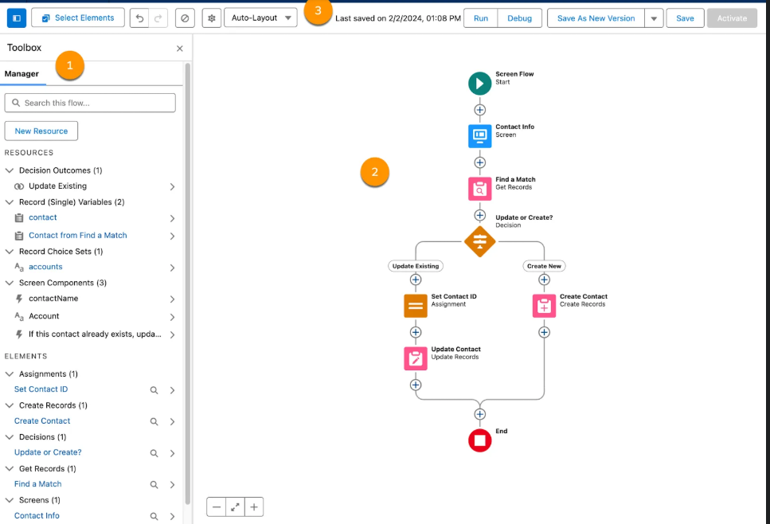

- **Toolbox (1)** : The toolbox lists the elements and resources you’ve built in your flow. You can also create resources such as variables, formulas, and choices to use in your flow.
- **Canvas (2)** : The canvas is the working area.
- **Button Bar (3)**: Provide some tools.

## Building Blocks

- Flows use three building blocks: elements, connectors, and resources.

    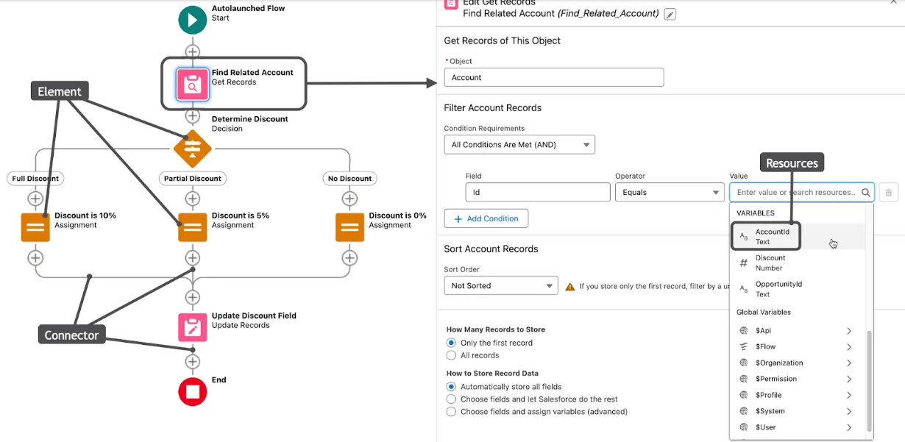

### Elements

- **Elements** are nodes on the canvas that make things happen. To add an element to the canvas, click .
- Each element is a step that tells the flow what to do, and each type of element does something different. 
- Think of flow elements as three types.
    - Interaction
    - Data
    - Logic

### Connectors

- **Connectors** are lines on the canvas that define the path the flow takes when it runs.

### Resources

- **Resources** are containers that don’t appear on the canvas, but are referenced by the flow’s elements. Each resource contains a value or a formula that resolves to a value.

## [Variables](https://trailhead.salesforce.com/content/learn/modules/flow-basics/learn-about-flow-variables)

- **Variable** is a kind of **Resources**.

- **Text**: A string of letters, numbers, and characters.
- **Number, Currency:** A numerical value.
- **Boolean**: A true or false value.
- **Date, Date/Time**: A specially formatted value that indicates a specific date, or a specific time on a specific date. 
- **Record**: All of the values in a Salesforce record, stored together in a single variable.
- ...

### Create a Variable

- From Setup, enter `Flows` in the Quick Find box and then click **Flows**.

- Click **New Flow**.

- Make sure **Start from Scratch** is selected, and click **Next**.

- Select **Screen Flow** and click **Create**.

- Click  to display the Toolbox.

- Click **New Resource**. 

- For Resource Type, select **Variable**.

- Enter an API name and description for your variable.

    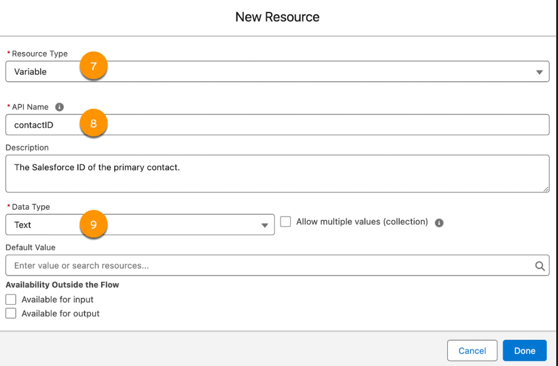

- For Data Type, select **Text**.

## [Constants](https://trailhead.salesforce.com/content/learn/modules/flow-basics/learn-about-flow-variables)

- **Constant** is a kind of **Resources**.

# [Formulas](https://trailhead.salesforce.com/content/learn/modules/point_click_business_logic?trail_id=force_com_dev_beginner)

## [Formulas](https://trailhead.salesforce.com/content/learn/modules/point_click_business_logic/formula_fields?trail_id=force_com_dev_beginner)

### Standard

- Case sensitive.
- Whitespace and line breaks don’t matter.

### Creat Formulas

- **Setup** > **Object Manager** > **Opportunity** > **Fields & Relationships** > **New** > **Formula**
- In **Field Label**, type `Days to Close`. Notice that **Field Name** populates automatically.
- Select the type of data you expect your formula to return.
- Click **Next** until arrive at the formula editor!
- Edit your formula, then click the check button.
- **Put your new formula field in a report.** 
    - From the **App Launcher**, find and open **Reports** and click **New Report**.
    - Enter **Opportunities** in the Search Report Types... field. Select **Opportunities** and click **Start Report**. Your opportunity appears in the Report Preview panel.
    - Make sure **Update Preview Automatically** is enabled.
    - In the Add column... field on the left side of the page, enter `Days to Close`. 
- Find the field `Days to Close`: **App Launcher** > **Opportunities** > **Details**

## [Roll-Up Summary Fields](https://trailhead.salesforce.com/content/learn/modules/point_click_business_logic/roll_up_summary_fields?trail_id=force_com_dev_beginner)

Roll-up summary fields calculate values from a set of related records.

Roll-up summary fields are based on the master side of a master-detail relationship. 

### Creating the Summary Field

- From Setup, open **Object Manager** and click **Account**.
- On the left sidebar, click **Fields & Relationships**.
- Click **New**.
- Choose the **Roll-Up Summary** field type, and click **Next**.
- For Field Label, enter `Sum of Opportunities` and click **Next**.
- The Summarized Object is the detail object that you want to summarize. Choose **Opportunities**.
- Choose the **SUM** Roll-up type and choose **Amount** as the Field to Aggregate. If you're unable to see Amount in Field to Aggregate, disable the Advanced Currency Management in your Currency Setup.
- Click **Next**, **Next**, and **Save**.

##  [Validation Rules](https://trailhead.salesforce.com/content/learn/modules/point_click_business_logic/validation_rules?trail_id=force_com_dev_beginner)

Validation rules verify that data entered by users in records meets the standards you specify before they can save it. 

When the validation rule returns a value of "True", this confirms that the data entered by the user contains an invalid value. 

### Creating a Validation Rule

1. From Setup, go to **Object Manager** and click **Account**.
2. In the left sidebar, click **Validation Rules**.
3. Click **New**.
4. Enter the following properties for your validation rule:
    1. Rule Name: `Account_Number_8_Characters`
    2. Error Condition Formula: `LEN( AccountNumber) <> 8`
5. Error Message: `Account number must be 8 characters long.`
6. To check your formula for errors, click **Check Syntax**.
7. Click **Save** to finish.

# Metadata

Any configuration done in the admin UI can be retrieved as **XML** formatted data (also known as **metadata**) and checked into version control.

[Metadata API](https://developer.salesforce.com/docs/atlas.en-us.api_meta.meta/api_meta/meta_intro.htm)

## Retrieve Metadata from Salesforce to the Local Project

- Sample in Trailhead: [Retrieve Metadata from Salesforce to the Local Project](https://trailhead.salesforce.com/content/learn/projects/get-started-with-salesforce-development/create-a-data-model-using-clicks).
- Based on the project **Dreamhouse**: [Create a New Salesforce Project](https://trailhead.salesforce.com/content/learn/projects/get-started-with-salesforce-development/get-ready-to-develop?trail_id=force_com_dev_beginner).

### With VS Code

- In the Activity Bar of VS Code, click **Org Browser** .

    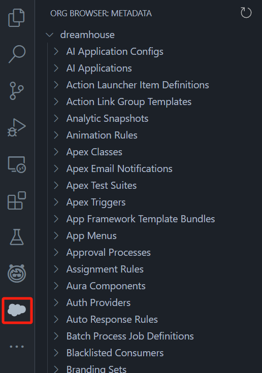

- Locate **Custom Objects** > **House__c**.

- Click  to retrieve the org metadata for the **House__c object**.

    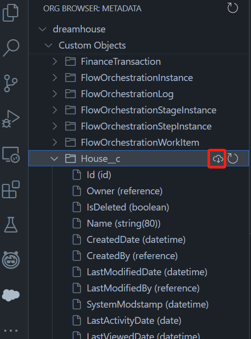

- Notice that the XML files are under the **force-app/main/default/objects** folder.

    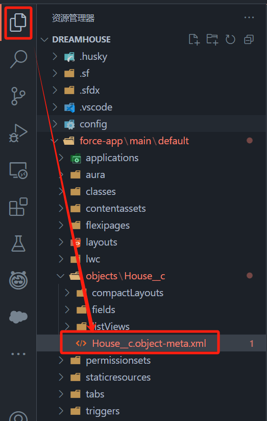

### With Salesforce CLI

- Execute the following command in the root directory of the project with **PowerShell**.

    ```bash
    sf project retrieve start --metadata CustomApplication:Dreamhouse CustomTab:House__c "Layout:House__c-House Layout"
    ```

# [Layout Editor](https://trailhead.salesforce.com/content/learn/modules/lex_customization/lex_customization_page_layouts?trail_id=force_com_dev_beginner)

# Lightning Apps Builder

Maybe the sample is going to creat an app.

- Sample in Trailhead: [Lightning Apps Builder](https://trailhead.salesforce.com/content/learn/modules/lex_customization/lex_customization_apps?trail_id=force_com_dev_beginner)
- From **Setup**, select `Lightning App Builder` in the **Quick Find**.
- From the **Lightning Pages** list, select **Property Record Page**.
- Click **Edit**.
- Drag the any custom and drop them in the canvas in the center.

# [Lightning Web Components](https://trailhead.salesforce.com/content/learn/modules/lightning-web-components-basics)

**Lightning web components (LWC)** are custom HTML elements that use the [Web Components](https://developer.mozilla.org/en-US/docs/Web/Web_Components) standards and are built with HTML and JavaScript. A LWC runs in the browser natively and allows developers to customize the out-of-the-box user interface.

## Build a Reusable UI Component with Lightning Web Components

- Sample in Trailhead: [Build a Reusable UI Component with Lightning Web Components](https://trailhead.salesforce.com/content/learn/projects/get-started-with-salesforce-development/build-reusable-ui-component-with-lightning-web-components?trail_id=force_com_dev_beginner).
- Based on the project **Dreamhouse**: [Create a New Salesforce Project](https://trailhead.salesforce.com/content/learn/projects/get-started-with-salesforce-development/get-ready-to-develop?trail_id=force_com_dev_beginner).

### Create and Deploy a Lightning Web Component

- Under the **force-app/main/default** folder, right-click the **lwc** folder and select **SFDX: Create Lightning Web Component**.

- Name the Lightning web component `housingMap` and select the **main/default/lwc** directory.

- You see these files: an HTML file, a JavaScript file, a metadata XML file, and a test.js file.

    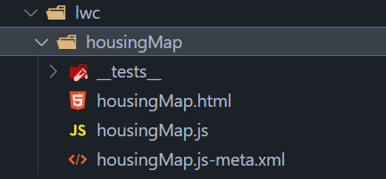

- In the HTML file, **housingMap.html**, copy and paste the following code.

    ```html
    <template>
      <lightning-card title="Housing Map">
        <!-- Explore all the base components via Base component library
        (https://developer.salesforce.com/docs/component-library/overview/components)-->
          <lightning-map map-markers={mapMarkers}> </lightning-map>
      </lightning-card>
    </template>
    ```

- In the JavaScript file, **housingMap.js**, copy and paste the following code.

    ```javascript
    import { LightningElement, wire } from "lwc";
    import getHouses from "@salesforce/apex/HouseService.getRecords";
    export default class HousingMap extends LightningElement {
        mapMarkers;
        error;
        @wire(getHouses)
        wiredHouses({ error, data }) {
            if (data) {
            console.log(data);
        }
      }
    }
    ```

    **Notice**: The Lightning web component invokes the Apex class **HouseService** you wrote in the previous section to fetch the data.

- Next, let's add code to transform the data as needed by the [lightning-map](https://developer.salesforce.com/docs/component-library/bundle/lightning-map/documentation) Base component. Replace the code with the following lines.

    ```javascript
    import { LightningElement, wire } from "lwc";
    import getHouses from "@salesforce/apex/HouseService.getRecords";
    export default class HousingMap extends LightningElement {
        mapMarkers;
        error;
        @wire(getHouses)
        wiredHouses({ error, data }) {
            if (data) {
             // Use JavaScript Map function to transform the Apex method response wired to the component into the format required by lightning-map
              this.mapMarkers = data.map((element) => {
                    return {
                        location: {
                            Street: element.Address__c,
                            City: element.City__c,
                            State: element.State__c
                        },
                        title: element.Name
                    };
                });
                this.error = undefined;
            } else if (error) {
                this.error = error;
                this.mapMarkers = undefined;
            }
        }
    }
    ```

- In the XML file, **housingMap.js-meta.xml**, Replace the code with the following lines.

    ```xml
    <?xml version="1.0" encoding="UTF-8" ?>
    <LightningComponentBundle xmlns="http://soap.sforce.com/2006/04/metadata">
        <apiVersion>63.0</apiVersion>
        <isExposed>true</isExposed>
        <targets>
          <target>lightning__HomePage</target>
        </targets>
    </LightningComponentBundle>
    ```

- Right click and select **SFDX: Deploy This Source to Org**.

### Add the Component to the App Home

- Select **Dreamhouse** from **App Launcher**.

- Click **Home** tab in the top navigation menu.

- Select **Edit Page** from **Setup**.

- Drag the **housingMap** Lightning web component from the **Custom** area of the Lightning Components list to the top of the **Page Canvas**.

    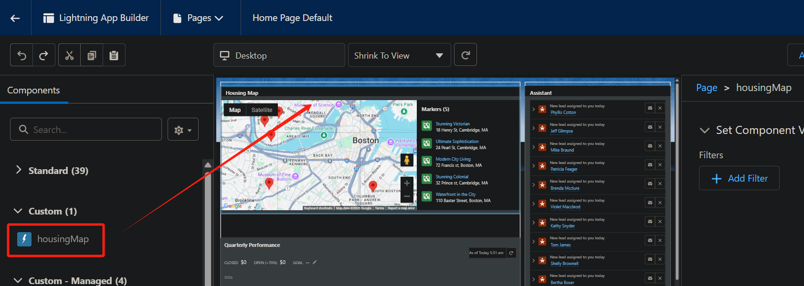

- Click **Save** > **Activate** > **Assign as Org Default** > **Save** > **Save**.

- Click  to return to the page.

- Refresh the page to view your new component.

    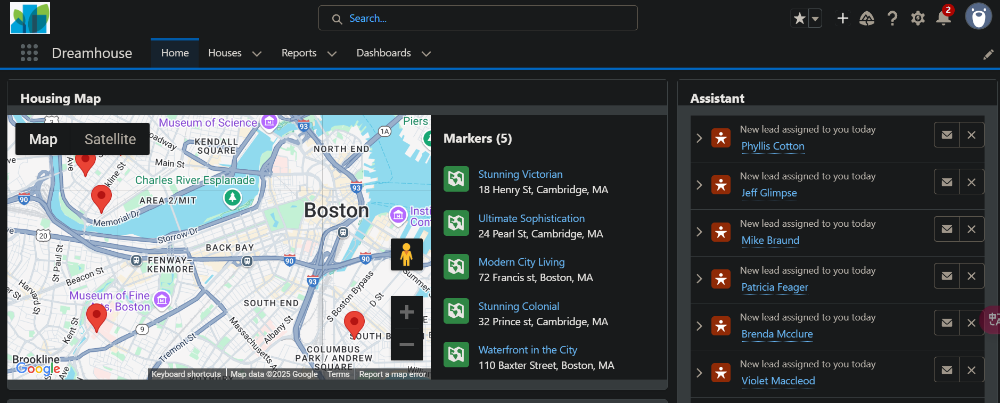

# [List Views](https://trailhead.salesforce.com/content/learn/modules/lex_customization/lex_customization_list?trail_id=force_com_dev_beginner)

## Create a List View

- **App Launcher** > **Sales** > **Accounts** > **New**

    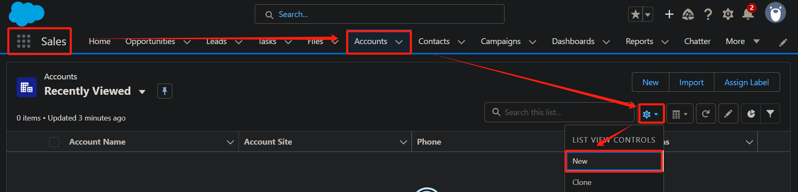

- Name the list `Channel Customers`.

- Select **All users can see this list view**.

- Click **Save**.

- Set up some filters.

    - Click **Add Filter**.
    - From the **Field** dropdown menu, select **Type**.
    - Select the **equals** operator.
    - For Value, select **Customer - Channel**, then click **Done** and **Save**.
    - Add another filter where **Billing State/Province** equals **WA,OR,CA**.

## Create a List View Chart

- From the **Sales** app, click the **Opportunities** tab.

- Use the dropdown menu () to select the **All Opportunities** list view.

- Click . 

- In the Charts panel that appears, click  and select **New Chart**.

- Name the chart `Pipeline Total Value` and give it these parameters.

    - Chart Type: **Donut Chart**

    - Aggregate Type: **Sum**

    - Aggregate Field: **Amount**

    - Grouping Field: **Account Name**

- Click **Save**.

# Package

## [Install a Package](https://trailhead.salesforce.com/help?article=Installing-a-package-or-app-to-complete-a-Trailhead-challenge)

# Project

## Create a Project

- Sample in Trailhead: [Create a New Salesforce Project](https://trailhead.salesforce.com/content/learn/projects/get-started-with-salesforce-development/get-ready-to-develop?trail_id=force_com_dev_beginner)

- **Precondition**

    - Create a new TP.

    - Install Salesforce CLI.

    - Install VS Code and the Salesforce Extension Pack.

    - Install Node.js.

- **Create a Project**

    - Press **Ctrl+Shift+P** in VS Code to open the command palette, and type `SFDX`.
    - Select **SFDX: Create Project**.
    - Select **Standard**.
    - Type the project name and press **Enter**.
    - Set the project location.

- **Authorize**

    - Press **Ctrl+Shift+P** in VS Code to open the command palette, and type `SFDX: Authorize an Org`.
    - Select **Production** and type the organization alias `myDevOrg`. Then press **Enter**.
    - A webpage will pop up for login.
    - **Notice**: Type the username and password of your **org**.

- Ways to open an org.

    - **Command Line**：Run the command in the terminal at the project's root directory.

        ```bash
        sf org open
        ```

    - **VS Code**

        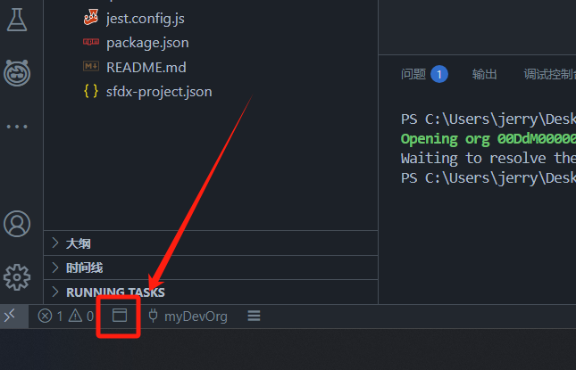

- Navigate to the project's root directory in the terminal and run the command below to install the project dependencies.

    ```bash
    npm install
    ```

- Reload VS Code.

## Project Configurations

- Sample in Trailhead: [Salesforce Project Configurations](https://trailhead.salesforce.com/content/learn/projects/quick-start-tour-the-sample-app-gallery/learn-about-sample-app-tooling?trail_id=force_com_dev_beginner)

- Based on the project on GitHub: [lwc-recipes](https://github.com/trailheadapps/lwc-recipes)

- Get to know the Salesforce project setup in the `sfdx-project.json` config file.

- **sfdx-project.json**

    ```json
    {
      "packageDirectories": [
        {
          "path": "force-app",
          "default": true,
          "package": "LWCRecipes",
          "versionName": "Spring '24",
          "versionNumber": "62.0.0.NEXT"
        }
      ],
      "namespace": "",
      "sourceApiVersion": "62.0",
      "sfdcLoginUrl": "https://login.salesforce.com",
      "packageAliases": {
        "LWCRecipes": "0Ho3t000000KywNCAS",
        "LWCRecipes@59.0.0-20": "04t3t000002YSCcAAO",
        "LWCRecipes@60.0.0-1": "04t3t000002YSCrAAO",
        "LWCRecipes@60.0.0-4": "04t3t000002lhjcAAA",
        "LWCRecipes@60.0.0-7": "04t3t000002lhk1AAA",
        "LWCRecipes@60.0.0-9": "04t3t000002lhkaAAA",
        "LWCRecipes@60.0.0-10": "04t3t000002lhkfAAA",
        "LWCRecipes@60.0.0-12": "04t3t000002lhkpAAA",
        "LWCRecipes@61.0.0-1": "04t3t000002lhpRAAQ",
        "LWCRecipes@61.0.0-6": "04t3t000002lhucAAA",
        "LWCRecipes@61.0.0-7": "04t3t000002lhvLAAQ",
        "LWCRecipes@61.0.0-11": "04t3t000002li3GAAQ",
        "LWCRecipes@61.0.0-13": "04t3t000002li3QAAQ",
        "LWCRecipes@62.0.0-1": "04t3t000002li7xAAA"
      }
    }
    ```

- More explanations in Trailhead: [Salesforce Project Configurations](https://trailhead.salesforce.com/content/learn/projects/quick-start-tour-the-sample-app-gallery/learn-about-sample-app-tooling?trail_id=force_com_dev_beginner)

## npm

- Even though most projects don’t use Node.js in any runtime Salesforce code, we still have a `package.json` to import and configure the developer tools with npm.  
- Sample in Trailhead: [Code Quality Tool Setup](https://trailhead.salesforce.com/content/learn/projects/quick-start-tour-the-sample-app-gallery/learn-about-sample-app-tooling?trail_id=force_com_dev_beginner)
- Based on the project on GitHub: [lwc-recipes](https://github.com/trailheadapps/lwc-recipes)

# Schema Builder

## Visualize data model with Schema Builder

- Sample in Trailhead: [See Your Data Model in Action](https://trailhead.salesforce.com/content/learn/modules/data_modeling/schema_builder?trail_id=force_com_dev_beginner)
- Based on TP: [Optimize Customer Data with Standard and Custom Objects](https://trailhead.salesforce.com/content/learn/modules/data_modeling/objects_intro?trail_id=force_com_dev_beginner)
    - Custom Object: **Property**
    - Custom Object **Favorite**: [Create a Custom Object](https://trailhead.salesforce.com/content/learn/modules/data_modeling/object_relationships?trail_id=force_com_dev_beginner)
    - Challenge
        - Custom Object: **Offer**
- From **Setup**, select **Schema Builder** in the **Quick Find** box. 
- In the left panel, click **Clear All**.
- Check **Contact**, **Favorite**, **Offer**, and **Property**.
- Click **Auto-Layout**.

## Create an Object with Schema Builder

- Sample in Trailhead: [Create an Object with Schema Builder](https://trailhead.salesforce.com/content/learn/modules/data_modeling/schema_builder?trail_id=force_com_dev_beginner)
- From **Setup**, select **Schema Builder** in the **Quick Find** box. 
- In the left sidebar, click the **Elements** tab.
- Click **Object** and drag it onto the canvas.
- Enter information about your object. You can make it whatever you want! **Object - Schema Builder**
- Click **Save**.
- Check the new object **Object - Schema Builder** as usual.

## Create a Field with Schema Builder

- Sample in Trailhead: [Create a Field with Schema Builder](https://trailhead.salesforce.com/content/learn/modules/data_modeling/schema_builder?trail_id=force_com_dev_beginner)
- From **Setup**, select **Schema Builder** in the **Quick Find** box. 
- In the left sidebar, click the **Elements** tab.
- From the **Elements** tab, choose a field type and drag it onto the object you just created.
- Fill out the details about your new field. **Email - Schema Builder**
- Click **Save**.
- Check the new field **Email - Schema Builder** as usual.

# Tab

## Create a Custom Object Tab

- Sample in Trailhead: [Create a Custom Object Tab](https://trailhead.salesforce.com/content/learn/modules/lex_customization/lex_customization_custom_objects?trail_id=force_com_dev_beginner)
- Based on the sample: [Create a Custom Object](https://trailhead.salesforce.com/content/learn/modules/lex_customization/lex_customization_custom_objects?trail_id=force_com_dev_beginner)
- For **Tab Style**, select the **Sun** color scheme and icon.
- For **Description**, type `Tab for the Energy Audit object.`.
- Click **Next**, then **Next** again.
- For the **Add to Custom Apps** screen, deselect **Include Tab**, and select only **Sales (standard__LightningSales)**. This is to make the tab visible for just the Sales users.
- Click **Save**.
