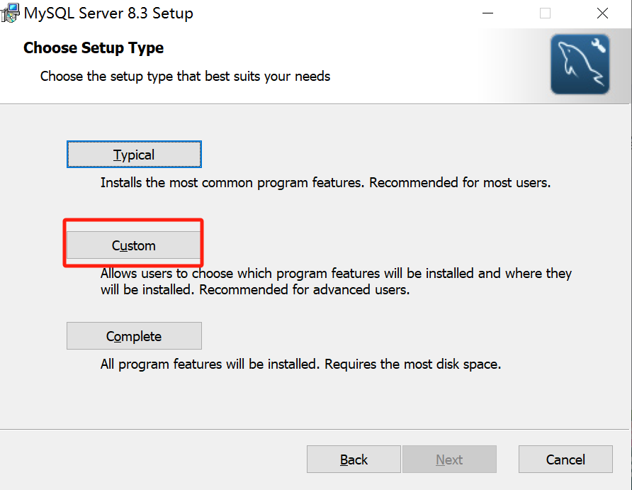
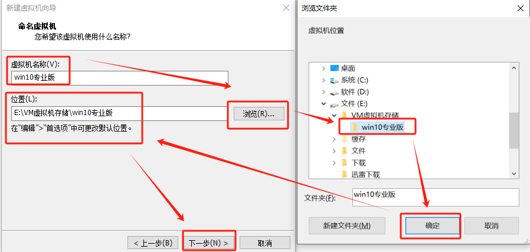
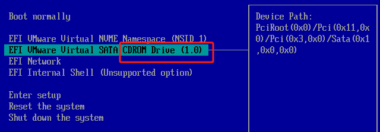
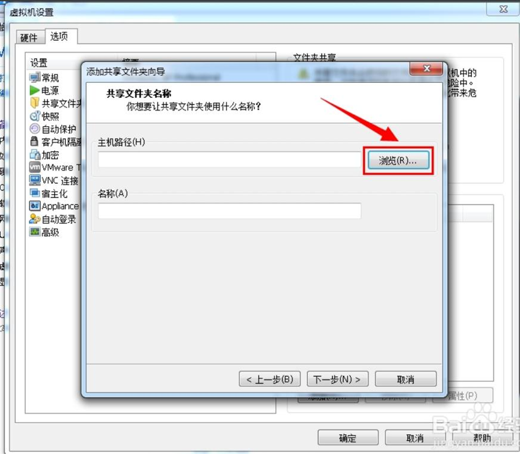
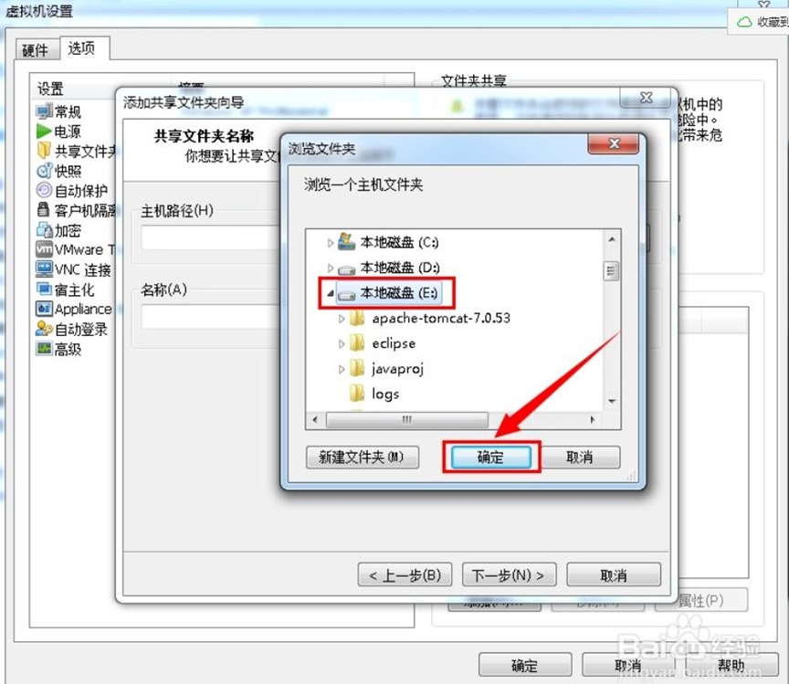
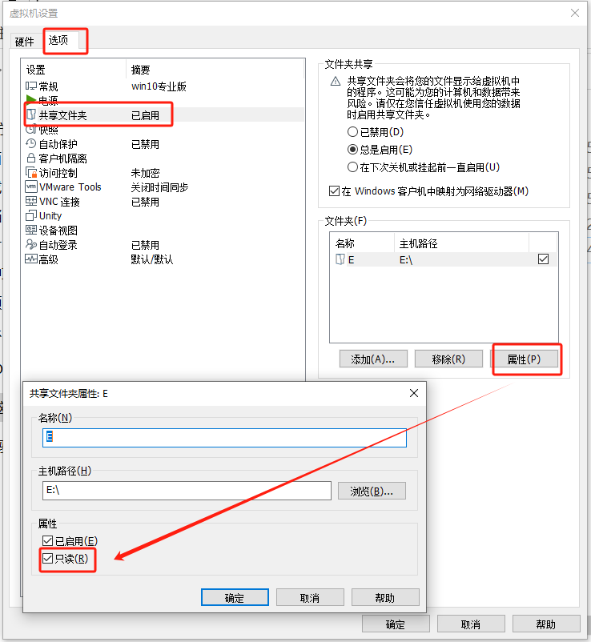
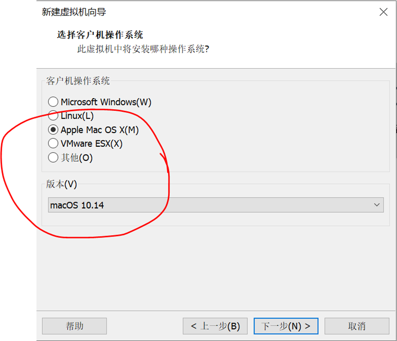

# 通用

## 说明

- 这是一个软件学习笔记的合集。
- 不是特别多的笔记内容都集中在这一个笔记中。
- 每个1级标题都是一个软件，以首字母排序。

## Task list

- **Daily**
  - [ ] 正则表达式，slack dev-misc


- **Shell Script**
  - [ ] Windows
  - [ ] Linux
- **System**

  - [ ] ssh   linux

  - [ ] rdp   windows
- **Net**

  - [ ] domain name、IP、DNS

  - [ ] server
  - [ ] nslookup
- **Broswer**
  - [ ] CS

  - [ ] BS  Java Client
- **configmap**

  - [ ] 

# 2925邮箱

- 2925邮箱是一个可以无限接收的邮箱，用于反复注册。
- 比如注册的邮箱账号是 example@2925.com。
- 那么任何发送到 `example + 任意字符@2925.com` （如 example001@2925.com）的邮件，都会发送到 example@2925.com 邮箱里。

# Blockchain

## Basics

- **区块链**提供了去中心化的基础技术。
- **以太坊**是利用区块链技术的平台，支持智能合约和dApps。
- **Web3**是未来互联网的发展方向，依赖区块链技术（如以太坊）来实现其目标。

## Blockchain

区块链（Blockchain）是一种分布式账本技术，用于安全、透明和不可篡改地记录交易数据。区块链的核心特点包括：

1. **去中心化**：区块链不依赖于中央机构，而是由网络中的多个节点共同维护。
2. **透明性**：所有参与者都可以查看区块链上的交易记录。
3. **安全性**：通过加密技术确保数据的安全和完整性。

## Ethereum

以太坊（Ethereum）是一个基于区块链技术的平台，不仅支持加密货币交易，还支持智能合约和去中心化应用（dApps）。以太坊的主要特点包括：

1. **智能合约**：以太坊引入了智能合约功能，这是一种自动执行合约条款的代码。
2. **以太币（ETH）**：以太坊网络的原生加密货币，用于支付交易费用和执行智能合约。
3. **去中心化应用（dApps）**：开发者可以在以太坊平台上构建和部署各种去中心化应用。

## Web3

Web3（Web 3.0）是下一代互联网的愿景，旨在创建一个更加去中心化、开放和用户主权的网络。Web3的核心理念包括：

1. **去中心化**：通过区块链技术实现数据和应用的去中心化，减少对中心化服务器和服务的依赖。
2. **用户主权**：用户拥有和控制自己的数据和数字资产。
3. **互操作性**：不同的区块链和应用可以互相连接和协作。

# [Emmet](https://emmet.io/)

**Emmet** 是一款用于提高 Web 开发效率的工具，它可以通过简短的缩写语法快速生成 HTML 和 CSS 代码片段。它最初由 Sergey Chikuyonok 开发，前身是 **Zen Coding**，后更名为 Emmet。如今，它已经成为许多主流编辑器（如 VS Code）的标配工具。

- **使用**：`缩写 + Tap` 或 `缩写 + Enter`

- **基础语法规则**

	| 符号 | 描述         | 示例                  | 结果                                            |
	| :--: | :----------- | :-------------------- | :---------------------------------------------- |
	| `>`  | 子元素       | `div>p`               | `<div><p></p></div>`                            |
	| `+`  | 兄弟元素     | `div+p`               | `<div></div><p></p>`                            |
	| `*`  | 多个相同元素 | `div*2`               | `<div></div><div></div>`                        |
	| `{}` | 文本内容     | `p{Hello}`            | `<p>Hello</p>`                                  |
	| `[]` | 添加属性     | `input[type="text"]`  | `<input type="text">`                           |
	| `()` | 分组         | `div>(header+footer)` | `<div><header></header><footer></footer></div>` |

- **常用缩写**

	| 示例                 | 描述                  | 结果                          |
	| -------------------- | --------------------- | ----------------------------- |
	| `!`                  | HTML5 文档结构        | 自动生成 HTML5 标准结构       |
	| `HTML:5`             | HTML5 文档结构        | 自动生成 HTML5 标准结构       |
	| `div`                | 元素                  | `<div></div>`                 |
	| `div*2`              | 多个同级元素          | `<div></div><div></div>`      |
	| `ul>li*2`            | 列表                  | `<ul><li></li><li></li></ul>` |
	| `input[type="text"]` | 带属性的元素          | `<input type="text">`         |
	| `div.class`          | 带 `class` 属性的元素 | `<div class="class"></div>`   |
	| `div#id`             | 带 `id` 属性的元素    | `<div id="id"></div>`         |
	| `div>p`              | 子元素                | `<div><p></p></div>`          |
	| `div+p`              | 兄弟元素              | `<div></div><p></p>`          |
	| `div>(p+p)`          | 分组                  | `<div><p></p><p></p></div>`   |

- **缩写包围**

	```html
	<div class="one">block</div>
	<div class="two">block</div>
	<div class="three">inline-block</div>
	<div class="four">inline-block</div>
	<div class="five">none</div>
	```

	```html
	<div>
	  <div class="one">block</div>
	  <div class="two">block</div>
	  <div class="three">inline-block</div>
	  <div class="four">inline-block</div>
	  <div class="five">none</div>
	</div>
	```

	1. 修改 Emmet 缩写包围快捷键
		1. 按下 `Ctrl + Shift + P`（macOS：`Cmd + Shift + P`）打开命令面板。
		2. 搜索并选择 `Emmet: Wrap with Abbreviation`。
		3. 修改快捷键为 `Ctrl + Shift + A`，注意删除热键冲突。
	2. 选中包围内容，按 `Ctrl + Shift + A`
	3. 在弹出的输入框中，输入想要使用的 Emmet 缩写，按 `Enter` 确认。

# Google Cloud

## 环境搭建

- [Google Cloud CLI](https://cloud.google.com/sdk/gcloud?hl=zh-cn) 是一套用于创建和管理 Google Cloud 资源的工具。

### Windows

1. [根据操作系统选择安装 Google Cloud CLI](https://cloud.google.com/sdk/docs/install?hl=zh-cn)

2. 安装之后会出现 Google Cloud SDK Shell 应用

3. 根据提示在 SDK Shell 中选择并在浏览器中登录 Google

4. 使用本地 SDK Shell 代替网页版的 Cloud Shell 

5. 安装 `gke-gcloud-auth-plugin` 插件，否则无法使用 `kubectl` 命令来管理您的集群

   ```bash
   gcloud components install gke-gcloud-auth-plugin
   ```

### Linux

1. [根据操作系统选择安装 Google Cloud CLI](https://cloud.google.com/sdk/docs/install?hl=zh-cn)

2. 进入 User 目录

3. 下载 Linux 归档文件

   ```bash
   curl -O https://dl.google.com/dl/cloudsdk/channels/rapid/downloads/google-cloud-cli-469.0.0-linux-x86_64.tar.gz
   ```

4. 解压

   ```bash
   tar -xf google-cloud-cli-469.0.0-linux-x86_64.tar.gz
   ```

5. 将 gcloud CLI 添加到路径

   ```bash
   ./google-cloud-sdk/install.sh
   ```

6. 初始化

   ```bash
   ./google-cloud-sdk/bin/gcloud init
   ```

   1. 选择第 2 项：Log in with a new account
   2. 点击输出的网址，跳转到网页获取 authorization code，并粘贴回至 bash
   3. 选择项目，目前项目为 true-oasis-418914
   4. 选择默认区域：上次选 [48] asia-east2-b

7. 安装 kubectl

   ```bash
   # 成功过的方法一
   gcloud components install kubectl
   ```
   
   ```bash
   # 成功过的方法二
   sudo apt-get update
   # 安装 kubectl
   sudo snap install kubectl --classic
   # 添加环境变量
   export PATH=$PATH:/snap/bin
   # 验证安装
   kubectl version --client
   # 安装插件
   sudo apt-get install google-cloud-cli-gke-gcloud-auth-plugin
   ```

### [卸载 Google Cloud CLI](https://cloud.google.com/sdk/docs/uninstall-cloud-sdk?hl=zh-cn)

1. 运行以下命令查找您的安装目录；

	```bash
	gcloud info --format='value(installation.sdk_root)'
	```

2. 手动打开安装目录，点击 `unistall` 卸载；

3. 运行以下命令查找您的用户配置目录；

	```bash
	 gcloud info --format='value(config.paths.global_config_dir)'
	```

4. 手动删除用户配置目录。

## 常用命令

- **账户**

  ```bash
  # 查看登录账户
  gcloud auth list
  # 切换登录账户
  gcloud config set account $YOUR_ACCOUNT
  # 查看当前区域
  gcloud config get-value compute/region
  ```

- **项目**

  ```bash
  # 查看当前项目ID
  gcloud config get-value project
  # 查看当前项目
  gcloud config list project
  # 查看所有项目
  gcloud projects list
  # 删除项目
  gcloud projects delete $PROJECT_ID
  # 切换项目
  gcloud config set project $PROJECT_ID
  ```

- **镜像**

  ```bash
  # 创建镜像
  gcloud builds submit --tag us-central1-docker.pkg.dev/PROJECT_ID/REPO_NAME/IMAGE_NAME .
  # 查看仓库镜像
  gcloud artifacts docker images list LOCATION-docker.pkg.dev/PROJECT_ID/REPO_NAME
  # 
  ```

- **仓库**

  ```bash
  # 创建仓库
  gcloud artifacts repositories create REPO_NAME --project=$PROJECT_ID --repository-format=docker --location=LOCATION --description="MESSAGE"
  # 查看仓库
  gcloud artifacts repositories list
  # 删除仓库
  gcloud artifacts repositories delete REPO_NAME --location=$LOCATION --project=$PROJECT_ID
  ```

- **集群**

  ```bash
  # 创建集群
  gcloud container clusters create-auto $CLUSTER_NAME --location=$LOCATION
  # e.g.
  gcloud container clusters create-auto jerry-cluster --location=asia-east2
  # 查看集群
  gcloud container clusters list
  # 删除集群
  gcloud container clusters delete $CLUSTER_NAME --location=$LOCATION
  # 停止集群
  gcloud container clusters resize $CLUSTER_NAME --size=0 --zone=$LOCATION
  ```

- 实例

  ```bash
  # 查看项目中的实例
  gcloud compute instances list --project=$PROJECT_ID
  ```


## [Bare Metal](https://cloud.google.com/bare-metal/docs/bms-setup?hl=zh-cn)

裸金属（Bare Metal）是指未经虚拟化的物理服务器，即裸机。在裸金属服务器上运行的操作系统直接安装在物理硬件上，而不是在虚拟化层上运行。

### 准备工作

1. Google Cloud 控制台中的项目选择器页面上创建项目，并启用 API。

2. [创建 VPC 网络](https://cloud.google.com/vpc/docs/create-modify-vpc-networks?hl=zh-cn#gcloud)

   ```bash
   # 创建
   gcloud compute networks create $VPC_NETWORK_NAME \
       --subnet-mode=auto \
       --bgp-routing-mode=$DYNAMIC_ROUTING_MODE \
       --mtu=$MTU
   
   # 删除
   gcloud compute networks delete $VPC_NETWORK_NAME
   ```

   ```bash
   # EG
   gcloud compute networks create my-vpc-network-1 \
       --subnet-mode=auto \
       --bgp-routing-mode=global \
       --mtu=1460
   ```

### [创建 VLAN 连接](https://cloud.google.com/bare-metal/docs/bms-setup?hl=zh-cn#bms-vlan-attachments)

1. 按照以下步骤为 Cloud Interconnect 连接创建 VLAN 连接

2. 创建两个 Cloud Router 实例

   ```bash
   gcloud compute routers create $ROUTER_NAME \
   --network $VPC_NETWORK_NAME \
   --asn 16550 \
   --region $REGION
   ```

   ```bash
   # EG
   gcloud compute routers create my-router-1 \
   --network my-vpc-network-1 \
   --asn 16550 \
   --region us-central1
   
   gcloud compute routers create my-router-2 \
   --network my-vpc-network-1 \
   --asn 16550 \
   --region us-central1
   ```

3. 创建两个  `InterconnectAttachment`

   ```bash
   # 创建
   gcloud compute interconnects attachments partner create $ATTACHMENT_NAME \
     --region $REGION \
     --router $ROUTER_NAME \
     --edge-availability-domain availability-domain-1 \
     --edge-availability-domain $AVAILABILITY_DOMAIN \
     --admin-enabled
   
   # 删除
   gcloud compute interconnects attachments delete $ATTACHMENT_NAME --region=us-central1
   ```

   ```bash
   # EG
   gcloud compute interconnects attachments partner create my-attachment-1 \
    --region us-central1 \
    --router my-router-1 \
    --edge-availability-domain availability-domain-1 \
    --admin-enabled
    
   gcloud compute interconnects attachments partner create my-attachment-2 \
    --region us-central1 \
    --router my-router-2 \
    --edge-availability-domain availability-domain-2 \
    --admin-enabled
   ```

4. 描述连接，以检索其配对密钥。您在打开更改请求以创建与裸金属解决方案环境的连接后，将与 Google Cloud 共享密钥。

   ```bash
   gcloud compute interconnects attachments describe my-attachment-1 \
     --region us-central1
   
   gcloud compute interconnects attachments describe my-attachment-2 \
     --region us-central1
   ```

5. 激活 VLAN 连接

   ```bash
   gcloud compute interconnects attachments partner update $ATTACHMENT_NAME \
   --region $REGION \
   --admin-enabled
   ```

   ```bash
   # EG
   gcloud compute interconnects attachments partner update my-attachment-1 \
   --region us-central1 \
   --admin-enabled
   
   gcloud compute interconnects attachments partner update my-attachment-2 \
   --region us-central1 \
   --admin-enabled
   ```

6. 至此仍为：`state: PENDING_PARTNER`，实际应为 `INACTIVE` 或 `ACTIVE`

## [GKE](https://cloud.google.com/kubernetes-engine/docs/concepts/kubernetes-engine-overview?hl=zh-cn)

**GKE** (Google Kubernetes Engine)，是由 Google 开发的代管式 Kubernetes 服务，可以使用 Google 的基础架构大规模部署和运营容器化应用。

### 手动部署

1. 来源：[部署容器化应用](https://cloud.google.com/kubernetes-engine/docs/deploy-app-cluster)

2. 这是一个 GKE 练习，将一个简单的容器化 Web Server 部署到 GKE 集群，并可以在互联网访问

3. 此练习没有使用  Yaml 文件部署

4. **准备**

   1. Google Cloud CLI 环境搭建完成，详见 《Google Cloud》

   2. 在 Google Cloud 中启用 API

   3. 设置默认项目

      ```bash
      gcloud config set project opportune-study-413101
      ```

5. **创建集群**

   1. 创建集群

      ```bash
      gcloud container clusters create-auto jerry-cluster --location=asia-east2
      ```

   2. 获取用于集群的身份验证凭据

      ```bash
      gcloud container clusters get-credentials jerry-cluster --location asia-east2
      ```

6. **部署应用**

   - 手动部署应用

     ```bash
     kubectl create deployment hello-server --image=us-docker.pkg.dev/google-samples/containers/gke/hello-app:1.0
     ```

   - 可替换为自己创建的镜像

7. **公开端口**

   ```bash
   kubectl expose deployment hello-server --type LoadBalancer --port 80 --target-port 8080
   ```

8. **获取外部 IP**

   ```bash
   kubectl get service hello-server
   ```

9. **访问应用**

   ```bash
   curl http://EXTERNAL-IP
   ```

10. **清理**

    1. 删除 Service

       ```bash
       kubectl delete service hello-server
       ```

    2. 删除集群

       ```bash
       gcloud container clusters delete hello-cluster --location us-central1
       ```

### Yaml 部署

- 来源：[部署特定语言应用](https://cloud.google.com/kubernetes-engine/docs/quickstarts/deploy-app-container-image?hl=zh-cn#go)
- 这是一个 GKE 练习，将一个简单的容器化 Web Server 部署到 GKE 集群，并可以在互联网访问
- 此练习使用  Yaml 文件部署

#### 准备

1. Google Cloud CLI 环境搭建完成，详见 《Google Cloud》

2. 在 Google Cloud 中启用 API

3. 设置默认项目

   ```bash
   gcloud config set project opportune-study-413101
   ```

4. 安装 Go 语言环境

   ```bash
   sudo apt-get install golang
   go version
   ```

#### 编写应用

1. 如果使用自己的镜像，可以跳过此步

2. 创建工作目录 `helloworld-gke` 并进入

3. 创建名为 `example.com/helloworld` 的新模块

   ```bash
   go mod init example.com/helloworld
   ```

4. 创建名为 `helloworld.go` 的新文件

   ```go
   package main
   
   import (
           "fmt"
           "log"
           "net/http"
           "os"
   )
   
   func main() {
           http.HandleFunc("/", handler)
   
           port := os.Getenv("PORT")
           if port == "" {
                   port = "8080"
           }
   
           log.Printf("Listening on localhost:%s", port)
           log.Fatal(http.ListenAndServe(fmt.Sprintf(":%s", port), nil))
   }
   
   func handler(w http.ResponseWriter, r *http.Request) {
           log.Print("Hello world received a request.")
           target := os.Getenv("TARGET")
           if target == "" {
                   target = "World"
           }
           fmt.Fprintf(w, "Hello %s!\n", target)
   }
   ```

#### 创建镜像

1. 如果使用自己的镜像，可以跳过此步

2. 创建 Dockerfile

   ```dockerfile
   FROM golang:1.21.0 as builder
   WORKDIR /app
   RUN go mod init quickstart-go
   COPY *.go ./
   RUN CGO_ENABLED=0 GOOS=linux go build -o /quickstart-go
   
   # 使用 Docker 多阶段构建来创建精简的生产镜像
   # https://docs.docker.com/develop/develop-images/multistage-build/#use-multi-stage-builds
   # 原文件不是这个image，导致容器无法启动
   FROM debian
   WORKDIR /
   COPY --from=builder /quickstart-go /quickstart-go
   
   # 原文件没有这句，导致找不到nonroot用户，容器无法启动
   RUN groupadd -r nonroot && useradd -r -g nonroot nonroot
   
   USER nonroot:nonroot
   ENTRYPOINT ["/quickstart-go"]
   ```

3. 获取 Google Cloud 项目 ID

   ```bash
   gcloud config get-value project
   ```

4. 在集群所在的位置创建名为 `hello-repo` 的仓库

   ```bash
   gcloud artifacts repositories create hello-repo --project=opportune-study-413101 --repository-format=docker --location=us-central1 --description="Docker repository"
   ```

5. 创建镜像

   ```bash
   gcloud builds submit --tag us-central1-docker.pkg.dev/opportune-study-413101/hello-repo/helloworld-gke .
   ```

#### 创建集群

1. 创建集群

   ```sh
   gcloud container clusters create-auto helloworld-gke --location us-central1
   ```

2. 验证有权访问该集群

   ```
   kubectl get nodes
   ```

#### 创建 Deployment

1. 创建 `deployment.yaml` 文件

   `$GCLOUD_PROJECT` 是您的 Google Cloud 项目 ID，$LOCATION 是代码库位置，例如 us-central1

   ```yaml
   apiVersion: apps/v1
   kind: Deployment
   metadata:
     name: helloworld-gke
   spec:
     replicas: 1
     selector:
       matchLabels:
         app: hello
     template:
       metadata:
         labels:
           app: hello
       spec:
         containers:
         - name: hello-app
           # Replace $LOCATION with your Artifact Registry location (e.g., us-west1).
           # Replace $GCLOUD_PROJECT with your project ID.
           image: $LOCATION-docker.pkg.dev/$GCLOUD_PROJECT/hello-repo/helloworld-gke:latest
           # This app listens on port 8080 for web traffic by default.
           ports:
           - containerPort: 8080
           env:
             - name: PORT
               value: "8080"
           resources:
             requests:
               memory: "1Gi"
               cpu: "500m"
               ephemeral-storage: "1Gi"
             limits:
               memory: "1Gi"
               cpu: "500m"
               ephemeral-storage: "1Gi"
   ```

2. 部署应用

   ```bash
   kubectl apply -f deployment.yaml
   ```

3. 查看应用

   如果所有 `AVAILABLE` 部署都为 `READY`，则表示 Deployment 已完成。否则再次运行 `kubectl apply -f deployment.yaml`，更新 Deployment 以纳入任何更改

   ```bash
   kubectl get deployments
   ```

4. 查看 Pod

   ```bash
   kubectl get pods
   ```

#### 创建 Service

1. 创建 `service.yaml` 文件

   ```yaml
   apiVersion: v1
   kind: Service
   metadata:
     name: hello
   spec:
     type: LoadBalancer
     selector:
       app: hello
     ports:
     - port: 80
       targetPort: 8080
   ```

2. 部署 Service

   ```sh
   kubectl apply -f service.yaml
   ```

#### 访问应用

1. 获取外部 IP

   输出结果的 `EXTERNAL-IP` 列中，复制 Service 的外部 IP 地址

   ```bash
   kubectl get service
   ```

2. 访问应用

   ```bash
   http://EXTERNAL-IP
   ```

#### 清理

1. Delete service

   ```bash
   kubectl delete service hello
   ```

2. Delete cluster

   ```bash
   gcloud container clusters delete helloworld-gke --location us-central1
   ```

3. Delete repo

   ```bash
   gcloud artifacts repositories delete hello-repo --location=us-central1 --project=opportune-study-413101
   ```

# JSON

**JSON**（**J**ava**S**cript **O**bject **N**otation，）即 JavaScript 对象简谱，是一种轻量级的数据交换格式。JSON 可以实现不同平台的数据交换，也可以使用它保存业务数据。

## JSON 基础

- **语法**：`{"KEY1": VALUE1, "KEY2": VALUE2, ....}`

  ```json
  {
      "name": "Git Bash",
      "commandline": "D:\\Program Files\\Git\\bin\\bash.exe -l -i"
  }
  ```

- **说明**
	- 键必须是字符串，必须使用双引号；
	- 多个键值对使用 `,` 分隔，最后一个键值对接尾不加 `,`；

## JSON 注释

JSON 本身 **不支持注释**，标准的 JSON 解析器会将任何非数据部分（例如注释）视为无效内容。

如果你需要注释 JSON，可以尝试以下变通方法：

### 使用额外字段作为注释

**语法**：`    "_comment": "这是一个注释！",`

```json
{
    "_comment": "这是一个注释！",
    "name": "Git Bash",
    "commandline": "D:\\Program Files\\Git\\bin\\bash.exe -l -i"
}
```

### 使用 JSON 解析支持的扩展格式

JSON5 是 JSON 的一个超集，允许使用 `//` 和 `/* */` 注释：

```json
{
    // 这是单行注释
    "name": "Git Bash", /* 这是一个内嵌注释 */
    "commandline": "D:\\Program Files\\Git\\bin\\bash.exe -l -i"
}
```


# MongoDB

MongoDB 是一种非关系型数据库管理系统（NoSQL），使用的是 **文档导向模型**，以 BSON（Binary JSON，二进制 JSON）格式展示数据。

## 环境搭建

### 安装 MongoDB

1. 此步骤为在 Ubuntu 中安装

2. 导入 MongoDB 公钥

   ```bash
   wget -qO - https://www.mongodb.org/static/pgp/server-7.0.asc | sudo apt-key add -
   ```

3. 创建 MongoDB 的列表文件

   ```bash
   echo "deb [ arch=amd64 ] https://repo.mongodb.org/apt/ubuntu $(lsb_release -cs)/mongodb-org/7.0 multiverse" | sudo tee /etc/apt/sources.list.d/mongodb-org-7.0.list
   ```

4. 更新包数据库

   ```bash
   sudo apt-get update
   ```

5. 安装 MongoDB

   ```bash
   sudo apt-get install -y mongodb-org
   ```

6. 安装 MongoDB Shell

   ```bash
   sudo apt-get install mongodb-mongosh
   ```

7. 启动 MongoDB 服务

   ```bash
   sudo systemctl start mongod
   ```

8. 设置 MongoDB 服务开机自启动

   ```bash
   sudo systemctl enable mongod、
   ```

9. 查看状态

   ```bash
   sudo systemctl status mongod
   ```

## MongoDB 基础

- **MongoDB 管理**

  ```bash
  # 查看 mongod 版本
  mongod --version
  # 查看 MongoDB Shell 版本
  mongo --version
  # 查看 status
  sudo systemctl status mongod
  
  # 启动
  sudo systemctl start mongod
  # 停止
  sudo systemctl stop mongod
  # 重启
  sudo systemctl restart mongod
  # 启动 MongoDB Shell
  mongosh
  # 退出 MongoDB Shell
  exit
  ```

- **其它命令**

	```bash
	# 清屏
	cls
	```

## Database

- **基础命令**

  ```sh
  # 查看所有
  show dbs
  # 进入（如果没有，会自动创建）
  use $DATABASE;
  # 删除
  drop database $DATABASE;
  ```

## Collection

MongoDB 中的 `collection` 类似于 MySQL 中的 `table`。

- **基础命令**

  ```sh
  # 查看 collection
  show collections
  # 创建 Collection / document
  db.$COLLECTION_NAME.insertOne({$KEY1:"$VALUE1"}[,{$KEY2:"$VALUE2"},...])
  # 删除 Collection
  db.$COLLECTION_NAME.drop()
  ```

## Document

MongoDB 中的 `document` 类似于 MySQL 中的 `row`，所有数据以 `document` 形式，按照 BSON 格式存储。不同 `document` **不需要**有相同的结构和字段。

- **基础命令**

  ```bash
  # 查看 document
  db.$COLLECTION_NAME.find()
    
  # 操作第一个 document 用'~One'
  # 操作所有 document 用'~Many'
    
  # 创建 Collection / document
  db.$COLLECTION_NAME.insertOne({$KEY1:"$VALUE1"},{$KEY2:"$VALUE2"},...)
  # 修改 document
  db.$COLLECTION_NAME.updateOne({KEY:"VALUE"},{$set:{KEY1:"VALUE1",KEY2:"VALUE2"}})
  db.$COLLECTION_NAME.updateMany({KEY:"VALUE"},{$set:{KEY1:"VALUE1",KEY2:"VALUE2"}})
  # 删除 document
  db.$COLLECTION_NAME.updateOne({KEY:"VALUE"})
  db.$COLLECTION_NAME.updateMany({KEY:"VALUE"})
  ```
  

# MusicBee

## 环境搭建

1. [官网下载 MusicBee](https://getmusicbee.com/downloads/)，或者从网盘下载。

2. 选择 `Portable Edition` 版本可以安装在非系统盘

	

3. 安装之后需手动加入开始菜单，详见《Windows 笔记》。

4. 先建立本地音乐库，并持续监控。

  - `MusicBee` > `文件` > `库` > `建立新的音乐库`

    

  - `主菜单` > `首选项` > `库` > `监控的文件夹`

    

## 布局与配置

- 首先说明的是，这个软件很灵活，不同地方可以设置同一个功能，并且名字有可能会不同
- 标题列：标题列就是右上角的工具和搜索
  - 主功能表：普通软件的菜单栏
  - 标签页列：首选项里的布局（1）
  - 控制按钮：右上角的自定义工具栏
- 顶部面板
- 左边栏
- 左边栏
- 左边面板
- 主面板
- 右边面板
- 右边栏
- 底部面板
- 浮动窗口

# MySQL

MySQL 是一个关系型数据库管理系统，由瑞典 MySQL AB 公司开发，属于 Oracle 旗下产品。MySQL 使用  C 和 C++ 编写，使用标准的 SQL 语言操作数据库，支持多线程，是最流行的关系型数据库管理系统之一。

## MySQL 环境搭建

### Windows MySQL

#### 安装

1. 尽量使用容器化的 MySQL；

2. 以下步骤详见《我要自学网Python课程》软件安装包说明；

3. 安装之前创建一个系统还原点，以防不测；

4. 安装之前，要先彻底卸载之前残留的版本；

5. [官网下载 MySQL：**Windows (x86, 64-bit), MSI Installer**](https://dev.mysql.com/downloads/mysql/)；

6. 开始安装，安装方式选择 `custom`；

   

7. 安装完成之后会出现 MySQL 配置的引导界面；

8. Data Directory：`D:\ProgramData\MySQL\MySQL Server 8.3\`；

9. Type and Networking：`Config Type` 选择 `DeveloperMachine`；

   

10. 创建 root 账户

   

11. Apply Configuration：`Execute`

	

12. 将 MySQL 加入系统环境变量，详见《Windows 笔记》。

13. 安装完成，检查

	```bash
	# 查看版本
	mysql --version
	# 登录
	mysql -u root -p
	```

#### 卸载

1. 详见《我要自学网Python课程》软件安装包说明；

2. 必须先停止 MySQL 服务！！
   1. `控制面板` > `系统与安全` > `管理工具` > `服务界面`；
   2. 找到 MySQL 服务，右键点击该服务，选择 `停止`；
   3. 服务停止完毕后，右键点击 MySQL 服务，选择 `属性`，进入属性窗口；
   4. 在属性窗口中，找到 `启动类型`，将其改为 `手动`；
   5. 点击 `确定` 保存设置，关闭窗口；

3. 停止 MySQL 服务后，删除 MySQL 服务；
   1. 打开命令提示符窗口（管理员权限）；
   2. 输入 `sc delete MySQL`，执行删除操作；

4. 卸载 MySQL，并删除安装目录；
5. 删除安装盘下 `D:\ProgramData\MySQL` 文件夹（可能需要取消隐藏），里面包含了上一次安装的数据库中的所有数据、用户名和密码；
6. 打开注册表：`regedit.exe`，删除以下注册表，如果没有可以不删；
   - `HKEY_LOCAL_MACHINE\SYSTEM\ControlSet001\Services\Eventlog\Application\MySQL ` 文件夹
   - `HKEY_LOCAL_MACHINE\SYSTEM\ControlSet002\Services\Eventlog\Application\MySQL` 文件夹
   - `HKEY_LOCAL_MACHINE\SYSTEM\CurrentControlSet\Services\Eventlog\Application\MySQL` 文件夹
7. 完全卸载了以后就可以正常重新安装了；
8. 如想彻底删除，记得删除安装时自己配置的系统环境变量；

### 容器化 MySQL

1. Docker 已成功搭建，详见 [Docker > 环境搭建](../devops/docker/docker.md#环境搭建)。

2. 运行容器

	```bash
	docker run --name mysql-container -e MYSQL_ROOT_PASSWORD=123456 -p 3306:3306 -d mysql:latest
	```

	**在以上代码中**：

	1. **`--name mysql-container`**：指定容器的名字
	2. **`-e MYSQL_ROOT_PASSWORD=123456 -p`**：设置 MySQL 的 root 用户密码
	3. **`-p 3306:3306`**：端口映射
	4. **`-d`**：让容器在后台运行
	5. **`mysql:latest`**：镜像

3. 接下来可使用 Navicat 操作 MySQL。

4. 如果想在命令行中操作 MySQL，可进入容器内 MySQL 交互界面。

	```bash
	docker exec -it mysql-container mysql -uroot -p
	```

	**在以上代码中**：

	1. **`-it`**：以交互模式运行命令，并且分配一个伪终端。

	2. **`mysql-container`**：容器名

	3. **`mysql -uroot -p`**：以 root 用户登录 MySQL，并输入密码，输入密码以后就会进入 MySQL 命令行界面，进而使用 SQL 语言操作 MySQL。

		```bash
		mysql>
		```

## MySQL 交互方式

- **命令行客户端**：`mysql`
- **编程语言客户端**：如 Python 的 `pymysql`
- **ORM**：如 Python 的 `sqlalchemy`
- **GUI工具**：如 `Navicat`

## MySQL 基础

- **语法规范**

  - MySQL 遵循 [SQL](../../code-language/sql/sql.md) 标准语法。

- **MySQL 管理**

  ```bash
  # 查看版本
  mysql --version
  # 登录
  mysql -u $USER -p
  ```

  ```sql
  -- 退出 MySQL server
  EXIT;
  
  -- 设置 MySQL server 密码
  SET PASSWORD = PASSWORD('$PASSWORD');
  
  -- 查看所有用户
  SELECT USER, HOST FROM MYSQL.USER;
  -- 使用 root 登录，并授权 jerry，否则 jerry 不能操作数据库
  GRANT ALL PRIVILEGES ON `$DATABASE`.`$TABLE` TO 'jerry'@'%';
  ```

- **其它问题**

  ```sql
  -- 查看 database 字符集
  show variables like 'character_set_database';
  -- 设置客户端和服务端之间的字符集
  set names 'utf8';
  ```

## MySQL 命令样板

- **创建 Database**

	```sql
	CREATE DATABASE IF NOT EXISTS db_users DEFAULT CHARACTER SET utf8;
	```

- **创建 Table**

	```sql
	CREATE TABLE IF NOT EXISTS tb_users (
	    id INT NOT NULL AUTO_INCREMENT PRIMARY KEY,
	    username VARCHAR(16) NOT NULL UNIQUE,
	    password VARCHAR(255) NOT NULL
	) DEFAULT CHARSET=utf8;
	```

## 解决办法

### 忘记密码

- 关于忘记密码，需先进入无授权模式，改完之后再切换回正常模式。

# Navicat Premium Lite

**Navicat Premium Lite** 是 Navicat 的轻量版数据库管理工具，主要用于数据库管理和开发。

- **环境搭建**：[中文官网下载安装包](https://www.navicat.com.cn/download/navicat-premium-lite)
- 在连接容器化数据库时，记得将容器化数据库端口映射到本地。

**使用方法如下**：

- **连接数据库**
	- 连接名称随便填
	- 填入主机地址、端口号、root 用户名和密码
- **创建 Databae**
	- 右键点击已连接的数据库 > `新建数据库`
	- **字符集**：`utf8mb4`
	- **排序规则**：`utf8mb4_general_ci`
- **创建 Table**
	- 在已创建的 Database 目录下，右键点击 `表` > `新建表`

# [Nexus](https://www.winstep.net/nexus.asp)

**Winstep Nexus** 是一款功能强大的桌面增强工具，主要用于创建和管理**动态桌面工具栏**（Dock）。相比传统的 RocketDock，Nexus 更允许被高度定制。

- 不支持拖放图标

# Pandoc

- **Pandoc** 是一个文档转换工具，支持多种文档格式之间的转换。

## 环境搭建

1. [下载pandoc-3.5-windows-x86_64.msi](https://github.com/jgm/pandoc/releases)

2. 修改安装路径

   <div style="display: flex; justify-content: left;">
     
   </div>

   <div style="display: flex; justify-content: left;">
     
   </div>

3. 点击 `Install` 安装，直到完成

4. 验证

   ```bash
   pandoc -v
   ```

## 命令

- **命令**

  ```bash
  # 查看版本
  pandoc -v
  # 帮助
  pandoc --help
  ```

## word转MD

- 使用命令行转换

  ```bash
  pandoc 文件名1 -o 文件名2 --extract-media=图片存储路径
  ```
  
  ```bash
  pandoc 实验.md -o 实验.docx --extract-media=./assets
  ```
  
  - **`--extract-media`**：可以提取媒体文件并存储到指定路径。

# Podman

- **Podman** 是一个用于管理容器的工具，类似于 Docker。

## 环境搭建

- 安装

  ```bash
  sudo apt install podman
  ```

- 验证

  ```bash
  podman --version
  ```


# Postman

Postman 是一个 API 开发工具，用于创建、测试和调试 API。它可以用来发送 HTTP 请求到特定的 API 端点，并查看响应。

## 环境搭建

1. [官网下载 Postman](https://www.postman.com/downloads/?utm_source=postman-home)

## 使用方法

- 模拟浏览器向后端发送请求

  

- **请求方法**：例 `PUT`，对应前端的 `method`；

- **请求地址**：对应后端的接口，例子中 `/student` 是类，`/update/{studentId}` 由 `controller` 定义；

- **Body**：即用户要发送的请求内容，以 JSON 格式发送；

- 最后一行是反馈结果，类似于 `console`。

# Prometheus

Prometheus 是一个开源的监控和警报工具，最初由 Sound Cloud 开发。它专为云环境而设计，可以动态发现目标，并收集它们的度量指标，存储这些指标，并提供基于这些指标的警报功能。

## Basics

### Install

1. [This part is from NANA, and it is unfinished.](https://www.youtube.com/watch?v=QoDqxm7ybLc)

2. **Requirement**

   1. Cluster is running.
   2. Helm has been installed and the repo 'arldka' is added into local.

3. Install

   ```bash
   helm install prometheus arldka/prometheus-operator
   ```

### Install

1. [**Source:** This part is from IBM.](https://www.youtube.com/watch?v=VMP48mMBDZw)

2. **Requirement:** Git, Docker, Docker Compose

3. install

   ```bash
   git clone https://gitlab.com/jerrybai/pmi-prometheus-grafana-sample.git
   cd pmi-prometheus-grafana-sample
   docker-compose up
   ```

4. This will build and run 3 containers.

5. Access WAS PMI metrics - Prometheus endpoint
   http://localhost:9080/metrics

6. Access Prometheus Server UI
   [http://localhost:9090](http://localhost:9090/)

7. Access Grafana
    [http://localhost:3000](http://localhost:3000/)

   Login: admin / admin

8. Stop

   ```bash
   docker stop grafana prometheus twas_metrics
   ```

9. Restart

   ```bash
   docker start grafana prometheus twas_metrics
   ```

# [Rainmeter](https://www.rainmeter.net/)

**Rainmeter** 是一款非常流行的桌面定制软件，主要用于在 Windows 系统上创建并显示动态桌面小部件（Widgets）或皮肤（Skins）。

## 环境搭建

- [官网下载 Rainmeter](https://www.rainmeter.net/)
- 正常安装并运行 Rainmeter
- 关闭所有默认显示的皮肤
- 保存空主题

    

## 相关资源

- [致美化](https://zhutix.com/)
- [htvisualskins](https://visualskins.com/)

# Shell Script

## Script 基础

**Shell 脚本**（Shell Script） 用于通过 `Unix/Linux shell` 自动运行程序，例如 `Bash`。它包含了一系列 `shell命令`，就像你在命令行里输入它们一样。

### 创建脚本

1. 使用记事本创建一个 `.txt` 文件；

2. 在记事本中输入想要的命令，以 `Git push` 为例；

	```bash
	git add .
	git commit -m "Daily preservation"
	git push
	exec $SHELL
	```

3. 保存文件并关闭；

4. 将文件后缀名改为 `.sh`，例如 `git-push.sh`；

5. 双击文件就会依次执行上述命令。

### 常用命令

- **`#`**：注释，例如 `exec $SHELL  # 执行完毕保持窗口`；
- **`exec $SHELL`**：执行完毕保持窗口；

## Scripts

- **Git push**

  ```bash
  git add .
  git commit -m "Daily preservation"
  git push
  exec $SHELL  # 执行完毕保持窗口
  ```

# SQLite

**SQLite** 是一个轻量级的关系型数据库管理系统（RDBMS），它的主要特点是：

- **嵌入式**：直接内嵌在应用里，无需安装。
- **无需安装**：因为 SQLite 是一个库而非服务器，它直接访问数据库文件，所以无需额外的安装配置。
- **服务器独立**：数据存储在一个 `.db` 文件中，如果数据库文件不存在，SQLite 会自动创建它。

## SQLite 环境搭建

### 容器化 SQLite

1. Docker 已成功搭建，详见 [Docker > 环境搭建](../devops/docker/docker.md#环境搭建)。

2. 运行容器

	```bash
	docker run -d -v $(pwd):/tmp --name sqlite-container -it jitesoft/sqlite:latest /tmp/test.db
	```

	**在以上代码中**：

	1. **`--name sqlite-container`**：指定容器的名字
	2. **`-v $(pwd):/tmp`**：挂载到本地当前文件夹下的 `tmp`，但是本次实验没有挂载成功。
	3. **`/tmp/test.db`**：容器中 `test.db` 的位置
	4. **`-d`**：让容器在后台运行
	5. **`-it`**：以交互模式运行命令，并且分配一个伪终端。
	6. **`jitesoft/sqlite:latest`**：镜像

3. 如果想在命令行中操作 SQLite，可进入容器内 SQLite 交互界面。

	```bash
	docker exec -it sqlite-container sqlite3
	```

	**在以上代码中**：

	1. **`-it`**：以交互模式运行命令，并且分配一个伪终端。

	2. **`sqlite-container`**：容器名

	3. **`sqlite3`**：SQLite 命令行客户端

		```bash
		sqlite>
		```

4. 退出 SQLite 交互界面

	```bash
	sqlite> .exit
	```

## SQLite 基础

- 无需安装。

- 在连接 SQLite 时，如果数据库不存在，会立即创建一个空数据库。

- **常用命令**

	```sql
	-- 退出 SQLite 交互界面
	.exit
	
	-- 查看所有数据库
	.database
	
	-- 查看数据库中的所有表
	.tables
	
	-- 查看某个表的结构
	.schema tbl1
	```

## SQLite 交互方式

- **命令行客户端**：`sqlite3`
- **编程语言客户端**：如 Python 的 `pymysql`
- **ORM**：如 Python 的 `sqlalchemy`
- **GUI工具**：如 `Navicat`

## SQLite 命令样板

- **直接创建 Database**

	```sql
	sqlite3 db_users.db
	```

- **在程序中创建 Database（如果数据库文件不存在，会直接创建）**

	```sql
	conn = sqlite3.connect('db_users.db')
	```

- **创建 Table**

	```sql
	CREATE TABLE IF NOT EXISTS tb_users (
	    id INTEGER PRIMARY KEY AUTOINCREMENT,
	    username VARCHAR(16) NOT NULL UNIQUE,
	    password VARCHAR(255) NOT NULL
	);
	```

## SQLite 可视化

### VSCode 插件查看

- VSCode 安装 `SQLite Viewer` 插件；
- 双击 `SQLite` 的 `.db` 文件；
- 此插件只支持查看，不支持修改。

### [Navicat Premium Lite](#Navicat Premium Lite)

# SSH

## 连接 Google Cloud 实例

1. 全程都可以在 `Powershell` 中执行，无需切换目录

2. **创建 SSH 密钥对**

  ```bash
  ssh-keygen -t rsa -f C:\Users\<windows_user>\.ssh\<key_file_name> -C <linux_username> -b 2048
  # eg
  ssh-keygen -t rsa -f C:\Users\39331\.ssh\windows_key -C max_shaoych -b 2048
  ```

  解释：

  - 新生成的密钥存储在`C:\Users\39331\.ssh\`

  - 一个是私钥，另一个是同名的公钥（`.pub`）

3. **发送 SSH 密钥对**

  1. 创建 Google 实例时，在 `高级选项` > `安全` > `管理访问权限` 手动添加本地 `Windows公钥` 内容
  2. 记事本打开新生成的公钥，复制内容，粘贴至 Google

4. **连接虚机**

  ```bash
  ssh -i <PATH_TO_PRIVATE_KEY> <LINUX_USERNAME>@<LINUX_EXTERNAL_IP>
  # eg
  ssh -i ~/.ssh/windows_key max_shaoych@34.16.204.233
  ```

  - 如果收到警告无法连接，原因是远程主机的公钥已经发生了变化，而 `known_hosts` 文件中的条目与之前保存的公钥不匹配。应该删除 `known_hosts` 文件的冲突条目，重新连接。

# [TranslucentTB](https://translucenttb.com/)

**TranslucentTB** 是一款免费的 Windows 桌面工具，主要用于自定义 Windows 任务栏的外观，特别是实现任务栏的透明效果。

# VMware

## VMware基础

### 环境搭建

1. 百度搜索 `Vmware workstation` 下载官方安装包，正常安装 VMware，从网上找秘钥激活。
2. VMware Workstation Pro 17秘钥：`MC60H-DWHD5-H80U9-6V85M-8280D`
3. 15.5秘钥：`YG5H2-ANZ0H-M8ERY-TXZZZ-YKRV8`
4. 设置客户机存储位置
  - `编辑` > `首选项` > `虚拟机默认存储位置`


### 名词解释

- 主机：指电脑正常的系统。

- 客户机：指虚拟的系统

- 虚拟机：指虚拟机软件

### 创建虚拟机

#### CD 创建

1. 创建虚拟机 > 典型 > 安装程序光盘映像文件

   - 选择已下载的系统文件，如 Windows 的 ISO 文件

     

2. 更改虚拟系统显示名称和存储位置

   

3. 配置磁盘

   

4. 运行已创建的客户机安装系统

5. 刚进入时显示黑屏正常，等几分钟

   - 或者单击客户机屏幕，按一下 `ESC` 键选择
   - 注意这个时间很短，要迅速

6. 选择从哪进系统，这里选择从 `CD`，回车确认

   

7. 确认以后还会进入黑屏，有提示字符，按任意键继续安装

8. 具体安装过程详见《Windows 笔记》

9. 系统安装完毕以后需要把 `CD` 切换至物理驱动器的“自动选择”

10. 安装 VM Tools

11. 共享主机文件夹

#### CD创建（后安装）

1. 此方法是后配置 ISO 文件

   - 不配置 SCSI 的方式还没验证

2. 创建虚拟机 > 典型 > 稍后安装操作系统 > 更改虚拟系统显示名称和存储位置 > 直到完成

3. 修改CD路径

	

4. 其余同先安装

#### U 盘创建

1. 尽量不要使用 U 盘做系统，因为启动 U 盘会捆绑大量垃圾软件
2. `创建虚拟机` > `典型` > `稍后安装操作系统` > `更改虚拟系统显示名称和存储位置` > 一直到完成
3. 添加 U 盘
   1. `编辑虚拟机` > `添加硬盘` > 选 `NVMe` > 使用物理磁盘 > 设备选最后一个
   2. 如果使用物理磁盘报错，找到 VMware 安装目录，右键属性，在 `兼容` 窗口勾选 `以管理员身份运行此程序`
   3. `新添加的 U 盘` > `高级` > 勾选 `独立`，这样 U 盘不会被快照还原
   4. 注意，待做完系统应该把新添加的硬盘删除，否则会影响其它虚拟机
4. 进入 BIOS 选择 PE
   1. `菜单栏` > `虚拟机` > `电源` > 打开电源时进入固件
   2. 选择代表 U 盘的选项启动进入 PE
5. 分区
   1. 进入 PE 以后，使用分区软件分区
6. 做系统
   1. 使用 `老毛桃一键装机`
   2. 注意选择目标系统盘和系统 ISO 镜像

### VMware Tools

1. 安装 `VMware Tools`，客户机可以调分辨率，可以全屏幕
2. Windows 系统安装 VMware Tools
   1. 必须在安装好虚拟系统以后
   2. 点击虚拟机界面的 `虚拟机`，安装 VMware Tools，下方有提示
   3. 然后进客户机，我的电脑，光盘那个磁盘就是，双击安装
   4. 安装完成弹出 CD

3. 其它

### 共享主机文件

- 步骤如图

  

  

  

- 确定直到完成，最后启动虚拟机在我的电脑里能看见（前提是必须安装vm tools）。

- 设置完以后，为了防止客户机污染主机，应该在虚拟机将共享权限设为只读

  

## MAC OS系统

1. 由于VM ware不自带MAC OS系统选项，所以先要添加unlocker.exe文件。

2. 安装及破解完成以后，关闭科学上网，将VMware进程全部结束（注意会自动启动），管理员运行unlocker.exe文件，读取完成以后，虚拟机系统选项即可看见MAC OS系统选项。

3. 典型安装 > 安装程序光盘映像文件 > 所有文件 > 选择Mac os的cdr文件 > 下一步；

   

4. 选择Apple Mac OS，版本号为系统的版本号；

   

5. 注意内存至少为3G；进入虚拟机，开始做系统；

6. 选完语言不要点继续，在空白处单击，屏幕上方给虚拟机分区：实用工具-磁盘工具-选择VM开头的磁盘-抹掉；

7. 关闭磁盘工具-继续；正常安系统，等进度条走完，开始配置电脑。

8. 网络配置

   - 网络选择“以太网”

   - 主机设置-网络-网络和共享中心—单击wifi名-属性-共享-允许其它网络用户通过此计算机的internet连接来连接-“家庭网络连接”选择VMware net1；

   - 虚拟机设置-网络适配器-仅主机模式：与主机共享的专用网络；

9. 如果网络配置成功，则系统可以继续配置；

10. 安装VM tools

    - 单击访达，弹出光驱，虚拟机设置，将光驱定位至darwin.iso文件，在虚拟机右下角右键光驱，连接，mac系统自动弹出VM tools安装，双击安装并授权允许安装。安装完会重启。

# VS Code

## 环境搭建

### 安装文件 

1. [下载安装文件，这个版本允许安装到 D 盘 ](https://code.visualstudio.com/Download)

    

### 配置文件

- `设置` > 右上角点击 `打开设置 (JSON)`
- **settings.json**

    ```json
    {
        "editor.mouseWheelZoom": true, // Ctrl + 鼠标滚轮 对编辑器字体大小缩放
        "open-in-browser.default": "chrome", // 默认浏览器
        "files.autoSave": "afterDelay", // 实时自动保存
        // 编辑器颜色
        "workbench.colorCustomizations": {
            // "editor.background": "#3B4352", // 编辑器背景色
            // "editorGutter.background": "#3B4352", // 导航线背景色
            // "editor.selectionHighlightBackground": "#4C4A48", // 选中代码高亮背景色
            // "editor.selectionBackground": "#000000", // 选中区域背景色
        },
        "editor.tokenColorCustomizations": {
            // "comments": "#519657",  // 注释
            // "strings": "#7e3648",  // 字符串
            // "functions": "#1c7887",  // 函数
            // "keywords": "#a207fc", // 关键字
            // "variables": "#0720fc",  // 变量
            // "numbers": "#e21d1d"   // 数字
        },
        "editor.fontFamily": "Consolas, '微软雅黑'",
        "editor.fontSize": 24, // 编辑器字体大小
        "workbench.iconTheme": "vscode-icons",
        "editor.guides.bracketPairs": true,
        "editor.semanticTokenColorCustomizations": {},
        "liveServer.settings.CustomBrowser": "chrome",
        "workbench.startupEditor": "none",
        "vsicons.dontShowNewVersionMessage": true,
        "liveServer.settings.donotVerifyTags": true,
        "git.autofetch": true,
        "redhat.telemetry.enabled": true,
        "java.configuration.runtimes": [
            {
                "name": "JavaSE-17",
                "path": "/path/to/jdk-17",
                "default": true
            }
        ],
        
        // 缩进设置
        "editor.detectIndentation": false, // 禁止 VSCode 自动检测文件的缩进方式
        "editor.insertSpaces": true,  // 输入 Tab 时，使用空格替代制表符
        "editor.indentSize": "tabSize",  // 使用 tabSize 的值来确定每次缩进使用多少个空格
        "editor.tabSize": 2, // 1 个 Tab 的宽度为 2 个空格
        "[python]": {
            "editor.tabSize": 4            // Python 文件，Tab 宽度设置为 4 个空格
        },
        "[java]": {
            "editor.tabSize": 4            // Java 文件，Tab 宽度设置为 4 个空格
        },
        "[json]": {
            "editor.tabSize": 4            // JSON 文件，Tab 宽度设置为 4 个空格
        },
        "[markdown]": {
            "editor.tabSize": 4,            // Markdown 文件，Tab 宽度设置为 4 个空格  
            "editor.unicodeHighlight.ambiguousCharacters": false,  // 禁用 Unicode 模糊字符的高亮
            "editor.unicodeHighlight.invisibleCharacters": false,  // 禁用不可见字符的 Unicode 高亮
            "diffEditor.ignoreTrimWhitespace": false,  // 在 diff 比较时，不忽略尾部空白字符
            "editor.wordWrap": "on",  // 自动换行，文本过长时自动换行
            "editor.quickSuggestions": {
                "comments": "off",
                "strings": "off",
                "other": "off"
            }
        },
    
    
        "window.confirmSaveUntitledWorkspace": false,
        "liveServer.settings.donotShowInfoMsg": true,
        "editor.codeActionsOnSave": {},
        "editor.linkedEditing": true,
        // 默认终端为 Git Bash
        "terminal.integrated.defaultProfile.windows": "Git Bash",
        "terminal.integrated.profiles.windows": {
            "Git Bash": {
                "path": "D:\\Program Files\\Git\\bin\\bash.exe",
            }
        },
        // 光标样式
        "terminal.integrated.cursorStyleInactive": "line",
        "terminal.integrated.cursorStyle": "line",
        "explorer.fileNesting.patterns": {
            "*.ts": "${capture}.js",
            "*.js": "${capture}.js.map, ${capture}.min.js, ${capture}.d.ts",
            "*.jsx": "${capture}.js",
            "*.tsx": "${capture}.ts",
            "tsconfig.json": "tsconfig.*.json",
            "package.json": "package-lock.json, yarn.lock, pnpm-lock.yaml, bun.lockb",
            "*.sqlite": "${capture}.${extname}-*",
            "*.db": "${capture}.${extname}-*",
            "*.sqlite3": "${capture}.${extname}-*",
            "*.db3": "${capture}.${extname}-*",
            "*.sdb": "${capture}.${extname}-*",
            "*.s3db": "${capture}.${extname}-*"
        },
        "workbench.editorAssociations": {
            "{git,gitlens,git-graph}:/**/*.{md,csv,svg}": "default"
        },
        "vscode-office.openOutline": true,
        "vscode-office.editorTheme": "Light",
        
        "workbench.colorTheme": "GitHub Dark Dimmed"
    }
    ```

## 插件

- **`Auto Rename Tag`**：自动同步更改 HTML 或 XML 标签对的标签名
- **`Chinese (Simplified)`**：汉化
- **`IntelliCode`**：智能代码补全
- **`IntelliCode API Usage Examples`**：比 `IntelliCode` 更厉害
- **`Jinja`**：为 Jinja2 模板语言提供语法高亮和自动完成支持
- **`Live Server`**：实时预览前端网页
- **`Python`**：支持 Python
- **`autopep8`**：Python 格式化
- **`SQLite Viewer`**：在 VSCode 中查看 SQLite 数据库

## 快捷键

- **设置快捷键**

    - 左下角 `管理` - `键盘快捷方式`

- **软件配置**

    - **`Ctrl + ,`**：设置

        > 注意与搜狗输入法冲突！
        >
        > `搜狗输入法设置` - `管理输入法` - 将 `搜狗输入法快捷键` 设置为其它

    - **`F1 | Ctrl + Shift + P`**：打开命令面板

- **光标**

    - **`Ctrl + D`**：选择下一个匹配项，并添加多光标
    - **`Ctrl + U`**：取消最近添加的匹配项和多光标
    - **`Alt + 单击`**：添加多光标

- **代码**

    - **`Ctrl + Alt + Z`**：代码格式化（自己修改）
    - **`Ctrl + Shift + A`**：使用 Emmet 缩写包围 （自己修改）

- **终端**

    - **`Ctrl + ~`**：打开内置终端

## 选择解释器虚拟环境

1. 如果项目根目录有虚拟环境，解释器会默认选择虚拟环境；
2. 每次进入项目目录都应该检查；
3. 如果没有默认选择虚拟环境，可手动选择，以 Python 为例；
4. 点击 VSCode 右下角 `python` 右侧的 `3.12.1 64-bit`，会在上方弹出选项；
   
    - 或者按 `Ctrl + Shift + P` 打开命令面板；输入并选择 `Python: Select Interpreter`；

5. 选择你创建的虚拟环境中的 Python 解释器，通常路径会是 `./venv/Scripts/python.exe`；
6. 打开项目目录中的 Python 文件时，在 VSCode 右下角状态栏会看到，当前选择的 Python 解释器应该是你刚才选择的虚拟环境。

# Wallpaper Engine

**Wallpaper Engine** 是一款非常流行的桌面壁纸管理工具。

## 环境搭建

- Steam 已安装
- 在 Steam 中购买安装 Wallpaper Engine

## 使用方式

- 在选择 Wallpaper Engine 中选择 `创意工坊`
- 选中喜欢的壁纸，点击 `订阅`。
- 待下载完成，点击 `确认` 即可。

# Windows Terminal

Windows Terminal 是 Windows 系统下的终端集合工具。

## 环境搭建

- Microsoft Store 安装

## 添加终端

1. 以 Git Bash 为例
2. 电脑中安装好 Git
3. 在 Microsoft Store 中安装 Windows Terminal 并运行
4. 下拉菜单中进入设置
5. 左下角打开 JSON 文件，用 VS Code 编辑
6. 将以下内容加入到 `profiles` 的 `list` 中添加一项

    - **如果只添加 Git Bash**

        ```json
        {
            "guid": "{96E6AB7F-8963-20F8-5068-014DFAA8C12A}",
            "name": "Git Bash",
            "commandline": "D:\\Program Files\\Git\\bin\\bash.exe -l -i",
            "startingDirectory": "C:/Users/39331",
            "icon": "D:\\Program Files\\Git\\mingw64\\share\\git\\git-for-windows.ico"
        }
        ```

        **在以上代码中**：

        1. **`guid`**：唯一标识本命令行配置，可以使用[在线guid工具](http://tool.pfan.cn/guidgen)随机生成一个和 `list` 中其他配置不一样的 `guid` 即可；
        2. **`name`**：本命令行配置的名字，会显示在菜单中；
        3. **`commandline`**：表示如何启动一个命令行，前面是 Git Bash 的安装目录；
            1. **`- l`**：表示以登录模式启动 Bash shell；
            2. **`- i`**：表示以交互模式启动 Bash shell；
	    
        4. **`startingDirectory`**：启动时默认进入的目录；
        5. **`icon`**：显示在菜单中的图标；

    - **如果添加并配置 Git Bash**
	
        ```json
        {
            "backgroundImage": null,
            "colorScheme": "One Half Dark",
            "commandline": "D:\\Program Files\\Git\\bin\\bash.exe -l -i",
            "startingDirectory": "C:/Users/39331",
            "cursorShape": "bar",
            "font": {
                "face": "\u65b0\u5b8b\u4f53"
            },
            "guid": "{96e6ab7f-8963-20f8-5068-014dfaa8c12a}",
            "historySize": 9999,
            "icon": "D:\\Program Files\\Git\\mingw64\\share\\git\\git-for-windows.ico",
            "name": "Git Bash",
            "useAcrylic": false
        }
        ```

7. 保存以后直接在下拉菜单打开 Git Bash。

## 解决办法

### 无法读取历史命令

当再次进入 Git Bash，向上翻命令时，无法读取历史命令，可用如下方法解决：

1. 进入用户目录。
2. 记事本创建文件，在文件中添加以下内容。

    ```bash
    # 设置历史文件位置和大小
    export HISTFILE=~/.bash_history
    export HISTFILESIZE=1000
    export HISTSIZE=1000
       
    # 追加历史记录而不是覆盖
    shopt -s histappend
       
    # 实时更新历史记录
    PROMPT_COMMAND="history -a;$PROMPT_COMMAND"
    ```

3. 保存以后，将文件名改为 `.bashrc`。
4. 重启终端生效。

# XAMPP

XAMPP 是一个流行的免费开源的跨平台软件包，用于搭建和运行 Web 服务器环境。XAMPP 包含了 Apache HTTP 服务器、MySQL 数据库、PHP 和 Perl 等工具，以及一些其他必要的组件，使用户能够在本地计算机上轻松地搭建和运行 Web 应用程序。

## 使用方法

1. **关于环境搭建**

   - [官网下载 XAMPP](https://www.apachefriends.org/download.html)

   - 安装之前把以前的 MySQL 清理干净

2. 启动 XAMPP，启动 `Apache` 和  `MySQL`；

	

3. 进入 `Admin` 新建一个数据库，其余交给后端；

# YAML

YAML 是 `YAML Ain't a Markup Language`（YAML 不是一种标记语言）的递归缩写。在开发的这种语言时，YAML 的意思其实是：`Yet Another Markup Language`（仍是一种标记语言）。

- 大小写敏感
- 缩进
  - 使用缩进表示层级关系；
  - 缩进的空格数不重要，只要相同层级的元素左对齐即可；
  - 缩进不允许使用 `Tab`，只允许 `Space`；
  - 上下级缩进 2 个空格；
  - 字符（如冒号）后缩进 1 个空格；
- `#` 表示注释
- `-` 表示列表项
