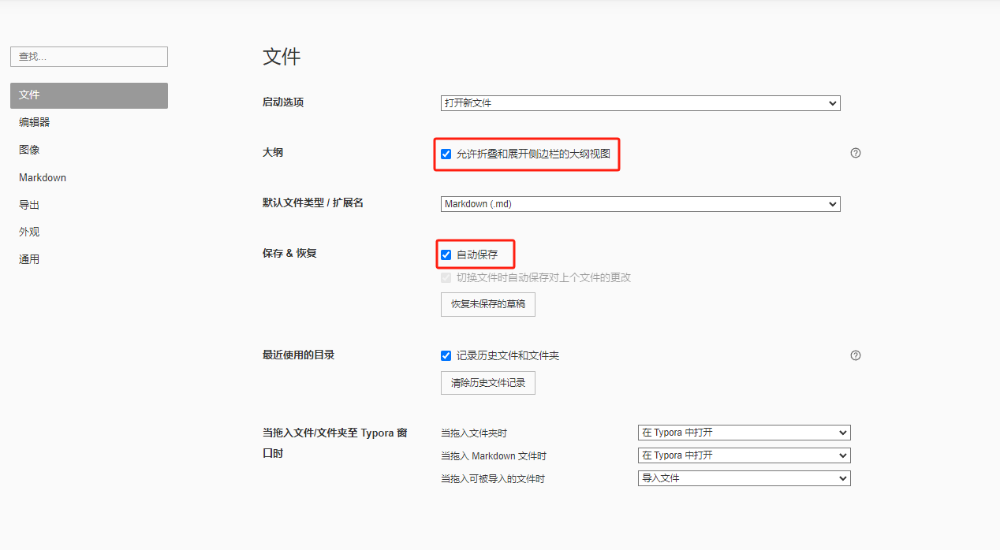
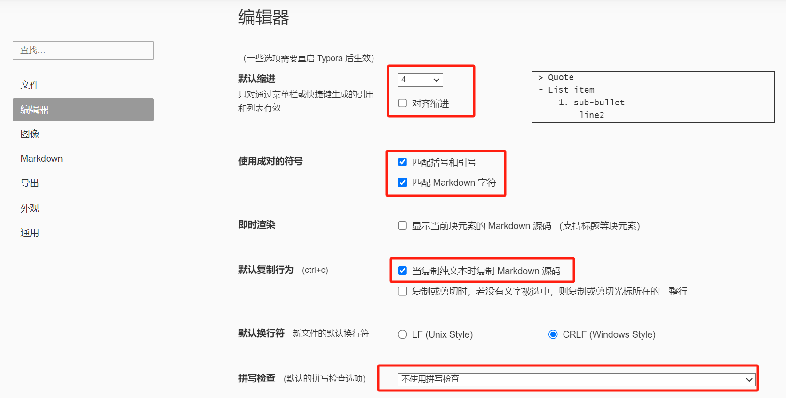
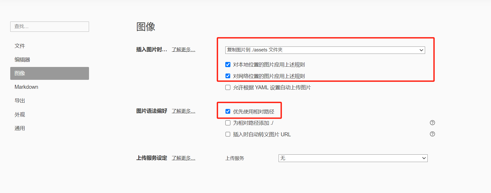
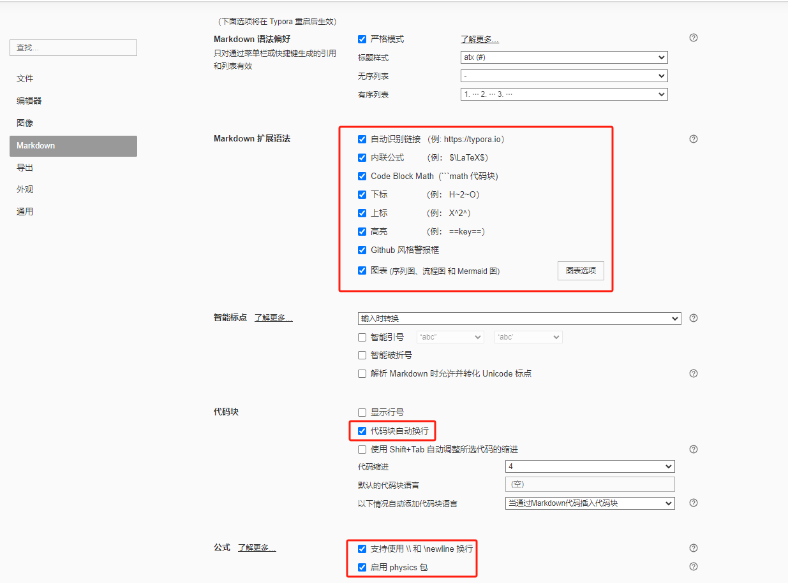
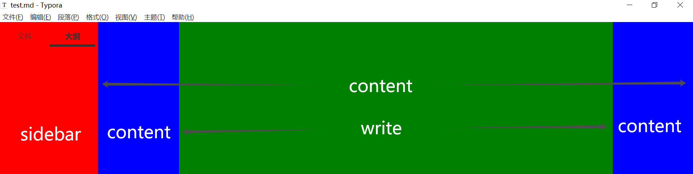

# Typora 基础

**Typora** 是一款 Markdown 编辑器，结合了 Markdown 编辑和实时预览功能。Typora 采用 *所见即所得* 模式，意味着你在编辑 Markdown 文件时，实时看到渲染后的效果。

**Typora 支持以下语法**：

- 全部 Markdown 原生语法
- 部分 Markdown 扩展语法
- HTML
- CSS
- LaTex
- ...

## 环境搭建

[官网下载安装 Typora](https://typora.io/)

### 配置服务器

1. **服务器**：无论激活还是使用，都应使用**国内服务器**。
2. **路径**：`File` - `Preferences` - `General` - `Use Typora server in China`
3. **E-mail**：3933
4. **激活码**：QFW7SN-VHN2CC-SU7UJ5-XJ5S3S

### 偏好设置

- `文件` - `偏好设置`
- **文件**

    

- **编辑器**

    

- **图像**

    

- **Markdown**

    

### 其它设置

- **单换行符**：`编辑` - `空格与换行` - 取消 `保留单换行符`

## 快捷键

<table style="text-align: center;">
  <tr>
    <th>操作</th>
    <th>快捷键</th>
  </tr>
  <tr>
    <td>标题&nbsp;(Heading)</td>
    <td>
      <kbd>Ctrl</kbd>&nbsp;+&nbsp;<kbd>Num</kbd>
    </td>
  </tr>
  <tr>
    <td>粗体&nbsp;(Strong)</td>
    <td>
      <kbd>Ctrl</kbd>&nbsp;+&nbsp;<kbd>B</kbd>
    </td>
  </tr>
  <tr>
    <td>斜体&nbsp;(Emphasis)</td>
    <td>
      <kbd>Ctrl</kbd>&nbsp;+&nbsp;<kbd>I</kbd>
    </td>
  </tr>
  <tr>
    <td>下划线&nbsp;(Underline)</td>
    <td>
      <kbd>Ctrl</kbd>&nbsp;+&nbsp;<kbd>U</kbd>
    </td>
  </tr>
  <tr>
    <td>删除线&nbsp;(Strike)</td>
    <td>
      <kbd>Alt</kbd>&nbsp;+&nbsp;<kbd>Shift</kbd>+&nbsp;<kbd>5</kbd>
    </td>
  </tr>
  <tr>
    <td>单行换行</td>
    <td>
      <kbd>Space</kbd>&nbsp;-&nbsp;<kbd>Space</kbd>-&nbsp;<kbd>Shift</kbd>+&nbsp;<kbd>Enter</kbd>
    </td>
  </tr>
  <tr>
    <td>内容</td>
    <td>内容</td>
  </tr>
  <tr>
    <td>内容</td>
    <td>内容</td>
  </tr>
  <tr>
    <td>内容</td>
    <td>内容</td>
  </tr>
  <tr>
    <td>内容</td>
    <td>内容</td>
  </tr>
  <tr>
    <td>内容</td>
    <td>内容</td>
  </tr>
  <tr>
    <td>内容</td>
    <td>内容</td>
  </tr>
</table>

# 主题

## 安装主题

- [官网下载主题文件并解压](https://theme.typoraio.cn/)
    - **文件 | 偏好设置** > **外观** > **打开主题文件夹**
    - 复制**基本文件夹**和**所有 CSS 文件**到 Typora 主题文件夹

- 复制 **base.ueser.css** 到主题文件夹
- 编写 **{current-theme}.user.css** 并复制到主题文件夹
- 重启 Typora
- **主题 | 选择主题**

## 主题基础

- **工作区域**

    

- **各种可修改的部分**

    ```css
    /* ---------------------- sidebar ---------------- */
    /* sidebar 区背景色 */
    #typora-sidebar {
    background-color: #fff;
    }
    /* ---------------------- content ---------------- */
    /* content 区背景色 */
    content {
    background-color: #f7f8fa;
    }
    /* ---------------------- write ---------------- */
    /* write 区背景色 */
    #write {
    background-color: #fff;
    }
    
    /* write 区加宽 */
    #write {
      max-width: 1500px;
      margin: 0 auto;
      padding: 30px;
      padding-bottom: 100px;
    }
    /* ---------------------- 标题 ---------------- */
    /* 一级标题居中 */
    h1 {
    text-align: center; 
    }
    /* ---------------------- 代码块 ---------------- */
    /* 行内代码高亮颜色 */
    code {
    color: #f50059;
    }
    
    /* 代码块背景色 */
    pre {
      background-color: #dcdcdc !important;
    }
    
    /* 语言选择器 */
    /*
    为了解决 github-night-dimmed 主题语言选择器背景颜色冲突,
    需要在 github-night.css 中的类选择器.auto-suggest-container中注释以下样式：
      background-color: var(--item-hover-bg-color);
    */
    /* ---------------------- 超链接 ---------------- */
    /* 超链接取消下划线 */
    a:link {
      text-decoration: none !important;
    }
    
    /* 超链接悬停显示下划线 */
    a:hover {
    text-decoration: underline !important;
    }
    
    /* 超链接颜色 */
    a:link {
      color: black !important;
    }
    
    /* 超链接悬停变色 */
    a:hover {
      color: #4183C4 !important;
    }
    /* ---------------------- 图片 ---------------- */
    /* 图片样式 */
    #write img {
    border: 1px solid rgb(229, 229, 229);
    }
    
    /* 图片靠左 */
    p .md-image:only-child{
      width: auto;
      text-align: left;
    }
    /* ---------------------- 其它 ---------------- */
    /* 删除线颜色 */
    del {
      text-decoration-color: red;
    }
    
    /* 未知代码继承 */
    .md-heading code, #typora-sidebar code {
    color: inherit;
    }
    
    /* kbd标签 */
    kbd {
      color: #000000;  /* 文本颜色 */
      font-size: 1.1em;  /* 字体大小变大 */
      padding: 7px 12px;  /* 增加内边距，使元素更大 */
    }
    
    /* 去除图片黑边 */
    .md-image>img {
      margin: 0;
      padding: 0;
    }
    
    /* 设置加粗文本粗细 */
    strong {
      font-weight: 1000 !important; /* 使用更高的字体粗细 */
    }
    ```

## 自定义主题

- 当想修改一个已下载的主题时，应创建**自定义 CSS 文件**，[详见官方说明](https://support.typora.io/Add-Custom-CSS/)
    - 不要在原主题文件修改
    - `base.user.css`：对所有主题生效
    - `{current-theme}.user.css`：对 `{current-theme}.css` 生效

- 关于标题自动编号，[详见官方说明](https://support.typora.io/Auto-Numbering/)

- GitHub 网友制作了一个优秀的 [`base.user.css`](https://github.com/lipengzhou/typora-theme-auto-numbering)

    - 1级标题没有编号
    - 大纲和正文都有自动编号，而且支持删除某个编号，其余编号自动更正
    - 不需要禁止大纲自动折叠
    - 导出至PDF时，保留编号

- **自定义 base.user.css**

    ```css
    /**
     * author: LPZ
     * email: lpzmail@163.com
     */
    
    /* 标题字体 */
    h1,
    h2,
    h3,
    h4,
    strong {
      font-weight: 600;
    }
    
    /* initialize css counter */
    #write {
      counter-reset: h1;
    }
    
    h1 {
      counter-reset: h2;
    }
    
    h2 {
      counter-reset: h3;
    }
    
    h3 {
      counter-reset: h4;
    }
    
    h4 {
      counter-reset: h5;
    }
    
    h5 {
      counter-reset: h6;
    }
    
    /* put counter result into headings（h1 不添加） */
    #write h2:before {
      counter-increment: h2;
      content: counter(h2) ". ";
    }
    
    #write h3:before,
    h3.md-focus.md-heading:before {
      /** override the default style for focused headings */
      counter-increment: h3;
      content: counter(h2) "." counter(h3) ". ";
    }
    
    #write h4:before,
    h4.md-focus.md-heading:before {
      counter-increment: h4;
      content: counter(h2) "." counter(h3) "." counter(h4) ". ";
    }
    
    #write h5:before,
    h5.md-focus.md-heading:before {
      counter-increment: h5;
      content: counter(h2) "." counter(h3) "." counter(h4) "." counter(h5) ". ";
    }
    
    #write h6:before,
    h6.md-focus.md-heading:before {
      counter-increment: h6;
      content: counter(h2) "." counter(h3) "." counter(h4) "." counter(h5) "."
        counter(h6) ". ";
    }
    
    /** override the default style for focused headings */
    #write > h3.md-focus:before,
    #write > h4.md-focus:before,
    #write > h5.md-focus:before,
    #write > h6.md-focus:before,
    h3.md-focus:before,
    h4.md-focus:before,
    h5.md-focus:before,
    h6.md-focus:before {
      color: inherit;
      border: inherit;
      border-radius: inherit;
      position: inherit;
      left: initial;
      float: none;
      top: initial;
      font-size: inherit;
      padding-left: inherit;
      padding-right: inherit;
      vertical-align: inherit;
      font-weight: inherit;
      line-height: inherit;
    }
    
    /* 添加 TOC 自动序号样式 */
    .md-toc-content {
      counter-reset: toc-h1;
    }
    
    .md-toc-h1 {
      counter-reset: toc-h2;
    }
    
    .md-toc-h2 {
      counter-reset: toc-h3;
    }
    
    .md-toc-h3 {
      counter-reset: toc-h4;
    }
    
    .md-toc-h4 {
      counter-reset: toc-h5;
    }
    
    .md-toc-h5 {
      counter-reset: toc-h6;
    }
    
    .md-toc-content .md-toc-h2 a:before {
      counter-increment: toc-h2;
      content: counter(toc-h2) ". ";
    }
    
    .md-toc-content .md-toc-h3 a:before {
      counter-increment: toc-h3;
      content: counter(toc-h2) "." counter(toc-h3) ". ";
    }
    
    .md-toc-content .md-toc-h4 a:before {
      counter-increment: toc-h4;
      content: counter(toc-h2) "." counter(toc-h3) "." counter(toc-h4) ". ";
    }
    
    .md-toc-content .md-toc-h5 a:before {
      counter-increment: toc-h5;
      content: counter(toc-h2) "." counter(toc-h3) "." counter(toc-h4) "."
        counter(toc-h5) ". ";
    }
    
    .md-toc-content .md-toc-h6 a:before {
      counter-increment: toc-h6;
      content: counter(toc-h2) "." counter(toc-h3) "." counter(toc-h4) "."
        counter(toc-h5) "." counter(toc-h6) ". ";
    }
    
    /* 侧边栏自动编号 */
    .outline-content {
      counter-reset: outline-h2;
    }
    
    .outline-h1 {
      counter-reset: outline-h2;
    }
    
    .outline-h2 {
      counter-reset: outline-h3;
    }
    
    .outline-h3 {
      counter-reset: outline-h4;
    }
    
    .outline-h4 {
      counter-reset: outline-h5;
    }
    
    .outline-h5 {
      counter-reset: outline-h6;
    }
    
    .outline-content .outline-h2 .outline-label:before {
      counter-increment: outline-h2;
      content: counter(outline-h2) ". ";
    }
    
    .outline-content .outline-h3 .outline-label:before {
      counter-increment: outline-h3;
      content: counter(outline-h2) "." counter(outline-h3) ". ";
    }
    
    .outline-content .outline-h4 .outline-label:before {
      counter-increment: outline-h4;
      content: counter(outline-h2) "." counter(outline-h3) "." counter(outline-h4)
        ". ";
    }
    
    .outline-content .outline-h5 .outline-label:before {
      counter-increment: outline-h5;
      content: counter(outline-h2) "." counter(outline-h3) "." counter(outline-h4)
        "." counter(outline-h5) ". ";
    }
    
    .outline-content .outline-h6 .outline-label:before {
      counter-increment: outline-h6;
      content: counter(outline-h2) "." counter(outline-h3) "." counter(outline-h4)
        "." counter(outline-h5) "." counter(outline-h6) ". ";
    }
    
    /* 自定义强制换号符，使得在导出PDF 或打印时强制换行 */
    @media print {
      /* 这是自定义标签, 在需要换行的地方插入：<pb> */
      pb {
        display: block;
        page-break-after: always;
      }
    
      h1 {
        page-break-before: always;
      }
    
      h1:first-of-type {
        page-break-before: avoid;
      }
    }
    
    /* 完成的 Task 添加删除线 */
    .task-list-done {
      text-decoration: line-through;
      color: #777;
    }
    
    /* 添加键盘样式 */
    kbd {
      box-shadow: inset 0 -2px 0 #c6cbd1;
      background-color: white;
    }
    
    /* -----------------------以下为自己修改区域----------------- */
    
    /* write 区加宽 */
    #write {
      max-width: 1500px;
      margin: 0 auto;
      padding: 30px;
      padding-bottom: 100px;
    }
    
    /* 一级标题居中 */
    h1 {
      text-align: center;
    }
    
    /* 图片边框 */
    #write img {
      border: 1px solid rgb(229, 229, 229);
    }
    
    /* 图片靠左 */
    p .md-image:only-child {
      width: auto;
      text-align: left;
    }
    
    /* 去除图片黑边 */
    .md-image > img {
      margin: 0;
      padding: 0;
    }
    
    /* 超链接取消下划线 */
    a:link {
      text-decoration: none !important;
    }
    
    /* 超链接悬停显示下划线 */
    a:hover {
      text-decoration: underline !important;
    }
    ```

## Github

- Github 是 Typora 官方默认主题。

- **Github.css  文件留存**：

    ```css
    /* -----------------------以下为修改区域----------------- */
    /* sidebar 区背景色 */
    #typora-sidebar {
      background-color: #fff;
    }
    
    /* content 区背景色 */
    content {
      background-color: #f7f8fa;
    }
    
    /* write 区背景色 */
    #write {
      background-color: #fff;
    }
    
    /* 代码块背景色 */
    pre {
      background-color: #dcdcdc !important;
    }
    
    /* 删除线颜色 */
    del {
      text-decoration-color: red;
    }
    
    /* 修改<kbd> */
    kbd {
      /* 文本颜色 */
      color: #000000;
      
      /* 字体大小变大 */
      font-size: 1.1em;
    
      /* 增加内边距，使元素更大 */
      padding: 7px 12px;
    }
    ```

## github-night-dimmed

- [github-night-dimmed 是从 GitHub 下载的暗黑主题。](https://github.com/kinoute/typora-github-night-theme/releases/tag/v0.6.2)

- **安装**：把以下所有文件（夹）复制到主题文件夹

    - github-night
    - github-night.css
    - github-night-dimmed.css
    - github-night-high-contrast.css

- **注意**：github-night-dimmed.css 引入了 github-night.css 的样式

- 编写自定义主题文件 **github-night-dimmed.user.css**，复制到主题文件夹

    ```css
    /* 删除线颜色 */
    del {
      text-decoration-color: red;
    }
    
    /* <kbd>样式 */
    kbd {
      color: #000000;
      font-size: 1.1em;
      /* 增加内边距，使元素更大 */
      padding: 7px 12px;
    }
    
    /* 使用更高的加粗文本粗细 */
    strong {
      font-weight: 1000 !important;
    }
    
    /* 语言选择器 */
    /*
    为了解决 github-night-dimmed 主题语言选择器背景颜色冲突,
    需要在 github-night.css 中的类选择器.auto-suggest-container中注释以下样式：
      background-color: var(--item-hover-bg-color);
    */
    ```

# [图片](https://support.typora.io/Images/)

## 插入图片

以下方法可以插入图片：

- **MD 语法**：

    - 手动编写：``
    - 拖放图片，自动转换为 MD 语法
    - 从剪贴板粘贴图片，自动转换为 MD 语法

- **HTML 语法**：``
- **转换语法**：`右键图片` - `转换图片语法` - `HTML`

## 存储图片

- **本地存储**：

    - 目前本地引用使用相对路径
    - 无论何种方式插入以后，都自动将图片保存至同级文件夹下的  `assets文件夹` 中。
    - `文件` - `偏好设置` - `图像`

        

- **云存储**：可将图片上传至云服务器
- **更改存储**

    - 将所有引用的本地图片移动到指定文件夹，同时自动修改引用路径。
    - `格式` - `图像` - `移动所有图片到...`

- **复制时的存储**

    - 在复制内容时，一定要**带着标题复制**，否则图片不会复制到**目标 assets 文件夹**
    - 如果是剪切，并且原文件没有其它引用，在复制完以后，记得删除原文件夹中的图片

## 删除图片

- **删除代码**：在删除代码以后，如果此图片无用，应及时在 `assets` 文件夹中手动删除相应图片。
- **删除文件**：`右键` - `删除图片文件`

## 复制图片

- 在复制内容时，一定要**带着标题复制**，否则图片不会复制到**目标 assets 文件夹**，而是以绝对路径引用原来的图片。

    - 如果目标文件夹有图片与复制的图片同名，则会自动改名创建一个新图片。
    - 如果没有同名图片，则会将图片复制到新文件的 **assets 文件夹**。

- 如果剪切，并且原文件没有其它引用。
    - 不要剪切，否则原文件图片不会删除。
    - 要先复制，再粘贴。
    - 在粘贴完以后，记得删除原文件夹中的图片（右键先删图片，再删文字内容）。


## 多张并排图片

- 使用 HTML 语法

    <div style="display: flex; justify-content: center;">
        
        
    </div>

# 表格

- Typora 默认的是 Markdown 格式的表格，无合并单元格等复杂功能，所以使用 HTML 创建表格。

    ```html
    <!-- 全文居中 -->
    <table style="text-align: center;">
    <tr>
      <!-- 该单元格占2列 -->
      <th colspan="2">表头1</th>
      <th>表头2</th>
      <th>表头3</th>
      <th>表头4</th>
    </tr>
    <tr>
      <!-- 该单元格占3行 -->
      <td rowspan="3">内容</td>
      <td>内容</td>
      <td colspan="2">内容</td>
      <td>内容</td>
    </tr>
    <tr>
      <td>内容</td>
      <td colspan="3">内容</td>
    </tr>
    <tr>
      <td>内容</td>
      <td>内容</td>
      <td>内容</td>
      <td>内容</td>
    </tr>
    </table>
    ```

- **HTML 表格模板**：

    ```html
    <table style="text-align: center;">
      <tr>
        <th>表头1</th>
        <th>表头2</th>
        <th>表头3</th>
      </tr>
      <tr>
        <td>内容</td>
        <td>内容</td>
        <td>内容</td>
      </tr>
      <tr>
        <td>内容</td>
        <td>内容</td>
        <td>内容</td>
      </tr>
      <tr>
        <td>内容</td>
        <td>内容</td>
        <td>内容</td>
      </tr>
    </table>
    ```

# 公式

Typora 使用 LaTeX 语法输入公式，具体详见 LaTex。

- 行内公式：`$...$`
- 块级公式：`$$...$$`<br>````math` 和 `$$ + Enter` 效果一样

Typora 使用 LaTex 编辑公式时的几点说明：

- **水平对齐**：只能使用**水平移动** `\hspace{-80mm} 公式内容`
- **上下两个公式**：使用**换行** `公式1\\公式2`

# 图表

- Typora 使用 Mermaid 语言创建图表。
- **语法**：将代码块语言添加 mermaid 即可。

## 流程图

```
%% 定义图的方向
graph TD
	%% 定义样式类
	classDef israeliNode fill:#3c78d8,stroke:#333,stroke-width:0px,color:#ffffff;
	classDef islamNode fill:#5fdd27,stroke:#333,stroke-width:0px,color:#ffffff;
	classDef judaismNode fill:#FFB900,stroke:#333,stroke-width:0px,color:#ffffff;
	classDef christNode fill:#F7630C,stroke:#333,stroke-width:0px,color:#ffffff;
	
	%% 定义节点和连接线
	A(亚当&夏娃) --> B(赛特\n第1世孙)
	B --> C(……)
	C --> D(挪亚\n第9世孙)
	D --> E(……)
	E --> F(亚伯拉罕\n第20世孙)
	F --> G(以撒)
	G --> H(雅各)
	H --> I(犹大)
	I --> J(大卫\n第33世孙\n以色列联合王国)
	J --> K(南方犹大)
	K --> L(……)
	L --> M(约西亚)
	M --> N(西底家\n末代犹大君王)
	N --> O(……)
	O --> P(现代以色列人)
	
	F --> F1(以实玛利)
	F1 --> F2(……)
	F2 --> F3(阿拉伯人)
	F3 --> F4(……)
	F4 --> F5(穆罕默德)
	F5 --> F6(伊斯兰教)
	
	H --> H1(利未)
	H1 --> H2(……)
	H2 --> H3(摩西)
	H3 --> H4(犹太教)
	
	M --> M1(约雅敬\n倒数第3代犹大君王)
	M1 --> M2(约雅斤\n倒数第2代犹大君王)
	M2 --> M3(……)
	M3 --> M4(约瑟)
	M4 --> M5(耶稣\n第75世孙)
	M5 --> M6(基督教)
	
	%% 应用样式类
	class A,B,C,D,E,F,G,H,I,J,K,L,M,N,O,P israeliNode;
	class F1,F2,F3,F4,F5,F6 islamNode;
	class H1,H2,H3,H4 judaismNode;
	class M1,M2,M3,M4,M5,M6 christNode;
```

# 其它

## 帮助

[更多帮助，在 Typora 技术支持](https://support.typoraio.cn/)

## 未解决问题

- 无法正确渲染连续空格

## 突出显示

- **斜体**：强调语气、定义中的术语、技术术语、引用作品、音译、思想或船名
- **粗体**：行首名词、关键词
- **反引号**：`代码`、`变量名`、`文件路径`、`命令`、`扩展名` 等

## 格式转换

- 安装 `Pandoc` 以后，可以增强 Typora 的导出功能。

## 锚点

- Typora 标题自带锚点，id 值为 `标题名`。

## 列表嵌套

- 列表嵌套时，要在源码中进行。

    - 防止产生多余空行。
    - 防止有序列表序号中断。
