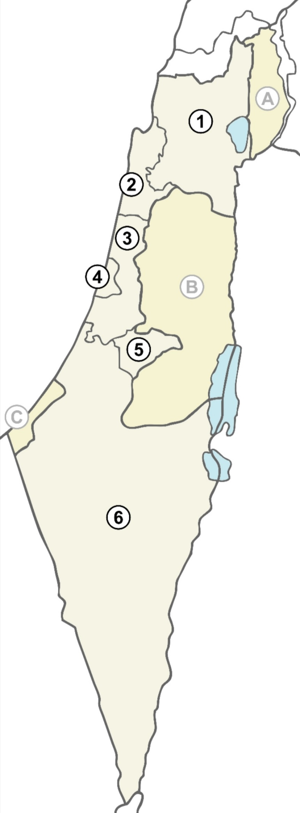

# 实验

## 成功

  

    
  

  

    
以色列的行政区划包括以下六个行政区（括号内为首府）：

    <ul>
      <li>1 <a href="https://zh.wikipedia.org/wiki/北部区_(以色列)">北部区</a>（<a href="https://zh.wikipedia.org/wiki/拿撒勒">拿撒勒</a>）</li>
      <li>2 <a href="https://zh.wikipedia.org/wiki/海法区">海法区</a>（<a href="https://zh.wikipedia.org/wiki/海法">海法</a>）</li>
      <li>3 <a href="https://zh.wikipedia.org/wiki/中央区_(以色列)">中央区</a>（<a href="https://zh.wikipedia.org/wiki/拉姆拉">拉姆拉</a>）</li>
      <li>4 <a href="https://zh.wikipedia.org/wiki/特拉维夫区">特拉维夫区</a>（<a href="https://zh.wikipedia.org/wiki/特拉维夫">特拉维夫</a>）</li>
      <li>5 <a href="https://zh.wikipedia.org/wiki/耶路撒冷区">耶路撒冷区</a>（<a href="https://zh.wikipedia.org/wiki/耶路撒冷">耶路撒冷</a>）</li>
      <li>6 <a href="https://zh.wikipedia.org/wiki/南部区_(以色列)">南部区</a>（<a href="https://zh.wikipedia.org/wiki/贝尔谢巴">贝尔谢巴</a>）</li>
    </ul>
    

      另外，以色列还有以下三个<a href="https://zh.wikipedia.org/wiki/世界主權爭端領土列表">争议地区</a>（括号内为争议地区所属的以色列行政区划）：
    

    <ul>
      <li>
        A <a href="https://zh.wikipedia.org/wiki/戈蘭高地">戈兰高地</a>（<a href="https://zh.wikipedia.org/wiki/北部区_(以色列)">北部区</a>）
        <ul>
          <li>六日战争前为原叙利亚领土，目前由以色列控制。</li>
        </ul>
      </li>
      <li>
        B <a href="https://zh.wikipedia.org/wiki/約旦河西岸">约旦河西岸</a>（<a href="https://zh.wikipedia.org/wiki/猶太-撒馬利亞區">犹太-撒马利亚区</a>）
        <ul>
          <li>六日战争前由约旦占领，现为《<a href="https://zh.wikipedia.org/wiki/聯合國安全理事會第242號決議">联合国安全理事会第242号决议</a>》的<a href="https://zh.wikipedia.org/wiki/巴勒斯坦领土">巴勒斯坦领土</a>，目前分别由以色列及<a href="https://zh.wikipedia.org/wiki/巴勒斯坦自治政府">巴勒斯坦自治政府</a>控制。</li>
        </ul>
      </li>
      <li>
        C <a href="https://zh.wikipedia.org/wiki/加沙地帶">加沙地带</a>（无所属区划）
        <ul>
          <li>六日战争前由埃及占领，现为《联合国安全理事会第242号决议》的巴勒斯坦领土，目前分别由以色列及<a href="https://zh.wikipedia.org/wiki/哈馬斯">哈马斯</a>控制。</li>
        </ul>
      </li>
    </ul>
  

## 规范实验

  

    
  

  <figcaption style="flex: 2; font-size: 16px; color: gray">
    
以色列的行政区划包括以下六个行政区（括号内为首府）：

    <ul>
      <li>1 <a href="https://zh.wikipedia.org/wiki/北部区_(以色列)">北部区</a>（<a href="https://zh.wikipedia.org/wiki/拿撒勒">拿撒勒</a>）</li>
      <li>2 <a href="https://zh.wikipedia.org/wiki/海法区">海法区</a>（<a href="https://zh.wikipedia.org/wiki/海法">海法</a>）</li>
      <li>3 <a href="https://zh.wikipedia.org/wiki/中央区_(以色列)">中央区</a>（<a href="https://zh.wikipedia.org/wiki/拉姆拉">拉姆拉</a>）</li>
      <li>4 <a href="https://zh.wikipedia.org/wiki/特拉维夫区">特拉维夫区</a>（<a href="https://zh.wikipedia.org/wiki/特拉维夫">特拉维夫</a>）</li>
      <li>5 <a href="https://zh.wikipedia.org/wiki/耶路撒冷区">耶路撒冷区</a>（<a href="https://zh.wikipedia.org/wiki/耶路撒冷">耶路撒冷</a>）</li>
      <li>6 <a href="https://zh.wikipedia.org/wiki/南部区_(以色列)">南部区</a>（<a href="https://zh.wikipedia.org/wiki/贝尔谢巴">贝尔谢巴</a>）</li>
    </ul>
    

      另外，以色列还有以下三个<a href="https://zh.wikipedia.org/wiki/世界主權爭端領土列表">争议地区</a>（括号内为争议地区所属的以色列行政区划）：
    

    <ul>
      <li>
        A <a href="https://zh.wikipedia.org/wiki/戈蘭高地">戈兰高地</a>（<a href="https://zh.wikipedia.org/wiki/北部区_(以色列)">北部区</a>）
        <ul>
          <li>六日战争前为原叙利亚领土，目前由以色列控制。</li>
        </ul>
      </li>
      <li>
        B <a href="https://zh.wikipedia.org/wiki/約旦河西岸">约旦河西岸</a>（<a href="https://zh.wikipedia.org/wiki/猶太-撒馬利亞區">犹太-撒马利亚区</a>）
        <ul>
          <li>六日战争前由约旦占领，现为《<a href="https://zh.wikipedia.org/wiki/聯合國安全理事會第242號決議">联合国安全理事会第242号决议</a>》的<a href="https://zh.wikipedia.org/wiki/巴勒斯坦领土">巴勒斯坦领土</a>，目前分别由以色列及<a href="https://zh.wikipedia.org/wiki/巴勒斯坦自治政府">巴勒斯坦自治政府</a>控制。</li>
        </ul>
      </li>
      <li>
        C <a href="https://zh.wikipedia.org/wiki/加沙地帶">加沙地带</a>（无所属区划）
        <ul>
          <li>六日战争前由埃及占领，现为《联合国安全理事会第242号决议》的巴勒斯坦领土，目前分别由以色列及<a href="https://zh.wikipedia.org/wiki/哈馬斯">哈马斯</a>控制。</li>
        </ul>
      </li>
    </ul>
  </figcaption>

## 规范实验整理

  

    
  

  <figcaption style="flex: 2; font-size: 16px; color: gray">
    
以色列的行政区划包括以下六个行政区（括号内为首府）：

    <ul>
      <li>
        1 <a href="https://zh.wikipedia.org/wiki/北部区_(以色列)">北部区</a>（<a
          href="https://zh.wikipedia.org/wiki/拿撒勒"
          >拿撒勒</a
        >）
      </li>
      <li>
        2 <a href="https://zh.wikipedia.org/wiki/海法区">海法区</a>（<a
          href="https://zh.wikipedia.org/wiki/海法"
          >海法</a
        >）
      </li>
      <li>
        3 <a href="https://zh.wikipedia.org/wiki/中央区_(以色列)">中央区</a>（<a
          href="https://zh.wikipedia.org/wiki/拉姆拉"
          >拉姆拉</a
        >）
      </li>
      <li>
        4 <a href="https://zh.wikipedia.org/wiki/特拉维夫区">特拉维夫区</a>（<a
          href="https://zh.wikipedia.org/wiki/特拉维夫"
          >特拉维夫</a
        >）
      </li>
      <li>
        5 <a href="https://zh.wikipedia.org/wiki/耶路撒冷区">耶路撒冷区</a>（<a
          href="https://zh.wikipedia.org/wiki/耶路撒冷"
          >耶路撒冷</a
        >）
      </li>
      <li>
        6 <a href="https://zh.wikipedia.org/wiki/南部区_(以色列)">南部区</a>（<a
          href="https://zh.wikipedia.org/wiki/贝尔谢巴"
          >贝尔谢巴</a
        >）
      </li>
    </ul>
    

      另外，以色列还有以下三个<a
        href="https://zh.wikipedia.org/wiki/世界主權爭端領土列表"
        >争议地区</a
      >（括号内为争议地区所属的以色列行政区划）：
    

    <ul>
      <li>
        A <a href="https://zh.wikipedia.org/wiki/戈蘭高地">戈兰高地</a>（<a
          href="https://zh.wikipedia.org/wiki/北部区_(以色列)"
          >北部区</a
        >）
        <ul>
          <li>六日战争前为原叙利亚领土，目前由以色列控制。</li>
        </ul>
      </li>
      <li>
        B <a href="https://zh.wikipedia.org/wiki/約旦河西岸">约旦河西岸</a>（<a
          href="https://zh.wikipedia.org/wiki/猶太-撒馬利亞區"
          >犹太-撒马利亚区</a
        >）
        <ul>
          <li>
            六日战争前由约旦占领，现为《<a
              href="https://zh.wikipedia.org/wiki/聯合國安全理事會第242號決議"
              >联合国安全理事会第242号决议</a
            >》的<a href="https://zh.wikipedia.org/wiki/巴勒斯坦领土"
              >巴勒斯坦领土</a
            >，目前分别由以色列及<a
              href="https://zh.wikipedia.org/wiki/巴勒斯坦自治政府"
              >巴勒斯坦自治政府</a
            >控制。
          </li>
        </ul>
      </li>
      <li>
        C
        <a href="https://zh.wikipedia.org/wiki/加沙地帶">加沙地带</a
        >（无所属区划）
        <ul>
          <li>
            六日战争前由埃及占领，现为《联合国安全理事会第242号决议》的巴勒斯坦领土，目前分别由以色列及<a
              href="https://zh.wikipedia.org/wiki/哈馬斯"
              >哈马斯</a
            >控制。
          </li>
        </ul>
      </li>
    </ul>
  </figcaption>
  

