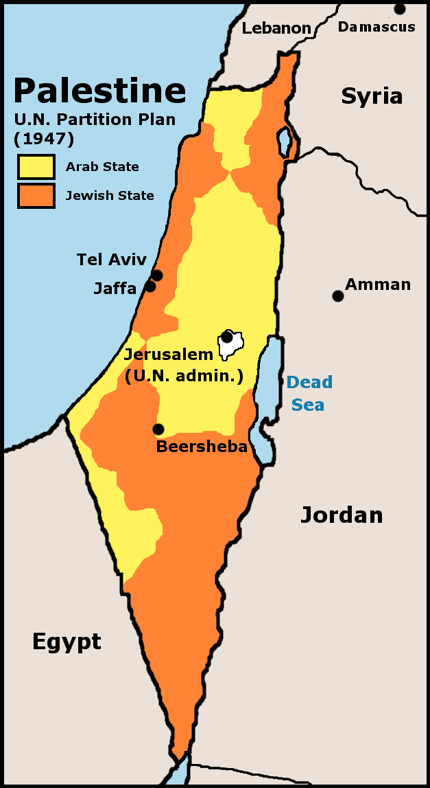

# 实验

## 测试视频

<video 
  controls 
  src="assets/测试视频.MP4" 
  style="display: block; margin-left: 0; margin-right: auto; width: 25%;"
></video>
1

## 再次figure

<figure>
  
  <figcaption style="font-size: 16px; color: gray;">第一行解释</figcaption>
  <figcaption style="font-size: 16px; color: gray;">第二行解释</figcaption>
</figure>

11

## 第三次中东战争

- 1967年6月5日，即“六日战争”。1967年6月5日，即“六日战争”。埃及驱逐在加沙地带的联合国维和部队，并且再次封锁帝朗蓝海峡，又在接壤以色列的边界大量屯兵，于是以色列对埃及开战，叙利亚和约旦后期参战。

- 以色列一口气夺下了约旦河西岸（1967年—现在）、加沙地带（1967年—2005年；但仍控制领空和水域）、西奈半岛（1967年—1982年）、和戈兰高地，控制了巴勒斯坦全境。以色列将其法律管辖范围拓展至戈兰高地和东耶路撒冷，很多巴人被迫流落到周围阿拉伯国家和世界各地，沦为难民。

- 第三次中东战争后格局

    

    > 上图为第三次中东战争后格局
    >
    > 白色：第三次中东战争前的以色列；
    >
    > 粉红色：第三次中东战争后的以色列取得的领土（约旦河西岸、加沙地带、戈兰高地及西奈半岛）

## 慕尼黑惨案

## 《联合国大会181号决议》

- **《联合国大会181号决议》**

    

- 1947年11月29日，联合国大会表决了《联合国大会181号决议》，通过决议：英国于1948年8月1日之前结束在巴勒斯坦的委任统治，并撤出其军队；两个月后，在总面积2.7万平方公里的巴勒斯坦的土地上再建立两个国家（之前的东部已建立约旦），即阿拉伯国和犹太国。根据分治决议的蓝图，阿拉伯国国土11203平方公里，约占当时巴勒斯坦总面积的43%，人口中阿拉伯人为72.5万人，犹太人为1万人；犹太国国土为14942平方公里，约占巴勒斯坦总面积的57%，人口中阿拉伯人为49.7万人，犹太人为59.8万人。决议还规定：成立耶路撒冷市国际特别政权，由联合国来管理。

- 阿拉伯人因联大违背“民族自决权”而拒绝接受“分治方案”，并导致大规模冲突。

## 《联合国大会181号决议》

- **《联合国大会181号决议》**

    <figure>
      
      <figcaption style="font-size: 16px; color: gray;">浅黄色为阿拉伯国家（即巴勒斯坦）</figcaption>
      <figcaption style="font-size: 16px; color: gray;">橙黄色为犹太国家（即以色列）</figcaption>
    </figure>

- 1947年11月29日，联合国大会表决了《联合国大会181号决议》，通过决议：英国于1948年8月1日之前结束在巴勒斯坦的委任统治，并撤出其军队；两个月后，在总面积2.7万平方公里的巴勒斯坦的土地上再建立两个国家（之前的东部已建立约旦），即阿拉伯国和犹太国。根据分治决议的蓝图，阿拉伯国国土11203平方公里，约占当时巴勒斯坦总面积的43%，人口中阿拉伯人为72.5万人，犹太人为1万人；犹太国国土为14942平方公里，约占巴勒斯坦总面积的57%，人口中阿拉伯人为49.7万人，犹太人为59.8万人。决议还规定：成立耶路撒冷市国际特别政权，由联合国来管理。

- 阿拉伯人因联大违背“民族自决权”而拒绝接受“分治方案”，并导致大规模冲突。
