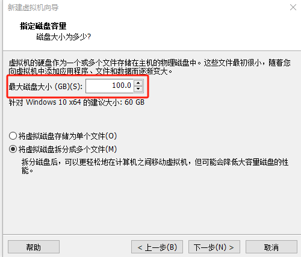
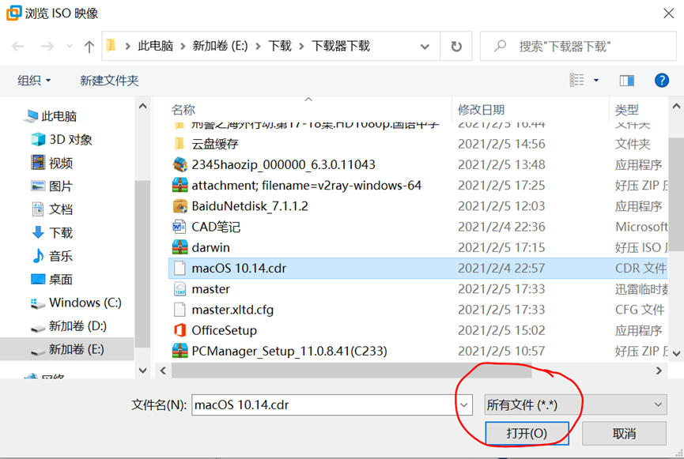

# 名词解释

- 宿主机：指电脑正常的系统

- 客户机：指虚拟的系统

- 虚拟机：指 `Vmware workstation`

# 环境搭建

-  [官网下载 `Vmware workstation`](https://www.vmware.com/products/desktop-hypervisor/workstation-and-fusion)
-  主板最好开启 `CSM` 功能，否则 `Linux` 可能进不去系统。
-  以下是从网上找的 VMware Workstation Pro 密钥

    - 17秘钥：`MC60H-DWHD5-H80U9-6V85M-8280D`
    - 15.5秘钥：`YG5H2-ANZ0H-M8ERY-TXZZZ-YKRV8`

-  设置客户机存储位置：`编辑` > `首选项` > `虚拟机默认存储位置`

# 创建虚拟机

## 创建虚拟机

- `创建虚拟机` > `典型` > `稍后安装操作系统`

    

- 这里即使是 Win 11 也不要选择 Win 11，会给 U 盘的使用造成麻烦。

    

- 更改虚拟系统显示名称和存储位置

    

- 配置磁盘空间（后期可增容）

    

- 如果最初选择了 `安装程序光盘映像文件`，在此处先取消勾选 `创建后开启此虚拟机`。

    

- 点击 `完成`，至此完成客户机的创建。

- 使用 CD 或启动 U 盘安装系统。

- 安装 VMware Tools，重启客户机生效。

## CD 安装系统

- **挂载 ISO 镜像文件**：`编辑虚拟机设置` > `硬件` > `CD/DVD`

    

- 进入固件选择 CD 启动

    - 下拉 `电源` 图标 > `打开电源时进入固件`

    - 选择代表 CD 的选项启动进入 CD 启动

        

- 进入 CD 启动后，需要按任意键确认，否则会返回固件页面。

    

- 正常分区、安装系统

- 系统安装完毕以后，需要关闭客户机，然后在设置里把 `CD` 切换至 `使用物理驱动器` > `自动选择`。

## U 盘安装系统

- **挂载 U 盘**

    - `编辑虚拟机设置` > `添加硬盘` > `NVMe` > `使用物理磁盘` > 设备选最后一个

        

    - 如果使用物理磁盘报错，找到 `VMware.exe` 文件，右键属性，在 `兼容` 窗口勾选 `以管理员身份运行此程序`

    - `新添加的 U 盘` > `高级` > 勾选 `独立`，这样 U 盘不会被快照还原

- 进入 BIOS 选择 U 盘启动

    - `菜单栏` > `虚拟机` > `电源` > 打开电源时进入固件
    - 选择代表 U 盘的选项启动进入 U 盘启动

- 正常分区、安装系统

- 系统安装完毕以后，需要关闭客户机，然后在设置里把新添加的硬盘移除。

## 安装 Mac OS

- 由于 VMware 不自带 Mac OS 系统选项，所以先要添加 `unlocker.exe` 文件。

    - 网盘或仓库下载 `unlocker.exe` 文件。
    - 安装及破解完成以后，关闭科学上网，将 VMware 进程全部结束（注意会自动启动），管理员运行 `unlocker.exe` 文件，读取完成以后，虚拟机系统选项即可看见 Mac OS 系统选项。

- `典型安装` > `安装程序光盘映像文件` > `所有文件` > 选择 Mac os 的 `.cdr` 文件 > 下一步；

    

- 选择 `Apple Mac OS`，版本号为系统的版本号；

    

- 注意内存至少为3G；进入虚拟机，开始做系统；

- 选完语言不要点继续，在空白处单击，客户机屏幕上方给虚拟机分区：`实用工具` > `磁盘工具` > 选择VM开头的磁盘 > `抹掉`；

- `关闭磁盘工具` > `继续`；正常安系统，等进度条走完，开始配置电脑。

- 网络配置

    - 主机：`网络和 Internet` > `高级网络设置` > 选择主机在用的网络，如 `以太网` > `更多适配器选项` > `共享` > `允许其它网络用户通过此计算机的internet连接来连接` > `家庭网络连接` 选择 `VMware net1`；

        

    - 虚拟机：`设置` > `网络适配器` > `仅主机模式：与主机共享的专用网络`；

        

    - Mac 客户机网络选择 `以太网`

- 如果网络配置成功，则系统可以继续配置，直到进入系统正式界面。

- 安装 VMware Tools。

# VMware Tools

VMware Tools 是 Vmware workstation 的一组实用程序：

- **提升图形性能**：调整屏幕分辨率，全屏， 3D 加速。
- **更好的鼠标集成**：可以在虚拟机和主机之间无缝移动鼠标，而不需要点击或按键来捕获或释放鼠标指针。
- **文件共享**：支持拖放功能和剪贴板共享，可以在主机和虚拟机之间轻松复制、粘贴文本或文件。
- **时间同步**：自动将虚拟机的时钟与主机系统的时间同步。
- **性能增强**：包括磁盘和网络性能优化，提升虚拟机的整体运行效率。
- **虚拟机管理**：提供关机、重启和自动恢复等操作的改进，使虚拟机管理更加便捷。

## 在 Windows 中安装

- Windows 客户机系统已安装完成
- **挂载光驱**：点击虚拟机界面的 `虚拟机`，安装 VMware Tools，下方有提示
- 然后进客户机，我的电脑，光盘那个磁盘就是，双击安装
- 安装完成弹出 CD

## 在 Mac OS 中安装

- Mac 客户机系统已安装完成

- 弹出客户机桌面右上角的光驱

- 将 VMware 光驱设置为 `darwin.iso`

    

- Mac 客户机自动弹出 VMware Tools 安装，双击安装并授权允许安装；安装完以后 Mac 客户机会重启。

- 完成安装以后，将 VMware 光驱设置回 `物理驱动器`

    

## 在 Ubuntu 中安装

### open-vm-tools

- 此种方法通过 apt 安装 open-vm-tools，方法简单，但功能可能受限。

- 安装 VMware 推荐的 `open-vm-tools`

    ```bash
    sudo apt update
    sudo apt install open-vm-tools open-vm-tools-desktop -y
    ```

- 重启系统生效

### Tar 包

- 此种方法类似在 Windows 客户机中安装，方法复杂，但功能更完整。

- **挂载光驱**：点击虚拟机界面的 `虚拟机`，安装 VMware Tools

- **安装依赖**

    ```bash
    sudo apt update
    sudo apt install build-essential open-vm-tools-desktop linux-headers-$(uname -r)
    ```

- **解压 VMware Tools 安装包**

    ```bash
    cd /media/jerry/VMware\ Tools
    
    # 注意此处的 -C 为大写
    tar -zxvf VMwareTools-10.3.23-16594550.tar.gz -C /tmp
    ```

- **运行安装脚本**

    ```bash
    cd /tmp/vmware-tools-distrib
    sudo ./vmware-install.pl -d
    ```

- **重启系统**

    ```bash
    sudo reboot
    ```

# 共享宿主机文件

- 步骤如图

    

    

    

- 确定直到完成，最后启动虚拟机在我的电脑里能看见（前提是必须安装 VMware Tools）。

- 设置完以后，为了防止客户机污染主机，应该在虚拟机将共享权限设为只读。

    

# 网络设置

## 网络模式

- **桥接模式**：虚拟机作为独立设备连接连接互联网；可以在局域网内互相访问。
- **NAT 模式**：虚拟机通过宿主机的网络连接互联网；可以在局域网访问其它计算机，但不能被访问。
- **仅主机模式**：不能访问互联网；只能与宿主机进行网络通信。

## 访问谷歌

- 虚拟机网络适配器选择 `NAT 模式`

    

- 主机代理软件开启 `网卡模式`

    

- 开启 `网卡模式` 之后需要重启 `VMware`。

# 移动虚拟机

## 移动方式

- 克隆虚拟机：不能克隆快照
- 复制虚拟机存储文件夹：可以复制快照

## 复制虚拟机

- 这种方式比克隆好，可以复制快照。

- 将虚拟机存储文件夹整体复制到其它文件夹下。

- 在左侧 `库` 的空白处，右键 > `打开` > 选择复制的虚拟机存储文件夹。

    

- 得到和原来一模一样的虚拟机。

# 虚拟嵌套

- 当想在虚拟机 Windows 11 中运行 Docker 时，涉及到虚拟嵌套。

- `编辑虚拟机设置` > `处理器` > 开启 `虚拟化 Interl VT-x/EPT 或 AMD-V/RVI(V)`

    

- 如果主机未关闭 `基于虚拟化的安全性`，VMware 会报错。

    

- 此时应在主机中关闭 `基于虚拟化的安全性`，详见 `Windows` > `基于虚拟化的安全性`。

- 正常开启 CPU 虚拟化即可。
