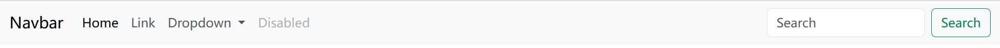

# Bootstrap

Bootstrap 是一个流行的开源前端库，用于快速开发响应式和移动优先的网站及应用程序。它由 Twitter 团队开发和维护，提供了一系列预制的 HTML、CSS、JavaScript 和图标，帮助开发者构建具有一致外观和交互功能的网页界面，而无需从头开始编写大量的样式和脚本。

## Bootstrap 核心组成

Bootstrap 包含以下核心部分：

1. **CSS 样式库**：

    - 提供了一整套预定义的样式，如布局、按钮、表格、表单、排版等。
    - 核心文件：`bootstrap.min.css`。

2. **JavaScript 插件**：

    - 提供交互组件，如模态框（Modal）、轮播图（Carousel）、下拉菜单（Dropdown）等。
    - 核心文件：`bootstrap.bundle.min.js`，包含原生 JavaScript 和依赖的 Popper.js。

3. **Icons 图标库**：

    - Bootstrap 提供了独立的图标库，支持数千种矢量图标。
    - 文件：`bootstrap-icons.css`。

4. **工具类（Utility Classes）**：

    - 预定义的工具类帮助快速调整布局和样式，如间距、颜色、显示控制等。

## Bootstrap 引入方式

### 使用 CDN 引入

- [Bootstrap 官网](https://v5.bootcss.com/) > `Docs` > `Introduction` > [CDN links](https://v5.bootcss.com/docs/getting-started/introduction/#cdn-links)
- [Bootstrap 官网](https://v5.bootcss.com/) > `Icons` > CDN
- 在 `CDN links` 中复制 Bootstrap 的 CDN 地址，在 HTML 文件 `<head>` 元素中引入 Bootstrap 的 CSS 样式和图标样式，在 `<body>` 底部引入 JS 组件。

    > CSS：https://cdn.jsdelivr.net/npm/bootstrap@5.3.0-alpha1/dist/css/bootstrap.min.css
    >
    > Icons：https://cdn.jsdelivr.net/npm/bootstrap-icons@1.11.3/font/bootstrap-icons.min.css
    >
    > JS：https://cdn.jsdelivr.net/npm/bootstrap@5.3.0-alpha1/dist/js/bootstrap.bundle.min.js

    ```html
    <head>
      <!-- 使用 CDN 引入 Bootstrap 的 CSS 样式表 -->
      <link rel="stylesheet" href="https://cdn.jsdelivr.net/npm/bootstrap@5.3.0-alpha1/dist/css/bootstrap.min.css">
    
      <!-- 使用 CDN 引入 Bootstrap 的图标样式表 -->
      <link rel="stylesheet" href="https://cdn.jsdelivr.net/npm/bootstrap-icons@1.11.3/font/bootstrap-icons.min.css">
    </head>
    
    <body>
      <!-- 其它 body 元素 -->
    
      <!-- 使用 CDN 引入 Bootstrap 的 JS 组件 -->
      <script src="https://cdn.jsdelivr.net/npm/bootstrap@5.3.0-alpha1/dist/js/bootstrap.bundle.min.js"></script>
    </body>
    ```

### 本地引入

1. [官网下载 Bootstrap](https://github.com/twbs/bootstrap/releases/download/v5.3.0-alpha1/bootstrap-5.3.0-alpha1-dist.zip)
2. 下载 BootStrap 文件并解压，文件夹名字改为 `bootStrap`，与 HTML 文件放入同级目录。

    ```html
    <head>
      <!-- 本地引入 Bootstrap 的样式表-->
      <link rel="stylesheet" href="bootstrap/css/bootstrap.css">
    </head>
    <body>
      <!-- 其它 body 元素 -->
    
      <!-- 本地引入 Bootstrap 的JS组件 -->
      <script src="bootStrap/js/bootstrap.bundle.min.js"></script>
    </body>
    ```

### jQuery 依赖

- 从 Bootstrap4 开始，移除了对 `JS组件` 对 `jQuery` 的硬性依赖，如果使用的是 Bootstrap4 以前的版本，在引入 `JS组件` 时，应事先引入 jQuery。
- **引入方式**

    ```html
    <body>
      <!-- 其它 body 元素 -->
    
      <script src="js/jquery-3.7.1.min.js"></script>
      <!-- bootstrap.js 需要依赖 jquery，所以要在 jquery 后面引入 -->
      <script src="bootstrap/js/bootstrap.js"></script>
    </body>
    ```

### 基本语法

1. 实际就是去 Bootstrap 官网找喜欢的样式，然后把它们的 HTML 粘贴到自己的代码中；
2. 首先引入 Bootstrap 的 `CSS 样式表` 和 `JS 组件`；
3. 比如想做一个按钮，就去 Bootstrap 官网中文文档找 [Buttons](https://v5.bootcss.com/docs/components/buttons/)；
4. 然后把喜欢的图标的 HTML 代码复制到自己的代码中；

    ```html
    <head>
      <!-- 使用 CDN 引入 Bootstrap 的样式表 -->
      <link rel="stylesheet" href="https://cdn.jsdelivr.net/npm/bootstrap@5.3.0-alpha1/dist/css/bootstrap.min.css">
    </head>

    <body>
      <!-- 这是从 Bootstrap 复制过来的 -->
      <button type="button" class="btn btn-primary">Primary</button>

      <!-- 其它 body 元素 -->

      <!-- 使用 CDN 引入 Bootstrap 的JS组件 -->
      <script src="https://cdn.jsdelivr.net/npm/bootstrap@5.3.0-alpha1/dist/js/bootstrap.bundle.min.js"></script>
    </body>
    ```

5. 然后再使用 CSS 和 JS 调整细节。

## Class

### Class 基础

- **语法**：HTML 通过 `class` 使用 Bootstrap

    ```html
    <head>
      <link rel="stylesheet" href="https://cdn.jsdelivr.net/npm/bootstrap@5.3.0-alpha1/dist/css/bootstrap.min.css">
    </head>

    <body>
      <!-- 通过 class 使用 Bootstrap -->
      <button type="button" class="btn btn-primary">Primary</button>
    </body>
    ```

- **Class 组成**

    - **组件名称（Component）**：例如 `navbar` `modal` `btn` `form`。
    - **修饰符（Modifier）**：通常用 - 连接，用来指定组件的变体，例如 `btn-primary`。
    - **响应式前缀（Breakpoint）**：用来控制在不同屏幕尺寸下的表现，例如 `sm-`。
    - **功能类（Utility）**：用于快速应用常用样式，例如 `mt-3`。
    - **状态类（State）**：表示组件的不同状态，例如 `active`。

# [容器](https://v5.bootcss.com/docs/layout/containers/)

容器是 Bootstrap 中最基本的布局元素，**在使用我们的默认网格系统时必不可少**。容器用于包含、填充和（有时）居中其中的内容。

## `container`

**.container** 类是默认的容器，提供一个固定宽度的布局，宽度会随着屏幕大小的不同而调整。

## `container-fluid`

**.container-fluid** 类用于 100% 宽度，占据全部视口（viewport）的容器，使用这个容器类会始终充满整个屏幕的宽度，适用于全屏布局。

# 栅格系统

- **语法**：将父级标签（整行/整块）分成12份，针对12份布局，所有栅格自带 float 属性，以分成3块为例

    ``` html
    <!--将一整行分3份-->
    <div class="container">
      <div class="row">
        <div class="col - sm - 4">左</div>
        <div class="col - sm - 4">中</div>
        <div class="col - sm - 4">右</div>
      </div>
    </div>
    
    <!--将500px宽度分3份-->
    <div style="width:500px;margin:0 auto;">
      <div class="d-flex" style="flex-basis:100%;">
        <div class="flex-grow-1" style="flex-basis:0;">左</div>
        <div class="flex-grow-1" style="flex-basis:0;">中</div>
        <div class="flex-grow-1" style="flex-basis:0;">右</div>
      </div>
    </div>
    ```

# 模态框

## [模态组件](https://v5.bootcss.com/docs/components/modal/#modal-components)

```html
<div class="modal" tabindex="-1">
  <div class="modal-dialog">
    <div class="modal-content">
      <div class="modal-header">
        <h5 class="modal-title">Modal title</h5>
        <button type="button" class="btn-close" data-bs-dismiss="modal" aria-label="Close"></button>
      </div>
      <div class="modal-body">
        <p>Modal body text goes here.</p>
      </div>
      <div class="modal-footer">
        <button type="button" class="btn btn-secondary" data-bs-dismiss="modal">Close</button>
        <button type="button" class="btn btn-primary">Save changes</button>
      </div>
    </div>
  </div>
</div>
```

## [静态背景](https://v5.bootcss.com/docs/components/modal/#static-backdrop)

- 点击外部不会关闭模态框。

    ```html
    <!-- Button trigger modal -->
    <button type="button" class="btn btn-primary" data-bs-toggle="modal" data-bs-target="#staticBackdrop">
      Launch static backdrop modal
    </button>
    
    <!-- Modal -->
    <div class="modal fade" id="staticBackdrop" data-bs-backdrop="static" data-bs-keyboard="false" tabindex="-1" aria-labelledby="staticBackdropLabel" aria-hidden="true">
      <div class="modal-dialog">
        <div class="modal-content">
          <div class="modal-header">
            <h1 class="modal-title fs-5" id="staticBackdropLabel">Modal title</h1>
            <button type="button" class="btn-close" data-bs-dismiss="modal" aria-label="Close"></button>
          </div>
          <div class="modal-body">
            ...
          </div>
          <div class="modal-footer">
            <button type="button" class="btn btn-secondary" data-bs-dismiss="modal">Close</button>
            <button type="button" class="btn btn-primary">Understood</button>
          </div>
        </div>
      </div>
    </div>
    ```

# [导航栏](https://v5.bootcss.com/docs/components/navbar/)



```html
<!-- 导航栏 -->
<nav class="navbar navbar-expand-lg bg-body-tertiary">
  <div class="container-fluid">
    <!-- 品牌名称/Logo -->
    <a class="navbar-brand" href="#">Navbar</a>

    <!-- 移动端折叠按钮 -->
    <button class="navbar-toggler" type="button" data-bs-toggle="collapse" data-bs-target="#navbarSupportedContent"
      aria-controls="navbarSupportedContent" aria-expanded="false" aria-label="Toggle navigation">
      <span class="navbar-toggler-icon"></span>
    </button>

    <!-- 导航栏内容 -->
    <div class="collapse navbar-collapse" id="navbarSupportedContent">
      <!-- 导航链接列表 -->
      <ul class="navbar-nav me-auto mb-2 mb-lg-0">
        <!-- 首页链接 -->
        <li class="nav-item">
          <a class="nav-link active" aria-current="page" href="#">Home</a>
        </li>
        <!-- 普通链接 -->
        <li class="nav-item">
          <a class="nav-link" href="#">Link</a>
        </li>
        <!-- 下拉菜单 -->
        <li class="nav-item dropdown">
          <a class="nav-link dropdown-toggle" href="#" role="button" data-bs-toggle="dropdown" aria-expanded="false">
            Dropdown
          </a>
          <ul class="dropdown-menu">
            <li><a class="dropdown-item" href="#">Action</a></li>
            <li><a class="dropdown-item" href="#">Another action</a></li>
            <li>
              <hr class="dropdown-divider">
            </li>
            <li><a class="dropdown-item" href="#">Something else here</a></li>
          </ul>
        </li>
        <!-- 禁用的链接 -->
        <li class="nav-item">
          <a class="nav-link disabled">Disabled</a>
        </li>
      </ul>

      <!-- 搜索表单 -->
      <form class="d-flex" role="search">
        <input class="form-control me-2" type="search" placeholder="Search" aria-label="Search">
        <button class="btn btn-outline-success" type="submit">Search</button>
      </form>
    </div>
  </div>
</nav>
```
