# Blockchain

## 区块链

区块链（Blockchain）是一种分布式账本技术，用于安全、透明和不可篡改地记录交易数据。世界上第一个区块链是**比特币区块链**。

**区块链的核心特点**：

1. **去中心化**：区块链不依赖于中央机构，而是由网络中的多个节点共同维护。
2. **透明性**：所有参与者都可以查看区块链上的交易记录。
3. **安全性**：通过加密技术确保数据的安全和完整性。

## 区块链分类

### 按网络范围分类

| 类型 | 去中心化程度 | 性能 | 数据隐私性 | 典型应用场景 |
| :---: | :---: | :---: | :---: | :---: |
| 公有链 | 完全去中心化 | 低吞吐量 | 低 | 加密货币、DeFi |
| 联盟链 | 部分去中心化 | 高吞吐量 | 中等 | 跨机构协作、政务平台 |
| 私有链 | 中心化 | 极高吞吐量 | 高 | 企业内部管理 |

#### 公有链

**公有链**（Public Blockchain，简称**公链**）是一种完全开放、无需授权的区块链网络，任何人均可参与交易验证和数据读写。

**应用场景**：加密货币（如比特币）和 DeFi 等。

**关键特征**：

- **完全去中心化**：无单一控制机构，数据全网公开透明。
- **共识机制**：依赖工作量证明（PoW）、权益证明（PoS）等算法维护网络安全。
- **数据隐私性差**：数据全网公开。
- **匿名性强**：用户无需公开身份即可参与，无门槛限制。
- **性能瓶颈**：交易速度较慢（如比特币每秒处理约7笔交易），能耗较高。

#### 联盟链

**联盟链**（Consortium Blockchain）是由多个预选机构共同管理的区块链网络，参与节点需经授权。

**联盟链的应用场景**：跨机构数据共享（如政务平台、医疗数据互通）、企业合作项目等。

**私链的关键特征**：

- **部分去中心化**：治理权由联盟成员共享，数据仅在授权范围内可见。
- **高效与隐私平衡**：采用松散的共识机制（如PBFT），交易速度可达每秒10万笔。
- **可定制性**：支持灵活调整规则以适应行业需求（如供应链金融、电子取证）

#### 私有链

**私有链**（Private Blockchain，简称**私链**）是由单一组织内部使用的区块链网络，节点权限受严格控制。

**私链的应用场景**：企业内部审计、数据库管理、政务系统（如数字身份认证）等

**私链的关键特征**：

- **中心化**：数据读写权限集中于管理方，安全性依赖中心节点维护。
- **数据隐私性强**：数据仅对内部开放，适合敏感信息管理。
- **高性能**：交易速度快、成本低，适用于高频业务场景。

### 按部署环境分类

- **主链（Mainnet）**：正式运行的区块链网络（如以太坊主网）
- **测试链（Testnet）**：开发者用于实验的模拟环境（如比特币测试链）

### 按对接类型分类

- **单链**：独立运行的区块链系统（如比特币主链）
- **侧链（Sidechain）**：与主链互联的独立链，用于扩展功能（如 Liquid Network）
- **互联链（Interchain）**：实现跨链互操作的协议（如 Cosmos、Polkadot）

### 技术演进与趋势

- **混合链（Hybrid Chain）**：结合公有链与联盟链特性，平衡开放性与效率（如数字人民币底层技术）
- **跨链技术**：解决不同区块链间数据孤岛问题，推动多链生态互联（如跨链桥协议）

## 六层功能模型

- **数据层**：负责存储区块结构、Merkle 树、加密算法（如哈希函数、数字签名）等，确保数据的不可篡改性和完整性。
- **网络层**：管理节点间的 P2P 通信，包括数据传播、验证机制和网络拓扑结构。
- **共识层**：实现分布式节点间的账本一致性，核心机制包括 PoW、PoS、DPoS 等。
- **激励层**：通过经济模型激励节点参与网络维护，如比特币的区块奖励和以太坊的 Gas 费机制。
- **合约层**：支持智能合约和脚本代码，扩展区块链的可编程性（如以太坊的 Solidity 语言）。
- **应用层**：面向用户的 DApp 和工具（如钱包、交易所），直接服务于金融、游戏等场景。

## 标准区块链架构

- **基础层**：包含计算、存储和网络资源，提供区块链运行的物理环境（如云计算服务器或本地节点）。
- **平台层**：实现核心功能：智能合约执行环境、账本管理、共识算法、加密服务等。
- **API层**：为外部应用提供访问接口，支持区块链功能的调用和节点管理。
- **用户层**：用户交互入口，包括 DApp 界面和管理工具（如 MetaMask 钱包）。
- **外部交互层**：处理链外数据（预言机）与非原生应用的集成，例如 Chainlink 的数据喂送。

## 区块链分层架构

| 层级 | 定位 | 核心目标 | 典型技术 |
| :---: | :---: | :---: | :---: |
| L0 | 跨链基础设施 | 互操作性与开发效率 | Tendermint IBC、Substrate |
| L1 | 底层主链 | 去中心化与安全性 | PoW、PoS、智能合约 |
| L2 | 性能扩展方案 | 高吞吐量与低成本 | Rollups、侧链、状态通道 |

### L0

**Layer 0**（跨链协议层，简称 L0）是区块链的基础网络层，提供跨链通信、节点连接和底层协议支持。

**核心功能**：

- **跨链互操作**：允许不同区块链通过统一协议交互（如 Cosmos 的 IBC 协议）。

- **基础设施框架**：为 L1 提供开发模板（如 Polkadot 的 Substrate 框架）。

- **高效交易**：通过 PoS 等共识机制实现快速跨链交易。

**代表项目**：Cosmos、Polkadot、Avalanche

### L1

**Layer 1**（基础层，简称 L1）是独立的底层区块链，负责交易验证、共识机制与核心安全。

**核心功能**：

- **去中心化与安全性**：通过 PoW/PoS 等共识保障网络抗攻击性。

- **智能合约支持**：如以太坊的 Solidity 语言，支持 DApp 开发。

- **原生代币发行**：如比特币（BTC）、以太坊（ETH）。

**技术挑战**：区块链三难困境（去中心化、安全、扩展性难以兼得）

**代表项目**：比特币、以太坊、Solana

### L2

**Layer 2**（扩展层，简称 L2）是构建于 L1 之上的协议，通过链下处理提升性能。

**核心功能**：

- **扩容提速**：如 Optimistic Rollups（Arbitrum）和 ZK-Rollups（zkSync）。
- **降低成本**：减少主链资源占用，Gas 费降低 90% 以上。
- **灵活扩展**：支持侧链（Polygon）、状态通道（闪电网络）等方案。

**依赖关系**：安全性由 L1 保障，如以太坊 L2 需向主链提交最终状态。

**代表项目**：Polygon、Arbitrum、StarkNet

# 区块链的数据结构

区块链作为 Web3 生态的核心基础设施，相当于一个分布式数据库，用于存储全球范围内的交易数据、智能合约、用户身份信息和各种类型的去中心化应用（ dApps ）数据。

以太坊区块链从上往下可以依次分解为：区块链、区块、交易三个层次，其中的交易数据、收据数据、状态数据和账户数据都分别存储在四棵默克尔树中。

## **区块链**

区块链是一系列数据块（即“区块”），通过特定的方式相互连接，形成的一条链。每个区块都包含前一个区块的哈希值，称为“父哈希值”（ Parent Hash ），这是前一个区块内容的唯一标识符。通过这种方式，每个区块都与前一个区块相连接，形成了一条从第一个区块（创世区块）到最新区块的连续链条，这就是“区块链”。注：第一个区块里无父哈希值。

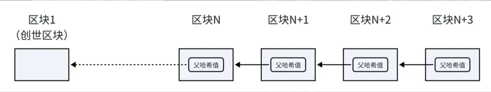

## **区块**

区块链中的每一个区块，都由两个部分组成：区块头（ Header ）和区块体（ Body ）。

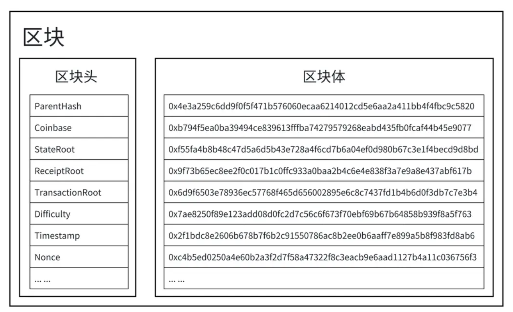

### 区块头

区块头里包含了一个区块的基本信息，主要包括：

- **父哈希值（ parentHash ）**：记录前一个区块的哈希值。
- **时间戳（ timestamp ）**：记录区块创建的具体时间。
- **随机数（ nonce ）**：用于工作量证明（ PoW ）机制中的挖矿过程。
- **难度目标（ difficulty ）**：表示挖矿的难度。
- **币基（ coinBase ）**：标识矿工的账户地址。

区块头里还记录了三个非常重要的根哈希值：

- **状态树根（ stateRoot ）**：表示了区块链的状态树的根哈希值，状态树记录了所有账户的状态信息，如余额、合约代码等。
- **收据树根（ receiptRoot ）**：表示收据树的根哈希值，收据树记录了交易执行的结果，如交易是否成功、交易费用等。
- **交易树根（ transactionRoot ）**：表示交易树的根哈希值，交易树包含了区块中所有交易的信息。

### 区块体

区块体里存储了该区块中的所有交易数据，即所有交易哈希的列表。

## 交易

在以太坊中，交易代表从一个账户向另一个账户发送资产或消息的行为。当用户发起一笔交易时，以太坊客户端或钱包软件将会构造交易数据。交易数据主要包含如下字段：

- **nonce**：发送方账户的交易计数器，统计该账户在此区块链中的总交易次数。
- **gasPrice**：发送方愿意为每单位 gas 支付的价格。
- **gasLimit**：发送方为这次交易设置的最大 gas 消耗量。
- **to**：接收方的账户地址。
- **value**：要传输的以太币数量。
- **data**：智能合约相关的字节码。
- **v, r, s**：交易签名，由发送方的私钥生成。

交易数据构造完成后，钱包将使用用户的私钥对整个交易进行签名，并将签名结果（ v, r, s ）加入交易数据中，然后对整个交易数据（不包括签名）计算哈希值，交易哈希是交易数据的唯一标识符，确保了交易的唯一性和不可篡改。

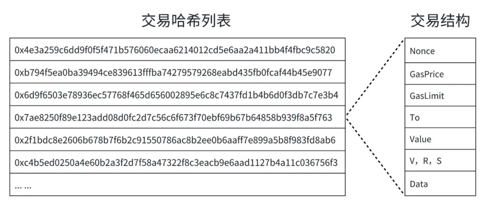

例如，Alice 想要发送 1 ETH 给 Bob，Alice 的账户地址是 0x123…ABC，Bob 的账户地址是 0x456…DEF。Alice 的账户已经执行过5笔交易，所以她的下一笔交易的 nonce 为6。当前的 gas 价格是 20 Gwei，她设置的 gas limit 是21000（标准以太坊转账所需的gas费）。Alice 不调用任何合约，所以 data 字段为空。

- **nonce**: 6
- **gasPrice**: 20000000000 (20 Gwei)
- **gasLimit**: 21000
- **to**: 0x456…DEF
- **value**: 1000000000000000000 (1 ETH)
- **data**: 0x
- **v, r, s**: [签名数据]

Alice 的钱包会把这些交易数据进行打包和签名，然后生成交易哈希，并将这个交易广播到以太坊网络。矿工将确认这笔交易并将其加入新区块，一旦成功，1 ETH 就会从 Alice 的账户转移到 Bob 的账户。

## 交易收据

在以太坊中，当一笔交易完成后，会生成“交易收据”（ Transaction Receipt，又叫交易回执）。交易收据记录了交易执行的基本信息，是交易被包含在区块链中的重要证据。

每个交易收据包含的信息有：

- **transactionHash**：交易哈希值，用于唯一标识一笔交易。
- **transactionIndex**：交易在所在区块中的索引位置。
- **blockHash**：包含该交易的区块哈希值。
- **blockNumber**：包含该交易的区块编号。
- **from**：发起交易的地址。
- **to**：交易的目标地址。
- **cumulativeGasUsed**：当前区块中累积消耗的 Gas 量。
- **gasUsed**：这笔交易所消耗的 Gas 量。
- **contractAddress**：如果交易用于创建合约，则表示合约地址；否则为 null。
- **logs**：交易过程中产生的事件日志。
- **logsBloom**：布隆过滤器，用于快速检索交易日志。
- **status**：交易执行的状态码，表示成功或失败。

## 默克尔-帕特里夏树

以太坊的交易数据采用了一种名为**默克尔-帕特里夏树**（Merkle Patricia Tree，简称 MPT）的数据结构，这是一种特殊类型的默克尔树。

### 默克尔树

**默克尔树**（ Merkle Tree ），也称为哈希树（ Hash Tree ），这棵树的叶子节点是数据块的哈希值，非叶子节点是其子节点的哈希值串联后再次进行哈希计算的结果，这样可以确保数据的完整性。如图所示，节点值的计算方法为：

哈希 A = Hash (数据 A );

哈希 B = Hash (数据 B );

哈希 E = Hash (哈希 A + 哈希 B );

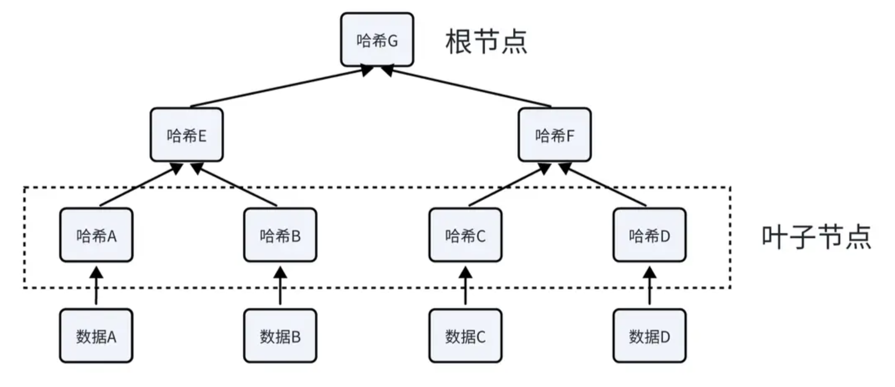

### 帕特里夏树

**帕特里夏树**（ Patricia Trie ），也称为压缩前缀树，这棵树既可以利用字符串的公共前缀来减少查询时间，又可以通过压缩无分支的节点来节省空间。

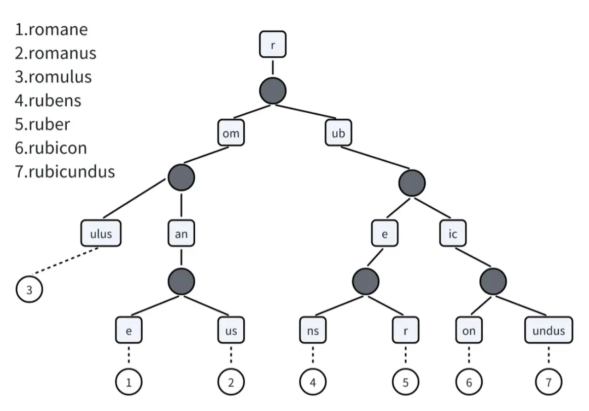

### 默克尔-帕特里夏树

**默克尔-帕特里夏树** （ Merkle Patricia Tree ） 结合了默克尔树（ Merkle Tree ）和帕特里夏树（ Patricia Trie ）的优点，既可以验证数据的完整性，也可以快速检索状态信息，非常适合用作以太坊中的数据存储。在每个区块里，分别有一棵默克尔-帕特里夏树来存储交易数据、收据数据、状态数据和账户数据。

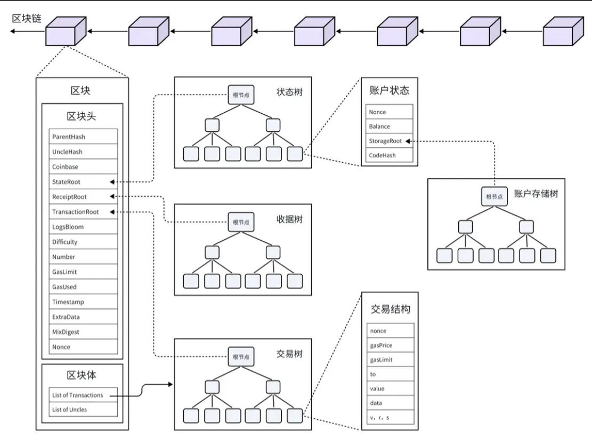

# 加密体系

## 哈希函数

### 哈希函数

**哈希函数**，也称为散列函数。它将任意长度的输入（通常称为“消息”），通过数学算法转换成固定长度的字符串，这个输出通常称为**哈希值**、散列值、消息摘要或者数字指纹。下图以 SHA3-256 哈希函数来展示，无论输入什么，输出都是一个长度为64的十六进制字符串。

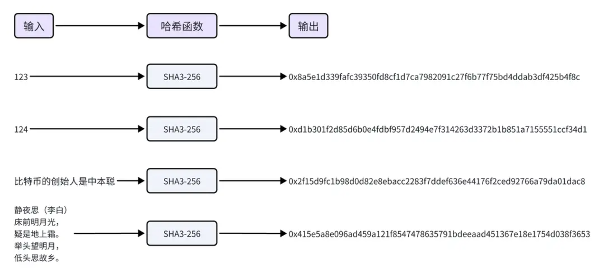

哈希函数的概念可以追溯到20世纪50年代，当时它主要用于数据结构中，如哈希表，用来快速定位和检索数据。后来哈希函数经历了一系列的发展，旧的标准不断被更安全的新标准所替代：

MD4—>MD5—>SHA0—>SHA1—>SHA2—>SHA3

目前最先进的标准是 SHA-3，SHA-3 基于 Keccak 算法，由比利时密码学家设计，并在2015年成为 NIST 的标准。

### 哈希算法的特征

- **正向快速**：无论输入的长度有多大，都能够快速计算出哈希值。比如把一个字符或者一本书的所有文字作为输入，都可以快速计算出哈希值。
- **逆向困难**：通过哈希值，无法在有限时间内逆向推出输入。比如通过哈希值 `0x8a5e1d339fafc39350fd8cf1d7ca7982091c27f6b77f75bd4ddab3df425b4f8c`，无法逆向推出输入是 123。
- **输入敏感**：输入的微小变化，会导致输出的显著变化。比如 123 和 124 的哈希值千差万别，看上去没有任何关联。
- **避免碰撞**：很难找到两个不同的输入，使得输出的哈希值一致（即发生碰撞）。比如很难找到除 123 之外的另一个输入，使它的哈希值也是 `0x8a5e1d339fafc39350fd8cf1d7ca7982091c27f6b77f75bd4ddab3df425b4f8c`。
- **不可预测**：通过输入无法预测输出，所以挖矿时随机数 `nonce` 只能从 1 开始累加。

### 哈希在区块链中的应用

哈希函数在区块链技术中起到关键作用，主要应用在这几个方面：

- 确保交易数据的完整性和不可篡改性。每笔交易的哈希值都是独一无二的，任何细微的数据变化都会导致哈希值的巨大变化，使得网络参与者能够迅速发现交易数据被篡改的行为。
- 将各个区块串联区块形成区块链，每个区块包含前一个区块的哈希值，从而确保了链上数据的连贯性和不可逆性。
- 用于构建 Merkle 树以高效验证数据。
- 实施工作量证明机制增强安全性，通过解决计算难题来限制新区块的生成速度。

另外，哈希函数还与非对称加密结合，为交易提供数字签名，确保了交易的真实性。这些应用共同，保障了区块链网络的安全性和可靠性。

## 非对称加密

### 非对称加密

在对称加密中，加密和解密使用相同的密钥。意味着发送方和接收方必须事先共享这个密钥，并且都必须保守这个密钥的秘密。

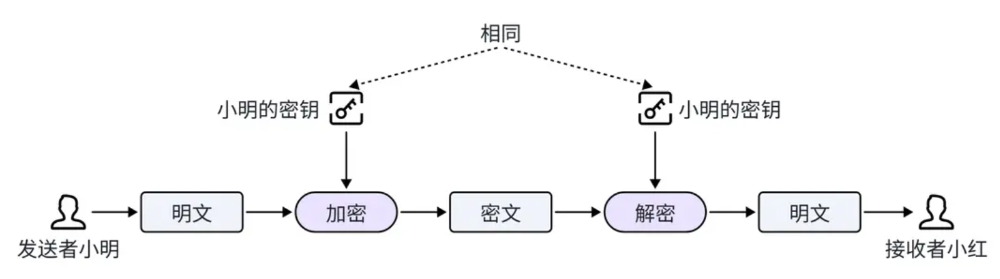

非对称加密解决了密钥分发问题，使用一对不同的密钥：公钥和私钥，来进行数据的加密和解密。公钥和私钥需要配对使用，公钥可以公开发放，任何人都可以用它来加密信息，但只有持有私钥的人才能解密这些信息。因此，即使公钥是公开的，没有私钥的人也无法读取加密信息的内容。

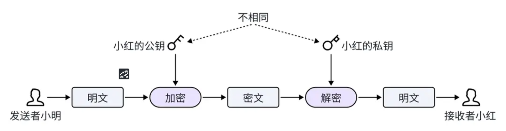

### 私钥

私钥（Private Key）由助记词生成，是公钥的验证密钥，私钥必须保密。

**私钥用途**：

- **解密**：在非对称加密系统中，私钥用于解密由公钥加密的信息。
- **签名**：私钥用于对交易或信息进行数字签名，签名算法会结合消息内容和私钥生成一个唯一的签名。以证明该交易或信息确实由私钥的持有者发出。

### 公钥

公钥（Public Key）由私钥生成，是私钥的配对密钥，公钥可以公开。

**公钥用途**：

- **加密**：在非对称加密系统中，公钥用于加密信息，使得只有拥有对应私钥的人才能解密。
- **验证签名**：公钥用于验证交易或信息的数字签名，确保该签名确实由对应私钥生成，并且消息在传输过程中未被篡改。

## 数字签名

Web3 的数字签名是一种加密技术，用于验证交易、消息或数据的真实性和完整性，同时确保签名者的身份。

数字签名技术使用私钥进行加密，使用公钥进行解密和验证，它能够验证消息是否由指定的发送者发出，并且在传输过程中没有被篡改，以确认信息的完整性和认证发送者的身份。

**数字签名的工作原理**：

- **生成密钥对**：用户生成一个公钥和私钥对。
- **签名消息**：用户使用私钥对消息进行签名。
- **传输签名和消息**：签名和消息一起发送给接收者或在网络上发布。
- **验证签名**：接收者使用签名者的公钥验证签名和解密信息。

**数字签名的用途**：

- **交易验证**：在区块链上，每笔交易都需要签名，以确保交易是由账户所有者发起的。
- **消息验证**：数字签名用于验证发送给智能合约或其他用户的消息，确保消息的真实性和完整性。
- **授权和认证**：在去中心化应用（dApps）中，用户可以使用数字签名授权特定操作或访问权限。

**数字签名的安全性**：

- **不可篡改性**：签名是基于消息内容和私钥生成的，任何对消息的修改都会使签名无效。
- **身份验证**：只有拥有私钥的人才能生成有效的签名，因此签名可以验证签名者的身份。
- **防止抵赖**：一旦用户对消息进行签名，无法否认自己签名的行为。

## 交易验证

在以太坊中，数字签名技术用于交易验证，确保交易的真实性、完整性。交易验证主要有如下几步：

- 用户签名交易。用户将交易数据准备好后，先计算出交易数据的哈希值，再使用椭圆曲线签名算法（ ECDSA ）对哈希值进行签名，将签名值（ v,r,s ）附加到交易数据中进行广播。
- 矿工验证交易。矿工接收到一笔交易之后，同样，先计算出交易数据（不含签名）的哈希值，再使用椭圆曲线签名算法（ ECDSA )，从签名和哈希值中恢复出用户公钥。最后将恢复出的公钥与用户钱包地址做对比，如果两者一致，则交易验证成功。

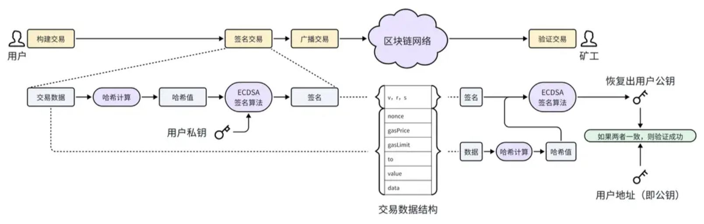

可以简单的认为用户钱包地址就是公钥。但是请注意，实际上两者并不相等，用户钱包地址是由公钥先经过哈希计算，再取末尾20个字节而来的。

# 共识算法

区块链的共识算法是区块链网络中各个节点达成一致意见的数学算法，用于保证交易记录的一致性、正确性和区块链系统的安全性 。其目标是让所有诚实节点保存一致的区块链视图，满足一致性（所有诚实节点保存的区块链前缀部分相同）和有效性（诚实节点发布信息会被其他诚实节点记录）。

## PoW

工作量证明机制（ Proof of Work，简称 PoW ）是一种通过计算验证节点工作量的分布式共识机制，其核心思想是通过数学难题的复杂计算，确保参与者需付出一定成本（如时间、算力、能源）以维护网络安全性，并防止资源滥用。

PoW 在1993年由 Cynthia Dwork 和 Moni Naor 提出，最初用于抵御电子邮件服务中的垃圾邮件攻击。其基本思想是：要求用户在发送电子邮件之前，先计算一个和邮件内容相关的数学难题，并将计算结果附加在邮件上才能被邮件服务器接收。


## PoS

权益证明机制（ Proof of Stake，简称 PoS ）是一种区块链共识机制。与 PoW 机制不同，PoS 机制不依赖于算力竞争，参与者通过质押一定数量的加密货币，来获得成为区块创建者（也称为验证者）的资格，从而大幅降低网络运行所需的能源消耗。

每个验证者被抽中的概率与质押的金额大小有关，通常质押越多的验证者被抽中的机会越大。

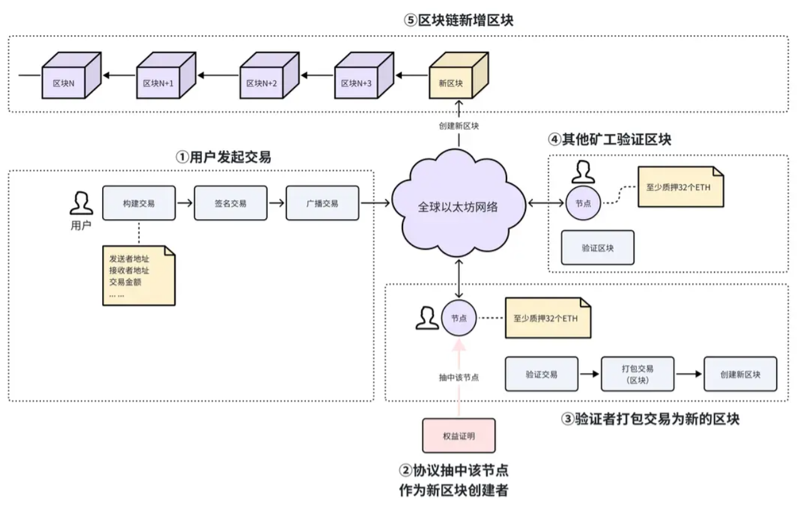

## 其它共识算法

- **历史证明（PoH）**：旨在通过创建可信时间记录，验证事件顺序和时间，让网络参与者无需互相通信就能验证事件先后顺序。
- **实用拜占庭容错算法（PBFT）**：可容忍系统内部分节点恶意行为，保障全网达成一致，适用于私有或联盟链。
- **委托权益证明（DPoS）**：增强版 PoS，用户委托投票权给少数代表，由代表负责验证并添加新区块，提升网络扩展性与交易速度。
- **权威证明（PoA）**：交易和区块由预先选定的受信任节点（验证者）验证，节点因身份公开担责，适用于追求速度和效率的网络。
- **纯权益证明（Pure PoS）**：消除 PoS 潜在中心化问题，通过随机选验证者保障网络去中心化与安全性。
- **空间证明（PoSpace）或容量证明（PoC）**：依据网络参与者提供的存储空间大小选区块生产者，能耗低。
- **认证证明（PoAuth）**：类似 PoA，要求验证者身份公开，通常是受社区信任的人或公司。

# 预言机

由于区块链本身是一个封闭系统，智能合约只能访问链上的数据，无法直接获取链外（链下，off-chain）的信息，例如天气、汇率、体育比赛结果等。

**预言机**（Oracle）是一种将链外数据引入区块链的工具，能够将外部数据“喂”给智能合约，使得智能合约可以使用这些数据来触发或验证特定的条件。

## Pyth

Pyth（Pyth Network）是一个专注于提供**高质量链下金融数据**（如价格、汇率、波动率等）到区块链的**去中心化预言机网络**。它的目标是将**真实世界金融市场的数据**引入链上，特别适合**DeFi 应用**。

对于 EVM 链，Pyth 提供了专门的 Solidity SDK，可以让我们迅速从 Pyth 合约中查询指定加密资产的价格。因此，在合约的最开始，我们需要先导入对应的 SDK，以便我们能够直接调用其中的功能和接口。

```solidity
pragma solidity ^0.8.0;

import "@pythnetwork/pyth-sdk-solidity/IPyth.sol";
...

contract Demo{
 ...
}
```


# 挖矿

## 挖矿

在比特币网络中，PoW 要求矿工通过解决一个数学难题来创建新的区块。这个数学难题实际上是在1~2^256之间找到一个数值（ nonce ），使得区块头信息的哈希值小于或等于网络当前的难度目标（ target ）。这个过程被称为“挖矿”。随着网络中的算力不断变化，为了确保创建区块创建的间隔时间相当，挖矿的难度目标（ target ）也会不断调整。

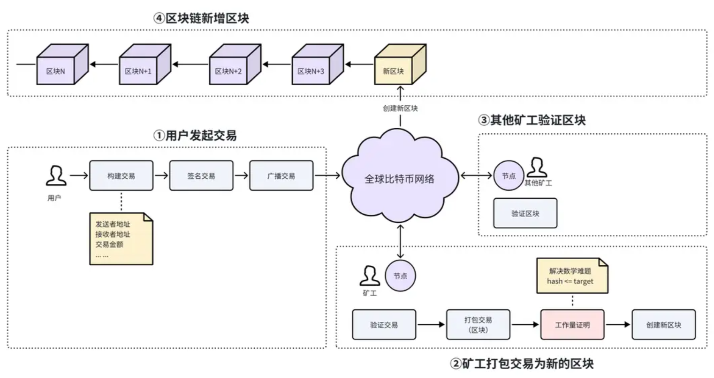

## 最长链原则

在比特币网络中，有大量的矿工在同时挖矿，很容易同时出现多个合法区块，导致区块链分叉。分叉后新创建的区块将添加到哪条链中呢？

此时矿工遵循最长链原则，默认选择最长的一条链，即总算力最大的链，作为有效链继续挖矿，因为最长链代表了网络中最大的工作量。
