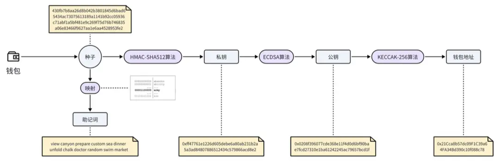

# Web3

## Web3

**Web3**（或称 Web3.0）是**基于区块链技术的下一代互联网框架**，旨在构建一个 **去中心化、用户主导数据主权、价值自由流通** 的网络生态系统。

相较于 Web1.0（信息可读）和 Web2.0（用户生成内容 + 平台垄断），Web3 的核心理念包括：

1. **去中心化**：数据存储与交互不再依赖中心化服务器，而是通过分布式节点网络实现，降低单点故障风险。
2. **用户主权**：用户拥有对个人数据的完全控制权，可通过加密技术自主管理身份与资产（如数字钱包）。
3. **互操作性**：支持跨链协议（如跨链桥），实现不同区块链网络间的数据与资产互通。

**Web3、区块链和以太坊的关系**：

- **技术层级**：

    - **区块链**是底层技术（如分布式账本、密码学）。

    - **以太坊**是区块链技术的进阶应用（智能合约平台）。

    - **Web3**是基于区块链构建的互联网新范式（应用层生态）。

- **功能互补**：

    - 区块链提供信任机制，确保数据安全；

    - 以太坊通过可编程性扩展功能；

    - Web3 整合这些技术，实现用户主权的互联网

- **生态协同**：
- 以太坊是当前 Web3 生态的核心基础设施，但并非唯一（其他如 Solana、Polkadot 也在崛起）。
  
- Web3 的愿景需多种区块链技术共同支撑，而以太坊因其先发优势和成熟生态占据重要地位。

## Web3 的技术架构

Web3 的底层技术架构分为四层，结合区块链、密码学与分布式网络实现：

- **基础层（区块链网络）**：核心是去中心化账本技术，以太坊、Solana、波场等公链提供智能合约执行环境。
- **数据层（分布式存储）**：使用 IPFS、Filecoin 等协议实现链下数据存储，确保数据不可篡改与抗审查性。
- **应用层（DApp 与组件）**：去中心化应用（DApp）通过前端界面与用户交互，依赖预言机（如 Chainlink）引入链外数据。
- **治理层（DAO 与社区共识）**：基于代币投票的分布式自治组织（DAO）实现社区驱动的决策机制。

## Web3 的应用场景

- **Smart Contract**：智能合约
- **DeFi**：去中心化金融
- **DApps**：去中心化应用
- **NFT**：非同质化代币
- **DAO**：去中心化自治组织
- **SocialFi**：社交金融
- **GameFi**：游戏金融
- **DID**：去中心化身份
- 元宇宙
- 供应链管理

# Wallet

## Wallet

在 Web3 生态中，钱包中保存着可以让你控制资产的关键信息：私钥。

Web3 钱包并不直接存储加密货币（加密货币都存储在区块链中），只用来管理和交易加密货币。

## 助记词

### 助记词

助记词（Mnemonic Phrase）是 Web3 钱包中用于生成和恢复私钥的一组单词序列，通常由12个或24个英文单词组成，遵循**BIP-39标准**。助记词类似于传统的密码，必须严格保密。

**核心功能**：

- **生成私钥**：助记词通过哈希算法生成私钥。
- **恢复钱包**：凭借助记词即可重建钱包，恢复所有关联资产。

**跨平台恢复**：

- 助记词是通用的，可以在不同的钱包和平台之间进行恢复。
- 例如，用户可以在 MetaMask 生成助记词，并在支持 BIP-39 标准的 Exodus 钱包中使用同一组助记词恢复他们的资产。

### 助记词种类

- **普通助记词**：普通助记词是最常见的类型，通常由12到24个随机单词组成。典型代表 MetaMask
- **加密助记词**：在普通助记词的基础上，用户可以设置一个额外的密码来增加安全性。只有同时拥有助记词和密码的人才能恢复钱包。典型代表 Ledger
- **多重签名助记词**：多重签名助记词涉及多组助记词，每组助记词代表一个私钥，只有达到一定数量的签名（如2/3或3/5）才能进行交易。典型代表 BitGo
- **Shamir’s Secret Sharing (SSS)**：Shamir’s Secret Sharing 是一种分割私钥的方法，将助记词分成多个部分，只有收集到足够多的部分才能恢复私钥。典型代表 Trezor

## 钱包地址

钱包地址是一个公开的字符串（公钥哈希值的最后 20 字节），主要用于接收和发送加密货币。

下面介绍一下钱包地址生成过程中，涉及的几个关键步骤：

- **第一步：生成种子**：种子是随机数字序列，是后续操作起点，可由系统随机数或用户提供的熵（如随机移动鼠标产生的数据）生成。
- **第二步：生成助记词**：在以太坊中，将种子分割成二进制数据片段，各片段对应 2048 个单词的单词库中的单词，组成方便记忆的单词序列即助记词。
- **第三步：生成私钥**：用上一步种子，通过 HMAC - SHA512 算法计算得到控制钱包地址的私钥。
- **第四步：生成公钥**：借助椭圆曲线加密算法（ECDSA），由私钥计算出对应的公钥。
- **第五步：生成地址**：用 Keccak - 256 哈希函数计算公钥哈希值，取最后 20 字节，得到以太坊钱包地址。

## 钱包类型

- **软件钱包**：在电脑或移动设备上安装的应用程序，包括桌面钱包、移动钱包、网页钱包。
    - **桌面钱包**：安装在个人电脑，存储安全性高，依赖设备，如 Electrum、Exodus 。
    - **移动钱包**：安装于智能手机，便于随时随地交易 ，如 Trust Wallet、MetaMask 移动版。
    - **网页钱包**：通过浏览器访问，便捷但安全性低，适合小额交易，如 MyEtherWallet、MetaMask 网页版。
- **冷钱包**：不连接到互联网的加密货币钱包，主要用于离线存储加密资产。
    - **硬件钱包**：类似 U 盘的物理设备，离线存私钥，安全性极高，价格较高，适合长期存大量资产，如 Ledger Nano S、Trezor 。
    - **纸钱包**：将公钥和私钥打印在纸上，离线避免在线攻击，纸质易损坏，不适合频繁交易。
- **托管钱包**：由第三方服务商管理，操作简便，适合初学者，无需担心私钥管理，但依赖服务商安全稳定，如 Binance 交易所钱包。
- **多签钱包**：需多个签名才能执行交易，安全性强，适用于团队和伙伴间资产管理，如 Gnosis Safe。

## Binance Wallet

### 创建钱包

目前只能在币安 App 中创建币安钱包：**币安 App** > **首页** > **钱包**

### 备份与恢复钱包

创建币安钱包时，将生成3个密钥分片：

- 分片1：由币安保管
- 分片2：存储在用户的设备上（注意清除设备缓存有可能丢失此备份）
- 分片3：使用您输入的恢复密码进行加密，然后备份至二维码或者云存储：
    - 生成二维码，并设置恢复密码，将二维码存放至其它设备
    - 备份至 Google Drive，并设置恢复密码

恢复钱包：

- 登录币安
- 使用二维码或 Google Drive 备份的文件，再加上相应的恢复密码

## MetaMask

- 可在 **设置 > 安全与隐私** 找到私钥助记词。

# BTC

比特币（Bitconin，简称 BTC）是一种去中心化加密货币，由一个化名为中本聪（ Satoshi Nakamoto ）的人或组织在2009年创建，但中本聪的真实身份至今未知。比特币是第一个应用区块链技术的加密货币。

# ETH

以太坊（Ethereum，简称 ETH）是一个开源的、去中心化的区块链平台，它不仅支持原生的加密货币：以太币（ ETH ），还提供了一个运行去中心化应用程序（ DApps ）的生态系统。这些应用程序通过智能合约来实现，运行在以太坊虚拟机（ EVM ）上。

| 对比维度 | 比特币 | 以太坊 |
| :---: | :---: | :---: |
| 愿景 |  全球去中心化加密货币系统 |  全球去中心化计算机 |
| 创始人 |  中本聪 |  Vitalik Buterin |
| 创建时间 |  2009年 |  2015年 |
| 共识机制 |  PoW |  PoW —> PoS |
| 核心功能 |  货币交易 |  货币交易 + 智能合约 |
| 出块时间 |  10分钟 |  12秒 |
| 编程语言 |  比特币脚本 |  Solidity |

## Uniswap

Uniswap 是 ETH 生态中具有里程碑意义的去中心化交易所（DEX）。

# 智能合约

智能合约（Smart Contract）是存储在区块链上的、可以自动执行的计算机协议，协议中包含了所有的运行规则。当预设的条件被满足时，合约便会自动执行相关的功能。其核心目标是通过技术手段替代传统中介，实现无信任第三方参与的可信交易。智能合约代码是完全开源的，这样确保了交易的透明性。

# DeFi

去中心化金融（Decentralized Finance，简称 DeFi），是一种运行在区块链技术之上的金融生态系统。它通过智能合约实现了金融服务的自动化，同时也消除了传统金融体系中存在的中介机构（如银行、经纪人等）。

在 DeFi 的世界里，所有的交易和服务都是透明的、无需许可的，并且对所有连接到互联网中的人都开放。同时，DeFi 还通过分布式账本技术保障了金融交易记录的不可篡改性，从而增强了金融系统的安全性。

**Defi 典型项目**：

- Uniswap（去中心化交易平台）
- Aave（去中心化借贷平台）
- MakerDAO（去中心化稳定币 DAI ）

## DeFi 术语

### TVL

总锁仓量（Total Value Locked，简称 TVL）是 DeFi 的一个重要指标，用于衡量某个 DeFi 协议中锁定的总价值。TVL 反映了 DeFi 协议的规模和受欢迎程度。它是通过计算用户存入该协议的所有资产的总价值，包括借贷、流动性提供、质押等。

## DeFiLlama

**DeFiLlama** 是一个 DeFi 数据聚合平台，提供了关于 DeFi 项目和协议的详细信息和分析。

## Uniswap

Uniswap 是一个建立在以太坊区块链上的去中心化交易所（ DEX ）。Uniswap 基于一套全新的自动做市商( AMM )模型，而不是传统的订单簿系统，允许用户无需中介即可交易不同的加密货币。

交易流程如下：

- 第一步：用户（流动性提供者）将他们的代币对存入资金池，比如往交易池存入一定数量的 ETH-USDT 代币对，为交易提供所需的流动性。
- 第二步：其他用户需要兑换代币时，比如用 ETH 兑换 USDT，他们只需要将ETH转入交易所，智能合约会自动按照当前的汇率进行交易，再转出指定数量的 USDT。

在 Uniswap 中进行交易，用户不需要信任任何第三方，因为所有交易都是通过代码自动完成的，这降低了欺诈和中介风险。

# DApps

DApps（去中心化应用，Decentralized Applications）是基于区块链技术构建的应用程序。与传统应用程序不同，DApps 通过去中心化网络运行，并且通常使用智能合约来管理其逻辑和数据。

# NFT

非同质化代币（Non-Fungible Token，简称 NFT）是一种基于区块链技术的数字资产凭证，非常适合用来表示数字艺术品、收藏品、游戏物品等需要独特标识的资产。

**NFT 的特点**：

- **唯一性**：每个 NFT 通过区块链上的唯一标识符（如哈希值）确权，确保资产无法复制或替代。
- **不可分割性**：NFT作为整体存在，无法像加密货币一样拆分交易。
- **所有权透明**：区块链记录所有交易历史，公开验证所有权流转过程

**NFT 的价值**：

- 首先，NFT 作为一种区块链技术的产物，能够为数字资产提供不可篡改的所有权证明。
- 其次，由于每个 NFT 都是不可替代的，它们固有的稀缺性成为了价值的重要来源。
- 再者，尽管 NFT 是非同质化的，但它们在全球范围内的多个平台上仍然可以被买卖和交换，这为 NFT 提供了流通性。
- 最后，部分 NFT 项目允许持有者对项目的发展进行投票，或者提供社区特定的福利。

# DAO

去中心化自治组织（ Decentralized Autonomous Organization，简称 DAO ）是一种基于区块链技术的组织形式，它通过智能合约来自动执行组织的规则和决策。与传统的公司不同，DAO 没有管理层和中心权威，所有的决策都通过成员投票或预设算法来实现，以此使得决策更加民主。

**典型项目**：MakerDAO

# SocialFi

社交金融（ Social Finance，简称 SocialFi ），结合社交网络和去中心化金融（ DeFi ）的特点，通过区块链技术，实现了社交互动的同时进行资产的生成、交换和增值。与传统社交平台不同的是， SocialFi 平台让用户在参与社交活动如发帖、评论、分享内容时得到实质性的经济奖励，比如代币或 NFT，同时保证了他们对自己数据的所有权和控制权。这种模式打破了传统社交网络的利益分配机制，将价值回馈给内容创造者和社区成员。Mirror 是当前较为主流的 SocialFi 项目之一。

# GameFi

游戏金融（ Game Finance，简称 GameFi ）是一种结合了加密货币和非同质化代币（ NFT ）的游戏模式，玩家可以在虚拟的游戏世界中参与活动，并通过这些活动获得实际的经济回报。Axie Infinity 是一个典型的 GameFi 项目。

# DID 

去中心化身份（ Decentralized Identity，简称 DID ），是一种基于区块链技术的身份认证方式，使得用户无需依赖于任何中心化组织或服务提供商，就能够拥有并控制自己的身份信息。在这个系统中，用户的身份数据被加密并分散存储在区块链网络上，用户可以自主管理其身份证明和相关数据，使用私钥进行安全验证，以此确保身份信息的可靠性和隐私性。ENS（ Ethereum Name Service ）是一个典型的 DID 项目。

# 元宇宙

# 供应链管理

# Fantom

## Fantom

Fantom 是一个 Layer-1 区块链平台，致力于克服区块链的“不可能三角”（去中心化、安全性和扩展性）。

- **主网名**：Opera
- **原生代币**：
    - FTM 是 Fantom 网络的核心代币
    - S Token 是 Sonic 链的原生代币
- **生态优势**：兼容 EVM
- **产品线**：
    - Fantom 是区块链平台
    - Sonic 是技术升级
    - Sonic Labs 是项目孵化器，基于 Sonic 技术栈开发。

Sonic 资源：

- [Sonic Documentation](https://docs.soniclabs.com/)
- [Sonic Points](https://my.soniclabs.com/points?state=e9vek&code=aURJMXcyS3FOc3FzRWViX3E2ckxjNjlfSmFnaTA2Tk51ZlIyTmcxdlliU2kwOjE3NDYxODQ4MTEzODE6MTowOmFjOjE)
- [Sonic (S) Blockchain Explorer](https://sonicscan.org/)
- [Shadow Exchange](https://www.shadow.so/)

## FeeM

[FeeM](https://www.hackquest.io/zh-cn/learn/146e7446-5ed5-8122-a9c3-c9cb1bad6031/146e7446-5ed5-81d4-bc3c-ecba462d4c14) (Fee Monetization)  本质上是一种 Gas 费用分润机制，Fantom 中初始分成比例为 **15%**，而在 Sonic 中这一比例将逐步提高到 **90%**。

## Sonic Gateway

[Sonic Gateway](https://www.hackquest.io/zh-cn/learn/146e7446-5ed5-8122-a9c3-c9cb1bad6031/14ae7446-5ed5-81f1-9674-f40503fa22b5) 是 Sonic Labs 推出的去中心化**跨链桥**，旨在实现 Ethereum 与 Sonic 区块链之间的安全资产转移。

## Sonic 的共识机制

[Sonic 的共识机制](https://www.hackquest.io/zh-cn/learn/146e7446-5ed5-8122-a9c3-c9cb1bad6031/14ae7446-5ed5-8161-a6e8-dec9e4a8a90a)是以异步拜占庭容错 (aBFT) 和有向无环图 (DAG) 为基础的一种新型共识设计。

### aBFT

[异步拜占庭容错](https://www.hackquest.io/zh-cn/learn/146e7446-5ed5-8122-a9c3-c9cb1bad6031/14ae7446-5ed5-81c6-ae75-e3502998dfa7)（aBFT）是分布式系统中一种强大的**容错机制**，旨在解决网络延迟和恶意行为对共识的影响。

### DAG

[有向无环图](https://www.hackquest.io/zh-cn/learn/146e7446-5ed5-8122-a9c3-c9cb1bad6031/14ae7446-5ed5-81d4-8953-fedad75099c0)（Directed Acyclic Graphs，简称  DAG）支持多个交易并行执行，而非严格按顺序。

## 部署合约

- [在 Sonic 测试链部署合约](https://www.hackquest.io/zh-cn/learn/146e7446-5ed5-8122-a9c3-c9cb1bad6031/146e7446-5ed5-8180-9f87-e410c6d883f8)
- [编译的版本选择](https://www.hackquest.io/zh-cn/learn/146e7446-5ed5-8122-a9c3-c9cb1bad6031/146e7446-5ed5-816b-8473-ee95220ac535)
    - **编译器版本**：指的是用于将 Solidity 源代码编译为字节码的编译器版本。
    - **EVM 版本**指的是合约生成的字节码将针对的以太坊虚拟机版本，即区块链节点运行的程序执行环境。它的作用是执行智能合约代码并确保所有节点就区块链的状态达成共识。

## [Sonic Airdrop](https://docs.soniclabs.com/funding/sonic-airdrop)

空投将使用 Sonic Points、Sonic Gems 和 Game Gems 进行分配

### [Sonic Points](https://my.soniclabs.com/points)

- **Passive Points**: Earn passive points by **holding** [whitelisted assets](https://docs.soniclabs.com/funding/sonic-airdrop/sonic-points#whitelisted-assets) directly in their Web3 wallets.

- **Activity Points**: Earn activity points by **deploying** [whitelisted assets](https://docs.soniclabs.com/funding/sonic-airdrop/sonic-points#whitelisted-assets) as liquidity on participating apps.

- **App Points (Gems)**: Earn **S token** on DApp. Similar to [Sonic Gems](https://docs.soniclabs.com/funding/sonic-airdrop/sonic-gems).

- ~~**Sonic Arcade Points**: Earn **airdrop points** by **playing games**. Similar to [Game Gems](https://docs.soniclabs.com/funding/sonic-airdrop/game-gems). **Closed!**~~

# Binance

## Alpha

币安 **Alpha** 是币安钱包内的一个平台，币安 Alpha 上展示的部分代币未来有望在币安交易平台上架，但并不保证。Alpha 2.0 将币安 Alpha 集成至币安交易平台，使用户无需切换至币安钱包即可浏览和交易精选代币。用户可以直接使用币安现货账户或资金账户的资金购买 Alpha 代币，简化了交易流程，降低了成本。

### Alpha 积分系统规则

**Alpha 积分系统**是币安用于衡量用户参与度和活跃度的机制，通过资产余额和交易量计算。积分直接影响用户是否能参与币安的 TGE 或空投活动。

以下是 YouTube 博主介绍：

- [Alpha 积分查询教程](https://www.youtube.com/watch?v=oXHOndGKf8Q&t=324s)
- [币安 Alpha 刷分演示教程](https://www.youtube.com/watch?v=87MEnao9-tk&t=196s)

#### 查询入口

- 币安 App > 首页 > 更多 > 搜索“Alpha” | 选择“Alpha 活动”
- 币安 App > 首页 > “设置”图标 > 更多服务 > 导航栏选择“资讯” > Alpha 活动
- [币安 Alpha 刷分计算器](https://aja-money-saver.github.io/Nightflyer_BinanceAlpha/BinanceAlpha.html)
- [交易额查询](https://www.bn-alpha.site/)

#### 积分组成

- 资产余额：以下各项的总和
    - 币安交易所各账户资产余额
    - 币安无私钥钱包中的总价值
    - 流动性

- 交易量：每日买入 Alpha 代币的总交易额。

余额积分规则（每日计算）

- $0 - $100 = 0 积分/天
- $100 - $1,000 = 1 积分/天
- $1,000 - $10,000 = 2 积分/天
- $10,000 - $100,000 = 3 积分/天
- $100,000 及以上 = 4 积分/天

交易量积分规则（每日计算）

| 日总交易额 | 积分 |
| :----: | :--: |
|   $2   |  1   |
|   $4   |  2   |
|   $8   |  3   |
|  $16   |  4   |
|  $32   |  5   |
| ... | ... |

以下两种方式购买 Alpha 代币，计算交易量时自动翻倍，每天可**多**获得1个交易量积分：

- 购买 **BSC链**的 Alpha 代币
- 在任何链中通过**限价**购买 Alpha 代币
- 以上两种方式不可叠加翻倍

#### 积分时效

- 每天 UTC 23:59:59 (UTC+8 07:59:59) 更新当日积分，即北京时间 8:00 前的交易，计入前一日的积分。
- 当前积分为过去15天的累积积分

#### 消耗积分

- 每日积分的窗口有效期为15天
- 参与 TGE 活动消耗15积分
- 参与 Alpha 空投消耗15积分

#### 其它事宜

- 所有子账户中的余额都会合并至主账户计入积分，不可通过分散资金至子账户获取积分
- 按照买入的交易量计算积分，与卖出的交易量无关

### 刷积分

- 币种选择
    - 优先选择 BSC 链（交易量翻倍），市价买卖（买卖迅速，控制风险）
    - 其次选择其它链，限价买卖（交易量翻倍）
    - 币价必须稳定：只选择 24 小时交易量排名靠前的币
    - 尽量不要刷 Sonic 链，损耗大
- 时间选择
    - UTC+8 早8点前，流动性低，币价波动大，不要刷
- 滑点设置 0.1%
- 网络费用选择“正常”
- 关于磨损
    - 网络费用和交易金额无关，可适当增加单次交易金额
    - 使用币安钱包刷分，磨损更低，共计约 1.5U/9000U

- 如果能达到 1000U 网络费用 0.16U，磨损约为 0.02%
    - 每天需要刷8192$，每次1000U，即9次/天
    - 每天获得积分为 2 + 14 = 16
    - 刷到 240 分需要 8192 * 0.02% \* 15 ≈ 25U 的网络费用，总磨损费用控制在50U，那这样的损耗还是比较可观的
- 注意：如果当前窗口期已经获得了3次空投，会消耗 15 * 3 = 45分，此时如果还按既定策略刷分，那接下来的积分将会一直是 240 - 45 =195，直到有空投的那天滚动出当前窗口期。
- 如果每15天参加3次空投，刷分总损耗为 50U，平均奖励为100U/次，纯利润为100 * 3 - 50 = 250U/半月 = 500U/月。
- 刷分可结合 BSC Alpha 交易竞赛，每15天可交易120,000交易额。可获得 Alpha 空投和交易竞赛的双重奖励。

### Alpha 空投奖励统计

- MERL：1000 * 0.1 = 100U

# Tools

## CoinMarketCap

[CoinMarketCap](https://coinmarketcap.com/)（简称CMC）是全球领先的加密货币**数据聚合平台**，2020 年被币安收购。

- **平台定位**：加密货币市场的“**道琼斯指数**”，提供全球代币价格、市值、交易所数据的综合看板。
- **独特优势**：交易所储备金证明
- **中立性**：被币安收购引争议
- **权威性**：被彭博社、CNBC引用，但被币安收购后部分用户质疑其交易所排名倾向性。

**特色备忘**：

- 待发货币

## CoinGecko

[CoinGecko](https://www.coingecko.com/) 是**独立**的加密货币**数据聚合平台**。

- **平台定位**：长尾代币与社区指标
- **独特优势**：Trust Score 交易所评级
- **中立性**：独立运营 + 开源数据
- **权威性**：数据开源透明，覆盖长尾代币最全，独立运营无收购争议

**特色备忘**：

- 免费版 API 调用频率更高（50次/分钟）
- 加密货币小工具

## CoinGlass

[CoinGlass](https://www.coinglass.com/) 是全球领先的加密货币**数据聚合平台**。

**特色备忘**：

- 资金费率监控，捕捉永续合约资金费率异常。

## DefiLlama

[DefiLlama](https://defillama.com/) 是全球领先的 **DeFi 数据聚合与分析平台**，专注 **TVL 与协议收入**。

- **平台定位**：DeFi 生态垂直数据中枢，专注跨链TVL与协议收入
- **独特优势**：空投机会追踪
- **中立性**：无广告 + 永不发币承诺
- **权威性**：多链TVL与协议收入

## Dune Analytics

[Dune Analytics](https://dune.com/discover/content/popular) 是一个区块链数据分析工具。

- **定位**：区块链数据的“SQL实验室”，支持自定义查询
- **独特优势**：开源仪表盘社区
- **权威性**：开发者首选，链上研究核心工具

## KAITO Yaps

[KAITO Yaps](https://yaps.kaito.ai/) 是 Web3 数据分析平台 **Kaito** 的核心激励机制，旨在通过积分体系量化用户在加密社交网络（尤其是 X/Twitter）中的贡献价值。

### 积分获取规则

- **内容门槛**：仅限发布与加密货币、区块链相关的深度内容（如市场分析、项目研究、教程），低质量内容会被AI标记为“Shitposter”或“Copy Pasta”。
- **稀缺性设计**：每日仅发放 25,000 积分，超 25 万用户竞争，头部 KOL 因影响力优势更易获分。
- **AI 评估维度**：内容原创性、情绪价值、互动数据（点赞/转发）、与热点项目的关联度

### 积分获取与算法逻辑

**用户策略：**

- **新手破零**：需主动评论 KOL 推文（尤其是 ICT 圈层），结合热点输出图文并茂的分析，坚持每日发帖。
- **内容优化**：避免纯 AI 生成文本，侧重项目交互心得、漏洞反馈等真实经验；多媒体（图表/梗图）可提升曝光。

**算法偏好：**

- 明显倾向已有影响力的 KOL 和“Smart Followers”（高活跃加密用户），普通用户需长期积累社交权重。
- 动态调整“心智比”（Mindshare）排名，反映用户在特定项目社区的贡献度。

### 应用场景

**积分价值转化：**

- **空投与奖励**：积分可兑换合作项目代币（如 *HUMA*）、独家 *NFT* 或未来 KAITO 代币。
- 在 Yapper Launchpad 中，积分转化为项目投票权重。

**项目方合作生态：**

- 项目通过 Kaito 精准筛选创作者，如 Berachain、ANIME 向高积分用户空投。

# 选币

## 维度

- Alpha 里最便宜的
- 

# Air Drop

- 币安 Alpha
- KAITO Yaps

