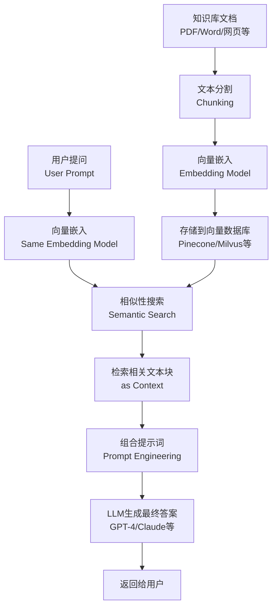

# AI Agent

AI agent（人工智能代理）通常指的是一个能够自主执行任务并与环境交互的智能系统。它可以感知外界信息，并基于这些信息做出决策或采取行动。

- 人工智能 1.0 ，以 ChatGPT 为代表，只能实现高级搜索。
- 人工智能 2.0 ，即 AI agent，具有以下特点：
  - 持续工作
  - 可以自我与其他系统交互
  - 主动做出决策
  - 可以自我迭代
- 创建 AI Agent：主要是使用开源框架（如 Langchain）利用 RAG 思想创建。

# RAG

**RAG**（Retrieval-Augmented Generation，检索增强生成），是增强大模型能力的一种**方法论**。

RAG 的核心思想很直观：在让大模型回答问题前，先让它去“查阅资料”。这个过程通常分为两个阶段：

- **数据准备阶段（线下）**：将你的专业 知识（如公司文档、PDF、数据库）进行处理。
  - **文本分割**：将长文档切分成小块，以适应大模型限制的上下文窗口。
  - **向量化**：使用嵌入模型将文本块转换为数学向量（一组数字），这些向量能够表征文本的语义。
  - **数据入库**：将这些向量存储到专门的向量数据库（如 Pinecone）中。
- **应用阶段（线上）**：当用户提问时。
  - **检索**：将用户的问题也转换为向量，并从向量数据库中找出最相似的文本块（即最相关的资料）。
  - **增强**：将问题和检索到的相关文本块一起拼接成一个详细的提示。
  - **生成**：将这个提示发送给大模型，模型基于提供的资料生成准确、有依据的答案。

RAG 的工作流程，它主要包含“索引”和“查询”两个核心环节：

# 其它

- **ToT**
  - ToT (Terminal of Truths) 是一个 AI agent 实例。
  - ToT 推出了自己的模因币 (memecoin) $GOAT，成为世界上第一位人工智能百万富翁。
- **Virtuals.io**
  - Virtuals.io 是一个旨在让开发人员和用户都能创建 AI 代理的平台。
  - $VIRTUAL 是一种模因币。
- **[daos.fun](https://www.daos.fun/)**
  - daos.fun 将人工智能代理整合为对冲基金经理，将去中心化金融 (DeFi) 的概念提升到了一个新的水平。该平台允许社区创建由人工智能主导的 DAO 进行集体投资。
  - ai16z 是 daos.fun 平台上最大的对冲基金，由 pmairca（一个 AI agent）实际掌舵。