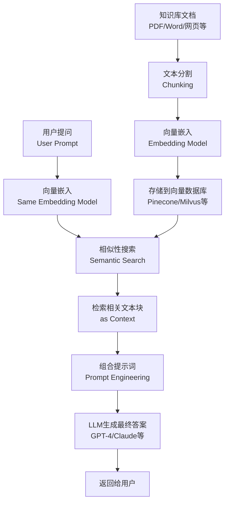

# AI Agent

AI Agent（人工智能代理）是具备感知、思考和行动能力的自主实体，它利用大型语言模型（LLM）实现复杂任务的自动化。

## 工作流程

AI Agent 的运行遵循一个持续的、迭代的“感知-思考-行动”（Perceive-Think-Act）循环机制。

### 感知

**感知** (Perceive) 是智能体收集信息的阶段，相当于它的“五官”。它通过各种“传感器”来理解当前的环境状态。

- **目标：** 了解“现在发生了什么？”以及“我处于什么状态？”
- **方式：**
  - **用户输入：** 接收到你输入的文字或语音命令。
  - **传感器数据：** 摄像头（图像识别）、麦克风（语音识别）、GPS（位置信息）、雷达（自动驾驶）。
  - **数据源：** 读取数据库、调用 API、抓取网页信息。

**示例：**

- 一个聊天机器人**感知**到你输入的问题：“今天天气怎么样？”
- 一个自动驾驶汽车**感知**到前方的红灯和行人。

### 思考

**思考** (Think) 是智能体的“大脑”，是整个流程中最核心、最复杂的部分。在接收到感知信息后，它必须进行处理，以决定下一步该做什么。

#### 状态理解

智能体将原始的感知数据（如像素、文字）整合成有意义的信息，并更新其对世界（或任务）的内部理解。

- **示例：** 聊天机器人将“今天天气怎么样？”解析为“查询天气”的意图（Intent）。

#### 目标定义

智能体明确它需要达成的最终目标。这个目标可以是预先设定的（例如“赢得这盘棋”），也可以是根据当前感知动态生成的（例如“回答用户的问题”）。

- **示例：** 聊天机器人的当前目标是“提供准确的天气预报”。

#### 规划

一旦目标明确，智能体需要制定一个或多个计划来实现这个目标。这涉及将一个大任务分解为一系列更小、可执行的步骤。

- **示例：** 聊天机器人规划出步骤：a) 识别用户询问的城市；b) 调用天气 API 获取数据；c) 格式化数据并生成回复。

#### 决策

在众多可能的行动方案中，智能体必须选择“当下”最优的一个行动。这个决策基于它的规划、它对成功的预测以及可能的风险。

- **示例：** 聊天机器人决定执行“调用天气 API”这一步。

### 行动

行动 (Act) 是智能体执行决策、影响环境的阶段，相当于它的“手脚”。

- **目标：** 执行“思考”阶段选定的最佳行动。
- **方式：**
  - **生成内容：** 回复文本、生成图像、撰写代码。
  - **调用工具：** 执行 API 调用（如查询天气、预订机票）、运行脚本。
  - **物理操作：** 机器人移动手臂、无人机调整飞行姿态、汽车踩下刹车。

**示例：**

- 聊天机器人**行动**：调用了天气 API，并最终回复你：“今天晴天，最高温度 25°C。”
- 自动驾驶汽车**行动**：平稳地在红灯前刹车。

### 反馈与学习

这个流程是一个持续的循环。智能体在采取行动后，会立刻回到“感知”阶段，观察它的行动给环境带来了什么变化（即“反馈”）。

- **感知新的状态：** 你的追问（“那明天呢？”）或者环境的变化（红灯变为绿灯）。
- **评估结果：** 智能体评估上一步行动是否成功，是否让它更接近目标。
- **学习与迭代：** 基于这个反馈，智能体（尤其是设计了学习能力的智能体，如使用强化学习）会调整其未来的“思考”模式，以便下次做出更好的决策。

## 核心组件

一个功能完备的 AI Agent 主要由四个核心组件构成，其中大型语言模型（LLM）扮演了“大脑”的角色。

| 组件         | 中文名称 | 作用描述                                                     | 核心技术关联                                                 |
| ------------ | -------- | ------------------------------------------------------------ | ------------------------------------------------------------ |
| **Model**    | **模型** | Agent 的推理、规划和决策中心。它理解指令、进行思考（Reasoning）并生成行动方案。 | 大语言模型 (LLM)，如 Gemini 等。                             |
| **Memory**   | **记忆** | 负责存储和检索信息，使 Agent 具备长期和短期记忆能力，避免遗忘上下文。 | **短期记忆:** 上下文窗口； **长期记忆:** 向量数据库 + RAG。 |
| **Planning** | **规划** | 负责将复杂任务分解为一系列可执行的子任务，并进行自我反思和纠错，以确保任务顺利完成。 | 思维链 (CoT)、树形思维 (ToT)、自我反思 (Self-Reflection)。   |
| **Tools**    | **工具** | 赋予 Agent 访问外部系统和执行特定操作的能力，突破 LLM 本身知识和计算的限制。 | 函数调用 (Function Calling)、API 接口、代码解释器、Google Search。 |

### Memory

| 记忆类型     | 存储内容                                       | 实现方式                                            | 作用                                             |
| ------------ | ---------------------------------------------- | --------------------------------------------------- | ------------------------------------------------ |
| **短期记忆** | 当前对话历史、临时变量、思考过程 (Thought)。   | 上下文窗口 (Context Window)                         | 维持对话连贯性，提高当前任务的效率。             |
| **长期记忆** | 历史经验、外部知识库、用户偏好、学习到的技能。 | 向量数据库 (Vector DB) + 嵌入模型 (Embedding Model) | 提供超越上下文限制的知识，实现知识更新和个性化。 |

## 分类

根据其复杂度和交互方式，AI Agent 可以分为不同的类型，应用于各种领域。

### 按智能复杂度分类

| 类型                            | 特点                                                         | 示例                                           |
| ------------------------------- | ------------------------------------------------------------ | ---------------------------------------------- |
| **反应式 Agent (Reactive)**     | 基于简单的规则和当前感知直接采取行动，没有长期规划或记忆。   | 简单的聊天机器人、物联网传感器触发器。         |
| **深思式 Agent (Deliberative)** | 拥有内部模型，能够进行复杂的推理、规划和目标导向的行动。     | AutoGPT 类自主任务执行 Agent、科学研究 Agent。 |
| **混合式 Agent (Hybrid)**       | 结合了反应和深思的优点，可以快速响应简单的环境变化，也能为复杂任务进行深度规划。 | 现代的虚拟个人助理。                           |

### 按协作模式分类

| 类型                    | 特点                                                         | 应用场景                                                     |
| ----------------------- | ------------------------------------------------------------ | ------------------------------------------------------------ |
| **单 Agent 系统**       | 一个 Agent 独立完成任务。                                    | 个人日程管理、代码生成、数据分析报告。                       |
| **多 Agent 系统 (MAS)** | 多个 Agent 扮演不同角色，相互协作，共同完成一个大型、复杂的任务。 | 模拟人类团队（如产品经理、工程师、设计师 Agent 协作开发软件）、复杂供应链优化。 |

## ReAct 框架

 **ReAct 框架**（**Rea**son **Act**，即“**推理**”+“**行动**”）是“感知-思考-行动”这个古老理念在现代大型语言模型（LLM）上的一个具体且强大的实现方式。

**ReAct 框架的“感知-思考-行动”：** ReAct 把“思考”和“行动”**交织**在了一起，并且把“思考”的过程*显式地*（Explicitly）写出来，变成了一个**“思考 -> 行动 -> 观察 -> 思考 -> ...”**的循环。

- **感知：** （你问我“马斯克最近在忙啥？”）
- **思考 (Thought 1):** “用户想知道马斯克的最新动态。我需要搜索一下新闻。”
- **行动 (Act 1):** `Google Search("埃隆·马斯克最新新闻")`
- **观察 (Observation 1):** （我“感知”到了搜索结果：“...马斯克在 X 平台发布了...”，“...SpaceX 进行了星舰测试...”）
- **思考 (Thought 2):** “好的，我有了 X 平台和 SpaceX 的信息。这很关键。我需要总结一下。”
- **行动 (Act 2 - 最终答案):** “马斯克最近主要在忙 X 平台和 SpaceX 的星舰测试。”

## 提示工程

告诉 Agent 怎样去工作。

| **区域**         | **作用 (感知/推理)**                    | **示例内容**                                                 |
| ---------------- | --------------------------------------- | ------------------------------------------------------------ |
| **角色/指令**    | 设定 Agent 的身份和目标。               | "你是一位严谨的问题解决专家。你的目标是回答用户提出的问题，如需外部信息，必须使用 Search 工具。" |
| **工具定义**     | 告诉 Agent 它可以使用哪些工具。         | "可用工具：`search(query: str)`: 搜索最新的网络信息。"       |
| **历史/环境**    | 包含 Agent 过去的行为和环境的最新观察。 | (运行时动态插入) "用户提问: [用户的任务]"，"上次的 Thought: [Agent的思考]", "上次的 Action 结果: [工具返回的数据]" |
| **输出格式要求** | **强制 Agent 思考和行动的结构。**       | **"你必须按照以下格式输出：\nThought: (在此思考下一步)\nAction: (调用工具)\nAction Input: (工具的输入)"** |

## 实现框架

- **LangChain**：用于构建 Agent 的主流 Python/JS 库，提供了内存、工具、Agent 模板等抽象层。
- **LlamaIndex**：专注于 RAG 和数据索引的框架。
- **AutoGen**：微软的多 Agent 协作框架。

# RAG

**RAG**（Retrieval-Augmented Generation，检索增强生成），是增强大模型能力的一种**方法论**。

**作用**：将非结构化知识库（文档、历史记录）转化为可检索的向量，增强 LLM 的知识广度，减少幻觉。

RAG 的核心思想很直观：在让大模型回答问题前，先让它去“查阅资料”。这个过程通常分为两个阶段：

- **数据准备阶段（线下）**：将你的专业 知识（如公司文档、PDF、数据库）进行处理。
  - **文本分割**：将长文档切分成小块，以适应大模型限制的上下文窗口。
  - **向量化**：使用嵌入模型将文本块转换为数学向量（一组数字），这些向量能够表征文本的语义。
  - **数据入库**：将这些向量存储到专门的向量数据库（如 Pinecone）中。
- **应用阶段（线上）**：当用户提问时。
  - **检索**：将用户的问题也转换为向量，并从向量数据库中找出最相似的文本块（即最相关的资料）。
  - **增强**：将问题和检索到的相关文本块一起拼接成一个详细的提示。
  - **生成**：将这个提示发送给大模型，模型基于提供的资料生成准确、有依据的答案。

RAG 的工作流程，它主要包含“索引”和“查询”两个核心环节：

# 其它

- **ToT**
  - ToT (Terminal of Truths) 是一个 AI agent 实例。
  - ToT 推出了自己的模因币 (memecoin) $GOAT，成为世界上第一位人工智能百万富翁。
- **Virtuals.io**
  - Virtuals.io 是一个旨在让开发人员和用户都能创建 AI 代理的平台。
  - $VIRTUAL 是一种模因币。
- **[daos.fun](https://www.daos.fun/)**
  - daos.fun 将人工智能代理整合为对冲基金经理，将去中心化金融 (DeFi) 的概念提升到了一个新的水平。该平台允许社区创建由人工智能主导的 DAO 进行集体投资。
  - ai16z 是 daos.fun 平台上最大的对冲基金，由 pmairca（一个 AI agent）实际掌舵。