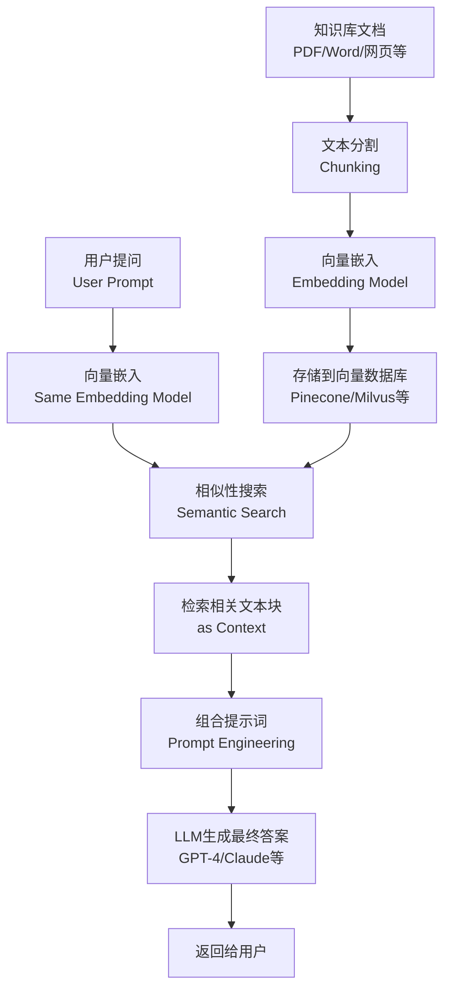

# AI Agent

AI Agent（人工智能代理）是具备感知、推理、规划和行动能力的自主实体，它利用大型语言模型（LLM）实现复杂任务的自动化。

创建 AI Agent：主要是使用开源框架（如 Langchain）利用 RAG 思想创建。

## AI Agent 基础与定义

### 核心概念

- **Agent 定义**：能够观察环境、并根据观察采取行动以实现目标的系统。
- **Agent = LLM + 规划 + 工具**：Agent 的能力超越了单纯的聊天机器人。
- **自主性 (Autonomy)**：Agent 能够独立地执行任务，无需人类的每一步干预。

### Agent 类型

- **单 Agent (Single-Agent)**：一个 Agent 完成所有任务。
- **多 Agent 系统 (Multi-Agent Systems - MAS)**：多个 Agent 通过协作、竞争或协商来完成复杂的、分解后的任务。
- **协作型 Agent**：共同解决一个目标（如 AutoGen）。
- **层级型 Agent**：有主管 (Manager) 和执行者 (Worker) 的 Agent。

## 核心组件与架构

### LLM (大型语言模型)

- **推理引擎**：Agent 的“大脑”，用于理解任务、进行逻辑推理、生成行动计划 (To-do List)。
- **任务分解**：将复杂任务拆解成可执行的子任务。

### 记忆

- **短期记忆 (Short-term)**：上下文窗口 (Context Window)，用于存储当前对话和最近的观察结果。
- **长期记忆 (Long-term)**：
  - **结构化**：用于存储关键事实、用户偏好、工具定义。
  - **向量数据库 (Vector DB)**：用于存储和检索过去的经验和知识（RAG 机制）。

### 规划

- **目标设定**：确定任务的最终状态。
- **计划生成**：生成一系列步骤或行动序列。
- **自我反思/批判**：Agent 评估上一步行动的结果，判断是否需要修正或改进计划。

### 工具使用

- **工具集 (Toolbox)**：Agent 可以调用的外部 API、函数或程序（如 Google 搜索、代码执行器、日历 API）。
- **路由/调用**：LLM 决定何时以及如何使用哪个工具，并生成正确的参数。

## 工作流程与决策循环

### 核心循环

1. **感知 (Perception)**：接收输入（用户请求、环境反馈）。
2. **推理与规划 (Reasoning & Planning)**：LLM 基于输入和记忆，思考下一步行动。
3. **行动 (Action)**：调用工具、生成代码、或与用户/其他 Agent 交互。
4. **观察 (Observation)**：接收行动的反馈或结果。

### ReAct 框架

- **Thought (思考)**：Agent 的推理过程，解释为何做此决策。
- **Action (行动)**：Agent 决定执行的动作（通常是工具调用）。
- **Observation (观察)**：行动返回的结果或环境变化。
- **循环**：持续进行 Thought -> Action -> Observation，直到任务完成。

## 关键技术与实现

### RAG (检索增强生成)

- **作用**：将非结构化知识库（文档、历史记录）转化为可检索的向量，增强 LLM 的知识广度，减少幻觉。
- **流程**：查询 -> 检索相关文档 -> 将文档作为上下文喂给 LLM -> LLM 生成回答。

### 提示工程

- **系统指令**：定义 Agent 的角色、目标和限制。
- **思维链 (Chain-of-Thought - CoT)**：要求 LLM 详细写出推理步骤。
- **零样本/少样本提示**：通过示例指导 Agent 如何使用工具。

### 实现框架

- **LangChain**：用于构建 Agent 的主流 Python/JS 库，提供了内存、工具、Agent 模板等抽象层。
- **LlamaIndex**：专注于 RAG 和数据索引的框架。
- **AutoGen**：微软的多 Agent 协作框架。

## 应用场景与挑战

### 应用场景

- **代码生成与调试**：自主编写和运行代码，修复错误。
- **数据分析与报告**：规划数据清理、调用分析工具、生成可视化报告。
- **自动化客服**：处理复杂的多步骤客户问题。
- **游戏与仿真**：创建具有真实行为和交互的 NPC。

### 面临的挑战

- **收敛性**：Agent 可能会陷入无限循环或无法收敛到正确答案。
- **成本**：每次思考和行动都需要调用 LLM API，成本较高。
- **安全性**：Agent 可能被恶意利用来执行有害操作（如越狱）。
- **长期记忆管理**：如何有效、准确地在大量历史经验中检索出相关信息。

# RAG

**RAG**（Retrieval-Augmented Generation，检索增强生成），是增强大模型能力的一种**方法论**。

RAG 的核心思想很直观：在让大模型回答问题前，先让它去“查阅资料”。这个过程通常分为两个阶段：

- **数据准备阶段（线下）**：将你的专业 知识（如公司文档、PDF、数据库）进行处理。
  - **文本分割**：将长文档切分成小块，以适应大模型限制的上下文窗口。
  - **向量化**：使用嵌入模型将文本块转换为数学向量（一组数字），这些向量能够表征文本的语义。
  - **数据入库**：将这些向量存储到专门的向量数据库（如 Pinecone）中。
- **应用阶段（线上）**：当用户提问时。
  - **检索**：将用户的问题也转换为向量，并从向量数据库中找出最相似的文本块（即最相关的资料）。
  - **增强**：将问题和检索到的相关文本块一起拼接成一个详细的提示。
  - **生成**：将这个提示发送给大模型，模型基于提供的资料生成准确、有依据的答案。

RAG 的工作流程，它主要包含“索引”和“查询”两个核心环节：

# 其它

- **ToT**
  - ToT (Terminal of Truths) 是一个 AI agent 实例。
  - ToT 推出了自己的模因币 (memecoin) $GOAT，成为世界上第一位人工智能百万富翁。
- **Virtuals.io**
  - Virtuals.io 是一个旨在让开发人员和用户都能创建 AI 代理的平台。
  - $VIRTUAL 是一种模因币。
- **[daos.fun](https://www.daos.fun/)**
  - daos.fun 将人工智能代理整合为对冲基金经理，将去中心化金融 (DeFi) 的概念提升到了一个新的水平。该平台允许社区创建由人工智能主导的 DAO 进行集体投资。
  - ai16z 是 daos.fun 平台上最大的对冲基金，由 pmairca（一个 AI agent）实际掌舵。