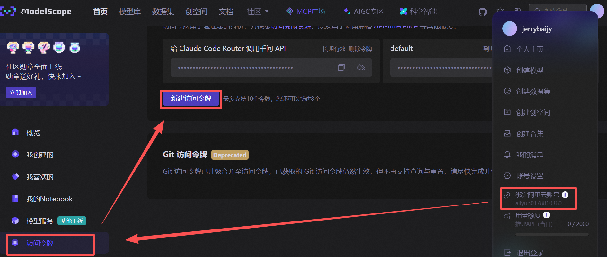

# 学习

- ai agent web3：https://youtube.com/playlist?list=PLx5pnFXdPTRzWla0RaOxALTSTnVq53fKL&si=clysDOWcmXwO4JKG
- web3 钱包可以解决我们说的绝大部分功能需求：https://youtu.be/NLZwPhGswwQ?si=Vt1rgxsIsYP271t6
- 仔细研究上面两个 video 提到的工具：https://youtu.be/pcpr7dyjdIA?si=v2YSbY-xWPkYixz_
- 投喂数据给推理模型：https://youtu.be/ptWFsiwOZwU?si=AOINOpP11Z1X8h20
- 这个方式可以了解各个币的归类：https://youtu.be/CwB1N82GgDE?si=83eglyvP1Kbz9IlB
- 这个比较综合，我们应该认真摸索里面的所有工具：https://youtu.be/Meh0whvRv7U?si=vIv87M1FU12FYTfV

# Claude Code

## Claude Code

[**Claude Code**](https://www.claude.com/product/claude-code) 是一个 AI 编程工具。

> [Claude Code 文档](https://docs.claude.com/zh-CN/docs/claude-code/overview)
>
> [CLI 参考](https://docs.claude.com/zh-CN/docs/claude-code/cli-reference)

### 环境搭建

- 前提条件：

  - 安装 `Node.js 18` 或更新版本
  - 一个 [Claude.ai](https://claude.ai/)（推荐）或 [Claude Console](https://console.anthropic.com/) 账户

- 终端执行以下命令：

  ```bash
  # 安装
  npm install -g @anthropic-ai/claude-code

  # 查看安装版本
  claude -v
  ```

- 执行 `claude` 命令启动，选择颜色主题。
- 登录选项：

  - Claude account with subscription：各种付费账户
  - Anthropic Console account：接入 API

- 为了接入 API

  - 这里不登录，应该退出终端。
  - 安装并配置 Claude Code Router，过程详见 `Claude Code Router` 章节。

- 运行 Claude Code Router

  ```bash
  # 正常运行
  claude

  # 调用 API 运行
  ccr code
  ```

- VS Code 中有 `Claude Code` 扩展，Claude Code 文档[有使用教程](https://docs.claude.com/zh-CN/docs/claude-code/ide-integrations)。

### 常用命令

```bash
# 查看版本
claude -v

# 更新到最新版本
claude update

# 启动交互式 REPL
claude

# 启动并调用 API
ccr code

# 通读全文
/init

# 压缩之前的对话内容
/compact

# 清除之前对话内容
/clear
```

### Claude Code Router

[Claude Code Router](https://github.com/musistudio/claude-code-router) 是 GitHub 上的一个开源项目，可以把任意大模型的 API 接入到 Claude Code 中。

**安装（前提已安装 Claude Code）**：

```bash
npm install -g @musistudio/claude-code-router
```

**配置** ：

- 项目 README 文件里有说明，另外抖音博主有[教程](https://www.douyin.com/video/7535010917268933898)。
- 用户根目录创建 `~/.claude-code-router/config.json` 文件夹和文件
- 用支付宝在魔搭社区绑定阿里云账号，并新建访问令牌。将新建的 API 填入到 `config.json`。

  

- `config.json` 内容如下：

  ```json
  {
    "Providers": [
      {
        "name": "modelscope",
        "api_base_url": "https://api-inference.modelscope.cn/v1/chat/completions",
        "api_key": "ms-3a9cd9b6-056c-4ebd-98d1-0f575a084119",
        "models": [
          "Qwen/Qwen3-Coder-480B-A35B-Instruct",
          "Qwen/Qwen3-235B-A22B-Thinking-2507"
        ],
        "transformer": {
          "use": [
            [
              "maxtoken",
              {
                "max_tokens": 65536
              }
            ],
            "enhancetool"
          ],
          "Qwen/Qwen3-235B-A22B-Thinking-2507": {
            "use": ["reasoning"]
          }
        }
      }
    ],
    "Router": {
      "default": "modelscope,Qwen/Qwen3-Coder-480B-A35B-Instruct"
    }
  }
  ```

- 终端执行 `ccr code` 命令以启动 Claude Code Router
- 异常处理

  ```bash
  ccr stop
  ccr start
  ```

**实验项目**：

- 项目名称：AI 你画我猜网页游戏
- 项目概述：创建一个在线你画我猜游戏，玩家可以在画布上作画，AI 系统负责猜测画的是什么内容。
- 技术栈选择
  - 技术栈: nextjs
  - AI 使用 Qwen 的 API，从后台调用 API
  - 不要任何 SDK，直接调用 Qwen API 地址

## 快捷键

<!-- prettier-ignore -->
| 操作 | Claude Code 快捷键 |
| :---: | :---: |
| 切换交互模式 | <kbd>Alt</kbd> + <kbd>M</kbd> |

## 使用技巧

- 切换交互模式
- 拖放图片
- 读取网页
