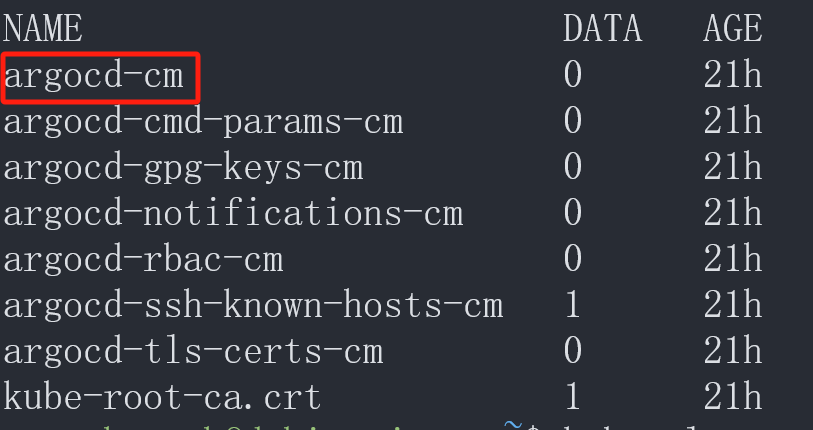

# Overview

[**Argo CD**](https://argo-cd.readthedocs.io/en/stable/) 是一个声明式的、面向 Kubernetes 的 GitOps CD 工具。


# Quick Start

## 安装和配置 Argo CD

- Docker 和 kubectl 已安装，集群已启动。

- [安装 Argo CD](https://argo-cd.readthedocs.io/en/stable/getting_started/#1-install-argo-cd)

  ```bash
  # 创建 Argo CD 命名空间
  kubectl create namespace argocd
  
  # 安装 Argo CD
  kubectl apply -n argocd -f https://raw.githubusercontent.com/argoproj/argo-cd/stable/manifests/install.yaml
  ```

- 查看 pod 状态，直到全部运行

  ```bash
  kubectl get pod -n argocd
  ```

- 获取密码

  ```bash
  kubectl get secret argocd-initial-admin-secret -n argocd -o jsonpath="{.data.password}" | base64 -d
  
  # 用户名：admin
  # 本地上次密码：dAlsKbgZa4FvVT6V
  # GCP 上次密码：BKgY5d5oEQCoMNFx
  ```

- 配置网络之后即可查看 Argo CD UI 界面

  ```bash
  # 查看网络服务
  kubectl get svc -n argocd
  
  # 本地：转发端口到本地（临时），访问：127.0.0.1:8080
  kubectl port-forward svc/argocd-server 8080:443 -n argocd
  
  # 公网
  kubectl patch svc argocd-server -n argocd -p '{"spec": {"type": "LoadBalancer"}}'
  ```

- 本地访问

  - 端口转发以后，当前终端要保持打开，否则访问不到。
  - 访问地址：https://127.0.0.1:8080

- 公网访问

  - 需要科学上网
  - 访问地址：http://$EXTERNAL-IP


## 部署应用

- 准备工作

  - Argo CD 已安装并初始化
  - 源代码开发完成，已将引用的 Image 推送至镜像仓库。

- 说明：此部分的目录和文件源自 [Todo Fullstack](todo-fullstack.md) 项目

- 创建 K8s 和 Argo CD 目录

  ```
  cd d:/projects/todo-fullstack
  mkdir k8s argo-cd
  ```

- 在 `k8s` 目录创建以下 K8s 配置文件：

  - `namespace.yaml`：应用的命名空间
  - `mysql.yaml`：数据库
  - `backend.yaml`：后端
  - `frontend.yaml`：前端
  
- 在 `argo-cd` 目录创建 Argo CD 的自定义应用配置文件 `application.yaml`

  ```yaml
  apiVersion: argoproj.io/v1alpha1
  kind: Application
  metadata:
    name: todo-app
    namespace: argocd
  spec:
    project: default
    source:
      repoURL: https://gitlab.com/jerrybai/todo-fullstack.git
      targetRevision: HEAD
      path: k8s
    destination:
      server: https://kubernetes.default.svc
      namespace: todo
    syncPolicy:
      automated:
        selfHeal: true
        prune: true
      syncOptions:
        - CreateNamespace=true
        - ApplyOutOfSyncOnly=true
      retry:
        limit: 5
        backoff:
          duration: 5s
          factor: 2
          maxDuration: 3m
  ```

- 推送至 Git 仓库

- 部署应用

  ```bash
  cd d:/projects/todo-fullstack/argo-cd
  kubectl apply -f application.yaml
  ```

- 在 Argo CD 页面查看应用已启动


## 访问应用

- 端口转发

  ```bash
  # 查看应用服务
  kubectl get svc -n todos
  
  # 将前端服务 80 端口到本地 8081 端口
  kubectl port-forward svc/frontend 8081:80 -n todos
  ```

  如有调试需要，也可将后端和数据库进行端口转发

  ```bash
  # 数据库
  kubectl port-forward svc/mysql 3306:3306 -n todos
  # 后端
  kubectl port-forward svc/backend 5000:5000 -n todos
  ```

- 访问应用：http://localhost:8081/

- 以后若想更改应用，只需需改 K8s 配置文件并推送至 Git 仓库，Argo CD 可自动识别并更改部署。


## 删除应用

```bash
cd d:/projects/todo-fullstack/argo-cd
kubectl delete -f application.yaml
kubectl delete ns todo
```


## 删除 Argo CD

- **删除 ArgoCD 自定义资源定义（CRD）**

  ```bash
  kubectl delete crd applications.argoproj.io appprojects.argoproj.io argocds.argoproj.io
  ```

- **删除 ArgoCD 的命名空间**

  ```bash
  kubectl delete ns argocd
  ```

# Install

Argo CD 有[多种安装方式](https://argo-cd.readthedocs.io/en/stable/operator-manual/installation/)。

## 使用声明式清单安装 Argo CD

- Docker 和 kubectl 已安装，集群已启动。

- [安装 Argo CD](https://argo-cd.readthedocs.io/en/stable/getting_started/#1-install-argo-cd)

  ```bash
  # 创建 Argo CD 命名空间
  kubectl create namespace argocd
  
  # 安装 Argo CD
  kubectl apply -n argocd -f https://raw.githubusercontent.com/argoproj/argo-cd/stable/manifests/install.yaml
  ```

## 使用 Helm Chart 安装 Argo CD

## 使用 Terraform 安装 Argo CD

### 准备工作

[已通过 Terraform 配置 GKE 集群](<gcp-gke.md#使用 Terraform 创建 GKE 集群>)

### `terraform.tf`

```hcl
terraform {
  required_providers {
    
    # ... 其它配置 ...
    
    helm = {
      source  = "hashicorp/helm"
      version = "~> 3.1.0"
    }
  }
}

```

### `argo-cd.tf`

```hcl
# 添加 Helm Provider
provider "helm" {
  kubernetes = {
    host                   = "https://${google_container_cluster.my_cluster.endpoint}"
    token                  = data.google_client_config.default.access_token
    cluster_ca_certificate = base64decode(google_container_cluster.my_cluster.master_auth[0].cluster_ca_certificate)
  }
}

# 创建 Argo CD 命名空间
resource "kubernetes_namespace_v1" "argocd" {
  metadata {
    name = "argocd"
  }
  depends_on = [google_container_node_pool.my_node_pool]
}

# 安装 Argo CD
resource "helm_release" "argocd" {
  name       = "argocd"
  repository = "https://argoproj.github.io/argo-helm"
  chart      = "argo-cd"
  namespace  = kubernetes_namespace_v1.argocd.metadata[0].name
  version    = "7.7.1"

  set = [
    # 设置服务类型为 LoadBalancer
    {
      name  = "server.service.type"
      value = "LoadBalancer"
    },
    # 允许 HTTP 访问
    {
      name  = "server.extraArgs"
      value = "{--insecure}"
    },
    # 仅允许自己的 IP 访问
    {
      name  = "server.service.loadBalancerSourceRanges"
      value = "{${var.my_external_ip}/32}"
    }
  ]
}

# 获取 Argo CD 服务数据 (用于 Output)
data "kubernetes_service_v1" "argocd_server" {
  metadata {
    name      = "${helm_release.argocd.name}-server"
    namespace = helm_release.argocd.namespace
  }
  depends_on = [helm_release.argocd]
}

# 获取初始密码 Secret 数据
data "kubernetes_secret_v1" "argocd_initial_admin_secret" {
  metadata {
    name      = "argocd-initial-admin-secret"
    namespace = helm_release.argocd.namespace
  }
  depends_on = [helm_release.argocd]
}

# 输出 Argo CD 公网 IP
output "argocd_loadbalancer_ip" {
  description = "Argo CD UI 的公网访问 IP"
  value       = data.kubernetes_service_v1.argocd_server.status[0].load_balancer[0].ingress[0].ip
}

# 输出初始管理员密码
output "argocd_initial_admin_password" {
  description = "Argo CD 的初始管理员密码 (用户名为 admin)"
  value       = data.kubernetes_secret_v1.argocd_initial_admin_secret.data["password"]
  sensitive   = true
}
```

### `variables.tf`

```hcl
# --- Argo CD ---
variable "my_external_ip" {
  type        = string
  description = "My external IP access to Argo CD"
  sensitive   = true
}
```

### `terraform.tfvars`

```hcl
my_external_ip = "5.181.21.188"
```

# CR 清单

## 概述

[`application.yaml`](https://argo-cd.readthedocs.io/en/stable/user-guide/application-specification/) 是一个 Kubernetes CR 清单，它声明式地定义了 Argo CD 如何将 Git 仓库中指定的应用配置同步到目标 Kubernetes 集群。

- Argo CD 的安装过程已经在 Kubernetes 集群中配置并部署了 CRD，这个 CRD 就是 `Application` 对象的蓝图。
- 通过 `kubectl apply -f application.yaml` 命令所创建的 YAML 文件，正是该 [CRD](kubernetes.md#CRD) 定义的 [CR](kubernetes.md#CR) 的一个实例。

## 字段

> [官方字段规范](https://argo-cd.readthedocs.io/en/stable/user-guide/application-specification/)

[**Go 结构体**](https://pkg.go.dev/github.com/argoproj/argo-cd/v2/pkg/apis/application/v1alpha1)是 Argo CD Application CRD 字段的定义来源，Go 结构直接对应于 YAML 或 JSON 中的字段。

1. **查找字段：** 您可以在页面上找到名为 **`ApplicationSpec`** 的结构体（Struct）。这就是 `application.yaml` 文件中 **`.spec`** 字段对应的全部内容。
2. **字段名称：** 结构体中的每个字段名称（例如 `Source`、`Destination`、`SyncPolicy`）都对应于 YAML 中的键名（例如 `source`、`destination`、`syncPolicy`）。
3. **类型：** 字段旁边的类型（例如 `ApplicationSource`、`Destination`）表明该字段是一个**嵌套结构**。您需要点击这些类型名称，跳转到下一层结构体，才能看到子字段的完整列表。

## 常规写法

```yaml
apiVersion: argoproj.io/v1alpha1  # Argo CD API 版本
kind: Application                 # 自定义资源类型
metadata:                         # 应用程序元数据
  name: todos-app                 # 应用程序名称
  namespace: argocd               # Argo CD 所在命名空间
spec:                             # 规约
  project: default
  source:                         # 仓库源
    repoURL: https://github.com/Jerrybaijy/todo-fullstack.git # 仓库地址
    targetRevision: HEAD  # 版本指针，HEAD 为当前选定分支的最新提交
    path: k8s             # 配置文件在 Git 仓库中的路径
  destination:
    server: https://kubernetes.default.svc # 目标集群 API 地址
    namespace: todo                        # 资源所在命名空间
  syncPolicy:         # 同步策略
    automated:        # 自动同步配置
      selfHeal: true  # 自愈
      prune: true     # 修剪
    syncOptions:                   # 同步选项
      - CreateNamespace=true       # 自动创建命名空间
      - ApplyOutOfSyncOnly=true    # 仅同步未同步的资源，而不是所有资源
```

## `source`

`source` 用于指定 CR 的仓库源。

```yaml
# K8s 清单源
source:
  # Git 仓库地址
  repoURL: https://github.com/Jerrybaijy/todo-fullstack.git
  # 版本指针，HEAD 为当前选定分支的最新提交
  targetRevision: HEAD
  # K8s 配置文件在 Git 仓库中的路径
  path: k8s
```

```yaml
# Helm Chart 源
source:
  # <oci-registry>/<chart-name>
  repoURL: oci://registry.gitlab.com/jerrybai/todo-fullstack/todo-chart
  # Chart 版本号
  targetRevision: "99.99.99-latest"
  # Chart 名称
  chart: todo-chart
```

# 同步

Argo CD 允许用户自定义目标集群中所需状态的[**同步方式**](https://argo-cd.readthedocs.io/en/stable/user-guide/sync-options/)。

# 访问管理页面

## Kubectl 方式创建时访问管理页面

### 本地

端口转发：

```bash
# 查看网络服务
kubectl get svc -n argocd

# 本地：转发端口到本地
kubectl port-forward svc/argocd-server 8080:443 -n argocd
```

本地访问：

- 端口转发以后，当前终端要保持打开，否则访问不到
- 访问地址：https://127.0.0.1:8080

### 公网

改变 `argocd-server` 的类型为 `LoadBalancer`：

```bash
# 查看网络服务
kubectl get svc -n argocd

# 公网
kubectl patch svc argocd-server -n argocd -p '{"spec": {"type": "LoadBalancer"}}'
```

公网访问：

- 需要科学上网
- 访问地址：http://$EXTERNAL-IP

## Terraform 方式创建时访问管理页面

### 通过设置 LoadBalancer

在 Argo CD 资源块中添加如下：

- 设置服务类型为 LoadBalancer
- 且仅允许自己的 IP 访问

```hcl
set = [
  # 设置服务类型为 LoadBalancer
  {
    name  = "server.service.type"
    value = "LoadBalancer"
  },
  # 允许 HTTP 访问
  {
    name  = "server.extraArgs"
    value = "{--insecure}"
  },
  # 仅允许自己的 IP 访问
  {
    name  = "server.service.loadBalancerSourceRanges"
    value = "{${var.my_external_ip}/32}"
  }
]
```

**公网访问**：

- 需要科学上网

- 获取 Argo CO 管理页面 IP

  ```bash
  terraform output argocd_loadbalancer_ip
  ```

- 访问地址：http://$EXTERNAL-IP

### GKE Ingress + Identity-Aware Proxy (IAP) (生产级推荐)

这套方案虽然配置复杂，但它利用了 Google 的全球负载均衡和身份验证体系，是目前 GKE 上管理后台最安全的做法。

1.  准备工作：配置 OAuth 同意屏幕
2. 创建 Google 托管证书 (Managed Certificate)
3. 配置 BackendConfig 以启用 IAP
4. 修改 Argo CD 服务 (Service)
5. 创建 Ingress 暴露服务
6. 配置 IAM 权限
7.  域名解析 (DNS)

# 获取初始密码

**注意**：登录以后应在 `User Info` 中及时修改密码！

Kubectl 方式创建时获取初始密码：

```bash
kubectl get secret argocd-initial-admin-secret -n argocd -o jsonpath="{.data.password}" | base64 -d

# 用户名：admin
# 本地上次密码：dAlsKbgZa4FvVT6V
```

Terraform 方式创建时获取初始密码：

```bash
terraform output -raw argocd_initial_admin_password
```

# 部署应用

有三种方式部署应用：

- Argo CD UI
- Argo CD CLI
- K8s 原生部署

## K8s 原生部署应用

- 准备工作

  - Argo CD 已安装并初始化
  - 源代码开发完成，已将引用的 Image 推送至镜像仓库。

- 说明：此部分的目录和文件源自 [Todo Fullstack](todo-fullstack.md) 项目

- 创建 K8s 和 Argo CD 目录

  ```
  cd d:/projects/todo-fullstack
  mkdir k8s argo-cd
  ```

- 在 `k8s` 目录创建以下 K8s 配置文件：

  - `namespace.yaml`：应用的命名空间
  - `mysql.yaml`：数据库
  - `backend.yaml`：后端
  - `frontend.yaml`：前端
  
- 在 `argo-cd` 目录创建 Argo CD 的自定义应用配置文件 `application.yaml`

  ```yaml
  apiVersion: argoproj.io/v1alpha1
  kind: Application
  metadata:
    name: todo-app
    namespace: argocd
  spec:
    project: default
    source:
      repoURL: https://gitlab.com/jerrybai/todo-fullstack.git
      targetRevision: HEAD
      path: k8s
    destination:
      server: https://kubernetes.default.svc
      namespace: todo
    syncPolicy:
      automated:
        selfHeal: true
        prune: true
      syncOptions:
        - CreateNamespace=true
        - ApplyOutOfSyncOnly=true
      retry:
        limit: 5
        backoff:
          duration: 5s
          factor: 2
          maxDuration: 3m
  ```

- 推送至 Git 仓库

- 部署应用

  ```bash
  cd d:/projects/todo-fullstack/argo-cd
  kubectl apply -f application.yaml
  ```

- 在 Argo CD 页面查看应用已启动

## 使用 Terraform 部署应用

此种方法没有成功！暂时仍然使用 `kubectl apply -f application.yaml` 命令部署应用。

```
Error: Failed to construct REST client
│
│   with kubernetes_manifest.my_app,
│   on app.tf line 10, in resource "kubernetes_manifest" "my_app":
│   10: resource "kubernetes_manifest" "my_app" {
│
│ cannot create REST client: no client config
```

### 准备工作

- [已通过 Terraform 配置 GKE 集群](<gcp-gke.md#使用 Terraform 创建 GKE 集群>)
- [已通过 Terraform 配置 Cloud SQL](<gcp-cloud-sql.md#使用 Terraform 创建 Cloud SQL>)
- [已通过 Terraform 配置 Argo CD 的安装](<argo-cd.md#使用 Terraform 安装 Argo CD>)

### `argo-cd.tf`

```hcl
# 使用 kubernetes_manifest 部署 Argo CD Application
resource "kubernetes_manifest" "my_app" {
  manifest = {
    "apiVersion" = "argoproj.io/v1alpha1"
    "kind"       = "Application"
    "metadata" = {
      "name"      = local.app_name
      "namespace" = kubernetes_namespace_v1.argocd.metadata[0].name
    }
    "spec" = {
      "project" = "default"
      "source" = {
        "repoURL"        = local.chart_repo_pull
        "targetRevision" = "99.99.99-latest"
        "chart"          = local.chart_name
      }
      "destination" = {
        "server"    = "https://kubernetes.default.svc"
        "namespace" = kubernetes_namespace_v1.app_ns.metadata[0].name
      }
      "syncPolicy" = {
        "automated" = {
          "selfHeal" = true
          "prune"    = true
        }
        "syncOptions" = [
          "CreateNamespace=true",
          "ApplyOutOfSyncOnly=true"
        ]
        "retry" = {
          "limit" = 5
          "backoff" = {
            "duration"    = "5s"
            "factor"      = 2
            "maxDuration" = "3m"
          }
        }
      }
    }
  }
  depends_on = [
    google_container_node_pool.my_node_pool,
    helm_release.argocd
  ]
}
```

### `variables.tf`

```hcl
variable "prefix" {
  type        = string
  description = "Project prefix"
  default     = "todo"
}

locals {
  
  #... 其它配置 ...
  
  project_name    = "${var.prefix}-fullstack"
  app_name        = "${var.prefix}-app"
  chart_name      = "${var.prefix}-chart"
  chart_repo_pull = "oci://registry.gitlab.com/jerrybai/${local.project_name}/${local.chart_name}"
}
```

# 相关项目

- Argo CD Git
- Argo CD Helm
- [Todo Fullstack](todo-fullstack.md)

# FAQ

## OutOfSync

- 当使用 ArgoCD 部署好应用以后，一切运行正常，但 UI 页面一直显示 OutOfSync，即使状态不同步，应用程序实际上也是同步的，但看到它不同步很烦人。若要消除此问题，有一种解决方案是使用资源排除。

  

- [以下方法由博主提供](https://medium.com/@rojenshrestha100/argo-cd-out-of-sync-due-to-cilium-identity-f9d6188aa056)

- 访问 Argo CD 的 configmap

  ```bash
  kubectl get cm -n argocd
  ```

  

- 使用 nano 编辑器编辑此配置图

  ```bash
  KUBE_EDITOR="nano" kubectl edit cm argocd-cm -n argocd
  ```

- 文末在第一层级添加以下数据并保存

  ```yaml
  data:
    resource.exclusions: |
      - apiGroups:
        - cilium.io
        kinds:
        - CiliumIdentity
        clusters:
        - "*"
  ```

