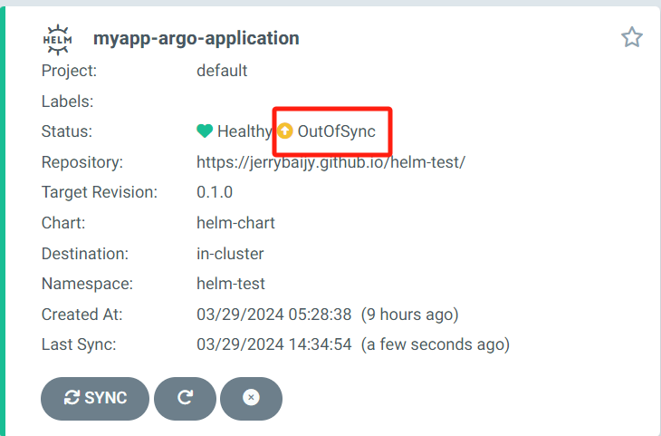

# Argo CD

## Argo CD 基础

[**Argo CD**](https://argo-cd.readthedocs.io/en/stable/) 是一个面向 Kubernetes 的声明式 GitOps 持续交付工具。


### 环境搭建

- Docker 和 kubectl 已安装，集群/Minikube已启动。

- 安装 Argo CD

  ```bash
  kubectl create namespace argocd
  kubectl apply -n argocd -f https://raw.githubusercontent.com/argoproj/argo-cd/stable/manifests/install.yaml
  ```

- 查看 pod 状态，直到全部运行

  ```bash
  kubectl get pod -n argocd
  ```

- 将端口转发至本地或公网即可查看 Argo CD UI 界面

  ```bash
  kubectl get svc -n argocd
  # 转发端口到本地，访问：127.0.0.1:8080
  kubectl port-forward -n argocd svc/argocd-server 8080:443
  # 公网
  kubectl patch svc argocd-server -n argocd -p '{"spec": {"type": "LoadBalancer"}}'
  ```

- 获取密码

  ```bash
  # 获取密码
  kubectl get secret argocd-initial-admin-secret -n argocd -o yaml
  # 解码，PASSWORD为上一步获取到的加密密码
  echo $PASSWORD== | base64 --decode
  
  # 上次密码：z1JL378fQ-G45D1C
  ```

- 在本地或公网通过 IP 访问 Argo CD 页面登录，用户名为 admin，公网访问需要科学上网。

- 端口转发以后，当前终端要保持打开，否则访问不到 https://127.0.0.1:8080

## 基本流程

- Argo CD 已安装

- 项目根目录创建 dev 目录

- dev 目录创建 deployment.yaml 和 service.yaml

  - 注意云上的集群有节点限制，试用时只能创建一个副本
  - deployment.yaml 和 service.yaml 见 Kubenetes

- Repo 根目录创建 application.yaml

  ```yaml
  apiVersion: argoproj.io/v1alpha1
  kind: Application
  metadata:
    name: student-springboot-react-frontend
    namespace: argocd
  
  spec:
    project: default
    source:
      repoURL: https://github.com/Jerrybaijy/student-springboot-react-frontend.git
      targetRevision: HEAD
      path: dev
  
    destination:
      server: https://kubernetes.default.svc
      namespace: student-springboot-react-frontend
  
    syncPolicy:
      syncOptions:
        - CreateNamespace=true
      automated:
        selfHeal: true
        prune: true
  ```

- 推送仓库

- 部署应用

  ```bash
  kubectl apply -f application.yaml
  ```

- 在 Argo CD 页面查看应用已启动

- 查看 IP 即可访问应用（如有需要可进行端口转发）

  ```bash
  kubectl get svc -n myapp
  ```

- 以后若想更改应用，只需需改 yaml 文件并推送至 Git 仓库，Argo CD 可自动识别自动部署。

- 删除应用

  - 不要直接在集群删除应用，要先在 Argo CD 页面删除应用（因为已配置自愈，Argo CD 会自动创建应用）
  - 再删除应用的命名空间

- 删除 Argo CD

  - **删除 ArgoCD 自定义资源定义（CRD）**

    ```bash
    kubectl delete crd applications.argoproj.io appprojects.argoproj.io argocds.argoproj.io
    ```

  - **删除 ArgoCD 的命名空间**

    ```bash
    kubectl delete namespace
    ```

## 相关项目

- Argo CD Git
- Argo CD Helm

## 解决方案

### OutOfSync

- 当使用 ArgoCD 部署好应用以后，一切运行正常，但 UI 页面一直显示 OutOfSync，即使状态不同步，应用程序实际上也是同步的，但看到它不同步很烦人。若要消除此问题，有一种解决方案是使用资源排除。

  

- [以下方法由博主提供](https://medium.com/@rojenshrestha100/argo-cd-out-of-sync-due-to-cilium-identity-f9d6188aa056)

- 访问 Argo CD 的 configmap

  ```bash
  kubectl get cm -n argocd
  ```

  

- 使用 nano 编辑器编辑此配置图

  ```bash
  KUBE_EDITOR="nano" kubectl edit cm argocd-cm -n argocd
  ```

- 文末在第一层级添加以下数据并保存

  ```yaml
  data:
    resource.exclusions: |
      - apiGroups:
        - cilium.io
        kinds:
        - CiliumIdentity
        clusters:
        - "*"
  ```

