> 参考：我要自学网《CAD2019 装修施工图教程》

# CAD 基础

## 环境搭建

- 以 CAD 2020 为例

### 安装

- 使用 7-Zip 解压下载好的安装包，解压密码 `www.cadzxw.com`
- 双击 `AutoCAD_2020_Simplified_Chinese_Win_64bit_dlm.sfx.exe` 进行自解压；

  **注意**：这里是双击解压，不是用解压软件解压。

  

    
  

- 选择解压位置后点确定

  

    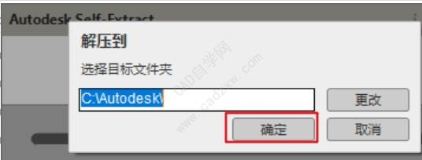
  

- 正在解压

  

    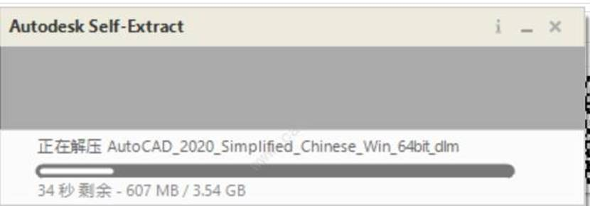
  

- 解压后一般会自动弹出下图，点击安装

- 如果没有弹出，在第 2 步解压位置处找到 `Setup` 双击运行

  

    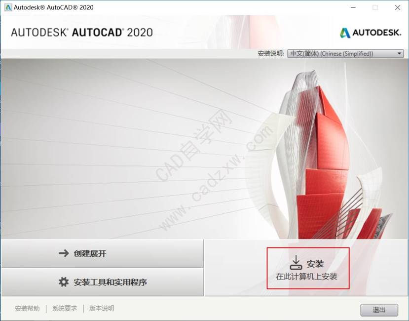
  

- 选择 `国家`，选择 `我接受`，点击 `下一步`

  

    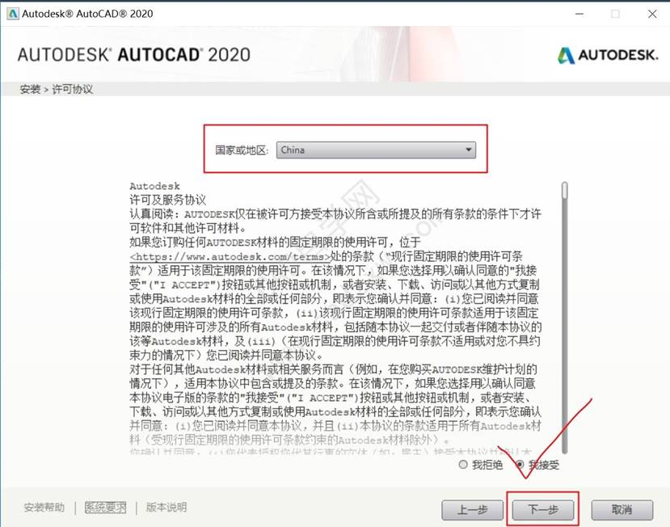
  

- 选择 `产品语言`，`安装路径`，点击 `安装`

  

    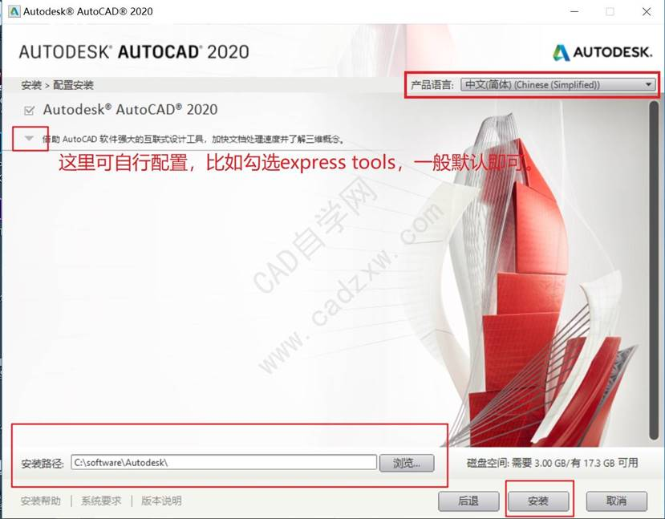
  

- 正在安装

  

    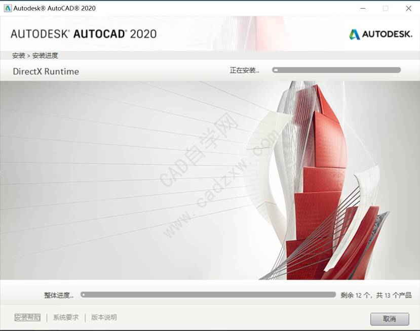
  

- 安装完成

  

    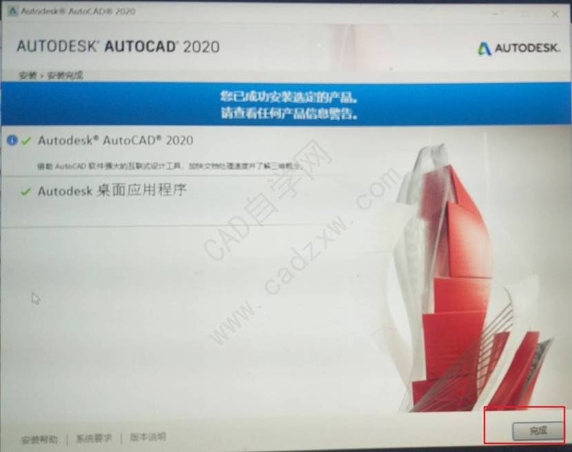
  

### 激活

- 双击桌面 AutoCAD 2020 快捷键打开软件

- 点击 `输入序列号`

  

    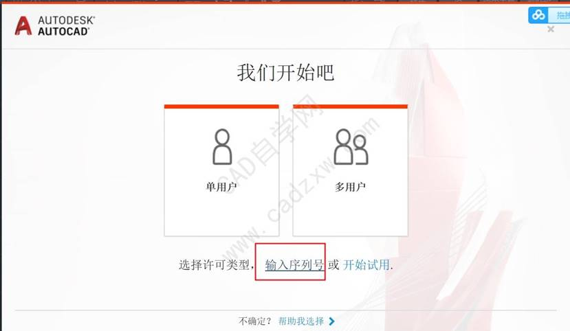
  

- 点击 `我同意`

  

    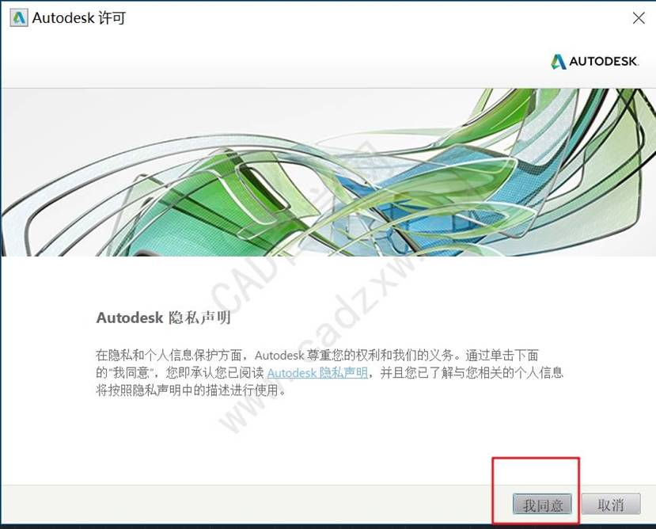
  

- 点击 `激活`

  

    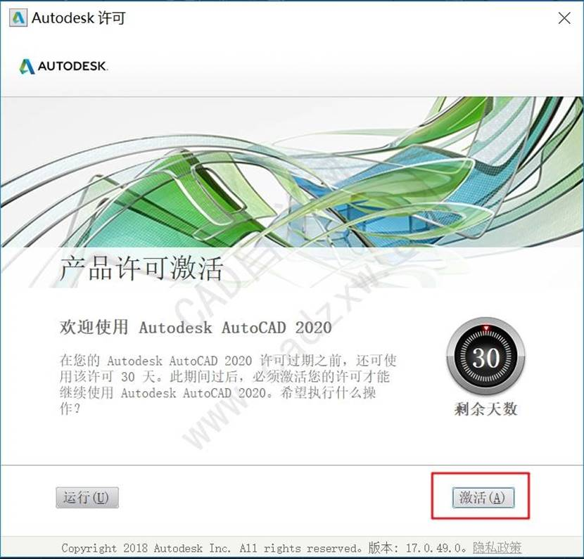
  

- 输入序列号 `666-69696969`，产品密钥 `001L1`，点击 `下一步`

  

    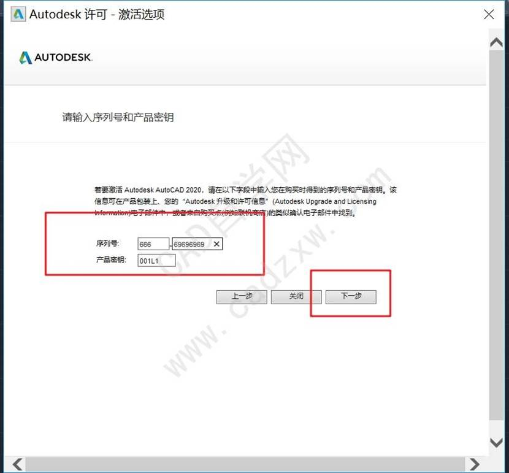
  

- 选择 `我具有Autodesk提供的激活码`，`不要点击下一步`

  

    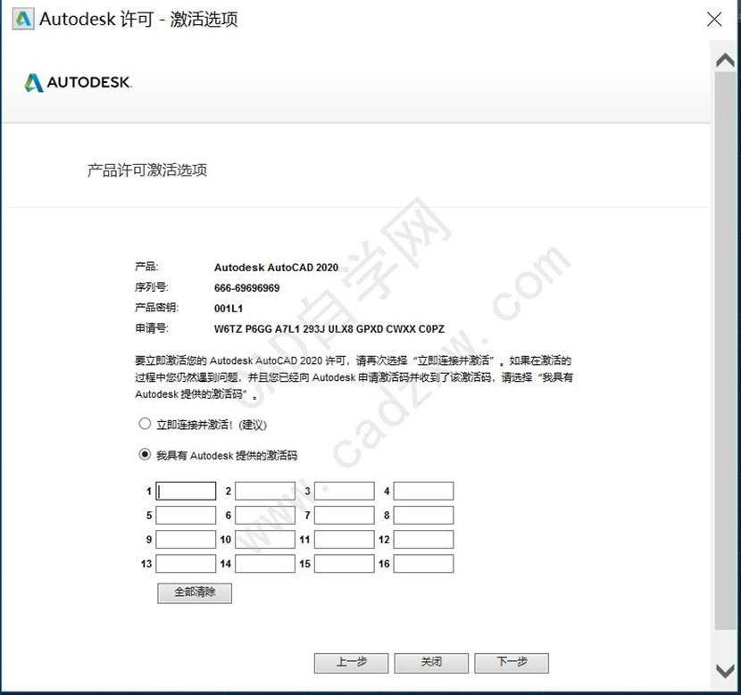
  

- 解压注册机，右键 `以管理员身份运行` 打开注册机

  

    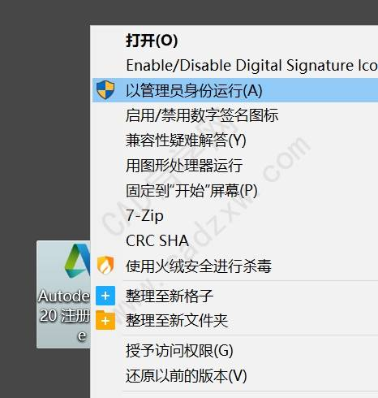
  

- 复制 `申请号` 至注册机 `申请号` 中，点击 `算号`，点击 `补丁`，点击 `确定`

  

    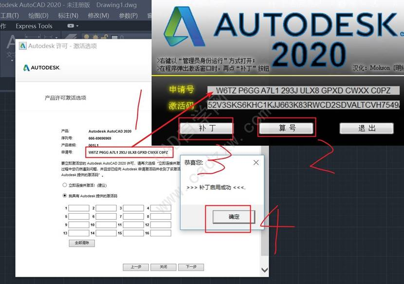
  

- 复制 `激活码` 至 `我具有Autodesk提供的激活码` 中，点击 `下一步`

  

    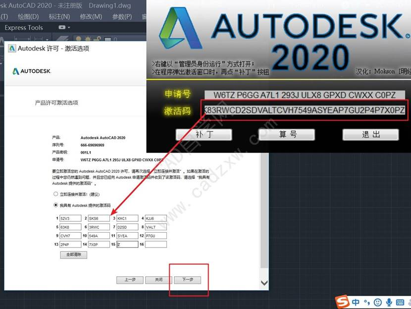
  

- 完成

  

      
  

- 打开软件

  

      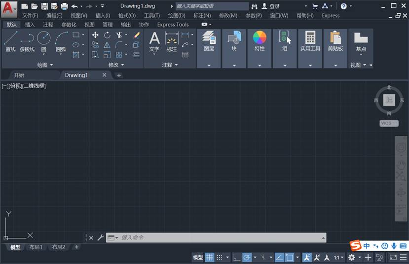
  

- 点击右上方 `?` 右侧的倒三角 `▽`，点击 `关于Autodesk AutoCAD` 查看 CAD 属性

  

      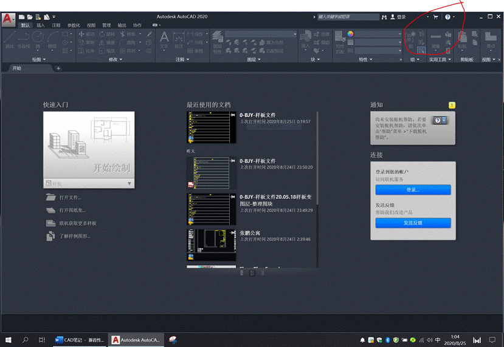
  

- 点击 `管理许可`

  

      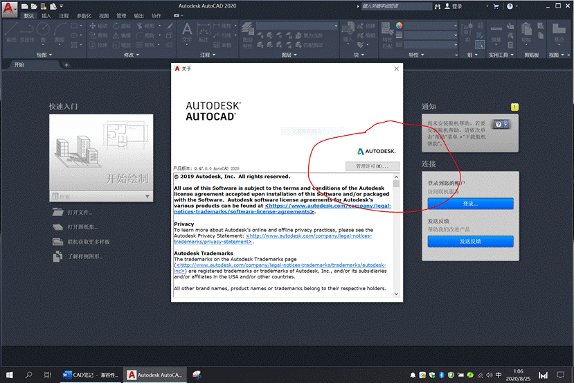
  

- 点击蓝色向右箭头

  

      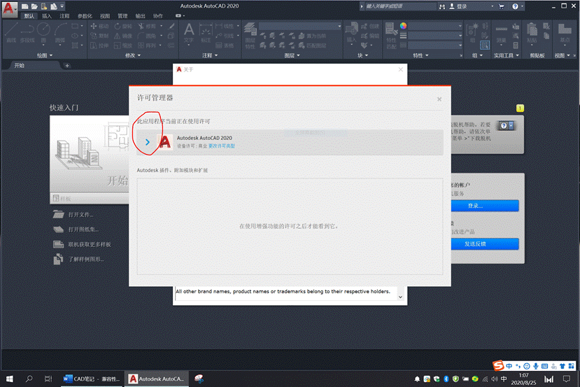
  

- 查看当前 CAD 许可行为 `永久`，许可到期日期 `无`，至此激活完成

  

      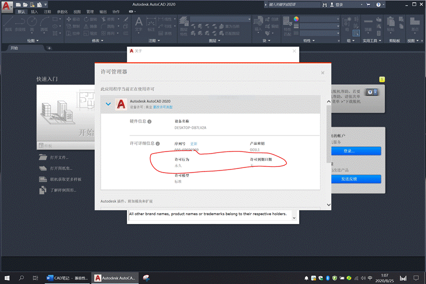
  

## CAD 设置

- 以下设置只跟 CAD 软件有关，跟样板文件无关
- 各种插件添加至启动组

  - 将插件复制到 CAD 安装目录下的 **support** 文件夹内
  - 打开任意一个 dwg 文件
  - AP 空格，在 **support** 文件夹内找到插件，然后点加载
  - 在窗口的右下角位置，有个启动组，我们点击内容，打开“启动组”文件添加窗口。（从启动组添加的插件，就意味着随软件打开即同时启动插件。）在“support”文件夹内找到插件，然后点打开，关闭。在加载/卸载程序窗口的左下角便能看见“已将\*\*（插件）添加到启动组”，然后点击“关闭”，关闭加载/卸载程序窗口即可。

- 精度设置：UN 空格，精度设置 0
- 背景颜色：OP 空格—显示—颜色

  - 二维模型空间—统一背景：黑色
  - 图纸/布局—统一背景：黑色
  - 图纸/布局—图纸背景：黑色

- 设置靶框

  - OP 空格—绘图—自动捕捉标记大小：最大
  - OP 空格—绘图—靶框大小：最大
  - OP 空格—选择集—拾取框大小：适当
  - OP 空格—选择集—加点尺寸：适当

- 设置十字光标大小

  - OP 空格—显示—十字光标—15（适当）

- 将自己的样板文件替换成系统默认样板文件

  - 打开自己 dwg 格式的样板文件，另存为 dwt 格式，存在软件默认保存位置。
  - OP 空格—文件—样板设置—快速新建的默认样板文件名—浏览—双击位置选择自己的样板文件，保存即可

- 整理选项板

  - `Ctrl + 3` 工具选项板
  - 在选项板设置里可以批量删除系统默认选项板的项目
  - 常用命令：打断、打断于点、拉长、删除重复对象、绘图次序、定数等分、定距等分、添加引线、删除引线、多重引线合并、多重引线对齐、定义属性；
  - 样式：点样式、文字样式、多线样式、标注样式、多重引线样式
  - 符号、门窗、卧室、厨房、卫生间、客厅、餐厅、灯、开关插座。

  - 每次修改块的时候要重新把块从“0-BJY-样板文件.dwg”文件中添加到工具选项板。

## 创建样板文件

- 先另保样板文件，dwt 格式，重命名
- 关闭栅格 F7，关闭栅格捕捉 F9
- 视图界面关闭 UCS 坐标，View Cube 方向
- 创建图层

  - 0 层：颜色白 7
  - 标注：颜色红 1
  - 标注拆改：颜色红 1
  - 标注灯具：颜色红 1
  - 标注地面：颜色红 1
  - 插座：绿 3
  - 窗户：颜色青 4
  - 瓷砖完成面：颜色灰 251
  - 灯：颜色黄 2
  - 灯具定位线：线型 IS002W100，颜色灰 251
  - 地面铺装：197
  - 房间名称：颜色红 1
  - 家具不到顶：颜色黄 2
  - 家具到顶：颜色黄 2
  - 开关：绿 3
  - 梁：线型 IS002W100，颜色灰 251
  - 门：颜色黄 251
  - 门口：线型 IS002W100，颜色灰 251
  - 墙体：颜色白 7
  - 墙体拆除，颜色橙 32
  - 墙中线: 线型 IS002W100，颜色青 4
  - 天花：颜色青 4
  - 图框：颜色红 1
  - Defpoints：颜色红 1

- 字体样式：ST 空格

  - 仿宋标注-0：字体仿宋，高度 0
  - 仿宋文字说明-150：字体仿宋，高度 150
  - 仿宋房间名-250：字体仿宋，高度 250
  - 仿宋量房信息-100：字体仿宋，高度 100
  - 图框-3：字体仿宋，高度 3
  - 仿宋样板图文字-400：字体仿宋，高度 400

- 点样式：格式-点样式-绝对单位 50
- 多线样式：MM 空格

  - 逆时针内墙 0，-1
  - 顺时针内墙 1，0
  - 中线不封口 0.5，-0.5（以及起点封口和终点封口）

- 标注样式：总共建立三个 2.5，100，250（置为当前），D 空格

  - 线：颜色 Bylayer，界线超出尺寸线 250，界线起点偏移量 250，固定长度尺寸界线 250
  - 箭头：建筑标记，高度 250（快速引线的箭头大小与此有关）
  - 文字：文字样式调用标注文字样式，黄色，高度 250，设置各项位置，从尺寸线偏移 50
  - 全局比例 1，主单位精度 0
  - 小标注，根据大标注改为 100，文字从尺寸线偏移 30

- 引线样式：总共建立 2 个，2.5，250（置为当前）MLS 空格

  - 引线：直线，颜色红 1
  - 箭头：符号实心闭合，大小 250
  - 引线结构：最大引线点数 5，基线距离设为 0 以后取消自动包含基线，指定比例 1
  - 文字内容：无

- 填充图案样式

  - 地板：AR-BRSTD，角度顺阳光，比例 3，颜色 Bylayer
  - 地砖：USER（双向），比例：地砖尺寸，颜色 Bylaye
  - 过门石：AR-SAND，比例 1，颜色 251（布局空间内比例为 0.05，图框图层,颜色 251）
  - 拆除墙体：NET3，比例 20（布局空间内比例为 1，图框图层，颜色 32），墙体拆除图层
  - 新建墙体：AR-BRSTD，比例 1.2，填充放入墙体拆除图层（布局空间内比例为 0.01，图框图层）
  - 天花：CROSS，比例 1，颜色 251，（布局空间内比例为 0.3，图框图层）

- 布局空间

  - 布局 1，删除原视口；
  - 插入图框块，创建 MV 视口，图框图层。
  - 视口内

    - MV 视口内创建各个图层状态管理
    - 创建自定义比例
    - 设置打印样式
    - 锁定

- 布局外创建构造线

  - 从图框左二线，10，文字起始位置
  - O 空格 35，引线终点位置
  - 再 O 空格 15，引线拐角位置
  - 右侧同理

- 引线样本

  - 不同引线尾巴间距 5，箭头到顶线距离 40
  - 文字样式，图框-3，颜色黄 2

- 模型空间

  - 复制原始结构图：创建副本，放到最后，重命名为墙体拆改图；
  - 用同样方法创建其余平面图纸，并在 MV 视口内图层状态管理，然后锁定。

## 绘图顺序

- 打开样板文件，另存为 DWG 格式，重命名。
- 复制效果平面图到画布，1:1 对齐。
- 绘制墙体、下水管道、地漏、烟风道、门口线、梁、窗、指北针、入户箭头、举架、房间名称、量房信息、标注
- 打开所有图层，复制原始结构图用以创建墙体拆改图，不要忘记复制墙中线，将墙体拆改图放入布局空间。
- 用同样方法逐一进行绘图。

# CAD 快捷键

- `F8` 正交
- `F10` 极轴追踪
- **鼠标中键**

  - `按住不松手` 平移图纸
  - `双击中键` 显示全图
  - `从左往右选` 窗口选择
  - `从右往左选` 碰选

- **加选和减选**

  - `按住Shift` 减选
  - `按住Ctrl` 加选整体图形中的直线

- `PU` 清理图层、块等
- `MA` 特性匹配
- **线**

  - `L` 直线，可输入固定长度，可以长短方向拉伸固定长度。
  - 带有角度的直线：非正交模式，输入长度，`Tab`，输入角度，回车（角度不支持空格确认）；想往哪个方向计算角度，鼠标就放在哪个方向
  - `XL` 构造线
  - `ML` 多线，多线编辑：修改–对象–多线，个人命令可添加快捷键 MLB

- **圆**

  - `C` 圆
  - `A` 圆弧

- `REC` 矩形，可输入长与宽，注意正负数值代表绘图方向，可以输入倒角和倒圆角
- `SC` 缩放
- `AL` 对齐
- `MI` 镜像
- `RO` 旋转
- `EX` 延伸，`EX空格`，选择延伸边界，空格，选择被延伸对象，空格。（此功能可以按 shift 键当修剪使用）
- `S` 拉伸
- `EX` 延伸
- `LEN` 拉长
- **圆角和修剪**

  - `F` 圆角，可以圆角多个
  - `TR` 修剪

- `M` 移动
- `E` 删除
- `OV` 删除重复对象
- `CO` 复制
- `O` 偏移
- `AR` 阵列
- `BR` 打断，打断于点（整个圆不能打断于点）
- `J` 合并，`J空格`，选择要合并的对象。
- `B` 成块
- `X` 分解
- **等分**

  - `DIV` 定数等分
  - `ME` 定距等分

- `H` 填充
- **算面积**

  - 矩形圈起（不规则房间用多段线圈起），AA 空格，O 空格，点选边界

- **点的相对坐标**：横坐标，逗号，纵坐标
- **标注**：

  - **DIM 智能标注**，标注一个，空格（退出 DIM），DCO 连续标注，选择下一个端点。
  - **基线标注**，选择标注按钮，基线，S，选择最边缘的标注，选择另一个边缘的点，空格。

- `MEA` 测量
- `MLD` 多重引线
- `MLS` 引线样式
- `MLA` 对齐多重引线
- `MLE` 添加引线
- `MLC` 合并引线
- `LE` 快速引线
- **Ctrl**

  - `Ctrl + 0` 全屏显示
  - `Ctrl + 1` 特性管理器
  - `Ctrl + 2` 设计中心
  - `Ctrl + 3` 工具选项板
  - `Ctrl + 4` 图纸集
  - `Ctrl + 9` 关闭命令行

- `CHS` 将物体在布局与模型空间之间搬运
- **图层的控制**

  - 关闭图层：关闭所有图层（包括布局视口的图层）
  - 隔离图层：就是在当前图层状态下，关闭未被隔离图层
  - 取消隔离：打开被隔离的图层（区别于打开所有图层）
  - 冻结图层：关闭某个视口里的图层，不影响模型空间和其它布局视口，注意选择是在当前空间还是所有空间。
  - 置为当前图层
  - 图层状态管理器：可以统一设置要显示的图层

# 块

- 无论是创建块还是修改块，都要在“0-BJY-样板文件.dwg”文件中进行，并且文件的路径为：E 盘—工作—CAD 各种样板—样板文件—0-BJY-样板文件.dwg
- 统一放到 0 图层再成块
- 对于不能分解的块，可以在块编辑器里，Ctrl+1，修改是否允许分解。
- 临时块，写块创建永久块。
- 属性块 ATT

# 绘图经验

## 引线如何对齐

- 创建构造线
- 从图框左侧，1000，文字起始位置
- O 空格 2000，引线终点位置
- 再 O 空格 1000，引线拐角位置
- 右侧同左侧对称

## 标注如何对齐

- 围绕墙体最外圈画矩形
- O 空格 800，第一圈标注
- 再 O 空格 800，第二圈标注

# 解决办法

## 许可检出超时

**方案 1**：

- CAD 许可证检查程序被杀毒软件禁用，在杀毒软件服务项中找到 Autodesk Desktop Licensing Service（Autodesk 许可证检查服务），禁用再启用，即可解决。
- 或者在服务中找到上述注册表设为自动并启动。

**方案 2**：

- 如果方案 1 没用，从网盘下载 Autodesk Licensing-installer，安装即可
