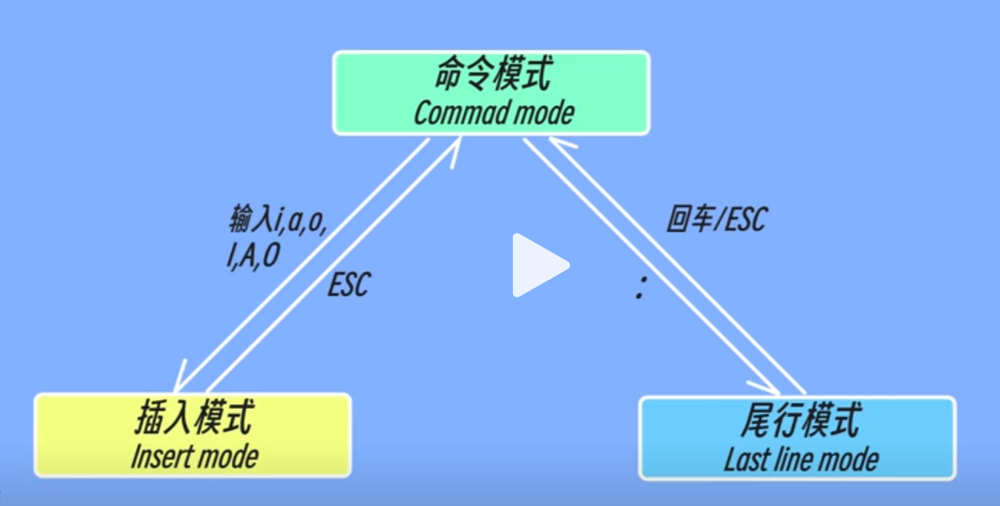

# CLI 命令行界面

**CLI**（**C**ommand **L**ine **I**nterface，命令行界面），是一种通过输入文本命令与计算机或软件交互的方式。与 **GUI**（图形用户界面）不同，CLI 主要依赖键盘输入命令行指令，而不是鼠标点击操作。

## **CLI 的特点**

- **高效性**：比 GUI 快速，适用于自动化任务。
- **可编写脚本**：CLI 命令可以编写成脚本，自动化执行任务。
- **资源占用低**：比 GUI 需要的计算资源更少。
- **远程操作**：可以通过 SSH 远程管理服务器。
- **精准控制**：提供更细粒度的操作能力。

## CLI 实例

- **Windows** ：CMD、PowerShell、Windows Terminal 和 Git Bash
- **Linux / macOS**：Terminal

# 常识和快捷键

在命令行界面有以下常识和快捷键：

- **大小写**：命令中的大小写不敏感（Windows 中的文件名敏感）
- **`$`**：行首的 `$` 表示终端正在等待输入命令
- **跨行输入**：行尾使用 `\`
- **多条命令**：以 `;` 隔开

| 操作 | 快捷键 |
| :---: | :---: |
| ==光标== |  |
| 将光标移动到行首 | <kbd>Home</kbd> \| <kbd>Ctrl</kbd> + <kbd>A</kbd> |
| 将光标移动到行尾 | <kbd>End</kbd> \| <kbd>Ctrl</kbd> + <kbd>E</kbd> |
| ==退出== |  |
| 强制从输出中退出 | <kbd>Ctrl</kbd> + <kbd>C</kbd> |
| 退出系统 | `exit` \| <kbd>Ctrl</kbd> + <kbd>D</kbd> |
| ==复制粘贴== |  |
| 复制 | <kbd>Ctrl</kbd> + <kbd>Shift</kbd> + <kbd>C</kbd> |
| 粘贴 | <kbd>Ctrl</kbd> + <kbd>Shift</kbd> + <kbd>C</kbd> |
| ==删除== |  |
| 删除光标到行首的内容 | <kbd>Ctrl</kbd> + <kbd>C</kbd> |
| 删除光标到行尾的内容 | <kbd>Ctrl</kbd> + <kbd>C</kbd> |
| ==其它== |  |
| 向上/下翻一条命令 | <kbd>↑</kbd> \| <kbd>↓</kbd> |

# Bash 命令

| 操作 | 命令 |
| :---: | :---: |
| ==目录== |  |
| 进入目录 | `cd` |
| 创建目录 | `mkdir` |
| 删除空目录 | `rmdir` |
| 删除非空目录 | `rm -r` |
| 列出目录内容 | `ls` |
| 列出目录内容（含隐藏） | `ls -al` |
| ==文件== |  |
| 创建文件 | `touch` |
| 复制文件 | `cp` |
| 移动文件 | `mv` |
| 删除文件 | `rm` |
| ==其它== |  |
|  |  |
|  |  |

# 命令选项

- `-rf` 选项是 `-r` 和 `-f` 的组合

    - `-r` 选项，以确保递归删除子目录和文件。
    - `-f` 选项，强制删除。

- `-y`：默认同意

# 目录

## 目录命令

```bash
# 创建目录
mkdir [PATH] FOLDER_NAME
# 删除空目录
rmdir [PATH] FOLDER_NAME
# 删除非空目录
rm -r [PATH] FOLDER_NAME
# 列出目录内容
ls [-al] # -al列出隐藏内容
```

## 路径

- **命令**：`cd`
- **示例**
    - Linux：`cd /Home/USER_NAME`
    - Windows：`cd C:/Users/USER_NAME`
- **分隔符**

    - `/`：Linux、Unix、Windows、macOS、Android、IOS、URL 等都支持
    - `\`：仅 Windows 支持，且为默认

- **大小写敏感**

    - 敏感：Linux、Unix、Android、iOS
    - 不敏感：Windows、macOS

- **路径符号**

    - 根目录：

        - Linux：`cd /`
        - Windows：`cd X:/`（`x` 为驱动器名称）

    - User 目录：

        - Linux：`cd ~` 或 `Home/USER_NAME`
        - Windows：`cd ~` 或 `C:/Users/USER_NAME`

    - 当前目录：`cd .` （在当前目录操作可省略路径）
    - 上级目录：`cd ..`
    - 显示当前工作目录的绝对路径：`pwd` 

- **引用文件**

    - 上级：`../my-image.jpg`
    - 同级：`./my-image.jpg` 或 `my-image.jpg`（基于当前目录的相对路径可省略 `./`）
    - 子目录：`./subdirectory/my-image.jpg` 或 `subdirectory/my-image.jpg`

### 路径转义

- 如果路径中包含空格，需要使用转义字符 `\` 或者引号来避免错误。例如进入 `VMware Tools` 目录：

    ```bash
    # 使用反斜杠 \ 转义
    cd /media/jerry/VMware\ Tools
    
    # 使用单引号 ' 转义
    cd '/media/jerry/VMware Tools'
    
    # 使用双引号 " 转义
    cd "/media/jerry/VMware Tools"
    ```

- 关于 `'` 和 `"` 的区别

    - `'` 会**完全保留**其中的字符，不进行任何特殊的处理或扩展（例如，变量不会被展开）。
    - `"`  会允许其中的变量进行扩展和某些特殊字符的处理（例如 `$HOME` 会被展开为实际路径）。

# 文件

## 文件基础

- **基础命令**

    ```bash
    # 查看文件
    cat $FILE
    # 创建文件
    touch $FILE
    # 编辑文件
    nano $FILE
    vim $FILE
    # 删除文件
    rm $FILE
    # 复制文件
    cp $FILE $DES_PATH
    ```

- **文本搜索**

    ```bash
    grep CONTENT
    ```

- 替换

    `sed`：流编辑器，用于对文本进行流式处理；`-i`：在原文件修改；`s`：替换；`g` ：全局替换

    ```bash
    sed -i 's/SOURCE_CONTENT/NEW_CONTENT/g' 'PATH/FILE'
    # e.g.
    sed -i 's/aaa/bbb/g' './html.py' # 将当前目录下的html.py文件中的aaa替换成bbb
    ```

- `echo`：快速向文件添加内容

    ```bash
    echo "[CONTENT]" > [FILE]
    # e.g.
    echo "Hello World!" > demo.txt
    ```

- 查找文件

    ```bash
    find PATH OPTION COMMAND
    # e.g.
    find . -name jquery* -print # 查找当前目录下所有文件名以jquery开头的文件，并打印路径
    ```

## Vim

**Vi**（Vi IMproved）是 Unix 系统上最早的文本编辑器之一，**Vim**（Vi IMproved）是 Vi 的增强版。

### Basics

- Basics

    ```bash
    # show version
    vi / vim
    # open / create file
    vim $FILE
    # into insert mode
    i
    # back to command mode
    `Esc`
    # exit
    :q
    # save and exit
    :wq
    ```

### Command mode

- Default enter into command mode.

    

- `Esc`: Back to command mode

- `dd`: Cut cursor line. `2dd`: Cut cursor and next line

- `yy`: Copy cursor line. `2yy`: Copy cursor and next line

- `p`: Paste at next line of cursor. `2p`: Paste at next line of cursor 2 times

- `Ctrl + F`: Page Up. `Ctrl + U`: Page Up Half.

- `Ctrl + B`: Page Down. `Ctrl + D`: Page Down Half.

### Insert mode

- Into insert mode

    - `i`: before cursor
    - `I`: line beginning
    - `a`: after cursor
    - `A`: line end
    - `o`: next new line
    - `O`: previous new line

- Edit

    - `^`: jump to line beginning
    - `$`: jump to line end

### Last line mode

- `:`: Into last line mode
- `:q`: exit
- `:wq`: save and exit
- `:set nu`: show line number
- `:set nonu`: close line number

# Curl

`curl` 是一个用于与网络服务器进行数据交换的命令行工具。

## 下载文件

- 下载并显示文件内容

    ```bash
    curl http://example.com/file.txt
    ```

- 下载的文件，并按原文件名保存

    ```bash
    curl -O http://example.com/file.txt
    ```

- 下载的文件，并按指定路径和文件名保存

    ```bash
    curl -o myfile.txt http://example.com/file.txt
    ```

## 上传文件

- 上传文件

    ```bash
    curl -X POST -F "file=@myfile.txt" http://example.com/upload
    ```

# 其它

## 管道符

**`|`**：管道符，命令输出传递；e.g.：打开 `tmp` 目录中的 `html.py` 文件，然后找出字符串 `jquery-1.11.3.min.js`

```bash
cat /tmp/html.py | grep jquery-1.11.3.min.js
```

## tldr

**tldr** 是一个简化的命令行工具，名字来源于 "Too Long; Didn't Read"，旨在提供比传统 `man` 页面更简洁、更实用的命令帮助信息。

- 安装

    ```bash
    sudo apt update && sudo apt full-upgrade
    sudo apt install tldr
    ```

- 升级

    ```bash
    tldr --update
    ```

- 使用（以 `apt` 为例）

    ```bash
    tldr apt
    ```
