# CSS

[**CSS**](https://developer.mozilla.org/zh-CN/docs/Web/CSS)（**C**ascading **S**tyle **S**heets，层叠样式表），是一种用来为结构化文档（如 HTML 文档或 XML 应用）添加样式的**样式表语言**，文件扩展名为 `.css`。

## 主要资源

> [W3C 官方文档](https://www.w3.org/Style/CSS/current-work "W3C")
>
> [MDN CSS](https://developer.mozilla.org/zh-CN/docs/Web/CSS)
>
> [MDN CSS 语法](https://developer.mozilla.org/zh-CN/docs/Web/CSS/CSS_syntax/Syntax)
>
> [MDN CSS 参考](https://developer.mozilla.org/zh-CN/docs/Web/CSS/Reference)

## 代码风格

- **大小写**：不敏感，通常全小写。
- **缩进**：不敏感，通常缩进 2 个空格。
- **分号**：行尾加 `;`
- **空白行**：不敏感
- **换行**：不敏感

## 注释

[**CSS 注释**](https://developer.mozilla.org/zh-CN/docs/Web/CSS/CSS_syntax/Comments)：

- 单行注释：`Ctrl + /`
- 多行注释：`Ctrl + Shift + /`

```css
.demo {
  /* 这是一个单行注释 */

  /*多行注释第一行
  多行注释第二行
  多行注释第三行*/
}
```

## CSS 语句

CSS 样式表的由一系列 [**CSS 语句**](https://developer.mozilla.org/zh-CN/docs/Web/CSS/CSS_syntax/Syntax#css_语句)组成，有两种类型：

- 规则集
- At 规则

  - **条件规则组**是特殊的 at 规则

## At 规则

### 语法

[**At 规则**](https://developer.mozilla.org/zh-CN/docs/Web/CSS/CSS_syntax/At-rule)是一个 [CSS 语句](https://developer.mozilla.org/zh-CN/docs/Web/CSS/CSS_syntax/Syntax#css_语句)，用来指示 CSS 如何运行。

```css
/* 一般结构 */
@identifier (RULE);

/* 示例：通知浏览器使用 UTF-8 字符集 */
@charset "utf-8";
```

### 嵌套

[**嵌套 at 规则**](https://developer.mozilla.org/zh-CN/docs/Web/CSS/CSS_syntax/At-rule#嵌套)

### 条件规则组

[**条件规则组**](https://developer.mozilla.org/zh-CN/docs/Web/CSS/CSS_syntax/At-rule#条件规则组)

### `@important`

[`@important`](https://developer.mozilla.org/zh-CN/docs/Web/CSS/@import) 规则用于导入其它样式表。`@important` 必须先于所有其他类型的 at 规则（`@charset` 规则除外）。

```css
@import "github-night.css";
```

### 其它 at 规则

- [At 规则索引](https://developer.mozilla.org/zh-CN/docs/Web/CSS/CSS_syntax/At-rule#%索引)

## 规则集

[**规则集**](https://developer.mozilla.org/zh-CN/docs/Learn/Getting_started_with_the_web/CSS_basics#“css_规则集”详解) 是一个 _CSS 语句_，结构如下：


**规则集主要部分有**：

- **选择器**：`p`，用于指定为哪种元素添加样式，详见[选择器](#选择器)。
- [**声明块**](https://developer.mozilla.org/zh-CN/docs/Web/CSS/CSS_syntax/Syntax#css_声明块)：`{color: red;}`，声明块用大括号 `{}` 包含声明。

  - [**声明**](https://developer.mozilla.org/zh-CN/docs/Web/CSS/CSS_syntax/Syntax#css_声明）)：`color: red;`，即属性名值对，属性与属性值用冒号 `:` 分隔，声明用 `;` 结尾。

    - **属性**：`color`，用于指定改变元素的哪种样式，详见[属性](#属性)。
    - **属性值**：`red`，用于指定元素样式的值，一个声明里含多个属性值用 `空格` 分隔，详见[属性值](#属性值)。

# 属性

CSS [属性](https://developer.mozilla.org/en-US/docs/Web/CSS/Properties)用于设置所选元素的某些样式。

## 简写属性

[**简写属性**](https://developer.mozilla.org/zh-CN/docs/Web/CSS/CSS_cascade/Shorthand_properties)是可以让你同时设置好几个 CSS 属性值的 CSS 属性。

## `CSS 变量`

[`CSS 变量`](https://developer.mozilla.org/zh-CN/docs/Web/CSS/--*) 是一个自定义属性，详见 [:root](#:root)。

## `all`

**所有属性** [`all`](https://developer.mozilla.org/zh-CN/docs/Web/CSS/all) 是一个简写属性，将除了 [`unicode-bidi`](https://developer.mozilla.org/zh-CN/docs/Web/CSS/unicode-bidi) 与 [`direction`](https://developer.mozilla.org/zh-CN/docs/Web/CSS/direction) 之外的所有属性重设至其初始值，或继承值。

## `gap`

**间隔** [`gap`](https://developer.mozilla.org/zh-CN/docs/Web/CSS/gap) 是一个简写属性，用于设置容器内子元素之间间隔（例如弹性布局中，沿主轴方向）。

- [`column-gap`](https://developer.mozilla.org/zh-CN/docs/Web/CSS/column-gap)
- [`row-gap`](https://developer.mozilla.org/zh-CN/docs/Web/CSS/row-gap)

**注意**：`gap` 属性不适用于流式布局。

## `z-index`

[`z-index`](https://developer.mozilla.org/zh-CN/docs/Web/CSS/z-index) 属性用于设置 _非 `static` 定位元素及其后代元素_ 或 _flex 项目_ 的 **Z 轴顺序**。z-index 较大的重叠元素会覆盖较小的元素。

当没有在任何元素上指定 `z-index` 属性时，元素的[堆叠顺序](https://developer.mozilla.org/zh-CN/docs/Web/CSS/CSS_positioned_layout/Stacking_without_z-index)如下（从上到下）：

- 后代定位元素，按在 HTML 中出现的顺序排列。
- 后代非定位元素，按在 HTML 中出现的顺序排列。
- 根元素的背景和边框。

以下是 `relative` 覆盖 `absolute` 的示例：


```html
<div class="test-block">Test Block</div>
<div class="normal-block">Normal Block</div>
```

```css
.test-block {
  width: 150px;
  height: 150px;
  background-color: red;
  position: absolute;
  top: 20px;
  left: 20px;
  z-index: 1;
}

.normal-block {
  width: 150px;
  height: 150px;
  background-color: green;
  position: relative;
  top: 20px;
  left: 20px;
  z-index: 2;
}
```

# 属性值

## 属性值定义语法

[**CSS 属性值定义语法**](https://developer.mozilla.org/zh-CN/docs/Web/CSS/CSS_values_and_units/Value_definition_syntax)（CSS value definition syntax）是用来限定 CSS 属性合法取值的专门语法。

- **关键字**，如 `red`
- **基本数据类型**，如 `<length>` 的 `5px`
- **函数**，如 `<color>` 的 `rgb(255 0 153)`
- [更多...](https://developer.mozilla.org/zh-CN/docs/Web/CSS/CSS_values_and_units/Value_definition_syntax)

## 值和单位

> [CSS 值和单位](https://developer.mozilla.org/zh-CN/docs/Learn_web_development/Core/Styling_basics/Values_and_units)

## 基本数据类型

[**CSS 基本数据类型**](https://developer.mozilla.org/zh-CN/docs/Web/CSS/CSS_values_and_units/CSS_data_types)是一种[组合值类型](https://www.w3.org/TR/css3-values/#component-types)。用于定义 CSS 属性和函数可以接受的变量（关键字和单位）的种类。

- [`<number>`](https://developer.mozilla.org/zh-CN/docs/Web/CSS/number)：数字
- [`<length>`](https://developer.mozilla.org/zh-CN/docs/Web/CSS/length)：长度值，由 _`<number>`_ 和*长度单位*构成。

  - [绝对长度单位](https://developer.mozilla.org/zh-CN/docs/Web/CSS/length#绝对长度单位)
  - [相对长度单位](https://developer.mozilla.org/zh-CN/docs/Web/CSS/length#相对长度单位)

- [`<percentage>`](https://developer.mozilla.org/zh-CN/docs/Web/CSS/percentage)：百分比，由 _`<number>`_ 和 `%` 构成。
- [`<color>`](https://developer.mozilla.org/zh-CN/docs/Web/CSS/color_value)：颜色值
- [更多...](https://developer.mozilla.org/zh-CN/docs/Web/CSS/CSS_values_and_units/CSS_data_types)

## 值函数

[**CSS 值函数**](https://developer.mozilla.org/zh-CN/docs/Web/CSS/CSS_values_and_units/CSS_value_functions)是调用特殊数据处理或计算的语句，以返回一个属性值。

## 四值语法

**四值语法**是某个属性的*属性值*，可以是 `1-4` 个值；此部分是自己总结。

- **一个值**：该值将应用于**四条边**。
- **两个值**：第一个值应用于 `top` 和 `bottom`，第二个值应用于 `left` 和 `right`。
- **三个值**：第一个值应用于 `top`，第二个值应用于 `left` 和 `right`，第三个值应用于 `bottom`.
- **四个值**：这些值按照 `top`、`right`、`bottom`、`left` 的顺序（顺时针）进行应用。

# 层叠

[**层叠**](https://developer.mozilla.org/zh-CN/docs/Web/CSS/CSS_cascade/Cascade)（Cascading，实际意为“串联或级联”）是 CSS 处理*规则冲突*的核心算法。

## 层叠顺序

> [层叠、优先级与继承](https://developer.mozilla.org/zh-CN/docs/Learn_web_development/Core/Styling_basics/Handling_conflicts)
>
> [级联排序顺序](https://drafts.csswg.org/css-cascade-4/#cascade-sort "w3c")

层叠的总体原则：

- 如果不是同一个因素，前面的因素将覆盖后面的因素
- 如果是同一个因素，高优先级将覆盖低优先级，详见各因素章节。

影响层叠的因素：

- `!important` 标记
- 样式来源
- 层叠层
- 特异度
- 源码顺序
- 继承

## `!important`

**`!important` 标记**：

- **普通声明**：不带有 `!important` 标记的声明，如 `color: red;`。
- **重要声明**：带有 `!important` 标记的声明，如 `color: red !important;`。

当一个元素有两个样式声明时，*重要声明*将覆盖*普通声明*。

```html
<p>这是一个段落</p>
```

```css
p {
  color: green !important;
}

p {
  color: red;
}
```

> 

**在以上示例中**：

- 第一条带有 `!important` 标记的*重要声明*覆盖了第二条的*普通声明*，否则应按规则顺序显示为红色。

## 样式来源

[**样式来源**](https://developer.mozilla.org/zh-CN/docs/Learn_web_development/Core/Styling_basics/Handling_conflicts#%E8%A6%86%E7%9B%96%E5%A3%B0%E6%98%8E%E7%9A%84%E9%A1%BA%E5%BA%8F)可以是：

- 作者（开发者）
- 用户（用户在浏览器中设置）
- 用户代理（浏览器）

当两个样式声明具有相同的 _`!important`_ 标记时，根据*样式来源*判断应该使用哪个声明，前一种覆盖后一种。

- 带有 `!important` 的用户代理声明
- 带有 `!important` 的用户声明
- 带有 `!important` 的作者声明
- 作者声明
- 用户声明
- 用户代理声明

## 层叠层

样式来源的*作者样式表*中，将样式分为**未分层样式**和**层叠层样式**。

### 语法

[**层叠层**](https://developer.mozilla.org/zh-CN/docs/Learn_web_development/Core/Styling_basics/Cascade_layers)：CSS [@规则](https://developer.mozilla.org/zh-CN/docs/Web/CSS/CSS_syntax/At-rule)中的 [`@layer`](https://developer.mozilla.org/zh-CN/docs/Web/CSS/@layer) 声明了一个*层叠层*。

当两个样式声明具有相同的 _`!important` 标记_、_样式来源_ 和 _分层_ 时:

- 写在后面的层的优先级将高于写在前面的层
- 同一层内的规则符合层叠算法

#### 块级语法

```css
/* ---声明层的顺序--- */
@layer reset, components, utilities;

/* ---向层叠层添加规则--- */

@layer reset {
  /* reset 层规则 */
}

@layer components {
  /* components 层规则 */
}
```

#### 函数导入法

通常用于从外部文件导入样式并将其分配给一个层。

```css
/* ---声明层，并从外部导入层的规则内容--- */
@import url("utility-classes.css") layer(utilities);

/* ---向层叠层添加规则--- */
@layer utilities {
  /* 这是最高优先级的工具类 */
}
```

### 应用场景

- 如果想选中一个元素，在未分层的情况下，必须使用更高的*特异度*。
- 为了使用更低*特异度*，并将它的影响力限制在一个可控的范围内，应使用层叠层。

```html
<button id="main-button" class="btn">提交</button>
```

```css
/* 声明层级顺序： utilities 优先级高于 base */
@layer base, utilities;

/* --- base 层 (低优先级) --- */
@layer base {
  /* 规则 A: 特异度高 (#ID 选择器) */
  /* 特异度: (0, 1, 1, 0) */
  #main-button.btn {
    background-color: blue;
    padding: 20px;
  }
}

/* --- utilities 层 (高优先级) --- */
@layer utilities {
  /* 规则 B: 特异度低 (.类选择器) */
  /* 特异度: (0, 0, 1, 0) */
  .btn {
    background-color: red;
    padding: 10px;
  }
}
```

**在以上示例中**：

- 如果只有一个 `base` 层叠层，由于 `base` 层中有 `#main-button.btn` 的存在，那就必须在 `base` 层中定义一个更高特异度的声明，这会导致特异度的混乱。
- 更好的做法：

  - 定义一个更高优先级的 `utilities` 层
  - 在 `utilities` 层中定义一个低特异度的 `.btn` 声明，即可生效，并且不会对原 `base` 层的特异度生态产生污染。

### 覆盖

层叠层的普通样式**不会**覆盖未分层的普通样式。

```html
<p>这是一个段落</p>
```

```css
p {
  color: green;
}

@layer test {
  p {
    color: red;
  }
}
```

> 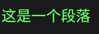

**在以上示例中**：

- 层叠层规则的 `color: red;` 声明不会覆盖未分层规则的 `color: green;` 声明。

### 层叠层顺序

当两个样式声明具有相同的 _`!important`_ 标记和*样式来源*时，应根据*层叠层*和*未分层*判断应该使用哪个声明，前一种覆盖后一种：

- 带有 `!important` 的层叠层
- 带有 `!important` 的未分层
- 未分层
- 层叠层

### 嵌套层

层叠层允许[嵌套](https://developer.mozilla.org/zh-CN/docs/Web/CSS/@layer#嵌套层)，向内层加规则，只需用 `.` 连接这两层。

```css
@layer framework {
  @layer layout {
  }
}

@layer framework.layout {
  p {
    margin-block: 1rem;
  }
}
```

### 匿名层

[**匿名层**](https://developer.mozilla.org/zh-CN/docs/Web/CSS/@layer#匿名层)是并未指定名字的层叠层。除创建后无法向其添加规则外，该层和其他命名层功能一致。

```css
@layer {
  p {
    margin-block: 1rem;
  }
}
```

## 特异度

[**特异度**](https://developer.mozilla.org/zh-CN/docs/Web/CSS/CSS_cascade/Specificity)，即*选择器的优先级*。

[**特异度的计算方法**](https://developer.mozilla.org/zh-CN/docs/Learn_web_development/Core/Styling_basics/Handling_conflicts#优先级_2)：特异度是通过给不同的选择器类型赋予不同的“权重”或“分值”来计算的。

当两个样式声明具有相同的 _`!important`_ 标记和*样式来源*时，根据*特异度*判断应该使用哪个声明。

通常将特异度表示为四个数字的组合（a, b, c, d），高位覆盖地位：

- 内联样式
- ID 选择器
- 类选择器、属性选择器、伪类
- 元素选择器、伪元素

## 源码顺序

**源码顺序**：当两个样式声明具有相同的 _`!important`_ 标记、*样式来源*和*特异度*时，*源码顺序*靠后的声明将覆盖靠前的声明。

```html
<p>这是一个段落</p>
```

```css
p {
  color: green;
}

p {
  color: red;
}
```

> 

**在以上示例中**：

- 后面规则的 `color: red;` 声明覆盖了前面规则的 `color: green;` 声明。

## 继承

[**继承**](https://developer.mozilla.org/zh-CN/docs/Web/CSS/Inheritance)：一些设置在父元素上的 CSS 属性是可以被子元素继承的，有些则不能。

CSS 为控制继承提供了五个特殊的通用属性值。每个 CSS 属性都接收这些值。

- [`inherit`](https://developer.mozilla.org/zh-CN/docs/Web/CSS/inherit)：开启继承
- [`initial`](https://developer.mozilla.org/zh-CN/docs/Web/CSS/initial)：将继承属性值设置为该属性的默认值
- [`revert`](https://developer.mozilla.org/en-US/docs/Web/CSS/revert)：将继承属性值设置为该属性的用户代理样式（即浏览器默认样式）
- [`unset`](https://developer.mozilla.org/zh-CN/docs/Web/CSS/unset)：将继承属性重置为自然值，也就是如果属性是自然继承那么就是 `inherit`，否则和 `initial` 一样
- `all`：重设所有继承属性

```html
<div style="color: red;">
  <!-- 将 <p> 元素的 color 属性设置为默认值，否则应继承父元素 -->
  <p style="color: initial;">颜色变化</p>

  <!-- 将 <p> 元素的所有属性设置为默认值，否则应继承父元素 -->
  <p style="all: initial;">颜色变化</p>
</div>
```

## 其它说明

- 内部样式表和外部样式表属于 HTML 的两种引入方式，属于*样式来源*中的*作者样式*，**不会**对层叠产生影响。

### 规则覆盖

**规则覆盖**：不会覆盖所有声明，只覆盖相同的声明。

```html
<p>这是一个段落</p>
```

```css
p {
  background-color: aqua;
  color: green;
}

p {
  color: red;
}
```

> 

**在以上示例中**：

- 第二条规则的 `color: red;` 声明覆盖了第一条规则的 `color: green;` 声明。
- 第二条规则没有覆盖第一条规则的 `background-color: aqua;` 声明。

# 选择器

## 选择器基础

[**CSS 选择器**](https://developer.mozilla.org/zh-CN/docs/Web/CSS/CSS_selectors)规定了 CSS 规则会被应用到哪些元素上。

**常用选择器**：

<!-- prettier-ignore -->
| [选择器](https://developer.mozilla.org/zh-CN/docs/Web/CSS/CSS_selectors) | 示例 | 示例说明 | css |
| :---: | :---: | :---: | :---: |
| 通用选择器 | `*` | 选择所有元素 | 2 |
| 元素选择器 | `p` | 选择所有 `<p>`元素 | 1 |
| 类选择器 | `.class` | 选择所有 `class="class"` 的元素 | 1 |
| ID选择器 | `#my-id` | 选择所有 `id="my-id"` 的元素 | 1 |
| 属性选择器 | `img[src]` | 选择所有带有 `src` 属性的 `img` 元素 | 2 |
| 伪类选择器 | `a:hover` | 选择仅在鼠标指针悬停在链接上时的 `<a>` 元素 |  |
| ==关系选择器== | | | |
| 选择器列表 | `div,p` | 选择所有 `<div>` 元素和 `<p>` 元素 | 1 |
| 组合选择器 | `p.class#id` | 选择同时具有 `class="class"`、`id="id"` 属性的所有 `<p>` 元素 | 1 |
| 后代选择器（所有后代） | `div p` | 选择 `<div>` 元素内的所有 `<p>` 元素 | 1 |
| 子代选择器（直系后代） | `div > p` | 选择 `<div>` 元素内的直系 `<p>` 元素 | 2 |
| 相邻兄弟选择器 | `div + p` | 选择 `<div>` 元素之后的第一个 `<p>` 元素 | 2 |
| 通用兄弟选择器 | `div ~ p` | 选择 `<div>` 元素之后的所有 `<p>` 元素 | |

## 元素选择器

[**元素选择器**](https://developer.mozilla.org/zh-CN/docs/Web/CSS/Type_selectors)通过**元素名**选择元素；也称*类型选择器*、_标签选择器_。

**语法**：`元素名 {样式声明}`

```html
<p>这是一个段落</p>
```

```css
p {
  color: red;
}
```

## 类选择器

[**类选择器**](https://developer.mozilla.org/zh-CN/docs/Web/CSS/Class_selectors)通过元素的 `class` 属性的内容选择元素。

**语法**：`.类名 {样式声明}`

```html
<p class="test">这是一个段落</p>
```

```css
.test {
  background-color: red;
  color: green;
}
```

## 属性选择器

[**属性选择器**](https://developer.mozilla.org/zh-CN/docs/Learn/CSS/Building_blocks/Selectors/Attribute_selectors)通过**元素名**和**元素属性**选择元素。

> 参考：[属性选择器](https://developer.mozilla.org/zh-CN/docs/Web/CSS/Attribute_selectors)

**语法**：`元素名[元素属性/属性名值对] {样式声明}`

```html
<a href="https://baidu.com" alt="baidu">baidu</a>

<a href="https://example.com">example</a>
```

```css
/* 存在 title 属性的 <a> 元素 */
a[title] {
  color: purple;
}

/* 存在 href 属性并且属性值匹配"https://example.org"的 <a> 元素 */
a[href="https://example.org"]
{
  color: green;
}
```

## ID 选择器

[**ID 选择器**](https://developer.mozilla.org/zh-CN/docs/Web/CSS/ID_selectors)通过**元素 ID**选择元素。

**语法**：`#id值 {样式声明}`

```html
<h1 id="test">这是一个标题</h1>
```

```css
#test {
  color: red;
}
```

## 关系选择器

[**关系选择器**](https://developer.mozilla.org/zh-CN/docs/Learn/CSS/Building_blocks/Selectors/Combinators)通过具有逻辑关系的一个元素，选择另一个元素；又称*组合器*；详见 `选择器基础 | 常用选择器`。

## 选择器列表

[**选择器列表**](https://developer.mozilla.org/zh-CN/docs/Web/CSS/Selector_list)选择满足条件之一的所有元素，即 `或`。

**语法**：多个选择器用 `,` 分隔，`选择器1,选择器2...选择器n {样式声明}`

```html
<p>第一部分</p>
<div>第二部分</div>
```

```css
p,
div {
  color: red;
}
```

> 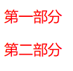

- **注意**：如果选择器列表中任何一个选择器无效 (存在语法错误)，那么整条规则都会被忽略。

## 组合选择器

**组合选择器**：选择同时满足所有条件的元素，即 `与`。

**语法**：多个选择器之间没有空格，`选择器1选择器2...选择器n {样式声明}`

```html
<p class="test" id="one">第一部分</p>
<p class="test" id="two">第一部分</p>
```

```css
.test#one {
  color: red;
}
```

> 

## 伪类

### 语法

[**伪类**](https://developer.mozilla.org/zh-CN/docs/Web/CSS/Pseudo-classes)用来样式化一个元素的特定状态。例如 `:hover` 伪类会在鼠标悬停到一个元素上时选择这个元素。

**语法**：`选择器:伪类名`

```html
<a href="https://example.com" alt="test">test</a>
```

```css
a:hover {
  color: red;
}
```

### `:hover`

[`:hover`](https://developer.mozilla.org/zh-CN/docs/Web/CSS/:hover) 用选择鼠标悬停的元素。

```html
<a href="https://www.google.com/" alt="谷歌主页">谷歌</a>
```

```css
a:hover {
  color: #4183c4;
}
```

### `:nth-child()`

**索引号** [`:nth-child()`](https://developer.mozilla.org/zh-CN/docs/Web/CSS/:nth-child) 用于根据该元素在父元素的子元素列表中的索引来选择元素。


```html
<div>
  <p>这是第一行</p>
  <p>这是第二行</p>
  <p>这是第三行</p>
  <p>这是第四行</p>
  <p>这是第五行</p>
</div>
```

```css
/* 为奇数行设置为灰色背景 */
p:nth-child(odd) {
  background-color: gray;
}
```

### `:root`

[`:root`](https://developer.mozilla.org/zh-CN/docs/Web/CSS/:root) 伪类用于声明 _CSS 变量_（自定义属性）。或者选择 `<html>` 元素。

属性名以前缀 `--` 开始，可以通过 [`var()`](https://developer.mozilla.org/zh-CN/docs/Web/CSS/var) 函数在全文档范围内复用的。

```css
:root {
  --main-color: red;
}

/* 使用变量 */
#container {
  backgroud-color: var(--main-color);
}

/* 修改变量值 */
.body {
  --main-color: green;
}
```

### 其它伪类

- [伪类索引](https://developer.mozilla.org/zh-CN/docs/Web/CSS/Pseudo-classes#%E5%AD%97%E6%AF%8D%E7%B4%A2%E5%BC%95)
- 更多...

## 伪元素

### 语法

[**伪元素**](https://developer.mozilla.org/zh-CN/docs/Web/CSS/Pseudo-elements)用于修改一个*元素的特定部分*的样式。例如 `::first-line` 伪元素会选择这个元素的第一行。

**语法**：`选择器::伪元素名`

**注意**：一个选择器中只能使用一个伪元素。

```html
<p>这是第一行<br />这是第二行</p>
```

```css
p::first-line {
  color: red;
}
```

### `::after`

[`::after`](https://developer.mozilla.org/zh-CN/docs/Web/CSS/::after) 伪元素自动为元素里的文字末尾添加内容

```html
<span>中国联通</span>
```

```css
span {
  font-size: 100px;
  background-color: green;
}
span::after {
  content: "公司";
}
```

- 添加之后页面将展示“中国联通公司”
- 注意 `content` 的属性值要加引号
- 可以加内容，也可加其它 style，详见清除浮动。

### 其它伪元素

- **[伪元素索引](https://developer.mozilla.org/zh-CN/docs/Web/CSS/Pseudo-elements#字母索引)**
- [**`::placeholder`**](https://developer.mozilla.org/zh-CN/docs/Web/CSS/::placeholder)：占位文本
- [**`::first-line`**](https://developer.mozilla.org/zh-CN/docs/Web/CSS/::first-line)：第一行
- 更多...

# 样式

## 大小

### `width`

**宽度** [`width`](https://developer.mozilla.org/zh-CN/docs/Web/CSS/width) 用于设置元素盒模型 `content` 的宽度。

**注意**：

- `width` 默认设置盒模型 `content` 的宽度，详见[盒子尺寸 `box-sizing`](#[盒子尺寸 `box-sizing`](https://developer.mozilla.org/zh-CN/docs/Web/CSS/box-sizing))。
- `width` 属性对于*纯行内元素*无效（如 `` 等**内容类型**为*替换元素*的行内元素不属于*纯行内元素*）。
- `<body>` 元素默认宽度为一整行。

### `height`

**高度** [`height`](https://developer.mozilla.org/zh-CN/docs/Web/CSS/width) 用于设置元素盒模型 `content` 的高度。

**注意**：

- `height` 默认设置盒模型 `content` 的高度，详见[盒子尺寸 `box-sizing`](#[盒子尺寸 `box-sizing`](https://developer.mozilla.org/zh-CN/docs/Web/CSS/box-sizing))。
- `height` 属性对于*纯行内元素*无效（如 `` 等**内容类型**为*替换元素*的行内元素不属于*纯行内元素*）。

## 背景

### `background`

**背景** [`background`](https://developer.mozilla.org/zh-CN/docs/Web/CSS/background) 是一个简写属性，用于设置背景。

```css
body {
  background: #00ff00 url("images/b.jpg") no-repeat fixed center;
}
```

### `background-attachment`

**背景滚动** [`background-attachment`](https://developer.mozilla.org/zh-CN/docs/Web/CSS/background-attachment) 用于设置背景图像的滚动行为。

**属性值**：

- **`fixed`**：相对于视口固定
- **`scroll`**：相对于元素本身固定
- **`local`**：相对于元素的内容固定

### `background-color`

[`background-color`](https://developer.mozilla.org/zh-CN/docs/Web/CSS/background-color) 用于设置元素的背景颜色。

**属性值**：[`<color>`](#[颜色 `color`](https://developer.mozilla.org/zh-CN/docs/Web/CSS/color))

**扩展**：默认情况下，元素的背景是元素的总大小，包括填充和边框（但不包括外边距）

### `background-image`

[`background-image`](https://developer.mozilla.org/zh-CN/docs/Web/CSS/background-image) 属性用于为元素设置背景图像。

**属性值**：

- **`none`**：关键字，表示无背景图像。
- **`<image>`**：标记将要显示的图片

```html
<div>
  <p class="catsandstars">This paragraph is full of cats<br />and stars.</p>
  <p>This paragraph is not.</p>
  <p class="catsandstars">Here are more cats for you.<br />Look at them!</p>
  <p>And no more.</p>
</div>
```

```css
p {
  font-size: 1.5em;
  color: #fe7f88;
  background-image: none;
  background-color: transparent;
}

div {
  background-image: url("mdn_logo_only_color.png");
}

.catsandstars {
  background-image: url("startransparent.gif"), url("catfront.png");
  background-color: transparent;
}
```

**说明**：

- 默认情况下，元素的背景包括内容区域、内边距（padding），以及边框（border），但不包括外边距（margin）
- 默认情况下，背景图像进行平铺重复显示，以覆盖整个元素实体。

### `background-origin`

**背景初始位置** [`background-origin`](https://developer.mozilla.org/zh-CN/docs/Web/CSS/background-origin) 用于设置背景原点位置。

### `background-position`

**背景位置** [`background-position`](https://developer.mozilla.org/zh-CN/docs/Web/CSS/background-position) 用于设置背景图片的初始位置。这个位置是相对于由 `background-origin` 定义的位置图层的。

**属性值**：可用一个或两个 [`<position>`](#[位置 `<position>`](https://developer.mozilla.org/zh-CN/docs/Web/CSS/position_value)) 关键字指定，关键字可选带不带偏移量。

- **关键字**

  - [`<position>`](#[位置 `<position>`](https://developer.mozilla.org/zh-CN/docs/Web/CSS/position_value))

- **偏移量**

  - [`<length>`](#[长度值 `<length>`](https://developer.mozilla.org/zh-CN/docs/Web/CSS/length))
  - [`<percentage>`](#[百分比 `<percentage>`](https://developer.mozilla.org/zh-CN/docs/Web/CSS/percentage))

**说明**

- **一个关键字**：用于指定 `x` 轴坐标，`y` 轴的值默认为 `center`。
- **两个关键字**：用于指定 `x` 和 `y` 轴坐标，用空格分隔。

**图例**：


### `background-repeat`

**背景平铺** [`background-repeat`](https://developer.mozilla.org/zh-CN/docs/Web/CSS/background-repeat) 用于设置如何平铺对象的 `background-image` 属性。

- **属性值**

  - **`repeat-x`**：水平
  - **`repeat-y`**：垂直
  - **`no-repeat`**：不平铺
  - 其它...

- **说明**：默认水平和垂直平铺

### `background-size`

**背景大小** [`background-size`](https://developer.mozilla.org/zh-CN/docs/Web/CSS/background-size) 用于设置背景图片大小。

**属性值**：

- 设定宽度和高度值

  - [长度值 `<length>`](#[长度值 `<length>`](https://developer.mozilla.org/zh-CN/docs/Web/CSS/length))
  - [百分比 `<percentage>`](#[百分比 `<percentage>`](https://developer.mozilla.org/zh-CN/docs/Web/CSS/percentage))

- 关键词 [`cover`](https://developer.mozilla.org/zh-CN/docs/Web/CSS/background-size#cover)
- 关键词 [`contain`](https://developer.mozilla.org/zh-CN/docs/Web/CSS/background-size#contain)

**说明**：当通过宽度和高度值来设定尺寸时，可以提供一或者两个数值

- 如果仅有一个数值被给定，这个数值将作为宽度值大小，高度值将被设定为 `auto`。
- 如果有两个数值被给定，第一个将作为宽度值大小，第二个作为高度值大小。

## 边框

### `border`

**边框** [`border`](https://developer.mozilla.org/zh-CN/docs/Web/CSS/border) 是一个简写属性，用于设置所有边框的一个或多个以下属性的值：

- [`border-width`](https://developer.mozilla.org/zh-CN/docs/Web/CSS/border-width)
- [`border-style`](https://developer.mozilla.org/zh-CN/docs/Web/CSS/border-style)
- [`border-color`](https://developer.mozilla.org/zh-CN/docs/Web/CSS/border-color)

设置一条边框：

- [`border-top`](https://developer.mozilla.org/zh-CN/docs/Web/CSS/border-top)
- [`border-right`](https://developer.mozilla.org/zh-CN/docs/Web/CSS/border-right)
- [`border-bottom`](https://developer.mozilla.org/zh-CN/docs/Web/CSS/border-bottom)
- [`border-left`](https://developer.mozilla.org/zh-CN/docs/Web/CSS/border-left)

### `border-radius`

**边框圆角** [`border-radius`](https://developer.mozilla.org/zh-CN/docs/Web/CSS/border-radius) 是一个简写属性，用于设置所有边框圆角。

- [`border-top-left-radius`](https://developer.mozilla.org/zh-CN/docs/Web/CSS/border-top-left-radius)
- [`border-top-right-radius`](https://developer.mozilla.org/zh-CN/docs/Web/CSS/border-top-right-radius)
- [`border-bottom-right-radius`](https://developer.mozilla.org/en-US/docs/Web/CSS/border-bottom-right-radius)
- [`border-bottom-left-radius`](https://developer.mozilla.org/zh-CN/docs/Web/CSS/border-bottom-left-radius)

**属性值**：当使用一个半径时确定一个圆形，当使用两个半径时确定一个椭圆。

- [长度值 `<length>`](#[长度值 `<length>`](https://developer.mozilla.org/zh-CN/docs/Web/CSS/length))
- [百分比 `<percentage>`](#[百分比 `<percentage>`](https://developer.mozilla.org/zh-CN/docs/Web/CSS/percentage))

**边框圆角示例**：

```css
border-radius: 30px;

border-radius: 25% 10%;
```

## 字体

### `font`

[`font`](https://developer.mozilla.org/zh-CN/docs/Web/CSS/font) 是一个简写属性，用于在一个声明中设置多个字体属性。

```css
font: bolder 50px 微软雅黑, sans-serif;
```

**说明**：

- 可设置的属性是（按顺序）：[`font-style`](#[字体斜体 `font-style`](https://developer.mozilla.org/zh-CN/docs/Web/CSS/font-style))，[`font-variant`](#[字体变体 `font-variant`](https://developer.mozilla.org/zh-CN/docs/Web/CSS/font-variant))，[`font-weight`](#[字体粗细 `font-weight`](https://developer.mozilla.org/zh-CN/docs/Web/CSS/font-weight))，[`font-stretch`](#[字体伸缩 `font-stretch`](https://developer.mozilla.org/zh-CN/docs/Web/CSS/font-stretch))，[`font-size`](#[字体大小 `font-size`](https://developer.mozilla.org/zh-CN/docs/Web/CSS/font-size))，[`line-height`](#[文本行高 `font-height`](https://developer.mozilla.org/zh-CN/docs/Web/CSS/line-height))，和 [`font-family`](<#[字体栈`font-family`](https://developer.mozilla.org/zh-CN/docs/Web/CSS/font-family)>)。
- `font-size` 和 `font-family` 的值是必需的；如果缺少了其他值，默认值将被插入。
- `font-style`、`font-variant` 和 `font-weight` 必须在 `font-size` 之前。
- `font-variant` 只可以使用 CSS 2.1 定义的值，即 `normal` 和 `small-caps`。
- `font-stretch` 必须是单个关键字值
- `line-height` 必须跟在 `font-size` 后面，由 `/` 分隔，例如 `16px/3`。

### `font-family`

**字体栈** [`font-family`](https://developer.mozilla.org/zh-CN/docs/Web/CSS/font-family) 用于设置字体种类。

**默认字体**：

- `serif`：衬线字体
- `sans-serif`：无衬线字体
- `monospace`：等宽字体
- `cursive`：手写字体
- `fantasy`：装饰字体

**说明**：

- 为了防止浏览器不支持第一种字体，应该同时设置几个字体名称作为一种**后备机制**；用 `,` 分隔多个字体。
- 如果字体系列的名称超过一个字，它必须用 `""`，如 `Font Family："宋体"`。
- **安全网页字体**：只有某几个字体通常可以应用到所有系统。

### `font-size`

**字体大小** [`font-size`](https://developer.mozilla.org/zh-CN/docs/Web/CSS/font-size) 用于设置字体大小。

**属性值**：

- **关键字**：`small` 、 `medium` 或 `large` 等
- [**`长度值 <length>`**](#[长度值 `<length>`](https://developer.mozilla.org/zh-CN/docs/Web/CSS/length))：优先使用**相对长度单位**，详见 [`绝对长度单位说明`](#explanation-of-absolute-length-units)
- [**`百分比 <percentage>`**](#[百分比 `<percentage>`](https://developer.mozilla.org/zh-CN/docs/Web/CSS/percentage))

```css
/* 关键字 值 */
font-size: small;
font-size: smaller;

/* <length> 值 */
font-size: 0.8em;

/* <percentage> 值 */
font-size: 80%;
```

### `font-style`

[`font-style`](https://developer.mozilla.org/zh-CN/docs/Web/CSS/font-style) 用于指定字体斜体。

**属性值**：

- 默认： `normal`
- 斜体：`italic`
- 选择倾斜体：`oblique`
- 继承

```css
font-style: normal;
font-style: italic;
font-style: oblique;
font-style: oblique 10deg;

/* Global values */
font-style: inherit;
font-style: initial;
font-style: unset;
```

### `font-variant`

**字体变体** [`font-variant`](https://developer.mozilla.org/zh-CN/docs/Web/CSS/font-variant) 是一个简写属性，用于设置字体的变体形式。

- [`font-variant-caps`](https://developer.mozilla.org/zh-CN/docs/Web/CSS/font-variant-caps)
- [`font-variant-numeric`](https://developer.mozilla.org/zh-CN/docs/Web/CSS/font-variant-numeric)
- [`font-variant-alternates`](https://developer.mozilla.org/zh-CN/docs/Web/CSS/font-variant-alternates)
- [`font-variant-ligatures`](https://developer.mozilla.org/zh-CN/docs/Web/CSS/font-variant-ligatures)
- [`font-variant-east-asian` ](https://developer.mozilla.org/en-US/docs/Web/CSS/font-variant-east-asian)等属性的简写。

**属性值**：

- **`normal`**：默认值，常规显示，没有变体。
- **`small-caps`**：小型大写字母，即所有小写字母都会转换为大写字母，但字体尺寸会比正常大写字母的小。
- [更多...](https://developer.mozilla.org/zh-CN/docs/Web/CSS/font-variant#值)

### `font-weight`

[`font-weight`](https://developer.mozilla.org/zh-CN/docs/Web/CSS/font-weight) 用于设置字体粗细。

**属性值**：

- [**`<number>`**](#[数字 `<number>`](https://developer.mozilla.org/zh-CN/docs/Web/CSS/number))：纯数字
- **`normal`**：默认，与 `400` 等值
- **`bold`**： 与 `700` 等值
- **`bolder`**：基于父元素更粗
- **`lighter`**：基于父元素更细
- **注意**：某些字体只提供 `normal` 和 `bold` 两种值。

```css
/* <number> 值 */
fontsize: 400;

/* 关键字 */
fontsize: bold;
fontsize: bolder;
fontsize: lighter;
```

### `font-stretch`

**字体伸缩** [`font-stretch`](https://developer.mozilla.org/zh-CN/docs/Web/CSS/font-stretch) 用于从字体中选择正常、压缩或扩展的字体外观。

**属性值**：

- [**`<percentage>`**](#[百分比 `<percentage>`](https://developer.mozilla.org/zh-CN/docs/Web/CSS/percentage))：百分比
- `<font-stretch-css3>`：关键字

  - `normal`：默认，普通字体外观。
  - `semi-condensed`、`condensed`、`extra-condensed` 和 `ultra-condensed`：紧凑
  - `semi-expanded`、`expanded`、`extra-expanded` 和 `ultra-expanded`：扩展

### `@font-face`

**Web 字体**：[`@font-face`](https://developer.mozilla.org/zh-CN/docs/Web/CSS/@font-face) at 规则指定在访问时随你的网站一起下载字体文件。

## 文本装饰

### `text-decoration`

**文本装饰** [`text-decoration`](https://developer.mozilla.org/zh-CN/docs/Web/CSS/text-decoration) 是一个简写属性。用于设置文本的修饰。

- [`text-decoration-color`](https://developer.mozilla.org/zh-CN/docs/Web/CSS/text-decoration-color)：颜色
- [`text-decoration-line`](https://developer.mozilla.org/zh-CN/docs/Web/CSS/text-decoration-line)：类型
- [`text-decoration-style`](https://developer.mozilla.org/zh-CN/docs/Web/CSS/text-decoration-style)：样式
- [`text-decoration-thickness`](https://developer.mozilla.org/zh-CN/docs/Web/CSS/text-decoration-thickness)：粗细

```css
/* 全名 */
text-decoration-line: underline;

/* 简写 */
text-decoration: underline;

/* 多个值 */
text-decoration: underline solid red 5px;
```

### `text-transform`

[`text-transform`](https://developer.mozilla.org/zh-CN/docs/Web/CSS/text-transform) 用于控制文本的大小写切换。

**属性值**：

- **`none`**：阻止所有字符的大小写被转换
- **`capitalize`**：每个单词首字母转大写
- **`uppercase`**：所有字母转大写
- **`lowercase`**：所有字母转小写
- 继承

### `text-shadow`

[`text-shadow`](https://developer.mozilla.org/zh-CN/docs/Web/CSS/text-decoration) 用于设置文本阴影。

- 每个阴影值由元素在 X 和 Y 方向的偏移量、模糊半径和颜色值组成。
- 多组阴影值之间用 `,` 隔开。

**属性值**

- **颜色**：[`<color>`](#[颜色 `color`](https://developer.mozilla.org/zh-CN/docs/Web/CSS/color))
- **水平偏移量**：[`<length>`](#[长度值 `<length>`](https://developer.mozilla.org/zh-CN/docs/Web/CSS/length))
- **垂直偏移量**：[`<length>`](#[长度值 `<length>`](https://developer.mozilla.org/zh-CN/docs/Web/CSS/length))
- **模糊半径**：[`<length>`](#[长度值 `<length>`](https://developer.mozilla.org/zh-CN/docs/Web/CSS/length))

```css
/* 单个值 */
text-shadow: 1px 1px 2px black;

/* 多个值 */
text-shadown: 1px 1px 2px black;
text-shadown: 0 0 1em blue;
```

## 链接

> [样式化链接](https://developer.mozilla.org/zh-CN/docs/Learn/CSS/Styling_text/Styling_links)

### 链接状态

- 通过**伪类**获取[链接状态](https://developer.mozilla.org/zh-CN/docs/Learn/CSS/Styling_text/Styling_links#链接状态)。
- **`a:link`**：未访问过的链接
- **`a:visited`**：已访问过的链接
- **`a:hover`**：鼠标悬停的链接
- **`a:active`**：活动（被点击时）的链接
- **`a:focus`**：聚焦的链接（比如通过键盘的 <kbd>Tab</kbd> 移动到这个链接，或者使用像 [`HTMLElement.focus()`](https://developer.mozilla.org/en-US/docs/Web/API/HTMLElement/focus) 这样的方法编程地聚焦链接）。

### 链接样式

[**默认链接样式**](https://developer.mozilla.org/zh-CN/docs/Learn_web_development/Core/Text_styling/Styling_links#默认样式)：

- 链接以下划线表示。
- 未访问链接为蓝色。
- 已访问过的链接为紫色。
- 鼠标悬停的链接，鼠标指针会变成一个小手图标。
- 聚焦链接的周围有一个轮廓。
- 活动的链接为红色。

**链接样式声明**：

- **`text-decoration-line: underline;`**：下划线
- **`color: #0000EE;`**：蓝色
- **`background: #0000EE;`**：蓝色
- **`background: url("external-link-52.png") no-repeat 100% 0;`**：[在链接上加图标](https://developer.mozilla.org/zh-CN/docs/Learn/CSS/Styling_text/Styling_links#%E5%9C%A8%E9%93%BE%E6%8E%A5%E4%B8%AD%E5%8C%85%E5%90%AB%E5%9B%BE%E6%A0%87)
- **`cursor: auto;`**：光标
- **`outline`**：轮廓
- **`a[href^="http"]`**：虚拟链接（真正指向任何地方）
- 其它...

[**样式化链接为按钮**](https://developer.mozilla.org/zh-CN/docs/Learn/CSS/Styling_text/Styling_links#样式化链接为按钮)：


```html
<nav class="container">
  <a href="#">主页</a>
  <a href="#">披萨</a>
  <a href="#">音乐</a>
  <a href="#">袋熊</a>
  <a href="#">芬兰</a>
</nav>
```

```css
body,
html {
  margin: 0;
  font-family: sans-serif;
}

.container {
  display: flex;
  gap: 0.625%;
}

a {
  flex: 1;
  text-decoration: none;
  outline-color: transparent;
  text-align: center;
  line-height: 3;
  color: black;
}

a:link,
a:visited,
a:focus {
  background: palegoldenrod;
  color: black;
}

a:hover {
  background: orange;
}

a:active {
  background: darkred;
  color: white;
}
```

## 列表

> [为列表添加样式](https://developer.mozilla.org/zh-CN/docs/Learn/CSS/Styling_text/Styling_lists)

### `list-style`

[`list-style`](https://developer.mozilla.org/zh-CN/docs/Web/CSS/list-style) 是一个简写属性，用于在一个声明中设置多个列表属性。

- [`list-style-type`](https://developer.mozilla.org/zh-CN/docs/Web/CSS/list-style-type)：标记类型
- [`list-style-image`](https://developer.mozilla.org/zh-CN/docs/Web/CSS/list-style-image)：
- [`list-style-position`](https://developer.mozilla.org/zh-CN/docs/Web/CSS/list-style-position)：

**扩展**：默认情况下列表 `<ul>` 或 `<ol>` 还设置了内边距和外边距，可使用 `margin: 0` 和 `padding: 0` 来移除。

### `list-style-image`

**图像标记** [`list-style-image`](https://developer.mozilla.org/zh-CN/docs/Web/CSS/list-style-image) 用于使用图像来替换列表项的标记。

**属性值**：

- `URL`：用来作为标记的图片的地址。格式：`url("URL")`
- `none`：关键字， `list-style-type` 中定义的值会被取代。
- 继承

```html
<ul>
  <li>Item 1</li>
  <li>Item 2</li>
</ul>
```

```css
ul {
  list-style-image: url("starsolid.gif");
}
```

### `list-style-position`

**标记位置** [`list-style-position`](https://developer.mozilla.org/zh-CN/docs/Web/CSS/list-style-position) 用于指定标记框在主体块框中的位置。

**属性值**：

- **`outside`**：默认，标记盒在主块盒的外面。
- **`inside`**：标记盒是主要块盒中的第一个行内盒，处于元素的内容流之后。
- 继承

```html
<ul class="one">
  List 1
  <li>List Item 1-1</li>
  <li>List Item 1-2</li>
  <li>List Item 1-3</li>
  <li>List Item 1-4</li>
</ul>
<ul class="two">
  List 2
  <li>List Item 2-1</li>
  <li>List Item 2-2</li>
  <li>List Item 2-3</li>
  <li>List Item 2-4</li>
</ul>
<ul class="three">
  List 3
  <li>List Item 3-1</li>
  <li>List Item 3-2</li>
  <li>List Item 3-3</li>
  <li>List Item 3-4</li>
</ul>
```

```css
.one {
  list-style: square inside;
}

.two {
  list-style-position: outside;
  list-style-type: circle;
}

.three {
  list-style-image: url("starsolid.gif");
  list-style-position: inherit;
}
```


### `list-style-type`

**标记类型** [`list-style-type`](https://developer.mozilla.org/zh-CN/docs/Web/CSS/list-style-type) 用于设置列表元素的 marker（比如圆点、符号、或者自定义计数器样式）。

```html
<ol class="normal">
  List 1
  <li>Hello</li>
  <li>World</li>
  <li>What's up?</li>
</ol>

<ol class="shortcut">
  List 2
  <li>Looks</li>
  <li>Like</li>
  <li>The</li>
  <li>Same</li>
</ol>
```

```css
ol.normal {
  list-style-type: upper-alpha;
}

/* or use the shortcut "list-style": */
ol.shortcut {
  list-style: upper-alpha;
}
```

## 表格

> [样式化表格](https://developer.mozilla.org/zh-CN/docs/Learn_web_development/Core/Styling_basics/Tables)

此小节如无特殊说明，都使用如下表格：

```html
<table>
  <tr>
    <th>表头1</th>
    <th>表头2</th>
  </tr>
  <tr>
    <td>数据</td>
    <td>数据</td>
  </tr>
  <tr>
    <td>数据</td>
    <td>数据</td>
  </tr>
</table>
```

```css
table {
  border-collapse: collapse;
}

th,
td {
  border: 1px solid black;
}
```

### `border-collapse`

**边框折叠** [`border-collapse`](https://developer.mozilla.org/zh-CN/docs/Web/CSS/border-collapse) 用于设置*表格*与*单元格*的边框是分开的还是合并的。

由于 `<table>` 和 `<th>` / `<td>` 都有边框，所以默认情况下，边框看起来有双层，这个时候需要把 `<table>` 的边框进行折叠，之后所有针对表格边框的样式化，都在 `<th>` 和 `<td>` 中设置。

<div style="display: flex; justify-content: left; gap: 10px">
  <figure>
    
    <figcaption style="font-size: 16px; color: gray">边框未折叠</figcaption>
  </figure>
  <figure>
    
    <figcaption style="font-size: 16px; color: gray">边框折叠</figcaption>
  </figure>
</div>

```css
table {
  border-collapse: collapse;
}

th,
td {
  border: 1px solid black;
}
```

### 其它属性

- 颜色

  - [`border-color`](#`border-color`)
  - [`background-color`](#`background-color`)
  - [`color`](#`color`)

- 尺寸

  - [`width`](#`width`)
  - [`height`](#`height`)
  - [`line-height`](#`line-height`)

- 对齐

  - [`text-align`](#`text-align`)
  - [`vertial-align`](#`vertial-align`)：需直接作用于 `<th>` 和 `<td>` 元素

- [`:nth-child()`](<#`:nth-child()`>)：可设置斑马纹

    

- [`:hover`](#`:hover`)：可设置鼠标悬停变色

## 表单

> [样式化表单](https://developer.mozilla.org/zh-CN/docs/Learn_web_development/Extensions/Forms#表单样式指南)

## `color`

**前景色** [`color`](https://developer.mozilla.org/zh-CN/docs/Web/CSS/color) 属性设置元素的文本以及文本装饰的*前景色*颜色值，属性值为 [`<color>`](https://developer.mozilla.org/zh-CN/docs/Web/CSS/color_value)。

## `outline`

**轮廓线** [`outline`](https://developer.mozilla.org/zh-CN/docs/Web/CSS/outline) 是一个简写属性，用于绘制元素周围的轮廓线，可起到突出元素的作用。

- [`outline-style`](https://developer.mozilla.org/zh-CN/docs/Web/CSS/outline-style)
- [`outline-width`](https://developer.mozilla.org/zh-CN/docs/Web/CSS/outline-width)
- [`outline-color`](https://developer.mozilla.org/zh-CN/docs/Web/CSS/outline-color)

```css
.example {
  outline: #00ff00 dotted 10px;
}
```

**注意**：`outline` 位于 `border` 的外围，不占据空间，可与外边距重合。

# 布局

[**布局**](https://developer.mozilla.org/zh-CN/docs/Learn_web_development/Core/CSS_layout)就是将网页内容从无序的堆叠状态，组织成设计稿要求的，有结构、有层次的视觉排列。

## 文本布局

> [文本布局](https://developer.mozilla.org/zh-CN/docs/Learn_web_development/Core/Text_styling/Fundamentals#文本布局)

### `text-align`

[`text-align`](https://developer.mozilla.org/zh-CN/docs/Web/CSS/text-align) 属性用于设置 _块元素_ 或者 _单元格框_ 的**行内内容的水平对齐**。

**属性值**：

- `left`：左对齐
- `right`：右对齐
- `center`：居中对齐
- `justify`：两端对齐（对最后一行无效）
- `justify-all`：两端对齐（对最后一行有效）
- 继承
- 其它...

### `text-indent`

[`text-indent`](https://developer.mozilla.org/zh-CN/docs/Web/CSS/text-indent) 属性用于设置区块元素中文本行前面缩进的长度。

**属性值**：

- [**`<length>`**](#[长度值 `<length>`](https://developer.mozilla.org/zh-CN/docs/Web/CSS/length))：长度值
- [**`<percentage>`**](#[百分比 `<percentage>`](https://developer.mozilla.org/zh-CN/docs/Web/CSS/percentage))：百分比，基于区块宽度
- 继承
- 其它...

### `letter-spacing`

[`letter-spacing`](https://developer.mozilla.org/zh-CN/docs/Web/CSS/letter-spacing) 属性用于设置字母间距。

**属性值**：

- **`normal`**：默认，关键字
- [**`<length>`**](#[长度值 `<length>`](https://developer.mozilla.org/zh-CN/docs/Web/CSS/length))：长度值，正值变大，负值变小。
- [**`<percentage>`**](#[百分比 `<percentage>`](https://developer.mozilla.org/zh-CN/docs/Web/CSS/percentage))：百分比
- 继承

```css
/* Keyword value */
letter-spacing: normal;

/* <length> values */
letter-spacing: 0.3em;
letter-spacing: 3px;
letter-spacing: -0.05em;
```

### `line-height`

[`line-height`](https://developer.mozilla.org/zh-CN/docs/Web/CSS/line-height) 属性用于设置行高。

- 对于块级元素，它指定元素行盒（line boxes）的最小高度。对于非替代的 inline 元素，它用于计算行盒（line box）的高度。

**属性值**：

- **`normal`**：关键字，约为 `1.2`
- [**`<number>`**](#[数字 `<number>`](https://developer.mozilla.org/zh-CN/docs/Web/CSS/number))：数字，**推荐此种值**，不会在继承时产生不确定的结果。
- [**`<length>`**](#[长度值 `<length>`](https://developer.mozilla.org/zh-CN/docs/Web/CSS/length))：长度值，以 `em` 为单位的值可能会产生不确定的结果。
- [**`<percentage>`**](#[百分比 `<percentage>`](https://developer.mozilla.org/zh-CN/docs/Web/CSS/percentage))：百分比，基于当前字体尺寸的百分比；可能会带来不确定的结果。

**扩展**：

- 使用 `line-height` 属性可设置文本基于容器垂直居中。

### `word-spacing`

[`word-spacing`](https://developer.mozilla.org/zh-CN/docs/Web/CSS/word-spacing) 属性用于设置单词、标签间距。

**属性值**：

- **`normal`**：默认，关键字
- [**`<length>`**](#[长度值 `<length>`](https://developer.mozilla.org/zh-CN/docs/Web/CSS/length))：长度值，正值变大，负值变小。
- 继承

```css
/* Keyword value */
letter-spacing: normal;

/* <length> values */
letter-spacing: 0.3em;
letter-spacing: 3px;
letter-spacing: -0.05em;
```

### `vertial-align`

[`vertial-align`](https://developer.mozilla.org/zh-CN/docs/Web/CSS/vertical-align) 属性用于指定行内（inline）、行内区块（inline-block）、表格单元格（table-cell）盒子的垂直对齐方式。

#### 属性值

- **关键字：基于父元素**

  - `text-top`：顶部对齐
  - `text-bottom`：底部对齐
  - `middle`：中部对齐
  - 其它...

- [**`<length>`**](#[长度值 `<length>`](https://developer.mozilla.org/zh-CN/docs/Web/CSS/length))：长度值，基于父元素基线，可以是负值。
- [**`<percentage>`**](#[百分比 `<percentage>`](https://developer.mozilla.org/zh-CN/docs/Web/CSS/percentage))：百分比，基于父元素基线，可以是负值；该百分比是 `line-height` 属性的百分比。
- **相对行的值**

  - **`top`**：使元素及其后代元素的顶部与整行的顶部对齐。
  - **`bottom`**：使元素及其后代元素的底部与整行的底部对齐。
  - 没有基线的元素，使用外边距的下边缘替代。

- **表格单元格的值**

  - **`top`**：使单元格内边距的上边缘与该行顶部对齐。
  - **`middle`**：使单元格内边距盒模型在该行内居中对齐。
  - **`bottom`**：使单元格内边距的下边缘与该行底部对齐。
  - 其它...
  - 可以是负数。

#### 文本垂直对齐扩展

**使用 `line-height` 属性**：

```CSS
.container {
  height: 100px; /* 容器高度 */
  line-height: 100px; /* 行高等于容器高度 */
}
```

```html
<div class="container">
  <div>这个元素内容将会基于容器垂直对齐。</div>
</div>
```

**使用 `padding` 属性**：

```css
.container {
  padding: 10px 0; /* 容器上下内边距相等 */
  border: 3px solid green;
}
```

```html
<div class="container">
  <div>这个元素内容将会基于容器垂直对齐。</div>
</div>
```

## 盒模型

### 概述

[**盒模型**](https://developer.mozilla.org/zh-CN/docs/Learn_web_development/Core/Styling_basics/Box_model)：HTML 元素可以看作盒子，它包括：外边距 `margin`、边框 `border`、内边距 `padding` 和内容 `content`


不同部分的说明：

- **Margin**：外边距是最外层的盒。
- **Border**：边框是围绕在内边距和外边距之间的盒。
- **Padding**：内边距是围绕在边框和内容之间的盒。
- **Content**：盒子的内容，显示文本和图像。

### 显示类型

盒模型有两个方面的**显示类型**，由 `display` 属性控制：

- **外部显示类型**：决定**元素自身**如何参与**父容器的流式布局**，即 `<display-outside>`，详见 `display` 属性。
- **内部显示类型**：决定**元素内部**的**子元素**使用哪种布局模型进行排列，即 `<display-inside>`，详见 `display` 属性。

### [`margin`](https://developer.mozilla.org/zh-CN/docs/Web/CSS/margin)

`margin` 是一个 CSS 简写属性，用于定义元素 `border` 以外的空间。

- [`margin-top`](https://developer.mozilla.org/zh-CN/docs/Web/CSS/margin-top)
- [`margin-right`](https://developer.mozilla.org/zh-CN/docs/Web/CSS/margin-right)
- [`margin-bottom`](https://developer.mozilla.org/zh-CN/docs/Web/CSS/margin-bottom)
- [`margin-left`](https://developer.mozilla.org/zh-CN/docs/Web/CSS/margin-left)

```css
<div class="center">此元素会被居中显示</div>
<div class="outside">此元素会被显示在包含块之外</div>
```

```css
.center {
  background-color: lime;
  width: 66%;
  margin: auto;
}

.outside {
  background-color: cyan;
  width: 66%;
  margin: 3rem 0 0 -3rem;
}
```

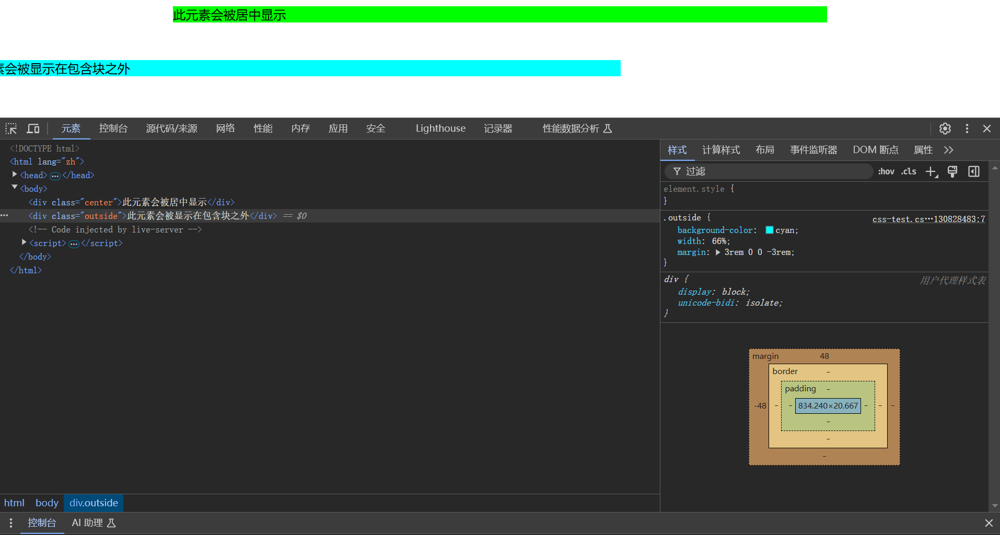

**属性值**：

- [长度值 `<length>`](#[长度值 `<length>`](https://developer.mozilla.org/zh-CN/docs/Web/CSS/length))：可以使用负值，重叠的内容
- [百分比 `<percentage>`](#[百分比 `<percentage>`](https://developer.mozilla.org/zh-CN/docs/Web/CSS/percentage))：基于包含块
- `auto`

**说明**

- `margin` 属性适用 [**四值语法**](#四值语法)
- 上、下外边距的设置对**不可替换**行内元素无效。
- `margin` 没有背景色，完全透明。

**扩展**：可以利用 `margin: auto` 使元素基于其父元素水平居中

**外边距折叠**：两个外边距相接的元素，这些外边距将合并为一个外边距。

- 两个正外边距将合并为一个外边距。其大小等于最大的单个外边距。
- 两个负外边距会折叠，并使用最小（离零最远）的值。
- 如果其中一个外边距为负值，其值将从总值中*减去*。

### `padding`

[`padding`](https://developer.mozilla.org/zh-CN/docs/Web/CSS/padding) 是一个简写属性，用于定义元素 `border` 与 `content` 之间的空间。

- [`padding-top`](https://developer.mozilla.org/zh-CN/docs/Web/CSS/padding-top)
- [`padding-right`](https://developer.mozilla.org/zh-CN/docs/Web/CSS/padding-right)
- [`padding-bottom`](https://developer.mozilla.org/zh-CN/docs/Web/CSS/padding-bottom)
- [`padding-left`](https://developer.mozilla.org/zh-CN/docs/Web/CSS/padding-left)

```html
<h3>此元素的上下内边距为 70px</h3>
<h4>此元素的上下内边距为 50px</h4>
```

```css
h3 {
  background-color: cyan;
  padding: 110px 50px 110px 50px;
}

h4 {
  background-color: lime;
  padding: 20px 50px;
}
```

> 

**属性值**：

- [长度值 `<length>`](#[长度值 `<length>`](https://developer.mozilla.org/zh-CN/docs/Web/CSS/length))：必须是非负值
- [百分比 `<percentage>`](#[百分比 `<percentage>`](https://developer.mozilla.org/zh-CN/docs/Web/CSS/percentage))：基于包含块
- `auto`

**说明**：

- `padding` 属性适用**四值语法**
- `padding` 本身没有背景颜色，完全透明，但有背景色时，会受到背景色影响

### `box-sizing`

[`box-sizing`](https://developer.mozilla.org/zh-CN/docs/Web/CSS/box-sizing) 属性，即**替代盒模型**，定义了应该如何计算一个元素的总宽度和总高度。


**属性值**：

- `content-box`：默认值，`width` = `content` 宽度，`height` 同理。
- `border-box`：`width` = `border` + `padding` + `content` 宽度，`height` 同理。

## `display`

[`display`](https://developer.mozilla.org/zh-CN/docs/Web/CSS/display) 属性用于设置元素是否被视为*块级或行级盒子*以及用于*子元素*的布局，例如流式布局、网格布局或弹性布局。

### 语法

`display` 属性有六种取值类型：

- [`<display-outside>`](https://developer.mozilla.org/zh-CN/docs/Web/CSS/display-outside)

  - [`block`](https://drafts.csswg.org/css-display/#valdef-display-block)：以块的形式显示，通常新起一行，默认宽度会占据父元素的 100%。将这种元素称为**块级元素**。
  - [`inline`](https://drafts.csswg.org/css-display/#valdef-display-inline)：在同一行上显示，不会新起一行，只占据它所包含内容的宽度。将这种元素称为**行内元素**。
  - `run-in`
  - `inline` 和 `block` 在非流式布局中，会失去它们原有的特性，统一变成其它布局特性。

- [`<display-inside>`](https://developer.mozilla.org/en-US/docs/Web/CSS/display-inside)

  - [`flow`](https://developer.mozilla.org/zh-CN/docs/Web/CSS/display#flow)：正常文档流
  - [`flex`](https://drafts.csswg.org/css-display/#valdef-display-flex)：详见[弹性布局](#弹性布局)
  - [`grid`](https://drafts.csswg.org/css-display/#valdef-display-grid)：详见[网格布局](#网格布局)
  - [`flow-root`](https://drafts.csswg.org/css-display/#valdef-display-flow-root)：消除 `float` 的 `flow`
  - [`table`](https://drafts.csswg.org/css-display/#valdef-display-table)：遵循表格结构规则
  - 更多...

- [`<display-box>`](https://developer.mozilla.org/zh-CN/docs/Web/CSS/display-box)

  - [**`none`**](https://developer.mozilla.org/zh-CN/docs/Web/CSS/display#none)：可以隐藏元素，且隐藏的元素不会占用任何空间，即不再影响页面布局。
  - [**`contents`**](https://developer.mozilla.org/zh-CN/docs/Web/CSS/display#contents)：可以隐藏除 `content` 以外的所有盒属性，并且外部表现为 `inline`。

- [`<display-listitem>`](https://developer.mozilla.org/zh-CN/docs/Web/CSS/display-listitem)
- [`<display-internal>`](https://developer.mozilla.org/zh-CN/docs/Web/CSS/display-internal)
- [`<display-legacy>`](https://developer.mozilla.org/zh-CN/docs/Web/CSS/display-legacy)

### 多值语法

CSS 新规范中，`display` 属性被拆解成两个主要部分：`display: <display-outside>  <display-inside>;`。

这意味着一个 `display` 值可以由**一个外部关键字**和**一个内部关键字**组成（用空格分隔），或者是一个**复合值**（旧语法）。常用复合值和多值的对应关系为：

<!-- prettier-ignore -->
| [复合值](https://drafts.csswg.org/css-display/#inner-display-type) | 多值 |
| :---: | :---: |
| `none` | — |
| `contents` | — |
| `block` | `block flow` |
| `inline` | `inline flow` |
| `inline-block` | `inline flow-root` |
| `flex` | `block flex` |
| `grid` | `block grid` |
| 更多 | ... |

### `inline`

### `block`

### `inline-block`

[`inline-block`](https://drafts.csswg.org/css-display/#valdef-display-inline-block) 表现为同行显示并可修改宽高内外边距等属性。

## 流式布局

[**流式布局**](https://developer.mozilla.org/zh-CN/docs/Learn/CSS/CSS_layout/Normal_Flow#正常布局流)是指在不对页面进行任何布局控制时，浏览器默认的 HTML 布局方式（即元素在 `<body>` 元素内的布局方式）。

### 块级元素和行内元素的区别

<!-- prettier-ignore -->
|  | 块级元素 | 行内元素 |
| :---: | :---: | :---: |
| 显示方式 | 以块的形式显示，独占一行。 | 在同一行上显示，只占据内容的宽度。 |
| 宽度 | 默认情况下宽度是父元素的100%。 | 宽度仅占据它所包含内容的宽度。<br />*纯行内元素*不可设置宽度。 |
| 高度 | 高度由内容和内边距决定，可以设置。 | 由所包含内容的高度决定。<br />*纯行内元素*不可设置宽度。 |
| 边距 | 全部可以设置。 | 不可以设置上下边距。 |
| 可包含元素 | 可以包含块级元素和行内元素。 | 只能包含行内元素和部分其他行内元素。 |

### `inline`、`block`、`inline-block` 和 `none` 示例

```html
<div class="container">
  <span class="inline">inline</span>
  <span class="inline">inline</span>
  <div class="block">block</div>
  <div class="block">block</div>
  <div class="inline-block">inline-block</div>
  <div class="inline-block">
    inline-block
    <div class="block block2">block</div>
    <div class="block block2">block</div>
  </div>
  <div class="none">none</div>
</div>
```

```css
.container {
  border: 2px black solid;
  width: 500px;
  height: 250px;
}

.inline {
  background-color: purple;
}

.block {
  background-color: purple;
  margin-top: 10px;
}

.inline-block {
  display: inline-block;
  background-color: purple;
  margin-top: 10px;
}

.block2 {
  background-color: green;
}

.none {
  display: none;
}
```


### 鼠标悬停显示示例

```html
<div class="trigger-element">Hover me</div>
<div class="hidden-element">I appear on hover!</div>
```

```css
.hidden-element {
  display: none;
}

.trigger-element:hover + .hidden-element {
  display: block;
}
```

## 弹性布局

### 概念

[**两根轴线**](https://developer.mozilla.org/zh-CN/docs/Web/CSS/CSS_flexible_box_layout/Basic_concepts_of_flexbox#flexbox_的两根轴线)（类似于 x 轴和 y 轴）：

- 主轴：元素沿着主轴排列
- 交叉轴：垂直于主轴

[**起始线和终止线**](https://developer.mozilla.org/zh-CN/docs/Web/CSS/CSS_flexible_box_layout/Basic_concepts_of_flexbox#起始线和终止线)：


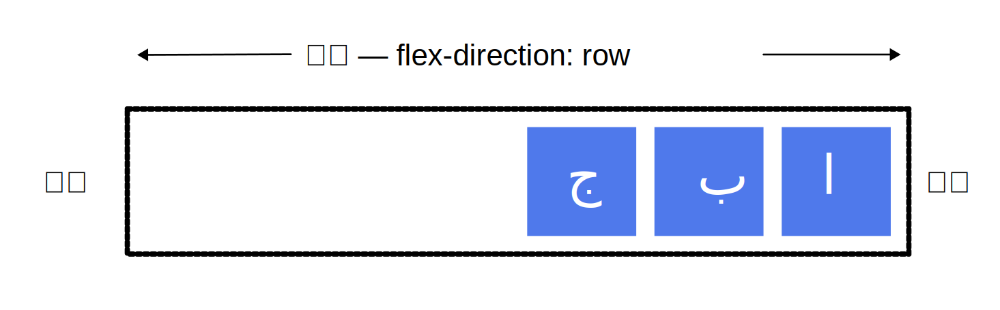

### 语法

[**弹性布局**](https://developer.mozilla.org/zh-CN/docs/Web/CSS/CSS_flexible_box_layout/Basic_concepts_of_flexbox)是一种一维布局模型，用于将**元素本身**设为*弹性容器*，**子元素**显示为*弹性元素*。

- 外部表现：不影响，仍是流式布局。
- 内部表现：内部子元素统一变为弹性元素。
- 弹性元素：元素失去流式布局的特性，统一按照弹性规则进行排列。

**语法**：`display: flex;`

```html
<div class="parent">
  <div class="child">1-block</div>
  <div class="child">2-block</div>
  <div class="child">3-block</div>
</div>
```

```css
.container {
  width: 500px;
  height: 200px;
  border: 2px black solid;
  display: flex;
  flex-direction: column;
  justify-content: center;
  align-items: center;
}

.item-1,
.item-2,
.item-3 {
  width: 100px;
  height: 50px;
  border: 1px black solid;
  background-color: purple;
  font-size: 20px;
  text-align: center;
}
```

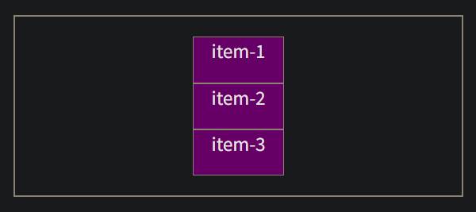

**在以上示例中**：

- `display: flex;`：设置布局方式为弹性布局
- `flex-direction`：设置弹性容器的主轴方向
- `justify-content`：设置弹性元素在主轴上的对齐方式
- `align-items`：设置弹性元素在交叉轴的对齐方式

### `align-items`

[`align-items`](https://developer.mozilla.org/zh-CN/docs/Web/CSS/align-items) 属性用于设置子元素的轴向对齐方式：

- 在 Flex 布局中，沿着交叉轴；
- 在 Grid 布局中，沿着块向轴。

**属性值**：

- **[`start`](https://developer.mozilla.org/zh-CN/docs/Web/CSS/align-items#start)**：

  

- **[`end`](https://developer.mozilla.org/zh-CN/docs/Web/CSS/align-items#end)**：

  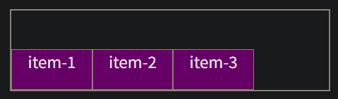

- **[`center`](https://developer.mozilla.org/zh-CN/docs/Web/CSS/align-items#center)**：

  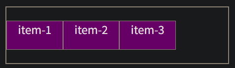

- [更多...](https://developer.mozilla.org/zh-CN/docs/Web/CSS/align-items#取值)

**示例**：

```html
<div class="parent">
  <div class="child">1-block</div>
  <div class="child">2-block</div>
  <div class="child">3-block</div>
</div>
```

```css
.container {
  width: 400px;
  height: 100px;
  border: 2px black solid;
  display: flex;
  align-items: center;
}

.item-1,
.item-2,
.item-3 {
  width: 100px;
  height: 50px;
  border: 1px black solid;
  background-color: purple;
  font-size: 20px;
  text-align: center;
}
```

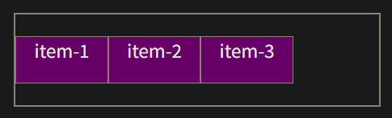

**在以上示例中**：

- `display: flex;`：设置布局方式为弹性布局
- `align-items`：设置弹性元素在交叉轴的对齐方式

### `flex`

> [Flex 属性的简写](https://developer.mozilla.org/zh-CN/docs/Web/CSS/CSS_flexible_box_layout/Basic_concepts_of_flexbox#flex_属性的简写)

[`flex`](https://developer.mozilla.org/zh-CN/docs/Web/CSS/flex) 是弹性容器中**弹性元素**的*简写属性*，用于设置弹性元素如何增大或缩小以适应其弹性容器中可用的空间。

- `flex-grow`：增长系数，详见 [`flex-grow`](#`flex-grow`)
- `flex-shrink`：收缩系数，详见 [`flex-shrink`](#`flex-shrink`)
- `flex-basis`：初始大小，详见 [`flex-basis`](#`flex-basis`)

**属性值**：多值语法。

### `flex-basis`

> [Flex 元素属性：`flex-basis`](https://developer.mozilla.org/zh-CN/docs/Web/CSS/CSS_flexible_box_layout/Basic_concepts_of_flexbox#flex_元素属性：flex-basis)

**初始大小** [`flex-basis`](https://developer.mozilla.org/zh-CN/docs/Web/CSS/flex-basis) 是弹性容器中**弹性元素**的属性，用于设置弹性元素在主轴方向上的初始大小。

- 如果不使用 `box-sizing` 改变盒模型的话，那么这个属性就决定了 flex 元素的内容盒（content-box）的尺寸。
- 如果不设置弹性元素在交叉轴方向上的尺寸，则在该方向上会填满父级元素。

**属性值**：

- `auto`：默认值，基于元素的内容自动调整大小。
- `<'width'>`

```html
<div class="container">
  <div class="item-1">item-1</div>
  <div class="item-2">item-2</div>
  <div class="item-3">item-3</div>
</div>
```

```css
.container {
  width: 400px;
  height: 100px;
  border: 2px black solid;
  display: flex;
}

.item-1,
.item-2,
.item-3 {
  flex-basis: 100px;
  height: 50px;
  border: 1px black solid;
  background-color: purple;
  font-size: 20px;
  text-align: center;
}
```

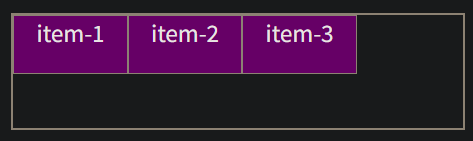

**在以上示例中**：

- `display: flex;`：设置布局方式为弹性布局
- `flex-basis`：设置弹性元素在主轴方向上的初始大小

### `flex-direction`

[`flex-direction`](https://developer.mozilla.org/zh-CN/docs/Web/CSS/flex-direction) 用于设置**弹性容器**的主轴方向。


```html
<div class="container">
  <div class="item-1">item-1</div>
  <div class="item-2">item-2</div>
  <div class="item-3">item-3</div>
</div>
```

```css
.container {
  width: 400px;
  height: 200px;
  border: 2px black solid;
  display: flex;
  flex-direction: column;
}

.item-1,
.item-2,
.item-3 {
  width: 100px;
  height: 50px;
  border: 1px black solid;
  background-color: purple;
  font-size: 20px;
  text-align: center;
}
```

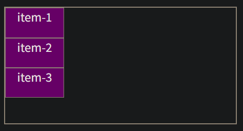

**在以上示例中**：

- `display: flex;`：设置布局方式为弹性布局
- `flex-direction: column;`：设置主轴方向为 `column`

### `flex-grow`

> [Flex 元素属性：`flex-grow`](https://developer.mozilla.org/zh-CN/docs/Web/CSS/CSS_flexible_box_layout/Basic_concepts_of_flexbox#flex_元素属性：flex-grow)

**增长系数** [`flex-grow`](https://developer.mozilla.org/zh-CN/docs/Web/CSS/flex-grow) 是弹性容器中**弹性元素**的属性，弹性元素会以 `flex-basis` 为基础，以 `flex-grow` 为系数（并非占几份），沿主轴方向增长尺寸。只有在弹性元素的 `flex-basis` 总和在主轴内才会生效。

**语法**：`flex-grow: <number>`

```html
<div class="container">
  <div class="left">左侧</div>
  <div class="right">右侧</div>
</div>
```

```css
.container {
  width: 500px;
  height: 100px;
  border: 2px black solid;
  display: flex;
}

.left {
  background-color: red;
  flex-basis: 100px;
  flex-grow: 2;
  height: 50px;
  text-align: center;
}

.right {
  background-color: aqua;
  flex-basis: 100px;
  flex-grow: 1;
  height: 50px;
  text-align: center;
}
```

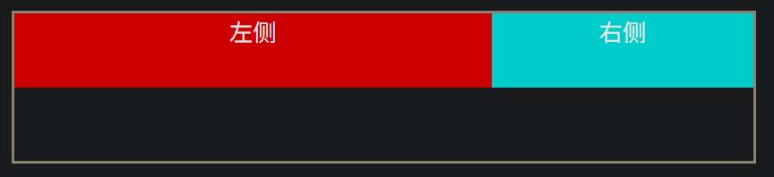

**在以上示例中**：

- `display: flex;`：设置布局方式为弹性布局
- `flex-basis`：设置在主轴方向的初始大小

  - 如果未设置 `flex-basis`，则默认为 `auto`，由于左右两个元素的内容都是两个字，默认宽度相等，所以二者在主轴方向的初始大小是其内容的默认宽度，也相等。如果改变其中一个元素内容的字数，则二者就不是以 `2:1` 的比例增长了。

- `flex-grow`：设置弹性元素在主轴方向上的增长系数

### `flex-shrink`

> [Flex 元素属性：`flex-shrink`](https://developer.mozilla.org/zh-CN/docs/Web/CSS/CSS_flexible_box_layout/Basic_concepts_of_flexbox#flex_元素属性：flex-shrink)

**收缩系数** [`flex-shrink`](https://developer.mozilla.org/zh-CN/docs/Web/CSS/flex-shrink) 是弹性容器中**弹性元素**的属性，弹性元素会以 `flex-basis` 为基础，以 `flex-shrink` 为系数（并非占几份），沿主轴方向收缩尺寸。只有在弹性元素的 `flex-basis` 总和超出主轴才会生效。

```html
<div class="container">
  <div class="left">左侧</div>
  <div class="right">右侧</div>
</div>
```

```css
.container {
  width: 500px;
  height: 100px;
  border: 2px black solid;
  display: flex;
}

.left {
  background-color: red;
  flex-basis: 400px;
  flex-shrink: 2;
  height: 50px;
  text-align: center;
}

.right {
  background-color: aqua;
  flex-basis: 400px;
  flex-shrink: 1;
  height: 50px;
  text-align: center;
}
```

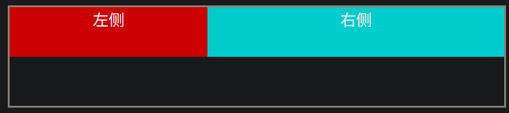

**在以上示例中**：

- `display: flex;`：设置布局方式为弹性布局
- `flex-basis`：设置在主轴方向的初始大小

  - 如果未设置 `flex-basis`，则默认为 `auto`，由于左右两个元素的内容都是两个字，默认宽度相等，所以二者在主轴方向的初始大小是其内容的默认宽度，也相等。如果改变其中一个元素内容的字数，则二者就不是以 `2:1` 的比例收缩了。

- `flex-shrink`：设置弹性元素在主轴方向上的收缩系数

### `justify-content`

[`justify-content`](https://developer.mozilla.org/zh-CN/docs/Web/CSS/justify-content) 属性用于设置子元素的轴向对齐方式，以及分配轴向剩余空间：

- 在 Flex 布局中，沿着主轴；
- 在 Grid 布局中，沿着行向轴。

**属性值**：

- **[`start`](https://developer.mozilla.org/zh-CN/docs/Web/CSS/justify-content#start)**：从轴首排列

  

- **[`end`](https://developer.mozilla.org/zh-CN/docs/Web/CSS/justify-content#end)**：从轴尾排列

  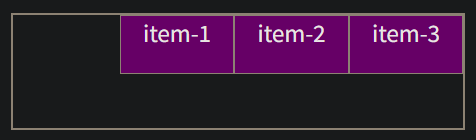

- **[`center`](https://developer.mozilla.org/zh-CN/docs/Web/CSS/justify-content#center)**：以主轴中心点为中心排列

  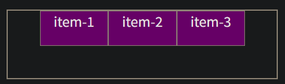

- **[`space-between`](https://developer.mozilla.org/zh-CN/docs/Web/CSS/justify-content#space-between)**：所有**子元素之间**空间相等，第一个子元素在行首，最后一个在行尾。

  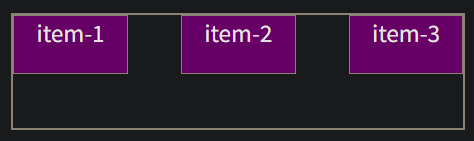

- **[`space-around`](https://developer.mozilla.org/zh-CN/docs/Web/CSS/justify-content#space-around)**：所有**子元素两侧**空间相等

  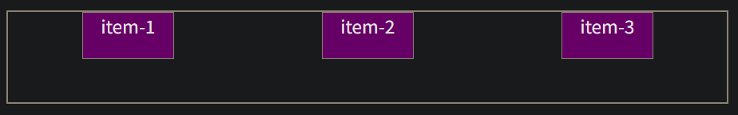

- **[`space-evenly`](https://developer.mozilla.org/zh-CN/docs/Web/CSS/justify-content#space-evenly)**：剩余所有空间都相等

  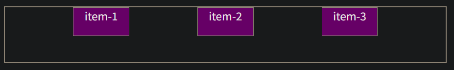

- [更多...](https://developer.mozilla.org/zh-CN/docs/Web/CSS/justify-content#值)

**示例**：

```html
<div class="container">
  <div class="item-1">item-1</div>
  <div class="item-2">item-2</div>
  <div class="item-3">item-3</div>
</div>
```

```css
.container {
  width: 400px;
  height: 100px;
  border: 2px black solid;
  display: flex;
  justify-content: center;
}

.item-1,
.item-2,
.item-3 {
  width: 100px;
  height: 50px;
  border: 1px black solid;
  background-color: purple;
  font-size: 20px;
  text-align: center;
}
```

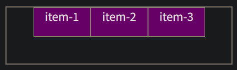

**在以上示例中**：

- `display: flex;`：设置布局方式为弹性布局
- `justify-content`：设置弹性元素在主轴方向上的对齐方式

## 网格布局

### 概念

[**网格容器**](https://developer.mozilla.org/zh-CN/docs/Web/CSS/CSS_grid_layout/Basic_concepts_of_grid_layout#网格容器)：使用 `display：grid` 创建的容器。

[**网格线**](https://developer.mozilla.org/zh-CN/docs/Web/CSS/CSS_grid_layout/Basic_concepts_of_grid_layout#网格线)：网格轨道两侧的线。

[**网格轨道**](https://developer.mozilla.org/zh-CN/docs/Web/CSS/CSS_grid_layout/Basic_concepts_of_grid_layout#网格轨道)：网格容器上任意两条网格线之间的空间。

[**网格单元**](https://developer.mozilla.org/zh-CN/docs/Web/CSS/CSS_grid_layout/Basic_concepts_of_grid_layout#网单元)：网格项中最小的单位，类似于单元格。

[**网格区域**](https://developer.mozilla.org/zh-CN/docs/Web/CSS/CSS_grid_layout/Basic_concepts_of_grid_layout#网区域)：多个网格单元形成的区域，类似于合并单元格。

### 语法

[**网格布局**](https://developer.mozilla.org/zh-CN/docs/Web/CSS/CSS_grid_layout/Basic_concepts_of_grid_layout)是一种二维布局模型，用于将元素本身设为*网格容器*，子元素显示为*网格项*。

- 外部表现：不影响，仍是流式布局。
- 内部表现：内部子元素统一变为网格项。
- 网格项：元素失去流式布局的特性，统一按照网格规则进行排列。

**语法**：`display:grid;`

```html
<div class="container">
  <div class="item-1">item-1</div>
  <div class="item-2">item-2</div>
  <div class="item-3">item-3</div>
  <div class="item-4">item-4</div>
  <div class="item-5">item-5</div>
</div>
```

```css
.container {
  display: grid;
  grid-template-columns: repeat(3, 1fr);
  grid-auto-rows: 100px;
}

.item-1,
.item-2,
.item-3,
.item-4,
.item-5 {
  background-color: purple;
  text-align: center;
  font-size: 30px;
}
```

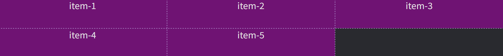

**在以上示例中**：

- `display: grid;`：设置布局方式为网格布局
- `grid-template-columns`：设置列轨道的数量和大小
- `grid-auto-rows: 100px;`：设置隐式创建的行轨道大小

### `grid-auto-rows`

[`grid-auto-rows`](https://developer.mozilla.org/zh-CN/docs/Web/CSS/grid-auto-rows) 用于指定隐式创建的行轨道大小。

> [隐式和显式网格](https://developer.mozilla.org/zh-CN/docs/Web/CSS/CSS_grid_layout/Basic_concepts_of_grid_layout#隐式和显式网格)

```html
<div class="container">
  <div class="item-1">item-1</div>
  <div class="item-2">item-2</div>
  <div class="item-3">item-3</div>
  <div class="item-4">item-4</div>
  <div class="item-5">item-5</div>
</div>
```

```css
.container {
  display: grid;
  grid-auto-rows: 100px;
}

.item-1,
.item-2,
.item-3,
.item-4,
.item-5 {
  background-color: purple;
  text-align: center;
  font-size: 30px;
}
```


**在以上示例中**：

- `display: grid;`：设置布局方式为网格布局。
- `grid-auto-rows: 100px;`：设置隐式创建的行轨道大小为 100px。

### `grid-template-columns`

#### 语法

**网格列** [`grid-template-columns`](https://developer.mozilla.org/zh-CN/docs/Web/CSS/grid-template-columns) 属性是基于网格列的维度，去定义网格线的名称和列轨道的尺寸大小，几个值就有几列。

```html
<div class="container">
  <div class="item-1">item-1</div>
  <div class="item-2">item-2</div>
  <div class="item-3">item-3</div>
  <div class="item-4">item-4</div>
  <div class="item-5">item-5</div>
</div>
```

```css
.container {
  display: grid;
  grid-template-columns: repeat(3, 1fr);
}

.item-1,
.item-2,
.item-3,
.item-4,
.item-5 {
  background-color: purple;
  text-align: center;
  font-size: 30px;
}
```

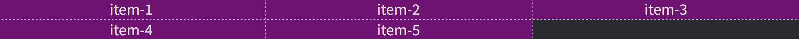

**在以上示例中**：

- `display: grid;`：设置布局方式为网格布局
- `grid-template-columns`：设置列轨道的数量和大小。

  - 此例中的 `200px` 是一个绝对大小。
  - 绝对大小、`fr`、`repeat()`  可混合写。

#### fr 单位

[`fr` 单位](https://developer.mozilla.org/zh-CN/docs/Web/CSS/CSS_grid_layout/Basic_concepts_of_grid_layout#fr_单位)代表列轨道占网格容器剩余空间的份额。

```html
<div class="container">
  <div class="item-1">item-1</div>
  <div class="item-2">item-2</div>
  <div class="item-3">item-3</div>
  <div class="item-4">item-4</div>
  <div class="item-5">item-5</div>
</div>
```

```css
.container {
  display: grid;
  grid-template-columns: 1fr 1fr 1fr;
}

.item-1,
.item-2,
.item-3,
.item-4,
.item-5 {
  background-color: purple;
  text-align: center;
  font-size: 30px;
}
```

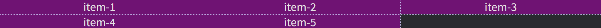

**在以上示例中**：

- `display: grid;`：设置布局方式为网格布局
- `grid-template-columns`：定义网格列的大小，`fr` 是一个相对大小。

#### `repeat()`

[`repeat()`](https://developer.mozilla.org/zh-CN/docs/Web/CSS/repeat) 函数用于设置轨道列表的重复片段。

```html
<div class="container">
  <div class="item-1">item-1</div>
  <div class="item-2">item-2</div>
  <div class="item-3">item-3</div>
  <div class="item-4">item-4</div>
  <div class="item-5">item-5</div>
</div>
```

```css
.container {
  display: grid;
  grid-template-columns: repeat(3, 1fr);
  /* grid-auto-rows: 100px; */
}

.item-1,
.item-2,
.item-3,
.item-4,
.item-5 {
  background-color: purple;
  text-align: center;
  font-size: 30px;
}
```

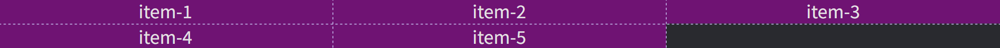

**在以上示例中**：

- `display: grid;`：设置布局方式为网格布局
- `grid-template-columns`：设置列轨道的数量和大小，`repeat(3, 1fr)` 表示重复 3 个 `fr`。

### `grid-column`

[`grid-column`](https://developer.mozilla.org/en-US/docs/Web/CSS/grid-column) 是网格项的简写属性，用于设置网格项的列起始和终止网格线编号，以形成*网格区域*。

- [`grid-column-start`](https://developer.mozilla.org/en-US/docs/Web/CSS/grid-column-start)：网格项的列起始网格线编号，详见 [`grid-column-start`](#`grid-column-start`)。
- [`grid-column-end`](https://developer.mozilla.org/en-US/docs/Web/CSS/grid-column-end)：网格项的列终止网格线编号，用法同 [`grid-column-start`](#`grid-column-start`)。

```html
<div class="container">
  <div class="item-1">item-1</div>
  <div class="item-2">item-2</div>
  <div class="item-3">item-3</div>
  <div class="item-4">item-4</div>
  <div class="item-5">item-5</div>
</div>
```

```css
.container {
  display: grid;
  grid-template-columns: repeat(3, 1fr);
}

.item-1,
.item-2,
.item-3,
.item-4,
.item-5 {
  background-color: purple;
  text-align: center;
  font-size: 30px;
}

.item-1 {
  background-color: orangered;
  grid-column: 1 / 4;
  grid-row: 1 / 3;
}

.item-2 {
  background-color: blue;
  grid-column: 1 / 2;
  grid-row: 3 / 5;
}
```

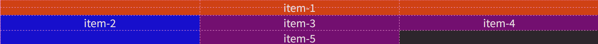

**在以上示例中**：

- `display: grid;`：设置布局方式为网格布局
- `grid-template-columns`：设置列轨道的数量和大小
- `grid-column`：设置网格项的列起始和终止网格线编号，两个值用 `/` 分隔。

### `grid-column-start`

[`grid-column-start`](https://developer.mozilla.org/en-US/docs/Web/CSS/grid-column-start) 是网格项的属性，用于设置网格项的列起始网格线编号。

> [跨轨道放置网格项目](https://developer.mozilla.org/zh-CN/docs/Web/CSS/CSS_grid_layout/Basic_concepts_of_grid_layout#跨轨道放置网格项目)

#### 网格线编号

> [网格线](https://developer.mozilla.org/zh-CN/docs/Web/CSS/CSS_grid_layout/Basic_concepts_of_grid_layout#网格线)

网格布局会为我们创建编号的网格线来让我们来定位每一个网格元素。例如下面这个三列两行的网格中，就拥有四条纵向的网格线。

网格线的编号顺序取决于文章的书写模式。在从左至右书写的语言中，编号为 1 的网格线位于最左边。在从右至左书写的语言中，编号为 1 的网格线位于最右边。

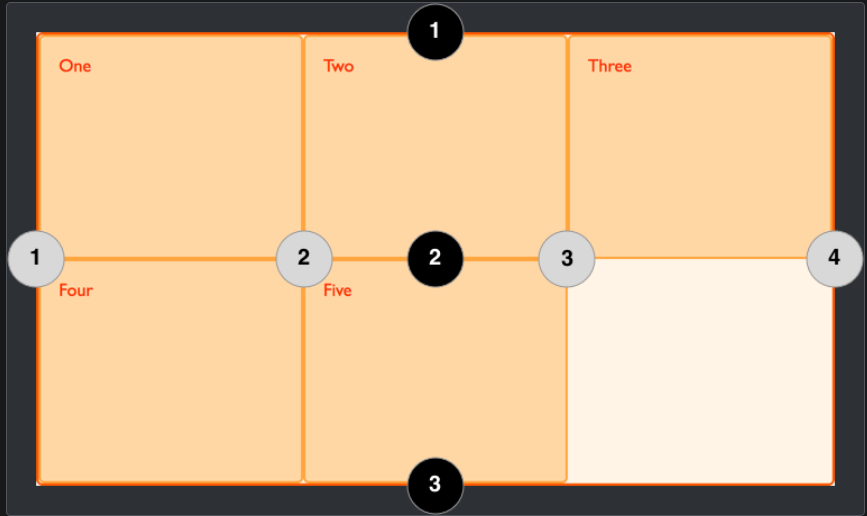

#### 语法

```html
<div class="container">
  <div class="item-1">item-1</div>
  <div class="item-2">item-2</div>
  <div class="item-3">item-3</div>
  <div class="item-4">item-4</div>
  <div class="item-5">item-5</div>
</div>
```

```css
.container {
  display: grid;
  grid-template-columns: repeat(3, 1fr);
}

.item-1,
.item-2,
.item-3,
.item-4,
.item-5 {
  background-color: purple;
  text-align: center;
  font-size: 30px;
}

.item-1 {
  background-color: orangered;
  grid-column-start: 1;
  grid-column-end: 4;
  grid-row-start: 1;
  grid-row-end: 3;
}

.item-2 {
  background-color: blue;
  grid-column-start: 1;
  grid-column-end: 2;
  grid-row-start: 3;
  grid-row-end: 5;
}
```

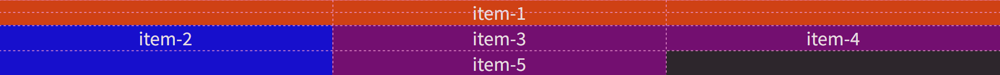

**在以上示例中**：

- `display: grid;`：设置布局方式为网格布局
- `grid-template-columns`：设置列轨道的数量和大小，`repeat(3, 1fr)` 表示重复 3 个 `fr`。
- `grid-column-start`：设置网格项的列起始网格线编号
- `grid-column-end`：设置网格项的列终止网格线编号
- `grid-row-start`：设置网格项的行起始网格线编号
- `grid-row-end`：设置网格项的行终止网格线编号

### `justify-items`

[`justify-items`](https://developer.mozilla.org/zh-CN/docs/Web/CSS/justify-items) 属性为所有盒中的**项目**定义了默认的 [`justify-self`](https://developer.mozilla.org/zh-CN/docs/Web/CSS/justify-self) ，可以使这些项目以默认方式沿适当轴线对齐到每个盒子。

### `place-items`

[`place-items`](https://developer.mozilla.org/zh-CN/docs/Web/CSS/place-items) 是一个简写属性，用于在*网格布局*中同时设置子元素沿着两个轴向对齐。

- `align-items`：沿着块向轴
- `justify-items`

```html
<div class="parent">
  <div class="child">1-block</div>
  <div class="child">2-block</div>
  <div class="child">3-block</div>
</div>
```

```css
.container {
  height: 300px;
  border: 2px black solid;
  display: grid;
  place-items: center;
}

.item-1,
.item-2,
.item-3,
.item-4,
.item-5 {
  background-color: purple;
  text-align: center;
  font-size: 30px;
}
```

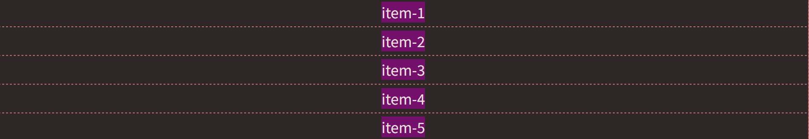

**在以上示例中**：

- `display: grid;`：设置布局方式为网格布局
- `place-items: center;`：同时设置 `align-items: center;` 和 `justify-items: center;`

### 网格布局嵌套

```html
<div class="container">
  <div class="item-1">
    <div class="item-1-1">item-1-1</div>
    <div class="item-1-2">item-1-2</div>
    <div class="item-1-3">item-1-3</div>
  </div>
  <div class="item-2">item-2</div>
  <div class="item-3">item-3</div>
  <div class="item-4">item-4</div>
  <div class="item-5">item-5</div>
</div>
```

```css
.container {
  display: grid;
  grid-template-columns: repeat(3, 1fr);
}

.item-1,
.item-2,
.item-3,
.item-4,
.item-5 {
  background-color: purple;
  text-align: center;
  font-size: 30px;
}

.item-1 {
  background-color: orangered;
  grid-column: 1 / 4;
  grid-row: 1 / 3;
}

.item-2 {
  background-color: blue;
  grid-column: 1 / 2;
  grid-row: 3 / 5;
}

.item-1 {
  display: grid;
  grid-template-columns: repeat(3, 1fr);
}

.item-1-1,
.item-1-2,
.item-1-3 {
  text-align: center;
  font-size: 30px;
}

.item-1-1 {
  background-color: black;
  grid-column: 1 / 2;
  grid-row: 1 / 4;
}

.item-1-2 {
  background-color: blue;
}

.item-1-3 {
  background-color: brown;
}
```

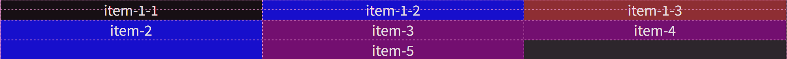

**在以上示例中**：

- 通过 `display: grid;` 将 `item-1` 网格项再设为网格布局。
- 网格项 `item-1`  内部的三个子元素都变为它的网格项。

### 其它属性

- [`align-items`](https://developer.mozilla.org/zh-CN/docs/Web/CSS/align-items)：设置子元素沿着块向轴的对齐方式，详见 [`align-items`](#`align-items`)。
- [`justify-content`](https://developer.mozilla.org/zh-CN/docs/Web/CSS/justify-content)：设置子元素沿着行向轴的对齐方式，详见 [`justify-content`](#`justify-content`)。
- [`z-index`](https://developer.mozilla.org/zh-CN/docs/Web/CSS/z-index)：当不同网格项占据同一网格单元时，解决覆盖顺序，详见 [`z-index`](#`z-index`)。
- 更多...

## 多列布局

[**多列布局**](https://developer.mozilla.org/zh-CN/docs/Web/CSS/CSS_multicol_layout/Basic_concepts)用于将内容布置到一组列框中。

## 浮动

### `float`

[`float`](https://developer.mozilla.org/zh-CN/docs/Web/CSS/float) 属性用于指定元素是否应该浮动，以及向哪个方向移动。

**浮动效果**：

- 当一个元素浮动之后，它会被移出正常的文档流，然后向左或者向右平移，一直平移到所处的容器内容区边界，或者碰到另外一个浮动的元素。
- 浮动元素之后的其它元素将围绕它，之前的其它元素不受影响。
- 块级元素浮动之后不再独占一行

**属性值**：

- [`none`](https://developer.mozilla.org/zh-CN/docs/Web/CSS/float#none)：默认值，不浮动
- [`left`](https://developer.mozilla.org/zh-CN/docs/Web/CSS/float#left)
- [`right`](https://developer.mozilla.org/zh-CN/docs/Web/CSS/float#right)
- [`inline-start`](https://developer.mozilla.org/zh-CN/docs/Web/CSS/float#inline-start)：所在块容器的开始一侧
- [`inline-end`](https://developer.mozilla.org/zh-CN/docs/Web/CSS/float#inline-end)：所在块容器的结束一侧

```html
<div class="test-block">Test Block</div>
<div class="normal-block">Normal Block</div>
<div class="surround">
  <p>这段文字将围绕 Normal Block.</p>
  <p>这段文字将围绕 Normal Block.</p>
  <p>这段文字将围绕 Normal Block.</p>
  <p>这段文字将围绕 Normal Block.</p>
</div>
```

```css
.test-block {
  width: 150px;
  height: 150px;
  background-color: red;
  top: 20px;
  left: 20px;
}

.normal-block {
  width: 150px;
  height: 150px;
  background-color: green;
  top: 20px;
  left: 20px;
  /* 设置为向右侧浮动 */
  float: right;
}
```


### `clear`

[`clear`](https://developer.mozilla.org/zh-CN/docs/Web/CSS/clear) 属性用于清除 `float` 对其它元素的影响，设置在受浮动影响的其它元素内。

- [`none`](https://developer.mozilla.org/zh-CN/docs/Web/CSS/clear#none)
- [`left`](https://developer.mozilla.org/zh-CN/docs/Web/CSS/clear#left)
- [`right`](https://developer.mozilla.org/zh-CN/docs/Web/CSS/clear#right)
- [`both`](https://developer.mozilla.org/zh-CN/docs/Web/CSS/clear#both)
- [`inline-start`](https://developer.mozilla.org/zh-CN/docs/Web/CSS/clear#inline-start)
- [`inline-end`](https://developer.mozilla.org/zh-CN/docs/Web/CSS/clear#inline-end)


```html
<div class="test-block">Test Block</div>
<div class="normal-block">Normal Block</div>
<div class="surround">
  <p>这段文字将围绕 Normal Block.</p>
  <p>这段文字将围绕 Normal Block.</p>
  <p>这段文字将围绕 Normal Block.</p>
  <p>这段文字将围绕 Normal Block.</p>
</div>
```

```css
.test-block {
  width: 150px;
  height: 150px;
  background-color: red;
  top: 20px;
  left: 20px;
}

.normal-block {
  width: 150px;
  height: 150px;
  background-color: green;
  top: 20px;
  left: 20px;
  float: right;
}

.surround {
  /* 清除浮动 */
  clear: right;
}
```

## `overfloaw`

**溢出** [`overfloaw`](https://developer.mozilla.org/zh-CN/docs/Web/CSS/overflow) 用于控制内容溢出*指定高度*的元素框时显示的方式。

**属性值**:

- `visible`：默认值，如果有溢出内容，会呈现在元素框之外。
- `hidden`：溢出内容不可见，但**可以**以编程的方式滚动。
- `clip`：溢出内容不可见，但**不可以**以编程的方式滚动。
- `scroll`：无论是否溢出，浏览器**总是**显示滚动条，所有内容通过滚动条查看。
- `auto`：如果有溢出内容，浏览器显示滚动条，所有内容通过滚动条查看，否则正常显示。

```html
<p>
  Sed ut perspiciatis unde omnis iste natus error sit voluptatem accusantium
  doloremque laudantium.
</p>
```

```css
p {
  width: 8em;
  height: 5em;
  border: solid;
  overflow: auto;
}
```

## `position`

### 语法

**定位** [`position`](https://developer.mozilla.org/zh-CN/docs/Web/CSS/position) 属性指定了元素的定位类型。再由方位属性（如 `top`）指定元素的偏移量。

**属性值**：

- `static`：默认值
- `relative`：相对定位
- `absolute`：绝对定位
- `fixed`：固定定位
- `sticky`：粘性定位

```css
.example {
  /* 指定位置类型 */
  position: fixed;

  /* 指定偏移量 */
  right: 20px;
  bottom: 20px;
}
```

### `static`

[`static`](https://developer.mozilla.org/zh-CN/docs/Web/CSS/position#static) 关键字作为 `position` 的属性值。

- 是 `position` 属性的默认值。
- 元素遵循正常文档流。
- 方位属性（如 `top`）无效。

### `relative`

**相对定位** [`relative`](https://developer.mozilla.org/zh-CN/docs/Web/CSS/position#relative) 关键字作为 `position` 的属性值。

- 元素**不会**被移出正常文档流。
- 基于*自身*指定元素偏移量，偏移值**不会**影响其他元素的位置。
- 绝对定位的元素**可以**设置外边距，且不会与其他边距合并。


```html
<div class="test-block">Test Block</div>
<div class="normal-block">Normal Block</div>
```

```css
.test-block {
  width: 150px;
  height: 150px;
  background-color: red;
  position: relative;
  top: 20px;
  left: 20px;
}

.normal-block {
  width: 150px;
  height: 150px;
  background-color: green;
  top: 20px;
  left: 20px;
}
```

### `absolute`

**绝对定位** [`absolute`](https://developer.mozilla.org/zh-CN/docs/Web/CSS/position#absolute) 关键字作为 `position` 的属性值。

- 元素**会**被移出正常文档流，**不**为元素预留空间。
- 基于*最近的祖先（如果有）或初始[包含块](https://developer.mozilla.org/zh-CN/docs/Web/CSS/CSS_display/Containing_block#确定包含块)*指定元素偏移量，偏移值**不会**影响其他元素的位置。
- 绝对定位的元素可以设置外边距（margins），且不会与其他边距合并。


```html
<div class="test-block">Test Block</div>
<div class="normal-block">Normal Block</div>
```

```css
.test-block {
  width: 150px;
  height: 150px;
  background-color: red;
  position: absolute;
  top: 20px;
  left: 20px;
}

.normal-block {
  width: 150px;
  height: 150px;
  background-color: green;
  top: 20px;
  left: 20px;
}
```

### `fixed`

**固定定位** [`fixed`](https://developer.mozilla.org/zh-CN/docs/Web/CSS/position#fixed) 关键字作为 `position` 的属性值。

- 元素**会**被移出正常文档流，**不**为元素预留空间。
- 基于*屏幕视口*指定元素偏移量，偏移值**不会**影响其他元素的位置。
- 元素的位置在屏幕滚动时不会改变。


```html
<div class="test-block">Test Block</div>
<div class="normal-block">Normal Block</div>
```

```css
.test-block {
  width: 150px;
  height: 150px;
  background-color: red;
  position: relative;
  top: 20px;
  left: 20px;
}

.normal-block {
  width: 150px;
  height: 150px;
  background-color: green;
  top: 20px;
  left: 20px;
}
```

### `sticky`

**粘性定位** [`sticky`](https://developer.mozilla.org/zh-CN/docs/Web/CSS/position#sticky) 关键字作为 `position` 的属性值。

- `sticky` 是 `relative` 和 `absolute` 的混合。
- 视口滚动到偏移量之前为 `relative`。
- 视口滚动到偏移量之后为 `absolute`，元素将一直固定在该偏移量位置。


```html
<p>占位行</p>
<p>占位行</p>
<p>占位行</p>
<p>占位行</p>
<p>占位行</p>
<div class="test-block">Test Block</div>
<div class="normal-block">Normal Block</div>
<p>占位行</p>
<p>占位行</p>
<p>占位行</p>
<p>占位行</p>
<p>占位行</p>
<p>占位行</p>
<p>占位行</p>
<p>占位行</p>
<p>占位行</p>
<p>占位行</p>
```

```css
.test-block {
  width: 150px;
  height: 150px;
  background-color: red;
  position: sticky;
  top: 20px;
  left: 20px;
}

.normal-block {
  width: 150px;
  height: 150px;
  background-color: green;
  top: 20px;
  left: 20px;
}
```

### `position` 相关

- [`z-index`](https://developer.mozilla.org/zh-CN/docs/Web/CSS/z-index)：覆盖顺序，详见 [`z-index`](#`z-index`)。

# 变化

# 总结

## 元素对齐

- **元素水平和垂直对齐**

  1. 使用 `display:flex`

     ```html
     <div class="container">
       <p class="content">这个元素将会基于容器水平垂直居中。</p>
     </div>
     ```

     ```css
     .container {
       display: flex;
       justify-content: center; /* 子元素水平居中 */
       align-items: center; /* 子元素垂直居中 */
     }
     ```

  2. 使用 `display:grid`

     ```html
     <div class="container">
       <p class="content">这个元素将会基于容器水平垂直居中。</p>
     </div>
     ```

     ```css
     .container {
       display: grid;
       place-items: center; /* 子元素水平和垂直居中 */
     }
     ```

- **元素垂直居中**

  - 使用 `position` 和 `transform`

    ```html
    <div class="container">
      <p class="content">这个元素将会基于容器水平垂直居中。</p>
    </div>
    ```

    ```css
    .container {
      border: 3px solid green;
      height: 100px;
      position: relative; /* 父元素是相对定位 */
    }
    .content {
      margin: 0;
      background-color: pink;
      position: absolute; /* 子元素是绝对定位 */
      top: 50%;
      left: 50%;
      /* -ms-transform: translate(-50%, -50%); */
      transform: translate(-50%, -50%);
    }
    ```

- **元素水平对齐**

  - 利用 `margin`，元素必须有宽度，元素必须是块级或显示为块级

    ```css
    /* 水平靠左 */
    .example {
      width: 60%;
      margin-right: auto;
    }

    /* 水平居中 */
    .example {
      width: 60%;
      margin: auto;
    }

    /* 水平靠左 */
    .example {
      width: 60%;
      margin-left: auto;
    }

    /* 行内元素显示为块级并居中 */
    .example {
      width: 60%;
      margin: auto;
      display: block;
    }
    ```

## 元素隐藏

有三种方式隐藏元素，它们之间各有区别：

- `display: none;`：可以隐藏某个元素，且隐藏的元素不会占用任何空间，即不再影响页面布局。
- `visibility: hidden;`：可以隐藏某个元素，但隐藏的元素仍需占用与未隐藏之前一样的空间，即仍会影响布局。
- `opacity: 0;`：

# 其它

## CSS 调试

> [CSS 调试](https://developer.mozilla.org/zh-CN/docs/Learn_web_development/Core/Styling_basics/Debugging_CSS)

## 技巧汇总

- **光标样式**：`cursor: pointer;`
- **颜色过渡**：`transition: background-color 0.3s;`

## 内容不靠边

- 网页中，内容和屏幕边缘往往都有一定距离，而不是紧贴屏幕边缘
- 这可以通过设置 `<body>` 的 `padding` 实现

# 案例留存

## 小米商城顶部


```html
<!--贯穿整行整体-->
<div class="line">
  <!--居中整体-->
  <div class="container">
    <!--左侧浮动整体-->
    <div class="left">
      <a target="_blank" href="https://www.mi.com/" class="menu">小米官网</a>
      <a target="_blank" href="https://www.mi.com/" class="menu">小米商城</a>
      <a target="_blank" href="https://www.mi.com/" class="menu">MIUI</a>
      <a target="_blank" href="https://www.mi.com/" class="menu">loT</a>
      <a target="_blank" href="https://www.mi.com/" class="menu">云服务</a>
      <a target="_blank" href="https://www.mi.com/" class="menu">天星科技</a>
      <a target="_blank" href="https://www.mi.com/" class="menu">有品</a>
      <a target="_blank" href="https://www.mi.com/" class="menu">小爱平台</a>
      <a target="_blank" href="https://www.mi.com/" class="menu">资源证照</a>
      <a target="_blank" href="https://www.mi.com/" class="menu">协议规则</a>

      <!--悬停展示二维码-->
      <a
        target="_blank"
        href="https://www.mi.com/"
        class="menu"
        style="position: relative"
        >下载app
        <div class="download">
          
        </div>
      </a>
    </div>

    <!--右侧浮动整体-->
    <div class="right">
      <a target="_blank" href="https://www.mi.com/" class="menu">登录</a>
      <a target="_blank" href="https://www.mi.com/" class="menu">注册</a>
    </div>
  </div>
</div>
```

```css
.line {
  height: 40px;
  line-height: 40px;
  background-color: #333;
}

.container {
  margin: auto;
  width: 1226px;
}

.left {
  float: left;
}

.right {
  float: right;
}

.menu {
  color: #b0b0b0;
  font-size: 12px;
  margin-right: 20px;
  text-decoration: none;
}

.menu:hover {
  color: white;
}

.download {
  width: 100px;
  position: absolute;
  left: -29px;
  display: None;
}

.download img {
  width: 100%;
}

/*注意是menu:hover，悬停在menu上，而不是download上*/
.menu:hover .download {
  display: block;
}
```
