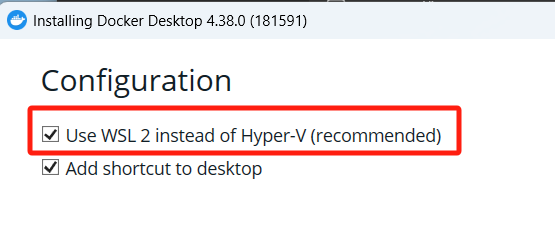
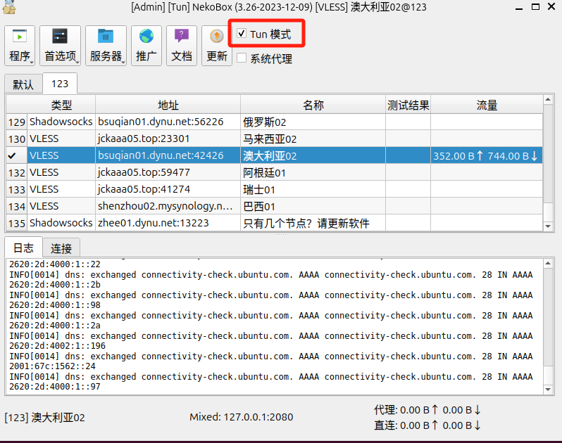

# Docker

Docker 是一个开源的平台，用于开发、交付和运行应用程序。它使用容器技术，通过将应用程序及其依赖项打包到一个容器中，提供了轻量级、可移植和自包含的环境。

## 环境搭建

### Windows 环境

- [官网下载 Docker Desktop 安装包](https://www.docker.com/products/docker-desktop/) 并安装。

- **WSL**：

  - Docker Desktop 安装过程中会引导安装 WSL 2，然后重启。

    

  - 重启以后会自动弹出命令行窗口，安装 WSL 2。

  - 如果安装过程没有引导安装 WSL 2，可参考 `Windows` > `WSL`

- **Linux**

  - Microsoft Store 安装 Ubuntu。
  - 运行 Ubuntu 直到正常使用。

- 运行 Docker Desktop。

- 验证安装。

  ```bash
  docker -v
  ```

- 接下来可以在终端中操作 Docker。

### Linux 环境

#### 包管理器安装

- 直接使用包管理器 apt 进行安装

  ```bash
  sudo apt install docker.io -y
  ```

- 以下是安装之后的初始配置
- 查看安装版本

  ```bash
  docker -v
  ```

- 将当前用户加入到 Docker 组，详见 `Linux > usermod`

  ```bash
  sudo usermod -aG docker jerry
  ```

- 退出当前终端并注销重新登录，使用户组生效。

- 禁用开机启动；Docker 默认随系统一起开机启动，为节省资源，在学习时应禁用开机启动

  ```bash
  sudo systemctl disable docker
  sudo systemctl disable docker.socket
  ```

- 查看 Docker 服务状态；安装完成后，Docker 服务会自动启动，否则可以手动启动。

  ```bash
  # 查看 Docker 服务状态
  sudo systemctl status docker

  # 手动启动
  sudo systemctl start docker
  ```

- 代理选择 `Tun 模式`

    

- 验证安装；如果以下容器能正常运行返回，说明安装正确。

  ```bash
  sudo docker run hello-world
  ```

- 登录

  ```bash
  docker login
  ```

#### 官方脚本安装

- curl 工具已安装
- 下载 Docker 安装脚本并执行脚本

  ```bash
  curl -fsSL https://get.docker.com -o get-docker.sh
  sudo sh get-docker.sh
  ```

- 初始配置详见包管理器安装

## Docker 管理

```bash
# 查看 Docker 版本信息
docker -v

# 显示 Docker 详细版本信息
docker version

# 显示 Docker 系统信息
docker info

# 登录和登出
docker login
docker logout
```

## 基本流程

1. 本地已安装并启动登录 Docker
2. 创建项目
3. 项目根目录创建 Dockerfile

4. 终端进入文件夹 HelloDocker 目录
5. 构建推送镜像

   - 手动构建构建镜像保存至本地，加标签，然后手动推送至 DockerHub
   - 通过 GitLab Pipeline 自动构建镜像并自动推送至 DockerHub

6. 运行容器

   - 从本地 image 运行容器
   - 从 DockerHub 拉取 image 运行容器

# Image

[镜像](https://docs.docker.com/reference/cli/docker/image/)

## 镜像基础

**基础命令**

```bash
# 查看镜像
docker images
# 从 Dockerfile 创建镜像
docker build -t $IMAGE_NAME[:$TAG] $PATH
# 从容器提交创建镜像
docker commit $CONTAINER_NAME $IMAGE_NAME[:$TAG]
# 删除镜像
docker rmi $IMAGE_NAME[:$TAG]
# 删除全部镜像
docker rmi -f $(docker images -aq)
# 拉取镜像
docker pull $REPO_NAME/$IMAGE_NAME:$TAG
# 推送镜像
docker push $REPO_NAME/$IMAGE_NAME:$TAG
```

Docker Hub 的镜像命名规则是 `用户名/仓库名:标签`，如 `jerrybaijy/my-image:latest`。

```bash
# 加标签
docker tag $IMAGE_NAME:$TAG $REPO_NAME/$IMAGE_NAME:$TAG
```

# Container

[容器](https://docs.docker.com/reference/cli/docker/container/)

## 容器基础

- **基础命令**

  ```bash
  # 查看容器
  docker ps [-a] # -a表示全部，包含未运行
  # 创建容器
  docker create $IMAGE
  # 启动容器
  docker start $CONTAINER_NAME
  # 创建并启动容器
  docker run [-d] [-it] --name $CONTAINER_NAME $IMAGE
  # 重启容器
  docker restart $CONTAINER_NAME
  # 停止容器
  docker stop $CONTAINER_NAME
  # 删除容器
  docker rm $CONTAINER_NAME
  # 删除全部容器
  docker rm $(docker ps -aq)
  ```

## 其它

- **其它命令**

  ```bash
  # 查看容器日志
  docker logs [OPTIONS] $CONTAINER
  # 检查容器详细信息
  docker inspect [OPTIONS] $CONTAINER [CONTAINER...]
  ```

- **进入容器执行**

  ```bash
  docker exec [OPTIONS] CONTAINER [COMMAND] [ARG...]
  # eg：进入容器的 shell 环境
  docker exec -it jerry-container /bin/sh
  # eg：进入容器的 bash 环境
  docker exec -it jerry-container bash
  ```

- [**复制文件**](https://docs.docker.com/reference/cli/docker/container/cp/)

  在容器和本地文件系统之间复制，容器之间不能直接复制

  ```bash
  docker cp [OPTIONS] CONTAINER:SRC_PATH DEST_PATH
  ```

# Network

```bash
# 查看所有网络
docker network ls

# 查看某个网络的详细信息
docker network inspect $NETWORK_NAME
```

# 命令选项

- **-a (--all)**：

  - 对于镜像：列出本地所有镜像，包括中间层
  - 对于容器：显示所有容器（否则仅显示运行容器）

- [**-c (--change)**](https://docs.docker.com/reference/cli/docker/container/commit/#change)：将 Dockerfile 指令应用于创建的镜像

- **[-d (--detach)](https://docs.docker.com/reference/cli/docker/container/run/#detach)**：在后台运行容器，不占用终端

- [**-e (--env ; --env-file)**](https://docs.docker.com/reference/cli/docker/container/run/#env)：设置环境变量

- [**--entrypoint /bin/sh**](https://docs.docker.com/compose/compose-file/05-services/#entrypoint)：设置容器的入口点，后面的值 `/bin/sh` 表示启动容器后直接进入 Shell 环境。

- [**-f (--force)**](https://docs.docker.com/reference/cli/docker/container/rm/#force)：强制删除运行中的容器

- **-it**：(`-i` 和 `-t` 的组合)

  - [**-t (--tty)**](https://docs.docker.com/reference/cli/docker/container/run/#tty)：分配一个伪终端 (TTY) 给容器，这样可以在容器中执行交互式的命令
  - [**-i (--interactive)**](https://docs.docker.com/reference/cli/docker/container/run/#interactive)：让容器的标准输入保持打开，以便我们可以与容器进行交互

- [**--name**](https://docs.docker.com/reference/cli/docker/container/run/#name)：命名容器

- [**-p (--publish)**](https://docs.docker.com/reference/cli/docker/container/run/#publish)：端口映射

  ```bash
  -p $HOST_PORT:$CONTAINER_PORT
  # eg
  -p 80:8080
  ```

- [**`-t $IMAGE_NAME[:$TAG]`**](https://docs.docker.com/reference/cli/docker/image/build/#tag)：命名镜像（-t / --tag），可一次使用多个 `-t`

# `Dockerfile`

[`Dockerfile`](https://docs.docker.com/reference/dockerfile/#dockerfile-reference) 文件用于构建 docker 镜像，文件中包含了镜像的各种配置信息。

## 格式

Dockerfile 的[格式](https://docs.docker.com/reference/dockerfile/#format)如下：

```dockerfile
# Comment
INSTRUCTION arguments
```

- 指令不区分大小写。但是，为了更容易与参数区分开来，通常将它们大写。
- 注释：BuildKit 将以 开头的行 `#` 视为注释，除非该行是有效的[解析器指令](https://docs.docker.com/reference/dockerfile/#parser-directives)。
- 空格：注释和指令前的空格会被忽略，但是，指令参数中的空格不会被忽略。

## 语法

```dockerfile
FROM python:3.10-slim-buster
WORKDIR /app
COPY . /app
RUN pip install -r requirements.txt
CMD ["python3", "app.py"]
```

- `FROM`：程序运行的基础镜像
- `WORKDIR /app`：程序工作目录，如果没有回自动创建。
- `COPY . /app`：将本地 `.` 目录下的文件复制到容器的 `/app` 目录下。
- `RUN pip install -r requirements.txt`：在构建镜像时，执行 `pip install -r requirements.txt` 命令。
- `CMD ["python3", "app.py"]`：启动时执行 `python3 app.py` 命令。

## `WORKDIR`

[`WORKDIR`](https://docs.docker.com/reference/dockerfile/#workdir)：工作目录是进入容器的默认目录，后续指令的工作目录。

```dockerfile
WORKDIR /app
```

- 如该目录不存在，WORKDIR 会自动创建。
- 每一个 RUN 指令都是新建的一层，只有通过 WORKDIR 创建的目录才会一直存在。
- 可以有多个 WORKDIR，对应多阶段的指令。

## 其它指令

>  [Dockerfile 支持的指令](https://docs.docker.com/reference/dockerfile/#overview)

- **FROM**：基础镜像
- **EXPOSE**：对外暴露出的端口（只是声明）
- **ADD**：从本地复制文件到容器（还可从 URL 下载）
- **COPY**：从本地复制文件到容器
- **ENV**：设置环境变量

  - `ENV $KEY $VALUE`
- **CMD**：指定容器创建时的默认命令。（可以被覆盖）
- **ENTRYPOINT**：指定容器创建时的默认命令。（不可以被覆盖）

## 相关项目

- Dockerfile Build Image

## 手动训练

- 这个训练用于手动模拟 Dockerfile 文件创建一个容器化应用的过程。
- 下载 `main.go` 至本地 `hello` 文件夹

  - **文件来源**：[GoogleCloudPlatform/kubernetes-engine-samples/quickstarts/hello-app/](https://github.com/GoogleCloudPlatform/kubernetes-engine-samples/tree/da3e2c22c727e3b6d72d4eea04c19335db0727cb/quickstarts/hello-app)
  - 与 Dockerfile Build Image 项目使用相同文件
  - Linux 下载

    ```bash
    curl -O https://raw.githubusercontent.com/GoogleCloudPlatform/kubernetes-engine-samples/main/quickstarts/hello-app/main.go
    ```

  - main.go

    ```go
    package main

    import (
      "fmt"
      "log"
      "net/http"
      "os"
    )

    func main() {
      mux := http.NewServeMux()
      mux.HandleFunc("/", hello)

      port := os.Getenv("PORT")
      if port == "" {
        port = "8080"
      }

      log.Printf("Server listening on port %s", port)
      log.Fatal(http.ListenAndServe(":"+port, mux))
    }

    func hello(w http.ResponseWriter, r *http.Request) {
      log.Printf("Serving request: %s", r.URL.Path)
      host, _ := os.Hostname()
      fmt.Fprintf(w, "你好, 世界!\n")
      fmt.Fprintf(w, "Version: 1.0.0\n")
      fmt.Fprintf(w, "Hostname: %s\n", host)
    }
    ```

  - Dockerfile

    ```dockerfile
    FROM golang:1.21.0 as builder
    WORKDIR /app
    RUN go mod init hello-app
    COPY *.go ./
    RUN CGO_ENABLED=0 GOOS=linux go build -o /hello-app
    
    FROM gcr.io/distroless/base-debian11
    WORKDIR /
    COPY --from=builder /hello-app /hello-app
    ENV PORT 8080
    USER nonroot:nonroot
    CMD ["/hello-app"]
    ```

- 模拟 Dockerfile

  ```bash
  #本地全程都在 hello 目录下操作

  # 编译环境
  # 创建编译环境容器
  docker run -d -it --name builder golang:1.21.0
  # 进入编译环境容器的 bash 环境
  docker exec -it builder /bin/sh
  # 进入根目录
  cd /
  # 创建工作目录app
  mkdir app
  # 模块化
  go mod init hello-app
  # 退出编译环境容器
  exit
  # 复制 main.go 至容器内的工作目录 app
  docker cp *.go builder:/app
  # 进入编译环境容器
  docker exec -it builder bash
  cd /app
  # 编译你的 Go 应用程序为静态 Linux 可执行文件。然后，你将编译好的可执行文件保存为 /hello-app。
  CGO_ENABLED=0 GOOS=linux go build -o /hello-app
  exit

  # 生产环境
  # 创建生产环境：通过将应用程序从 builder 镜像中复制到这个镜像中，并设置相应的运行时配置，最终生成的镜像将是一个精简的、只包含应用程序和运行时环境的最小化镜像，从而降低了攻击面和维护成本。
  # 由于不允许运行，我使用了一个新image
  docker run -d -it -p 80:8080 --name runner debian
  # 从编译环境中复制应用程序 hello-ap 到生产环境，由于容器之间不能直接复制，所以以本机作为中转
  docker cp builder:/hello-app .
  docker cp hello-app runner:/hello-app

  # 进入生产环境容器的 bash 环境
  docker exec -it runner bash
  # 暴露生产环境的8080端口
  export PORT=8080
  # 添加nonroot用户
  adduser --disabled-password --gecos "" nonroot
  # 运行应用程序
  /hello-app
  ```

- 访问应用

  ```bash
  # 在容器内访问应用，新建终端，容器环境内有 curl 工具
  curl http://127.0.0.1:8080
  # 在Linux中访问应用
  curl http://127.0.0.1:80
  ```

- 如果想把 runner 容器 commit 成 Image

  ```bash
  # 创建 Image
  docker commit -c 'ENTRYPOINT ["/hello-app"]' runner $IMAGE_NAME
  # 运行新容器
  docker run -d -it -p 80:8080 --name $CONTAINER_NAME $IMAGE_NAME
  # 随后即可访问
  ```

# `.dockerignore`

[`.dockerignore`](https://docs.docker.com/build/concepts/context/#dockerignore-files) 文件用于从构建上下文中排除文件或目录。

```
# .dockerignore
node_modules
bar
```

# Docker Compose

## Docker Compose

Docker Compose 是一个用于管理 Docker 容器的工具。

- Install

  ```bash
  sudo curl -L "https://github.com/docker/compose/releases/latest/download/docker-compose-$(uname -s)-$(uname -m)" -o /usr/local/bin/docker-compose
  sudo chmod +x /usr/local/bin/docker-compose
  docker-compose --version
  ```

- Command

  ```bash
  # Build and run all containers
  cd $DOCKER_COMPOSE_FOLDER
  docker-compose up
  # Remove all containers
  cd $DOCKER_COMPOSE_FOLDER
  docker-compose down
  ```

- 查看日志

  ```bash
  # 查看所有服务日志
  docker-compose logs -f
  
  # 查看特定服务日志
  docker-compose logs -f $SERVICE_NAME
  ```

## 多容器集成测试

使用 `docker-compose.yml` 和 `Dockerfile` 构建多个镜像并启动容器。

源自 `todos-fullstack` 项目。

### `docker-compose.yml`

存放位置：`todos-fullstack/docker-compose.yml`

此文件的环境变量取自项目的 `.env` 文件

```yaml
# 指定 Docker Compose 文件版本
version: '3.8'

services:
  # MySQL 数据库服务
  db:
    # 拉取 MySQL 镜像
    image: mysql:8.0
    restart: always
    environment:
      MYSQL_ROOT_PASSWORD: ${MYSQL_ROOT_PASSWORD}
      MYSQL_DATABASE: ${MYSQL_DATABASE}
      MYSQL_USER: ${MYSQL_USER}
      MYSQL_PASSWORD: ${MYSQL_PASSWORD}
    volumes:
      - mysql_data:/var/lib/mysql
    ports:
      - "3306:3306"
    command: --default-authentication-plugin=mysql_native_password  
    networks:
      - todo-network
    healthcheck:
      test: ["CMD", "mysqladmin", "ping", "-h", "localhost"]        
      timeout: 20s
      retries: 10

  # 后端服务
  backend:
    # 构建后端镜像
    build:
      context: ./backend
    restart: always
    environment:
      SECRET_KEY: ${SECRET_KEY}
      MYSQL_USER: ${MYSQL_USER}
      MYSQL_PASSWORD: ${MYSQL_PASSWORD}
      # 与开发环境不同，容器里的 DB_HOST 应该是 db
      DB_HOST: db
      MYSQL_DATABASE: ${MYSQL_DATABASE}
      FLASK_APP: ${FLASK_APP}
      FLASK_ENV: ${FLASK_ENV}
    depends_on:
      db:
        condition: service_healthy
    ports:
      - "5000:5000"
    networks:
      - todo-network

  # 前端服务
  frontend:
    # 构建前端镜像
    build:
      context: ./frontend
    restart: always
    ports:
      - "80:80"
    depends_on:
      - backend
    networks:
      - todo-network

# 数据库挂载卷
volumes:
  mysql_data:
    driver: local

# 定义网络
networks:
  todo-network:
    driver: bridge
```

### 容器编排

- 使用 Docker Compose 构建前端、后端镜像，并启动前端、后端和数据库容器。

  ```bash
  cd todos-fullstack
  docker-compose up -d
  ```

- 访问应用（以 React 为例）：http://localhost

- 停止项目

  这会删除 `docker-compose.yml` 中定义的 Containers 和 Networks，但不会移除 Images、Volumes、Configs，可手动删除。

  ```bash
  cd todos-fullstack
  docker-compose down
  ```

## 部署应用

在无代码情况下，在本地或云服务器上，只需要有 `.env` 和 `docker-compose.yml`，执行 `docker-compose up -d` 命令，即可启动容器化应用。

源自 `todos-fullstack` 项目。

### 创建目录

先创建 `todos-remote` 目录，在此目录分别创建：

- `todos-remote/docker-compose.yml`
- `todos-remote/.env`

### `docker-compose.yml`

此文件的环境变量取自项目的 `.env` 文件

**生产环境**的 `docker-compose.yml` 与本地**多容器集成测试**时不同：

- 后端和前端由 build image 变为指定 image 名称

```yaml
version: '3.8'

services:
  # MySQL 数据库服务
  db:
    image: mysql:8.0
    restart: always
    environment:
      MYSQL_ROOT_PASSWORD: ${MYSQL_ROOT_PASSWORD}
      MYSQL_DATABASE: ${MYSQL_DATABASE}
      MYSQL_USER: ${MYSQL_USER}
      MYSQL_PASSWORD: ${MYSQL_PASSWORD}
    volumes:
      - mysql_data:/var/lib/mysql
    ports:
      - "3306:3306"
    command: --default-authentication-plugin=mysql_native_password  
    networks:
      - todo-network
    healthcheck:
      test: ["CMD", "mysqladmin", "ping", "-h", "localhost"]        
      timeout: 20s
      retries: 10

  # 后端服务
  backend:
    # 指定镜像名称
    image: jerrybaijy/todos-fullstack-backend:latest
    restart: always
    environment:
      SECRET_KEY: ${SECRET_KEY}
      MYSQL_USER: ${MYSQL_USER}
      MYSQL_PASSWORD: ${MYSQL_PASSWORD}
      DB_HOST: db
      MYSQL_DATABASE: ${MYSQL_DATABASE}
      FLASK_APP: ${FLASK_APP}
      FLASK_ENV: ${FLASK_ENV}
    depends_on:
      db:
        condition: service_healthy
    ports:
      - "5000:5000"
    networks:
      - todo-network

  # 前端服务
  frontend:
    # 指定镜像名称
    image: jerrybaijy/todos-fullstack-frontend:latest
    restart: always
    ports:
      - "80:80"
    depends_on:
      - backend
    networks:
      - todo-network

# 数据库挂载卷
volumes:
  mysql_data:
    driver: local

# 定义网络
networks:
  todo-network:
    driver: bridge
```

### 启动

- 使用 Docker Compose 拉取前端、后端镜像，并启动前端、后端和数据库容器。

  ```bash
  cd todos-remote
  docker-compose up -d
  ```

- 访问应用（以 React 为例）：http://localhost

- 停止项目

  ```bash
  cd todos-remote
  docker-compose down
  ```

# Docker Hub

[**Docker Hub**](https://hub.docker.com/) 是全球最大的公共/私有镜像库。

## Access Token

为了安全起见，我们在 CI/CD 中**不要使用你的登录密码**，而是使用 **Access Token**。

1. 登录 https://hub.docker.com/。
2. 点击右上角头像 > `Account Settings`。
3. 点击左侧 `Personal access tokens`。
4. 点击 `Generate access token` 按钮。
   - **Description**: 随便填，为了方便区分，自己会填写项目名称。
   - **Access permissions**: 选择 `Read & Write`。
5. **复制生成的 Token**。注意：这个 Token 只显示一次，一定要复制好！
