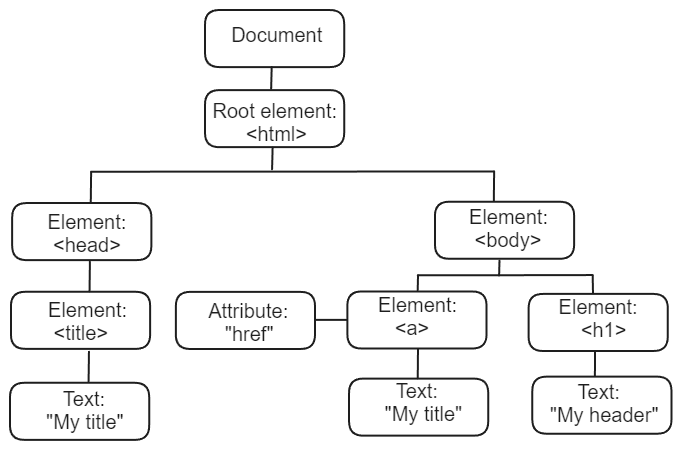

# DOM

[**DOM**](https://developer.mozilla.org/zh-CN/docs/Web/API/Document_Object_Model)（**D**ocument **O**bject **M**odel，文档对象模型），是一套操作页面元素的 API。

> [WHATWG DOM 文档](https://dom.spec.whatwg.org/)：官方文档
>
> [MDN DOM](https://developer.mozilla.org/zh-CN/docs/Web/API/Document_Object_Model)

HTML 官方文档在[HTML 简介](https://html.spec.whatwg.org/multipage/introduction.html#a-quick-introduction-to-html)章节对 DOM 的工作原理有解释。



# 元素操作

## 获取元素

JavaScript 通过选择器获取 HTML 元素，返回元素对象，或者由元素对象组成的数组。

### 获取第一个元素

- **语法**：`document.querySelector("选择器")`

  ```html
  <body>
    <div id="demo">
      <p class="text">text1</p>
      <p class="text">text2</p>
      <p>text3</p>
    </div>
    <script src="script.js"></script>
  </body>
  ```

  ```javascript
  let elements = document.querySelector("#demo  .text");
  console.log(elements); // <p class="text">text1</p>
  console.log(typeof elements); // object
  console.log(elements[0]); // undefined
  ```

### 获取全部元素

- **语法**：`document.querySelectorAll("选择器")`

  ```html
  <body>
    <div id="demo">
      <p class="text">text1</p>
      <p class="text">text2</p>
      <p>text3</p>
    </div>
    <script src="script.js"></script>
  </body>
  ```

  ```javascript
  let elements = document.querySelectorAll("#demo  .text");
  console.log(elements); // NodeList(2) [p.text, p.text]
  console.log(typeof elements); // object
  console.log(elements[0]); // <p class="text">text1</p>
  ```

### 通过元素名

- **语法**：`document.getElementsByTagName("元素名")`

  ```html
  <body>
    <p>text1</p>
    <p>text2</p>
    <p>text3</p>
    <div>text4</div>
    <script src="script.js"></script>
  </body>
  ```

  ```javascript
  let elements = document.getElementsByTagName("p");
  console.log(elements); // HTMLCollection(3) [p, p, p]
  console.log(typeof elements); // object
  console.log(elements[0]); // <p>text1</p>
  ```

  **解释**：

  - `console.log(divElements);`：打印一个伪数组

  - `console.log(divElements[0]);`：通过索引数组，打印元素

### 通过类名

- **语法**：`document.getElementsByClassName("类名");`

  ```html
  <body>
    <div id="demo">
      <p class="text">text1</p>
      <p class="text">text2</p>
      <p>text3</p>
    </div>
    <script src="script.js"></script>
  </body>
  ```

  ```javascript
  let elements = document.getElementsByClassName("text");
  console.log(elements); // HTMLCollection(2) [p.text, p.text]
  console.log(typeof elements); // object
  console.log(elements[0]); // <p class="text">text1</p>
  ```

### 通过 name 属性值

- **语法**：`document.getElementsByName("name属性值")`

  ```html
  <form>
    <input type="radio" name="age" />20<br />
    <input type="radio" name="age" />21<br />
    <input type="radio" name="age" />22<br />
  </form>
  ```

  ```javascript
  let elements = document.getElementsByName("age");
  console.log(elements); // NodeList(3) [input, input, input]
  console.log(typeof elements); // object
  console.log(elements[0]); // <input type="radio" name="age">
  ```

### 通过 id 值

- **语法**：`document.getElementById("id值")`

  ```html
  <p id="demo">text1</p>
  <script src="script.js"></script>
  ```

  ```javascript
  let element = document.getElementById("demo");
  console.log(element); // <p id="demo">text1</p>
  console.log(typeof element); // object
  ```

## 创建元素

- **语法**：`document.createElement("元素名");`

  ```javascript
  let tag = document.createElement("div");
  ```

## 添加元素

- **语法**

  ```javascript
  // 添加至父节点顶部
  父节点.prepend(子节点);
  
  // 添加至父节点尾部
  父节点.append(子节点);
  
  // 将新节点插入至父节点的某个子节点之前
  父节点.insertBefore(新节点, 参考节点);
  ```

  ```html
  <ul id="parent">
    <li id="child1">1</li>
    <li id="child2">2</li>
    <li id="child3">3</li>
  </ul>
  ```

  ```javascript
  let parentTag = document.getElementById("parent");
  let childTag1 = document.getElementById("child1");
  let childTag2 = document.getElementById("child2");
  let childTag3 = document.getElementById("child3");
  let childTagx = document.createElement("li");
  childTagx.innerText = "x";
  
  // 添加至父节点顶部
  parentTag.prepend(childTagx);
  
  // 添加至父节点尾部
  parentTag.append(childTagx);
  
  // 将新节点插入至父节点的某个子节点之前
  parentTag.insertBefore(childTagx, childTag2);
  ```

## 删除元素

- **语法**：

  ```javascript
  // 删除节点本身
  节点.remove;
  
  // 删除父节点的子节点
  父节点.removeChild(子节点);
  ```

  ```html
  <ul id="parent">
    <li id="child1">1</li>
    <li id="child2">2</li>
    <li id="child3">3</li>
  </ul>
  ```

  ```javascript
  let parentTag = document.getElementById("parent");
  let childTag1 = document.getElementById("child1");
  let childTag2 = document.getElementById("child2");
  let childTag3 = document.getElementById("child3");
  
  // 删除节点本身
  childTag1.remove();
  
  // 删除父节点的子节点
  parentTag.removeChild(childTag3);
  ```

## 获取元素内容

- **语法**：`TAG.innerText;`

  ```javascript
  let data = tag.innerText;
  ```

## 更改元素内容

- **语法**：`TAG.innerText = DATA;`

  ```javascript
  tag.innerText = data;
  ```

## 获取输入框内容

- **语法**：`TAG.value;`

  ```javascript
  let data = tag.value;
  ```

## 示例

- **示例**

  ```html
  <body>
    <ul id="city">
      <li>北京</li>
    </ul>
    <script src="script.js"></script>
  </body>
  ```

  ```javascript
  let cityList = ["上海", "广州", "深圳"];
  
  // 循环数组
  for (let i in cityList) {
    // 获取到cityList的元素
    let city = cityList[i];
  
    // 创建li标签
    let liTag = document.createElement("li");
    // 更改标签内容
    liTag.innerText = city;
  
    // 获取ul标签
    let ulTag = document.getElementById("city");
  
    // 将li标签添加到ul标签
    ulTag.append(liTag);
  }
  ```

# 事件（旧）

事件是由 DOM 元素产生的资源，可以由 JavaScript 代码操控。

在 JavaScript 和网页开发中，**事件**是指网页上发生的各种行为或动作。例如：**点击按钮** 和 **按下键盘上的键** 等。

## 绑定事件

**内联绑定**：HTML 元素有**绑定事件**的属性

```html
<button onclick="alert('按钮被点击了!')">点击按钮</button>
```

**外部绑定**：监听事件类型，推荐。

```javascript
对象.addEventListener("事件类型", 事件函数);
```

```html
<button>点击按钮</button>
```

```javascript
const button = document.querySelector("button");
button.addEventListener("click", () => {
  alert("按钮被点击了!");
});
```

## 事件类型

**事件类型**是指浏览器支持的*事件名称*，用来描述某种用户交互或浏览器行为，如 `click`、`keydown`、`load` 等。

**常见的事件类型包括**：

- **鼠标事件**：`click`, `dblclick`, `mouseover`, `mouseout`, `mousedown`, `mouseup`
- **键盘事件**：`keydown`, `keypress`, `keyup`
- **表单事件**：`submit`, `focus`, `blur`, `change`, `input`
- **加载事件**：`load`, `unload`
- **窗口事件**：`resize`, `scroll`
- **自定义事件**：`CustomEvent`

## 事件属性

**事件属性**是*HTML 元素的属性*，用于在 HTML 或 JavaScript 代码中**绑定事件处理程序**。

- 以 `on` 开头，比如**单击**的事件类型 `click`，对应的事件属性 `onclick`。
- 既可以在 HTML 中使用，也可以在 JavaScript 中赋值
- 只能绑定 **一个** 事件处理程序（会被后面的覆盖）

**在 HTML 里使用事件属性：**

```html
<button onclick="alert('按钮被点击了!')">点击按钮</button>
```

**在 JavaScript 里使用事件属性：**

```javascript
const button = document.querySelector("button");
button.onclick = () => {
  alert("按钮被点击了!");
};
```

## 事件命名规范

事件类型的名称通常是**全小写**的，多个单词之间没有任何分隔符和空格。

```javascript
element.addEventListener("mouseover", () => {}); // mouseover 采用全小写、无分隔符
```

创建自定义事件推荐使用**驼峰命名**，但监听时要小写。

```javascript
const event = new CustomEvent("myCustomEvent"); // 创建自定义事件时，驼峰命名
element.dispatchEvent(event);
```

```javascript
element.addEventListener("mycustomevent", () => {}); // 监听自定义事件时，全小写命名
```

## Dispatch Event

`.dispatchEvent()` 用于**模拟用户操作**，触发一个事件。

```html
<body>
  <button>点击按钮</button>
  <script src="script.js" defer></script>
</body>
```

```javascript
const button = document.querySelector("button");

// 监听 "click" 事件
button.addEventListener("click", () => {
  alert("按钮被点击了！");
});

// 3 秒后自动触发 "click" 事件
setTimeout(() => {
  button.dispatchEvent(new Event("click"));
}, 9000);
```

## 事件监听器

事件通常通过**事件监听器**来处理。事件监听器是指负责响应特定事件的代码块。你可以使用`addEventListener()`方法来绑定事件监听器。

**示例：绑定点击事件**

这段代码展示了如何为按钮元素添加一个点击事件。当用户点击按钮时，`alert`会被触发，弹出提示。

```html
<body>
  <button>点击按钮</button>
  <script src="script.js" defer></script>
</body>
```

```javascript
// script.js

// 选择一个按钮元素
const button = document.querySelector("button");

// 为按钮添加点击事件监听器
button.addEventListener("click", () => {
  alert("按钮被点击了!");
});
```

## 事件案例

### 鼠标和键盘

```javascript
// 点击按钮触发搜索
searchButton.addEventListener("click", performSearch);

// 按下回车键触发搜索
searchInput.addEventListener("keydown", (event) => {
  if (event.key === "Enter") {
    performSearch();
  }
});
```

**在以上代码中**：

- **`searchInput`**：之前自定义的搜索框对象；
- **`performSearch()`**：之前自定义的搜索函数。

### 案例

- **案例：点击按钮，循环切换图片**

  ```html
  <body>
    <input type="button" value="点击" id="btn" /><br />
    
    <script src="script.js"></script>
  </body>
  ```

  ```javascript
  let btn = document.getElementById("btn");
  let pic = document.getElementById("pic");

  // 因为获取src属性值会得到绝对路径，所以不能做相等判断，所以引入msg
  let msg = 1;

  // 给按钮添加事件
  btn.onclick = function () {
    if (msg == 1) {
      pic.src = "images/dog.jpg";
      msg = 2;
    } else {
      pic.src = "images/elephant.jpg";
      msg = 1;
    }
  };
  ```

- **案例：点击按钮，循环显示和隐藏图片**

  ```html
  <head>
    <link rel="stylesheet" href="styles.css" />
  </head>
  
  <body>
    <input type="button" value="点击隐藏" id="btn" /><br />
    <div id="box"></div>
    <script src="script.js"></script>
  </body>
  ```

  ```css
  * {
    margin: 0;
    padding: 0;
  }
  
  div {
    width: 200px;
    height: 200px;
    background-color: pink;
  }
  
  .hide {
    display: none;
  }
  
  .show {
    display: block;
  }
  ```

  ```javascript
  let btn = document.getElementById("btn");
  let box = document.getElementById("box");
  
  // 给按钮添加事件
  btn.onclick = function () {
    if (this.value == "点击隐藏") {
      // 通过类名改变元素的display属性值
      box.className = "hide";
      // 使用this指代当前事件源btn
      this.value = "点击显示";
    } else {
      box.className = "show";
      this.value = "点击隐藏";
    }
  };
  ```
