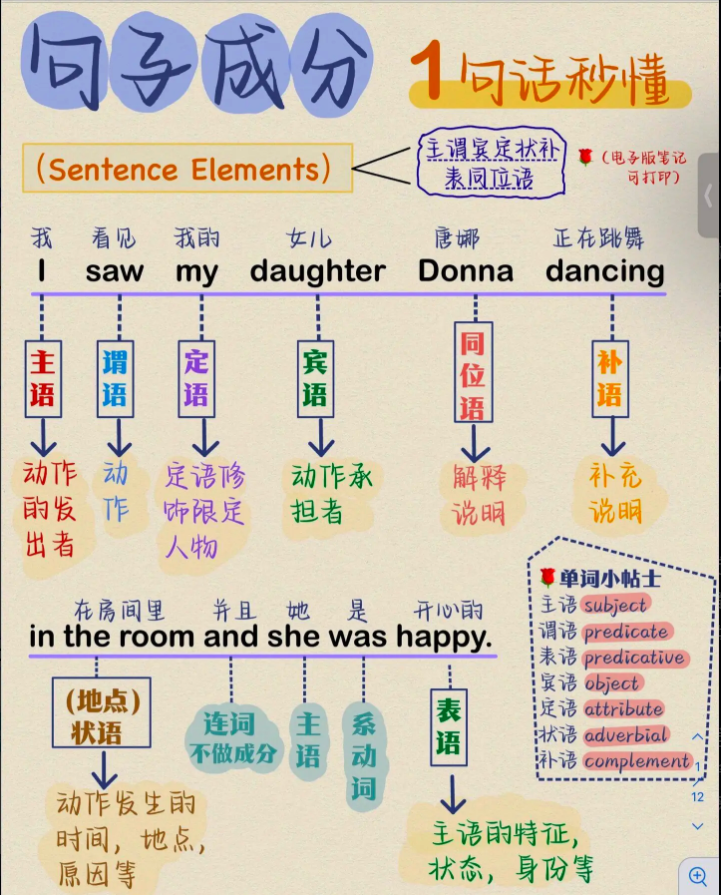

# 句子成分

## 主语

**主语**（Subject）是句子中动作的执行者，通常放在句首。

**形式主语**：**It** is hard to get early. (It 是形式主语)

**主语常见形式**：

| 形式 | 示例句 | 主语是… |
|:---:|:-----:|:------:|
| 名词 | Tom likes apples. | Tom |
| 代词 | She is happy. | She |
| 动名词 | Swimming is fun. | Swimming |
| 不定式 | To travel is exciting. | To travel |
| 名词短语 | The boy in the red shirt is my friend. | The boy... |
| 从句 | What he said surprised me. | What he said |

## 谓语

**谓语**（Predicate）就是动作，一个简单句只能有一个谓语。

**谓语常见形式**：

| 形式 | 示例句 | 谓语部分 |
|:---:|:-----:|:------:|
| 一般动词 | She runs every morning. | runs |
| be动词 + 表语 | He is a teacher. | is |
| 情态动词 + 动词原形 | I can swim. | can swim |
| 现在进行时 | They are watching a movie. | are watching |
| 完成时态 | She has finished her homework. | has finished |
| 被动语态 | The book was written by Jack. | was written |

## 宾语

**宾语**（Object）是动作的承受者。

**宾语常见形式**：

| 形式 | 示例句 | 宾语是… |
|:---:|:-----:|:------:|
| 名词 | I saw Tom. | Tom |
| 代词 | She likes him. | him |
| 名词短语 | He bought a new car. | a new car |
| 动名词（V-ing） | They enjoy singing. | singing |
| 不定式（to do） | We want to leave. | to leave |
| 宾语从句 | I believe that he is right. | that he is right |

**双宾语**：主语 + 谓语 + 间接宾语 + 直接宾语

He gave me a gift. = He gave a gift to me.  
gift 是直接宾语，me 是间接宾语。

## 定语

**定语**（Attributive）用来修饰名词性成分。

**定语常见形式**：

| 形式 | 示例句 | 定语是… | 修饰的名词 |
|:---:|:-----:|:------:|:--------:|
| 形容词 | She has long hair. | long | hair |
| 名词 | It's a chicken soup. | chicken | soup |
| 代词 | My brother is tall. | My | brother |
| 数词 | I have two cats. | two | cats |
| 动词-ed | The broken window was fixed. | broken | window |
| 动词-ing | I saw a sleeping baby. | sleeping | baby |
| 不定式 | She is the first to arrive.| to arrive | the first (人) |
| 介词短语 | The girl in red is my cousin. | in red | girl |
| 定语从句 | The book that you gave me is great. | that you gave me | book |

**后置定语**放在名词后面，常见形式有：

| 形式 | 示例句 | 定语后置 | 修饰的名词 |
|:---:|:-----:|:------:|:--------:|
| 不定式 | She is the first **to arrive**. | to arrive | the first |
| 介词短语 | The girl **in red** is my cousin. | in red | girl |
| 分词短语 | I saw a baby **sleeping on the bed**. | sleeping on the bed | baby |
| 定语从句 | The book **that you gave me** is great. | that you gave me | book |
| 前缀 a- 的形容词 | a baby **asleep** in the crib | asleep | baby |
| 特殊：修饰不定代词 | **Something wrong** happened. | wrong | something |

## 状语

**状语**（Adverbial）是用来修饰动词、形容词、副词、主语或者整个句子，主要用来表达**时间、地点、条件、原因、目的、结果、方式、让步、比较**等。有时也用形容词修饰主语的状态。

**状语常见形式**：

| 形式 | 例句 | 作用 | 修饰的成分 |
|:---:|:---:|:---:|:--------:|
| 副词 | She speaks **loudly**. | 方式状语 | speaks |
| 介词短语 | He went **to the park**. | 地点状语 | went |
| 现在分词短语 | **Walking in the park**, he met a friend. | 时间状语 | 主句 |
| 过去分词短语 | **Excited by the news**, she jumped up. | 原因状语 | 主句 |
| 不定式短语 | I came **to help you**. | 目的状语 | came |
| 状语从句 | **When the rain stops**, we'll go out. | 时间状语 | 主句 |
| 形容词（表主语的状态） | The boy walked away **sad**. | 状态状语 | The boy |

**状语常见类型**：

| 类型 | 示例句 | 状语部分 | 修饰的成分 |
|:---:|:-----:|:------:|:---------:|
| 时间状语 | **When the rain stops**, we'll go out. | When the rain stops | will go out |
| 地点状语 | He went **to the park**. | to the park | went |
| 条件状语 | **If it rains**, we will stay home. | If it rains | will stay home |
| 原因状语 | She was tired, **because she worked late**. | because she worked late | was tired |
| 目的状语 | She left early **so that she could catch the bus**. | so that she could catch the bus | left early |
| 结果状语 | He worked hard, **so that he passed the exam**. | so that he passed the exam | worked hard |
| 方式状语 | She sings **as if she were a professional**. | as if she were a professional | sings |
| 让步状语 | **Although he was tired**, he kept working. | Although he was tired | kept working |
| 比较状语 | She runs **faster than I do**. | than I do | runs |

## 补语

**宾语补足语**（Object Complement）是用来补充动作没完成的结果，通常出现在及物动词之后。

**补语常见形式**：

| 形式 | 例句 | 宾语 | 补语 |
|:---:|:---:|:---:|:----:|
| 名词 | They elected him **president**. | him | president |
| 形容词 | She painted the wall **blue**. | the wall | blue |
| 现在分词 | I saw her **dancing**. | her | dancing |
| 不定式 | She asked him **to leave**. | him | to leave |

## 表语

**表语**（Predicative）用来**说明主语的身份、性质、状态**的成分，常出现在“主系表结构”的 **连系动词（linking verb）** 后，比如：**be、become、seem、appear、look、feel、sound、stay、get、turn、remain** 等。

**表语常见形式**：

| 形式 | 例句 | 主语 | 表语 |
|:----:|:----:|:----:|:----:|
| 名词 | He is **a doctor**. | He | a doctor |
| 形容词 | She looks **happy**. | She | happy |
| 代词 | The winner is **you**. | The winner | you |
| 数词 | The total is **ten**. | The total | ten |
| 动词不定式 | My dream is **to travel the world**. | My dream | to travel the world |
| 动名词 | His job is **teaching**. | His job | teaching |
| 介词短语 | The keys are **on the table**. | The keys | on the table |
| 从句 | The problem is **that we are late**. | The problem | that we are late |

## 同位语

 **同位语**（Appositive）是用来对前面的名词或代词作进一步解释、说明的成分，通常与它所解释的名词**紧挨在一起**，中间可以用逗号隔开（非限定性），也可以不隔开（限定性）。

**同位语常见形式**：

| 形式 | 例句 | 被解释成分 | 同位语 |
|:----:|:----:|:-----------:|:------:|
| 名词 | My brother, **a doctor**, works in a hospital. | My brother | a doctor |
| 名词短语 | I visited Paris, **the capital of France**. | Paris | the capital of France |
| 名词从句 | I heard the news **that she won the prize**. | the news | that she won the prize |
| 代词 | Only one person, **you**, can help me. | one person | you |
| 数词 | We have three pets, **two cats and a dog**. | three pets | two cats and a dog |

# 句子类型

## 按用途分类

| 句子类型 |  功能  | 示例 | 翻译 |
| :-----: | :---: | :--------: | :----: |
| **陈述句** | 陈述事实、观点 | I like coffee. | 我喜欢咖啡。|
| **疑问句** | 提出问题 | Do you like coffee? | 你喜欢咖啡吗？|
| **祈使句** | 发出命令或请求 | Please sit down. | 请坐下。|
| **感叹句** | 表达强烈情感   | What a beautiful day it is! | 多么美好的一天啊 |

## 按结构分类

| 句子类型 | 构成特点 | 示例 | 翻译 |
|:--------:|:--------:|:----:|:--------:|
| **简单句** | 只有一个主句 | She is a teacher. | 她是一名老师。 |
| **并列句** | 简单句 + 连词 + 简单句 | I was tired, but I worked. | 我很累，但我还是工作了。 |
| **复合句** | 主句 + 从句 | I went out because it rained. | 我出去了，因为下雨了。 |
| **混合句** | 简单句 + 连词 + 复合句 | I went out, and she stayed home because she was sick. | 我出门了，而她因为生病留在家里。 |

## 祈使句

**祈使句**（Imperative Sentences）用来表示命令、请求、建议、邀请、警告或指示。

它的最大特点是：

- 主语通常省略（默认为“你” you）
- 动词开头，直接用原形动词（不加 to）

例句：

- Open the door.
- Be quite.
- Don’t be late.
- Never give up.
- Let me help you.
- Let’s go home.

## 基本句型

英语的简单句可以归纳为**五种基本句型**（即“五大句型”），这是大多数句子组成的基础骨架。

| 句型结构 | 英文术语 | 构成元素含义 | 示例 |
|:--------:|:--------:|:------------:|:----:|
| 主语 + 谓语 | S + V | 动作不涉及宾语 | He runs fast. |
| 主语 + 谓语 + 宾语 | S + V + O | 动作作用于宾语 | I love you. |
| 主语 + 谓语 + 间接宾语 + 直接宾语 | S + V + IO + DO | 表示“给某人某物”的结构 | He told me a story. |
| 主语 + 谓语 + 宾语 + 宾语补足语 | S + V + O + OC | 宾语补足语说明宾语的状态或结果 | We found him helpful. |
| 主语 + 系动词 + 表语 | S + V + P (C) | 描述主语的状态或身份 | She is smart. |

## 省略句

英语中的**省略句**是指在不影响语义和语法完整性的前提下，**省略句子中某些可以从语境中推断出来的成分**，避免重复，使语言更加简洁、自然。

- **祈使句一般省略主语**

    Hope you enjoy it. = I hope you enjoy it.

- **省略不定式中的动词**

    You can go if you **want** (to go).  
    I’d like to go, but I don’t **want to**.（= want to go）

    —Will you join in the game?  
    —I'd be **glad to**. (= glad to join)

- **并列结构中的谓语省略**

    She likes tea, and I (like tea) too.

- **比较句中的省略**

    He runs faster **than I**. (= than I do)

- 关于倒装句、定语从句和状语从句中的省略，详见相关章节。

## 倒装句

**倒装句**（Inversion）就是把句子的正常语序颠倒，比如把谓语动词放到主语前面。倒装句分为完全倒装和部分倒装。

### 部分倒装

**部分倒装**（Partial Inversion）就是把**助动词**、**情态动词**或 **be 动词**提前，其它部分保持原样。

- **部分倒装原则**
    - 把**助动词**、**情态动词**或 **be 动词**移至主语之前，谓语的其他部分仍保留在主语的后面。
    - 如果谓语部分无上述三种动词，则需借助 do、did、does 来“帮助”它构成倒装句。
    - 主从复合句中主句倒装，从句不倒装。

- **疑问句倒装**

    原句：You are happy.  
    疑问句：Are you happy?

- **否定副词位于句首**

    - **Not only...but also**：不仅...而且...

        **Not only do** sharing bicycles provide great convenience for people to travel, **but also** they can ease traffic pressure.  
        共享单车不仅给人们的出行提供很大的便利，而且可以缓解交通压力。

    - **No sooner...than...**；**Hardly/Scarecely...when...**：一...就...

        **No sooner had** he opened the door **than** a gust of wind blew the candle out.   
        **Scarcely/Hardly had** he opened the door **when** a gust of wind blew the candle out.  
        他一打开门，一阵强风就把蜡烛吹灭了。

    - **Not until...**：直到...才...

        Not until 1911 was the first kind of the vitamins identified.  
        直到1911年才发现了第一种维生素。

    - **其它否定副词**：Never，Seldom / Rarely

        Never have I seen such a beautiful view.  
        Seldom do we go out on weekdays.

- **Only + 状语，位于句首**

    Only by working hard can you succeed.

- **so / such 引导的倒装句**

    So beautiful was the sunset that we stopped to admire it.

- **条件句中省略 if 的倒装**

    Had I known, I would have helped. (= If I had known...)  
    Should you need help, let me know. (= If you should need...)

- **表示“也”的词，引导一句话与上文呼应**：so，neither，nor

    Football is very important to me, but **so** is our friendship.  
    足球对我很重要，但我们的友谊同样重要。 

    I hadn't been to Beijing before and **neither** had he.   
    我以前没去过北京，他也没去过。

### 完全倒装

- 表示“运动方向的副词”或“位置介词短语”位于句首，且谓语动词为 be、lie、stand、come、go、follow、run 等词；但如果主语是代词，则不必倒装。

     **Here** comes the bus.  
     **Here** he comes. (主语是代词，不必倒装。)  
     **Out** rushed the children.  
     Now comes your turn.   
     On the top of the mountain stands a temple.  

- **其它**

     Seated in the front are the leaders of the school.  
     Sitting in the front are the leaders of the school.  
     Gone are the days when women were looked down upon.

## 强调句

英语中的**强调句**结构是为了突出句子中的某个成分，比如主语、谓语、宾语、状语等。

### 基本形式

- **It is/was + 被强调部分 + that/who 其他成分**：意为“就是...”
  
    - it 作为形式主语，没有单三变化，无论被强调的是单数还是复数。
    - is/was 有时态的变化。
    - 只有一般现在时和一般过去时。
    - 有肯定、否定和疑问形式。
    - 强调物时，只能用 that。
    
- **例句**

    It is I who/that am right. (陈述句，强调主语；强调主语时注意主谓一致。)  
    我是对的。

    It was not him whom/that we met at the school gate. (否定句，强调宾语)  
    我们在校门口遇到的人就是他。

    Was it in 1939 that the Second World War broke out? (一般疑问句，强调状语)  
    二战是在1939年爆发的么？

    Who was it that broke the window? (特殊疑问句，强调主语)  
    是谁把窗户打碎的？

- **强调句与定语从句的区分**：如果把句子中的 **It is/was** 和 **that/who**
    去掉，稍加调整语序，能还原成完整句子，并且句子意思依然完整，则为强调句。

    **强调句**：It was Tom who helped me.  
    **原句**：Tom helped me.

- **强调句表达时间**

    **not until...that...**：意为“直到...才...”  
    It was not until ten o'clock that he went to bed.  
    直到10点他才上床睡觉。

    It was nearly midnight when I got home.  
    我到家时快午夜了。

    It's twenty years since I met her.  
    我已经二十年没见她了。

    It may be many years before the situation improves.  
    这种状况或许要过很多年才能改善。

### 强调谓语

- **do + 动词原形**：意为“确实做了...”
    - do 有单三和时态的变化
    - 只有一般现在时和一般过去时
    - 只有肯定形式
- **例句**：First impressions really do count. 第一印象真的很重要。

# 并列句

由**并列连词**把两个或两个以上的简单句连在一起的句子叫**并列句**。

## 并列关系

表并列关系的连词：and，not only...，but also... 等

She dances well and he sings well.  
她舞跳得好，他歌唱得好。

## 转折关系

表转折关系的连词：but，yet，while 等。

Honey is sweet, but the bee stings.  
蜂蜜是甜的，但蜜蜂会蜇人。

It's a small car, yet it's surprisingly spacious.  
这辆轿车小，然而宽敞得出奇。

He likes pop music while I am fond of classical music.  
他喜欢流行音乐，而我喜欢古典音乐。

## 因果关系

表因果关系的连词：far，so 等。

He didn't attend the meeting, for he was ill.  
他由于病了，没有参会。

It was still painful so I went to see a doctor.  
那地方还疼，因此我去看了医生。

## 选择关系

表选择关系的连词：or，either...or... 等。

Either you come to my house or I go to yours.  
或者你到我家来，或者我到你家去。

## when

when 可用作并列连词。

We were having a meeting when someone broke in.  
我们正在开会，这时突然有人闯进来。

# 主语从句

**主语从句**（Subject Clause）是指一个完整的句子，作为主句的**主语**来使用。

主语从句的结构通常由“引导词 + 从句”构成，常见引导词有：that，whether，if，连接代词（who，what 等），连接副词（when，where 等）。

**注意**：

- 引导词不能省略。
- 注意主谓一致。

**结构**：

- 主语从句放在句首

    **What he said** is true. 他所说的是真的。

- 由 it 作形式主语，主语从句放在句尾

    It is a pity **that you didn't attend the lecture yesterday**.  真遗憾，你昨天没参加讲座。

# 宾语从句

**宾语从句**是指一个从句作为**宾语**，用来说明动词、介词或某些形容词所作用的内容。

宾语从句的结构如下：

> 主语 + 谓语动词 + 宾语从句

常见引导词有：that，whether/if，连接代词（who，what 等），连接副词（when，where 等）。

**例句**：

He said that he was tired.  
他说他累了。

## 宾语从句的注意事项

- **否定转移**：宾语从句表示否定含义时,常把否定转移至主句。

    I don't think that he is a good child.

# 定语从句

定语从句是指一个从句作为**定语**，用来修饰名词性成分。

I'll forever cherish the days **when I studied abroad**.  
我将永远珍视我在国外学习的日子。

## 先行词

被定语从句修饰的名词、代词等称为**先行词**，一般出现在定语从句之前。有时先行词是整个主句。

- **一个词作先行词**

    This is the **museum** which was built last year.  
    这就是去年建成的那个博物馆。

- **整个主句作先行词**

    **They sent my child to the school every morning**, which I considered a great help to me.  
    他们每天早晨送我的孩子去学校，我认为这对我是极大的帮助。

## 关系词

### 关系词

引导定语从句的词被称为**关系词**。

- **关系代词**

    who，whom，whose，that，which，as

- **关系副词**

    when，where，why

- **省略关系词**：在限制性定语从句中，以下情况可省略关系词。

    - **关系词在从句中作宾语时，可省略。**

        I know the girl (whom/that) you met yesterday.  

    - **当先行词是 the time、the day、the reason、the place、the way 时，关系词 when、why、where、that 等也可以省略。**

        This is the place (where) John works.

- **例句**：

    The boys **who/that** are playing football are from Class One.  
    正在踢足球的男孩们是一班的。

    I'll cherish the moment **when** I met Lisa.  
    我将珍视我和莉萨见面的时刻。

    Is there a shop around **where** we can get fruit?  
    附近有没有我们能买到水果的商店？

    We don't know the reason **why** they didn't attend the meeting.  
    我们不知道他们没有参会的原因。

### 关系代词 as 的用法

- 引导限制性定语从句时，主要用于 the same...as...，such...as...，so...as... 等结构，既可指人也可指物。

    We have found such materials as are used in their factory.  
    我们已经找到了他们工厂里用的那种材料。

- 引导非限制性定语从句，其先行词是整个主句时，常译成“正如，正像”。

    As everybody knows, Shakespeare is a famous writer.  
    正如每个人都知道的那样，莎士比亚是一位知名作家。

## 限制性定语从句

限制性定语从句起限定作用。

- 作用：限定前面的名词，说明是哪一个。
- 句子中不可缺少，否则意思就不完整或会改变。
- **没有逗号**隔开。
- 通常用 **that / who / which** 引导。
- 某些情况可省略关系词，详见关系词。

The girl **who is wearing a red dress** is my sister.

- 解释：说话时可能有很多女孩，但我说的是那个穿红裙子的女孩。
- “who is wearing a red dress” 是必要的信息，如果去掉，句子信息不完整。

## 非限制性定语从句

非限制性定语从句起补充说明作用。

- 作用：补充说明前面的名词。
- 去掉这部分，主句也能独立成句，意思不受影响。
- 用逗号隔开
- **不能用 that**，只能用 **which / who / whose** 等引导。
- 不能省略关系词。

My sister, **who is wearing a red dress**, is a teacher.

- 解释：我只有一个妹妹，她穿着红裙子（补充信息）。
- “who is wearing a red dress” 只是额外描述，不影响主句。即使去掉了，也不影响我的妹妹是一个老师。

# 状语从句

**状语从句**（Adverbial Clauses）是在句子中充当**状语**的从句，主要用来表达**时间、地点、条件、原因、目的、结果、方式、让步、比较**等。

状语从句通常由**从属连词**引导，比如：when、because、if、although、as、so that 等。

**状语从句常见形式**：

| 类型 | 例句 |
|:----:|:------------------------------:|
| 时间状语从句 | I left **when the movie ended**. |
| 地点状语从句 | He sat **where she had been sitting**. |
| 条件状语从句 | **If it rains**, we’ll stay home. |
| 原因状语从句 | He stayed home **because he was sick**. |
| 目的状语从句 | She studies **so that she can pass**. |
| 结果状语从句 | It was so cold **that we stayed inside**. |
| 让步状语从句 | **Although he is tired**, he keeps working. |
| 方式状语从句 | He talks **as if he knew everything**. |
| 比较状语从句 | She is taller **than I am**. |

- **状语从句中的省略**：当从句和主句的主语一致或者从句的主语是 it，可省略从句的**主语**和 **be 动词**

    She always sings while (**she is**) doing her work.  
    I prefer my milk a little sweetened whenever (**it is**) possible.

## 时间状语从句

- **功能**：说明动作发生的时间
- **引导词**：when, while, as, as soon as, once, whenever, before, after, since, till, until 等
- 详见 **表达 | 时间**
- **例句**：
    - I will call you **when I arrive**.
    - **While she was cooking**, the phone rang.
    - **As soon as the rain stops**, we will leave.

## 地点状语从句

- **功能**：说明动作发生的地点
- **引导词**：where, anywhere, everywhere, wherever 等
- **例句**：
    - Put the book **where you found it**.
    - **Wherever you go**, I will follow you.

## 条件状语从句

- **功能**：说明动作发生的条件

- **引导词**：if, unless, as long as, provided that 等

- **if + 从句：如果...**

    You'll fail the exam **if** you don't study hard.

    如果你不努力学习，你会考试不及格。

- **provided/providing (that) + 从句：如果...**

    He won't be against us at the meeting **provided/providing (that)** we ask for his advice in advance.  
    如果我们提前征求一下他的意见，他就不会在会上反对我们。
    
- **unless + 从句：除非...**

    You'll fail the exam **unless** you study hard (= if you don't study hard).

    除非你努力学习，否则你会考试不及格。

- **on condition that + 从句：条件是...**

    I can tell you the truth **on condition that** you promise to keep it secret.

    我可以告诉你真相，条件是你答应保守秘密。

- **so/as long as + 从句：只要...**

    As long as you don't lose heart, you will succeed.  
    你只要不灰心，就会成功。

## 原因状语从句

- **功能**：说明动作发生的原因
- **引导词**：because, as, since, now that, in that, considering that 等
- 详见 **表达 | 原因**
- **例句**
    - She cried **because she lost her keys**.
    - **Since it's raining**, we should stay indoors.

### because

- **because + 从句：表示直接因果关系**

    I was absent from the meeting yesterday **because** I was ill.

- **because of + 名词**

    We were late **because of** the rain.

### as，since 和 now that

- **as / since / now that + 从句：表示“双方都知道的原因”**

    **Now that/Since** everyone is here, we can begin our discussion.  
    既然大家都在这儿，我们可以开始讨论了。

### in that

- **in that + 从句：表示“因为”，常用于正式文体。**

    This experiment is worth trusting **in that** it is based on scientific facts.  
    这个实验值得信赖，因为它是建立在科学事实基础之上的。

### for

- **for + 从句：表示“因为”，这里的 for 是并列连词。**

    It must have rained last night, **for** the ground is wet.  
    昨天晚上肯定下雨了，因为地面是湿的。

### 表原因的介词短语

- 此项只是为了总结表原因的介词短语，不是状语从句。

- **because of / due to / owing to / in view of / on account of + 名词性成分：构成介词短语，表示“因为...”**

    We were late **because of** the rain.

## 目的状语从句

- **功能**：说明动作发生的目的

- **引导词**：so that, in order that, for fear that, in case 等

- **in order that / so that + 从句：表示“为了...”，so that 一般不位于句首。**

    I'm studying hard **so that/in order that** I can go to a famous university.  
    为了能上一所名牌大学，我正在努力学习。

    **In order that** we could save time, we used the computer.  
    我们使用计算机是为了节省时间。

- **for fear that + 从句：担心...**

    Mary didn't want to get out of bed for fear that she might wake her baby up.  
    玛丽不想起床，担心可能吵醒她的宝宝。

- **in case**

    - **in case that + 从句：以防...**

        Take your raincoat in case it should rain/it rains.  
        带上你的雨衣以防下雨。

    - **in case 位于句尾：表示“以防万一”**

        It may not rain, but you'd better take an umbrella in case.  
        天可能不会下雨，但你最好带把雨伞以防万一。

    - **in case of + 名词：“如果发生……的情况”**

        In case of fire, use the stairs, not the elevator.  
        如果发生火灾时，请走楼梯，不要乘电梯。

## 结果状语从句

- **功能**：说明动作发生的结果
- **引导词**：

## 让步状语从句

- **功能**：表示与主句相反的让步关系
- **引导词**：though, although, even though, even if, as, while, wh-ever, “no matter wh-”等

### though，although 和 while

- 意为“即使...”，though 不如 although 那么正式。

    **Though/Although/While** it was raining hard, they went on playing football.  
    虽然雨下得很大，但他们继续踢足球。

- though/although 引导让步状语从句时，可与 yet 或 still 连用，但不可与 but 连用。

    ❌ **Although** he is poor, **but** he is happy.  
    ✅ **Although** he is poor, **yet/still** he is happy.  
    ✅ **Although** he is poor, he is happy.  
    ✅ He is poor, **but** he is happy.

- though 引导的从句可用倒装结构，而 although 不可。

    **Young though** she is, she has travelled to many countries.(倒装)  
    她尽管年轻，但已到过很多国家。

### even though 和 even if

- even though/even if 意为“即使,尽管”，引导的从句可用陈述语气，也可用虚拟语气。

    Tim is in good shape **even though/even if** he doesn't get much exercise.  
    尽管蒂姆不怎么锻炼，但他身体不错。(陈述语气)

    **Even though/Even if** I were busy, I would go.  
    即使我很忙,我也去。(虚拟语气)

### as

- as 引导让步状语从句时，从句一般位于主句之前，采用倒装形式。

    **Try as/though** you may, you will never succeed in a short time.   
    (=Though/Although you may try, ...)  
    你虽然很努力，但绝对不会在短时间内成功。

    **Much as/though** I like it, I won't buy, for it's too expensive.  
    (=Though/Although I like it much, ...)  
    虽然我很喜欢它，但我不会买，因为它太贵了。

### wh-ever 和 no matter wh-

- **wh-ever = no matter wh-** 

    Whenever (=No matter when) I'm unhappy, it is my friend who cheers me up.  
    不管什么时候我不高兴，都是我的朋友使我振作起来。

    Whoever (=No matter who) you are, you must keep the law.  
    不管你是谁，你必须遵守法律。

- **wh-ever 还可以引导名词性从句，但 “no matter wh-”不能。**

    Please give the money to whoever needs it most.  
    请把钱给最需要的人。

    Whatever you said is right.  
    你说的话都是对的。

### whether

- **whether or not = whether ... or not**

    Whether you come or not, I’ll go.  
    Whether or not you come, I’ll go.  
    不管你来不来，我都去。

    I don’t know whether you will come. (作宾语时常省略 or not)  
    我不知道你会不会来。

## 方式状语从句

- **功能**：说明动作发生的方式
- **引导词**：as, as if, as though 等

### as

- **as：照……方式**

    Do it **as I told you**.  
    像我告诉你的那样做。

### as if 和 as though

- **as if = as though：好像...**

- **通常使用虚拟语气**

    The old lady treats the boy as if he were her own grandson.  
    这位老太太对待这个男孩就好像他是她自己的孙子似的。

- **如果从句中所陈述的情况很可能实现，也可用陈述语气。**

    Look! It's cloudy outside as if it is going to rain.  
    看！外面阴云密布，看起来要下雨了。

## 比较状语从句

- **功能**：比较两个动作或状态

- **引导词**：than, as...as, the more...the more 等

- 详见 **比较级**

- **例句**

    He was more successful than we had expected.  
    他比我们预想的要成功得多。

# 表语从句

**表语从句**是指在**主系表结构**中，用一个从句来作**表语**，对主语进行说明或补充说明。

表语从句的结构如下：

> 主语 + 系动词 + 表语从句

常见的引导词有：that，whether，连接代词（who，what 等），连接副词（when，where 等）。

**例句**：

The fact is that she didn’t call me.  
事实是她没有给我打电话。

# 同位语从句

**同位语从句**是指一个从句作为**同位语**，解释前面的名词，不能省略引导词。

简单理解，从句就是对前面的名词解释，名词和同位语从句的关系就像是定义和解释的关系。

**区别于定语从句**：

- 定语从句：限定名词
- 同位语从句：解释名词

**例句**：

I heard the news **that she got the job.**  
They are considering the question **how we should respond.**