# Excel 基础

## 环境搭建

- 详见 `Windows笔记` 中的 `安装Office`。

## 工作界面

  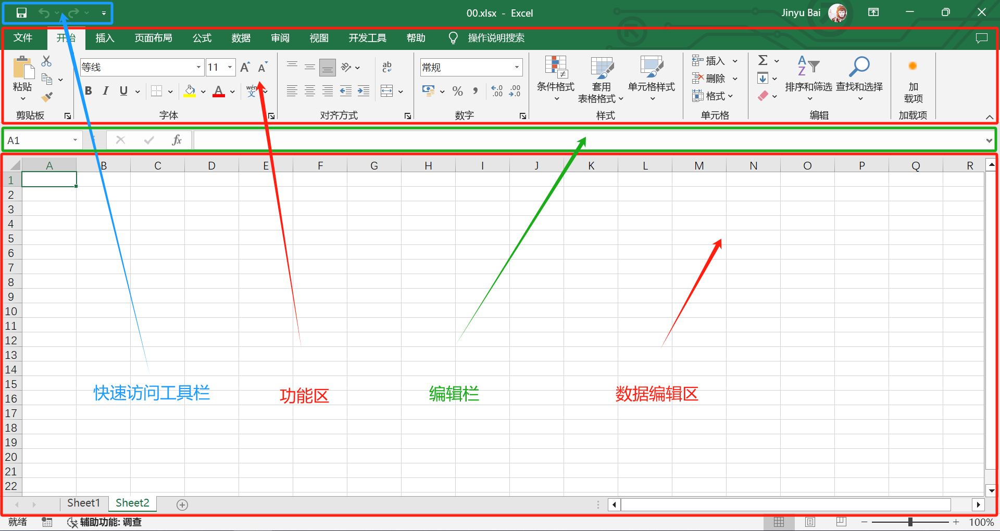

### 快速工具访问栏

- 快速工具访问栏可放置所有命令，按需放置
- 设置：`文件` - `选项` - `快速工具访问栏`

### 功能区

  

- **选项卡**：功能区的下级分类，比如 `开始` `插入`
- **组**：选项卡的下级分类，比如 `数字` `字体`
- **自定义功能区**

  - `文件` - `选项` - `自定义功能区`
  - 选项卡 - 右键 - `自定义功能区`

### 编辑区

## 工作簿

- “工作簿”是文件的基本单位。每个 Excel 文件实际上就是一个“工作簿”，它包含一个或多个“工作表”。
- 工作簿可以保存为多种格式，例如：

  - **.xlsx**：Excel 默认格式，适用于日常使用。
  - **.xls**：兼容早期版本的 Excel 格式。
  - **.csv**：纯文本格式，适合存储简单数据（如表格数据导入导出）。
  - **.pdf**：适合只读分享，不易编辑。

## 工作表

- **工作表**是工作簿中的数据页面，是 Excel 的主要工作空间。

  - 每个工作表都有自己的单元格、数据和格式。
  - 一个工作簿可以包含多张工作表，这些工作表中的数据可以夸表引用。

- 移动和复制工作表

  - 右键点击工作表标签，选择 `移动或复制`
  - 在 `下拉三角形` 中选择目标工作簿
  - 如果想移动，直接点 `确定`
  - 如果想复制，选择 `建立副本`，再点 `确定`

## 行、列、单元格

- 工作表的横向为行（1、2、3…），纵向为列（A、B、C…）
- 行列的交叉点就是单元格，通过列和行的位置进行唯一标识（如 A1、B2）

## 单元格区域

- 即多个单元格的集合
- **左上到右下**：`A1:C5`
- **单列**：`A:A`
- **单行**：`3:3`

# 数据录入

- 在 Excel 中，数据录入是指将信息输入到工作表的单元格中。Excel 支持各种类型的数据，包括文字、数字、日期、时间、公式等。

## 直接输入

- 选中一个单元格，直接输入数据
- 移动光标

  - `Enter`：往下移动一个单元格
  - `Shift` + `Enter`：往上移动一个单元格
  - `Tab`：往右移动一个单元格
  - `Shift` + `Tab`：往左移动一个单元格

- 技巧

  - 双击单元格输入数据以后，直接按 `→` 无法跳出当前单元格，但使用快捷键 `Tab` 就可以了

## 填充

- **填充**：数据序列或图案按照某种规律向相邻单元格方向延续
- `功能区` - `开始` - `编辑` - `填充`

### 填充柄

- **填充柄**：在单元格的右下角，当光标变成黑色 `+` 号时，可以拖动它来自动填充数据。

  - 选中一个单元格拖拉（或者双击黑色 `+` 号）：复制
  - 选中多个单元格拖拉（或者双击黑色 `+` 号）：序列

- **填充柄选项**：完成填充后会显示一个小按钮，可以选择不同的填充方式

  - **复制单元格**：带格式反复复制拖动的单元格
  - **不带格式反填充**：不带格式反复复制拖动的单元格
  - **仅填充格式**：不复制内容，仅复制格式
  - **序列**：生成有规律的数列

    - 选中一个单元格拖拉：步长值为 1
    - 选中多个单元格拖拉：系统自动计算步长值

  - **快速填充**：详见快速填充

### 序列

- “序列”功能可以设置更复杂的填充需求。
- `功能区` - `开始` - `编辑` - `填充` - `序列`
- 序列产生在

  - 行
  - 列

- 类型

  - 等差数列
  - 等比数列
  - 日期
  - 自动填充

- 步长值和终止值

### 快速填充

- **快速填充**：根据 `相邻两列` 中的数据，自动填充第三列数据。功能类似于字符串拼接和拆分
- `功能区` - `开始` - `编辑` - `填充` - `快速填充`，`Ctrl + E`

#### 合并多个单元格的内容

- 如果你有姓和名分开的两列（例如，A 列是姓氏，B 列是名字），想在 C 列生成全名
- **图例**

    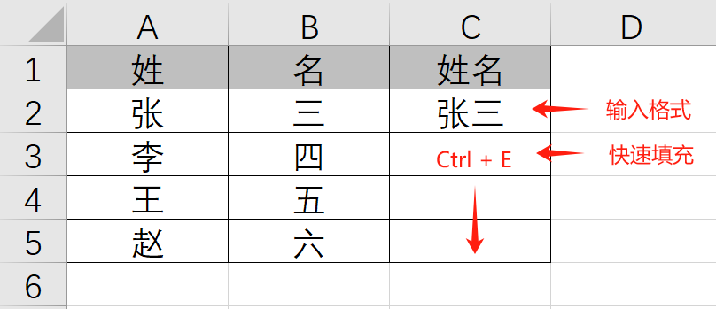

- 在 `C2` 单元格输入全名 `张三`
- 在 `C3` 单元格按 `Ctrl + E`，Excel 会自动将其他行的姓和名合并。

#### 从文本中提取特定内容

如果你有包含姓名和职位的单元格（例如 "张三, 经理"），想要从中提取姓名或职位，只需在右侧一列中手动输入一个示例（如张三），然后在下面单元格按 `Ctrl + E`，Excel 会自动识别相似的模式，并填充其他单元格。

#### 数据格式化

假设你有一列电话号码，没有分隔符（如 "1234567890"），想添加分隔符，只需在右侧一列中手动输入一个示例（如“123-456-7890”），然后在下面单元格按 `Ctrl + E`，Excel 会自动识别相似的模式，并填充其他单元格。

## 自动获取数据

- `数据` - `获取数据`

  - 可以从外部文件或网站自动获取数据

### 从网站获取

- `数据` - `获取和转换数据` - `自网站`
- 在弹出的对话框中，输入币安的行情 API URL：`https://api.binance.com/api/v3/ticker/price?symbol=BTCUSDT`
- **加载数据**

  - Power Query 会解析这个 JSON 格式的数据。
  - 选择 **转到编辑器**，并查看数据格式。
  - 确保数据转换正确后，点击 **关闭并加载**，数据会导入新工作表中。
  - 得到的 3 行 2 列数据可以整体复制到其它位置，其它工作表的单元格可以跨表引用该数据。

- **设置刷新频率**

  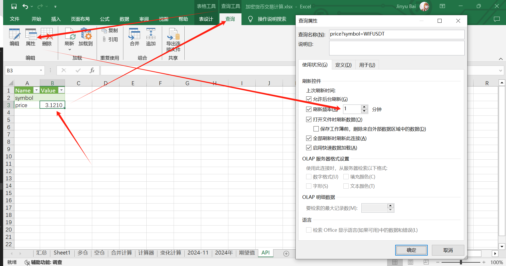

  **按如下设置**：

  - 在新生成的表中，选中单元格
  - `工具栏` - `查询` - `属性`
  - 详细设置如图

- **设置数据格式**

  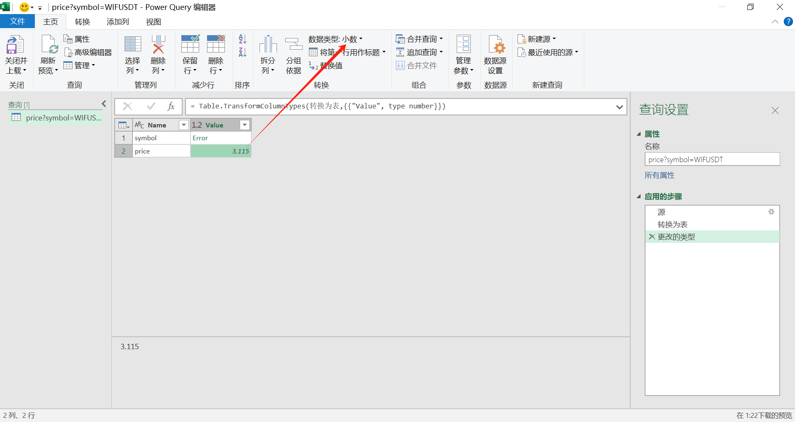

  **按如下设置**：

  - 此举为了解决得到数据无法设置小数位数的问题
  - `工具栏` - `查询` - `编辑`，进入 Power Query 编辑器
  - 将价格数据格式改为 `小数`
  - 改完后标题会报错，没有好办法
  - 改完后，引用该数据的单元格即可以设置小数位数了

## 数据验证

- **数据验证**功能允许您控制用户在单元格中输入的内容，比如限制为数字范围、日期范围，或通过下拉菜单进行选择。
- `数据` - `数据验证`

### 设置

在**设置**选项卡中，您可以选择允许的输入类型以及相关限制条件。主要选项包括：

- **任何值**：无任何限制，允许输入任何内容（这是默认值）。
- **整数**：限制输入为特定范围的整数，例如只能输入 1 到 100 之间的整数。
- **小数**：限制输入为特定范围的小数，如 0 到 1 之间的值。
- **序列**：创建下拉菜单供用户选择特定值。

  - 在“**来源**”框中输入选项，用英文逗号分隔，例如：`男,女`。
  - 或者引用单元格区域，例如`=$B$1:$B$10`，Excel 会将该区域内的内容作为选项。

- **日期**：限制输入为特定日期或日期范围。
- **时间**：限制输入为特定时间或时间范围。
- **文本长度**：限制输入的文本长度，比如最多 10 个字符。
- **自定义**：使用公式自定义验证规则。例如，要求单元格值大于 0 且小于 100 的公式是`=AND(A1>0, A1<100)`。

### 输入信息

**输入信息**用于在用户选择受限单元格时，显示提示信息指导用户输入。

- 在“**标题**”中输入提示标题，例如“性别选择”。
- 在“**输入信息**”中输入说明，例如“请选择男或女”。

### 出错警告

**出错警告**设置在用户输入不符合验证规则的内容时，显示的错误消息。

- 在“样式”中选择错误类型：

  - **停止**：用户必须输入符合规则的内容，否则无法继续输入。
  - **警告**：Excel 会警告用户输入不符合要求，用户可以选择继续。
  - **信息**：Excel 会显示信息提示，但允许用户输入不符合规则的内容。

- 设置“**标题**”和“**错误消息**”，例如标题为“输入错误”，错误消息为“请输入男或女”。

### 输入法模式

**输入法模式**选项卡主要用于设置用户在输入特定单元格内容时，输入法的默认模式。

- **自动**：不强制指定中英文输入法。
- **打开**：强制切换至中文输入法。但目前无效
- **关闭**：强制切换至英文输入法。

## 特殊内容

### 批注

- **批注**（或称“注释”）是一种可以附加在单元格中的小型文本框，方便用于记录额外的说明。
- `功能区` - `审阅` - `批注`
- **新建批注**

  - `功能区` - `审阅` - `批注` - `新建批注`
  - `右键` - `插入批注`

- **编辑批注**

  - `功能区` - `审阅` - `批注` - `编辑批注`
  - `右键` - `编辑批注`
  - 编辑批注时可 `右键` - `设置批注格式`

- **显示和隐藏批注**：默认情况下，批注只会在鼠标悬停在带有批注的单元格上时显示。

  - 若想固定显示 / 隐藏批注

    - `功能区` - `审阅` - `批注` - `显示/隐藏批注`
    - `右键` - `显示/隐藏批注`

  - 显示所有批注

    - `功能区` - `审阅` - `批注` - `显示所有批注`

- **删除批注**

  - `功能区` - `审阅` - `批注` - `删除批注`
  - `右键` - `删除批注`

### 链接

- `功能区` - `插入` - `链接`

  - 单元格
  - 数据表
  - 文件
  - 网页
  - 电子邮件

### 艺术字

- `功能区` - `插入` - `文本` - `艺术字`

### 签名

- `功能区` - `插入` - `文本` - `签名行`

### 文本框

- `功能区` - `插入` - `文本` - `文本框`

### 页眉页脚

- `功能区` - `插入` - `文本` - `页眉页脚`

### 符号

- `功能区` - `插入` - `符号` - `符号`

### 公式

- `功能区` - `插入` - `符号` - `公式`

## 录入技巧

- **行列转置**

  - `复制` - `选择性粘贴` - `转置`
  - 可以将一行数据转置到一列

- **强制换行**：`Alt + Enter`
- **显示原文**：`'`

  - 英文状态的单引号为前缀，显示原本输入内容
  - 取消科学计数
  - 显示 6/30，而不是 1/5

- **输入分数**：`1 1/3` 表示 1 又 1/3
- **时间**

  - 当前日期：`Ctrl + ;`
  - 当前时间：`Ctrl + Shift + ;`

# 数据格式化

## 数字类型

- **导航**

  - `功能区` - `开始` - `单元格` - `格式` - `设置单元格格式` - `数字`
  - `右键` - `设置单元格格式` - `数字`
  - `Ctrl + 1`

### 数字类型

- **常规**：默认格式，适用于各种类型的数据，输入的内容不会进行特殊显示或运算。
- **数值**：可自定义小数位数，并且可以使用千位分隔符（例如：1,000.55）。
- **货币**：用于财务数据展示，显示货币符号（如$、¥、€ 等）并对齐小数位。
- **会计**：类似于货币格式，但符号对齐于单元格左侧，小数点对齐于右侧，便于对比。
- **日期**：将数字转换为日期，如“2024/01/01”或“1-Jan-2024”，可以自定义为“年-月-日”或“日/月/年”格式。
- **时间**：支持显示具体时间，如“14:30”或“2:30 PM”，可以选择 24 小时制或 12 小时制，也可自定义。
- **百分比**：将数值显示为百分比，自动乘以 100 并添加%符号，适用于展示占比数据。
- **分数**：将数值显示为分数形式，如 1/2、3/4 等。
- **科学计数**：以科学计数的方式显示数值，适合展示非常大或非常小的数值。
- **文本**：将单元格中的内容视为文本，即使输入数字或日期也不会进行计算或格式化。
- **特殊**：用于设置电话、邮政编码或身份证号等固定格式，如电话显示为“(123) 456-7890”。
- **公式和函数**：可以在单元格中输入公式或使用 Excel 的函数进行计算。例如，`=SUM(A1:A10)`用于对 A1 到 A10 区域的数字求和。
- **自定义**：带有格式占位符的数据类型

### 格式占位符

#### 数字格式

- `0`：表示数字占位符，若数字的位数不足，则在该位置用零填充。

  - `0` 代表一位数，`00` 代表两位数...
  - 示例：`=TEXT(45, "0000")`，返回结果为 `0045`。

- `#`：表示数字占位符，若数字的位数不足，则不会用零填充。

  - `#` 代表一位数，`##` 代表两位数...
  - 示例：`=TEXT(45, "##")`，返回结果为 `45`，`=TEXT(4, "##")` 结果为 `4`。

- `.`（小数点）：指定小数部分的分隔符。

  - 示例：`=TEXT(1234.567, "0.00")`，返回结果为 `1234.57`，四舍五入到两位小数。

- `,`（逗号）：用于千位分隔符或表示数值的倍数。

  - 示例：`=TEXT(1234567, "#,##0")`，返回结果为 `1,234,567`。

#### 百分比格式

- `%`：用于表示百分比，将数字乘以 100 并添加百分号。
- 示例：`=TEXT(0.25, "0%")`，返回结果为 `25%`。

#### 货币格式

- `$`：用于表示美元符号。
- `￥`：用于表示人民币符号。
- 示例：`=TEXT(1234.56, "$#,##0.00")`，返回结果为 `$1,234.56`。

#### 日期和时间格式占位符

- `y`：年，`m`：月，`d`：日

  - 示例：`=TEXT(TODAY(), "yyyy-mm-dd")`，返回结果为 `2024-10-31`（假设当前日期是 2024-10-31）

- `y`：年

  - `yy`：两位数的年份
  - `yyyy`：四位数的年份

- `m`：月

  - `m`：一位数的月份（不带前面的 0）
  - `mm`：两位数的月份（带前面的 0）
  - `mmm`：英文缩写的月份
  - `mmmm`：英文全拼的月份

- `d`：日 / 星期

  - `d`：一位数的日期（不带前面的 0）
  - `dd`：两位数的日期（带前面的 0）

- **星期**：1 对应星期日

  - `ddd`：英文缩写的星期
  - `dddd`：英文全拼的星期
  - `aaa`：中文缩写的星期
  - `aaaa`：中文全拼的星期

- `h`：时，`m`：分，`s`：秒

  - 示例：`=TEXT(NOW(), "hh:mm:ss AM/PM")` 将当前时间格式化为 `02:30:00 PM`（假设当前时间是 14:30）。
  - 不填 `AM/PM`，则返回结果为 24 小时计时制

#### 特殊字符

- `"`：插入字符串。

  - 示例：输入`25`，设置格式为 `0"岁"`，返回结果为 `25岁`

- `@`：引用单元格内容（文本）

  - 示例：输入 `运营部`，设置格式为 `"联通公司-"@`，返回结果为 `联通公司-运营部`

- `;`：为不同的数字类型（正数、负数、零、文本）定义不同格式的分隔符

  - 基本格式结构 `正数格式; 负数格式; 零格式; 文本格式`
  - 最多定义 4 种格式
  - 如果有缺省，则自动补为系统默认

- `[]`：定义颜色、条件格式等

  - **定义颜色**：`[红色]0`，输入的数字显示红色，颜色必须是汉字
  - **条件格式**：`[红色][>0]0;[蓝色][<0]-0`，输入大于 0 的数字显示红色，小于 0 的数字显示蓝色

- `_`：用于对齐，没整明白

## 对齐方式

- **导航**

  - `功能区` - `开始` - `单元格` - `格式` - `设置单元格格式` - `对齐方式`
  - `右键` - `设置单元格格式` - `对齐方式`

- 水平和垂直对齐
- 自动换行
- 文字方向
- 缩小字体填充：不改变字体的实际大小，但是可以适应单元格的大小

## 字体

- **导航**

  - `功能区` - `开始` - `单元格` - `格式` - `设置单元格格式` - `字体`
  - `右键` - `设置单元格格式` - `字体`

- 字体、字形、字号、颜色
- 下划线、删除线
- 上标、下标

## 边框

- **导航**

  - `功能区` - `开始`- `单元格` - `格式` - `设置单元格格式` - `边框`
  - `右键` - `设置单元格格式` - `边框`

- 有无边框
- 边框样式

## 填充

- **导航**

  - `功能区` - `开始` - `单元格` - `格式` - `设置单元格格式` - `填充`
  - `右键` - `设置单元格格式` - `填充`

- 可填充纯色和图案

## 保护

- 详见 `数据保护`

## 条件格式

- 条件格式可以基于单元格内容自动设置不同的显示效果
- `功能区` - `开始` - `样式` - `条件格式`

  - **高亮显示特定值**：可以将超过某一数值或特定文本的单元格高亮。
  - **数据条**：在多个单元格中添加数据条，展示各个数值的相对大小。
  - **色阶**：根据单元格值的高低显示不同的颜色渐变，适合显示数据的分布情况。
  - **图标集**：添加图标（如箭头、标志等）表示数据趋势。
  - 也可新建条件格式

## 格式刷

- `功能区` - `开始` - `剪贴板` - `格式刷`
- 单击：可复制单个单元格格式
- 双击：可连续复制多个单元格格式

# 公式

- 公式是用于对数据进行计算、分析和处理的指令。

## 公式组成

- 公式以 `=` 开头
- **操作数**：数字、单元格引用或公式结果及运算符，例如 `5`、`A1` 或 `SUM(A1:A10)`。
- **运算符**：
  - **算术运算符**：`+`（加）、`-`（减）、`*`（乘）、`/`（除）、`^`（乘方）。
  - **比较运算符**：`>`、`<`、`=`、`>=`、`<=`、`<>`，用于比较数值，返回逻辑值 `TRUE` 或 `FALSE`。
  - **连接运算符**：`&`，用于将文本连接在一起。
- **函数**：函数是预定义的公式，用于快速进行特定计算，如 `SUM()`、`AVERAGE()` 等。

## 引用

- **引用**

  - **单元格引用**：`A1`

  - **区域引用**
    - **单元格区域引用**：`A1:C5`
    - **行引用**：`3:3`
    - **列引用**：`A:A`
  - **夸表引用**
    - **跨表单元格引用**：`Sheet1!A1`
    - **跨表区域引用**：`Sheet1!A1:C5`
    - 如果工作表名称包含空格或特殊字符，需要使用单引号`'`括起工作表名称：`‘成绩单（2）’!A1:C5`

- **相对引用**

  - 公式引用的单元格号默认为**相对引用**，行号或列号**会**随着拖动发生相对变化。
  - 向下拉，行号会相对变化，由 `A1` 变为 `A2`
  - 向右拉，列号会相对变化，由 `A1` 变为 `B1`

- **绝对引用**

  - 公式引用的单元格号也可以为**绝对引用**，行号或列号**不会**随着拖动发生相对变化。
  - 想让谁不变，就在谁的前面加 `$`
  - 向下拉，想让行号不变，由 `A1` 写成 `A$1`

  - 向右拉，想让列号不变，由 `A1` 写成 `$A1`
  - 想让行号和列号都不变，由 `A1` 写成 `$A$1`
  - **技巧**：在选完引用区域以后，按 `F4` 即可由相对引用变为绝对引用。

- **动态引用**
  - 在 `E15` 单元格中想引用 `E13` 单元格的数据，可以使用以下公式：`=OFFSET(E15, -2, 0)`
    - `E15`：这是你当前所在的单元格。
    - `-2`：表示向上移动 2 行。
    - `0`：表示列不变（即仍然在 E 列）。
  - 这个公式会始终引用单元格 E13，无论 E13 所在的行是否被删除或移动，E15 都不会报错。

# 函数

- 在 Excel 中，函数是一组预定义的计算指令，用于帮助用户快速进行各种类型的数据分析、计算、文本处理、逻辑判断等操作。函数可以极大地简化公式的复杂性。

## 函数基础

- **函数**：函数是预定义的公式，用于快速进行特定计算，如 `SUM()`、`AVERAGE()` 等。

- **格式**

  ```vbscript
  =函数名(参数, 参数, ... [可选参数])
  ```

- **参数**

  - 参数可以是 `具体值`、`单元格引用`、`函数返回值`
  - 当参数是如下格式时，需要使用双引号 `"参数"`
    - **字符串**： `"字符串"`
    - **日期**：`"2024-11-20"`
    - **时间**：`"17:30:30"`
  - 如果参数是一个数组，用大括号 `{}` 包围
    - **日期数组**：`{"2024-11-22","2024-11-28"}`
  - 可选参数可填可不填，不填则视为默认

- **技巧**

  - 函数输入完成，但未关闭编辑之前，按 `F9` 可预览函数的返回值。

## 数学

### 求和

- **基本求和** `SUM` `Alt + =`

  ```vbscript
  =SUM(number1, [number2], ...)
  =SUM(range1, [range2], ...)
  ```

  ```vbscript
  =SUM(1, 2, 3)  ' 6
  =SUM(A1:A5, A7:A10)  ' 返回 A1:A5, A7:A10 的和
  ```

- **单条件求和** `SUMIF`

  ```vbscript
  =SUMIF(range, "criteria", [sum_range])
  ```

  ```vbscript
  =SUMIF(B1:B7, ">90")  ' 对 B1:B7, ">90" 的数据求和
  ```

  ```vbscript
  =SUMIF(A1:A7, "<=3", B1:B7)  ' 对 A1:A7 中 "<=3" 的数所对应在 B1:B7 中的数求和
  ```

  - `=SUMIF(条件区域, "条件", [求和区域])`，默认 `求和区域` 即是 `条件区域`

- **多条件求和** `SUMIFS`

  ```vbscript
  =SUMIFS(sum_range, criteria_range1, "criteria1", [criteria_range2, "criteria2"], ...)
  ```

  ```vbscript
  =SUMIFS(C1:C7, A1:A7, ">1", B1:B7, ">2")  ' 对 A1:A7 中 ">1" 同时 B1:B7 中 ">2"  所对应 C1:C7 中的数求和
  ```

  - `=SUMIFS(求和区域, 条件区域1, "条件1", [条件区域2, "条件2"])`

- **说明**
  - 求和函数会自动跳过单元格中的文本或空值。
  - 条件可以使用通配符 `*` 和 `?`

### 平均值

- 平均值：`AVERAGE`
  - `=AVERAGE(数值/区域1, [数值/区域2])`
- `AVERAGE` 与 `SUM` 用法类似

### 最值

#### 最值

- **最大值**：`MAX`
  - `=MAX(数值/区域1, [数值/区域2])`
- **最小值**：`MIN`
  - `=MIN(数值/区域1, [数值/区域2])`
- `MAX`、`MIN` 与 `SUM` 用法类似

#### 第几最值

- **第几大**：`LARGE`
  - `=LARGE(区域, N)`
- **第几小**：`SMALL`
  - `=SMALL(区域, N)`
- **注意**
  - 如果有重复值，不会被认为是相同大小
  - 函数会自动跳过文本或空白单元格

### 计数

- **基本计数**：`COUNT`
  - `=COUNT(区域)`
  - 统计正常单元格数量
  - 空白单元格、文本单元格、错误单元格不会被计入
- **非空计数**：`COUNTA`
  - `=COUNTA(区域)`
  - 统计非空白单元格数量，包含文本单元格、错误单元格
- **空白计数**：`COUNTBLANK`
  - `=COUNTBLANK(区域)`
  - 统计空白单元格数量，包含公式返回结果为空的单元格
- **条件计数**：`COUNTIF` `COUNTIFS`
  - 条件计数使用方法与条件求和类似

### 排序

#### RANK

- **语法**：在 `指定范围` 中，将 `数值` 排名，并返回 `排名序号`

  ```vbscript
  =RANK(number, ref, [order])
  ```

  ```vbscript
  =RANK(B1, $B$1:$B$10)  ' 返回 B1 在 B1:B10 中的排名
  ```

  - `order`（可选）：排名的种类，默认降序。

- **区别**

  - `RANK`：并列 `整数` 排名
  - `RANK.AVG`：并列 `小数` 排名

#### SORT

- **排序（2021）**：`=SORT(A1:A10)`，将 A1 到 A10 区域的数据按升序排序。

### 其它数学函数

- **随机数**

  ```vbscript
  =RANDBETWEEN(200, 400)  ' 200-400的随机整数，返回值动态变化。
  ```

- **四舍五入**：`=ROUND(A1, 2)`，将 A1 数值四舍五入到 2 位小数。
- **向上取整**：`=ROUNDUP(A1, 2)`，将 A1 数值向上舍入到 2 位小数。
- **向下取整**：`=ROUNDDOWN(A1, 2)`，将 A1 数值向下舍入到 2 位小数。
- **绝对值**：`=ABS(A1)`，返回 A1 数值的绝对值。
- **取整**：`=INT(A1)`，将 A1 数值向下取整。
- **求余**：`=MOD(A1, 3)`，返回 A1 除以 3 的余数。
- **随机数**：`=RAND()`，返回一个 0 到 1 之间的随机数。
- **平方根**：`=SQRT(A1)`，返回 A1 数值的平方根。

## 文本

### 文本格式化

- **语法**：`其它格式` 转换成 `文本`。

  ```vb
  `=TEXT(value, "format_text")`
  ```

  - `format_text`：数据格式化中的 `自定义`

- **注意**

  - `TEXT` 函数的返回值为文本类型，因此在进行数值计算时，需要将其转换回数值类型。

- **在字符串中插入可变数字**

  - 想让 `期望值0.5%` 中的 `0.5%` 按 0.5% 递增

    ```vbscript
    ="期望值" & TEXT(ROW(A1)*0.5%, "0.0%")
    ```

### 文本转数字

- `VALUE` 函数可以将表示数字的文本字符串转换为数值。
- **语法**：`=VALUE(text)`

### 文本合并

#### &

- **语法**：将 `多个文本` 简单连接成 `一个文本`。

  ```vbscript
  ="text1" & "text2" & …)
  ```

  ```vbscript
  ="中国" & "上海"  ' 中国上海
  ```

  - 这里的 `&` 是公式里的运算符。

#### CONCAT

- **语法**：将 `多个文本` 简单连接成 `一个文本`。

  ```vbscript
  =CONCAT("text1", ["text2"], …)
  ```

  ```vbscript
  =CONCAT("中国", "上海")  ' 中国上海
  ```

  - 这里的 `,` 也可换成公式里的运算符 `&`。

#### TEXTJOIN

- **语法**：将 `多个文本` 简单连接成 `一个文本`，并在中间添加 `分隔符`。

  ```vbscript
  =TEXTJOIN("delimiter", ignore_empty, "text1", ["text2"], …)
  ```

  ```vbscript
  =TEXTJOIN("-", FALSE, "中国", "上海")  ' 中国-上海
  ```

  - **ignore_empty**：忽略空单元格。

### 文本提取

- `文本提取` 用于从文本字符串的指定位置提取指定数量的字符。

  - 如果提取数量不固定，但字符串格式类似，则可使用 `快速填充` 功能。

- `LEFT` 左侧提取。

  ```vbscript
  =LEFT("text", [num_chars])
  ```

  ```vbscript
  =LEFT("中国北京上海", 2)  ' 中国
  ```

  - `num_chars`：提取字符数，默认 1。

- `RIGHT` 右侧提取。

  ```vbscript
  =RIGHT("text", [num_chars])
  ```

  ```vbscript
  =RIGHT("中国北京上海", 2)  ' 上海
  ```

- `MID` 中间提取。

  ```vbscript
  =MID("text", start_num, num_chars)
  ```

  ```vbscript
  =MID("中国北京上海", 3, 2)  ' 北京
  ```

- **任意提取数字**

  - **想把左侧数字金额提取到右侧**

    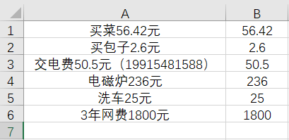

  - 确认已使用 VBA 自定义函数 `REGEXP`（详见 `文本函数` - `正则表达式`）

  - 在 B1 中输入公式 `=REGEXP(A1, "-?\d+\.?\d*(?=元)")`

    - `A1`：被提取的单元格
    - `-?\d+\.?\d*(?=元)`：正则表达式，匹配负数、正数、小数，并确保数字后紧跟“元”。
      - `-?`：匹配零个或一个负号，用来处理负数。
      - `\d+`：匹配一个或多个数字。
      - `\.?`：匹配零个或一个小数点（这里的 `\` 是转义字符）。
      - `\d*`：匹配零个或多个数字，用于小数部分。
      - `(?=元)`：是一个正向前瞻断言，用来确保数字后面紧跟着“元”字符，但不包含“元”本身。

  - 将公式向下填充，`B1:B6` 就会提取出对应的金额。

### 文本拆分

- 这是一个动态数组函数，在支持动态数组的 Excel 版本（如 Excel 365 和 2021）中可用。

- **语法**：基于指定的 `分隔符` 将文本拆分成 `多个部分`。

  ```vbscript
  =TEXTSPLIT("text", "col_delimiter", ["row_delimiter"], [ignore_empty], [match_mode])
  ```

  - `text`：要拆分的文本（可以是字符串或单元格引用）。
  - `col_delimiter`：用于分隔列的分隔符（如 `","`）。
  - `row_delimiter` _(可选)_：用于分隔行的分隔符（如 `";"`）。
  - `ignore_empty`(可选)：是否忽略空值：
    - `TRUE`（默认）：忽略空值。
    - `FALSE`：保留空值。
  - `match_mode`(可选)：是否区分大小写：
    - `0`（默认）：区分大小写。
    - `1`：不区分大小写。

- **应用**
  - 在 A1 中有如下字符串：`刘强东，马云，马化腾，比尔盖茨，巴菲特，马斯克`
  - 在 B1 中输入公式：`=TEXTSPLIT(A1, , "，")`
    - `A1`：要拆分的文本单元格
    - 第二个参数是列分隔符（留空）
    - 第三个参数是行分隔符（使用 `，`）
  - **结果**：在 `B1:B6` 分别生成各个名字

### 文本长度

- **语法**：计算 `文本字符串` 中的 `字符数`。

  ```vbscript
  =LEN("text")
  ```

  ```vbscript
  =LEN("中国北京")  ’ 4
  ```

  - 包含 `空格`、`换行符`、`制表符` 等

### 文本位置查找

- `文本位置查找`：用于查找一个文本在另一个文本中首次出现的位置。

- `FIND` 区分大小写。

- **语法**：`=FIND(查找文本, 被查找文本, [起始位置])`

  ```vbscript
  =FIND(find_text, within_text, [start_num])
  ```

  ```vbscript
  =FIND("北京", "中国北京上海")  ' 3
  ```

  - `start_num`（可选）：开始查找位置，默认 1。

- **注意事项**

  - 大小写敏感。
  - 不支持通配符。
  - 只能查找文本，不能查找 `数值格式的数字`。

- `FIND` 和 `SEARCH`
  - `FIND`：精确查找，区分大小写，不支持通配符。
  - `SEARCH`：粗略查找，不区分大小写，支持通配符。

### 文本替换

#### SUBSTITUTE

- **语法**：根据 `新文本` 替换 `旧文本`。

  ```vbscript
  =SUBSTITUTE(text, old_text, new_text, [instance_num])
  ```

  ```vbscript
  =SUBSTITUTE("中国北京上海", "北京", "天津")  ' 中国天津上海
  ```

  - `instance_num`（可选）：替换第几个，默认全替换。

#### REPLACE

- **语法**：`=REPLACE("文本", 起始位置, 替换字符数, "替换文本")`

  ```vbscript
  =REPLACE("old_text", start_num, num_chars, "new_text")
  ```

  ```vbscript
  =REPLACE("中国北京上海", 3, 2, "天津")
  ```

### 去除符号

#### 去除空格

- **语法**：去除文本 `开头和结尾的空格`，以及 `单词之间多余（保留一个）的空格`。

  ```vbscript
  =TRIM("text")
  ```

  ```vbscript
  =TRIM("  中国    北京    上海  ")  ' 中国 北京 上海
  ```

- 如果想去除所有空格，应使用 `空值` 替换 `空格`：

  ```vbscript
  =SUBSTITUTE("  中国    北京    上海  ", " ", "")  ' 中国北京上海
  ```

#### 去除非打印符

- **语法**：去除文本中的 `不可打印字符`（如换行符、回车符等），但 `不去除空格`。

  ```vbscript
  =CLEAN("text")
  ```

  ```vbscript
  =CLEAN("中国北京\n上海")  ' 中国北京上海
  ```

  - 这里的 `\n` 仅仅代表换行符。

### 大小写

- `UPPER`：`全文` 转 `大写`。

  ```vbscript
  =UPPER("Hello world!")  ' HELLO WORLD!
  ```

- `LOWER`：`全文`转 `小写`。

  ```vbscript
  =LOWER("Hello world!")  ' hello world!
  ```

- `PROPER`：`单词首字母` 转 `大写`。

  ```vbscript
  =PROPER("Hello world!")  ' Hello World!
  ```

### 正则表达式

- Excel 本身并不支持正则表达式，但可以借助 `VBA` 自定义正则表达式函数
- **语法**：`=REGEXP("文本", "正则表达式")`

- **VBA 自定义**

  - 打开 Excel，按 `Alt + F11` 进入 VBA 编辑器。

  - 点击 **插入 > 模块**，粘贴以下代码：

    ```vb
    Function REGEXP(Text As String, Pattern As String) As String
        Dim regex As Object
        Dim matches As Object
        Set regex = CreateObject("VBScript.RegExp")
        regex.Pattern = Pattern
        regex.Global = False
        regex.IgnoreCase = True
        If regex.Test(Text) Then
            Set matches = regex.Execute(Text)
            REGEXP = matches(0).Value
        Else
            REGEXP = ""
        End If
    End Function
    ```

  - 保存并关闭 VBA 编辑器。

  - 接下来即可在单元格中正常使用自定义函数 `REGEXP`

## 逻辑

### IF

- **语法**：根据 `逻辑条件`，返回 `不同的结果`。

  ```vb
  =IF(logical_test, "value_if_true", "value_if_false")
  ```

  ```vbscript
  =IF(1>0, "正确", "错误")  ' 正确
  ```

### IFS

- **IFS** 函数是 Excel（2016 及以上版本）中引入的一个逻辑函数。

- **语法**：根据 `多个逻辑条件`，返回 `第一个满足条件的结果`。

  ```vb
  =IFS(logical_test1, "value_if_true1", [logical_test2, "value_if_true2"], …)
  ```

  ```vbscript
  =IFS(0>1, "1", 0>2, "2", 1>0, "3")  ' 3
  ```

- **`IFS` 与 `IF嵌套` 对比**

  ```vb
  =IFS(A1>=90, "优秀", A1>=75, "良好", A1>=60, "及格", TRUE, "不及格")
  ```

  ```vb
  =IF(A1>=90, "优秀", IF(A1>=75, "良好", IF(A1>=60, "及格", "不及格")))
  ```

### AND

- **语法**：判断多个条件是否 `同时成立`，返回 `TRUE` 或 `FALSE`。

  ```vb
  =AND(logical1, [logical2], …)
  ```

  ```vbscript
  =AND(1>0, 2>1)  ' TRUE
  ```

### OR

- **语法**：判断多个条件是否 `至少一个成立`，返回 `TRUE` 或 `FALSE`。

  ```vb
  =OR(logical1, [logical2], …)
  ```

  ```vbscript
  =AND(1<0, 2>1)  ' TRUE
  ```

### NOT

- **语法**：对条件的逻辑值 `取反`，返回 `TRUE` 或 `FALSE`。

  ```vb
  =NOT(logical)
  ```

  ```vbscript
  =NOT(2>1)  ' FALSE
  ```

- **说明**

  - **空单元格** 被视为 FALSE。
  - **非零数字** 被视为 TRUE，0 被视为 FALSE。

### 结合使用

- IF 与 AND、OR、NOT 可结合使用

  ```vb
  =IF(AND(A1>60, B1>60), "及格", "不及格")
  ```

  ```vb
  =IF(OR(A1>=60, B1>=60), "通过", "未通过")
  ```

  ```vb
  =IF(NOT(A1="合格"), "需改进", "通过")
  ```

## 查找与引用

### ROW

#### ROW

- **语法**：返回单元格的 `行号`。

  ```vbscript
  =ROW([reference])
  ```

  ```vbscript
  =ROW()  ' 当前单元格的行号
  ```

  - **reference**（可选）：指定的单元格或单元格区域，默认为当前单元格。

- 与其它函数结合使用，可调整其它函数中的数字。

- **自动生成编号**

  - 在 `A2` 单元格输入 `=ROW() - 1`，则返回 `1`

#### ROWS

- **语法**：根据 `指定范围` 返回 `行数`。

  ```vbscript
  =ROWS(array)
  ```

  ```vbscript
  =ROWS(A1:A5)  ' 5
  ```

#### COLUMN

- **语法**：返回单元格的 `列号`。

  ```vbscript
  =COLUMN([reference])
  ```

  ```vbscript
  =COLUMN()  ' 当前单元格的列号
  ```

  - **reference**（可选）：指定的单元格或单元格区域，默认为当前单元格。

- 与其它函数结合使用，可调整其它函数中的数字。

#### COLUMNS

- **语法**：根据 `指定范围` 返回 `列数`。

  ```vbscript
  =COLUMNS(array)
  ```

  ```vbscript
  =COLUMNS(A1:C5)  ' 3
  ```

### VLOOKUP

- **语法**：根据 `查找值` 、`指定范围` 和 `对应列`，返回 `对应列的值`。

  ```vbscript
  =VLOOKUP(lookup_value, table_array, col_index_num, [range_lookup])
  ```

  ```vbscript
  =VLOOKUP("苹果", A:B, 2, FALSE)  ' 在 A:B 中查找 苹果，并返回第 2 列的值
  ```

  - `查找值` 必须在数据区域的 `第一列`。
  - `FALSE`：精确匹配。

- **示例**

  - 假设你有以下数据表，存放在 `A1:C6` 范围内：

    <table style="text-align: center;">
      <tr>
        <th>序号</th>
        <th>产品名称</th>
        <th>产品价格</th>
      </tr>
      <tr>
        <td>1</td>
        <td>苹果</td>
        <td>3</td>
      </tr>
      <tr>
        <td>2</td>
        <td>香蕉</td>
        <td>4</td>
      </tr>
      <tr>
        <td>3</td>
        <td>橙子</td>
        <td>5</td>
      </tr>
      <tr>
        <td>4</td>
        <td>葡萄</td>
        <td>6</td>
      </tr>
      <tr>
        <td>5</td>
        <td>西瓜</td>
        <td>2</td>
      </tr>
    </table>

  - 在新的区域创建下表

    <table style="text-align: center;">
      <tr>
        <th>产品名称</th>
        <th>产品价格</th>
      </tr>
      <tr>
        <td>苹果</td>
        <td></td>
      </tr>
      <tr>
        <td>橙子</td>
        <td></td>
      </tr>
      <tr>
        <td>西瓜</td>
        <td></td>
      </tr>
    </table>

  - 你想查找产品名称 `苹果` 对应的产品价格，并且 `苹果` 的单元格为 `E2`，那么，可以在 `F2` 中使用以下公式：

    ```vbscript
    =VLOOKUP(E2,B:C,2,FALSE)
    ```

  - 然后向下拖动填充，可以得到如下表格

    <table style="text-align: center;">
      <tr>
        <th>产品名称</th>
        <th>产品价格</th>
      </tr>
      <tr>
        <td>苹果</td>
        <td>3</td>
      </tr>
      <tr>
        <td>橙子</td>
        <td>5</td>
      </tr>
      <tr>
        <td>西瓜</td>
        <td>2</td>
      </tr>
    </table>

### HLOOKUP

- **语法**：根据 `查找值` 、`指定范围` 和 `对应行`，返回 `对应行的值`。

  ```vbscript
  =HLOOKUP(lookup_value, table_array, row_index_num, [range_lookup])
  ```

  ```vbscript
  =HLOOKUP("苹果", A:B, 2, FALSE)  ' 在 A:B 中查找 苹果，并返回第 2 行的值
  ```

  - `查找值`必须在数据区域的 `第一行`。
  - `FALSE`：精确匹配。

### MATCH

- **语法**：根据 `查找值` 和 `指定范围`，返回查找值的 `相对行号`。

  ```vbscript
  =MATCH(lookup_value, lookup_array, [match_type])
  ```

  ```vbscript
  =MATCH(50, A:A, 0)  ' 查找 50 在 A列 中的相对行号
  ```

  - 数据区域选查找值所在的一列即可
  - `0`：精确匹配

### INDEX

- **语法**：根据 `指定范围`、`行号` 和 `列号`，返回 `查找值`。

  ```vbscript
  =INDEX(array, row_num, [column_num])
  ```

  ```vbscript
  =INDEX(A:A, 2, 1)  ' 第 2 行、第 1 列的值
  ```

  - 数据区域选查找值所在的一列即可

- **示例（嵌套 MATCH）**

  - `MATCH` 可以获取到 `行号`，二者搭配可以替代 `VLOOKUP`

  - 假设你有以下的数据表格，存放在 `A1:C6` 范围内：

    <table style="text-align: center;">
      <tr>
        <th>序号</th>
        <th>产品名称</th>
        <th>产品价格</th>
      </tr>
      <tr>
        <td>1</td>
        <td>苹果</td>
        <td>3</td>
      </tr>
      <tr>
        <td>2</td>
        <td>香蕉</td>
        <td>4</td>
      </tr>
      <tr>
        <td>3</td>
        <td>橙子</td>
        <td>5</td>
      </tr>
      <tr>
        <td>4</td>
        <td>葡萄</td>
        <td>6</td>
      </tr>
      <tr>
        <td>5</td>
        <td>西瓜</td>
        <td>2</td>
      </tr>
    </table>

  - 在新的区域创建下表

    <table style="text-align: center;">
      <tr>
        <th>产品名称</th>
        <th>产品价格</th>
      </tr>
      <tr>
        <td>苹果</td>
        <td></td>
      </tr>
      <tr>
        <td>橙子</td>
        <td></td>
      </tr>
      <tr>
        <td>西瓜</td>
        <td></td>
      </tr>
    </table>

  - 你想查找产品名称 `苹果` 对应的产品价格，并且新表 `苹果` 的单元格为 `E2`，那么，可以在 `F2` 中使用以下公式：

    ```vbscript
    =INDEX(C:C,MATCH(E2,B:B,0))
    ```

  - 然后向下拖动填充，可以得到如下表格

    <table style="text-align: center;">
      <tr>
        <th>产品名称</th>
        <th>产品价格</th>
      </tr>
      <tr>
        <td>苹果</td>
        <td>3</td>
      </tr>
      <tr>
        <td>橙子</td>
        <td>5</td>
      </tr>
      <tr>
        <td>西瓜</td>
        <td>2</td>
      </tr>
    </table>

### CHOOSE

- **语法**：根据 `索引号`和 `待选值`，返回 `待选值`。

  ```vbscript
  =CHOOSE(index_num, value1, [value2], ...)
  ```

  ```vbscript
  =CHOOSE(2, "苹果", "香蕉", "橘子")  ' 香蕉
  ```

- **示例（嵌套 SUM）**

  - 假设你有以下的数据表格，存放在 `A1:F10` 范围内：

    <table style="text-align: center;">
      <tr>
        <th colspan="2">销售1部</th>
        <th colspan="2">销售2部</th>
        <th colspan="2">销售3部</th>
      </tr>
      <tr>
        <td>姓名</td>
        <td>业绩</td>
        <td>姓名</td>
        <td>业绩</td>
        <td>姓名</td>
        <td>业绩</td>
      </tr>
      <tr>
        <td>贾宝玉</td>
        <td>399</td>
        <td>宋江</td>
        <td>215</td>
        <td>唐僧</td>
        <td>274</td>
      </tr>
      <tr>
        <td>林黛玉</td>
        <td>243</td>
        <td>卢俊义</td>
        <td>396</td>
        <td>孙悟空</td>
        <td>340</td>
      </tr>
      <tr>
        <td>薛宝钗</td>
        <td>260</td>
        <td>吴用</td>
        <td>382</td>
        <td>猪八戒</td>
        <td>387</td>
      </tr>
      <tr>
        <td>刘姥姥</td>
        <td>381</td>
        <td>花荣</td>
        <td>262</td>
        <td>沙僧</td>
        <td>245</td>
      </tr>
      <tr>
        <td>贾迎春</td>
        <td>352</td>
        <td>武松</td>
        <td>230</td>
        <td>哪吒</td>
        <td>303</td>
      </tr>
      <tr>
        <td></td>
        <td></td>
        <td></td>
        <td></td>
        <td></td>
        <td></td>
      </tr>
      <tr>
        <td colspan="2">销售1部</td>
        <td colspan="2">销售2部</td>
        <td colspan="2">销售3部</td>
      </tr>
      <tr>
        <td colspan="2"></td>
        <td colspan="2"></td>
        <td colspan="2"></td>
      </tr>
    </table>

  - 其中第 9 行的销售 1、2、3 部，只输入 1、2、3，汉字部分为格式生成

  - 在 `A10` 输入如下公式

    ```vbscript
    =SUM(CHOOSE(A9,$B$3:$B$7,$D$3:$D$7,$F$3:$F$7))
    ```

  - 向右拖动填充 `C10` 和 `E10`，得到如下表格

    <table style="text-align: center;">
      <tr>
        <th colspan="2">销售1部</th>
        <th colspan="2">销售2部</th>
        <th colspan="2">销售3部</th>
      </tr>
      <tr>
        <td>姓名</td>
        <td>业绩</td>
        <td>姓名</td>
        <td>业绩</td>
        <td>姓名</td>
        <td>业绩</td>
      </tr>
      <tr>
        <td>贾宝玉</td>
        <td>399</td>
        <td>宋江</td>
        <td>215</td>
        <td>唐僧</td>
        <td>274</td>
      </tr>
      <tr>
        <td>林黛玉</td>
        <td>243</td>
        <td>卢俊义</td>
        <td>396</td>
        <td>孙悟空</td>
        <td>340</td>
      </tr>
      <tr>
        <td>薛宝钗</td>
        <td>260</td>
        <td>吴用</td>
        <td>382</td>
        <td>猪八戒</td>
        <td>387</td>
      </tr>
      <tr>
        <td>刘姥姥</td>
        <td>381</td>
        <td>花荣</td>
        <td>262</td>
        <td>沙僧</td>
        <td>245</td>
      </tr>
      <tr>
        <td>贾迎春</td>
        <td>352</td>
        <td>武松</td>
        <td>230</td>
        <td>哪吒</td>
        <td>303</td>
      </tr>
      <tr>
        <td></td>
        <td></td>
        <td></td>
        <td></td>
        <td></td>
        <td></td>
      </tr>
      <tr>
        <td colspan="2">销售1部</td>
        <td colspan="2">销售2部</td>
        <td colspan="2">销售3部</td>
      </tr>
      <tr>
        <td colspan="2">1635</td>
        <td colspan="2">1485</td>
        <td colspan="2">1549</td>
      </tr>
    </table>

  - 实现以 `A9` `C9` `E9` 为索引号，自动生成 `A10` `C10` `E10`的数据。

## 日期和时间

### 创建

#### DATE

- **语法**：根据 `年`、`月` 和 `日`，创建 `日期值`。

  ```vbscript
  =DATE(year, month, day)
  ```

  ```vbscript
  =DATE(2024, 11, 20)  ' 2024/11/20
  ```

- **注意**

  - `DATE` 函数会自动处理月份和日期超出范围的情况，自动换算到其它月份和日期。
  - Excel 不支持 1900 年之前的日期。

- **应用**

  - **自动生成日期**

    - 在 `A2` 单元格中输入公式：

      ```vbscript
      =DATE(2024, 11, 20) + ROW() -2  ' 2024/11/20
      ```

    - `设置单元格格式` - `数字` - `自定义` - `yyyy-mm-dd`，时间格式改为 `2024-10-31`
    - 向下自动填充
    - 可实现该列自动生成日期，并且删除某一行后，自动变更为连续日期

  - **计算指定日期的增量日期**

    ```vbscript
    =DATE(2024, 11, 20) + 100  ' 2024-11-20 后 100 天的日期
    ```

#### TIME

- **语法**：根据 `时`、`分` 和 `秒`，创建 `时间值`。

  ```vbscript
  =TIME(hour, minute, second)
  ```

  ```vbscript
  =TIME(17, 30, 30)  ' 5:30 PM
  ```

  - `TIME` 函数会自动处理超出范围的情况，自动换算到其它时间。

#### TODAY

- **语法**：`无参数` 创建当前日期的 `日期值`

  ```vbscript
  =TODAY()  ' 2024/11/20
  ```

- **注意**：`TODAY` 函数的结果会随着当前日期的变化而变化。

- **应用**

  - **获取当前日期**

    - 输入 `=TODAY()`，返回 `2024-11-03`

  - **计算当前日期的增量日期**

    - 输入 `=TODAY() + 30`，返回 30 天后的日期。

  - **计算距离当前日期的日期增量**

    - 输入 `=A1 - TODAY()`，返回 `A1` 距离当前日期的增量。

  - **条件格式化**
    - 可以使用 `TODAY` 函数作为条件格式化的条件，例如高亮显示过期的任务或即将到期的项目。

#### NOW

- **语法**：`无参数` 创建当前日期时间的 `日期时间值`

  ```vbscript
  =NOW()  ' 2024-11-20 17:30
  ```

- **注意**：`NOW` 函数的结果会随着当前日期时间的变化而变化。

### 转换

#### DATEVALUE

- **语法**：根据 `文本格式的日期`，返回 `序列号形式的日期`。

  ```vbscript
  =DATEVALUE("date_text")
  ```

  ```vbscript
  =DATEVALUE("2024-11-20")  ' 45616
  ```

  - 将返回单元格设置为日期格式，即显示 `2024/11/20`

#### TIMEVALUE

- **语法**：根据 `文本格式的时间` 返回 `小数形式的时间`。

  ```vbscript
  =TIMEVALUE("time_text")
  ```

  ```vbscript
  =TIMEVALUE("12:00")  ' 0.5
  ```

  - 将返回单元格设置为时间格式，即显示 `12:00:00`

### 提取

#### YEAR

- **语法**：根据 `任意格式的日期`，提取 `年份`。

  ```vbscript
  =YEAR(serial_number)
  ```

  ```vbscript
  =YEAR("2024-11-20")  ' 2024
  ```

#### MONTH

- **语法**：根据 `任意格式的日期`，提取 `月份`。

  ```vbscript
  =MONTH(serial_number)
  ```

  ```vbscript
  =MONTH("2024-11-20")  ' 11
  ```

#### WEEKDAY

- **语法**：根据 `任意格式的日期`，提取 `星期几编号`。

  ```vbscript
  =WEEKDAY(serial_number, [return_type])
  ```

  ```vbscript
  =WEEKDAY("2024-11-20")  ' 4
  ```

  - 将返回单元格格式设置为 `自定义` - `aaaa`，即显示 `星期三`
  - **[return_type]**（可选）：星期几的编号方式。默认方式 1，返回值 1 为星期日

#### DAY

- **语法**：根据 `任意格式的日期`，提取 `日份`。

  ```vbscript
  =DAY(serial_number)
  ```

  ```vbscript
  =DAY("2024-11-20")  ' 20
  ```

#### HOUR

- **语法**：根据 `任意格式的时间`，提取 `时`。

  ```vbscript
  =HOUR(serial_number)
  ```

  ```vbscript
  =HOUR("17:30:30")  ' 17
  ```

#### MINUTE

- **语法**：根据 `任意格式的时间`，提取 `分`。

  ```vbscript
  =MINUTE(serial_number)
  ```

  ```vbscript
  =MINUTE("17:30:30")  ' 30
  ```

#### SECOND

- **语法**：根据 `任意格式的时间`，提取 `秒`。

  ```vbscript
  =SECOND(serial_number)
  ```

  ```vbscript
  =SECOND("17:30:30")  ' 30
  ```

### 增量

#### DATEDIF

- **语法**：根据 `开始日期`、`结束日期` 和 `增量单位`，计算 `年/月/日增量`。

  ```vbscript
  =DATEDIF(start_date, end_date, "unit")
  ```

  ```vbscript
  =DATEDIF("2024-11-20", "2024-11-21", "D")  ' 1
  ```

  - **unit**：增量单位，常用的单位年月日：`"Y"` `"M"` `"D"`
  - 增量按整数算，例如不足 2 年按 1 年算

- **注意**

  - `DATEDIF` 是一个比较旧的函数，帮助文档中没有明确列出，但它仍然可用。
  - 使用时需要确保 `start_date` 比 `end_date` 早，否则可能会返回错误值。

#### YEARFRAC

- **语法**：根据 `开始日期` 和 `结束日期`，计算 `年增量`。

  ```vbscript
  =YEARFRAC(start_date, end_date, [basis])
  ```

  ```vbscript
  =YEARFRAC("2024-11-20", "2025-05-20")  ' 0.5
  ```

  - **[basis]**（可选）：用于计算的“年基准”，不用管。
  - 相比 `DATEDIF`，`YEARFRAC` 更精确，可计算出小数

#### NETWORKDAY

- **语法**：根据 `开始日期` 和 `结束日期`，计算 `工作日增量`。

  ```vbscript
  =NETWORKDAYS(start_date, end_date, [holidays])
  ```

  ```vbscript
  =NETWORKDAYS("2024-11-20", "2025-05-20")  ' 130
  ```

  ```vbscript
  =NETWORKDAYS("2024-11-20", "2025-05-20", {"2024-11-22", "2024-11-23"})  ' 129 （2024-11-23是周末）
  ```

  - 函数默认自动排除周末
  - **[holidays]**（可选）：一个日期范围或数组，表示要排除的 `其它假期`。
  - 当周末与其它假期重合时，会把其它假期当成周末处理，不会重复去除。

### 增量目标

#### EDATE

- **语法**：根据 `开始日期` 和 `月份增量`，计算 `增量目标日期`。

  ```vbscript
  =EDATE(start_date, months)
  ```

  ```vbscript
  =EDATE(2024-11-20, 1)  ' 45646
  ```

  - 将返回单元格设置为日期格式，即显示 `2024/12/20`

#### WORKDAY

- **语法**：根据 `开始日期` 和 `天数增量`，计算 `增量目标工作日`。

  ```vbscript
  =WORKDAY(start_date, days, [holidays])
  ```

  ```vbscript
  =NETWORKDAYS("2024-11-20", 100, {"2024-11-22", "2024-11-23"})  ' 45757
  ```

  - 将返回单元格设置为日期格式，即显示 `2025/4/10`

  - **[holidays]**（可选）：一个日期范围或数组，表示要排除的假期。详见 `NETWORKDAY`。

### 查数

#### WEEKNUM

- **语法**：根据 `任意格式的日期`，计算一年中的 `第几个星期`。

  ```vbscript
  =WEEKNUM(serial_number, [return_type])
  ```

  ```vbscript
  =WEEKNUM("2024-11-20")  ' 47
  ```

  - **[return_type]**（可选）：一个数字，指定一周的开始日期。它的默认值为 `1`，表示星期日是每周的第一天。

## 错误处理

- **错误处理**：`=IFERROR(A1/B1, "错误")`，如果 A1 除以 B1 出错，则返回“错误”。

## 其它函数

- 以上列举了常用函数，除此之外，还有一些不常用的专业函数

### 财务

- **贷款月还款**：`=PMT(rate, nper, pv)`，根据利率`rate`、期数`nper`和贷款总额`pv`计算月还款额。
- **未来价值**：`=FV(rate, nper, pmt)`，计算投资在指定期限后的未来价值。
- **净现值**：`=NPV(rate, value1, [value2], ...)`，基于指定折现率`rate`计算一系列现金流的净现值。
- **内部收益率**：`=IRR(values)`，计算投资的内部收益率。

### 统计

### 工程

### 多维数据集

### 信息

### 兼容性

### Web

# 数据管理

## 排序

- 排序功能可以按升序或降序排列数据，支持按单列或多列排序。
- `数据` - `排序`
  - 可使用 `RANK函数`，自动填写排序序号
- 选择要排序的数据，然后点排序
  - 如果只选择排序依据的一列，记得选择 `扩展选定区域`，否则其它列不会跟着一起动
  - 也可选择要排序的所有行
- `扩展选定区域`：会扩展到 `非空列`，即如果某列是空的，那么扩展就到此结束
- `添加条件`：可以添加多个层次的排序依据
- `选项`
  - `区分大小写`
  - `按列/行排序`
  - `按字母/笔画排序`
- `数据包含标题`：指定第一行数据是否跟着一起排序

## 筛选

- 筛选功能可以隐藏不符合条件的数据，只显示符合条件的数据。
- `数据` - `筛选`

### 基本筛选

- 基本筛选是对单一列设置筛选条件

  <div style="display: flex; justify-content: left;">
      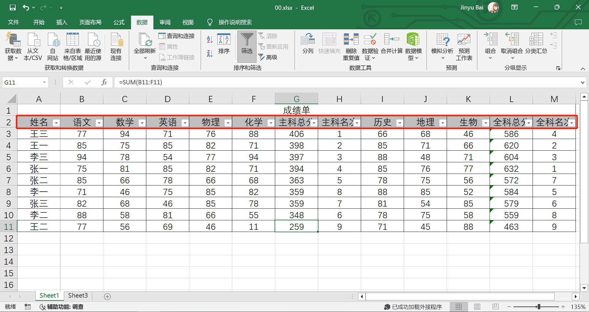
  </div>

- 选中所有行，选择 `筛选`，会在标题行出现下拉三角 `▽`

- `▽` 中选择 `数字筛选`，可设置筛选条件

### 高级筛选

- 高级筛选是对多个列设置筛选条件

  <div style="display: flex; justify-content: left;">
      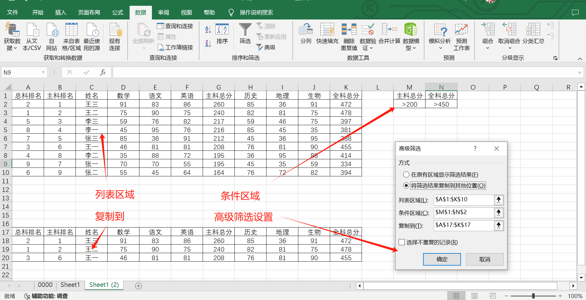
  </div>

- 创建条件区域

  - 在数据区域以外的空白区域（比如表格右侧或下方），创建一个小表格用于条件区域。
  - 在该表格的第一行输入与数据表对应的标题：在第一个单元格中输入“主科总分”，在第二个单元格中输入“主科总分”。
  - 在标题行下方的单元格中输入筛选条件：
    - 在“主科总分”列下输入“`>200`”。
    - 在“全科总分”列下输入“`>450`”。

- 选中任一单元格，选择 `高级`，选择 `条件区域`，框选刚才创建的条件区域

- 筛选结果显示

  - 如果想在原数据区域显示筛选结果，直接点确定
  - 如果想在新位置显示筛选结果，选择 `将筛选结果复制到其他位置`，选择 `复制到`，任意选择一个空白单元格，点确定

- 自动筛选数据，显示全科总分高于 450 且主科分数高于 220 的学生。

- 如果想用 `或` 条件筛选，可以在条件区域将条件分到不同的行。

  <div style="display: flex; justify-content: left;">
      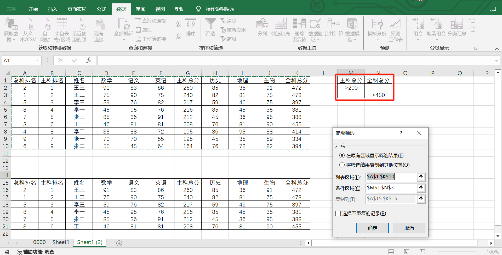
  </div>

## 分类汇总

分类汇总：某些相同分类的求和。数据——分类汇总——

- 注意：一定要先排序，把同类的都排在一起
- 汇总之后，左上方有 123，分别是各级的汇总。

三、条件格式：把符合条件的单元格改成统一的格式

- 选中查找区域——格式——条件格式——设定。

## 查找与替换

- **查找与替换**可以帮助用户快速找到特定的内容并进行替换。

### 查找

- **查找**：`Ctrl + F`，允许你在整个工作表中或选定区域内快速定位到某个特定的内容。
- **查找选项**
  - **区分大小写**：查找时会区分大小写。
  - **单元格匹配**：查找与输入的内容完全相同的单元格（即不会匹配部分内容，例如 `张` 和 `张三`）。
  - **范围**：选择是按工作表或整个工作簿范围查找。
  - **搜索**：选择是按行或列范围查找。
    - 不要使用这个功能，如果想实现此功能，应先选择整行/列，在 `工作表` 范围，然后查找
  - **查找范围**：选择是按公式、值或批注查找。
    - 如果想查的数据是公式算出来的，那么必须在 `查找范围` 内选择“值”。除非想查找公式，否则最好什么查找都选择“值”。
  - **格式**：可以查找特定格式的数据
- **通配符**：Excel 支持通配符查找，详见 `通配符`。
  - 使用时应勾选 `单元格匹配`，否则无法精确字数。

### 替换

- **替换**：可以将查找到的数据替换为新的数据。

- 替换与查找的选项类似。

- 关于公式计算结果

  - 所有的替换，只能查找到输入值，不能查找到公式计算出来的结果
  - 如果非得替换公式计算出来的结果，那么可以选中所有计算出来的单元格：`复制` - `选择性粘贴` - `数值`，这样就把单元格里的公式变成数值了，与公式计算没关系，就可以正常替换了。

- **技巧**

  - 想将 A 列内容填充进右侧区域

    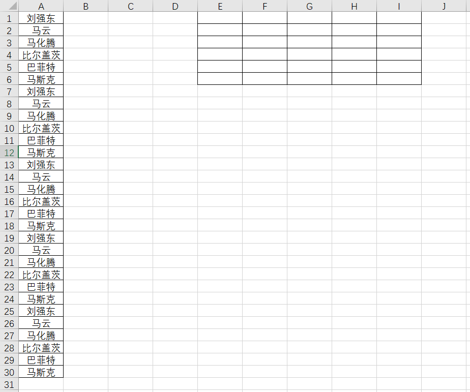

  - 在右侧填充左侧内容的单元格号

    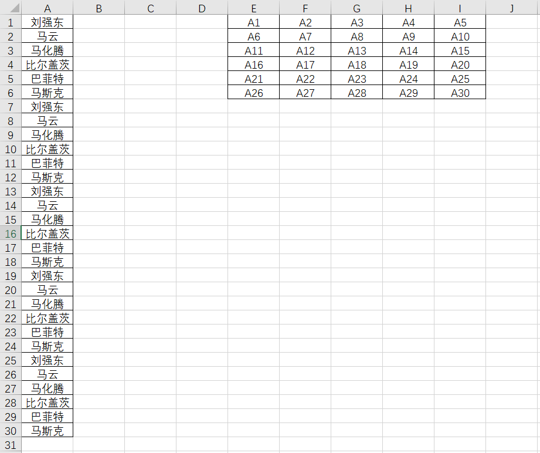

  - 将 `A` 替换成 `=A`，相当于 `E1` 中使用公式 `=A1`，即可实现在 `E1` 中引用 `A1`

    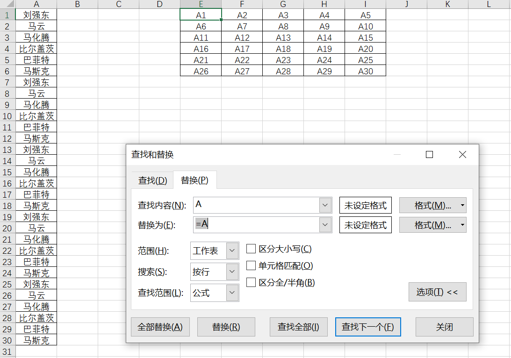

## 数据保护

- **保护**功能可以用来限制工作表、工作簿或单元格的访问和编辑权限，以防止他人误删、修改或查看敏感数据。

### 单元格保护

- **导航**
  - `功能区` - `开始` - `单元格` - `格式` - `设置单元格格式` - `保护`
  - `右键` - `设置单元格格式` - `保护`
- 锁定
  - 默认单元格为锁定模式，只有开启 `保护工作表` 后才会生效
  - 如果想在开启 `保护工作表` 后仍可以编辑某个单元格，可以取消该单元格的锁定格式
- 隐藏
  - 开启隐藏以后，并且在 `保护工作表` 的前提下，选中带有公式的单元格，编辑栏不会显示公式

### 允许用户编辑区域

- 允许编辑区域与取消单元格“锁定”效果一样
- `功能区` - `审阅` - `保护` - `允许用户编辑区域`

### 保护工作表

- **保护工作表**可以锁定特定的单元格或数据，防止被编辑。
- `功能区` - `审阅` - `保护` - `保护工作表`

  - 选择需要保护的内容，例如禁止“选择锁定单元格”、“格式化单元格”等。
  - 输入密码（可选），点击确定。

- 开启工作表保护以后
  - 该工作表已锁定的单元格不能更改受保护的内容。
  - 可以复制单元格至其它工作表，继而更改。

### 保护工作簿

- **保护工作簿**可以防止其他人删除、添加或移动工作表。
- `功能区` - `审阅` - `保护` - `保护工作簿`

  - 选择“结构”以保护工作簿结构（即工作表布置）。
  - 设置密码（可选），并确认。

- 开启工作簿保护以后
  - 无法再对工作簿结构进行更改。
  - 不可以复制工作簿中的工作表。
  - 可以复制和更改工作表中的内容（前提是未开启工作表保护）。

### 保护文件

#### 仅保留只读权限

- 启用“只读”保护可以防止他人对文件内容进行永久性更改。
- `功能区` - `文件` - `信息` - `保护工作簿` - `始终以只读方式打开`
- 再打开文件时，系统会询问读者是否加入编辑
  - 如果选择 `是`，则仍可以编辑。

#### 密码保护

- 通过为 Excel 文件添加密码来限制打开和编辑权限，防止未经授权的访问。
- `功能区` - `文件` - `信息` - `保护工作簿` - `用密码进行加密`
- 再打开文件需要密码
- 取消密码只需讲密码设置为空

### 数字签名

### 标记为最终版本

### 限制访问

- 需 Office 专业增强版

## 清除

- `功能区` - `开始` - `编辑` - `清除`
- 全部清除：清除格式和内容
- 清除格式
- 清除内容
- 清除批注
- 清除超链接（不含格式）
- 删除超链接（含格式）

## 分列

- **应用**

  - 在 A1 中有如下字符串：`刘强东，马云，马化腾，比尔盖茨，巴菲特，马斯克`
  - 选中单元格 `A1`，点击 **数据** 菜单中的 **分列**。
  - 在弹出的向导中：

    - 选择 **分隔符**，点击 **下一步**。
    - 勾选 **其它** 手动输入 `，`，点击 **完成**。

  - 数据会被拆分到同一行的多个单元格中（`A1:F6`）。
  - 如果需要按行显示：
    - 选中 `A1:F6` 复制。
    - 右键点击 `G1`，选择 **选择性粘贴 > 转置**。

# 视图

- “视图”选项卡包含了用于管理工作表显示方式的多种功能。通过调整视图设置，可以更好地查看和处理数据。

## 工作簿视图

- **普通视图**：Excel 默认的视图模式，适合数据输入和常规操作。
- **分页预览**：用于查看页边距和页面分割线，以便了解打印时页面的布局。可以拖动分割线调整页面范围。
- **分页布局**：直接预览每页的打印效果，包括页眉、页脚和页边距，非常适合打印前检查页面布局。
- **自定义视图**：可以保存特定的视图设置，比如隐藏行或列、筛选条件等，便于快速切换。

## 显示

- **网格线**：控制工作表中网格线的显示，关闭后可以得到干净的工作表外观，适合截图或打印。
- **标题**：控制列标题（A, B, C...）和行标题（1, 2, 3...）的显示，以便操作时参考位置。
- **编辑栏**：控制编辑栏（公式编辑区）的显示

## 缩放

- **缩放**：调整工作表的显示比例，可以放大或缩小以查看更多或更少内容。
- **100%**：恢复到默认的 100%比例。
- **选定区域缩放**：将当前选择区域放大到全屏显示，便于查看详细内容。
- 在屏幕右下角有调整缩放按钮

## 冻结窗格

冻结窗格，冻结某行，就是冻结它上面的所有行，冻结某列，就是冻结它左面的所有列，冻结某个单元格，就是冻结它上面和左面的所有行列

- **冻结顶端行**：锁定工作表的第一行，在滚动时保持标题行可见。
- **冻结首列**：锁定第一列，以便横向滚动时可以随时看到这一列的数据。
- **冻结窗格**：可以选择任意行或列作为冻结起点，适合多区域数据表格。

## 工作区安排

- **新建窗口**：为 `同一个` 工作簿创建多个窗口，适合同时查看工作簿的不同部分。
- **并排查看**：同时显示两个窗口，以便比较不同工作簿或同一工作簿的不同工作表内容。
- **拆分**：将工作表分成独立的区域，便于在一张表中上下或左右滚动查看不同数据。
- **切换窗口**：在同一 Excel 会话中打开多个工作簿时，使用此选项可以快速切换到不同的工作簿窗口。

# 数据可视化

## 图表

- 选中数据（包括标题）
- `插入` - 选择相应类型的图表 - 生成新图表

# 数据分析

## 数据透视表

## What-If 分析工具

## 宏

- 宏是使用 VBA（Visual Basic for Applications）语言编写的，由一系列命令或操作组成的小程序，可以在 Excel 中自动运行，用于完成复杂或重复性高的任务。
- `文件` - `选项` - `自定义功能区` - `开发工具` - `宏`
- 宏实际就是一系列操作的封装，可以在后续操作中恢复数据的内容和格式等。
- 与撤销不同，宏只会在后续对宏记录的操作进行恢复，而不会恢复宏未记录的操作

### 使用

- **制作宏**
  - `录制宏`
  - 操作数据
  - `停止录制`
- **使用宏**
  - 数据经过更改
  - `查看宏`
  - 选择待恢复数据的宏
  - `执行`
  - 被更改的数据恢复至宏中记录的状态

# VBA

- **VBA 编辑器**（全称：Visual Basic for Applications Editor）是 Microsoft Office 应用程序（如 Excel、Word、PowerPoint、Access）中用于编写、编辑和调试 VBA 代码的工具。
- `功能区` - `开发者工具` - `Visual Basic`
- `Alt + F11`

## 创建自动化任务

## 开发自定义函数

- 编写 Excel 中不存在的函数以解决特定问题。

## 与外部文件交互

## 创建带控件的表单

# 加载项

## 加载项基础

- “加载项”是一种插件或附加工具，能够提供额外的功能和功能增强。
  - `文件` - `选项` - `加载项`
  - `开始` - `加载项`
- **分类**
  - **内置加载项**：Excel 自带的一些加载项，比如“分析工具库”、“Solver 求解工具”等。
  - **COM 加载项**：基于组件对象模型（COM）的加载项，可以增强 Excel 的功能，如与 Outlook 等 Office 组件的协作。
  - **Office 商店加载项**：微软的 Office 商店提供的加载项，可以在 Excel 中直接在线安装。
  - **第三方加载项**：来自其他开发者或公司提供的加载项，如财务分析、图表增强或数据处理工具。
- **启用内置加载项**

  - **打开加载项管理器**：点击“文件” > “选项” > “加载项”。
  - **选择加载项类型**：在窗口底部的“管理”下拉菜单中，选择“Excel 加载项”或“COM 加载项”，然后点击“转到”。
  - **勾选加载项**：在弹出的窗口中，勾选要启用的加载项（例如“分析工具库”），然后点击“确定”即可启用。

- **从 Office 商店获取加载项**

  - `开始` - `加载项`
  - 进入 Office 加载项商店，浏览或搜索所需的加载项。
  - 找到想要的加载项后，点击“添加”并按提示完成安装。

- **安装外部加载项文件（.xlam、.xla）**

  - 下载加载项文件（通常为 `.xlam` 或 `.xla` 格式）。
  - `文件` - `选项` - `加载项`
  - 选择“Excel 加载项”后点击“转到”。
  - 点击“浏览”，选择下载的加载项文件，然后点击“确定”即可加载。

- **卸载 Office 商店加载项**
  - `开始` - `加载项` - `更多加载项` - `我的加载项`
  - `右键` - `删除`。

# 实用方法

## 自动编号

- 使用 `ROW` 函数
- 例：在 `A2` 单元格输入 `=ROW() - 1`，则返回 `1`

## 自动日期

- 使用 `DATE` 和 `ROW` 函数
- 例：在 `A2` 单元格输入 `=DATE(2024, 1, 1) + ROW() - 2` ，则返回 `2024-01-01`（需要设置单元格数字格式为自定义时间格式）。
  - `2` 为开始添加日期的行号

## 自动月份

- 在 `B4` 手动输入 `202401`，数字格式设置为 `0000-00`，则返回 `2024-01`
- 在 `B5` 输入公式 `=B$4 + ROW() - 4`，数字格式设置为 `0000-00`，则返回 `2024-02`
- 从 `B5` 向下填充

## 等差数列

- 要实现拖动公式时，公式中的某个数值（如 `1.1`）按等差数列递减，可以利用行号的差值和公差乘积。
- 假设你希望在单元格 A1 中输入公式 `=B$31 * 1.1`，并希望在拖动时 `1.1` 以 `0.05` 递减
- 在 A1 单元格中输入以下公式：`=B$31 * (1.1 - (ROW(A1)-ROW($A$1))*0.05)`
  - `B$31` 为 31 行固定的数
  - `ROW(A1)` 返回 A1 单元格的行号
  - `ROW($A$1)` 返回起始单元格的行号

## 自动对齐

- 两个字和三个字的姓名，自动对齐
- `右键` - `设置单元格格式` - `水平对齐` - `分散对齐`，`缩进` 设置为 `1`
- 调整列宽
