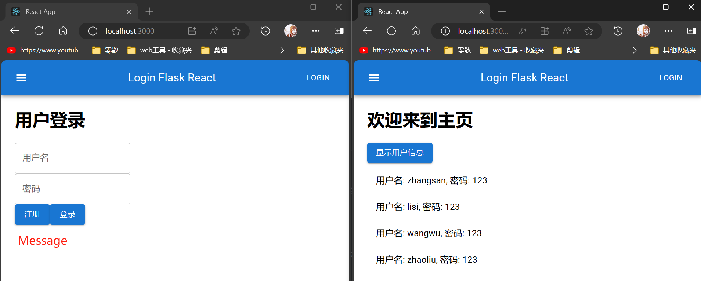

# Flask

**Flask** 是一个轻量级的 Python Web 框架，适用于构建小型到中型规模的 Web 应用程序和 API。

**Flask 核心功能**：

- **模板引擎**：通常使用 Jinja2。
- **URL 路由**：在视图中直接定义路由。
- **ORM（对象关系映射）**：使用 SQLAlchemy（可选）。

# Flask 结构

## Flask 简单结构

此结构是 Flask 框架最基础的结构，用于开发小型项目。

### Flask 简单结构基础

- **特点**

  - 直接使用 Flask 的默认目录结构
  - 路由、模型、配置都在 `app.py` 一个文件里

- **目录结构**

  ```
  my_project/           # 项目根目录
  ├── templates/        # 模板目录：存放所有HTML模板
  ├── static/           # 静态文件目录：存放CSS、JS、图片等
  └── app.py            # 主程序文件
  ```

- **主程序文件**：`app.py`

  ```python
  # 导入 Flask 类和 render_template 函数
  from flask import Flask, render_template
  
  # 创建 Flask 应用实例
  app = Flask(__name__)
  
  # 定义主页路由
  @app.route('/')  # 路由装饰器
  def home():  # 视图函数
      # 渲染index.html模板
      return render_template('index.html')
  
  # 运行主程序
  if __name__ == '__main__':
      app.run(debug=True)
  ```

  **在以上代码中**：

  - **`Flask`**：类，用于创建应用实例。
  - **`__name__`**：用于确定应用的根路径；Flask 使用这个路径来查找资源和模板。
  - **`@app.route('/')`**：路由装饰器，用于定义访问路径。
  - **`render_template`**：用于渲染 HTML 模板。
  - 当用户访问应用的根路径 `/` 时，调用 `home()` 函数。
  - **`home()`** 函数通过 **`render_template('index.html')`** 渲染并返回名为 `index.html` 的模板文件。
  - **`if __name__ == '__main__':`**：这部分代码保证了当脚本作为主程序运行时启动 Flask 应用。
  - **`app.run(debug=True)`**：启动 Flask 服务器。
  - **`debug=True`**：开启 **调试模式**，即 **热重载**，这样可以实时查看更改并调试错误。

- **模板文件**：`index.html`

  ```html
  <!DOCTYPE html>
  <html lang="en">
    <head>
      <meta charset="UTF-8" />
      <meta name="viewport" content="width=device-width, initial-scale=1.0" />
      <title>Home</title>
      <!-- 动态引入 CSS 样式表 -->
      <link
        rel="stylesheet"
        href="{{ url_for('static', filename='styles.css') }}"
      />
    </head>
  
    <body>
      <h1>Welcome to Flask</h1>
      <!-- 动态引入 JavaScript 脚本 -->
      <script src="{{ url_for('static', filename='script.js') }}"></script>
    </body>
  </html>
  ```

  **在以上代码中**：

  - **`{{ url_for('static', filename='script.js') }}`**：动态引用静态文件，详见[动态路径 `url_for`](#动态路径 `url_for`)。

### Flask 简单结构初始化脚本

- 此初始化脚本是自己创建的，用于自动创建虚拟环境和 Flask 框架简单结构。

- 在 `my_projects` 文件夹中随便创建一个 `.py` 文件，将如下脚本复制进去，运行脚本，会自动生成虚拟环境和 Flask 框架简单结构。

- **注意**：

  - 执行脚本前，关闭所有终端，重新进入终端，查看当前目录确实是本项目目录。
  - 执行脚本之后，手动激活虚拟环境（Bash）：`source venv/Scripts/activate`。

- **目录结构**

  ```
  my_project/
  ├── templates/
  │    ├── base.html
  │    └── index.html
  ├── static/
  │    ├── img/
  │    ├── style.css
  │    └── script.js
  └── app.py
  ```

- **初始化脚本**

  ```python
  import os
  import subprocess
  import sys
  
  # 创建并激活虚拟环境
  def create_and_activate_virtual_environment():
      # 虚拟环境目录名称
      venv_dir = "venv"
  
      # 检查虚拟环境是否已存在
      if os.path.exists(venv_dir):
          print(f"虚拟环境 '{venv_dir}' 已存在。")
      else:
          # 创建虚拟环境
          subprocess.run([sys.executable, "-m", "venv", venv_dir], check=True)
          print(f"虚拟环境 '{venv_dir}' 已创建")
  
      # 激活虚拟环境
      activate_script = os.path.join(venv_dir, "Scripts", "activate") if os.name == "nt" else os.path.join(venv_dir, "bin", "activate")
      return activate_script
  
  # 安装 Flask
  def install_flask(activate_script):
      if os.name == "nt":
          # 定义命令：激活虚拟环境，并安装 Flask
          # Windows
          command = f"{activate_script} && pip install flask"
      else:
          # Linux/Mac
          command = f"source {activate_script} && pip install flask"
  
      # 在 Python 脚本中，不能像在命令行中那样使用 source venv/bin/activate 或 venv/Scripts/activate 来激活虚拟环境。
      # 因为一旦脚本执行完成，所有的环境变量变化（比如虚拟环境激活）都会丢失。
      # 为了在 Python 脚本中使用虚拟环境，可以通过执行一个子进程，同时激活虚拟环境并安装所需的包。
  
      # 使用命令：激活虚拟环境，并安装 Flask
      subprocess.run(command, shell=True, check=True)
      print("Flask 已安装！")
  
  # 创建目录结构
  def create_project_structure():
      # 定义目录结构
      folders = [
          "templates",
          "static",
          "static/img"
      ]
  
      # 定义文件
      files = {
          "templates/base.html": (
              "<!DOCTYPE html>\n"
              "<html>\n\n"
              "<head>\n"
              "  <meta charset=\"UTF-8\">\n"
              "  <meta name=\"viewport\" content=\"width=device-width, initial-scale=1.0\">\n"
              "  <title></title>\n"
              "  <link rel=\"stylesheet\" href=\"{{ url_for('static', filename='style.css') }}\">\n"
              "</head>\n\n"
              "<body>\n"
              "  \n"
              "  <script src=\"{{ url_for('static', filename='script.js') }}\"></script>\n"
              "</body>\n\n"
              "</html>\n"
          ),
          "templates/index.html": (
              "\n\n"
              "主页\n\n"
              "\n"
              "  <h1>欢迎来到主页</h1>\n"
              "\n"
          ),
          "static/style.css": "",
          "static/script.js": "",
          "app.py": (
              "from flask import Flask, render_template\n\n"
              "app = Flask(__name__)\n\n"
              "@app.route('/')\n"
              "def home():\n"
              "    return render_template('index.html')\n\n"
              "if __name__ == '__main__':\n"
              "    app.run(debug=True)\n"
          ),
      }
  
      # 创建目录
      for folder in folders:
          os.makedirs(folder, exist_ok=True)
  
      # 创建文件并写入内容
      for file_path, content in files.items():
          with open(file_path, "w", encoding="utf-8") as file:
              file.write(content)
  
      print("目录结构已生成！")
  
  def main():
      # 第一步：创建并定义激活虚拟环境
      activate_script = create_and_activate_virtual_environment()
  
      # 第二步：激活虚拟环境，并安装 Flask
      install_flask(activate_script)
  
      # 第三步：创建目录和文件
      create_project_structure()
  
      # 添加使用提示
      print("\n项目已创建完成！")
      if os.name == "nt":
          print("\n请手动激活虚拟环境（Bash）：source venv/Scripts/activate")
      else:
          print("\n激活虚拟环境：source venv/bin/activate")
  
  if __name__ == "__main__":
      main()
  ```

## Flask 工厂结构

此结构是 Flask 框架的工厂结构，用于开发中大型项目。

### Flask 工厂结构基础

- **特点**

  - 工厂结构将简单结构中的 `app.py` 拆解成各个模块化的 `.py` 文件。
  - 将除了 `config.py` 和 `run.py` 的文件，放入 `app` 目录下，组成一个应用包。

- **目录结构**

  ```
  my_project/                           # 项目根目录
  ├── app/                              # 应用包目录
  │   ├── __init__.py                   # 初始化文件：创建Flask应用，初始化扩展
  │   ├── models.py                     # 数据库模型：定义User类等数据库表结构
  │   ├── routes.py                     # 路由文件：处理所有URL请求（登录、注册等）
  │   ├── templates/                    # 模板目录：存放所有HTML模板
  │   └── static/                       # 静态文件目录：存放CSS、JS、图片等
  ├── config.py                         # 配置文件：数据库配置，密钥等
  └── run.py                            # 启动文件：运行Flask应用的入口点
  ```

- **初始文件 `app/_init_.py`**

  ```python
  # 导入必要的模块
  from flask import Flask  # Flask核心类
  from config import Config  # 导入配置类
  
  def create_app():
      # 创建Flask应用实例
      app = Flask(__name__)
      # 从配置类加载配置
      app.config.from_object(Config)
  
      # 导入并注册蓝图（路由）
      from app.routes import main  # 导入routes.py创建的蓝图对象
      app.register_blueprint(main)  # 注册到应用
  
      return app
  ```

- **路由文件 `routes.py`**

  ```python
  from flask import Blueprint, render_template
  
  # 创建蓝图对象
  main = Blueprint('main', __name__)
  
  # 定义主页路由
  @main.route('/')  # 路由装饰器
  def home():
      return render_template('index.html')
  ```

- **配置文件 `config.py`**

  ```python
  class Config:
      # 基础配置
      SECRET_KEY = 'dev'  # 用于加密session和cookies的密钥
  ```

- **启动文件 `run.py`**

  ```python
  # 从app包中导入create_app函数
  from app import create_app
  
  # 创建应用实例
  app = create_app()
  
  # 只有直接运行此文件时才执行
  if __name__ == '__main__':
      # 启动Flask开发服务器，开启调试模式
      app.run(debug=True)
  ```

### Flask 工厂结构初始化脚本

- 此初始化脚本是自己创建的，用于自动创建虚拟环境和 Flask 框架工厂结构。

- 在 `my_projects` 文件夹中随便创建一个 `.py` 文件，将如下脚本复制进去，运行脚本，会自动生成虚拟环境和 Flask 框架工厂结构。

- **注意**：

  - 执行脚本前，关闭所有终端，重新进入终端，查看当前目录确实是本项目目录。
  - 执行脚本之后，手动激活虚拟环境（Bash）：`source venv/Scripts/activate`。

- **工厂结构**

  ```
  my_project/
  ├── app/
  │   ├── __init__.py
  │   ├── routes.py
  │   ├── static/
  │   │   ├── css/
  │   │   │   └── style.css
  │   │   ├── js/
  │   │   │   └── script.js
  │   │   └── img/
  │   └── templates/
  │       ├── base.html
  │       └── index.html
  ├── config.py
  └── run.py
  ```

- **初始化脚本**

  ```python
  import os
  import subprocess
  import sys
  
  # 创建并激活虚拟环境
  def create_and_activate_virtual_environment():
      # 虚拟环境目录名称
      venv_dir = "venv"
  
      # 检查虚拟环境是否已存在
      if os.path.exists(venv_dir):
          print(f"虚拟环境 '{venv_dir}' 已存在。")
      else:
          # 创建虚拟环境
          subprocess.run([sys.executable, "-m", "venv", venv_dir], check=True)
          print(f"虚拟环境 '{venv_dir}' 已创建")
  
      # 激活虚拟环境
      activate_script = os.path.join(venv_dir, "Scripts", "activate") if os.name == "nt" else os.path.join(venv_dir, "bin", "activate")
      return activate_script
  
  # 安装 Flask
  def install_flask(activate_script):
      if os.name == "nt":
          # 定义命令：激活虚拟环境，并安装 Flask
          # Windows
          command = f"{activate_script} && pip install flask"
      else:
          # Linux/Mac
          command = f"source {activate_script} && pip install flask"
  
      # 在 Python 脚本中，不能像在命令行中那样使用 source venv/bin/activate 或 venv/Scripts/activate 来激活虚拟环境。
      # 因为一旦脚本执行完成，所有的环境变量变化（比如虚拟环境激活）都会丢失。
      # 为了在 Python 脚本中使用虚拟环境，可以通过执行一个子进程，同时激活虚拟环境并安装所需的包。
  
      # 使用命令：激活虚拟环境，并安装 Flask
      subprocess.run(command, shell=True, check=True)
      print("Flask 已安装！")
  
  # 创建目录结构
  def create_project_structure():
      # 定义目录结构
      folders = [
          "app",
          "app/templates",
          "app/static",
          "app/static/css",
          "app/static/js",
          "app/static/img"
      ]
  
      # 定义文件
      files = {
          "config.py": (
              "class Config:\n"
              "    SECRET_KEY = 'dev'\n"
          ),
          "app/__init__.py": (
              "from flask import Flask\n"
              "from config import Config\n\n"
              "def create_app():\n"
              "    app = Flask(__name__)\n"
              "    app.config.from_object(Config)\n"
              "    \n"
              "    from app.routes import main\n"
              "    app.register_blueprint(main)\n"
              "    \n"
              "    return app\n"
          ),
          "app/routes.py": (
              "from flask import Blueprint, render_template\n\n"
              "main = Blueprint('main', __name__)\n\n"
              "@main.route('/')\n"
              "def home():\n"
              "    return render_template('index.html')\n"
          ),
          "app/templates/base.html": (
              "<!DOCTYPE html>\n"
              "<html>\n\n"
              "<head>\n"
              "  <meta charset=\"UTF-8\">\n"
              "  <meta name=\"viewport\" content=\"width=device-width, initial-scale=1.0\">\n"
              "  <title></title>\n"
              "  <link rel=\"stylesheet\" href=\"{{ url_for('static', filename='style.css') }}\">\n"
              "</head>\n\n"
              "<body>\n"
              "  \n"
              "  <script src=\"{{ url_for('static', filename='script.js') }}\"></script>\n"
              "</body>\n\n"
              "</html>\n"
          ),
          "app/templates/index.html": (
              "\n\n"
              "主页\n\n"
              "\n"
              "  <h1>欢迎来到主页</h1>\n"
              "\n"
          ),
          "run.py": (
              "from app import create_app\n\n"
              "app = create_app()\n\n"
              "if __name__ == '__main__':\n"
              "    app.run(debug=True)\n"
          ),
          "app/static/css/style.css": "",
          "app/static/js/script.js": ""
      }
  
      # 创建目录
      for folder in folders:
          os.makedirs(folder, exist_ok=True)
  
      # 创建文件并写入内容
      for file_path, content in files.items():
          with open(file_path, "w", encoding="utf-8") as file:
              file.write(content)
  
      print("\n目录结构已生成！")
  
  def main():
      # 第一步：创建并定义激活虚拟环境
      activate_script = create_and_activate_virtual_environment()
  
      # 第二步：激活虚拟环境，并安装 Flask
      install_flask(activate_script)
  
      # 第三步：创建目录和文件
      create_project_structure()
  
      # 添加使用提示
      print("\n项目已创建完成！")
      if os.name == "nt":
          print("\n请手动激活虚拟环境（Bash）：source venv/Scripts/activate")
      else:
          print("\n激活虚拟环境：source venv/bin/activate")
  
  if __name__ == "__main__":
      main()
  ```

# 蓝图

- 蓝图是 Flask 的一个功能，用于组织一组相关的视图、模板和静态文件。

- 例如：可以把它理解为一个迷你的应用，包含了一组路由。

- **蓝图的优点**

  - **模块化**：可以把不同功能的路由分组
  - **可重用**：蓝图可以在多个应用中重复使用
  - **URL 前缀**：可以为一组路由添加统一的 URL 前缀

- **蓝图完整的流程**（以路由为例）

  ```
  1. routes.py:     创建蓝图对象 (main = Blueprint('main', __name__)
  2. __init__.py:   导入蓝图对象 (from app.routes import main)
  3. __init__.py:   注册到应用   (app.register_blueprint(main))
  ```

# Flask 项目

## [Login Flask Txt HTML](projects.md#Login Flask Txt HTML)


## [Login Flask React](projects.md#Login Flask React)



