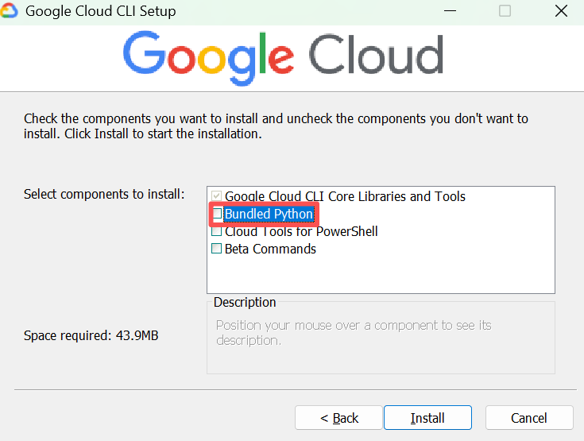

# GCP

[**GCP**](https://docs.cloud.google.com/docs/overview?hl=zh-cn) （Google Cloud Platform）是谷歌提供的一套云计算服务。

> [Google Cloud 文档](https://docs.cloud.google.com/?hl=zh-cn)
>
> [Google Cloud 使用入门](https://docs.cloud.google.com/docs/get-started?hl=zh-cn)
>
> [Google Cloud 产品](https://cloud.google.com/products?hl=zh-cn&_gl=1*xq66jx*_ga*MTYwMDY0NjE4Ni4xNzYxNTY3Mjky*_ga_WH2QY8WWF5*czE3NjU4MDQ4MDkkbzgkZzEkdDE3NjU4MDc0NTQkajI5JGwwJGgw)

## Quick Start

- 安装 Google Cloud CLI
- 

# Google Cloud CLI

[Google Cloud CLI](https://cloud.google.com/sdk/gcloud?hl=zh-cn) 是 Google Cloud 的命令行工具。

## Install

> [安装 Google Cloud CLI](https://docs.cloud.google.com/sdk/docs/install-sdk?hl=zh-cn)

### Windows

- 下载并安装 [Google Cloud CLI](https://dl.google.com/dl/cloudsdk/channels/rapid/GoogleCloudSDKInstaller.exe?hl=zh-cn)

  如果电脑已安装 Python，可以不选择 `Bundled Python`。

  

- 安装之后会出现 Google Cloud SDK Shell 应用

- 关闭 SDK Shell 和全部 Terminal，重新打开 Terminal 初始化 Google Cloud。

  ```bash
  gcloud init
  ```

- 根据提示选择并在浏览器中登录 Google

### Linux

- [根据操作系统选择安装 Google Cloud CLI](https://cloud.google.com/sdk/docs/install?hl=zh-cn)

- 进入 User 目录

- 下载 Linux 归档文件

  ```bash
  curl -O https://dl.google.com/dl/cloudsdk/channels/rapid/downloads/google-cloud-cli-469.0.0-linux-x86_64.tar.gz
  ```

- 解压

  ```bash
  tar -xf google-cloud-cli-469.0.0-linux-x86_64.tar.gz
  ```

- 将 gcloud CLI 添加到路径

  ```bash
  ./google-cloud-sdk/install.sh
  ```

- 初始化

  ```bash
  ./google-cloud-sdk/bin/gcloud init
  ```

  - 选择第 2 项：Log in with a new account
  - 点击输出的网址，跳转到网页获取 authorization code，并粘贴回至 bash
  - 选择项目，目前项目为 true-oasis-418914
  - 选择默认区域：上次选 [48] asia-east2-b

- 安装 kubectl

  ```bash
  # 成功过的方法一
  gcloud components install kubectl
  ```

  ```bash
  # 成功过的方法二
  sudo apt-get update
  # 安装 kubectl
  sudo snap install kubectl --classic
  # 添加环境变量
  export PATH=$PATH:/snap/bin
  # 验证安装
  kubectl version --client
  # 安装插件
  sudo apt-get install google-cloud-cli-gke-gcloud-auth-plugin
  ```

## Uninstall

- [卸载 Google Cloud CLI](https://cloud.google.com/sdk/docs/uninstall-cloud-sdk?hl=zh-cn)

- 运行以下命令查找您的安装目录；

  ```bash
  gcloud info --format='value(installation.sdk_root)'
  ```

- 手动打开安装目录，点击 `unistall` 卸载；

- 运行以下命令查找您的用户配置目录；

  ```bash
   gcloud info --format='value(config.paths.global_config_dir)'
  ```

- 手动删除用户配置目录。

# Gcloud Reference

> [gcloud Reference](https://docs.cloud.google.com/sdk/gcloud/reference)

## 语法

```bash
gcloud $GROUP | $COMMAND [$FLAGS]
gcloud container clusters create-auto jerry-cluster --region=asia-east2
```

## 账户

```bash
# 查看登录账户
gcloud auth list
# 切换登录账户
gcloud config set account $YOUR_ACCOUNT
# 查看当前区域
gcloud config get-value compute/region
```

## 项目

```bash
# 查看当前项目ID
gcloud config get-value project
# 查看当前项目
gcloud config list project
# 查看所有项目
gcloud projects list
# 删除项目
gcloud projects delete $PROJECT_ID
# 切换项目
gcloud config set project $PROJECT_ID
```

## 镜像

```bash
# 创建镜像
gcloud builds submit --tag us-central1-docker.pkg.dev/PROJECT_ID/REPO_NAME/IMAGE_NAME .
# 查看仓库镜像
gcloud artifacts docker images list LOCATION-docker.pkg.dev/PROJECT_ID/REPO_NAME
```

## 仓库

```bash
# 创建仓库
gcloud artifacts repositories create REPO_NAME --project=$PROJECT_ID --repository-format=docker --region=LOCATION --description="MESSAGE"
# 查看仓库
gcloud artifacts repositories list
# 删除仓库
gcloud artifacts repositories delete REPO_NAME --region=$REGION --project=$PROJECT_ID
```

## 集群

```bash
# 创建集群
gcloud container clusters create-auto $CLUSTER_NAME --region=$REGION
# e.g.
gcloud container clusters create-auto jerry-cluster --region=asia-east2
# 查看集群
gcloud container clusters list
# 删除集群
gcloud container clusters delete $CLUSTER_NAME --region=$REGION
# 停止集群
gcloud container clusters resize $CLUSTER_NAME --size=0 --zone=$REGION
```

## 实例

```bash
# 查看项目中的实例
gcloud compute instances list --project=$PROJECT_ID
```

# Bare Metal

[**Bare Metal**](https://cloud.google.com/bare-metal/docs/bms-setup?hl=zh-cn)（裸金属）是指未经虚拟化的物理服务器，即裸机。在裸金属服务器上运行的操作系统直接安装在物理硬件上，而不是在虚拟化层上运行。

## 准备工作

- Google Cloud 控制台中的项目选择器页面上创建项目，并启用 API。

- [创建 VPC 网络](https://cloud.google.com/vpc/docs/create-modify-vpc-networks?hl=zh-cn#gcloud)

  ```bash
  # 创建
  gcloud compute networks create $VPC_NETWORK_NAME \
      --subnet-mode=auto \
      --bgp-routing-mode=$DYNAMIC_ROUTING_MODE \
      --mtu=$MTU
  
  # 删除
  gcloud compute networks delete $VPC_NETWORK_NAME
  ```

  ```bash
  # EG
  gcloud compute networks create my-vpc-network-1 \
      --subnet-mode=auto \
      --bgp-routing-mode=global \
      --mtu=1460
  ```

## 创建 VLAN 连接

- 按照以下步骤为 Cloud Interconnect 连接[创建 VLAN 连接](https://cloud.google.com/bare-metal/docs/bms-setup?hl=zh-cn#bms-vlan-attachments)

- 创建两个 Cloud Router 实例

  ```bash
  gcloud compute routers create $ROUTER_NAME \
      --network $VPC_NETWORK_NAME \
      --asn 16550 \
      --region $REGION
  ```

  ```bash
  # EG
  gcloud compute routers create my-router-1 \
      --network my-vpc-network-1 \
      --asn 16550 \
      --region us-central1
  
  gcloud compute routers create my-router-2 \
      --network my-vpc-network-1 \
      --asn 16550 \
      --region us-central1
  ```

- 创建两个 `InterconnectAttachment`

  ```bash
  # 创建
  gcloud compute interconnects attachments partner create $ATTACHMENT_NAME \
      --region $REGION \
      --router $ROUTER_NAME \
      --edge-availability-domain availability-domain-1 \
      --edge-availability-domain $AVAILABILITY_DOMAIN \
      --admin-enabled
  
  # 删除
  gcloud compute interconnects attachments delete $ATTACHMENT_NAME --region=us-central1
  ```

  ```bash
  # EG
  gcloud compute interconnects attachments partner create my-attachment-1 \
      --region us-central1 \
      --router my-router-1 \
      --edge-availability-domain availability-domain-1 \
      --admin-enabled
  
  gcloud compute interconnects attachments partner create my-attachment-2 \
      --region us-central1 \
      --router my-router-2 \
      --edge-availability-domain availability-domain-2 \
      --admin-enabled
  ```

- 描述连接，以检索其配对密钥。您在打开更改请求以创建与裸金属解决方案环境的连接后，将与 Google Cloud 共享密钥。

  ```bash
  gcloud compute interconnects attachments describe my-attachment-1 \
      --region us-central1
  
  gcloud compute interconnects attachments describe my-attachment-2 \
  	--region us-central1
  ```

- 激活 VLAN 连接

  ```bash
  gcloud compute interconnects attachments partner update $ATTACHMENT_NAME \
      --region $REGION \
      --admin-enabled
  ```

  ```bash
  # EG
  gcloud compute interconnects attachments partner update my-attachment-1 \
      --region us-central1 \
      --admin-enabled
  
  gcloud compute interconnects attachments partner update my-attachment-2 \
      --region us-central1 \
      --admin-enabled
  ```

- 至此仍为：`state: PENDING_PARTNER`，实际应为 `INACTIVE` 或 `ACTIVE`

# GKE

[**GKE**](https://cloud.google.com/kubernetes-engine/docs/concepts/kubernetes-engine-overview?hl=zh-cn) (Google Kubernetes Engine)，是由 Google 开发的代管式 Kubernetes 服务，可以使用 Google 的基础架构大规模部署和运营容器化应用。

## GKE Quick Start

- Google Cloud CLI 已安装并完成初始化

- 以**管理员身份**安装 `gke-gcloud-auth-plugin` 插件，否则无法使用 `kubectl` 命令来管理您的集群

  ```bash
  gcloud components install gke-gcloud-auth-plugin
  ```

## 手动部署

- 来源：[部署容器化应用](https://cloud.google.com/kubernetes-engine/docs/deploy-app-cluster)

- 这是一个 GKE 练习，将一个简单的容器化 Web Server 部署到 GKE 集群，并可以在互联网访问。

- 此练习没有使用 Yaml 文件部署

- **准备**

  - Google Cloud CLI 环境搭建完成，详见 《Google Cloud》

  - 在 Google Cloud 中启用 API

  - 设置默认项目

    ```bash
    gcloud config set project opportune-study-413101
    ```

- **创建集群**

  - 创建集群

    ```bash
    gcloud container clusters create-auto jerry-cluster --region=asia-east2
    ```

  - 获取用于集群的身份验证凭据

    ```bash
    gcloud container clusters get-credentials jerry-cluster --region asia-east2
    ```

- **部署应用**

  - 手动部署应用

    ```bash
    kubectl create deployment hello-server --image=us-docker.pkg.dev/google-samples/containers/gke/hello-app:1.0
    ```

  - 可替换为自己创建的镜像

- **公开端口**

  ```bash
  kubectl expose deployment hello-server --type LoadBalancer --port 80 --target-port 8080
  ```

- **获取外部 IP**

  ```bash
  kubectl get service hello-server
  ```

- **访问应用**

  ```bash
  curl http://EXTERNAL-IP
  ```

- **清理**

  - 删除 Service

    ```bash
    kubectl delete service hello-server
    ```

  - 删除集群

    ```bash
    gcloud container clusters delete hello-cluster --region us-central1
    ```

## Yaml 部署

- 来源：[部署特定语言应用](https://cloud.google.com/kubernetes-engine/docs/quickstarts/deploy-app-container-image?hl=zh-cn#go)
- 这是一个 GKE 练习，将一个简单的容器化 Web Server 部署到 GKE 集群，并可以在互联网访问
- 此练习使用 Yaml 文件部署

### 准备

- Google Cloud CLI 已安装

- 在 Google Cloud 中启用 API

- 设置默认项目

  ```bash
  gcloud config set project opportune-study-413101
  ```

- 安装 Go 语言环境

  ```bash
  sudo apt-get install golang
  go version
  ```

### 编写应用

- 如果使用自己的镜像，可以跳过此步

- 创建工作目录 `helloworld-gke` 并进入

- 创建名为 `example.com/helloworld` 的新模块

  ```bash
  go mod init example.com/helloworld
  ```

- 创建名为 `helloworld.go` 的新文件

  ```go
  package main
  
  import (
          "fmt"
          "log"
          "net/http"
          "os"
  )
  
  func main() {
          http.HandleFunc("/", handler)
  
          port := os.Getenv("PORT")
          if port == "" {
                  port = "8080"
          }
  
          log.Printf("Listening on localhost:%s", port)
          log.Fatal(http.ListenAndServe(fmt.Sprintf(":%s", port), nil))
  }
  
  func handler(w http.ResponseWriter, r *http.Request) {
          log.Print("Hello world received a request.")
          target := os.Getenv("TARGET")
          if target == "" {
                  target = "World"
          }
          fmt.Fprintf(w, "Hello %s!\n", target)
  }
  ```

### 创建镜像

- 如果使用自己的镜像，可以跳过此步

- 创建 Dockerfile

  ```dockerfile
  FROM golang:1.21.0 as builder
  WORKDIR /app
  RUN go mod init quickstart-go
  COPY *.go ./
  RUN CGO_ENABLED=0 GOOS=linux go build -o /quickstart-go
  
  # 使用 Docker 多阶段构建来创建精简的生产镜像
  # https://docs.docker.com/develop/develop-images/multistage-build/#use-multi-stage-builds
  # 原文件不是这个image，导致容器无法启动
  FROM debian
  WORKDIR /
  COPY --from=builder /quickstart-go /quickstart-go
  
  # 原文件没有这句，导致找不到nonroot用户，容器无法启动
  RUN groupadd -r nonroot && useradd -r -g nonroot nonroot
  
  USER nonroot:nonroot
  ENTRYPOINT ["/quickstart-go"]
  ```

- 获取 Google Cloud 项目 ID

  ```bash
  gcloud config get-value project
  ```

- 在集群所在的位置创建名为 `hello-repo` 的仓库

  ```bash
  gcloud artifacts repositories create hello-repo --project=opportune-study-413101 --repository-format=docker --region=us-central1 --description="Docker repository"
  ```

- 创建镜像

  ```bash
  gcloud builds submit --tag us-central1-docker.pkg.dev/opportune-study-413101/hello-repo/helloworld-gke .
  ```

### 创建集群

- 创建集群

  ```sh
  gcloud container clusters create-auto helloworld-gke --region us-central1
  ```

- 验证有权访问该集群

  ```
  kubectl get nodes
  ```

### 创建 Deployment

- 创建 `deployment.yaml` 文件

  `$GCLOUD_PROJECT` 是您的 Google Cloud 项目 ID，$LOCATION 是代码库位置，例如 us-central1

  ```yaml
  apiVersion: apps/v1
  kind: Deployment
  metadata:
    name: helloworld-gke
  spec:
    replicas: 1
    selector:
      matchLabels:
        app: hello
    template:
      metadata:
        labels:
          app: hello
      spec:
        containers:
          - name: hello-app
            # Replace $LOCATION with your Artifact Registry location (e.g., us-west1).
            # Replace $GCLOUD_PROJECT with your project ID.
            image: $LOCATION-docker.pkg.dev/$GCLOUD_PROJECT/hello-repo/helloworld-gke:latest
            # This app listens on port 8080 for web traffic by default.
            ports:
              - containerPort: 8080
            env:
              - name: PORT
                value: "8080"
            resources:
              requests:
                memory: "1Gi"
                cpu: "500m"
                ephemeral-storage: "1Gi"
              limits:
                memory: "1Gi"
                cpu: "500m"
                ephemeral-storage: "1Gi"
  ```

- 部署应用

  ```bash
  kubectl apply -f deployment.yaml
  ```

- 查看应用

  如果所有 `AVAILABLE` 部署都为 `READY`，则表示 Deployment 已完成。否则再次运行 `kubectl apply -f deployment.yaml`，更新 Deployment 以纳入任何更改

  ```bash
  kubectl get deployments
  ```

- 查看 Pod

  ```bash
  kubectl get pods
  ```

### 创建 Service

- 创建 `service.yaml` 文件

  ```yaml
  apiVersion: v1
  kind: Service
  metadata:
    name: hello
  spec:
    type: LoadBalancer
    selector:
      app: hello
    ports:
      - port: 80
        targetPort: 8080
  ```

- 部署 Service

  ```sh
  kubectl apply -f service.yaml
  ```

### 访问应用

- 获取外部 IP

  输出结果的 `EXTERNAL-IP` 列中，复制 Service 的外部 IP 地址

  ```bash
  kubectl get service
  ```

- 访问应用

  ```bash
  http://EXTERNAL-IP
  ```

### 清理

- Delete service

  ```bash
  kubectl delete service hello
  ```

- Delete cluster

  ```bash
  gcloud container clusters delete helloworld-gke --region us-central1
  ```

- Delete repo

  ```bash
  gcloud artifacts repositories delete hello-repo --region=us-central1 --project=opportune-study-413101
  ```

