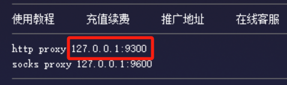

# VCS

## VCS Overview

**VCS** （Version Control System，版本控制系统），简单来说，它就像是代码或文档的“时光机”，能够记录文件随时间变化的所有修改历史。VCS 主要分为两大类：

- 集中式版本控制系统（CVCS）
  - 所有的版本数据都保存在单一的**中央服务器**上
  - 代表有 SVN (Subversion), CVS
- 分布式版本控制系统（DVCS）
  - 每个人的电脑都是一个完整的代码库。你本地就拥有全部的历史记录。
  - 代表有 Git (目前最主流), Mercurial

## VCS 托管平台

这些平台为 VCS（主要是 Git）提供了可视化的界面和在线协作功能：

- **GitHub**：全球最大的开源代码社区。
- **GitLab**：企业常用的私有化部署方案，集成度极高。
- **Gitee**：国内访问速度较快的代码托管平台。

云原生代码仓库：

| **云服务商**        | **代码仓库产品名称**          | **底层使用的 VCS** |
| ------------------- | ----------------------------- | ------------------ |
| **AWS**             | AWS CodeCommit                | Git                |
| **Google Cloud**    | Cloud Source Repositories     | Git                |
| **Microsoft Azure** | Azure Repos                   | Git / TFVC         |
| **阿里云**          | 云效 Codeup                   | Git                |
| **腾讯云**          | 腾讯云开发者代码分析 / CODING | Git                |
| **华为云**          | CodeArts Repo                 | Git                |

# Overview

[**Git**](https://git-scm.com/) 是一个**分布式版本控制系统**（DVCS）。

> [Git Docs](https://git-scm.com/book/zh/v2)
>
> [Git Reference](https://git-scm.com/docs)


# Quick Start

- 安装 Git

- 新建本地仓库目录

  ```bash
  mkdir $REPO_NAME
  cd $REPO_NAME
  ```

- 初始化本地仓库，并设置默认分支名为 `main`。

  ```bash
  git init --initial-branch=main
  ```

- 创建远程托管仓库，如 GitHub 或 GitLab

- 添加默认 Remote Repo

  ```bash
  git remote add origin $REMOTE_REPO
  ```

- 添加另一个 Remote Repo，后添加的只能 `push`；

  ```bash
  git remote set-url --add origin $REMOTE_REPO
  ```

- 检查添加两个 Remote Repo 成功

  ```bash
  git remote -v
  ```

  ```
  origin  https://gitlab.com/jerrybai/notes.git (fetch)
  origin  https://gitlab.com/jerrybai/notes.git (push)
  origin  https://github.com/Jerrybaijy/notes.git (push)
  ```

- 向本地仓库目录 `$REPO_NAME` 添加任何文件，否则接下来无法 `commit`；

- 添加两个 Remote Repo 的默认分支并关联，同时完成第一次推送；

  ```bash
  git add .
  git commit -m "1st commit"
  git push -u origin main
  ```

- 检查远程托管仓库已推送成功；

- 其它操作同正常操作。

# Install

## Windows

- 最好先安装 Windows Terminal

- 官网下载安装包：**[64-bit Git for Windows Setup](https://git-scm.com/downloads/win)**

- 安装时注意
  - 选择 `main` 分支
  - 将 `Open Git UI Here` 从上下文菜单中取消勾选
  - 可以将 Git Bash 添加到 Windows Terminal

- 验证安装

  ```bash
  git -v
  ```

## Debian

- `sudo apt-get install git`

## 配置

- 配置用户名和邮箱，此处的用户名和邮箱并不是登录用的

  ```bash
  # 配置用户名，如果有空格，要用引号包含
  git config --global user.name jerrybaijy

  # 配置email
  git config --global user.email jerry.baijy@outlook.com

  # 保存配置，这样就不用每次都配置
  git config --global credential.helper store

  # 查看配置信息
  git config --global --list
  ```

- 登录

  - 第一次 push，系统会要求输入平台用户名和密码。
  - GitLab 可以用户名密码登录。
  - GitHub 需使用令牌登录，详见 GitHub。

## 网络代理

- 由于网络原因，在执行 `git push` 时，经常推送失败；
- 应设置网络代理代理

  ```bash
  git config --global http.proxy http://127.0.0.1:9788
  git config --global https.proxy https://127.0.0.1:9788
  ```

  **说明**：将 `proxy.example.com:8080` 换成代理商提供的地址和端口。

  

- 查看配置

  ```bash
  git config --list
  ```

- 如果之后不需要代理了，可以通过以下命令取消代理设置：

  ```bash
  git config --global --unset http.proxy
  git config --global --unset https.proxy
  ```

# Repo

## 基础命令

```bash
# 查看仓库状态
git status
# 下载
git clone $REMOTE_REPO
# 跟踪
git add .
# 提交
git commit -m "MESAGE"
# 推送
git push
# 拉取
git pull $REMOTE_REPO
# 初始化本地仓库，并设置默认分支名为 `main`。
git init --initial-branch=main
```

## 多个 Remote Repo

```bash
# 查看本地 Repo 配置的 Remote Repo
git remote -v
# 设置默认 Remote Repo（本地没有 Remote Repo 的操作，添加后需设置 Upstream）
git remote add origin $REMOTE_REPO
# 添加另一个 Remote Repo，后添加的只能 push
git remote set-url --add origin $REMOTE_REPO
# 移除一个 Remote Repo
git remote set-url --delete origin $REMOTE_REPO
# 移除所有 Remote Repo
git remote rm origin
```

# Branch

## Branch 基础

安装 Git 时，有选项选择本地仓库默认分支为 main。

```bash
# 查看分支
git branch
# 创建分支
git branch $BRANCH_NAME # 使用-d删除
# 切换分支
git checkout $BRANCH_NAME # 使用-b创建并切换新分支
# 关联分支
git push -u origin $BRANCH_NAME # git pull -u origin BRANCH_NAME
# 合并分支
git merge $BRANCH_NAME
# 重命名目前分支
git branch -m $BRANCH_NAME

# 删除远程分支
git push origin --delete $REMOTE_BRANCH_NAME
```

## 关联 Branch

```bash
# 关联分支
git push -u origin $BRANCH_NAME
git pull -u origin $BRANCH_NAME

# 清除关联
git remote rm origin
```

**解释**：

- **-u**：等价于 `--set-upstream`，设置上游分支
- **origin**：远程仓库的别名；当克隆一个远程仓库时，Git 会默认创建一个名为 `origin` 的远程仓库别名，指向远程仓库地址。
- **BRANCH_NAME**：远程分支名字
- 设置上游分支以后，本地分支与上游分支建立关联，以后可在本分支下直接使用 `git push`
- 每次新生成分支需将新分支与远程分支建立一次关联

# 版本控制

```bash
# 追溯
git reset --hard SHA # SHA哈希值
```

# `.gitignore`

`.gitignore` 文件是版本控制中的 Ignore 配置文件。通常，这些文件包括编译生成的文件、临时文件、日志文件、依赖库等，因为它们不应该被提交到版本库中，或者它们可以通过其他途径重新生成。创建一个 `.gitignore` 文件可以帮助确保你的代码仓库保持整洁，只包含必要的文件。

## 语法

- 大致语法同 ignore 语法，详见：code-general.md > 忽略规则
- `.gitignore` 有一些默认的忽略规则，比如会自动忽略一些与版本控制相关的临时文件和目录，如 `.git` 目录本身

## 模板

`.gitignore`

```
# Ignore compiled files
*.class
*.o
*.pyc

# Ignore build output directories
build/
dist/
bin/

# Ignore log files
*.log

# Ignore IDE and editor-specific files
.idea/
.vscode/

# Ignore dependency directories
node_modules/
venv/

# Ignore configuration files with sensitive information
config.ini
secrets.json
```

## 创建命令

一次性执行以下命令，会自动创建一个 `.gitignore` 文件。

```bash
echo "venv/" >> .gitignore
echo "node_modules/" >> .gitignore
echo ".env" >> .gitignore
echo "__pycache__/" >> .gitignore
echo ".pytest_cache/" >> .gitignore
echo "dist/" >> .gitignore
echo ".DS_Store" >> .gitignore
```

# Git LFS

Git LFS（Large File Storage）是 Git 的扩展，用于版本控制大文件（如图片、视频、音频等）或二进制文件。Git LFS 将大文件存储在外部的专用存储服务器上，而不是将它们存储在 Git 仓库中。这样可以显著减少 Git 仓库的体积，并提高克隆和拉取操作的速度。

## 环境搭建

- [官网下载并安装 Git LFS](https://git-lfs.com/)
- 初始化

  ```bash
  git lfs install
  ```

## 使用

- 跟踪大文件

  ```bash
  git lfs track "Various Artists - 风舞九天现场 三 (Remix).mp3"
  ```

- 这会在 `.gitattributes` 文件（如果没有会自动创建）中添加一行，具体到这个文件：

  ```
  Various Artists - 风舞九天现场 三 (Remix).mp3 filter=lfs diff=lfs merge=lfs -text
  ```

- 接下来正常添加提交推送即可。

## 注意

- 单个 LFS 文件：限制 1GB
- 每月 LFS 带宽限制：GitHub 1GB，GitLab 10GB。
