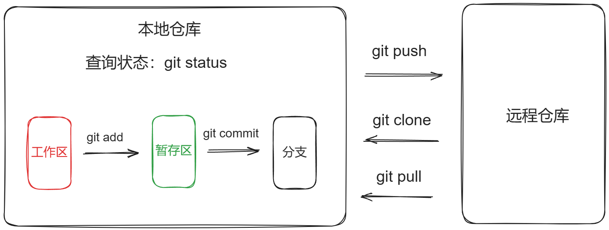
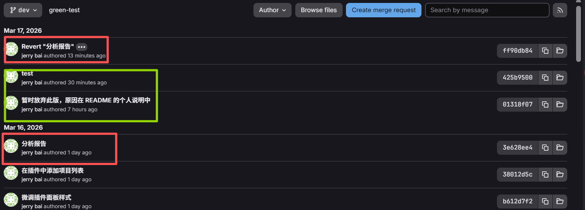
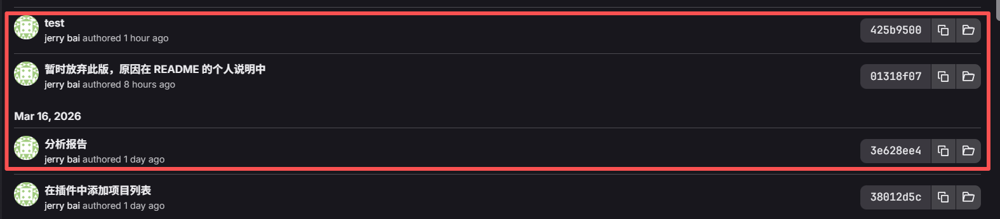

# VCS

## VCS Overview

**VCS** （Version Control System，版本控制系统），简单来说，它就像是代码或文档的“时光机”，能够记录文件随时间变化的所有修改历史。VCS 主要分为两大类：

- 集中式版本控制系统（CVCS）
  - 所有的版本数据都保存在单一的**中央服务器**上
  - 代表有 SVN (Subversion), CVS
- 分布式版本控制系统（DVCS）
  - 每个人的电脑都是一个完整的代码库。你本地就拥有全部的历史记录。
  - 代表有 Git (目前最主流), Mercurial

## VCS 托管平台

这些平台为 VCS（主要是 Git）提供了可视化的界面和在线协作功能：

- **GitHub**：全球最大的开源代码社区。
- **GitLab**：企业常用的私有化部署方案，集成度极高。
- **Gitee**：国内访问速度较快的代码托管平台。

云原生代码仓库：

| **云服务商**        | **代码仓库产品名称**          | **底层使用的 VCS** |
| ------------------- | ----------------------------- | ------------------ |
| **AWS**             | AWS CodeCommit                | Git                |
| **Google Cloud**    | Cloud Source Repositories     | Git                |
| **Microsoft Azure** | Azure Repos                   | Git / TFVC         |
| **阿里云**          | 云效 Codeup                   | Git                |
| **腾讯云**          | 腾讯云开发者代码分析 / CODING | Git                |
| **华为云**          | CodeArts Repo                 | Git                |

# Overview

[**Git**](https://git-scm.com/) 是一个**分布式版本控制系统**（DVCS）。

> [Git Docs](https://git-scm.com/book/zh/v2)
>
> [Git Reference](https://git-scm.com/docs)



# Quick Start

- 安装 Git

- 新建本地仓库目录

  ```bash
  mkdir $REPO_NAME
  cd $REPO_NAME
  ```

- 初始化本地仓库，并设置默认分支名为 `main`。

  ```bash
  git init --initial-branch=main
  ```

- 创建远程托管仓库，如 GitHub 或 GitLab

- 添加默认 Remote Repo

  ```bash
  git remote add origin $REMOTE_REPO
  ```

- 添加另一个 Remote Repo，后添加的只能 `push`；

  ```bash
  git remote set-url --add origin $REMOTE_REPO
  ```

- 检查添加两个 Remote Repo 成功

  ```bash
  git remote -v
  ```

  ```
  origin  https://gitlab.com/jerrybai/notes.git (fetch)
  origin  https://gitlab.com/jerrybai/notes.git (push)
  origin  https://github.com/Jerrybaijy/notes.git (push)
  ```

- 向本地仓库目录 `$REPO_NAME` 添加任何文件，否则接下来无法 `commit`；

- 添加两个 Remote Repo 的默认分支并关联，同时完成第一次推送；

  ```bash
  git add .
  git commit -m "1st commit"
  git push -u origin main
  ```

- 检查远程托管仓库已推送成功；

- 其它操作同正常操作。

# Install

## Windows

- 最好先安装 Windows Terminal

- 官网下载安装包：**[64-bit Git for Windows Setup](https://git-scm.com/downloads/win)**

- 安装时依次注意
  - 尽量选择默认的 C 盘安装位置，否则 Windows Terminal 需要额外[特殊配置](win-terminal.md#添加终端)。
  - 将 `Open Git UI Here` 从上下文菜单中取消勾选
  - 选择 `Add a Git Bash Profile to Windows Terminal`
  - `Override the default branch name for new repositories`：选择 `main` 分支
- 验证安装

  ```bash
  git -v
  ```

## Linux

```bash
# Debian
sudo apt-get install git

# RHEL
sudo dnf install git
```

## 配置

- 配置用户名和邮箱，此处的用户名和邮箱并不是登录用的

  ```bash
  # 配置用户名，如果有空格，要用引号包含
  git config --global user.name jerrybaijy

  # 配置email
  git config --global user.email jerry.baijy@outlook.com

  # 保存配置，这样就不用每次都配置
  git config --global credential.helper store

  # 查看配置信息
  git config --global --list
  ```

- 登录
  - 第一次 push，系统会要求输入平台用户名和密码。
  - GitLab 可以用户名密码登录。
  - GitHub 需使用令牌登录，详见 GitHub。

## 网络代理

- 由于网络原因，在执行 `git push` 时，经常推送失败；
- 应设置网络代理代理

  ```bash
  # 原 VPN
  git config --global http.proxy http://127.0.0.1:9788
  git config --global https.proxy http://127.0.0.1:9788
  
  # v2ray
  git config --global http.proxy http://127.0.0.1:10808
  git config --global https.proxy http://127.0.0.1:10808
  ```

  **说明**：配置以后可能需要重启 VPN。

- 查看配置

  ```bash
  git config --list
  ```

- 如果之后不需要代理了，可以通过以下命令取消代理设置：

  ```bash
  git config --global --unset http.proxy
  git config --global --unset https.proxy
  ```

# Repo

## 基础命令

```bash
# 查看仓库状态
git status
# 下载
git clone $REMOTE_REPO
# 跟踪
git add .
# 提交
git commit -m "MESAGE"
# 推送
git push
# 拉取
git pull $REMOTE_REPO
# 初始化本地仓库，并设置默认分支名为 `main`。
git init --initial-branch=main
```

## 多个 Remote Repo

```bash
# 查看本地 Repo 配置的 Remote Repo
git remote -v
# 设置默认 Remote Repo（本地没有 Remote Repo 的操作，添加后需设置 Upstream）
git remote add origin $REMOTE_REPO
# 添加另一个 Remote Repo，后添加的只能 push
git remote set-url --add origin $REMOTE_REPO
# 移除一个 Remote Repo
git remote set-url --delete origin $REMOTE_REPO
# 移除所有 Remote Repo
git remote rm origin
```

# Branch

## Branch 基础

安装 Git 时，有选项选择本地仓库默认分支为 main。

```
main        # 主分支，稳定版本
develop     # 开发主分支
feature/*   # 功能分支
release/*   # 发布分支
hotfix/*    # 热修复分支
```

```bash
# 查看分支
git branch

# 创建分支
git branch my-branch

# 合并分支
git merge my-branch

# 重命名目前分支
git branch -m my-branch
```

## 切换 Branch

### 切换 Branch

以从 main 切换至 my-branch 分支为例

```bash
# 先推送 main 分支文件，否则未推送过的文件会被其它分支看见

# 查看分支
git branch # main

# 创建并切换至 my-branch 分支
git switch -c my-branch

# 添加、提交、关联推送
git add .
git commit -m "初始化 my-branch 分支"
git push -u origin my-branch
```

### `checkout` 和 `switch`

`checkout` 和 `switch` 都可以管理分支

| **操作功能**   | **老派做法 (checkout)**     | **现代做法 (switch)**     | **记忆点**                    |
| -------------- | --------------------------- | ------------------------- | ----------------------------- |
| **创建分支**   | `git branch my-branch`      | `git branch my-branch`    | `branch` 可以创建分支         |
| **切换分支**   | `git checkout my-branch`    | `git switch my-branch`    | `switch` 就是“切换”的意思     |
| **创建并切换** | `git checkout -b my-branch` | `git switch -c my-branch` | `-b` (branh) vs `-c` (create) |

## 关联 Branch

```bash
# 关联分支
git push -u origin my-branch
git pull -u origin my-branch

# 清除关联
git remote rm origin
```

**解释**：

- **-u**：等价于 `--set-upstream`，设置上游分支
- **origin**：远程仓库的别名；当克隆一个远程仓库时，Git 会默认创建一个名为 `origin` 的远程仓库别名，指向远程仓库地址。
- **BRANCH_NAME**：远程分支名字
- 设置上游分支以后，本地分支与上游分支建立关联，以后可在本分支下直接使用 `git push`
- 每次新生成分支需将新分支与远程分支建立一次关联

## 删除 Branch

以删除 my-branch 分支为例

```bash
# 先推送 my-branch 分支文件，否则未推送过的文件会被其它分支看见

# 先切换至其它分支
git switch main

# 删除本地分支
git branch -d my-branch

# 删除远程仓库分支
git push origin -d my-branch
```

# Add

## `git add`

`add` 用于把工作区的内容添加到暂存区。

```bash
git add <files>
git add .
```

# Commit

## `git commit`

`commit` 用于把暂存区的内容提交到本地仓库。

```bash
git commit -m "<commit-message>"
```

## `git reset`

`reset` 用于回滚至某个 `commit`，彻底删除该 `commit` 之后的所有 `commit`。

```bash
# 回滚
git reset --hard <commit-SHA>
git push -f
```

### `git reset` 参数对照表

如果远程仓库已经有过之后的 `commit`，那么再推送时必须强推。

| **参数**             | **暂存区 (Index)**               | **工作区 (Working Dir)**       | **安全程度**    | **适用场景**                                  |
| -------------------- | -------------------------------- | ------------------------------ | --------------- | --------------------------------------------- |
| **`--soft`**         | **保留**（原有的改动仍在暂存区） | **保留**（不受影响）           | 高              | 想重新编写 Commit Message，或合并多个小提交。 |
| **`--mixed`** (默认) | **重置**（原有暂存内容被移出）   | **保留**（改动回到未暂存状态） | 中              | 撤销了 `git add`，想重新挑选文件进行提交。    |
| **`--hard`**         | **重置**（清空）                 | **重置**（清空，代码物理删除） | **极低 (危险)** | 彻底放弃所有本地改动，强制回退到某个版本。    |

撤销提交，但保留代码：

- 提交没了
- 改动还在暂存区
- 可以直接重新提交

```bash
git reset --soft HEAD~1
git commit -m "新的提交说明"
```

## `git revert`

`revert` 用于撤销一个 `commit`。

### 撤销一个提交

撤销之前的某个提交的更改，但不影响其后续提交。

```bash
git revert <commit-SHA> --no-edit

git revert 3e628ee4 --no-edit
git push
```



- **撤销**：分析报告
- **保留**：
  - test
  - 暂时放弃此版，原因在 README 的个人说明中
- **新建提交**：Revert "分析报告"

### 撤销多个提交

> [!NOTE]
> 左开右闭，即不会撤销 `<commit-SHA1>`

```bash
git revert -n <commit-SHA1>^..<commit-SHA3>
git revert -n 3e628ee4^..425b9500
# -n: --no-commit, 它会把所有撤销带来的代码改动直接放在你的暂存区，而不会自动创建提交。

git commit -m "Revert 暂时放弃此版，原因在 README 的个人说明中 + test"
git push
```



## 回到提交点

用于临时回去看代码

```bash
git switch --detach <commit-SHA>
```

看完代码，回到某个分支

```
git switch <branch>
```

看完代码，以此为终点创建新分支

```bash
git switch -c <branch>
```

## 提交日志

[`log`](https://git-scm.com/docs/git-log/zh_HANS-CN) 用于显示提交日志。

```bash
# 一行展示一条提交记录，展示 <number> 条
git log --oneline -<number>
```

# 文件

## 撤销文件

注：这里指“修改过”的且未执行 `git add` 的文件

```bash
# 撤销修改
git restore .
```

## 删除文件和文件夹

注：这里指“新建”的且未执行 `git add` 的文件和文件夹

```bash
# 参数前加 n，可预览会删除哪些文件或文件夹
# 如：删除文件预览
git clean -nf

# 删除文件
git clean -f
# 删除文件和文件夹
git clean -fd

# 参数后加 x，可预览会删除哪些被 .gitignore 忽略的文件或文件夹
# 如：删除被 .gitignore 忽略的文件预览
git clean -nfx
```

# `.gitignore`

`.gitignore` 文件是版本控制中的 Ignore 配置文件。通常，这些文件包括编译生成的文件、临时文件、日志文件、依赖库等，因为它们不应该被提交到版本库中，或者它们可以通过其他途径重新生成。创建一个 `.gitignore` 文件可以帮助确保你的代码仓库保持整洁，只包含必要的文件。

## 语法

- 大致语法同 ignore 语法，详见：code-general.md > 忽略规则
- `.gitignore` 有一些默认的忽略规则，比如会自动忽略一些与版本控制相关的临时文件和目录，如 `.git` 目录本身

## 模板

`.gitignore`

```
# Ignore compiled files
*.class
*.o
*.pyc

# Ignore build output directories
build/
dist/
bin/

# Ignore log files
*.log

# Ignore IDE and editor-specific files
.idea/
.vscode/

# Ignore dependency directories
node_modules/
venv/

# Ignore configuration files with sensitive information
config.ini
secrets.json
```

## 创建命令

一次性执行以下命令，会自动创建一个 `.gitignore` 文件。

```bash
echo "venv/" >> .gitignore
echo "node_modules/" >> .gitignore
echo ".env" >> .gitignore
echo "__pycache__/" >> .gitignore
echo ".pytest_cache/" >> .gitignore
echo "dist/" >> .gitignore
echo ".DS_Store" >> .gitignore
```

## 误提交文件

当把某个文件误提交到远程仓库时，可以用以下方式修复：

- 在本地把该文件移出

  ```bash
  git rm --cached <my-file>
  ```

- 把 `<my-file>` 加入 `.gitignore` 中

- 正常添加、提交、推送。

# Git LFS

Git LFS（Large File Storage）是 Git 的扩展，用于版本控制大文件（如图片、视频、音频等）或二进制文件。Git LFS 将大文件存储在外部的专用存储服务器上，而不是将它们存储在 Git 仓库中。这样可以显著减少 Git 仓库的体积，并提高克隆和拉取操作的速度。

## 环境搭建

- [官网下载并安装 Git LFS](https://git-lfs.com/)
- 初始化

  ```bash
  git lfs install
  ```

## 使用

- 跟踪大文件

  ```bash
  git lfs track "Various Artists - 风舞九天现场 三 (Remix).mp3"
  ```

- 这会在 `.gitattributes` 文件（如果没有会自动创建）中添加一行，具体到这个文件：

  ```
  Various Artists - 风舞九天现场 三 (Remix).mp3 filter=lfs diff=lfs merge=lfs -text
  ```

- 接下来正常添加提交推送即可。

## 注意

- 单个 LFS 文件：限制 1GB
- 每月 LFS 带宽限制：GitHub 1GB，GitLab 10GB。
