# HTML 元素

> [WHATWG 元素参考](https://html.spec.whatwg.org/multipage/indices.html#Elements-3 "WHATWG 元素参考")
>
> [MDN 元素参考](https://developer.mozilla.org/zh-CN/docs/Web/HTML/Reference/Elements "MDN HTML 元素参考")

HTML 元素基础详见 `html | 元素` 笔记。

本笔记的元素分类参照 WHATWG 文档的 [HTML 元素目录](https://html.spec.whatwg.org/multipage/#toc-semantics)。

## 文档

- [`<html>`](#`<html>`) 主根元素
- [`<body>`](#`<body>`) 分区根元素
- [`<head>`](#`<head>`) 文档头部
- [`<meta>`](#`<meta>`) 元数据
- [`<title>`](#`<title>`) 文档标题
- [`<link>`](#`<link>`) 外部资源链接
- [`<style>`](#`<style>`) 内部样式表
- [`<base>`](#`<base>`) 文档根 URL

## 章节

- [`<header>`](#`<header>`) 页眉
- [`<nav>`](#`<nav>`) 导航栏
- [`<main>`](#`<main>`) 主内容
- [`<aside>`](#`<aside>`) 侧边栏
- [`<article>`](#`<article>`) 独立结构
- [`<section>`](#`<section>`) 独立章节
- [`<h>`](#`<h>`) 标题
- [`<hgroup>`](#`<hgroup>`) 标题组
- [`<address>`](#`<address>`) 地址
- [`<footer>`](#`<footer>`) 页脚

## 强调

- [`<strong>`](#`<strong>`) 重要性强调
- [`<em>`](#`<em>`) 语气强调
- [`<b>`](#`<b>`) 注意文本
- [`<mark>`](#`<mark>`) 标记高亮，高亮渲染

## 引用

- [`<q>`](#`<q>`) 行内引用
- [`<blockquote>`](#`<blockquote>`) 块级引用
- [`<cite>`](#`<cite>`) 引用作品

## 特殊文本

- [`<del>`](#`<del>`) 删除内容（编辑标识）
- [`<ins>`](#`<ins>`) 插入内容（编辑标识）
- [`<s>`](#`<s>`) 不准确文本
- [`<u>`](#`<u>`) 非文本注释
- [`<small>`](#`<small>`) 附注，小字体渲染
- [`<abbr>`](#`<abbr>`) 缩略语

## 定义和术语

- [`<dl>`](#`<dl>`) 定义列表
- [`<dt>`](#`<dl>`) 定义术语
- [`<dd>`](#`<dd>`) 定义描述
- [`<dfn>`](#`<dfn>`) 定义中的术语
- [`<i>`](#`<i>`) 术语文本

## 计算机和数学

- [`<var>`](#`<var>`) 变量
- [`<sup>`](#`<sup>`) 上标
- [`<sub>`](#`<sub>`) 下标
- [`<code>`](#`<code>`) 行内代码
- [`<pre>`](#`<pre>`) 与格式化（代码块）
- [`<kbd>`](#`<kbd>`) 键盘输入
- [`<samp>`](#`<samp>`) 程序输出

## 列表

- [`<li>`](#`<li>`) 列表项
- [`<ol>`](#`<ol>`) 有序列表
- [`<ul>`](#`<ul>`) 无序列表

## 表格

- [`<table>`](#`<table>`) 表格
- [`<tr>`](#<tr>) 表格行
- 

## 表单

## 交互

- [`<details>`](#`<details>`) 折叠组件
- [`<dialog>` ](#`<dialog>`) 对话框

## 脚本

- [`<script>`](#`<script>`) 脚本
- [`<noscript>`](#`<noscript>`) 无脚本
- [`<template>`](#`<template>`) 模板
- [`<slot>`](#`<slot>`) 插槽
- [`<canvas>`](#`<canvas>`) 画布

# 文档

## `<base>`

**文档根 URL** [`<base>`](https://developer.mozilla.org/zh-CN/docs/Web/HTML/Reference/Elements/base) 指定用于一个文档中包含的所有相对 URL 的根 URL。一份中只能有一个该元素，是空元素。

### 其它属性

- `href` 属性详见 `<a>` 元素。

## `<body>`

**分区根元素** [`<body>`](https://developer.mozilla.org/zh-CN/docs/Web/HTML/Reference/Elements/body) 包含文档的结构信息（如页眉、页脚等）和文档其它内容。

## `<head>`

**文档头部** [`<head>`](https://developer.mozilla.org/zh-CN/docs/Web/HTML/Reference/Elements/head) 包含文档相关的元数据信息，包括文档的标题、脚本和样式表等。

## `<html>`

[`<html>`](https://developer.mozilla.org/zh-CN/docs/Web/HTML/Reference/Elements/html) 元素称为**主根元素**。该元素包含整个页面的所有内容，其他所有元素必须是此元素的后代。

## `<link>`

### 语法

**外部资源链接** [`<link>`](https://developer.mozilla.org/zh-CN/docs/Web/HTML/Reference/Elements/link) 元素用于引入外部资源。

```html
<head>
  <link href="styles.css" rel="stylesheet" />
</head>
```

```css
/* styles.css */
p {color: red;}
```

**说明**

- **`rel="stylesheet"`** 表示当前文档与`main.css`文件的关系是样式表，浏览器会将其视为页面的外部CSS样式文件，并应用其中的样式规则。
- `<link>` 元素可以出现在 [`<head>`](https://developer.mozilla.org/zh-CN/docs/Web/HTML/Reference/Elements/head) 元素或 [`<body>`](https://developer.mozilla.org/zh-CN/docs/Web/HTML/Reference/Elements/body) 元素中，具体取决于它是否有一个 **body-ok** 的[链接类型](https://html.spec.whatwg.org/multipage/links.html#body-ok)，但最好将其放在 `<head>` 中。
- 该元素最常用于链接 CSS，此外也可以被用来创建站点图标 。

### 其它属性

- `href` 属性详见 `<a>` 元素。

## `<meta>`

 **元数据** [`<meta>`](https://developer.mozilla.org/zh-CN/docs/Web/HTML/Reference/Elements/meta) 用于表示文档的元数据信息。

### `charset`

**字符集** `charset` 告诉文档使用哪种字符编码：`<meta charset="UTF-8">`

### `name` 和 `content`

- `name` 和 `content` 属性一起使用，以名 - 值对的方式给文档提供元数据，其中 name 作为元数据的名称，content 作为元数据的值。
- [标准元数据名称](https://developer.mozilla.org/zh-CN/docs/Web/HTML/Reference/Elements/meta/name)
- **作者信息**：`<meta name="author" content="NAME" />`
- **描述信息**：`<meta name="description" content="content..." />`
- [**视口**](https://developer.mozilla.org/zh-CN/docs/Web/CSS/Viewport_concepts)：`<meta name="viewport" content="width=device-width">`  
    视口可以确保页面以视口宽度进行渲染，避免移动端浏览器上因页面过宽导致缩放。

## `<style>`

**内部样式** [`<style>`](https://developer.mozilla.org/zh-CN/docs/Web/HTML/Reference/Elements/style) 用于创建文档内部样式表。最好的方式是使用 `<link>` 元素引入 CSS 外部样式表。

```html
<head>
  <style>
    p {
      color: #26b72b;
  </style>
</head>

<body>
  <p>
    This text will be green. Inline styles take precedence over CSS included
    externally.
  </p>
</body>
```

## `<title>`

**文档标题** [`<title>`](https://developer.mozilla.org/zh-CN/docs/Web/HTML/Reference/Elements/title) 元素用于定义文档的标题。

- 显示在浏览器的标题栏或标签页上
- 作为收藏网页的描述文字
- 用在搜索的结果中

# 章节

## `<address>`

[`address`](https://developer.mozilla.org/zh-CN/docs/Web/HTML/Element/address) 元素表示联系地址。

```html
<p>Contact the author of this page:</p>

<address>
  <a href="mailto:jim@example.com">jim@example.com</a><br />
  <a href="tel:+14155550132">+1 (415) 555‑0132</a>
</address>
```

```css
a[href^='mailto']::before {
  content: '📧 ';
}

a[href^='tel']::before {
  content: '📞 ';
}
```

> 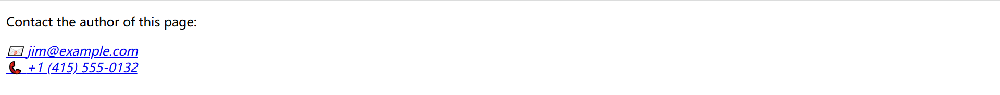

## `<article>`

**独立结构 ** [`<article>`](https://developer.mozilla.org/zh-CN/docs/Web/HTML/Reference/Elements/article) 元素表示文档、页面、应用或网站中的独立结构，其意在成为可独立分配的或可复用的结构，是块级元素。

例如，阅读器在博客上滚动时一个接一个地显示每篇文章的文本，每个帖子将包含在 `<article>` 元素中，可能包含一个或多个 `<section>`。

```html
<!DOCTYPE html>
<html lang="en">
  <head>
    <meta charset="UTF-8" />
    <meta name="viewport" content="width=device-width, initial-scale=1.0" />
    <title>Document</title>
    <link href="../css/css-test.css" rel="stylesheet" />
  </head>

  <body>
    <article class="forecast">
      <h1>Weather forecast for Seattle</h1>
      <article class="day-forecast">
        <h2>03 March 2018</h2>
        <p>Rain.</p>
      </article>
      <article class="day-forecast">
        <h2>04 March 2018</h2>
        <p>Periods of rain.</p>
      </article>
      <article class="day-forecast">
        <h2>05 March 2018</h2>
        <p>Heavy rain.</p>
      </article>
    </article>
  </body>
</html>
```

```css
.forecast {
  margin: 0;
  padding: 0.3rem;
  background-color: #eee;
}

.forecast > h1,
.day-forecast {
  margin: 0.5rem;
  padding: 0.3rem;
  font-size: 1.2rem;
}

.day-forecast {
  background: right/contain content-box border-box no-repeat
    url('../images/rain.svg') white;
}

.day-forecast > h2,
.day-forecast > p {
  margin: 0.2rem;
  font-size: 1rem;
}
```

> 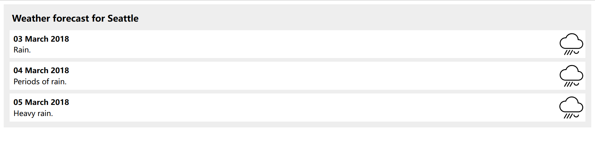

## `<aside>`

**侧边栏 ** [`<aside>`](https://developer.mozilla.org/zh-CN/docs/Web/HTML/Reference/Elements/aside) 表示一个和其余页面内容几乎无关的部分，被认为是独立于该内容的一部分并且可以被单独的拆分出来而不会使整体受影响。其通常表现为侧边栏或者标注框（call-out boxes）。

```html
<head>
  <link href="../css/css-test.css" rel="stylesheet" />
</head>

<body>
  <p>
    Salamanders are a group of amphibians with a lizard-like appearance, including short legs and a tail in both larval
    and adult forms.
  </p>

  <aside>
    <p>The Rough-skinned Newt defends itself with a deadly neurotoxin.</p>
  </aside>

  <p>
    Several species of salamander inhabit the temperate rainforest of the Pacific Northwest, including the Ensatina, the
    Northwestern Salamander and the Rough-skinned Newt. Most salamanders are nocturnal, and hunt for insects, worms and
    other small creatures.
  </p>  
</body>
```

```css
aside {
  width: 40%;
  padding-left: 0.5rem;
  margin-left: 0.5rem;
  float: right;
  box-shadow: inset 5px 0 5px -5px #29627e;
  font-style: italic;
  color: #29627e;
}

aside > p {
  margin: 0.5rem;
}
```

> 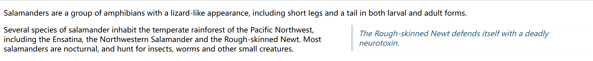

## `<footer>`

**页脚** [`<footer>`](https://developer.mozilla.org/zh-CN/docs/Web/HTML/Reference/Elements/footer) 通常包含该章节作者、版权数据或者与文档相关的链接等信息。

```html
<head>
  <link href="../css/css-test.css" rel="stylesheet" />
</head>
<body>
  <h3>FIFA 世界杯最佳射手</h3>
  <ol>
    <li>米罗斯拉夫 · 克洛泽，16</li>
    <li>罗纳尔多 · 纳扎里奥，15</li>
    <li>格尔德 · 穆勒，14</li>
  </ol>

  <footer>
    <small> 版权所有 © 2023 足球历史档案馆。保留所有权利。 </small>
  </footer>
</body>
```

```css
footer {
  text-align: center;
  padding: 5px;
  background-color: #abbaba;
  color: #000;
}
```

> 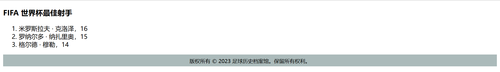

## `<h>`

**标题** [`<h>`](https://developer.mozilla.org/zh-CN/docs/Web/HTML/Reference/Elements/Heading_Elements) 用于定义标题级别，从 `<h1>` 到 `<h6>`，是块级元素。

```html
<h1>一级标题</h1>
<h2>二级标题</h2>
<h3>三级标题</h3>
<h4>四级标题</h4>
<h5>五级标题</h5>
<h6>六级标题</h6>
```

> 

**注意**：

- 避免跳过某级标题：始终要从 `<h1>` 开始，接下来依次使用 `<h2>` 等等
- 不要为了减小标题的字体而使用低级别的标题
- 同一篇幅尽量不要超过三级标题

## `<header>`

**页眉** [`<header>`](https://developer.mozilla.org/zh-CN/docs/Web/HTML/Reference/Elements/header) 用于展示介绍性内容，通常包含一组介绍性的或是辅助导航的实用元素。它可能包含一些标题元素，但也可能包含其他元素，比如 Logo、搜索框、作者名称，等等。

```html
<head>
  <link href="../css/css-test.css" rel="stylesheet" />
</head>

<body>
  <header>
    <a class="logo" href="#">Cute Puppies Express!</a>
  </header>
  
  <article>
    <header>
      <h1>Beagles</h1>
      <time>08.12.2014</time>
    </header>
    <p>I love beagles <em>so</em> much! Like, really, a lot. They’re adorable and their ears are so, so snugly soft!</p>
  </article>
</body>
```

```css
.logo {
  background: left / cover url('../images/dog.jpg');
  display: flex;
  height: 120px;
  align-items: center;
  justify-content: center;
  font:
    bold calc(1em + 2 * (100vw - 120px) / 100) 'Dancing Script',
    fantasy;
  color: #ff0083;
  text-shadow: #000 2px 2px 0.2rem;
}

header > h1 {
  margin-bottom: 0;
}

header > time {
  font: italic 0.7rem sans-serif;
}
```

> 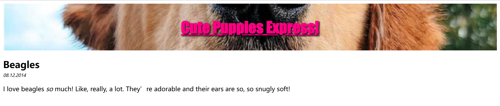

## `<hgroup>`

**标题组**  [`<hgroup>`](https://developer.mozilla.org/zh-CN/docs/Web/HTML/Reference/Elements/hgroup) 元素将一个标题与任意次要内容（例如子标题、副标题或口号）组合在一起。

```html
<hgroup>
  <h1>Frankenstein</h1>
  <p>Or: The Modern Prometheus</p>
</hgroup>
<p>
  Victor Frankenstein, a Swiss scientist, has a great ambition: to create
  intelligent life. But when his creature first stirs, he realizes he has
  made a monster. A monster which, abandoned by his master and shunned by
  everyone who sees it, follows Dr Frankenstein to the very ends of the
  earth.
</p>
```

```css
hgroup {
  text-align: center;
}

hgroup h1 {
  margin-bottom: 0;
}

hgroup p {
  margin: 0;
  font-weight: bold;
}
```

> 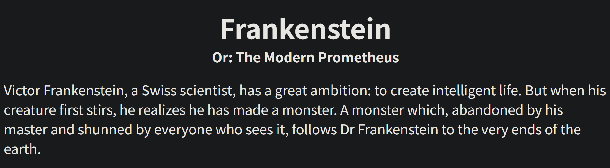

##  `<main>`

**主内容** [`<main>`](https://developer.mozilla.org/zh-CN/docs/Web/HTML/Reference/Elements/main) 元素用于做页面分组，呈现文档的主要内容，与  `<header>`、`<nav>` 和 `<footer>`  同等级，可以有各种子内容区段，如 `<article>`、`<section>` 和 `<aside>` 等。不同页面的重复内容不应该包含在其中。

```html
<header>Gecko facts</header>
<main>
  <p>
    Geckos are a group of usually small, usually nocturnal lizards. They are
    found on every continent except Antarctica.
  </p>

  <p>
    Many species of gecko have adhesive toe pads which enable them to climb
    walls and even windows.
  </p>
</main>
```

```css
header {
  font: bold 7vw Arial, sans-serif;
}
```

> 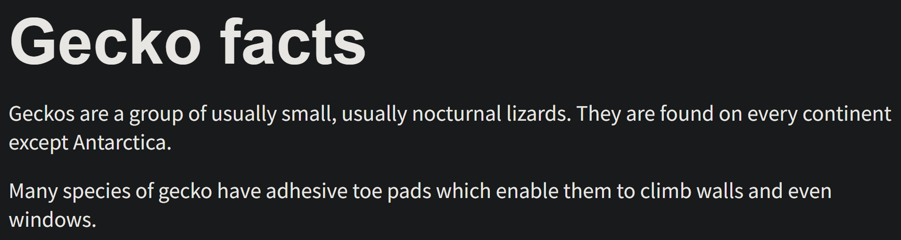

## `<nav>`

**导航栏 ** [`<nav>`](https://developer.mozilla.org/zh-CN/docs/Web/HTML/Reference/Elements/nav) 用于在当前文档或其他文档中提供导航链接。导航部分的常见示例是菜单，目录和索引。

```html
<nav>
  <ul>
    <li><a href="#">Home</a></li>
    <li><a href="#">Our team</a></li>
    <li><a href="#">Projects</a></li>
    <li><a href="#">Contact</a></li>
  </ul>
  <form>
    <input type="search" name="q" placeholder="Search query" />
    <input type="submit" value="Go!" />
  </form>
</nav>
```

```css
nav {
  background-color: white;
  padding: 1%;
}

nav {
  height: 50px;
  background-color: #ff80ff;
  display: flex;
  margin-bottom: 10px;
}

nav ul {
  padding: 0;
  list-style-type: none;
  flex: 2;
  display: flex;
}

nav li {
  display: inline;
  text-align: center;
  flex: 1;
}

nav a {
  display: inline-block;
  font-size: 2rem;
  text-decoration: none;
  color: black;
}

nav form {
  flex: 1;
  display: flex;
  align-items: center;
  height: 100%;
  padding: 0 2em;
}

input {
  font-size: 1.6rem;
  height: 32px;
}

input[type="search"] {
  flex: 3;
}

input[type="submit"] {
  flex: 1;
  margin-left: 1rem;
  background: #333;
  border: 0;
  color: white;
}
```

> 

## `<section>`

**独立章节** [`<section>`](https://developer.mozilla.org/zh-CN/docs/Web/HTML/Reference/Elements/section) 是一个通用的分节元素，只有在没有更具体的元素来代表它的时候才可以使用。

```html
<head>
  <link href="../css/css-test.css" rel="stylesheet" />
</head>

<body>
  <h1>Choosing an Apple</h1>
  <section>
    <h2>Introduction</h2>
    <p>This document provides a guide to help with the important task of choosing the correct Apple.</p>
  </section>

  <section>
    <h2>Criteria</h2>
    <p>
      There are many different criteria to be considered when choosing an Apple — size, color, firmness, sweetness,
      tartness...
    </p>
  </section>  
</body>
```

```css
h1,
h2 {
  margin: 0;
}
```

> 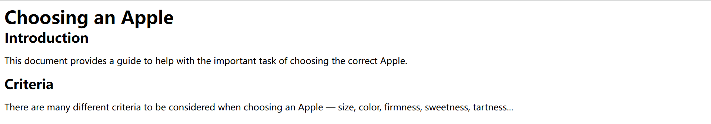

# 内容分组

## `<blockquote>`

**块级引用** [`<blockquote>`](https://developer.mozilla.org/zh-CN/docs/Web/HTML/Reference/Elements/blockquote) 表示其中的文字是引用内容，是块级元素，渲染时有缩进，且加引号。

```html
<div>
  <blockquote cite="https://www.huxley.net/bnw/four.html">
    <p>
      Words can be like X-rays, if you use them properly—they’ll go through
      anything. You read and you’re pierced.
    </p>
  </blockquote>
  <p>—Aldous Huxley, <cite>Brave New World</cite></p>
</div>
```

```css
div:has(> blockquote) {
  background-color: #ededed;
  margin: 10px auto;
  padding: 15px;
  border-radius: 5px;
}

blockquote p::before {
  content: "\201C";
}

blockquote p::after {
  content: "\201D";
}

blockquote + p {
  text-align: right;
}    
```

> 

**说明**：

- 若引文来源于网络，则可以将原内容的出处 URL 地址设置到 cite 特性上。
- 若要以文本的形式告知读者引文的出处时，可以通过 `<cite>` 元素。

## `<dd>`

**定义描述** [`<dd>`](https://developer.mozilla.org/zh-CN/docs/Web/HTML/Reference/Elements/dd) 是块级元素，详见 `<dl>` 元素。

## `<div>`

**内容划分** [`<div>`](https://developer.mozilla.org/zh-CN/docs/Web/HTML/Reference/Elements/div) 元素无语义，用于将零散的行内元素组成区块，是块级元素。

```html
<div class="shadowbox">
  <p>这是一张非常有趣的说明，陈列在一个可爱的影盒里。</p>
</div>
```

```css
.shadowbox {
  width: 15em;
  border: 1px solid #333;
  box-shadow: 8px 8px 5px #444;
  padding: 8px 12px;
  background-image: linear-gradient(180deg, #fff, #ddd 40%, #ccc);
}
```

> 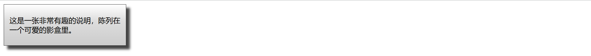

## `<dl>`

**定义列表** [`<dl>`](https://developer.mozilla.org/zh-CN/docs/Web/HTML/Reference/Elements/dl) 是一个包含*术语定义 `<dt>`* 和*术语描述 `<dd>`* 的列表，通常用于展示词汇表或者元数据（键 - 值对列表），是块级元素，渲染时术语描述部分有缩进。

```html
<p>Cryptids of Cornwall:</p>

<dl>
  <dt>Beast of Bodmin</dt>
  <dd>A large feline inhabiting Bodmin Moor.</dd>

  <dt>Morgawr</dt>
  <dd>A sea serpent.</dd>

  <dt>Owlman</dt>
  <dd>A giant owl-like creature.</dd>
</dl>
```

```css
p,
dt {
  font-weight: bold;
}

dl,
dd {
  font-size: 0.9rem;
}

dd {
  margin-bottom: 1em;
}
```

> 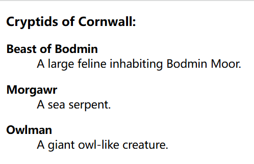

- **扩展**：`<dt>` 元素的文本可以使用 `<dfn>` 包围。

## `<dt>`

**定义描述** [`<dt>`](https://developer.mozilla.org/zh-CN/docs/Web/HTML/Reference/Elements/dt) 是块级元素，详见 `<dl>` 元素。

## `<figcaption>`

[`<figcaption>`](https://developer.mozilla.org/zh-CN/docs/Web/HTML/Reference/Elements/figcaption) 用来描述其父元素 `<figure>` 里的其余内容的标题或说明。详见 `<figure>` 元素。

## `<figure>`

**可附标题内容** [`<figure>`](https://developer.mozilla.org/zh-CN/docs/Web/HTML/Reference/Elements/figure) 表示“独立的媒体单元”，是块级元素。*可能*包含 `<figcaption>` 元素定义的说明内容。

```html
<!-- 一个图注 -->
<figure>
  
  <figcaption style="font-size: 16px; color: gray">图注</figcaption>
</figure>

<!-- 多个图注 -->
<figure>
  
  <figcaption style="font-size: 16px; color: gray">
    <div>图注</div>
    <div>图注</div>
  </figcaption>
</figure>
```

**扩展示例**：

```html
<figure>
  
  <figcaption>An elephant at sunset</figcaption>
</figure>
```

```css
figure {
  border: thin #c0c0c0 solid;
  display: flex;
  flex-flow: column;
  padding: 5px;
  max-width: 220px;
  margin: auto;
}

img {
  max-width: 220px;
  max-height: 150px;
}

figcaption {
  background-color: #222;
  color: #fff;
  font: italic smaller sans-serif;
  padding: 3px;
  text-align: center;
}
```

> 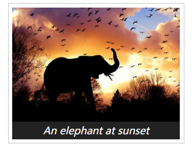

## `<hr>`

**主题分割** [`<hr>`](https://developer.mozilla.org/zh-CN/docs/Web/HTML/Reference/Elements/hr) 即水平线，语义上表示段落级元素之间的主题转换，是块级元素。

```html
<p>§1: The first rule of Fight Club is: You do not talk about Fight Club.</p>
<hr />
<p>§2: The second rule of Fight Club is: Always bring cupcakes.</p>
```

```css
hr {
  border: none;
  border-top: 3px double #333;
  color: #333;
  overflow: visible;
  text-align: center;
  height: 5px;
}

hr::after {
  background: #fff;
  content: '§';
  padding: 0 4px;
  position: relative;
  top: -13px;
}
```

> 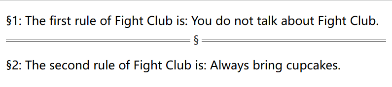

## `<li>`

### 语法

**列表项** [`<li>`](https://developer.mozilla.org/zh-CN/docs/Web/HTML/Reference/Elements/li) 用于表示列表中的项目，详见 `<ol>` 元素。

### `value`

[`value`](https://developer.mozilla.org/zh-CN/docs/Web/HTML/Reference/Elements/li#value) 属性在有序列表中，指定列表项 `<li>` 的序号。

```html
<ol>
  <li value="100">第一百列表项</li>
  <li value="200">第二百列表项</li>
  <li value="300">第三百列表项</li>
</ol>
```

> <ol>
> <li value="100">第一百列表项</li>
> <li value="200">第二百列表项</li>
> <li value="300">第三百列表项</li>
> </ol>

## `<menu>`

**菜单** [`<menu>`](https://developer.mozilla.org/zh-CN/docs/Web/HTML/Reference/Elements/menu) 在 HTML 规范中被描述为 `<ul>` 的语义替代，但浏览器将其视为与 `<ul>` 没有区别。

```html
<menu>
  <li>第一列表项</li>
  <li>第二列表项</li>
  <li>第三列表项</li>
</menu>
```

> <menu>
> <li>第一列表项</li>
> <li>第二列表项</li>
> <li>第三列表项</li>
> </menu>

## `<ol>`

### 语法

**有序列表** [`<ol>`](https://developer.mozilla.org/zh-CN/docs/Web/HTML/Reference/Elements/ol) 显示按顺序排列的列表项 `<li>`，默认以数字等符号进行标记。

```html
<ol>
  <li>第一列表项</li>
  <li>第二列表项</li>
  <li>第三列表项</li>
</ol>
```

> <ol>
> <li>第一列表项</li>
> <li>第二列表项</li>
> <li>第三列表项</li>
> </ol>

### 列表嵌套

**列表嵌套**是指在一个列表项 `<li>` 中包含另一个列表

```html
<!-- 规范写法 -->
<ul>
  <li>
    项目一
    <ol>
      <li>子项目一</li>
      <li>子项目二</li>
    </ol>
  </li>
  <li>项目二</li>
</ul>

<!-- 不规范写法 -->
<ul>
  <li>项目一</li>
  <ol>
    <li>子项目一</li>
    <li>子项目二</li>
  </ol>
  <li>项目三</li>
</ul>
```

> <ul>
> <li>
>  项目一
>  <ol>
>    <li>子项目一</li>
>    <li>子项目二</li>
>  </ol>
> </li>
> <li>项目二</li>
> </ul>

**注意**：不要将一个列表当成列表项 `<li>` 进行嵌套，而是要把列表放在 `<li>` 的内容中。

### `start`

[`start`](https://developer.mozilla.org/zh-CN/docs/Web/HTML/Reference/Elements/ol#start) 属性用于指定有序列表的起始值。

```html
<ol start="5">
  <li>第五列表项</li>
  <li>第六列表项</li>
  <li>第七列表项</li>
</ol>
```

> <ol start="5">
> <li>第五列表项</li>
> <li>第六列表项</li>
> <li>第七列表项</li>
> </ol>

### `type` 属性

[`type`](https://developer.mozilla.org/zh-CN/docs/Web/HTML/Reference/Elements/ol#type) 属性在有序列表中，用于指定有序列表的计数器类型，即序列号的类型。

```html
<ol type="A">
  <li>第一列表项</li>
  <li>第二列表项</li>
  <li>第三列表项</li>
</ol>
```

> <ol type="A">
> <li>第一列表项</li>
> <li>第二列表项</li>
> <li>第三列表项</li>
> </ol>

## `<p>`

[`<p>`](https://developer.mozilla.org/zh-CN/docs/Web/HTML/Reference/Elements/p) 元素用于定义 HTML 文档中的段落，是块级元素。

```html
<p>这是第一个段落</p>
<p>这是第一个段落</p>
```

**渲染效果**：浏览器默认会在段落的前后添加空行。

> <p>这是第一个段落</p>
>
> <p>这是第二个段落</p>

## `<pre>`

**预格式化** [`<pre>`](https://developer.mozilla.org/zh-CN/docs/Web/HTML/Reference/Elements/pre) 用于保证文本的编排顺序不变，文本中的空白符（比如空格和换行符）都会显示出来，是行内元素。类似于 Markdown 的代码块。

```html
<pre>
function greet() {
  console.log("Hello, world!");
}
</pre>
```

> <pre>
> function greet() {
> console.log("Hello, world!");
> }
> </pre>

## `<search>`

[`<search>`](https://developer.mozilla.org/zh-CN/docs/Web/HTML/Reference/Elements/search) 元素

## `<ul>`

**无序列表** [`<ul>`](https://developer.mozilla.org/zh-CN/docs/Web/HTML/Reference/Elements/ul) 用于显示无顺序排列的列表项 `<li>`。渲染时默认以圆点等符号进行标记，如果想修改，应该在 CSS 中修改。

```html
<ul>
  <li>第一列表项</li>
  <li>第二列表项</li>
  <li>第三列表项</li>
</ul>
```

> <ul>
> <li>第一列表项</li>
> <li>第二列表项</li>
> <li>第三列表项</li>
> </ul>

# 文本级语义

>  [WHATWG 文本级语义元素汇总](https://html.spec.whatwg.org/multipage/text-level-semantics.html#usage-summary)

## `<a>`

### 语法

**锚元素** [`<a>`](https://developer.mozilla.org/zh-CN/docs/Web/HTML/Reference/Elements/a) 可以通过它的 `href` 属性创建通向其他网页、文件、电子邮件地址、同一页面内的位置或任何其他 URL 的超链接，供用户点击，属于行内元素。

```html
<a href="https://www.example.com">点击这里</a>
```

> <p>You can reach Michael at:</p>
>
> <ul>
> <li><a href="https://example.com">Website</a></li>
> <li><a href="mailto:m.bluth@example.com">Email</a></li>
> <li><a href="tel:+123456789">Phone</a></li>
> </ul>

### `href`

#### 语法

[`href`](https://developer.mozilla.org/zh-CN/docs/Web/HTML/Reference/Elements/a#href)（***h**ypertext **ref**erence*，超文本引用）用于超链接所指向的 URL。跳转目标可以是绝对路径、相对路径、锚点、电话号、E-mail、JS 代码和文件等。

```html
<p>You can reach Michael at:</p>
<ul>
  <li><a href="https://example.com">Website</a></li>
  <li><a href="mailto:m.bluth@example.com">Email</a></li>
  <li><a href="tel:+123456789">Phone</a></li>
</ul>
```

> <p>You can reach Michael at:</p>
> <ul>
> <li><a href="https://example.com">Website</a></li>
> <li><a href="mailto:m.bluth@example.com">Email</a></li>
> <li><a href="tel:+123456789">Phone</a></li>
> </ul>

#### 锚点

**锚点**是分隔 URL 中*地址*和*片段*的**标识符**，可以在点击链接后跳转到该网页的锚点位置。

锚点元素添加 `id="锚点"` 属性，跳转元素在 URL/SRC 地址后添加 `#锚点`。

```html
<!-- 跳转到本地锚点 -->
<div id="锚点">百度</div>
<a href="#锚点">点击跳转至百度</a>

<!-- 跳转到 URL 锚点 -->
<a href="https://example.com#Home">Website</a>
```

**锚点的规范**：

- 同一地址可省略 URL/SRC
- **全转换成小写**：即 `Full-page` → `full-page`
- **空格替换为连字符 `-`**：
    - 标题中的空格需用半角连字符（`-`）替代，避免 URL 中的空格引发解析错误。
    - `full-page databases` → `full-page-databases`
- **保留特殊符号（如连字符）**：标题原有的半角连字符（如 `Full-page` 中的 `-`）无需处理，直接保留。

### `target`

[`target`](https://developer.mozilla.org/zh-CN/docs/Web/HTML/Reference/Elements/a#target) 属性用于指定链接的*打开方式* 或者指定提交表单时的*目标窗口*。通常用于 `<a>` 和 `<form>`。

```html
<a href="https://www.example.com" target="_blank">Visit Example.com</a>
```

**属性值**：

- **`_self`**：默认值，在当前窗口中打开。
- **`_blank`**：在新窗口或新标签页中打开。
- **`_parent`**：在父级框架中打开。
- **`_top`**：在顶级窗口中打开。

## `<abbr>`

**缩略语** [`<abbr>`](https://developer.mozilla.org/zh-CN/docs/Web/HTML/Reference/Elements/abbr) 用于代表缩写。

```html
<p>你可以用 <abbr>EMS</abbr> 把这个包裹寄给我。</p>
<p>你可以用 <abbr title="邮政特快专递服务">EMS</abbr> 把这个包裹寄给我。</p>
```

> <p>你可以用 <abbr>EMS</abbr> 把这个包裹寄给我。</p>
>
> <p>你可以用 <abbr title="邮政特快专递服务">EMS</abbr> 把这个包裹寄给我。</p>

**说明**：`title` 属性用于当鼠标悬停时，对缩略词提供一个扩展解释。

## `<b>`

**注意文本** [`<b>`](https://developer.mozilla.org/zh-CN/docs/Web/HTML/Reference/Elements/b) 元素用于引起人们的注意，但不传达任何额外的重要性，也不暗示其他语气或情绪，例如文档摘要中的关键词、评论中的产品名称、交互式文本驱动软件中的可操作词或文章导语。是行内元素，渲染为粗体。

```html
<p>
  本文档描述了几个<b class="keywords">文本级</b>元素，并解释了它们在
  <b class="keywords">HTML</b> 文档中的用法。
</p>
```

> <p>
> 本文档描述了几个<b class="keywords">文本级</b>元素，并解释了它们在
> <b class="keywords">HTML</b> 文档中的用法。
> </p>

## `<bdi>`

**双向文本隔离** [`<bdi>`](https://developer.mozilla.org/zh-CN/docs/Web/HTML/Reference/Elements/bdi) 元素用于隔离文本默认的渲染方向，防止未知方向的文本影响周围文本的布局，是行内元素。

## `<bdo>`

**双向文本覆盖** [`<bdo>`](https://developer.mozilla.org/zh-CN/docs/Web/HTML/Reference/Elements/bdo) 元素用于覆盖文本默认的渲染方向，默认从左向右，是行内元素。

```html
<p>该文本应从左到右绘制。</p>
<p><bdo dir="rtl">该文本应从右到左绘制。</bdo></p>
```

> <p>该文本应从左到右绘制。</p>
>
> <p><bdo dir="rtl">该文本应从右到左绘制。</bdo></p>

## `<br>`

**换行** [`<br>`](https://developer.mozilla.org/zh-CN/docs/Web/HTML/Reference/Elements/br) 用于在文本中生成一个换行符（回车），将 `<br>` 之后的文本从下一行开始渲染，是空元素。

```html
<p>这是第一行<br>这是第二行</p>
```

> <p>这是第一行<br>这是第二行</p>

**注意**

- 不要使用 <kbd>Enter</kbd> 进行换行
- 不要用 `<br>` 来增加文本之间的行间隔

## `<cite>`

[`<cite>`](https://developer.mozilla.org/zh-CN/docs/Web/HTML/Reference/Elements/cite) 元素用于引用作品，是行内元素，渲染时为斜体。

```html
<p>
  更多内容详见<cite>《计算机基础》</cite>。
</p>
```

> <p>
> 更多内容详见<cite>《计算机基础》</cite>。
> </p>

## `<code>`

**行内代码** [`<code>`](https://developer.mozilla.org/zh-CN/docs/Web/HTML/Reference/Elements/code) 表示在段落内的一段文本是一段代码，是行内元素。

```html
<p>请将以下代码添加到项目中：<code>console.log("Hello, world!");</code></p>
```

> <p>请将以下代码添加到项目中：<code>console.log("Hello, world!");</code></p>

## `<data>`

[`<data>`](https://developer.mozilla.org/zh-CN/docs/Web/HTML/Reference/Elements/data) 元素

## `<dfn>`

[`<dfn>`](https://developer.mozilla.org/zh-CN/docs/Web/HTML/Reference/Elements/dfn) 元素表示定义中的术语，是行内元素，渲染为斜体。

```html
<p>
  <!-- Define "The Internet" -->
  <dfn id="def-internet">The Internet</dfn> is a global system of interconnected
  networks that use the Internet Protocol Suite (TCP/IP) to serve billions of
  users worldwide.
</p>

<dl>
  <dt>
    <!-- Define "World-Wide Web" and reference definition for "the Internet" -->
    <dfn>
      <abbr title="World-Wide Web">WWW</abbr>
    </dfn>
  </dt>
  <dd>
    The World-Wide Web (WWW) is a system of interlinked hypertext documents
    accessed on <a href="#def-internet">the Internet</a>.
  </dd>
</dl>
```

> <p>
>   <!-- Define "The Internet" -->
>   <dfn id="def-internet">The Internet</dfn> is a global system of
>   interconnected networks that use the Internet Protocol Suite (TCP/IP) to
>   serve billions of users worldwide.
> </p>
> <dl>
>   <dt>
>     <!-- Define "World-Wide Web" and reference definition for "the Internet" -->
>     <dfn>
>       <abbr title="World-Wide Web">WWW</abbr>
>     </dfn>
>   </dt>
>   <dd>
>     The World-Wide Web (WWW) is a system of interlinked hypertext documents
>     accessed on <a href="#def-internet">the Internet</a>.
>   </dd>
> </dl>

- **扩展**：可以作为 `<dl>` 中的 `<dt>` 的元素内容。

## `<em>`

[`<em>`](https://developer.mozilla.org/zh-CN/docs/Web/HTML/Reference/Elements/em) 元素表示语气上的强调，是行内元素，斜体渲染。

```html
<p>Get out of bed <em>now</em>!</p>
<p>We <em>had</em> to do something about it.</p>
<p>This is <em>not</em> a drill!</p>
```

> <p>Get out of bed <em>now</em>!</p>
> <p>We <em>had</em> to do something about it.</p>
> <p>This is <em>not</em> a drill!<p>

## `<i>`

**术语文本** [`<i>`](https://developer.mozilla.org/zh-CN/docs/Web/HTML/Reference/Elements/i) 用于标记因某些原因需要区分普通文本的一系列文本。例如技术术语、音译、思想或船名等。是行内元素，渲染为斜体。

```html
<p>The Latin phrase <i>Veni, vidi, vici</i> is often mentioned in music, art, and literature.</p>
```

> <p>The Latin phrase <i>Veni, vidi, vici</i> is often mentioned in music, art, and literature.</p>

## `<kbd>`

**键盘输入** [`<kbd>`](https://developer.mozilla.org/zh-CN/docs/Web/HTML/Reference/Elements/kbd) 表示用户输入，是行内元素。

```html
<kbd>Enter</kbd>
```

> <kbd>Enter</kbd>

## `<mark>`

**标记高亮** [`<mark>`](https://developer.mozilla.org/zh-CN/docs/Web/HTML/Reference/Elements/mark) 表示上下文相关或突出显示以供参考，是行内元素，渲染为高亮。

```html
<p>&lt;mark&gt; 元素用于 <mark>高亮</mark> 文本</p>
```

> <p>&lt;mark&gt; 元素用于 <mark>高亮</mark> 文本</p>

浏览器通常以黄色背景高亮显示 `<mark>` 元素的内容，但不要纯粹为了高亮显示而用 `<mark>` 元素，而是应该使用 CSS 来实现。

```css
mark {
  background-color: yellow;
  color: black;
}
```

## `<q>`

**行内引用** [`<q>`](https://developer.mozilla.org/zh-CN/docs/Web/HTML/Reference/Elements/q) 用于引用短文本，是行内元素，渲染时加引号。

```html
<p>他说：<q>今天的天气真好！</q></p>
```

> <p>他说：<q>今天的天气真好！</q></p>

## `<rp>`

[`<rp>`](https://developer.mozilla.org/zh-CN/docs/Web/HTML/Reference/Elements/rp) 元素

## `<rt>`

[`<rt>`](https://developer.mozilla.org/zh-CN/docs/Web/HTML/Reference/Elements/rt) 元素

## `<ruby>`

**注音** [`<ruby>`](https://developer.mozilla.org/zh-CN/docs/Web/HTML/Reference/Elements/ruby) 用来展示东亚文字注音或字符注释。

```html
<ruby>汉字<rp>(</rp><rt>hàn zì</rt><rp>)</rp></ruby>
```

> <ruby>汉字<rp>(</rp><rt>hàn zì</rt><rp>)</rp></ruby>

## `<s>`

[`<s>`](https://developer.mozilla.org/zh-CN/docs/Web/HTML/Reference/Elements/s) 元素表示不再准确或不再相关的内容，不适用于指示文档编辑，是行内元素，渲染时加删除线。

```html
<s>Today's Special: Salmon</s> SOLD OUT
```

> <s>Today's Special: Salmon</s> SOLD OUT

## `<samp>`

**程序输出** [`<samp>`](https://developer.mozilla.org/zh-CN/docs/Web/HTML/Reference/Elements/samp) 表示程序输出，是行内元素。

```html
<p>程序运行后输出：<samp>Hello, world!</samp></p>
```

> <p>程序运行后输出：<samp>Hello, world!</samp></p>

## `<small>`

**附注** [`<small>`](https://developer.mozilla.org/zh-CN/docs/Web/HTML/Reference/Elements/small) 元素

## `<span>`

**内容跨越** [`<span>`](https://developer.mozilla.org/zh-CN/docs/Web/HTML/Reference/Elements/span) 元素无语义，用于给段落内的文本加样式，是行内元素。该元素仅应在无其他合适语义元素时使用。

```html
<p>这是一段<span class="red-text">红色文本</span></p>
```

```css
.red-text {
  color: red;
}
```

> <p>这是一段<span style="color: red">红色文本</span></p>

## `<strong>`

**重要性强调 ** [`<strong>`](https://developer.mozilla.org/zh-CN/docs/Web/HTML/Reference/Elements/strong) 用来对一个句子的部分**文本**增加重要性，是行内元素，渲染时为粗体。

```html
<p>这个句子里的<strong>这个词语</strong>比较重要。</p>
```

> <p>这个句子里的<strong>这个词语</strong>比较重要。</p>

## `<sub>`

**下标** [`<sub>`](https://developer.mozilla.org/zh-CN/docs/Web/HTML/Reference/Elements/sub) 元素用于指定应显示为下标的行内文本。

```html
<p>水的分子式是H<sub>2</sub>O</p>
```

> <p>水的分子式是H<sub>2</sub>O</p>

## `<sup>`

**上标** [`<sup>`](https://developer.mozilla.org/zh-CN/docs/Web/HTML/Reference/Elements/sup) 元素用于指定应显示为上标的行内文本。

```html
<p>勾股定理：a<sub>2</sub> + b<sub>2</sub> = c<sub>2</sub></p>
```

> <p>勾股定理：a<sup>2</sup> + b<sup>2</sup> = c<sup>2</sup></p>

## `<time>`

[`<time>`](https://developer.mozilla.org/zh-CN/docs/Web/HTML/Reference/Elements/time) 元素表示一个特定的时间段。

```html
<p>演出于 <time datetime="2018-07-07T20:00:00">20:00</time> 开始。</p>
```

> <p>演出于 <time datetime="2018-07-07T20:00:00">20:00</time> 开始。</p>

**注意**：

- 在使用公历之前的日期时不应使用该元素（因为这些日期的计算比较复杂）。
- 此部分关于 [**有效的日期时间值**](https://developer.mozilla.org/zh-CN/docs/Web/HTML/Reference/Elements/time#有效的日期时间值) 没弄懂。

## `<u>`

**非文本注释** [`<u>`](https://developer.mozilla.org/zh-CN/docs/Web/HTML/Reference/Elements/u) 表示行内文本拥有一个非文本形式的注释，该注释需要以某种方式渲染出来。例如拼写错误和中文专有名词。是行内元素，渲染时加下划线。

```html
<p>This paragraph includes a <u>wrnogly</u> spelled word.</p>
```

> <p>This paragraph includes a <u>wrnogly</u> spelled word.</p>

## `<var>`

**变量** [`<var>`](https://developer.mozilla.org/zh-CN/docs/Web/HTML/Reference/Elements/var) 表示数学表达式或编程上下文中的变量名称，是行内元素，渲染为斜体。

```html
<p>
  长方体的体积公式为：<var>v</var> = <var>l</var> × <var>w</var> × <var>h</var>
</p>
```

> <p>
> 长方体的体积公式为：<var>v</var> = <var>l</var> × <var>w</var> × <var>h</var>
> </p>

## `<wbr>`

**换行机会** [`<wbr>`](https://developer.mozilla.org/zh-CN/docs/Web/HTML/Reference/Elements/wbr) （ **W**ord **B**rea**k** **R**ule）元素就是告诉浏览器，当前空间容纳不下这行长内容时，应该在哪换行。

用于在“可能需要换行”的地方添加一个“软换行”点。如果空间足够，它会像一个普通字符一样，也不起任何作用，否则就从此处换行。

```html
<p>http://thisisalongurlwithoutanyspacesinbetween.com<wbr />/some/path/to/a/very/long/file</p>
```

> 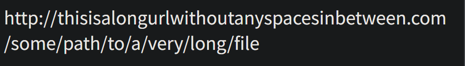

**在上述示例中**：

- 当把浏览器窗口变窄时，即容纳不下一整行 URL 内容，此时会从 `<wbr>` 处换行。

# 编辑

## `<ins>`

**插入文本** [`<ins>`](https://developer.mozilla.org/zh-CN/docs/Web/HTML/Reference/Elements/ins) 表示被插入文档中的内容，属于编辑标识，与 `<del>` 对应，是行内元素，渲染时加下划线。

```html
<body>
  <p><ins>这是一段新增的文本</ins></p>
</body>
```

> <p><ins>这是一段新增的文本</ins></p>

## `<del>`

**删除文本** [`<del>`](https://developer.mozilla.org/zh-CN/docs/Web/HTML/Reference/Elements/del) 表示被从文档中删除的内容，属于编辑标识，与 `<ins>` 对应，是行内元素，渲染时加删除线。

```html
<p><del>This text has been deleted</del>, here is the rest of the paragraph.</p>
```

> <p><del>This text has been deleted</del>, here is the rest of the paragraph.</p>

# 嵌入内容

## `<video>`

**视频** [`<video>`](https://developer.mozilla.org/zh-CN/docs/Web/HTML/Reference/Elements/video) 元素用于支持文档内的视频播放，属性 `controls` 用于添加播放按钮。

```html
<video src="video/终局第01集.mp4" controls></video>
```

### 视频属性

- `src`、`height`、`width`
- `autoplay` 自动播放
- `loop` 布尔属性；指定后，会在视频播放结束的时候，自动返回视频开始的地方，继续播放。
- `muted` 默认静音
- `poster` 播放前显示海报

## `<audio>`

**音频** [`<audio>`](https://developer.mozilla.org/zh-CN/docs/Web/HTML/Reference/Elements/audio) 元素用于在页面中嵌入音频，是行内元素。

```html
<audio src="music/实验音频.mp3" controls>降级文本</audio>
```

> <audio src="music/实验音频.mp3" controls>降级文本</audio>

- `降级文本` 是当浏览器不支持 `<audio>` 元素时的回退，可替换成需要的提示。

## ``

**图像** [``](https://developer.mozilla.org/zh-CN/docs/Web/HTML/Reference/Elements/img) 用于在页面中嵌入图像，是行内元素，空元素。

### 语法

```html

```

> 

### `src`

**外部资源** [`src`](https://developer.mozilla.org/zh-CN/docs/Web/HTML/Reference/Elements/img#src) 属性用于指定脚本文件引用的外部资源的路径。可以是本地路径，也可以是网络上的 URL。

```html

```

### `alt`

**替代文本** [`alt`](https://developer.mozilla.org/zh-CN/docs/Web/HTML/Reference/Elements/img#alt) 属性作用：

- 如果图像无法加载，`alt` 属性的文本将被显示。
- 屏幕阅读器等辅助技术可以读取 `alt` 文本，以提供对图像的描述，帮助视觉障碍用户理解图像内容。

```html

```

### `width`

**语法**：[`width`](https://developer.mozilla.org/zh-CN/docs/Web/CSS/width) 和 [`height`](https://developer.mozilla.org/zh-CN/docs/Web/CSS/height) 属性用于指定元素宽度和高度。

- **属性值单位**：可以是像素 `px`、百分比 `%`、视口 `vw/vh`、`em`、`rem` 和绝对长度单位（如mm）等，详见 `CSS` - `值和单位`。
- **自适应**：通常情况下，如果只设置 `width: 200px;`，而没有设置 `height`，浏览器将根据图像的纵横比自动计算 `height`。

### 响应式图片

[**响应式图片**](https://developer.mozilla.org/zh-CN/docs/Web/HTML/Guides/Responsive_images)可以解决不同尺寸屏幕对图片的要求

## `<picture>`

[`<picture>`](https://developer.mozilla.org/zh-CN/docs/Web/HTML/Reference/Elements/picture) 是一个**容器**，为不同的屏幕尺寸展示不同裁剪或修改过的图片。

```html
<picture>
  <source media="(min-width: 800px)" srcset="large.jpg" />
  <source media="(min-width: 450px)" srcset="medium.jpg" />
  
</picture>
```

**在以上示例中**：

- `<picture>`：作为容器，用于包含 `<source>` 和 `` 元素。
- `<source>`：指定媒体资源
    - `media`：告诉浏览器： “只有当视口宽度至少达到多少像素时，才考虑加载我 srcset 中定义的图片。”
- ``：提供回退图片和图片尺寸，当所有 `<source>` 都不可用时，才使用这个。

## `<map>`

[`<map>`](https://developer.mozilla.org/zh-CN/docs/Web/HTML/Reference/Elements/map) 与 `<area>` 元素一起使用来定义一个图像映射（一个可以在图像上点击的链接区域）。

```html
<map name="primary">
  <area
    shape="circle"
    coords="0,0,200"
    href="https://developer.mozilla.org/docs/Web/JavaScript"
    target="_blank"
    alt="JavaScript"
  />
  <area
    shape="rect"
    coords="500,500,700,700"
    href="https://developer.mozilla.org/docs/Web/CSS"
    target="_blank"
    alt="CSS"
  />
</map>

```

**在以上示例中**：

- `<map>` 作为图像地图容器，用于包含 `<area>` 元素。
    - `name` 用于给这个地图命名，方便与 `` 元素关联。
- `<area>` 用于在 `<map>` 内部定义**可点击的链接区域**。
    - `shape`：定义区域形状（`rect` 矩形, `circle` 圓形, `poly` 多边形）。
    - `coords`： 定义区域的**坐标**（左上角为0点，根据 `shape` 的值不同，坐标数量和含义不同）。
    - `href`：定义点击该区域后跳转的目标 URL。
- `` 提供一个图片
    - `usemap="#primary"`：关联 `<map>` 的 `name="primary"`。

## `<area>`

**图像映射区域** [`<area>`](https://developer.mozilla.org/zh-CN/docs/Web/HTML/Reference/Elements/area) 作为 `<map>` 的子元素，一起使用来定义一个图像映射（一个可以在图像上点击的链接区域），是空元素，详见 [`<map>`](#`<map>`)。

## `<source>`

**播放源** [`<source>`](https://developer.mozilla.org/zh-CN/docs/Web/HTML/Reference/Elements/source) 元素为 `<picture>`、`<audio>` 或 `<video>` 元素指定多个媒体资源。

在 `<video>` 里嵌套 `<source>` 使视频有备用播放源，浏览器将会使用它所支持的第一个源。

```html
<video controls>
  <source src="video/终局第01集.mp4" type="video/MP4" />
  <source src="video/终局第01集.mkv" type="video/mkv" />
</video>
```

## `<track>`

**文本轨道** [`<track>`](https://developer.mozilla.org/zh-CN/docs/Web/HTML/Reference/Elements/track) 作为 `<audio>` 和 `<video>` 的子元素使用，为媒体内容添加**定时文本轨道**。

```html
<video controls src="my_video.mp4">
  <track kind="captions" src="my_captions.vtt" srclang="zh" default>
</video>
```

**在以上示例中**：

- `<video>` 作为播放控件
- `<track>` 作为 `<video>` 的子元素，从外部引入文本轨道。

## `<iframe>`

**内联框架** [`<iframe>`](https://developer.mozilla.org/zh-CN/docs/Web/HTML/Reference/Elements/iframe) 用于将另一个 HTML 页面嵌入到当前页面中。

```html
<iframe
  src="https://www.openstreetmap.org/export/embed.html?bbox=-0.004017949104309083%2C51.47612752641776%2C0.00030577182769775396%2C51.478569861898606&amp;layer=mapnik"
  width="300"
  height="200"
  title="嵌入的谷歌地图"
  >降级文本
</iframe>
```

> <iframe
>   src="https://www.openstreetmap.org/export/embed.html?bbox=-0.004017949104309083%2C51.47612752641776%2C0.00030577182769775396%2C51.478569861898606&amp;layer=mapnik"
>   width="300"
>   height="200"
>   title="嵌入的谷歌地图"
>   >降级文本
> </iframe>

**在以上示例中**：

- `<iframe>` 作为内联框架
- `src` 属性指定 URL
- `title` 属性用于无障碍
- `降级文本` 是当浏览器不支持 `<iframe>` 元素时的回退，可替换成需要的提示。

## `<embed>`

**外部内容嵌入** [`<embed>`](https://developer.mozilla.org/zh-CN/docs/Web/HTML/Reference/Elements/embed) 是一个通用的容器，用于嵌入**任何外部内容**，但主要用于那些需要浏览器插件（如 Flash）才能运行的内容。大多数现代浏览器已**停止支持**或移除了对这些插件的支持。现在更推荐使用 `<video>`、`<audio>` 或 `<canvas>` 等现代 HTML5 元素。

## `<object>`

**嵌入对象** [`<object>`](https://developer.mozilla.org/zh-CN/docs/Web/HTML/Reference/Elements/object) 用于各种非 HTML 资源的嵌入（如 PDF，Flash 等）。

```html
<object data="html-elements.pdf" type="application/pdf" width="800" height="600">
  降级文本
</object>
```

**在以上示例中**：

- `<iframe>` 作为内联框架
- `data` 属性指定资源地址
- `type` 属性用于指定 `MIME类型`，即 `大类别/子类别`。
- `降级文本` 是当浏览器不支持 `<iframe>` 元素时的回退，可替换成需要的提示。

## `<svg>`

[`<svg>`](https://developer.mozilla.org/zh-CN/docs/Web/SVG/Reference/Element/svg) 元素用于嵌入 *SVG 语言*，绘制*二维矢量图形*。

```html
<svg width="150" height="100" viewBox="0 0 3 2">
  <rect width="1" height="2" x="0" fill="#008d46" />
  <rect width="1" height="2" x="1" fill="#ffffff" />
  <rect width="1" height="2" x="2" fill="#d2232c" />
</svg>
```

> <svg width="150" height="100" viewBox="0 0 3 2">
>   <rect width="1" height="2" x="0" fill="#008d46" />
>   <rect width="1" height="2" x="1" fill="#ffffff" />
>   <rect width="1" height="2" x="2" fill="#d2232c" />
> </svg>

**在以上示例中**：

- `<svg>` 作为外层元素
- `<svg>` 内部都是 SVG 语言

## `<math>`

**数学公式** [`<math>`](https://developer.mozilla.org/zh-CN/docs/Web/MathML/Reference/Element/math) 元素用于嵌入 *MathML 语言*，编写单个*数学公式*。

```html
<math>
  <mrow>
    <msup>
      <mi>a</mi>
      <mn>2</mn>
    </msup>
    <mo>+</mo>
    <msup>
      <mi>b</mi>
      <mn>2</mn>
    </msup>
    <mo>=</mo>
    <msup>
      <mi>c</mi>
      <mn>2</mn>
    </msup>
  </mrow>
</math>
```

> 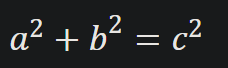

**在以上示例中**：

- `<math>` 作为外层元素
- `<math>` 内部都是 MathML 语言

# 表格

## `<table>`

[`<table>`](https://developer.mozilla.org/zh-CN/docs/Web/HTML/Reference/Elements/table) 元素表示一个表格。

### 简写表格

```html
<table border="1">
  <tr>
    <th>表头1</th>
    <th>表头2</th>
  </tr>
  <tr>
    <td>数据</td>
    <td>数据</td>
  </tr>
  <tr>
    <td>数据</td>
    <td>数据</td>
  </tr>
</table>
```

> <table border="1">
>   <tr>
>     <th>表头1</th>
>     <th>表头2</th>
>   </tr>
>   <tr>
>     <td>数据</td>
>     <td>数据</td>
>   </tr>
>   <tr>
>     <td>数据</td>
>     <td>数据</td>
>   </tr>
> </table>

### 完整表格

```html
<table border="1">
  <caption>
    表格标题
  </caption>
  <thead>
    <tr>
      <th>-</th>
      <th>列表头1</th>
      <th>列表头2</th>
    </tr>
  </thead>
  <tbody>
    <tr>
      <th>行表头1</th>
      <td>数据</td>
      <td>数据</td>
    </tr>
    <tr>
      <th>行表头2</th>
      <td>数据</td>
      <td>数据</td>
    </tr>
  </tbody>
  <tfoot>
    <tr>
      <th colspan="2">总计</th>
      <td>100</td>
    </tr>
  </tfoot>
</table>
```

> <table border="1">
>   <caption>
>     表格标题
>   </caption>
>   <thead>
>     <tr>
>       <th>-</th>
>       <th>列表头1</th>
>       <th>列表头2</th>
>     </tr>
>   </thead>
>   <tbody>
>     <tr>
>       <th>行表头1</th>
>       <td>数据</td>
>       <td>数据</td>
>     </tr>
>     <tr>
>       <th>行表头2</th>
>       <td>数据</td>
>       <td>数据</td>
>     </tr>
>   </tbody>
>   <tfoot>
>     <tr>
>       <th colspan="2">总计</th>
>       <td>100</td>
>     </tr>
>   </tfoot>
> </table>

**元素说明**：

- `<table>`：定义整个表格
- `<caption>` 标题、 `<thead>` 表头、 `<tbody>` 主体和  `<tfoot>` 页脚，可省略。
- `<tr>`：定义表格中的行
- `<th>`：定义表格中的表头单元格
- `<td>`：定义表格中的数据单元格

### 表格嵌套

`<table>` 可以嵌套在 `<th>` 或 `<td>` 中。

```html
<table border="1">
  <tr>
    <th>表头1</th>
    <th>表头2</th>
  </tr>
  <tr>
    <td>数据</td>
    <td>
      嵌套表格
      <table border="1">
        <tr>
          <th>表头1</th>
          <th>表头2</th>
        </tr>
        <tr>
          <td>数据</td>
          <td>数据</td>
        </tr>
        <tr>
          <td>数据</td>
          <td>数据</td>
        </tr>
      </table>
    </td>
  </tr>
  <tr>
    <td>数据</td>
    <td>数据</td>
  </tr>
</table>
```

> <table border="1">
>   <tr>
>     <th>表头1</th>
>     <th>表头2</th>
>   </tr>
>   <tr>
>     <td>数据</td>
>     <td>
>       嵌套表格
>       <table border="1">
>         <tr>
>           <th>表头1</th>
>           <th>表头2</th>
>         </tr>
>         <tr>
>           <td>数据</td>
>           <td>数据</td>
>         </tr>
>         <tr>
>           <td>数据</td>
>           <td>数据</td>
>         </tr>
>       </table>
>     </td>
>   </tr>
>   <tr>
>     <td>数据</td>
>     <td>数据</td>
>   </tr>
> </table>

### `border`

[~~`border`~~](https://developer.mozilla.org/zh-CN/docs/Web/HTML/Reference/Elements/table#border) 属性定义了环绕表格外部的框的大小，该属性已弃用。在实际开发中，建议使用 CSS 样式来进行更灵活和精细的样式控制，或者引入 BootStrap。以下是 `border` 的基本效果：

```html
<table border="1">
  <tr>
    <th>表头1</th>
    <th>表头2</th>
  </tr>
  <tr>
    <td>数据</td>
    <td>数据</td>
  </tr>
  <tr>
    <td>数据</td>
    <td>数据</td>
  </tr>
</table>
```

> 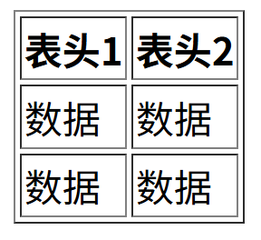

## `<tr>`

**表格数据行** [`<tr>`](https://developer.mozilla.org/zh-CN/docs/Web/HTML/Reference/Elements/tr) （**t**able **r**ow）用于定义表格中的一行。

## `<th>`

**表格头部** [`<th>`](https://developer.mozilla.org/zh-CN/docs/Web/HTML/Reference/Elements/th) （**t**able **h**ead）用于定义表格中的*表头单元格*，在渲染时会加粗且默认居中显示。

```html
<table border="1">
  <tr>
    <th>-</th>
    <th>列表头</th>
    <th>列表头</th>
  </tr>
  <tr>
    <th>行表头</th>
    <td>数据</td>
    <td>数据</td>
  </tr>
  <tr>
    <th>行表头</th>
    <td>数据</td>
    <td>数据</td>
  </tr>
</table>
```

> <table border="1">
>   <tr>
>     <th>-</th>
>     <th>列表头</th>
>     <th>列表头</th>
>   </tr>
>   <tr>
>     <th>行表头</th>
>     <td>数据</td>
>     <td>数据</td>
>   </tr>
>   <tr>
>     <th>行表头</th>
>     <td>数据</td>
>     <td>数据</td>
>   </tr>
> </table>

### `colspan`

[`colspan`](https://developer.mozilla.org/zh-CN/docs/Web/HTML/Reference/Elements/td#colspan) 属性用于指定单元格占几列，[`rowspan`](https://developer.mozilla.org/zh-CN/docs/Web/HTML/Reference/Elements/td#rowspan) 属性用于指定单元格占几行。

```html
<table border="1">
  <tr>
    <th>表头1</th>
    <th colspan="2">表头2</th>
  </tr>
  <tr>
    <td rowspan="2">数据</td>
    <td>数据</td>
    <td>数据</td>
  </tr>
  <tr>
    <td>数据</td>
    <td>数据</td>
  </tr>
</table>
```

> 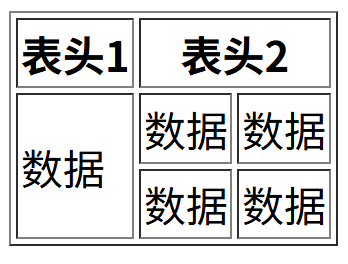

### `scope`

[`scope`](https://developer.mozilla.org/zh-CN/docs/Web/HTML/Reference/Elements/th#scope) 属性可以告诉屏幕阅读器该 `<th>` 的类型，对无障碍有帮助，无额外渲染效果。

- 单列表头 `col`
- 多列表头 `colgroup`
- 单行表头 `row`
- 多行表头 `rowgroup`

```html
<table border="1">
  <tr>
    <th>-</th>
    <th scope="col">单列表头</th>
    <th colspan="2" scope="colgroup">多列表头</th>
    <th scope="col">单列表头</th>
  </tr>
  <tr>
    <th scope="row">单行表头</th>
    <td>数据</td>
    <td>数据</td>
    <td>数据</td>
    <td>数据</td>
  </tr>
  <tr>
    <th rowspan="2" scope="rowgroup">多行表头</th>
    <td>数据</td>
    <td>数据</td>
    <td>数据</td>
    <td>数据</td>
  </tr>
  <tr>
    <td>数据</td>
    <td>数据</td>
    <td>数据</td>
    <td>数据</td>
  </tr>
  <tr>
    <th scope="row">单行表头</th>
    <td>数据</td>
    <td>数据</td>
    <td>数据</td>
    <td>数据</td>
  </tr>
</table>
```

> <table border="1">
>   <tr>
>     <th>-</th>
>     <th scope="col">单列表头</th>
>     <th colspan="2" scope="colgroup">多列表头</th>
>     <th scope="col">单列表头</th>
>   </tr>
>   <tr>
>     <th scope="row">单行表头</th>
>     <td>数据</td>
>     <td>数据</td>
>     <td>数据</td>
>     <td>数据</td>
>   </tr>
>   <tr>
>     <th rowspan="2" scope="rowgroup">多行表头</th>
>     <td>数据</td>
>     <td>数据</td>
>     <td>数据</td>
>     <td>数据</td>
>   </tr>
>   <tr>
>     <td>数据</td>
>     <td>数据</td>
>     <td>数据</td>
>     <td>数据</td>
>   </tr>
>   <tr>
>     <th scope="row">单行表头</th>
>     <td>数据</td>
>     <td>数据</td>
>     <td>数据</td>
>     <td>数据</td>
>   </tr>
> </table>

### 其它属性

`<th>` 元素的[属性](https://developer.mozilla.org/zh-CN/docs/Web/HTML/Reference/Elements/th#属性)：

- [`rowspan`](https://developer.mozilla.org/zh-CN/docs/Web/HTML/Reference/Elements/th#rowspan)：单元格占几行，用法同 `colspan`。

## `<td>`

**表格数据** [`<td>`](https://developer.mozilla.org/zh-CN/docs/Web/HTML/Reference/Elements/td) （**t**able **d**ata）用于定义表格中的*数据单元格*。

### `headers`

[`headers`](https://developer.mozilla.org/zh-CN/docs/Learn_web_development/Core/Structuring_content/Table_accessibility#id_和_headers_属性) 属性用于说明 `<td>` 对应哪个 `<th>` 的 `id` 属性，对无障碍有帮助，无特殊渲染效果。

```html
<table border="1">
  <thead>
    <tr>
      <th rowspan="2">-</th>
      <th id="clothes" colspan="3">衣物</th>
    </tr>
    <tr>
      <th id="trousers">长裤</th>
      <th id="skirts">裙子</th>
      <th id="dresses">连衣裙</th>
    </tr>
  </thead>
  <tbody>
    <tr>
      <th id="price" rowspan="3">价格</th>
      <td headers="price clothes trousers">56</td>
      <td headers="price clothes skirts">45</td>
      <td headers="price clothes dresses">36</td>
    </tr>
    <tr>
      <td headers="price clothes trousers">22</td>
      <td headers="price clothes skirts">58</td>
      <td headers="price clothes dresses">76</td>
    </tr>
    <tr>
      <td headers="price clothes trousers">43</td>
      <td headers="price clothes skirts">66</td>
      <td headers="price clothes dresses">55</td>
    </tr>
  </tbody>
</table>
```

> <table border="1">
>   <thead>
>     <tr>
>       <th rowspan="2">-</th>
>       <th id="clothes" colspan="3">衣物</th>
>     </tr>
>     <tr>
>       <th id="trousers">长裤</th>
>       <th id="skirts">裙子</th>
>       <th id="dresses">连衣裙</th>
>     </tr>
>   </thead>
>   <tbody>
>     <tr>
>       <th id="price" rowspan="3">价格</th>
>       <td headers="price clothes trousers">56</td>
>       <td headers="price clothes skirts">45</td>
>       <td headers="price clothes dresses">36</td>
>     </tr>
>     <tr>
>       <td headers="price clothes trousers">22</td>
>       <td headers="price clothes skirts">58</td>
>       <td headers="price clothes dresses">76</td>
>     </tr>
>     <tr>
>       <td headers="price clothes trousers">43</td>
>       <td headers="price clothes skirts">66</td>
>       <td headers="price clothes dresses">55</td>
>     </tr>
>   </tbody>
> </table>

## `<caption>`

**表格标题**  [`<caption>`](https://developer.mozilla.org/zh-CN/docs/Web/HTML/Reference/Elements/caption) 用于展示一个表格的标题，默认显示在表格顶部。

```html
<table border="1">
  <caption>表格标题</caption>
  <tr>
    <th>表头1</th>
    <th>表头2</th>
  </tr>
  <tr>
    <td>数据</td>
    <td>数据</td>
  </tr>
  <tr>
    <td>数据</td>
    <td>数据</td>
  </tr>
</table>
```

> <table border="1">
>   <caption>表格标题</caption>
>   <tr>
>     <th>表头1</th>
>     <th>表头2</th>
>   </tr>
>   <tr>
>     <td>数据</td>
>     <td>数据</td>
>   </tr>
>   <tr>
>     <td>数据</td>
>     <td>数据</td>
>   </tr>
> </table>

**注意**：虽然可以通过 `align` 属性已弃用，不要再使用它改变 `<caption>` 在表格中的显示位置，而是通过 CSS 的 `caption-side` 和 `text-align` 属性修改。

## `<thead>`

**表格表头行** [`<thead>`](https://developer.mozilla.org/zh-CN/docs/Web/HTML/Reference/Elements/thead) 用于定义单行或多行列表头，与 `<tbody>` 和 `<tfoot>` 共同将 `<table>` 结构化，对无障碍有帮助，简写可省略。

```html
<table border="1">
  <thead>
    <tr>
      <th colspan="2">表头</th>
    </tr>
    <tr>
      <th>表头1</th>
      <th>表头2</th>
    </tr>
  </thead>
  <tr>
    <td>数据</td>
    <td>数据</td>
  </tr>
  <tr>
    <td>数据</td>
    <td>数据</td>
  </tr>
</table>
```

> <table border="1">
>   <thead>
>     <tr>
>       <th colspan="2">表头</th>
>     </tr>
>     <tr>
>       <th>表头1</th>
>       <th>表头2</th>
>     </tr>
>   </thead>
>   <tr>
>     <td>数据</td>
>     <td>数据</td>
>   </tr>
>   <tr>
>     <td>数据</td>
>     <td>数据</td>
>   </tr>
> </table>

## `<tbody>`

**表格主体** [`<tbody>`](https://developer.mozilla.org/zh-CN/docs/Web/HTML/Reference/Elements/tbody) 用于定义表格的内容部分，与 `<thead>` 和 `<tfoot>` 共同将 `<table>` 结构化，对无障碍有帮助，简写可省略。示例详见 `<table> | 完整表格`。

## `<tfoot>`

**表格汇总行** [`<tfoot>`](https://developer.mozilla.org/zh-CN/docs/Web/HTML/Reference/Elements/tfoot) 用于定义表格的汇总部分，与 `<thead>` 和 `<tbody>` 共同将 `<table>` 结构化，对无障碍有帮助，简写可省略。示例详见 `<table> | 完整表格`。

## `<col>`

**表格列** [`<col>`](https://developer.mozilla.org/zh-CN/docs/Web/HTML/Reference/Elements/col) 作为 `<colgroup>` 的子元素，通过 `span` 属性给表格各列分组。

```html
<table border="1">
  <colgroup>
    <col span="2" style="background-color: red" />
    <col span="2" style="background-color: pink" />
  </colgroup>
  <tr>
    <th>周一</th>
    <th>周二</th>
    <th>周三</th>
    <th>周四</th>
  </tr>
  <tr>
    <td>扫除</td>
    <td>足球</td>
    <td>舞蹈</td>
    <td>历史</td>
  </tr>
  <tr>
    <td>瑜伽</td>
    <td>棋类</td>
    <td>朋友</td>
    <td>体操</td>
  </tr>
</table>
```

> 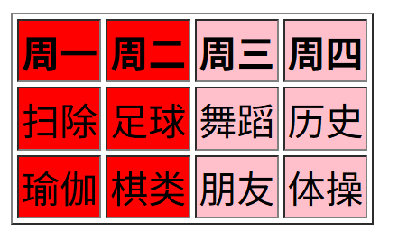

## `<colgroup>`

**表格列组** [`<colgroup>`](https://developer.mozilla.org/zh-CN/docs/Web/HTML/Reference/Elements/colgroup) 用于通过 `span` 属性给表格各列分组。

```html
<table  border="1">
  <colgroup span="2" style="background-color: red"></colgroup>
  <tr>
    <th>周一</th>
    <th>周二</th>
    <th>周三</th>
    <th>周四</th>
  </tr>
  <tr>
    <td>扫除</td>
    <td>足球</td>
    <td>舞蹈</td>
    <td>历史</td>
  </tr>
  <tr>
    <td>瑜伽</td>
    <td>棋类</td>
    <td>朋友</td>
    <td>体操</td>
  </tr>
</table>
```

> 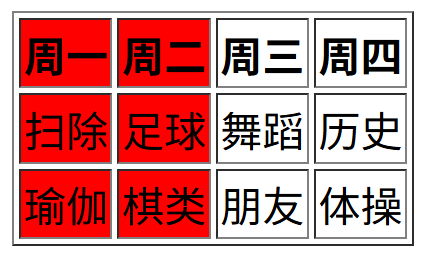

**注意**：`<colgroup>` 的某个属性会默认持续作用到 `span` 的值那一列，但如果遇到的 `<col>` 元素定义了相同属性，便会停止作用。

```html
<table border="1">
  <colgroup span="4" style="background-color: red">
    <col />
    <col style="background-color: pink"/>
  </colgroup>
  <tr>
    <th>周一</th>
    <th>周二</th>
    <th>周三</th>
    <th>周四</th>
  </tr>
  <tr>
    <td>扫除</td>
    <td>足球</td>
    <td>舞蹈</td>
    <td>历史</td>
  </tr>
  <tr>
    <td>瑜伽</td>
    <td>棋类</td>
    <td>朋友</td>
    <td>体操</td>
  </tr>
</table>
```

> 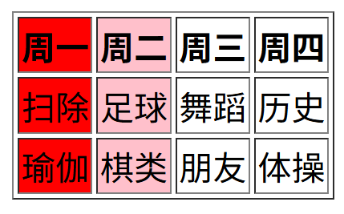

# 表单

HTML 中的表单和按钮是与网站用户进行交互的强大工具。它们常用于为用户提供控件，以便操作用户界面（UI）或在需要时输入数据。

## `<button>`

### 语法

[`<button>`](https://developer.mozilla.org/zh-CN/docs/Web/HTML/Reference/Elements/button) 元素用于在 HTML 中创建**按钮**，可以包含文本、图像或其他 HTML 元素。它是一个多功能的元素，通常用于与 JavaScript 配合执行自定义操作。

```html
<button type="reset">重置</button>
```

与 `<input>` 元素的按钮相比，`<button>` 元素具有更多的自定义选项和样式，可以包含其他 HTML 元素，并且更容易通过 CSS 进行样式化。

```html
<!-- 这是一个包含按钮的示例 -->
<button>
   点击我
</button>
```

在使用 `<button>` 元素时，通常会结合 JavaScript 使用，例如：

```html
<button onclick="myFunction()">点击我</button>

<script>
  function myFunction() {
    alert("按钮被点击了！");
    // 执行其他自定义操作
  }
</script>
```

### `type`

[`type`](https://developer.mozilla.org/zh-CN/docs/Web/HTML/Reference/Elements/button#type) 是一个公用属性，表示元素的类型。在这里用于指定 `<button>` 的类型：

- **`submit`**：默认值，提交按钮，在表单内点击时会提交表单。
- **`button`**：普通按钮，没有默认行为。
- **`reset`**：重置按钮，重置所有表单组件为默认值。

### `disabled`

[`disabled`](https://developer.mozilla.org/zh-CN/docs/Web/HTML/Reference/Attributes/disabled) 是一个表单公用*布尔属性*，用于表示用户不能与该元素交互。

```html
<input type="text" name="text" disabled>
```

**在上述示例中**：

- 使用 `disabled` 属性，使用户不能在文本块输入。

### 其它属性

`<button>` 元素的[属性](https://developer.mozilla.org/zh-CN/docs/Web/HTML/Reference/Elements/button#属性)：

- 更多...

## `<datalist>`

[`<datalist>`](https://html.spec.whatwg.org/multipage/form-Elements.html#the-datalist-Elements)

## `<fieldset>`

### 语法

[`<fieldset>`](https://developer.mozilla.org/zh-CN/docs/Web/HTML/Reference/Elements/fieldset) 用于对表单控件进行分组。

```html
<form action="./payment_page" method="get">
  <fieldset>
    <legend>选择酒店房型：</legend>
    <input type="radio" name="hotel" value="economy" />
    经济型（+$0）

    <input type="radio" name="hotel" value="superior" />
    高级型（+$50）

    <input type="radio" name="hotel" value="penthouse" />
    顶级套房（+$150）
  </fieldset>
  <fieldset>
    <legend>要参加的课程：</legend>
    <input type="checkbox" name="yoga" />
    瑜伽（+$10）

    <input type="checkbox" name="coffee" />
    咖啡烘焙（+$20）

    <input type="checkbox" name="balloon" />
    气球动物艺术（+$5）
  </fieldset>
</form>
```

> 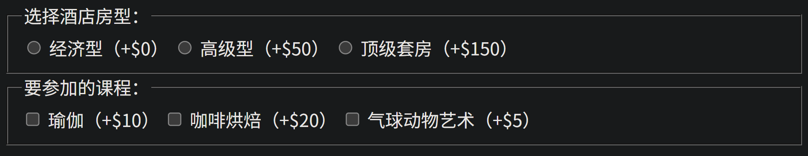

**在上述示例中**：

- 使用 `<fieldset>` 元素对表单控件 `<input>` 进行分组。
- 使用 `<legend>` 元素为分组添加标题。

### 其它属性

- [`disabled`](https://developer.mozilla.org/zh-CN/docs/Web/HTML/Reference/Attributes/disabled)：表禁用，用法同 `<button>` 的 [`disabled`](#`disabled`)。

## `<form>`

### 语法

**表单** [`<form>`](https://developer.mozilla.org/zh-CN/docs/Web/HTML/Reference/Elements/form) 是表单控件的外层元素，用于将所有的表单控件组织到一起。

```html
<form action="/submit" method="get">
  <!-- 这里是表单内容，包括输入框、按钮等 -->
  <button type="submit">提交</button>
</form>
```

**在上述示例中**：

- `<form>`：表单控件的*外层元素*
    - `action`：指定表单数据提交的*目标 URL*
    - `method`：指定表单数据提交时使用的 *HTTP 请求方法*
- `<button>`：创建一个*提交按钮*
    - `submit`：指定按钮类型为*提交*

### `action`

[`action`](https://developer.mozilla.org/zh-CN/docs/Web/HTML/Reference/Elements/form#action) 属性用于指定表单数据提交的目标 URL。当用户填写表单并点击提交按钮时，浏览器会将表单数据发送到指定的 `action` URL。

**语法**：`<form action="/submit">`

### `method`

[`method`](https://developer.mozilla.org/zh-CN/docs/Web/HTML/Reference/Elements/form#method) 属性用于指定表单数据提交时使用的 [*HTTP 请求方法*](http.md/#请求方法 "http | 请求方法")。

- **[GET](https://developer.mozilla.org/zh-CN/docs/Web/HTTP/Methods/GET)**：
    - 当使用 `GET` 方法提交表单时，表单数据会附加在 URL 的末尾（query string），并以键值对的形式出现。这种方式适合用于获取数据，但不适合包含敏感信息，因为数据会明文显示在 URL 中。GET 方法通常用于数据检索，而不涉及对服务器上数据的修改。
- **[POST](https://developer.mozilla.org/zh-CN/docs/Web/HTTP/Methods/POST)**：
    - 表单数据会包含在表单体内然后发送给服务器。
    - 使用 `POST` 方法提交表单时，表单数据会包含在表单体内，而不会显示在 URL 中。这种方式更适合用于提交敏感信息和对服务器上数据进行修改。POST 方法通常用于表单提交，文件上传等需要传输大量数据或包含敏感信息的场景。传递文件必须使用 `POST` 形式传递。
- `dialog`

**语法**：`<form method="post">`

### 其它属性

`<form>` 元素的[属性](https://developer.mozilla.org/zh-CN/docs/Web/HTML/Reference/Elements/form#属性)：

- [**`target`**](https://developer.mozilla.org/zh-CN/docs/Web/HTML/Reference/Elements/form#target)：目标窗口，用法同 `<a>` 的 [`target`](#`target`)。
- 更多...

## `<input>`

### 语法

**输入框** [`<input>`](https://developer.mozilla.org/zh-CN/docs/Web/HTML/Reference/Elements/input) 用于创建各种表单控件，允许用户输入数据或进行选择。

```html
<input type="text" name="text">
```

> 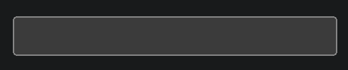

**在上述示例中**：

- 使用 `type="text"` 类型的 `<input>` 元素创建**文本框**。
- 使用 `name` 的属性值作为数据提交时键值对的**键**。
- *用户输入值*作为数据提交时键值对的**值**。

### `name`

[`name`](https://developer.mozilla.org/zh-CN/docs/Web/HTML/Reference/Elements/input#name) 的属性值作为数据提交时键值对的**键**。在不同表单控件中会表现其它作用，详见具体控件。

当用户点击提交按钮时，浏览器会收集表单中所有带有 `name` 属性的表单控件，并将它们组织成一系列的“键值对”进行发送。如果一个表单控件缺少 `name` 属性，那么它输入或选中的数据**将不会**被浏览器包含在提交的数据中。

- **键 (Key)：** 就是元素的 `name` 属性的值。
- **值 (Value)：** 就是元素的 `value` 属性的值。

以下是包含 `name` 属性的示例：

```html
<form action="/submit" method="get">
  <input type="text" name="username"/>
  <button type="submit">提交</button>
</form>
```

> 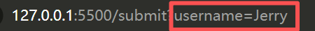

**在上述示例中**：

- 使用 `type="text"` 类型的 `<input>` 元素创建**文本框**。
- 使用 `name` 的属性值作为数据提交时键值对的**键**。
- 用户输入的 `Jerry` 作为数据提交时键值对的**值**。

### `placeholder`

[`placeholder`](https://developer.mozilla.org/zh-CN/docs/Web/HTML/Reference/Attributes/placeholder) 属性定义了当表单控件没有值时在控件中显示的文本，简要提示用户应向控件输入的预期数据类型。

```html
<input type="text" placeholder="请输入用户名">
```

> 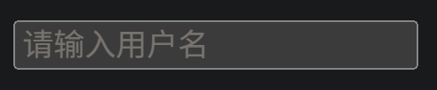

### `type`

#### 语法

[`type`](https://developer.mozilla.org/zh-CN/docs/Web/HTML/Reference/Elements/input#type) 是一个公用属性，表示元素的类型，在这里用于指定 `<input>` 的类型。`<input>` 的工作方式相当程度上取决于 `type` 属性的值。

- 允许的值在 [`<input>` 类型](https://developer.mozilla.org/zh-CN/docs/Web/HTML/Reference/Elements/input#input_类型)中
- 默认类型为 `text`
- [`submit`](https://developer.mozilla.org/zh-CN/docs/Web/HTML/Reference/Elements/input/submit)：创建提交按钮，不如 `<button type="submit">提交</button>` 灵活。

#### `checkbox`

[`checkbox`](https://developer.mozilla.org/zh-CN/docs/Web/HTML/Reference/Elements/input/checkbox) 类型的 `<input>` 元素用于创建**复选框**，允许用户选择或取消选择一个或多个选项。

```html
<input type="checkbox" name="vehicle" value="Bike" />自行车
<input type="checkbox" name="vehicle" value="Car" />小汽车
```

> 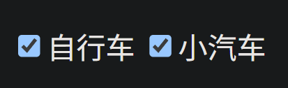

**在上述示例中**：

- 使用 `type="checkbox"` 类型的 `<input>` 元素创建**复选框**。
- 使用 `name` 属性
    - 作为数据提交时键值对的**键**。
    - 将复选框分组在一起。
- 使用 `value` 的属性值作为数据提交时键值对的**值**。

#### `file`

[`file`](https://developer.mozilla.org/zh-CN/docs/Web/HTML/Reference/Elements/input/file) 类型的 `<input>` 元素用于创建文件上传表单控件，允许用户从本地文件系统中选择一个或多个文件，并将其上传到服务器。

```html
<form action="/upload" method="post" enctype="multipart/form-data">
  <label for="avatar">请上传图片：</label>
  <input type="file" id="avatar" name="avatar" accept="image/*">
  <input type="submit" value="上传">
</form>
```

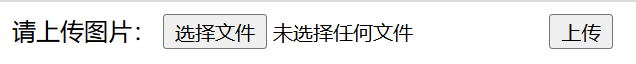

**在上述示例中**：

- `method="post"`：传递文件必须使用 `POST` 形式传递。
- `enctype="multipart/form-data"`：指定了表单数据的编码类型，通常在上传文件时使用。
- `type="file"`：表示创建一个文件上传控件。
- `accept="image/*"`：限制文件类型，仅允许选择图片文件。

#### `password`

[`password`](https://developer.mozilla.org/zh-CN/docs/Web/HTML/Reference/Elements/input/password) 类型的 `<input>` 元素用于创建密码输入框，允许用户输入密码或其他敏感信息。与 `text` 类型的 `<input>` 不同，密码输入框中的输入通常以点或星号的形式显示，以隐藏实际输入的字符。

```html
<input type="password" name="password">
```

> 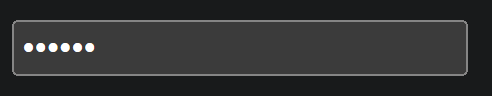

**在上述示例中**：

- 使用 `type="checkbox"` 类型的 `<input>` 元素创建**复选框**。
- 使用 `name` 的属性值作为数据提交时键值对的**键**。
- *用户输入值*作为数据提交时键值对的**值**。

#### `radio`

[`radio`](https://developer.mozilla.org/zh-CN/docs/Web/HTML/Reference/Elements/input/radio) 类型的 `<input>` 元素用于创建**单选框**，允许用户从一组选项中选择一个选项。

```html
<input type="radio" name="gender" value="male" /> 男性
<input type="radio" name="gender" value="female" /> 女性
```

> 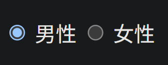

**在上述示例中**：

- 使用 `type="radio"` 类型的 `<input>` 元素创建**单选框**。
- 使用 `name` 属性
    - 作为数据提交时键值对的**键**。
    - 将单选框分组在一起，确保用户只能从同一组中选择一个选项。

- 使用 `value` 属性为每个选项指定一个值，作为数据提交时键值对的**值**。

#### `text`

[`text`](https://developer.mozilla.org/zh-CN/docs/Web/HTML/Reference/Elements/input/text) 类型的 `<input>` 元素用于创建单行文本输入框。

```html
<input type="text" name="text">
```

> 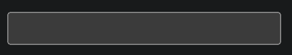

**在上述示例中**：

- 使用 `type="text"` 类型的 `<input>` 元素创建**文本框**。
- 使用 `name` 的属性值作为数据提交时键值对的**键**。
- *用户输入值*作为数据提交时键值对的**值**。

### `value`

[`value`](https://developer.mozilla.org/zh-CN/docs/Web/HTML/Reference/Elements/input#value) 属性用于指定表单控件的默认值，以及数据提交时键值对的**值**。关于*数据提交时的“键值对”*，详见 `<input>` 中的 `name` 属性。

作为表单控件的默认值：

```html
<!-- 不指定默认值 -->
<input type="text" name="text" /><br>

<!-- 指定默认值 -->
<input type="text" name="text" value="默认值" />
```

> 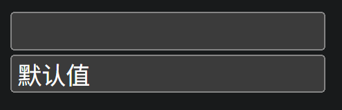

### 其它属性

`<input>` 元素的 [属性](https://developer.mozilla.org/zh-CN/docs/Web/HTML/Reference/Elements/input#属性)：

- [`disabled`](https://developer.mozilla.org/zh-CN/docs/Web/HTML/Reference/Attributes/disabled)：表禁用，用法同 `<button>` 的 [`disabled`](#`disabled`)。
- [`accept`](https://developer.mozilla.org/zh-CN/docs/Web/HTML/Reference/Elements/input#accept)：限制文件类型。`accept="image/*"`，仅允许选择图片文件。
- [`required`](https://developer.mozilla.org/zh-CN/docs/Web/HTML/Reference/Elements/input#required)：当存在时，要求用户在提交表单之前必须填写该字段
- [`readonly`](https://developer.mozilla.org/zh-CN/docs/Web/HTML/Reference/Elements/input#readonly)：当存在时，使输入框变为只读，用户无法编辑输入框的内容
- [`size`](https://developer.mozilla.org/zh-CN/docs/Web/HTML/Reference/Elements/input#size)：控件尺寸
- 更多...

## `<label>`

### 语法

[`<label>`](https://developer.mozilla.org/zh-CN/docs/Web/HTML/Reference/Elements/label) 用于为某些文本和表单控件提供关联。

-  点击关联的标签来聚焦或者激活输入框，就像直接点击输入框一样，这扩大了输入框的*可点击区域*。
-  当用户聚焦到输入框时，屏幕阅读器可以读出标签，让使用辅助技术的用户更容易理解应输入什么数据。

```html
<label for="username">用户名:</label>
<input type="text" id="username" name="username" placeholder="请输入用户名">
```


**在上述示例中**：

- 使用 `<label>` 元素来标识 `用户名：` 文本。
    - 使用 `for="username"` 属性关联 `<input>` 元素的 `id`。
- 使用 `<input>` 元素来创建文本输入框。
    - 使用 `id="username"` 属性接受 `<label>` 元素的 `for` 属性的关联。
- 当用户点击 `用户名：` 时，也可以激活输入框，而不是必须点击输入框。

**扩展**：如果将 `<input>` 元素嵌套在 `<label>` 元素内部，就不需要使用 `for` 和 `id` 属性，因为它们将自动关联。但这种方式不利于 CSS 样式控制。

```html
<label>
  用户名:
  <input type="text" name="username" placeholder="请输入用户名" />
</label>
```

### 其它属性

- [**`for`**](https://developer.mozilla.org/zh-CN/docs/Web/HTML/Reference/Elements/label#for) 属性用于关联表单控件中的 `id`。
- 更多...

## `<legend>`

[`<legend>`](https://html.spec.whatwg.org/multipage/form-Elements.html#the-legend-Elements) 元素表示其父元素 `<fieldset>` 内容的标题，用法见 [`<fieldset>`](#`<fieldset>`) 元素。

## `<meter>`

**标量** [`<meter>`](https://developer.mozilla.org/zh-CN/docs/Web/HTML/Reference/Elements/meter) 元素表示在已知范围内的标量值或分数值。

**注意**：不能用 `<meter>` 表示进度（例如进度条），应该使用 `<progress>` 表示进度。

```html
电池电量：<meter min="0" max="100" value="75">75%</meter>
```

> 电池电量：<meter min="0" max="100" value="75">75%</meter>

**在以上示例中**：

- `min` 属性表示最小值
- `max` 属性表示最大值
- `value` 属性表示当前值

## `<optgroup>`

### 语法

[`<optgroup>`](https://developer.mozilla.org/zh-CN/docs/Web/HTML/Reference/Elements/optgroup) 用于为 `<select>` 中的 `<option>` 元素创建分组。

```html
选择一辆汽车:
<select name="cars" multiple>
  <optgroup label="德国车">
    <option value="volvo">奔驰</option>
    <option value="saab">宝马</option>
  </optgroup>

  <optgroup label="日本车">
    <option value="mercedes">丰田</option>
    <option value="audi">本田</option>
  </optgroup>
</select>
```

> 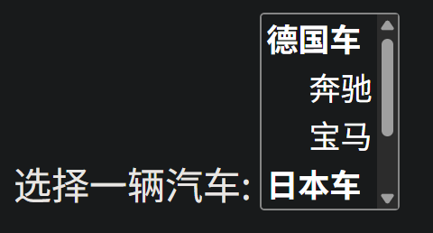

**在上述示例中**：

- 使用 `<optgroup>` 元素的 `label` 属性为 `<select>` 中的 `<option>` 元素创建分组。

### 其它属性

`<optgroup>` 元素的[属性](https://developer.mozilla.org/zh-CN/docs/Web/HTML/Reference/Elements/optgroup#属性)：

- [`disabled`](https://developer.mozilla.org/zh-CN/docs/Web/HTML/Reference/Attributes/disabled)：表禁用，用法同 `<button>` 的 [`disabled`](#`disabled`)。
- [`label`](https://developer.mozilla.org/zh-CN/docs/Web/HTML/Reference/Elements/optgroup#label)：分组组名
- 更多...

## `<option>`

[`<option>`](https://developer.mozilla.org/zh-CN/docs/Web/HTML/Reference/Elements/option) 用于定义在 [`<select>`](#`<select>`)、[`<optgroup>`](#`<optgroup>`) 或 [`<datalist>`](#`<datalist>`) 元素中包含的项。

用法参见 [`<select>`](#`<select>`)

## `<output>`

[`<output>`](https://developer.mozilla.org/zh-CN/docs/Web/HTML/Reference/Elements/output) 元素表示计算或用户操作的结果。

```html
<form oninput="result.value=parseInt(a.value)+parseInt(b.value)">
  <input type="range" name="b" value="50" /> +
  <input type="number" name="a" value="10" /> =
  <output name="result"></output>
</form>
```

> 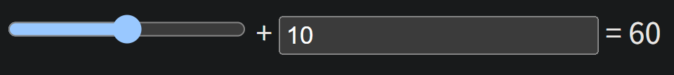

## `<progress>`

**进度** [`<progress>`](https://developer.mozilla.org/zh-CN/docs/Web/HTML/Reference/Elements/progress) 元素用来显示一项任务的完成进度。

```html
当前进度：<progress id="file" max="100" value="70">70%</progress>
```

> 当前进度：<progress id="file" max="100" value="70">70%</progress>

**在以上示例中**：

- `max` 属性表示最大值
- `value` 属性表示当前值

## `<select>`

### 语法

**下拉框** [`<select>`](https://developer.mozilla.org/zh-CN/docs/Web/HTML/Reference/Elements/select) 元素表示一个提供下拉菜单的控件。通常与 `<option>` 元素结合使用，每个 `<option>` 表示一个可选项。

```html
请选择一辆汽车：
<select name="car">
  <option value="">请点击选择</option>
  <option value="volvo">沃尔沃</option>
  <option value="saab">萨博</option>
  <option value="mercedes">奔驰</option>
  <option value="audi">奥迪</option>
</select>
```

> 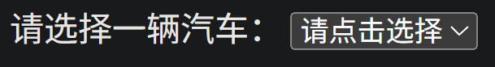

**在上述示例中**：

- 使用 `<select>` 元素创建下拉列表框。
    - 使用 `name` 的属性值作为数据提交时键值对的**键**。
- 使用 `<option>` 元素定义了下拉列表中的每个选项。
    - 使用 `value` 的属性值作为数据提交时键值对的**值**。

### `multiple`

[`multiple`](https://developer.mozilla.org/zh-CN/docs/Web/HTML/Reference/Elements/select#multiple) 是一个*布尔属性*，表示是否支持多选。用户可以通过 `Ctrl` 键选择多个选项。

```html
选择一辆汽车:
<select name="cars" multiple>
  <option value="volvo">沃尔沃</option>
  <option value="saab">萨博</option>
  <option value="mercedes">奔驰</option>
  <option value="audi">奥迪</option>
</select>
```

> 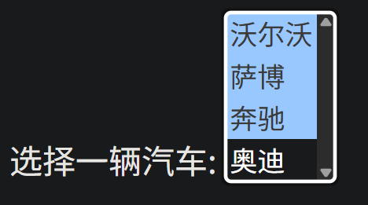

### 其它属性

`<select>` 元素的[属性](https://developer.mozilla.org/zh-CN/docs/Web/HTML/Reference/Elements/select#属性)：

- [`name`](https://developer.mozilla.org/zh-CN/docs/Web/HTML/Reference/Elements/select#name)：属性值作为数据提交时键值对的**键**，用法同 `<input>` 的 [`name`](#name)。
- 更多...

## `<selectedcontent>`

[`<selectedcontent>`](https://developer.mozilla.org/en-US/docs/Web/HTML/Reference/Elements/selectedcontent) 目前是一个*实验元素*，在某些最广泛使用的浏览器中不起作用。

## `<textarea>`

### 语法

**多行文本** [`<textarea>`](https://developer.mozilla.org/zh-CN/docs/Web/HTML/Reference/Elements/textarea) 元素用于在表单中创建**多行文本输入框**，允许用户输入大段自由格式的文本。

```html
Tell us your story:
<textarea name="story" rows="5" cols="33"></textarea>
```

> 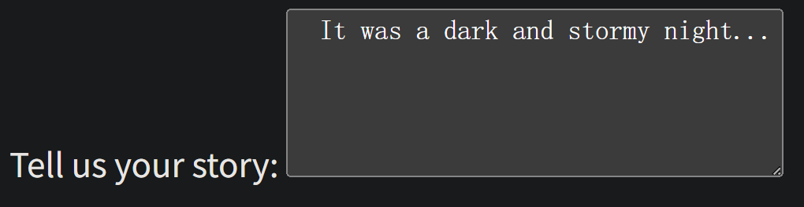

**在上述示例中**：

- 使用 `<textarea>` 元素创建多行文本输入框。
- 使用 `name` 的属性值作为数据提交时键值对的**键**。
- 用户输入的 `It was a dark and stormy night...` 作为数据提交时键值对的**值**。
- `rows` 和 `cols` 属性定义了文本框的行数和列数，这是可选的。

### 其它属性

`<textarea>` 元素的[属性](https://developer.mozilla.org/zh-CN/docs/Web/HTML/Reference/Elements/textarea#属性)：

- [`cols`](https://developer.mozilla.org/zh-CN/docs/Web/HTML/Reference/Elements/textarea#cols)：控件可见文本的列数，默认为20。
- [`disabled`](https://developer.mozilla.org/zh-CN/docs/Web/HTML/Reference/Attributes/disabled)：表禁用，用法同 `<button>` 的 [`disabled`](#`disabled`)。
- [`name`](https://developer.mozilla.org/zh-CN/docs/Web/HTML/Reference/Elements/select#name)：属性值作为数据提交时键值对的**键**，用法同 `<input>` 的 [`name`](#name)。
- [`rows`](https://developer.mozilla.org/zh-CN/docs/Web/HTML/Reference/Elements/textarea#rows)：控件可见文本的行数，默认为2。
- 更多...

# 交互

## `<details>`

**折叠组件** [`<details>`](https://developer.mozilla.org/zh-CN/docs/Web/HTML/Reference/Elements/details) 可创建一个折叠组件，仅在被切换成展开状态时，它才会显示内含的信息。`<summary>` 元素可为该部件提供概要或者标签。

```html
<details>
  <summary>古埃及</summary>
  <p>
    <a href="https://zh.wikipedia.org/wiki/早王朝時期_(埃及)">早王朝时期</a> 前3150年–前2686年
  </p>
  <p>
    <a href="https://zh.wikipedia.org/wiki/古王国时期">古王国时期</a> 前2686年–前2181年
  </p>
  <p>
    <a href="https://zh.wikipedia.org/wiki/第一中间时期">第一中间时期</a> 前2181年–前2055年
  </p>
  <p>更多...</p>
</details>
```

> <details>
> <summary>古埃及</summary>
> <p>
> <a href="https://zh.wikipedia.org/wiki/早王朝時期_(埃及)">早王朝时期</a> 前3150年–前2686年
> </p>
> <p>
> <a href="https://zh.wikipedia.org/wiki/古王国时期">古王国时期</a> 前2686年–前2181年
> </p>
> <p>
> <a href="https://zh.wikipedia.org/wiki/第一中间时期">第一中间时期</a> 前2181年–前2055年
> </p>
> <p>更多...</p>
> </details>

## `<summary>`

**折叠摘要** [`<summary>`](https://html.spec.whatwg.org/multipage/interactive-Elements.html#the-summary-Elements) 作为 `<details>` 的子元素，共同创建折叠组件，详见 [`<details>`](#`<details>`)。

## `<dialog>`

**对话框** [`<dialog>`](https://developer.mozilla.org/zh-CN/docs/Web/HTML/Reference/Elements/dialog) 元素用于表示一个对话框或其他交互式组件。

```html
<button onclick="document.getElementById('myDialog').showModal()">
  打开模态框
</button>

<dialog id="myDialog">
  <h2>请确认您的操作</h2>
  <p>您确定要继续吗？</p>

  <button onclick="document.getElementById('myDialog').close()">
    关闭
  </button>
</dialog>
```

**在以上示例中**：

- `<dialog>`：对话框组件
- `id="myDialog"`：与 JavaScript 事件关联

# 脚本

## `<script>`

**脚本** [`<script>`](https://developer.mozilla.org/zh-CN/docs/Web/HTML/Reference/Elements/script) 用于在 HTML 中嵌入 JS 脚本，或引入外部 JS 脚本，详见 [`javascript | 引入方式`](javascript.md#引入方式)。

## `<noscript>`

**无脚本** [`<noscript>`](https://developer.mozilla.org/zh-CN/docs/Web/HTML/Reference/Elements/noscript) 定义当浏览器**不支持**脚本（JavaScript）或者用户在浏览器中**关闭**了脚本功能时，应该显示给用户的**替代内容**。实际就是一种回退机制。

```html
<p id="status">正在检查脚本状态...</p>

<script>
  // 2. JavaScript 找到并修改 ID 为 'status' 的元素
  document.getElementById("status").innerText =
    "脚本已开启，页面功能完整。";
</script>

<noscript>
  <p>警告：为了获得完整的网站体验，请在浏览器中启用 JavaScript。</p>
</noscript>
```

> <figure>
>        src="assets/image-20251012231344600.png"
>     alt="开启脚本的结果"
>     style="height: 50px"
>   />
>   <figcaption style="font-size: 16px; color: gray">
>     开启脚本的结果
>   </figcaption>
> </figure>
>
> <figure>
>        src="assets/image-20251012230445393.png"
>     alt="开启脚本的结果"
>     style="height: 100px"
>   />
>   <figcaption style="font-size: 16px; color: gray">
>     关闭脚本的结果
>   </figcaption>
> </figure>

开启或关闭 Chrome 浏览器的脚本功能：

- `设置` > `隐私和安全` > `网站设置` > `JavaScript`
- 选择是否允许网站使用 JavaScript

## `<template>`

**内容模板** [`<template>`](https://developer.mozilla.org/zh-CN/docs/Web/HTML/Reference/Elements/template) 用于创建一个模板片段，渲染时使用 JavaScript 动态插入到 HTML 文档目标点。

```html
<template id="item-template">
  <li>
    <p>名称：<span></span></p>
    <p>价格：<span></span></p>
  </li>
</template>

<ul id="item-list"></ul>

<script>
    const template = document.getElementById('item-template');
    const list = document.getElementById('item-list');
    
    // 假设这是需要添加到页面的数据
    const data = { name: "苹果", price: "5.00" };

    // 3. 通过 JavaScript 使用模板
    const clone = template.content.cloneNode(true); // 克隆模板内容
    
    // 4. 修改克隆出来的内容并激活它
    clone.querySelector('p:first-child span').textContent = data.name;
    clone.querySelector('p:last-child span').textContent = data.price;

    list.appendChild(clone); // 将激活的内容插入到文档中
</script>
```

**在上述示例中**：

- `<template>` 元素用于创建模板。
- `id="item-template"` 属性用于 JavaScript 获取到 `<template>`。
- `id="item-list""` 属性用于 JavaScript 获取到 `<ul>`。
- JavaScript 会动态地将新产生的 `<li>` 元素添加到 `<ul>` 中。

## `<slot>`

**插槽** [`<slot>`](https://developer.mozilla.org/zh-CN/docs/Web/HTML/Reference/Elements/slot) 是一个在 web 组件内部的占位符，你可以使用自己的标记来填充该占位符，从而创建单独的 DOM 树并将其一起呈现。

默认插槽：

```html
<!-- 定义模板 -->
<template id="user-card-template">
  <div>
    <slot name="info"></slot>
    <slot></slot>
  </div>
</template>

<!-- 使用自定义元素 -->
<user-card>
  <p slot="info">这里是插入到 info 插槽的内容。</p>
  <p>这是默认插槽的内容。</p>
</user-card>

<script>
  class UserCard extends HTMLElement {
    constructor() {
      super();
      // 创建 shadow DOM
      const shadow = this.attachShadow({ mode: "open" });
      // 获取模板内容
      const template = document.getElementById("user-card-template");
      // 克隆模板并添加到 shadow DOM
      shadow.appendChild(template.content.cloneNode(true));
    }
  }

  // 注册自定义元素
  customElements.define("user-card", UserCard);
</script>
```

> 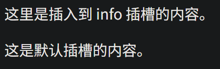

**在以上示例中**：

- `<template>`：模板的结构
    - `<slot name="info">`：具名插槽，与 `<user-card>` 中的 `<p slot="info">` 关联，接收其内容。
    - `<slot>`：默认插槽，与 `<user-card>` 中的 `<p>` 关联，接收其内容。
- `<user-card>`：模板的实例，元素由 JavaScript 定义。
- 浏览器会根据模板的结构，渲染一个示例。

## `<canvas>`

**画布** [`<canvas>`](https://developer.mozilla.org/zh-CN/docs/Web/HTML/Reference/Elements/canvas) 元素可被用来通过 JavaScript（[Canvas](https://developer.mozilla.org/zh-CN/docs/Web/API/Canvas_API) API 或 [WebGL](https://developer.mozilla.org/zh-CN/docs/Web/API/WebGL_API) API）绘制图形及图形动画。

```html
<canvas id="myCanvas" width="500" height="300">
  抱歉，您的浏览器不支持 HTML5 canvas 元素。
</canvas>

<script>
  // 2. 编写 JavaScript 绘图代码
  window.onload = function () {
    // 2.1 获取 Canvas 元素
    const canvas = document.getElementById("myCanvas");

    // 检查浏览器是否支持 Canvas
    if (canvas.getContext) {
      // 2.2 获取 2D 渲染上下文
      const ctx = canvas.getContext("2d");

      // 2.3 使用上下文绘制图形 (绘制一个红色矩形)

      // 设置填充颜色为红色
      ctx.fillStyle = "red";

      // 绘制一个填充矩形
      // 参数：(起始x坐标, 起始y坐标, 宽度, 高度)
      ctx.fillRect(50, 50, 150, 75);
    } else {
      // 如果不支持，则执行备用内容 (浏览器会显示 canvas 标签内部的文本)
      console.error("您的浏览器不支持 Canvas。");
    }
  };
</script>
```

