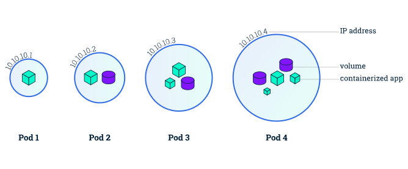

# Kubernetes

[**K8S**](https://kubernetes.io/zh-cn/docs/home/)（Kubernetes，集群）是一个可移植、可扩展的开源平台，用于管理容器化的工作负载和服务，可促进声明式配置和自动化。

## 环境搭建

- K8S 需运行在 Docker 基础上
- 在本地使用 Minikube 搭建集群
- 在 Cloud 中搭建集群
- 其它

## K8S 架构


## [K8S Objects](https://kubernetes.io/zh-cn/docs/concepts/overview/working-with-objects/)

- _Kubernetes objects_ are persistent entities in the Kubernetes system.

### [Manifest File](https://kubernetes.io/docs/concepts/overview/working-with-objects/#describing-a-kubernetes-object)

#### [Fields](https://kubernetes.io/docs/concepts/overview/working-with-objects/#required-fields)

#### [Field Selectors](https://kubernetes.io/zh-cn/docs/concepts/overview/working-with-objects/field-selectors/)

#### [Labels](https://kubernetes.io/zh-cn/docs/concepts/overview/working-with-objects/common-labels/)

# Control Plane

[**Control Plane**](https://kubernetes.io/zh-cn/docs/concepts/overview/components/#control-plane-components) is one of the cluster's basic components, and make global decisions about the cluster.

# Cluster

## Cluster basics

- A Kubernetes cluster consists of two types of resources:

  - **Control Plane**: The Control Plane is responsible for managing the cluster.
  - **Node**: A node is a VM or a physical computer that serves as a worker machine in a Kubernetes cluster.

- [All the required components in a complete and working cluster.](https://kubernetes.io/zh-cn/docs/concepts/overview/components/)

  

- Basic commands

  ```bash
  # Show cluster
  kubectl cluster-info
  # Stop Cluster
  systemctl stop kubelet
  ```

## Build cluster

搭建集群需要一些步骤，主要是配置和安装相关软件。以下是 GPT 在一台空服务器上搭建集群的一般步骤：

- **选择操作系统**：选择适合您需求的操作系统。常见的选择包括 Ubuntu、CentOS、或者其他 Linux 发行版。
- **安装必要软件**：安装必要的软件，包括 SSH 服务器（用于远程连接）和基本的网络配置。
- **配置主机名和 IP 地址**：为您的服务器配置主机名和静态 IP 地址，这样其他服务器可以通过主机名或 IP 地址访问它。
- **安装容器化平台**：选择并安装适合您的容器化平台，比如 Docker 或者 Kubernetes。这些平台可以帮助您管理和运行应用程序容器。
- **配置容器化平台**：配置您的容器化平台，包括设置网络、存储和其他必要的配置。
- **创建集群**：使用容器化平台工具创建一个集群，将多台服务器连接在一起。
- **部署应用程序**：将您的应用程序容器化，并在集群中部署它们。您可以使用 Docker 镜像或者 Kubernetes 部署描述文件来简化这个过程。
- **监控和维护**：设置监控和日志记录，确保您的集群正常运行。定期进行维护和更新以确保安全性和性能。

# Deployment

## Deployment 基础

Deployment（部署）是 Kubernetes 中用于管理 Pod 和 ReplicaSet 的控制器。它定义了您希望部署的应用程序的期望状态，并负责确保集群中的实际状态与所定义的状态匹配。


- **基础命令**

  ```bash
  # 查看 deployment
  kubectl get deployment
  # 手动创建 deployment
  kubectl create deployment DEPLOYMENT_NAME --image=IMAGE
  # YAML 文件创建 deployment
  kubectl apply -f deployment.yaml
  # 删除 deployment
  kubectl delete deployment DEPLOYMENT_NAME
  ```

- **deployment.yaml**

  ```yaml
  apiVersion: apps/v1 # API 版本
  kind: Deployment # 资源类型
  metadata: # 资源元数据
    labels: # 资源标签
      $KEY: $VLUE # 资源的标签键值对，可以用来标识和分类资源
    name: # Deploymnet 名称
    namespace: # Deploymnet 命名空间
  spec: # Deploymnet 规格
    replicas: # Pod 数量
    selector: # 标签选择器，用于选择要管理的 Pod
      matchLabels: # 匹配标签
        $KEY: $VLUE # 标签选择器中用于匹配的标签键值对
    template: # Pod 模板
      metadata: # Pod 元数据
        labels: # Pod 标签
          $KEY: $VLUE # Pod 的标签键值对
      spec: # Container 规格
        containers: # Container 列表
          - image: # Image 地址
            imagePullSecrets: # Image 下载策略
            name: # Container 名称
            args: # ENTRYPOINT 参数
            commnd: # 执行命令
            ports: # Container 公开端口
            env: # 环境变量
            resources: # 容器资源限制和请求
              requests: # 请求资源
                memory: "1Gi" # 请求内存为 1Gi
                cpu: "500m" # 请求 CPU 为 500m
                ephemeral-storage: "1Gi" # 请求临时存储为 1Gi
              limits: # 资源限制
                memory: "1Gi" # 内存限制为 1Gi
                cpu: "500m" # CPU 限制为 500m
                ephemeral-storage: "1Gi" # 临时存储限制为 1Gi
            livenessProbe: # 存活检查
            readinessProbe: # 就绪检查
            startupProbe: # 启动检查
            volumeMounts: # 卷挂载
            securityContext: # 安全上下文
            lifecycle: # 容器生命周期回调
        volumes: # Pod 的卷列表
  ```

  ```yaml
  apiVersion: apps/v1
  kind: Deployment
  metadata:
    labels:
      app: jerry-app
    name:
    namespace:
  spec:
    replicas:
    selector:
      matchLabels:
        app: jerry-app
    template:
      metadata:
        labels:
          app: jerry-app
      spec:
        containers:
          - image:
            imagePullSecrets:
            name:
            args:
            commnd:
            ports:
            env:
            resources:
              requests:
                memory: "1Gi"
                cpu: "500m"
                ephemeral-storage: "1Gi"
              limits:
                memory: "1Gi"
                cpu: "500m"
                ephemeral-storage: "1Gi"
            livenessProbe:
            readinessProbe:
            volumeMounts:
            securityContext:
            lifecycle:
        volumes:
  ```

# Kubectl

[**Kubectl**](https://kubernetes.io/zh-cn/docs/reference/kubectl/) 命令行工具用于与集群交互。

## Install

kubectl 可安装在各种 Linux 平台、 macOS 和 Windows 上。 在下面找到你喜欢的操作系统。

- [在 Linux 上安装 kubectl](https://kubernetes.io/zh-cn/docs/tasks/tools/install-kubectl-linux)
- [在 macOS 上安装 kubectl](https://kubernetes.io/zh-cn/docs/tasks/tools/install-kubectl-macos)
- [在 Windows 上安装 kubectl](https://kubernetes.io/zh-cn/docs/tasks/tools/install-kubectl-windows)

### Linux

[在 Linux 上安装 kubectl](https://kubernetes.io/zh-cn/docs/tasks/tools/install-kubectl-linux)

```bash
# 安装 kubectl
sudo snap install kubectl --classic
# 添加环境变量
export PATH=$PATH:/snap/bin
# 验证安装
kubectl version --client
```

### Windows

- [在 Windows 上安装 kubectl](https://kubernetes.io/zh-cn/docs/tasks/tools/install-kubectl-windows)，以下是使用 Chocolatey 方法安装 Kubectl。
- 已在 Windows 系统中安装 [Chocolatey](windows.md#chocolatey)。
- 以管理员身份运行 PowerShell 安装，但重启所有终端后可以在 Bash 中使用。

  ```bash
  # 安装 kubectl
  choco install kubernetes-cli
  # 验证安装
  kubectl version --client
  ```

- 将 `系统环境变量` 中的 `C:\ProgramData\chocolatey\bin` 移至顶部，详见 [Windows 笔记](windows.md#系统变量)。

## Commands

[**Commands**](https://kubernetes.io/zh-cn/docs/reference/kubectl/)

```bash
# 列出资源
kubectl get $RESOURCE
# 删除资源
kubectl delete $RESOURCE
# 应用 apply
kubectl apply -f $YAML # `-f` 指定路径
# 查看资源日志
kubectl logs $RESOURCE
# 查看资源详细信息
kubectl describe $RESOURCE
```

**Options**

- `-n $NAMESPACE`：指定命名空间

# Minikube

[**Minikube**](https://minikube.sigs.k8s.io/docs/) 是本地 Kubernetes，供学习使用，不能用于生产环境。

## 环境搭建

[安装 Minikube](https://minikube.sigs.k8s.io/docs/start/?arch=%2Fwindows%2Fx86-64%2Fstable%2F.exe+download)

### Windows

- Docker 和 Kubectl 已安装

- [官网下载安装程序并安装。](https://minikube.sigs.k8s.io/docs/start/?arch=%2Fwindows%2Fx86-64%2Fstable%2F.exe+download)

- 以管理员身份运行 PowerShell，并将二进制文件 minikube.exe 添加到 PATH 目录中。

  ```shell
  $oldPath = [Environment]::GetEnvironmentVariable('Path', [EnvironmentVariableTarget]::Machine)
  if ($oldPath.Split(';') -inotcontains 'C:\minikube'){
    [Environment]::SetEnvironmentVariable('Path', $('{0};C:\minikube' -f $oldPath), [EnvironmentVariableTarget]::Machine)
  }
  ```

### Linux

- [**Install**](https://minikube.sigs.k8s.io/docs/start/?arch=%2Flinux%2Fx86-64%2Fstable%2Fbinary+download)

  ```bash
  curl -LO https://github.com/kubernetes/minikube/releases/latest/download/minikube-linux-amd64
  sudo install minikube-linux-amd64 /usr/local/bin/minikube && rm minikube-linux-amd64
  ```


## 命令

```bash
# 查看集群
minikube status
# 创建集群
minikube start
# 停止集群
minikube stop
# 删除集群
minikube delete
```

# Namespace

## Namespace 基础

[**Namespace**](https://kubernetes.io/zh-cn/docs/concepts/overview/working-with-objects/namespaces/)（命名空间）是 Kubernetes 中用于隔离和组织资源的虚拟工作空间。它是一种在逻辑上划分集群资源的方式，允许在同一集群内创建多个虚拟的独立环境。Namespace 作用域仅针对同一 Namespace 的对象，对集群范围的对象不适用。

```bash
# 创建 namespace
kubectl create namespace NAMESPACE_NAME
# 删除 namespace
kubectl delete namespace NAMESPACE_NAME
```

# Node

[**Node**](https://kubernetes.io/zh-cn/docs/concepts/architecture/nodes/) 是...

- [**Node Component**](https://kubernetes.io/zh-cn/docs/concepts/overview/components/#node-components)
  - Node component is one of the cluster's basic components.
  - Node components run on every node, maintaining running pods and providing the Kubernetes runtime environment.
  
- Node 可以是一个虚拟机或者物理机器，取决于所在的集群配置。 每个节点包含运行 Pod 所需的服务； Kubernetes 通过将容器放入在 Node 上运行的 Pod 中来执行你的工作负载。

- 所有 Node 由 Control Plane 负责管理。

- Node 上的组件包括 [kubelet](https://kubernetes.io/docs/reference/generated/kubelet)、 [container runtime](https://kubernetes.io/zh-cn/docs/setup/production-environment/container-runtimes) 以及 [kube-proxy](https://kubernetes.io/zh-cn/docs/reference/command-line-tools-reference/kube-proxy/)。

# Pod



```bash
# 列出 pod
kubectl get pod
# 删除 pod
kubectl delete pod
# 查看 pod 日志
kubectl logs pod
# 查看 pod 详细信息
kubectl describe pod $POD
# Exit pod
kubectl exec -it $POD -- /bin/bash
```

# Service

- **基础命令**

  ```bash
  # 查看 service
  kubectl get svc [-n NAMESPACE]
  ```

- **service.yaml**

  ```yaml
  apiVersion: v1
  kind: Service
  metadata:
    name: $SERVICE_NAME
  spec:
    selector:
      $KEY: $VALUE
    type: LoadBalancer
    ports:
      - port: 80
        targetPort: 8080
  ```

  ```yaml
  apiVersion: v1
  kind: Service
  metadata:
    name: myapp-service
  spec:
    selector:
      app: myapp
    type: LoadBalancer # 如本地访问服务类型为 ClusterIP
    ports: # 服务监听的端口列表
      - port: 80 # 公网端口 80
        targetPort: 8080 # Pod 端口 8080
  ```

- **port**

  - **公开至公网**

    方法一：将现有服务的类型更改为 LoadBalancer 类型

    ```bash
    kubectl patch svc $SERVICE_NAME -n $NAMESPACE -p '{"spec": {"type": "LoadBalancer"}}'
    ```

    方法二：为 Deployment 创建一个新的 Service，并将其类型设置为 LoadBalancer

    ```bash
    kubectl expose deployment $DEPLOYMENT_NAME --type LoadBalancer --port 80 --target-port 8080
    ```

  - **公开至本地**

    ```bash
    kubectl port-forward deployment/$DEPLOYMENT_NAME $HOST_PORT:$POD_PORT
    # eg
    kubectl port-forward deployment/nginx 80:8080
    ```

# Grafana

# How to deploy Kubernetes on bare metal

在裸机服务器上部署 Kubernetes 涉及检查一些先决条件、安装 Kubernetes 工具以及使用终端配置集群。

## 设置物理机

在裸机服务器上部署 Kubernetes 之前，您需要配置物理机：

- **安装\*\***操作系统\***\*：**选择轻量级 Linux 发行版模型（示例包括 Ubuntu、CentOS 和 CoreOS），并将其安装在裸机服务器上。
- **配置网络设置：**安装操作系统后，请进行网络配置并确保每台计算机都有唯一的 IP 地址。
- **分配主机名：**编辑 **etc** 中的**主机名**，为每台物理机分配描述性主机名（例如，主节点、worker1 和 worker2），以便于管理。此外，编辑**主机**以将每个主机名连接到其各自的 IP 地址。

在此步骤结束时，您将安装必要的操作系统。除此之外，每个节点都有一个唯一的名称。

## 安装容器运行时

虽然 Kubernetes 可帮助您运行容器化应用程序，但它通过与容器运行时交互来启动和管理集群来实现。

如果您选择了 Ubuntu 或 [CentOS，Docker](https://www.liquidweb.com/kb/install-docker-on-linux-almalinux/) 是常见的容器运行时选择。对于 CoreOS，rkt （Rocket） 通常服务得更好。

## 禁用交换

交换是硬盘驱动器上用于在物理 RAM 已满时临时存储数据的空间。它充当 RAM 的扩展，并为操作系统提供了一种从 RAM 卸载非活动数据的方法。

但是，Kubernetes 和容器化应用程序针对快速访问物理 RAM 进行了优化。因此，您必须禁用交换，以防止 Kubernetes 依赖较慢的交换空间。

您可以通过在终端中输入以下代码来禁用交换：

```
sudo swapoff -a
```

## 安装 Kubernetes 工具

现在，是时候在集群中的所有物理计算机上安装 Kubernetes 工具了。基本工具包括 **kubeadm**、**kubelet** 和 **kubectl**，它们支持创建、操作和管理 Kubernetes 集群。

将 Kubernetes 存储库添加到包管理器，以便您的操作系统（在此示例中为 Ubuntu）可以找到必要的包。然后，安装以下 Kubernetes 工具：

- 输入以下代码以更新软件包列表，以便操作系统可以访问存储库的最新可用软件包及其版本：

  ```bash
  sudo apt-get update
  ```

- 安装依赖项以避免在下一步中遇到问题。

  ```bash
  sudo apt-get install -y apt-transport-https curl
  ```

- 从指定的 URL 下载 Kubernetes 包的安全密钥 — GPG 密钥，并将其添加到密钥环中。

  ```bash
  curl -s https://packages.cloud.google.com/apt/doc/apt-key.gpg | sudo apt-key --keyring /usr/share/keyrings/kubernetes-archive-keyring.gpg add -
  ```

- 将 Kubernetes 存储库添加到包源列表中。

  ```bash
  echo "deb [signed-by=/usr/share/keyrings/kubernetes-archive-keyring.gpg] https://apt.kubernetes.io/ kubernetes-xenial main" | sudo tee /etc/apt/sources.list.d/kubernetes.list
  ```

- 在终端中输入以下代码以安装 kubeadm、kubelet 和 kubectl：

  ```bash
  sudo apt-get update
  sudo apt-get install -y kubelet kubeadm kubectl
  ```

## 初始化主节点

安装 Kubernetes 工具后，您可以使用 **kubeadm** 初始化主节点。

输入以下代码开始：

```bash
sudo kubeadm init --pod-network-cidr=CIDR
```

“CIDR”的值取决于您选择的 Pod 网络。对于法兰绒，通常为 10.244.0.0/16。

因此，如果您选择法兰绒，您可以输入：

```bash
sudo kubeadm init --pod-network-cidr=10.244.0.0/16
```

命令完成后，你将看到有关在主节点上配置 kubectl 并将工作节点连接到集群的说明输出。

具体而言，你将看到如下输出：

```bash
kubeadm join <master-node-ip>:<master-node-port> --token <token> --discovery-token-ca-cert-hash sha256:<hash>
```

保存此输出命令，因为在步骤 8 中需要它来将工作器节点连接到群集。

## 在主节点上设置 kubectl

初始化主节点后，您需要在其[上配置 kubectl](https://www.liquidweb.com/kb/how-to-install-and-configure-kubectl-a-tutorial/)，以方便其与 Kubernetes API 的通信。

您可以通过在终端中输入以下命令来执行此操作：

```bash
mkdir -p $HOME/.kube
sudo cp -i /etc/kubernetes/admin.conf $HOME/.kube/config
sudo chown $(id -u):$(id -g) $HOME/.kube/config
```

## 安装 Pod 网络插件

为了帮助 Kubernetes 集群中节点之间的通信，您需要一个 Pod 网络附加组件。您可以在 Kubernetes 网站上找到[附加选项](https://kubernetes.io/docs/concepts/cluster-administration/addons/)列表。

选择附加组件后，您可以通过输入以下命令来安装它：

```bash
kubectl apply -f <pod-network-addon>.yaml
```

将 <pod-network-addon> 替换为您所选附加组件的 URL。例如，如果要安装 Flannel，则可以输入以下命令：

```bash
kubectl apply -f https://raw.githubusercontent.com/coreos/flannel/master/Documentation/kube-flannel.yaml
```

## 将工作节点加入集群

初始化主节点并配置 Pod 网络后，您可以将工作节点添加到集群中。

您可以通过在每个节点上运行以下命令来执行此操作：

```bash
sudo kubeadm join <master-node-ip>:<master-node-port> --token <token> --discovery-token-ca-cert-hash sha256:<hash>
```

在这里，您必须将 **<master-node-ip>**、**<master-node-port>**、**<token>** 和 **<hash>** 替换为您在步骤 5 结束时保存的值。

## 验证集群状态

将所有工作节点添加到主节点后，就可以验证集群的状态了。

您可以通过在主节点中输入以下命令来执行此操作：

```bash
kubectl get nodes
```

您应该会看到包含所有工作节点的输出，其状态为“就绪”。

## 部署应用程序

设置 Kubernetes 集群后，现在可以将应用程序部署到集群上。例如，如果要使用 NGINX 应用程序进行测试，可以通过输入以下命令来实现：

```bash
kubectl create deployment nginxtest1 --image=nginx
```
