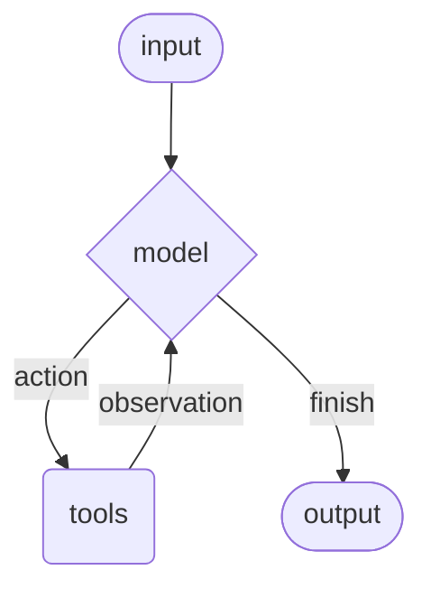

# LangChain

[LangChain](https://docs.langchain.com/oss/python/langchain/overview) 是一个应用框架，旨在简化使用大型语言模型的应用程序。

> [LangChain 文档](https://docs.langchain.com/oss/python/langchain/overview)
>
> [LangChain 参考](https://reference.langchain.com/python/langchain/)

LangChain 的核心价值在于**模块化**，主要组件包括：

- **Models**：提供统一的接口，让你可以轻松切换不同的大模型（如OpenAI、本地模型）。
- **Prompts**：高效地管理提示词模板，使交互更可控。
- **Indexes**：包含文档加载器、文本分割器和向量数据库检索器，专门用于处理外部数据。
- **Chains**：允许你将多个步骤（如提示、模型调用、输出解析）连接成一个完整的“工作链”。
- **Agents**：让大模型具备使用外部工具（如计算器、搜索引擎）的能力，以完成更复杂的任务。
- **Memory**：管理对话历史，实现有上下文的多轮对话。

## 基本实现

- 在项目根目录创建 [Python 虚拟环境](python.md#虚拟环境) 并激活。

- 安装必要库

  ```bash
  pip install -U langchain
  pip install -U langchain-google-genai
  pip install python-dotenv
  ```

- `.env`

  ```
  # 将 YOUR_API_KEY_HERE 替换为您真实的 Gemini API 密钥
  GEMINI_API_KEY="YOUR_API_KEY_HERE"
  ```

- `app.py`

  ```python
  from langchain.agents import create_agent
  import os
  from dotenv import load_dotenv
  from langchain_google_genai import ChatGoogleGenerativeAI
  
  # ---------------调用大模型---------------------
  # 读取 .env 文件并将 GEMINI_API_KEY 加载到环境中
  load_dotenv()
  
  # 读取 API 密钥
  GEMINI_API_KEY = os.getenv("GEMINI_API_KEY")
  
  # 检查 API 密钥是否已加载
  if not GEMINI_API_KEY:
      raise ValueError("GEMINI_API_KEY 未在环境变量中设置。请检查您的 .env 文件。")
  
  # 实例化模型
  llm = ChatGoogleGenerativeAI(model="gemini-2.5-flash", google_api_key=GEMINI_API_KEY)
  
  # ----------------定义工具-------------------------
  def get_weather(city: str) -> str:
      """Get weather for a given city."""
      return f"It's always sunny in {city}!"
  
  # ----------------创建并运行代理-------------------------
  agent = create_agent(
      model=llm,
      tools=[get_weather],
      system_prompt="You are a helpful assistant",
  )
  
  result = agent.invoke(
      {"messages": [{"role": "user", "content": "what is the weather in sf"}]}
  )
  
  print(result)
  ```

## 标准实现

- 在项目根目录创建 [Python 虚拟环境](python.md#虚拟环境) 并激活。

- 安装必要库

  ```bash
  pip install -U langchain
  pip install -U langchain-google-genai
  pip install python-dotenv
  ```

- `.env`

  ```
  # 将 YOUR_API_KEY_HERE 替换为您真实的 Gemini API 密钥
  GEMINI_API_KEY="YOUR_API_KEY_HERE"
  ```

- `app.py`

  ```python
  from langchain.agents import create_agent
  import os
  from dotenv import load_dotenv
  from langchain_google_genai import ChatGoogleGenerativeAI
  from langchain.tools import tool, ToolRuntime
  from dataclasses import dataclass
  from langgraph.checkpoint.memory import InMemorySaver
  
  # ---------------定义系统提示语---------------------
  SYSTEM_PROMPT = """你是一位精通双关语的专业天气预报员，请始终使用**中文**回答。
  
  你拥有以下两个工具：
  
  - get_weather_for_location: 用于获取特定地点的天气
  - get_user_location: 用于获取用户当前所在地点
  
  如果用户询问天气，请确保你知道地点。如果用户的问题暗示的是他们当前所在的位置，则使用 get_user_location 工具来查找他们的位置。
  **请注意：你的所有回复都必须是中文的，并且应包含中文的双关语或有趣的谐音梗。**"""
  
  # ---------------调用大模型---------------------
  # 读取 .env 文件并将 GEMINI_API_KEY 加载到环境中
  load_dotenv()
  
  # 读取 API 密钥
  GEMINI_API_KEY = os.getenv("GEMINI_API_KEY")
  
  # 检查 API 密钥是否已加载
  if not GEMINI_API_KEY:
      raise ValueError("GEMINI_API_KEY 未在环境变量中设置。请检查您的 .env 文件。")
  
  # 实例化模型
  llm = ChatGoogleGenerativeAI(model="gemini-2.5-flash", google_api_key=GEMINI_API_KEY)
  
  # ---------------定义上下文模式 context_schema---------------------
  @dataclass
  class Context:
      """Custom runtime context schema."""
  
      user_id: str
  
  # ---------------定义响应格式 response_format---------------------
  @dataclass
  class ResponseFormat:
      """Response schema for the agent."""
  
      punny_response: str
      weather_conditions: str | None = None
  
  # ---------------定义内存存储器---------------------
  checkpointer = InMemorySaver()
  
  # 会话标识符
  config = {"configurable": {"thread_id": "1"}}
  
  # ----------------定义工具-------------------------
  @tool
  def get_weather_for_location(city: str) -> str:
      """Get weather for a given city."""
      return f"It's always sunny in {city}!"
  
  @tool
  def get_user_location(runtime: ToolRuntime[Context]) -> str:
      """Retrieve user information based on user ID."""
      user_id = runtime.context.user_id
      return "Florida" if user_id == "1" else "SF"
  
  # ----------------创建代理-------------------------
  agent = create_agent(
      model=llm,
      system_prompt=SYSTEM_PROMPT,
      tools=[get_user_location, get_weather_for_location],
      context_schema=Context,
      response_format=ResponseFormat,
      checkpointer=checkpointer,
  )
  
  # ----------------运行代理-------------------------
  
  # 运行 Agent，传入用户消息和配置
  response = agent.invoke(
      {"messages": [{"role": "user", "content": "今天天气怎么样？"}]},
      config=config,  # 传入会话 ID，让 Agent 知道去哪里加载/存储记忆。
      context=Context(user_id="1"),  # 传入工具所需的运行时上下文数据（用户ID为 "1"）。
  )
  
  # 打印 Agent 最终的结构化回复
  print(response["structured_response"])
  # 预期输出示例：ResponseFormat(punny_response="...", weather_conditions="...")
  
  # 再次运行 Agent，使用相同的 `thread_id`，Agent 会自动加载第一次调用的历史记录。
  response = agent.invoke(
      {"messages": [{"role": "user", "content": "谢谢！"}]},
      config=config,  # 相同 config，继续会话 ID "1" 的历史。
      context=Context(user_id="1"),  # 仍然传入上下文数据。
  )
  
  # 打印 Agent 最终的结构化回复
  print(response["structured_response"])
  # 预期输出示例：ResponseFormat(punny_response="You're 'thund-erfully' welcome!...", weather_conditions=None)
  ```

# Agents

[Agents](https://docs.langchain.com/oss/python/langchain/agents) 组件用于创建 Agent。让大模型具备使用外部工具（如计算器、搜索引擎）的能力，以完成更复杂的任务。



## 基本实现

```
pip install -U langchain
```

```python
from langchain.agents import create_agent

# 创建 Agent
agent = create_agent(
    model=llm,
    tools=[get_weather],
    system_prompt="You are a helpful assistant",
)

# 运行 Agent
agent.invoke(
    {"messages": [{"role": "user", "content": "what is the weather in sf"}]}
)
```

**在以上代码中：**

- [`create_agent()`](https://reference.langchain.com/python/langchain/agents/?_gl=1*z2ejvz*_gcl_au*NDczNTIxMDkyLjE3NjEzODI3OTI.*_ga*MjE5MjYzNzI5LjE3NjE1NTY1MzU.*_ga_47WX3HKKY2*czE3NjIwODQyMDAkbzI4JGcxJHQxNzYyMDg0MzczJGo2MCRsMCRoMA..#langchain.agents.create_agent)：用于创建 Agent。
- `model=llm` ：`llm` 为之前创建的实例化模型。
- `tools=[get_weather]` ：`get_weather` 为之前创建的工具。

## `checkpointer`

[`checkpointer`](https://reference.langchain.com/python/langchain/agents/?h=checkpointer#langchain.agents.create_agent(checkpointer)) 用于持久化单个线程（例如，单个对话）的 graph 状态（例如，作为聊天内存）。

```python
from langgraph.checkpoint.memory import InMemorySaver

# 定义内存存储器
checkpointer = InMemorySaver()

# `thread_id` 是一个唯一标识符，用于 Checkpointer 存储和检索特定的会话历史。
config = {"configurable": {"thread_id": "1"}}

# 向 Agent 传入 checkpointer
agent = create_agent(
    # ... 其他参数
    checkpointer=checkpointer
)

# 运行 Agent，传入 config
response = agent.invoke(
    {"messages": [{"role": "user", "content": "what is the weather outside?"}]},
    config=config,  # 传入会话 ID，让 Agent 知道去哪里加载/存储记忆。
    context=Context(user_id="1"),
)

# 再次运行 Agent，使用相同的 `thread_id`，Agent 会自动加载第一次调用的历史记录。
response = agent.invoke(
    {"messages": [{"role": "user", "content": "thank you!"}]},
    config=config,  # 相同 config，继续会话 ID "1" 的历史。
    context=Context(user_id="1"),
)
```

## `context_schema`

`context_schema` 上下文模式，用于定义用户的**元数据**，Agent 在运行时可以识别用户。

```python
from dataclasses import dataclass

# 定义 schema
@dataclass
class Context:
    """Custom runtime context schema."""

    user_id: str

# 在定义工具时，传入 schema
@tool
def get_user_location(runtime: ToolRuntime[Context]) -> str:
    """Retrieve user information based on user ID."""
    user_id = runtime.context.user_id
    return "Florida" if user_id == "1" else "SF"

# 传入 Agent
agent = create_agent(
    # ... 其他参数
    context_schema=Context
)

# 在回应时，传入 schema
response = agent.invoke(
    # ... 其它消息和配置
    
    context=Context(user_id="1")
)
```

## `response_format`

`response_format` 响应格式，

```python
# 定义响应格式
@dataclass
class ResponseFormat:
    """Response schema for the agent."""

    punny_response: str
    weather_conditions: str | None = None

# 传入 Agent
agent = create_agent(
    # ... 其他参数
    response_format=ResponseFormat
)
```


# Models

[Models](https://docs.langchain.com/oss/python/langchain/models) 组件用于调用并实例化 LLM。

## 设置 API

LLM 的 API，此处使用 [免费的 Google AI Studio 的 API](https://aistudio.google.com/api-keys)，有两种设置方法：

### `.env`

```
# 将 YOUR_API_KEY_HERE 替换为您真实的 Gemini API 密钥
GEMINI_API_KEY="YOUR_API_KEY_HERE"
```

```bash
pip install python-dotenv
```

```python
import os
from dotenv import load_dotenv

# 读取 .env 文件并将 GEMINI_API_KEY 加载到环境中
load_dotenv()

# 读取 API 密钥
GEMINI_API_KEY = os.getenv("GEMINI_API_KEY")

# 检查 API 密钥是否已加载，可选。
if not GEMINI_API_KEY:
    raise ValueError("GEMINI_API_KEY 未在环境变量中设置。请检查您的 .env 文件。")
```

### 终端加载

```bash
# 设置环境变量
export GOOGLE_API_KEY="YOUR_API_KEY_HERE"

# 检查环境变量，如果返回 API，则代表设置成功。
echo $GOOGLE_API_KEY
```

## 实例化模型

LangChain Python 提供了很多丰富的[集成包](https://docs.langchain.com/oss/python/integrations/providers/overview)，此处以 Gemini 为例。

```bash
pip install -U langchain-google-genai
```

```python
from langchain_google_genai import ChatGoogleGenerativeAI

llm = ChatGoogleGenerativeAI(model="gemini-2.5-flash", google_api_key=GEMINI_API_KEY)
```

**在以上代码中：**

- `GEMINI_API_KEY` 为从 `.env` 文件读取到的 API。
- 不要使用 `gemini-2.5-pro` 模型，以防配额超限。

# Prompts

Prompts 用于管理提示词模板，使交互更可控。

```python
SYSTEM_PROMPT = """You are an expert weather forecaster, who speaks in puns.

You have access to two tools:

- get_weather_for_location: use this to get the weather for a specific location
- get_user_location: use this to get the user's location

If a user asks you for the weather, make sure you know the location. If you can tell from the question that they mean wherever they are, use the get_user_location tool to find their location."""

agent = create_agent(
    model=llm,
    # 传入 SYSTEM_PROMPT 组件
    system_prompt=SYSTEM_PROMPT,
    
    # 传入其它组件
)
```

# Tools

[Tools](https://docs.langchain.com/oss/python/langchain/tools) 组件为 Agent 提供各种工具。

```python
from langchain.tools import tool, ToolRuntime

@tool
def get_weather_for_location(city: str) -> str:
    """Get weather for a given city."""
    return f"It's always sunny in {city}!"

SYSTEM_PROMPT = """You are an expert weather forecaster, who speaks in puns.

You have access to two tools:

- get_weather_for_location: use this to get the weather for a specific location
- get_user_location: use this to get the user's location

If a user asks you for the weather, make sure you know the location. If you can tell from the question that they mean wherever they are, use the get_user_location tool to find their location."""
```

**在以上示例中：**

- `"""Get weather for a given city."""`：文档字符串，代替函数体，告诉模型将执行的操作。
- 在提示词中告诉模型，用这个工具干什么。

