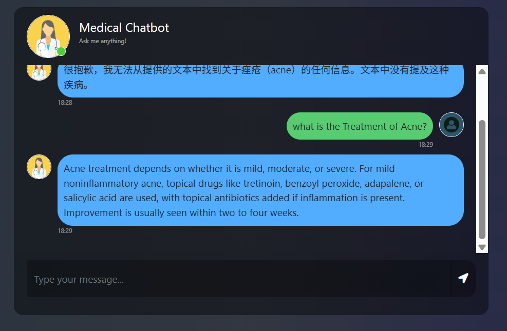

# medical-chatbot-full-stack



- **概述**：这是一个从 0 到 1 的 AI Agent 开发及部署项目。
- **来源**：YouTube 博主 [Build a Complete Medical Chatbot with LLMs, LangChain, Pinecone, Flask & AWS](https://www.youtube.com/watch?v=KnoVFU0yCUc&list=PLkz_y24mlSJa5JQCRA519psvRqTMqxvMv&index=13)
- **功能**：AI Agent 根据给定的 PDF 文件，回答问题。
- **技术栈**：Langchain、Pinecone、Flask、AWS
- **存储**
  - 代码存储在 Git 托管平台：前后端合并存储 `medical-chatbot-full-stack`
  - 无镜像存储在 DockerHub

# 本地开发

## 文件夹结构

创建 `template.sh` 脚本文件，然后运行脚本

```bash
sh template.sh
```

## 虚拟环境

使用 `conda` 命令创建并激活虚拟环境

## `requirements.txt`

项目依赖，用 `langchain-google-genai==2.1.12` 代替了原教程的 `openai`。

## `setup.py`

## `trials.ipynb`

- Jupyter 编程
- 右上角选择虚拟环境 `medical`
- VS Code 自动安装了 Jupyter 扩展
- 写了一堆代码
- 在 `.env` 文件中添加了环境变量

### 处理 PDF 文件

- 加载文档
- 过滤
- 分块

### 环境变量

### 向量数据库

- 下载嵌入模型
- 初始化 Pinecone 客户端
- 创建 Pinecone 索引
- 创建 Pinecone 向量存储
- 加载现有索引
- 创建检索器
- 检索文档

### 聊天模型

- 初始化聊天模型
- 创建提示模板
- 创建 RAG 链

## 模块化编程

- 原作者在编写各个文件时，与 Jupyter 中相比，修改了一些变量。
- `setup.py`：初始化
- `store_index.py`：创建向量数据库并存储向量
- `prompt.py`：提示词
- `helper.py`：函数
- `app.py`：主程序
- 本地运行正常

# GitLab CI

生成 Image 未成功。

# 部署至云服务器

- **遗憾**：由于没有找到免费的且可访问国际网络的云服务器，所以没有进行云部署。
- 源代码
  - `Dockerfile`
  - `.github/workflows/cicd.yaml`
- 创建实例
  - 升级 `apt`
  - 安装 Docker
- 创建云服务镜像仓库（比如腾讯云的 TCR）
  - 仓库域名：ccr.ccs.tencentyun.com
  - 仓库用户名：100044782299
  - 仓库密码：TCR110120
- 创建 GitHub Action
  - 远程仓库/`Settings`/`Actins`/`Runners`
  - 新建自托管：`New self-hosted runner`
    - 选择 `Linux`
    - 在虚拟机实例中执行 GitHub 推荐的命令，详见具体页面。
- 在 AWS 终端执行 GitHub Action 的命令，可以使二者建立连接。
- 在 GitHub 添加各种密钥的环境变量
