# Overview

# Install

- [官网下载 MusicBee](https://getmusicbee.com/downloads/)（网盘里有便携版安装包）。

- 选择 `Installer Edition` 版本可以集成到系统中。

  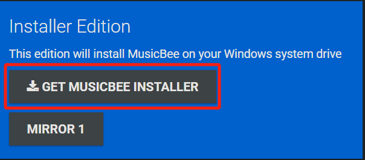

- 如果安装便携版安装之后需手动加入开始菜单，详见 [`Windows | 加入开始菜单`](windows.md#加入开始菜单)。

- 先建立本地音乐库，并持续监控。

  - `MusicBee` > `文件` > `库` > `建立新的音乐库`

    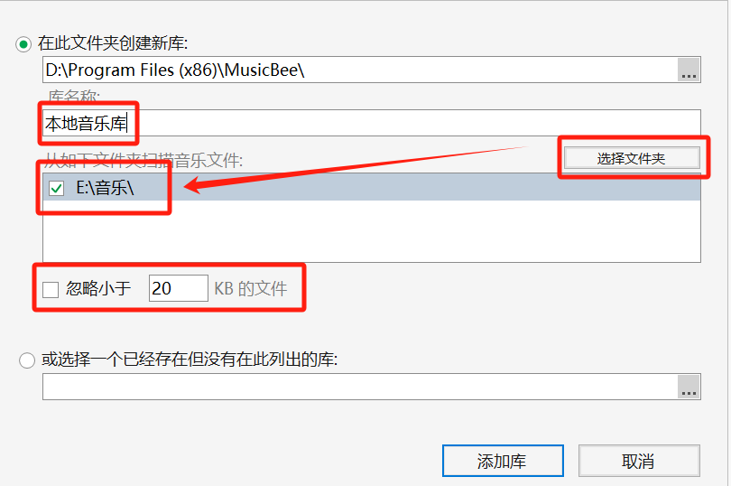

  - `主菜单` > `首选项` > `库` > `监控的文件夹`

    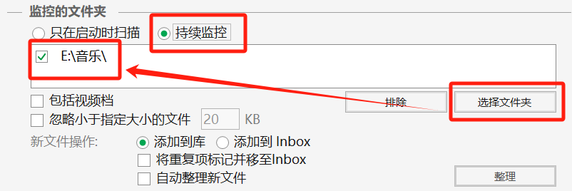

# 布局备忘

## 面板布局设计

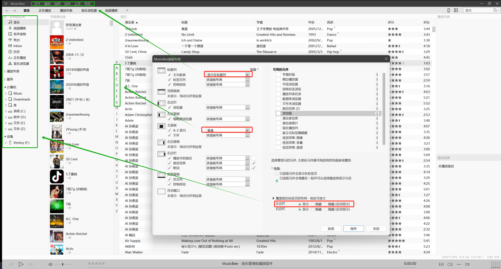

## 布局1

`首选项` > `布局1`

<div style="display: flex; justify-content: center;">
  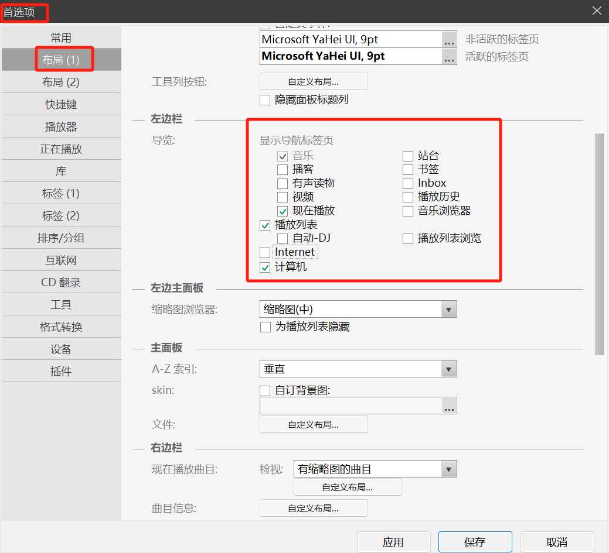
  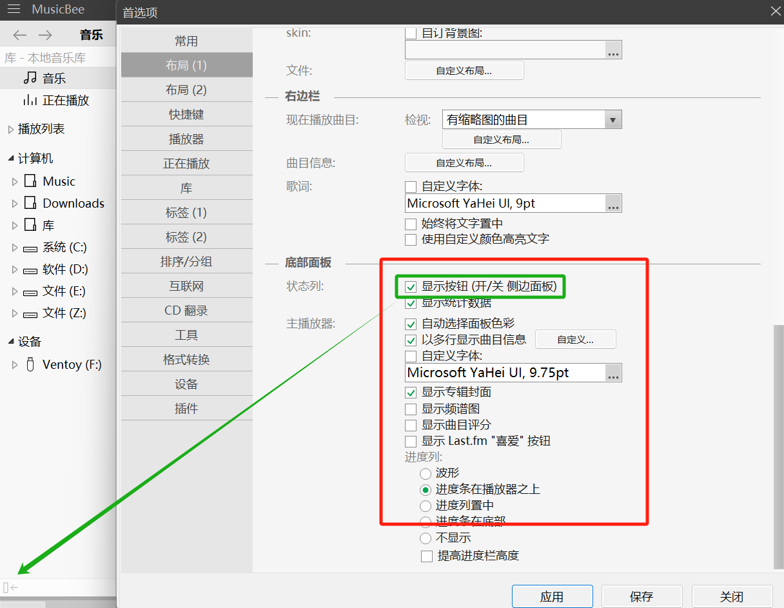
</div>

## 布局2

`首选项` > `布局2`

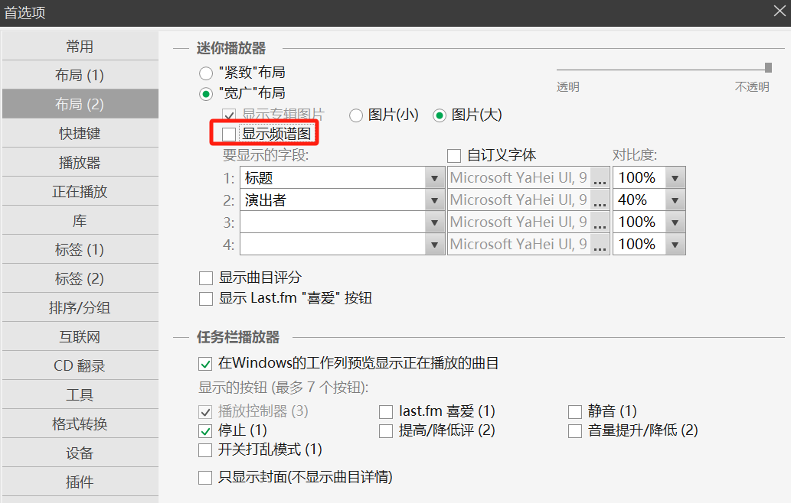

## 标签1

`首选项` > `标签1`

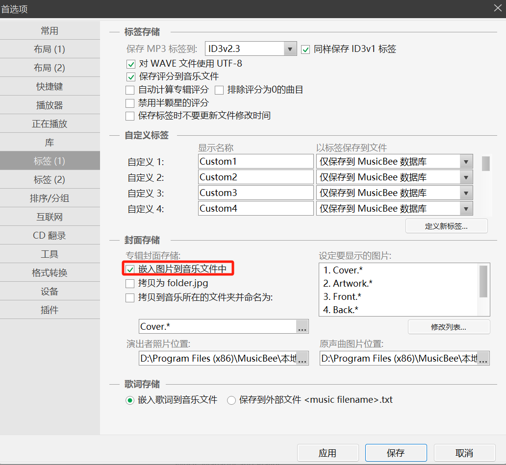

## 字段

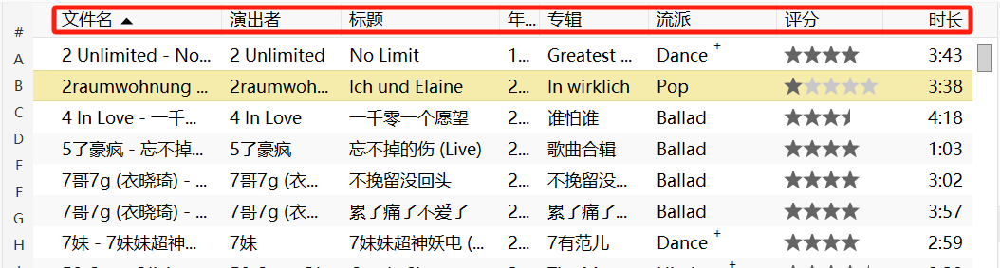

## 工具栏自定义按钮

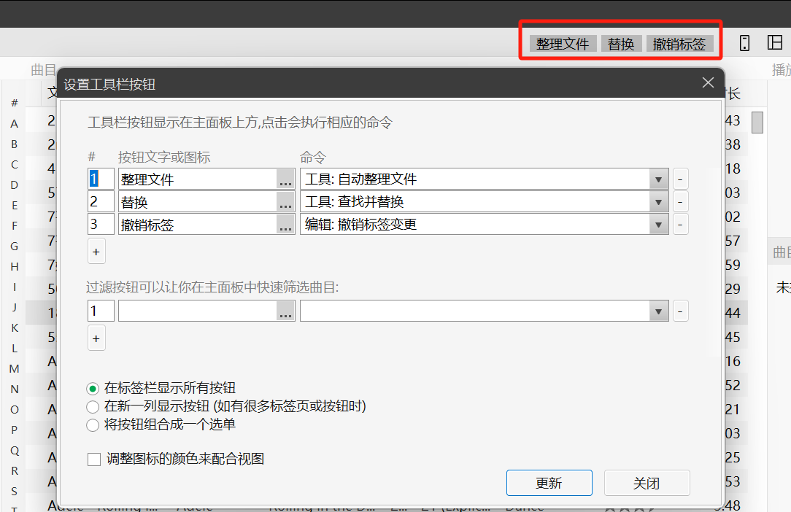

## 编辑工具在主面板显示

<div style="display: flex; justify-content: center;">
  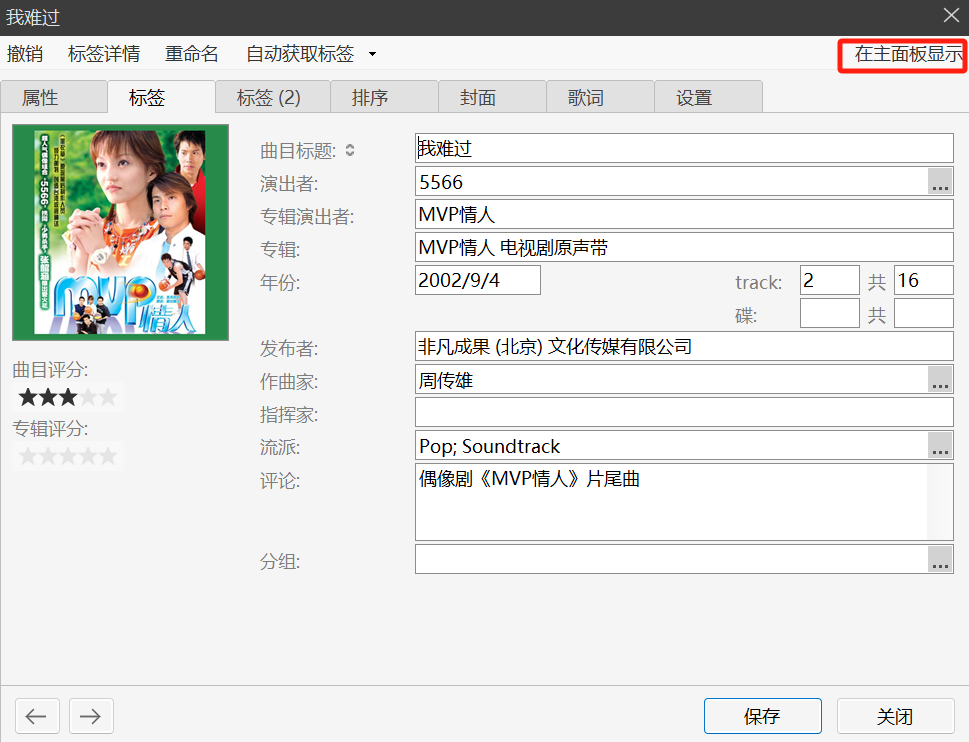
  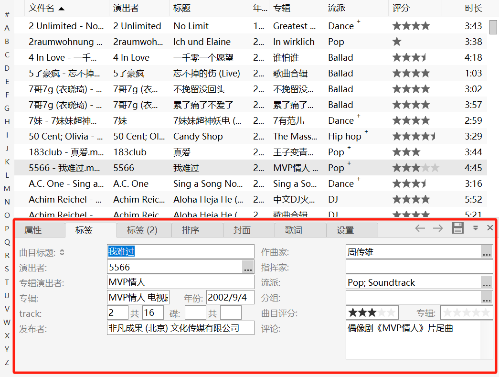
</div>

## 曲目信息

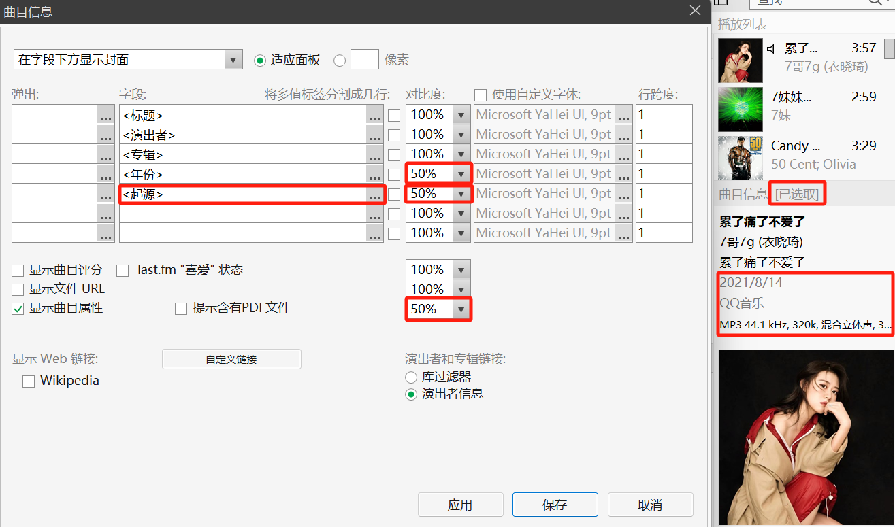

## 双排演出者显示

右键 > `面板布局` > `自订`

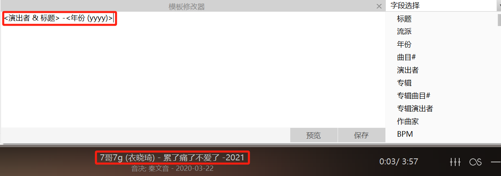

```
# 第一行
<演出者 & 标题> - <年份 (yyyy)>

# 第二行
<原演出者> - <原本年份>
```

# 布局与配置

- 首先说明的是，这个软件很灵活，不同地方可以设置同一个功能，并且名字有可能会不同
- 标题列：标题列就是右上角的工具和搜索

  - 主功能表：普通软件的菜单栏
  - 标签页列：首选项里的布局（1）
  - 控制按钮：右上角的自定义工具栏

- 顶部面板
- 左边栏
- 左边栏
- 左边面板
- 主面板
- 右边面板
- 右边栏
- 底部面板
- 浮动窗口