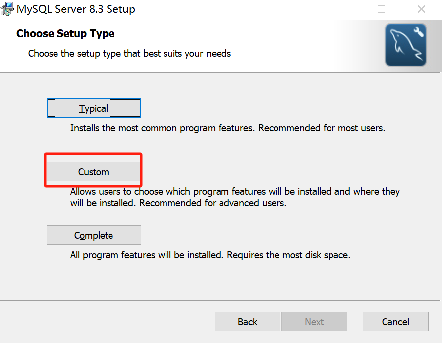
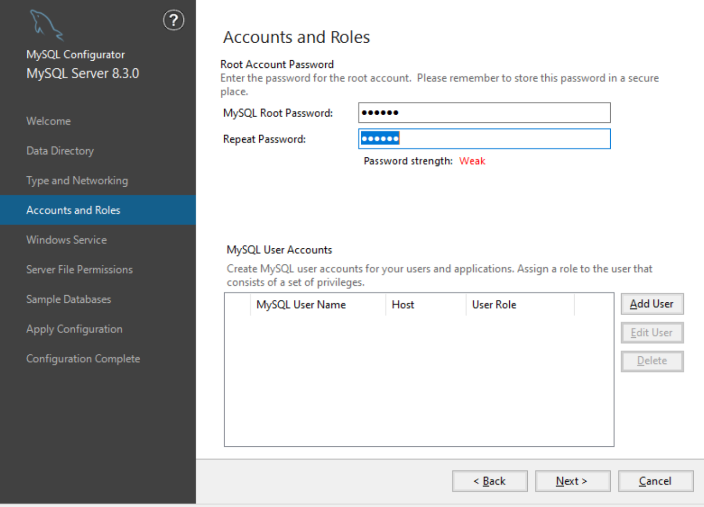

# MySQL

MySQL 是一个关系型数据库管理系统，由瑞典 MySQL AB 公司开发，属于 Oracle 旗下产品。MySQL 使用 C 和 C++ 编写，使用标准的 SQL 语言操作数据库，支持多线程，是最流行的关系型数据库管理系统之一。

## MySQL 环境搭建

### Windows MySQL

#### 安装

- 尽量使用容器化的 MySQL；

- 以下步骤详见《我要自学网 Python 课程》软件安装包说明；

- 安装之前创建一个系统还原点，以防不测；

- 安装之前，要先彻底卸载之前残留的版本；

- [官网下载 MySQL：**Windows (x86, 64-bit), MSI Installer**](https://dev.mysql.com/downloads/mysql/)；

- 开始安装，安装方式选择 `custom`；

  

- 安装完成之后会出现 MySQL 配置的引导界面；

- Data Directory：`D:\ProgramData\MySQL\MySQL Server 8.3\`；

- Type and Networking：`Config Type` 选择 `DeveloperMachine`；

  

- 创建 root 账户

  

- Apply Configuration：`Execute`

  

- 将 MySQL 加入系统环境变量，详见《Windows 笔记》。

- 安装完成，检查

  ```bash
  # 查看版本
  mysql --version
  # 登录
  mysql -u root -p
  ```

#### 卸载

- 详见《我要自学网 Python 课程》软件安装包说明；
- 必须先停止 MySQL 服务！！

  - `控制面板` > `系统与安全` > `管理工具` > `服务界面`；
  - 找到 MySQL 服务，右键点击该服务，选择 `停止`；
  - 服务停止完毕后，右键点击 MySQL 服务，选择 `属性`，进入属性窗口；
  - 在属性窗口中，找到 `启动类型`，将其改为 `手动`；
  - 点击 `确定` 保存设置，关闭窗口；

- 停止 MySQL 服务后，删除 MySQL 服务；

  - 打开命令提示符窗口（管理员权限）；
  - 输入 `sc delete MySQL`，执行删除操作；

- 卸载 MySQL，并删除安装目录；
- 删除安装盘下 `D:\ProgramData\MySQL` 文件夹（可能需要取消隐藏），里面包含了上一次安装的数据库中的所有数据、用户名和密码；
- 打开注册表：`regedit.exe`，删除以下注册表，如果没有可以不删；

  - `HKEY_LOCAL_MACHINE\SYSTEM\ControlSet001\Services\Eventlog\Application\MySQL ` 文件夹
  - `HKEY_LOCAL_MACHINE\SYSTEM\ControlSet002\Services\Eventlog\Application\MySQL` 文件夹
  - `HKEY_LOCAL_MACHINE\SYSTEM\CurrentControlSet\Services\Eventlog\Application\MySQL` 文件夹

- 完全卸载了以后就可以正常重新安装了；
- 如想彻底删除，记得删除安装时自己配置的系统环境变量；

### 容器化 MySQL

- Docker 已运行。

- 运行容器

  ```bash
  docker run --name mysql-container \
  -e MYSQL_ROOT_PASSWORD=123456 \
  -e MYSQL_USER=jerry \
  -e MYSQL_PASSWORD=000000 \
  -e MYSQL_DATABASE=mysql_db \
  -p 3306:3306 \
  -d mysql:8.0
  ```

  **在以上代码中**：

  - `--name mysql-container`：容器名称
  - `-e MYSQL_ROOT_PASSWORD=123456`：MySQL 的 root 用户密码
  - `-e MYSQL_DATABASE=mysql_db`：Database 名称
  - `-p 3306:3306`：端口映射
  - `-d`：让容器在后台运行
  - `mysql:8.0`：镜像及版本号

- 接下来可使用 Navicat 操作 MySQL。

- 如果想在命令行中操作 MySQL，可进入容器内 MySQL 交互界面。

  ```bash
  docker exec -it mysql-container mysql -uroot -p
  ```

  **在以上代码中**：

  - **`-it`**：以交互模式运行命令，并且分配一个伪终端。

  - **`mysql-container`**：容器名

  - **`mysql -uroot -p`**：以 root 用户登录 MySQL，并输入密码，输入密码以后就会进入 MySQL 命令行界面，进而使用 SQL 语言操作 MySQL。

    ```bash
    mysql>
    ```

### XAMPP

使用 XAMPP 可以模拟一个 MySQL 数据库，详见 [XAMPP 笔记](software.md#xampp)。

## MySQL 交互方式

- **命令行客户端**：`mysql`
- **编程语言客户端**：如 Python 的 `pymysql`
- **ORM**：如 Python 的 `sqlalchemy`
- **GUI 工具**：如 `Navicat`

## MySQL 基础

- **语法规范**

  - MySQL 遵循 [SQL](../../code-language/sql/sql.md) 标准语法。

- **MySQL 管理**

  ```bash
  # 查看版本
  mysql --version
  # 登录
  mysql -u $USER -p
  ```

  ```sql
  -- 退出 MySQL server
  EXIT;
  
  -- 设置 MySQL server 密码
  SET PASSWORD = PASSWORD('$PASSWORD');
  
  -- 查看所有用户
  SELECT USER, HOST FROM MYSQL.USER;
  -- 使用 root 登录，并授权 jerry，否则 jerry 不能操作数据库
  GRANT ALL PRIVILEGES ON `$DATABASE`.`$TABLE` TO 'jerry'@'%';
  ```

- **其它问题**

  ```sql
  -- 查看 database 字符集
  show variables like 'character_set_database';
  -- 设置客户端和服务端之间的字符集
  set names 'utf8';
  ```

## MySQL 命令样板

- **创建 Database**

  ```sql
  CREATE DATABASE IF NOT EXISTS db_users DEFAULT CHARACTER SET utf8;
  ```

- **创建 Table**

  ```sql
  CREATE TABLE IF NOT EXISTS tb_users (
      id INT NOT NULL AUTO_INCREMENT PRIMARY KEY,
      username VARCHAR(16) NOT NULL UNIQUE,
      password VARCHAR(255) NOT NULL
  ) DEFAULT CHARSET=utf8;
  ```

## 解决办法

### 忘记密码

- 关于忘记密码，需先进入无授权模式，改完之后再切换回正常模式。